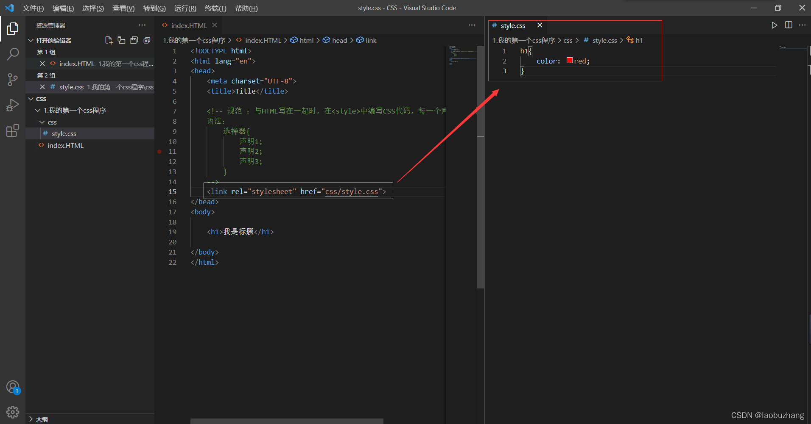
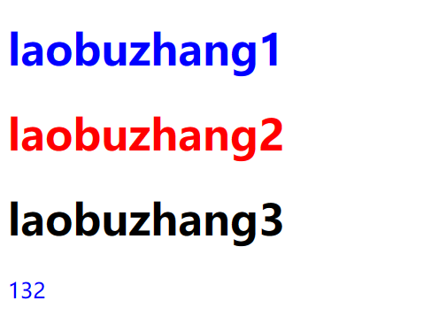
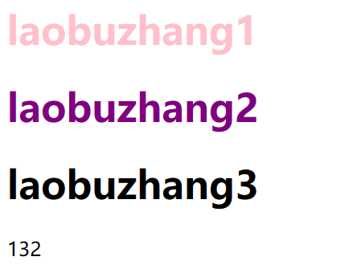
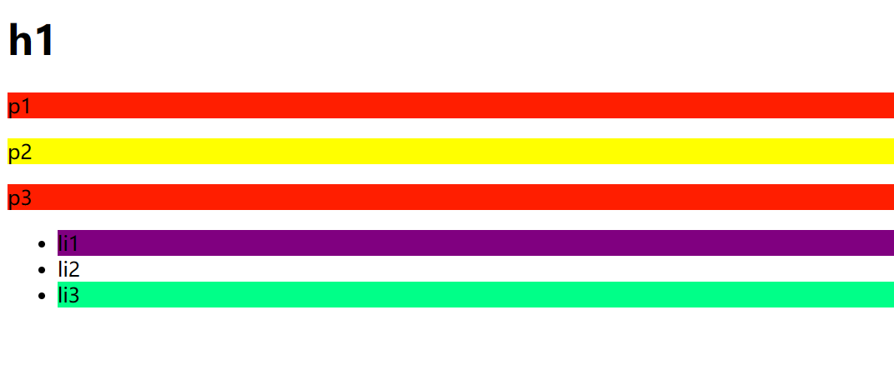
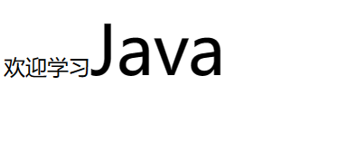
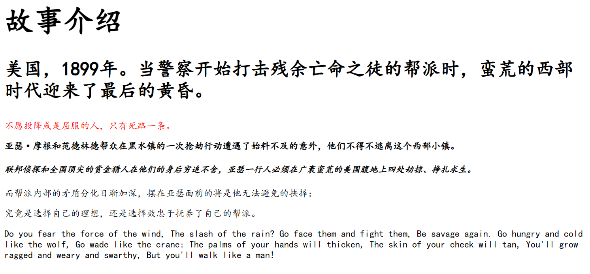
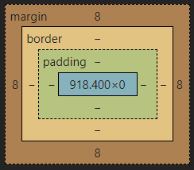
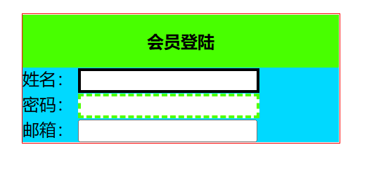
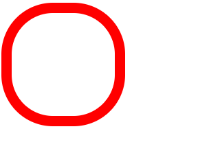
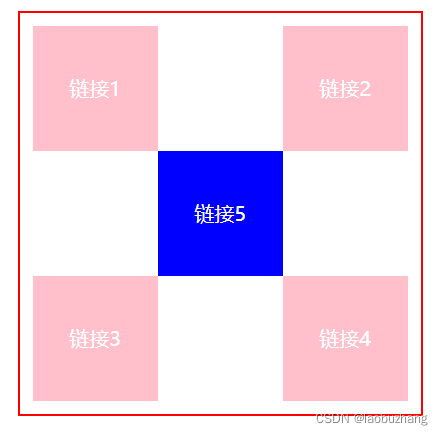

# CSS学习笔记

CSS3主要用来美化网页，给标签添加一些属性，也可以制作简单动画

## 1.CSS简介

### 1.1.什么是CSS

Cascading Style Sheet 层叠级联样式表

CSS：表现（美化网页）

字体、颜色、边距、网页定位……

~~~html
<!DOCTYPE html>
<html lang="en">
<head>
    <meta charset="UTF-8">
    <title>Title</title>

    <!-- 规范 ：与HTML写在一起时，在
</head>
<body>
    
    <!-- 样式优先级：就近原则（谁里元素更近就听谁的，一般行内是最近的，外部和内部看谁的代码更靠下） -->

    <!-- 行内样式：在标签元素中，编写一个style属性，编写样式即可 -->
    <h1 style="color: red;">我是标题</h1>
</body>
</html>
~~~

~~~css
/*外部样式*/
h1{
    color: yellow;
}
~~~

拓展：外部样式两种写法

- 链接式：

  html

  ~~~html
  <!-- 外部样式 -->
  <link rel="stylesheet" href="css/style.css">
  ~~~

- 导入式

  @import是CSS 2.1特有的！

  ~~~html
  
  ~~~

## 2.*选择器

​	作用：选择页面上的某一个或者某一类元素

### 2.1.*基本选择器

1. 标签选择器：选择一类标签      标签{}

   ~~~html
   <!DOCTYPE html>
   <html lang="en">
   <head>
       <meta charset="UTF-8">
       <title>Document</title>
   
       
   
   </head>
   <body>
       <h1>laobuzhang</h1>
       <h1>老部长</h1>
       
帅

   </body>
   </html>
   ~~~

   效果

   

2. 类选择器 class：选择所有class属性一致的标签，可跨标签      .类名{}

   ~~~html
   <!DOCTYPE html>
   <html lang="en">
   <head>
       <meta charset="UTF-8">
       <title>Document</title>
   
       
   </head>
   <body>
       
   
       <h1 class="lao">laobuzhang1</h1>
       <h1 class="bu">laobuzhang2</h1>
       <h1>laobuzhang3</h1>
       
132

   </body>
   </html>
   ~~~

   效果

   

3. id 选择器：全局唯一      #id名称{}

   ~~~html
   <!DOCTYPE html>
   <html lang="en">
   <head>
       <meta charset="UTF-8">
       <title>Document</title>
   
       
   </head>
   <body>
       
       <h1 id="lao">laobuzhang1</h1>
       <h1 class="bu">laobuzhang2</h1>
       <h1>laobuzhang3</h1>
       
132

   
   </body>
   </html>
   ~~~
   
   效果
   
   

**优先级：**id选择器>class选择器>标签选择器

### 2.2.层次选择器

1. 后代选择器：在某个元素的后边       祖爷爷  爷爷  爸爸  你

   ~~~css
   /* 后代选择器 */
   body p{
   	background: red;
   }
   /* body中所有p标签都选择 */
   ~~~

2. 子选择器：一代，儿子

   ~~~css
   /* 子选择器 */
   body>p{
   	background: yellow;
   }
   /* body中第一层级的p标签都选择 */
   ~~~

3. 相邻兄弟选择器（弟弟选择器）：同辈，只选一个，相邻的下边那一个

   ~~~css
   /* 相邻兄弟选择器 */
   .active+p{
   	background: green;
   }
   /* 选择类为active的标签的下边的那一个p标签 */
   ~~~

4. 通用选择器

   ~~~css
   /* 通用选择器 */
   .active~p{
   	background: pink;
   }
   /* 选择类为active的标签下边的所有同级p标签，不包括自己 */
   ~~~

~~~html
<!DOCTYPE html>
<html lang="en">
<head>
    <meta charset="UTF-8">
    <title>Document</title>

    
</head>
<body>
    
    
p0

    
p1

    
p2

    
p3

    <ul>
        <li>
            
p4

        </li>
        <li>
            
p5

        </li>
        <li>
            
p6

        </li>
    </ul>

	
p7

	
p8

</body>
</html>
~~~

### 2.3.结构伪类选择器

~~~html
<!DOCTYPE html>
<html lang="en">
<head>
    <meta charset="UTF-8">
    <title>Document</title>

    
</head>
<body>
    <h1>h1</h1>
    
p1

    
p2

    
p3

    <ul>
        <li>li1</li>
        <li>li2</li>
        <li>li3</li>
    </ul>
</body>
</html>
~~~

效果

### 2.4.*属性选择器（常用）

id+class  结合

~~~html
<!DOCTYPE html>
<html lang="en">
<head>
    <meta charset="UTF-8">
    <title>Document</title>

    
</head>
<body>
    

    

        <a href="http://www.baidu.com" class="links item first" id="first">1</a>
        <a href="" class="links item active" target="_blank" title="test">2</a>
        <a href="../1.我的第一个css程序/index.HTML" class="links item">3</a>
        <a href="../1.我的第一个css程序/index.png" class="links item">4</a>
        <a href="../1.我的第一个css程序/index.jpg" class="links item">5</a>
        <a href="abc" class="links item">6</a>
        <a href="/a.pdf" class="links item">7</a>
        <a href="/abc.pdf" class="links item">8</a>
        <a href="abc.doc" class="links item">9</a>
        <a href="abcd.doc" class="item last" id="last">10</a>
    

</body>
</html>
~~~

效果

## 3.美化网页元素

### 3.1.为什么要美化网页

1. 有效传递信息
2. 页面漂亮，吸引用户
3. 凸显页面主题
4. 提高用户体验

span标签：重点要突出的字使用span标签套出来

~~~html
<!DOCTYPE html>
<html lang="en">
<head>
    <meta charset="UTF-8">
    <title>Document</title>

    
</head>
<body>

    <!-- 用其他的随意单词也行，但是约定俗称用span -->
    欢迎学习Java
    
</body>
</html>
~~~

### 3.2.字体样式

**主要使用font属性**

~~~html
<!DOCTYPE html>
<html lang="en">
<head>
    <meta charset="UTF-8">
    <title>Document</title>

    <!-- 
        font-family 字体
        font-size 字体大小
        font-weight 字体粗细
     -->
    
</head>
<body>

    <h1>故事介绍</h1>
    
美国，1899年。当警察开始打击残余亡命之徒的帮派时，蛮荒的西部时代迎来了最后的黄昏。

    
不愿投降或是屈服的人，只有死路一条。

    
亚瑟·摩根和范德林德帮众在黑水镇的一次抢劫行动遭遇了始料不及的意外，他们不得不逃离这个西部小镇。

    
联邦侦探和全国顶尖的赏金猎人在他们的身后穷追不舍，亚瑟一行人必须在广袤蛮荒的美国腹地上四处劫掠、挣扎求生。

    
而帮派内部的矛盾分化日渐加深，摆在亚瑟面前的将是他无法避免的抉择：

    
究竟是选择自己的理想，还是选择效忠于抚养了自己的帮派。

    

        Do you fear the force of the wind,
        The slash of the rain?
        Go face them and fight them,
        Be savage again.
        Go hungry and cold like the wolf,
        Go wade like the crane:
        The palms of your hands will thicken,
        The skin of your cheek will tan,
        You'll grow ragged and weary and swarthy,
        But you'll walk like a man!
    

</body>
</html>
~~~

效果

### 3.3.文本样式

1. 颜色    color  rgb rgba
2. **文本对齐方式    text-align=center**
3. **首行缩进    text-indent: 2em**
4. **行高**    line-height: 单行文字上下居中：行高=块高
5. 装饰（下划线，删除线……）text-decoration:
6. 文本和图片水平对齐    vertical-align: middle;

~~~html
<!DOCTYPE html>
<html lang="en">
<head>
    <meta charset="UTF-8">
    <title>Document</title>

    <!-- 
        颜色：
            单词
            rgb(a,b,c)
            rgba(a,b,c,d)  d:0~1 透明度
            #RGB
            
        text-align ：排版，居中
        text-indent : 首行缩进
        height ： 块高
        line-height ： 行高
     -->
    
</head>
<body>

    
123

    
456

    
789

    <h1>故事介绍</h1>
    
美国，1899年。当警察开始打击残余亡命之徒的帮派时，蛮荒的西部时代迎来了最后的黄昏。

    
不愿投降或是屈服的人，只有死路一条。

    
亚瑟·摩根和范德林德帮众在黑水镇的一次抢劫行动遭遇了始料不及的意外，他们不得不逃离这个西部小镇。

    
联邦侦探和全国顶尖的赏金猎人在他们的身后穷追不舍，亚瑟一行人必须在广袤蛮荒的美国腹地上四处劫掠、挣扎求生。

    
而帮派内部的矛盾分化日渐加深，摆在亚瑟面前的将是他无法避免的抉择：

    
究竟是选择自己的理想，还是选择效忠于抚养了自己的帮派。

    

        Do you fear the force of the wind,
        The slash of the rain?
        Go face them and fight them,
        Be savage again.
        Go hungry and cold like the wolf,
        Go wade like the crane:
        The palms of your hands will thicken,
        The skin of your cheek will tan,
        You'll grow ragged and weary and swarthy,
        But you'll walk like a man!
    

    

        
        asdasasdasd
    

</body>
</html>
~~~

### 3.4.阴影

~~~css
/* 阴影：阴影颜色 水平偏移 垂直偏移 阴影半径 */
#price{
	text-shadow: rgb(0, 225, 255) 5px 0px 2px;
}
~~~

### 3.5.超链接伪类

鼠标与链接的交互

1. link-设置a对象在未被访问前的样式表属性。
2. visited-设置a对象在其链接地址已被访问过时的样式表属性。
3. hover–设置对象在其鼠标悬停时的样式表属性。
4. active-设置对象在被用户激活（在鼠标点击与释放之间发生的事件）时的样式表属性。

~~~html
<!DOCTYPE html>
<html lang="en">
<head>
    <meta charset="UTF-8">
    <title>Document</title>

    <!-- 正确的顺序：a:link、a:visited、a:hover、a:active -->
    
</head>
<body>
    
    

        <a href="#">码出高效：Java开发手册</a>
    

    

        <a href="">作者：孤尽老师</a>
    

    

        ￥99
    

</body>
</html>
~~~

### 3.6.列表

div标签：没有作用的空标签，可以加上id以实现对一整段标签的操作

~~~html
<!DOCTYPE html>
<html lang="en">
<head>
    <meta charset="UTF-8">
    <title>Document</title>
    <link rel="stylesheet" href="css/style.css">
</head>
<body>

    <!-- div:没有作用的空标签 -->
    

        <h2 class="title">全部商品分类</h2>
        <ul>
           <li><a href="#">图书</a>&nbsp;&nbsp;<a href="#">PS4</a>&nbsp;&nbsp;<a href="#">XBOX</a></li>
          <li><a href="#">图书</a>&nbsp;&nbsp;<a href="#">PS4</a>&nbsp;&nbsp;<a href="#">XBOX</a></li>
          <li><a href="#">图书</a>&nbsp;&nbsp;<a href="#">PS4</a>&nbsp;&nbsp;<a href="#">XBOX</a></li>
         <li><a href="#">图书</a>&nbsp;&nbsp;<a href="#">PS4</a>&nbsp;&nbsp;<a href="#">XBOX</a></li>
         <li><a href="#">图书</a>&nbsp;&nbsp;<a href="#">PS4</a>&nbsp;&nbsp;<a href="#">XBOX</a></li>
         <li><a href="#">图书</a>&nbsp;&nbsp;<a href="#">PS4</a>&nbsp;&nbsp;<a href="#">XBOX</a></li>
    </ul>
    

</body>
</html>
~~~

~~~css
#nav{
    width: 250px;
    background: rgb(231, 221, 221);
}

h2{
    font-size: 30px;
    font-weight: bold;
    text-indent: 1em;
    line-height: 35px;
    background: red;
}

/* ul li
list-style:
    none 去掉原点
    citcle 空心圆
    decimal 数字
    square 正方形
*/
ul li{
    height: 30px;
    list-style: none;
    text-indent: 1em;
}
ul{
    background: rgb(231, 221, 221);
}

a{
    text-decoration: none;
    font-size: 15px;
    color: black;
}
a:hover{
    color: orange;
    text-decoration: underline;
}
~~~

### 3.7.背景

- 背景颜色
- 背景图片

~~~css
h2{
    font-size: 20px;
    font-weight: bold;
    text-indent: 3em;
    line-height: 35px;
    /*          颜色      图片                图片位置x，y坐标   图片重复方式*/
    background: red url("../images/箭头2.png") 215px 2px no-repeat;
}
~~~

~~~css
background-image: url("../images/箭头3.png");
background-repeat: no-repeat;
background-position: 180px 4px;
~~~

### 3.8.渐变

[渐变背景网站](https://www.grabient.com/ )

~~~css
body{
	background-color: #4158D0;
	background-image: linear-gradient(232deg, #4158D0 0%, #e101ff 46%, #FFCC70 100%);
}
~~~

### 3.9.设置字的位置

三种方式

#### 1.text-align属性

text-align属性指定元素文本的水平对齐方式。

语法：

~~~css
text-align : left | right | center | justify
~~~

text-align参数值与说明：

~~~
left : 左对齐

right : 右对齐

center : 居中

justify : 两端对齐(不推荐使用，通常大部分浏览器不使用)
~~~

示例：

~~~css
p{
    text-align: left; /* 位置居左 */
    text-align: center; /* 位置居中 */
    text-align: right; /* 位置居右 */
}
~~~

#### 2.position属性

position属性规定元素的定位类型。当设置的值为absolute、relative、fixed时，可以使用top、right、bottom、left属性来进行定位。

~~~css
p{
    position: fixed; /* 相对于浏览器窗口定位 */
    left: 100px; /* 距离浏览器左边100px */
    top: 200px; /* 距离浏览器上边200px */
}
~~~

#### 3.padding、margin属性

margin属性设置一个元素所有外边距的宽度，或者设置各边上外边距的宽度。

padding属性设置元素所有内边距的宽度，或者分别设置各边上内边距的宽度。

行内非替换元素上设置的内边距不会影响行高计算；因此，如果一个元素既有内边距又有背景，从视觉上看可能会延伸到其他行，有可能还会与其他内容重叠。元素的背景会延伸穿过内边距。不允许指定负边距值。

示例：

~~~css
p{
    margin: 100px 200px; /* 文字距离上下有100px外边距 距离左右有200外边距 */
    padding: 100px 200px; /* 文字距离上下有100px内边距 距离左右有200内边距 */
}
~~~

## 4.盒子模型

### 4.1.什么是盒子模型

- margin：外边距
- padding：内边距
- border：边框

### 4.2.边框

1. 边框的粗细
2. 边框的样式
3. 边框的颜色

**border标签**

~~~css
<!DOCTYPE html>
<html lang="en">
<head>
    <meta charset="UTF-8">
    <title>Document</title>

    
</head>
<body>
    
    

        <h2>会员登陆</h2>
        <form action="#">
            

                姓名：
                <input type="text">
            

            

                密码：
                <input type="text">
            

            

                邮箱：
                <input type="text">
            

        </form>
    

</body>
</html>
~~~

### 4.3.内外边距

**margin标签**：外边距

**padding标签**：内边距

~~~css
#app{
	/* 上和下和左和右 */
	margin: 0;
            
	/* 上 下 左 右 */
	margin: 0 0 0 0;

	/* 上和下 左和右 */
	margin: 0 auto;

	/* 上边距 */
	margin-top: 30px;
    
    /* padding同理 */
}
~~~

效果

### 4.4.圆角边框

**border-radius属性**，四个值对应四个角

~~~css
/*
    圆圈：圆角=直径
        当圆角=边长 时是圆

*/
div{
    width: 100px;
    height: 100px;
    border: 10px solid red;

    /* 左上 右上 右下 左下 */
    border-radius: 50px 40px 30px 20px;

    /* 左上和右下   右上和左下 */
    border-radius: 50px 30px ;

     /* 四个角 */
     border-radius: 50px;
}
~~~

效果

### 4.5.阴影

**box-shadow属性**，

~~~css
/* x偏移 y偏移 模糊度 颜色 */
box-shadow: 10px 10px 10px yellow;
~~~

效果

## 5.浮动

### 5.1.标准文档流

文档流(Normal flow)也称为常规流，普通流。

从直观上理解，常规流指的是元素按照其在 HTML 中的位置顺序决定排布的过程,主要的形式是自上而下（块级元素）,一行接一行,每一行从左至右（行内元素）。

内联元素不会独占一行，而每个非浮动块级元素都独有一行, 浮动元素则按规则浮在行的一端. 若当时行容不下, 则另起新行再浮动。

浮动元素不占任何正常文档流空间，而浮动元素的定位照样基于正常的文档流，当一个元素脱离正常文档流后，依然在文档流中的其他元素将忽略该元素并填补其原先的空间。

可以将浮动的元素理解为在文档流图层之上的新图层上

**块级元素**：独占一行

~~~
h1~h6  p  div  列表……
~~~

**行内元素：**不独占一行

~~~
span  a  img  strong……
~~~

行内元素可以被包含在块元素中，反之不能

### 5.2.display

~~~css
/*
display属性
    block 变成块元素
    inline 变成行内元素
    inline-block 是块元素，但是可以内联在一行

div默认为块元素
span默认为行内元素
*/
div{
    width: 100px;
    height: 100px;
    border: 1px solid red;
    display: inline-block;
}
span{
    width: 100px;
    height: 100px;
    border: 1px solid red;

    display: inline-block;
}
~~~

这也是一种行内元素排列方式，但是很多情况下都是用float

### 5.3.float

左右浮动float属性，可以设置便签的位置

将float属性打开后，display属性转化为block

~~~css
.layer01{
    border:1px red;
    float:right;
}
~~~

### 5.4.*父级边框塌陷的问题

如图，将几张在div内的img设为float后，div的边框就变成了上边的一小条，img的高度无法再撑开div标签

如果在侧面看，此时img和div属于两个图层

**解决所用的属性**

**clear: right;**  右侧不许有浮动元素

**clear: left;**     左侧不许有浮动元素

**clear: both;**   两侧不许有浮动元素

**解决方案：**

四种方案

**1.增加父级元素高度**

~~~css
#father{
    border: 1px #000 solid;
    height: 600px;
}
~~~

**2.在父级标签最后增加一个空的不浮动的div标签在父级标签后边，清除它的浮动，作为底线**（但是一般不建议使用空div标签）

~~~html

        

        

        

        

            浮动的盒子可以向左右浮动
        

        

    

~~~

~~~css
.clear{
    clear: both;
    margin: 0;
    padding: 0;
}
~~~

**3.overflow**

**overflow**

**清除子元素的浮动对本元素的影响**

即img元素的浮动属性不会再对div产生影响，div依旧可以被img撑开

注意，此时img的浮动属性并未消失

~~~css
#father{
    border: 1px #000 solid;
    overflow: hidden;
}
~~~

**overflow有常用的3个属性值：**

1.hidden

2.scroll

3.auto

在**不限制**父级标签高度时：

- 三个值都会使div被img的高度撑开，其中scroll会出现滚动条

在**限制**父级标签高度后且img高度大于父标签高度时：

1. hidden超出的img被隐藏，无法查看
2. scroll超出的img可通过拖动滚动条查看
3. auto不超出时和hidden一样，超出时和scroll一样

**4.*父类添加一个伪类：after**

原理类似于第2个解决，但是没有使用空div，是**最推荐**的写法

~~~css
#father::after{
    content: '';
    display: block;
    clear: both;
}
~~~

**小结：**

1. 设置父元素高度        简单，但笨重，可能未来img还会超过现定高度
2. 浮动元素后加空div        简单，但不推荐使用空div
3. overflow        一般不会使用scroll属性值，一般用hidden
4. 父类添加伪类：after        最推荐，没有副作用

### 5.5.对比display和float

- display    方向不可控制
- float         需要解决边框塌陷问题

## 6.定位

### 6.1.相对定位

**position: relative;**          使得该类可以开始移动位置

**top，bottom，left，right**

正数表示向内移，负数表示向外移

（top向内就是向下，其他同理）

~~~css
#first{
        background: blue;
        border: 1px dashed rgb(255, 238, 0) ;

        position: relative;
        top: 10px;/* 向下移动10px */
        left: 5px;/* 向右移动10px */
    }
~~~

**注意：**原本的位置会被保留，用来撑开父类标签，即父类标签会被原来未移动时的子类标签撑开

#### *小练习和小知识点（两个inline-block消除间距）

实现以下功能：

鼠标放上变蓝

**正解：**

~~~html
<!DOCTYPE html>
<html lang="en">
<head>
    <meta charset="UTF-8">
    <title>Document</title>

    

</head>
<body>
    

        <a href="" class="a1">链接1</a>
        <a href="" class="a2">链接2</a>
        <a href="" class="a3">链接3</a>
        <a href="" class="a4">链接4</a>
        <a href="" class="a5">链接5</a>
    

</body>
</html>
~~~

**坑（直接看下边分析就行）：**

~~~html
<!DOCTYPE html>
<html lang="en">
<head>
    <meta charset="UTF-8">
    <title>Document</title>

    

</head>
<body>
    

        <a href="" class="a1">链接1</a>
        <a href="" class="a2">链接2</a>
        <a href="" class="a3">链接3</a>
        <a href="" class="a4">链接4</a>
        <a href="" class="a5">链接5</a>
        
        
        <!-- <a href="" class="a1">链接1</a
        ><a href="" class="a2">链接2</a
        ><a href="" class="a3">链接3</a
        ><a href="" class="a4">链接4</a
        ><a href="" class="a5">链接5</a> -->
    

</body>
</html>
~~~

**坑的效果：**

**分析：**

两端代码的唯一不同就是第一个的a标签display设为block，第二个设为了inline-block

对于block没问题，但是对于inline-block，元素间留白间距出现的原因就是标签段之间的空格。

因此，去掉HTML中的空格，自然间距就木有了。（见坑的注释）

[参考于](https://blog.csdn.net/dgedge0769/article/details/101988117?ops_request_misc=&request_id=&biz_id=102&spm=1018.2226.3001.4187)

### 6.2.绝对定位

基于xxx定位

1. 父级元素没有定位时，基于浏览器定位，可以超出浏览器，超出部分被截断
2. 父级元素存在定位时，通常基于父级元素进行偏移，可以超脱父级元素，不会被截断

向对于某物的位置，进行指定的偏移，它不在标准文档流中，原先的位置不会被保留

~~~css
#father{
    border: 1px solid #666 ;
    position: relative;
}
#second{
    margin: 0px;
    padding: 0px;
    background: red;
    border: 1px dashed rgb(8, 90, 22) ;
    position: absolute;
    left: -10px;
}
~~~

### 6.3.*固定定位fixed

固定不动，可调整相对于浏览器的位置，即使拖动滚动条，可以用来做导航目录栏，头部栏

~~~css
#second{
    margin: 0px;
    padding: 0px;
    background: red;
    border: 1px dashed rgb(8, 90, 22) ;
    position: fixed;
    left: 0px;
}
~~~

### 6.4.z-index

**z-index:**默认是0，最高无限

z-index的值越大，该标签的层级越靠上，会覆盖z-index比它小的标签

若值相同，则在代码中后出现的在上层

~~~css
.tipText,.tipBg{
    position: absolute;
    width: 195px;
    height: 25px;
    top: 90px;
}
.tipText{
    color: white;
    z-index: 999999;
}
.tipBg{
    background: red;
}
~~~

**opacity**：设置透明度，减小上层的透明度可以使下层的元素显露

范围：0~~100，100表示不透明

## 7.动画

网上白嫖代码
源码之家等

