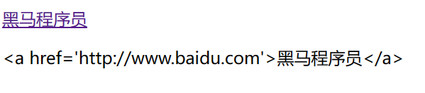
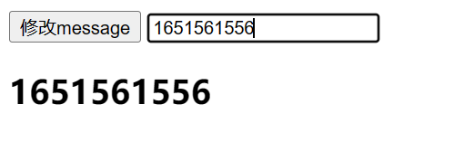

# vue.js

## 1.简介

1. js框架
2. 简化dom操作
3. 响应式数据驱动

**官网**

[Vue.js - 渐进式 JavaScript 框架 | Vue.js (vuejs.org)](https://cn.vuejs.org/)

## 2.vue基础

### 2.1.第一个vue项目

#### 2.1.1.导包

导入开发版本的Vue.js

~~~html

~~~

有开发版本和生产版本，生产版本相当于是min版本

#### 2.1.2.创建veu实例

创建Vue实例对象, 设置el属性和data属性

~~~html

~~~

#### 2.1.3.模板语法

使用简洁的模板语法把数据渲染到页面上

~~~html

    {{ message }}

~~~

#### 2.1.4.完成

完整代码如下

~~~html
<!DOCTYPE html>
<html lang="en">

<head>
  <meta charset="UTF-8">
  <meta name="viewport" content="width=device-width, initial-scale=1.0">
  <meta http-equiv="X-UA-Compatible" content="ie=edge">
  <title>Vue基础</title>
</head>

<body>
  

    {{ message }}
  

  <!-- 开发环境版本，包含了有帮助的命令行警告 -->
  
  
</body>

</html>
~~~

### 2.2.el挂载点

el用来选择标签，相当于选择器

el是用来设置vue实例挂载（管理的元素）

- vue会管理el选项命中的元素及其内部的所有后代元素
- el可以使用其他的选择器，类选择器，id选择器（推荐），标签选择器都可以
- 单标签不能使用，因为但标签不能在中间写入内容，双标签只有html标签和body标签不能使用
- 一般选择挂载div标签，因为它没有自己的样式

~~~html
<!DOCTYPE html>
<html lang="en">

<head>
  <meta charset="UTF-8">
  <meta name="viewport" content="width=device-width, initial-scale=1.0">
  <meta http-equiv="X-UA-Compatible" content="ie=edge">
  <title>el:挂载点</title>
</head>

<body id="body">
  {{ message }}
  <h2 id="app" class="app">
    {{ message }}
     {{ message }} 
  </h2>
  <!-- 开发环境版本，包含了有帮助的命令行警告 -->
  
  
</body>

</html>
~~~

### 2.3.data数据对象

在data中所写的数据可以渲染在el挂载的标签中

- vue用到的数据定义在data中
- data中可以写复杂类型的数据
- 渲染复杂类型数据时，遵守js语法即可
  - 数组访问超出大小的部分会返回空
  - 嵌套可以使用`.`来进行连接

如下例，在html中调用data中的数据，只需要写在`{{}}`中即可

~~~html
<!DOCTYPE html>
<html lang="en">`

<head>
    <meta charset="UTF-8">
    <meta name="viewport" content="width=device-width, initial-scale=1.0">
    <meta http-equiv="X-UA-Compatible" content="ie=edge">
    <title>data:数据对象</title>
</head>

<body>
    

        {{ message }}
        <h2> {{ school.name }} {{ school.mobile }}</h2>
        <ul>
            <li>{{ campus[0] }}</li>
            <li>{{ campus[3] }}</li>
        </ul>
    

    <!-- 开发环境版本，包含了有帮助的命令行警告 -->
    
    
</body>

</html>
~~~

## 3.vue原则

vue不在注重对dom的操作，而是通过改变数据来改变dom

如下例：

要点击girl时，给girl添加内容，这时候可以在methods的方法中通过this.girl进行修改

~~~html

    <h2 @click="changeGirl">{{girl}}</h2>

~~~

## 4.本地应用

### 指令

- 在vue中提供了一些对于页面 + 数据的更为方便的输出,这些操作就叫做指令, 以v-xxx表示

- - 类似于html页面中的属性 `

`

- 在vue中 以v-xxx开头的就叫做指令
- 指令中封装了一些DOM行为, 结合属性作为一个暗号, 暗号有对应的值,根据不同的值，框架会进行相关DOM操作的绑定

#### v-text

可以修改标签内的文本的值

但是使用指令的方式会覆盖标签内本身的内容

~~~html
<!--这种是指令的方式-->
<h2 v-text="message+'!'">深圳</h2>
<!--想要使用字符串拼接的话需要再加单引号-->
<!--深圳会被覆盖掉-->

<!--这种是插值表达式的方式-->
<h2>{{ message +'!'}}深圳</h2>

<!--深圳会被覆盖掉-->
<h2 v-text="info+'!'">深圳</h2>

~~~

#### v-html

也是修改标签中的内容

和v-text不同的是，v-html的内容中html语法会被解析，v-text的不会

~~~html
<!DOCTYPE html>
<html lang="en">

<head>
    <meta charset="UTF-8">
    <meta name="viewport" content="width=device-width, initial-scale=1.0">
    <meta http-equiv="X-UA-Compatible" content="ie=edge">
    <title>v-html指令</title>
</head>

<body>
    

        

        

    

    <!-- 开发环境版本，包含了有帮助的命令行警告 -->
    
    
</body>

</html>
~~~

**结果**

#### v-on

为元素绑定事件

**语法**

有两种方式

~~~html

<!--可以用 @ 代替 v-on: -->

~~~

有参数时，加上括号写入参数

无参数时，括号可以省略

**函数的定义**

写在和data同级的methods中

`函数名:function(){}`

~~~javascript
var app = new Vue({
    el:"#app",
    methods: {
        doIt:function(p1,p2){
            console.log("做it");
            console.log(p1);
            console.log(p2);
        },
        sayHi:function(){
            alert("吃了没");
        }
    },
})
~~~

#### v-show

根据表达值的真假，切换元素的显示和隐藏

- 除了直接填入true和false，也可以填表达式和变量

  ~~~html
  
  
  <a v-show="age>=16"></a>
  
  ~~~

  

#### v-if

根据表达值的真假，切换元素的显示和隐藏

使用方法和v-show一样

**和v-show的区别**

- v-if是直接把元素删掉，操纵的是dom树
- v-show是改变元素的display属性，操纵的是样式
- 频繁切换的元素用v-show，反之用v-if

#### v-bind

设置元素的属性（比如：src，title，class）

**语法**

`v-bind:属性名`

~~~html

~~~

其中的`v-bind:`可以简写成`:`

~~~html

~~~

**三元表达式**

可以通过这种方式来改变class的值

~~~html

~~~

也可以使用下面这种写法

active这个名字是否生效取决于isActive这个变量的真假

~~~html

~~~

#### v-for

将data中的数组构建成列表

根据数据生成列表结构

**语法**

`v-for="(item,index) in arr"`

- item是数组内容（名字自定），无需定义，可直接使用
- index是索引值（名字自定），无需定义，可直接使用
- arr是data中定义的数组
- 对象数组使用时可用`.`进行连接

~~~html
<ul>
    <!--4个arr会从上向下排列-->
    <li v-for="(item,index) in arr">
        {{ index+1 }}黑马程序员校区:{{ item }}
    </li>
</ul>

<h2 v-for="item in vegetables">
    {{ item.name }}
</h2>

~~~

#### v-model

获取和设置表单元素的值（双向数据绑定）

- 更改表单标签中的内容，data中的对应变量的值也会改变
- 更改data中对应变量的值，表单标签的内容也会改变

v-model属性的值就是表单标签中的值

~~~html
<!--修改text文本框中的内容，h2标签中使用的message变量也会改变-->
<input type="text" v-model="message" @keyup.enter="getM">
<h2>{{ message }}</h2>

~~~

## 5.网络应用

vue结合网络数据开发应用

### axios

功能强大的网络请求库

功能类似AJAX，但是更加轻量化

[Axios官网](https://axios-http.com/)

#### 导包

~~~html

~~~

导包后就能使用axios了

#### 发送请求

错误函数也能写在catch里边

~~~javascript
axios.get("地址?key1=value1&key2=value2").then(function(response){} , function(err){})

axios.post("地址",{key1:value1,key2:value2}).then(function(response){} , function(err){})

//错误函数也能写在catch里边
axios.get("地址?key1=value1&key2=value2").then(function(response){}).catch(function(err){})
~~~

后边两个函数，一个是成功时执行，返回得到的信息，一个是错误时执行，返回错误信息

