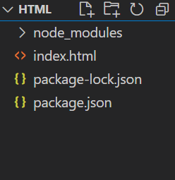

# amis

## amis

amis 是一个低代码前端框架，它使用 JSON 配置来生成页面，可以减少页面开发工作量，极大提升效率。

使用方法和jquery类似，都是引用后再js标签中编写json语句

配合amis 可视化编辑器，能够快速开发简单常用的前端页面

## 地址

[amisgithub地址](https://github.com/baidu/amis)

[amis文档](https://aisuda.bce.baidu.com/amis/zh-CN/docs/index)

可以查看amis具体的格式，组件，数据类型等信息

[amis 可视化编辑器示例](https://github.com/aisuda/amis-editor-demo)

有网页版本，甚至不用自己本地部署

## 使用

amis 的依赖可以使用外部 cdn

但是为了稳定请在自己部署的时候将文件下载到本地。

### 外部cdn

地址

~~~html
<link
  rel="stylesheet"
  title="default"
  href="https://unpkg.com/amis@beta/sdk/sdk.css"
/>
<link
  rel="stylesheet"
  href="https://unpkg.com/amis@beta/sdk/helper.css"
/>
<link
  rel="stylesheet"
  href="https://unpkg.com/amis@beta/sdk/iconfont.css"
/>

~~~

### 本地cdn

==将依赖下载到index.html同目录下==

1. 终端执行`npm init`，将文件夹初始化
2. 执行`npm i amis`，将amis依赖下载到文件夹内

文件目录：

node_modules中存放的就是一些依赖

==编写index.html==

- 注意链接的地址要根据使用的cdn位置进行修改
- 外部cdn就把上边网址写进去
- `let amisJSON =` 后边的内容填写amis格式的json语句

~~~html
<!DOCTYPE html>
<html lang="zh">
  <head>
    <meta charset="UTF-8" />
    <title>amis demo</title>
    <meta http-equiv="Content-Type" content="text/html; charset=utf-8" />
    <meta
      name="viewport"
      content="width=device-width, initial-scale=1, maximum-scale=1"
    />
    <meta http-equiv="X-UA-Compatible" content="IE=Edge" />
    <link rel="stylesheet" href="sdk.css" />
    <link rel="stylesheet" href="helper.css" />
    <link rel="stylesheet" href="iconfont.css" />
    <!-- 这是默认主题所需的，如果是其他主题则不需要 -->
    <!-- 从 1.1.0 开始 sdk.css 将不支持 IE 11，如果要支持 IE11 请引用这个 css，并把前面那个删了 -->
    <!-- <link rel="stylesheet" href="sdk-ie11.css" /> -->
    <!-- 不过 amis 开发团队几乎没测试过 IE 11 下的效果，所以可能有细节功能用不了，如果发现请报 issue -->
    
  </head>
  <body>
    

    
    
  </body>
</html>
~~~

### 可视化编辑器

[amis 可视化编辑器示例](https://github.com/aisuda/amis-editor-demo)

amis在线可视化编辑器

[AMIS 页面 (aisuda.github.io)](https://aisuda.github.io/amis-editor-demo)

再可视化编辑器中拖动组件创建页面，即可生成相应的json语句，将json语句复制到html中替换相应的部分即可实现对应页面效果

下面的页面就是使用可视化编辑器生成json后直接复制进html

~~~html
<!DOCTYPE html>
<html lang="zh">
  <head>
    <meta charset="UTF-8" />
    <title>amis demo</title>
    <meta http-equiv="Content-Type" content="text/html; charset=utf-8" />
    <meta
      name="viewport"
      content="width=device-width, initial-scale=1, maximum-scale=1"
    />
    <meta http-equiv="X-UA-Compatible" content="IE=Edge" />
    <link rel="stylesheet" href="./node_modules/amis/sdk/sdk.css" />
    <link rel="stylesheet" href="./node_modules/amis/sdk/helper.css" />
    <link rel="stylesheet" href="./node_modules/amis/sdk/iconfont.css" />
    <!-- 这是默认主题所需的，如果是其他主题则不需要 -->
    <!-- 从 1.1.0 开始 sdk.css 将不支持 IE 11，如果要支持 IE11 请引用这个 css，并把前面那个删了 -->
    <!-- <link rel="stylesheet" href="sdk-ie11.css" /> -->
    <!-- 不过 amis 开发团队几乎没测试过 IE 11 下的效果，所以可能有细节功能用不了，如果发现请报 issue -->
    
  </head>
  <body>
    

    
    
  </body>
</html>
~~~

