# SSM

**Spring是一个轻量级的控制反转(IoC)和面向切面(AOP)的容器（框架）。**


- 简化开发
  - IoC
  - AOP
    - 事务处理
- 框架整合
  - Mybatis
  - MybatisPlus
  - Struts
  - Struts2
  - Hibernate


## 1.Spring家族

官网

http://Spring.io


提供了若干个项目

- Spring Framework 最重要
- SpringBoot 开发更快
- SpringCloud 分布式开发


## 2.Spring Framework

Spring生态中最基础的项目，是其他项目的基础


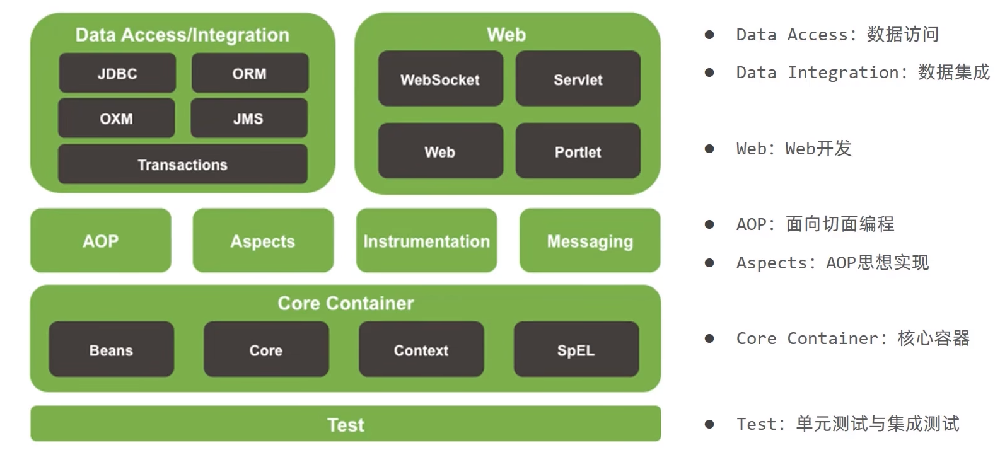


### 2.1.核心容器（Core Container）


#### IoC（Inversion of Control）控制反转

是一种思想：

- 使用对象时，在程序中不要主动使用new产生对象，转换为由**外部**提供对象
- 由程序员自己控制对象，变为IOC容器控制对象
- 创建权转移到外部，所以称为控制反转
- 依赖的对象被反转

**目的**：降低程序耦合度

**使用：**就是用配置文件或者注解的方式来代替new的使用


#### Spring对IoC思想进行了实现

- Spring提供了一个容器，称为IoC容器，用来充当IoC思想中的外部
- IoC容器负责对象的创建和初始化，被创建或管理的对象在IoC容器被称为Bean


#### DI（Dependency Injection）依赖注入

- 在容器中建立bean与bean之间的依赖关系的整个过程，称为依赖注入


**最终效果**

- 解耦
- 从IoC中去bean
- bena之间完成依赖绑定


#### 2.1.1.IoC的代码实现

对应spring_01_quickstart项目

##### 1.添加Spring依赖

现在项目中导入SpringFramework

pom文件添加依赖

~~~xml
<dependencies>
<dependency>
  <groupId>org.springframework</groupId>
  <artifactId>spring-context</artifactId>
  <version>5.2.10.RELEASE</version>
</dependency>
</dependencies>
~~~


##### 2.定义Spring管理的类（接口）

假设该接口叫BookService

实现类叫BookServiceImpl


##### 3.创建Spring配置文件

在resources文件夹中添加Spring配置文件：applicationContect.xml

并配置对应的类为Spring管理的bean

1. id表示给bean起的名字（不能重复）
2. class是对应的类

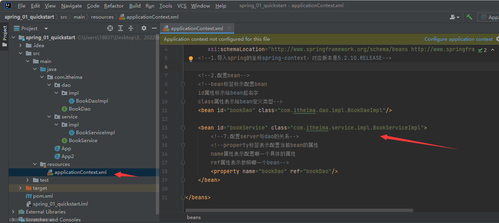


##### 4.初始化IoC容器

初始化IoC，并且通过IoC获取bean

~~~java
public class App {
    public static void main(String[] args) {
        //3.获取IoC容器
        //记得填写Spring配置文件路径
        ApplicationContext ctx = new ClassPathXmlApplicationContext("applicationContext.xml");
        //4.获取bean（根据bean配置id获取）
        //也可以使用bean的别名
        BookService bookService = (BookService) ctx.getBean("bookService");
        bookService.save();
    }
}
~~~


##### 5.实现DI

即bean和bean之间建立依赖关系

1. 在Spring配置文件中相应的bean标签下添加property标签

   ~~~xml
   <bean id="bookDao" class="com.itheima.dao.impl.BookDaoImpl"/>
   <bean id="bookService" class="com.itheima.service.impl.BookServiceImpl">
       <!--7.配置server与dao的关系-->
       <!--property标签表示配置当前bean的属性
       name属性表示配置哪一个具体的属性(变量)
       ref属性表示参照哪一个bean，可以使用id或者别名指定,相当于是传入set方法的参数-->
       <!--对应该bean的类中必需要有name对应属性的set方法，如setBookDao-->
       <property name="bookDao" ref="bookDao"/>
   </bean>
   ~~~

2. 在对应使用其他类的类中添加其他类的set方法，并删除new方式创建对象

   该set方法由容器执行

   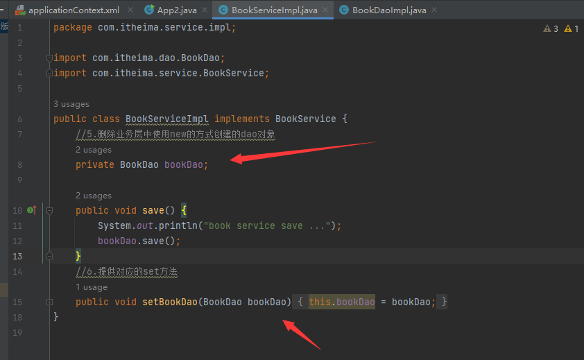


#### 2.1.2.bean

构成应用程序主干并由Spring IoC容器管理的对象称为bean。bean是一个由Spring IoC容器实例化、组装和管理的对象。

##### 1.bean别名

bena标签的name属性可以给bean起别名，可以起好多个，不同别名之间用 **空格 , ;** 分隔（三种都行）

~~~xml
<bean id="bookService" name="service service4 bookEbi" class="com.itheima.service.impl.BookServiceImpl">
    <property name="bookDao" ref="bookDao"/>
</bean>

<!--bookService有service service4 bookEbi这个三个别名-->
~~~


##### 2.bean的作用范围

默认创建的bean是单例的

即不同的对象名字都对应同一个对象

如图，两个bookDao指向的都是一个BookDao对象

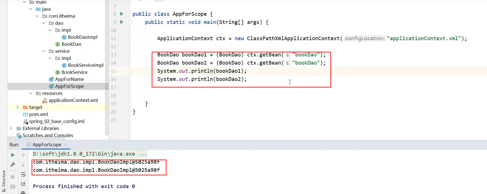


scope属性可以改变该属性

默认是singleton单例

~~~xml
<bean id="bookDao" name="dao" class="com.itheima.dao.impl.BookDaoImpl" scope="prototype"/>
<!--prototype代表该对象多例-->
<!--singleton代表该对象单例-->
~~~


##### 3.bean实例化对象的方式

有四种方式


**1.使用构造方法实例化bean**

Spring创建对象时，使用的是对应类的无参构造方法

若类中写了带参构造方法，则默认没有无参构造方法，会报错


**2.使用静态工厂创建对象**

静态工厂，就是另外的一个工厂类，使用静态方法生成类的实例

使用时，直接使用静态对象获取需要的对象

~~~java
OrderDao orderDao = OrderDaoFactory.getOrderDao();
orderDao.save();
~~~

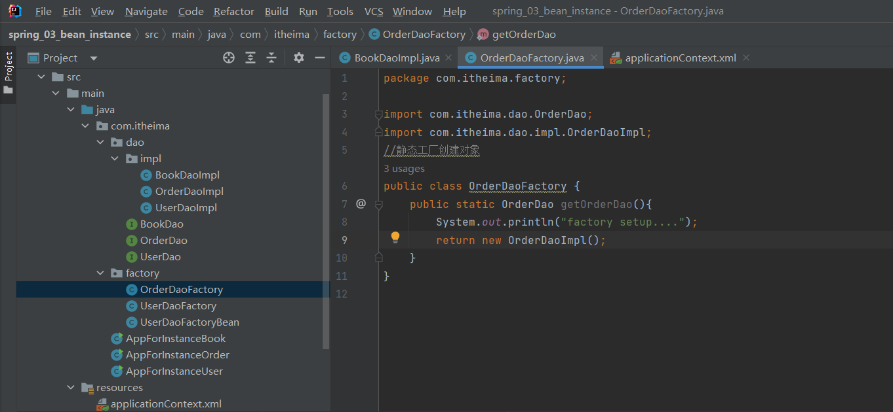


使用以下配置即可使用该方式实例化类

factory-method属性表示是用该类中的该方法来实例化类

若不加，这句就是使用构造方法实例化OrderDaoFactory类了

~~~xml
<bean id="orderDao" class="com.itheima.factory.OrderDaoFactory" factory-method="getOrderDao"/>
<!--表示使用OrderDaoFactory中的getOrderDao方法创建orderDao对象-->
~~~


**3.使用实例工厂创建对象**

使用时，先创建工厂对象，然后通过该对象得到需要的类对象

~~~java
UserDaoFactory userDaoFactory = new UserDaoFactory();
//通过实例工厂对象创建对象
UserDao userDao = userDaoFactory.getUserDao();
userDao.save();
~~~

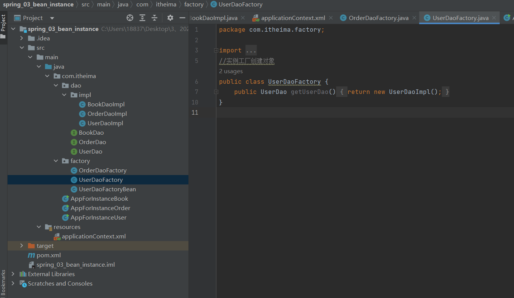


使用以下配置即可使用该方式实例化类

- 首先把工厂对象变为bean
- 使用factory-method和factory-bean标签完成配置

~~~xml
<bean id="userFactory" class="com.itheima.factory.UserDaoFactory"/>
<!--把工厂对象变为bean-->

<bean id="userDao" factory-method="getUserDao" factory-bean="userFactory"/>
<!--表示使用userFactory这个bean对象的getUserDao方法创建userDao的对象-->
~~~


**4.使用FactoryBean实例化**

bean工厂代替实例化工厂

不用每次都指定方法名

创建不同的FactoryBean类来实现FactoryBean接口

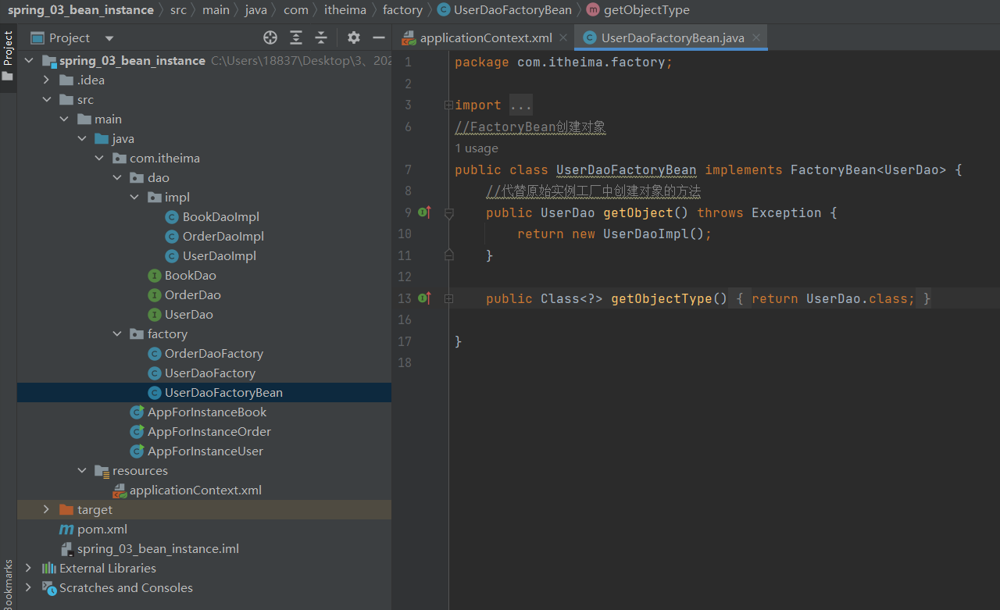


Spring配置文件只需要写bean工厂类即可

~~~xml
<bean id="userDao" class="com.itheima.factory.UserDaoFactoryBean"/>
~~~

该种创建还是默认单例，改为非单例，需要加一个isSinglenton方法

true表示单例，false表示非单例

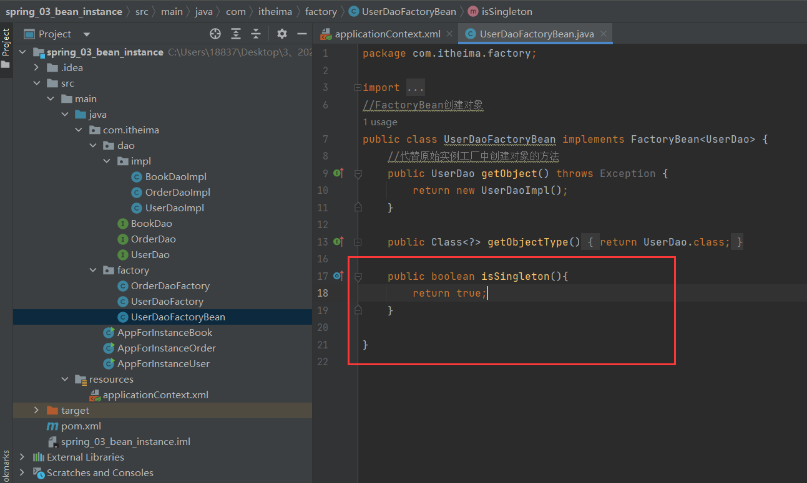


##### 4.bena的生命周期

- 初始化容器
  1. 创建对象
  2. 执行构造方法
  3. 执行属性注入（set方法）
  4. 执行bean初始化方法
- 使用bean
  1. 执行业务操作
- 关闭销毁容器
  1. 执行bean的销毁方法


**1.配置方式**

init-method标签：创建容器时会调用每个bean的该方法，设置bean初始化生命周期回调函数

destroy-method标签：销毁容器时会调用每个bean的该方法，设置bean销毁生命周期回调函数，仅适用于单例对象

~~~xml
<bean id="bookDao" class="com.itheima.dao.impl.BookDaoImpl" init-method="init" destroy-method="destory"/>
~~~

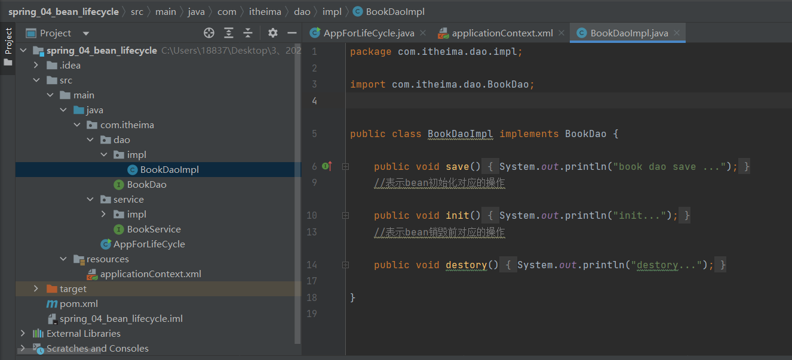


**2.接口方式**

实现InitializingBean和DisposableBean两个接口

并实现destroy和afterPropertiesSet（在执行set方法后执行）两个方法

配置文件正常写

~~~xml
<bean id="bookService" class="com.itheima.service.impl.BookServiceImpl">
    <property name="bookDao" ref="bookDao"/>
</bean>
~~~

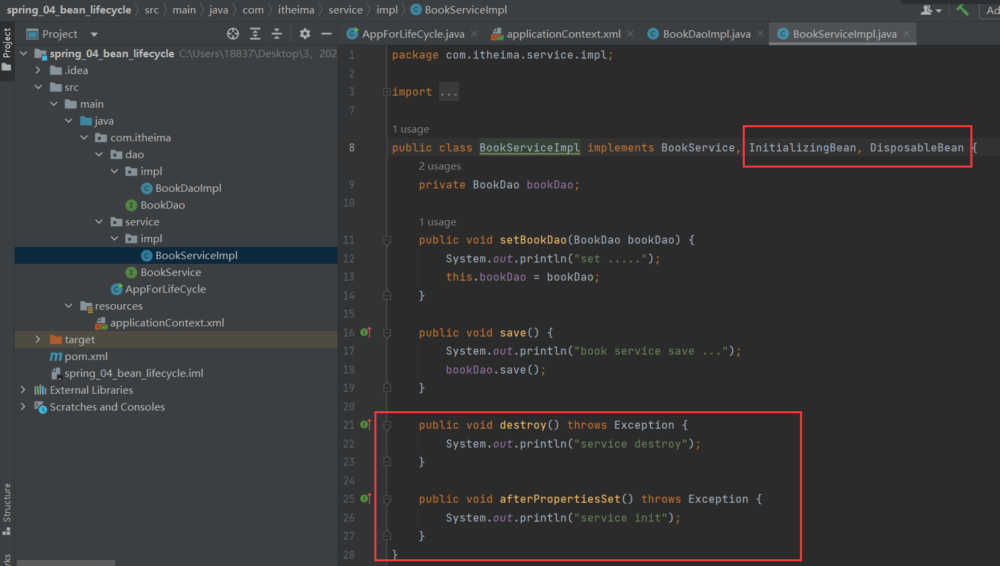


**bean的销毁时机**

容器关闭触发bean的销毁

**容器的关闭**

最基本的ApplicationContext接口并没有提供销毁的方法，此时使用其继承类ClassPathXmlApplicaitonContext类即可

两种销毁方法：

1. close方法

   ~~~java
   public class AppForLifeCycle {
       public static void main( String[] args ) {
           ClassPathXmlApplicationContext ctx = new ClassPathXmlApplicationContext("applicationContext.xml");
   
           ctx.close();
       }
   }
   ~~~

2. 注册关闭钩子registerShutdownHook

   注册后，虚拟机会在程序结束前自动执行close方法

   ~~~java
   public class AppForLifeCycle {
       public static void main( String[] args ) {
           ClassPathXmlApplicationContext ctx = new ClassPathXmlApplicationContext("applicationContext.xml");
   
           //注册关闭钩子函数，在虚拟机退出之前回调此函数，关闭容器
           ctx.registerShutdownHook();
       }
   }
   ~~~

   


#### 2.1.3.DI

DI = Dependency Injection = 依赖注入。

见名知义，DI 就是把依赖项注入到对象中。

它是一种编程技巧。使用它，可以编写出松散耦合的代码。


setter方法和构造方法均可快速生成

右键->Generate->选择要生成的方法

##### 1.setter注入（个人推荐）

对于**引用类型**，需要使用property标签，在简单介绍DI部分已经说过

若是**简单类型或者String类型**，需要把ref属性改为value属性传入参数值

~~~xml
<bean id="bookDao" class="com.itheima.dao.impl.BookDaoImpl">
    <!--property标签：设置注入属性-->
    <!--name属性：设置注入的属性名，实际是set方法对应的名称-->
    <!--value属性：设置注入简单类型数据值-->
    <property name="connectionNum" value="100"/>
    <property name="databaseName" value="mysql"/>
</bean>
~~~

BookDaoImpl中需要添加set方法

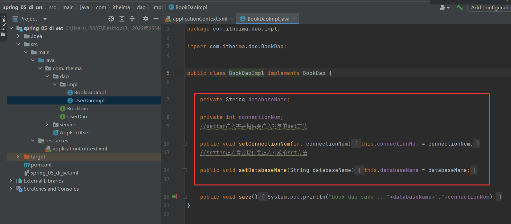


##### 2.构造器注入（官方推荐）

将set方法替换为该类的构造方法

配置文件中的使用constructor-arg标签

若是注入普通类型或者String类型，则将ref改为value即可

~~~xml
<bean id="bookDao" class="com.itheima.dao.impl.BookDaoImpl"/>
<bean id="userDao" class="com.itheima.dao.impl.UserDaoImpl"/>
<bean id="bookService" class="com.itheima.service.impl.BookServiceImpl">
    <constructor-arg name="userDao" ref="userDao"/>
    <constructor-arg name="bookDao" ref="bookDao"/>
    <!--name和形式参数的名字需要保持一致-->
</bean>
~~~

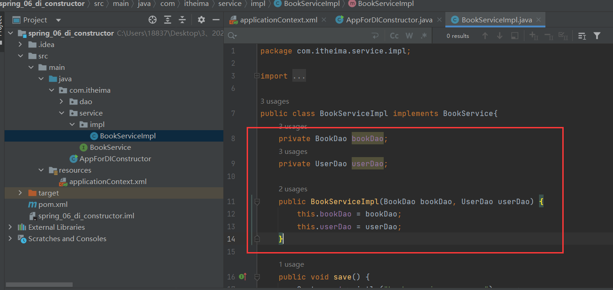


为了降低降低形式参数的耦合

- 可以constructor-arg标签不用name属性，改用type类型

  ~~~xml
  <bean id="bookDao" class="com.itheima.dao.impl.BookDaoImpl">
      根据构造方法参数类型注入
      <constructor-arg type="int" value="10"/>
      <constructor-arg type="java.lang.String" value="mysql"/>
  </bean>
  ~~~

- 也可时使用参数的顺序

  ~~~xml
  <bean id="bookDao" class="com.itheima.dao.impl.BookDaoImpl">
      根据构造方法参数类型注入
      <constructor-arg index="0" value="10"/>
      <constructor-arg index="1" value="mysql"/>
  </bean>
  ~~~

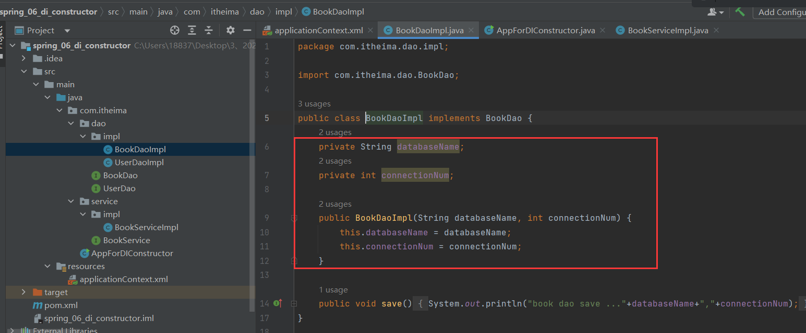


##### 3.依赖自动装配

属性全部使用set方法

配置文件中bean标签使用autowire属性

~~~xml
<bean id="bookDao" class="com.itheima.dao.impl.BookDaoImpl"/>

<!--autowire属性：开启自动装配，通常使用按类型装配-->
<bean id="bookService" class="com.itheima.service.impl.BookServiceImpl" autowire="byType"/>
~~~

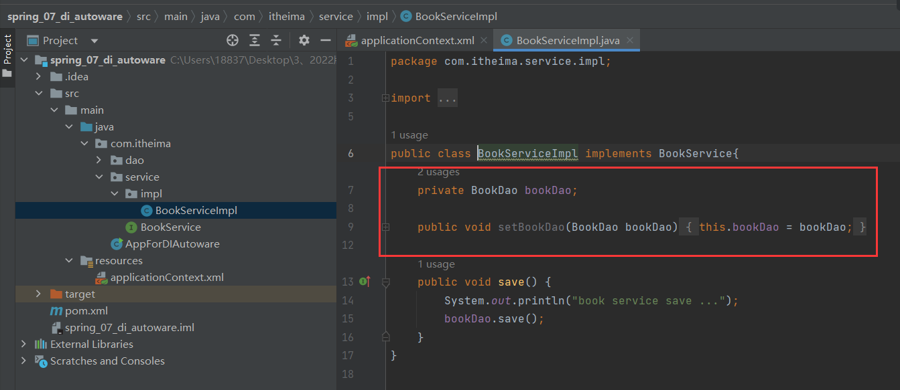


autowire属性

- 按类型装配（推荐）

  byType

  ~~~xml
  <!--若不使用bookDao这个bean类的话，可以不写id属性-->
  <bean id="bookDao" class="com.itheima.dao.impl.BookDaoImpl"/>
  
  <!--autowire属性：开启自动装配，通常使用按类型装配-->
  <bean id="bookService" class="com.itheima.service.impl.BookServiceImpl" autowire="byType"/>
  ~~~

- 按名字分配

  byName

  ~~~xml
  <!--id和set方法除去set后的名字保持一致-->
  <bean id="bookDao" class="com.itheima.dao.impl.BookDaoImpl"/>
  
  <!--autowire属性：开启自动装配，通常使用按类型装配-->
  <bean id="bookService" class="com.itheima.service.impl.BookServiceImpl" autowire="byName"/>
  ~~~

  


- 不能对简单类型进行操作
- 优先级低于setter注入和构造器注入


##### 5.集合的注入

每种都有相应的格式

~~~xml
 <bean id="bookDao" class="com.itheima.dao.impl.BookDaoImpl">
     
    <!--数组注入-->
    <property name="array">
        <array>
            <value>100</value>
            <value>200</value>
            <value>300</value>
        </array>
    </property>
     
    <!--list集合注入-->
    <property name="list">
        <list>
            <value>itcast</value>
            <value>itheima</value>
            <value>boxuegu</value>
            <value>chuanzhihui</value>
        </list>
    </property>
     
    <!--set集合注入-->
    <property name="set">
        <set>
            <value>itcast</value>
            <value>itheima</value>
            <value>boxuegu</value>
            <value>boxuegu</value>
        </set>
    </property>
     
    <!--map集合注入-->
    <property name="map">
        <map>
            <entry key="country" value="china"/>
            <entry key="province" value="henan"/>
            <entry key="city" value="kaifeng"/>
        </map>
    </property>
     
    <!--Properties注入-->
    <property name="properties">
        <props>
            <prop key="country">china</prop>
            <prop key="province">henan</prop>
            <prop key="city">kaifeng</prop>
        </props>
    </property>
     
</bean>
~~~

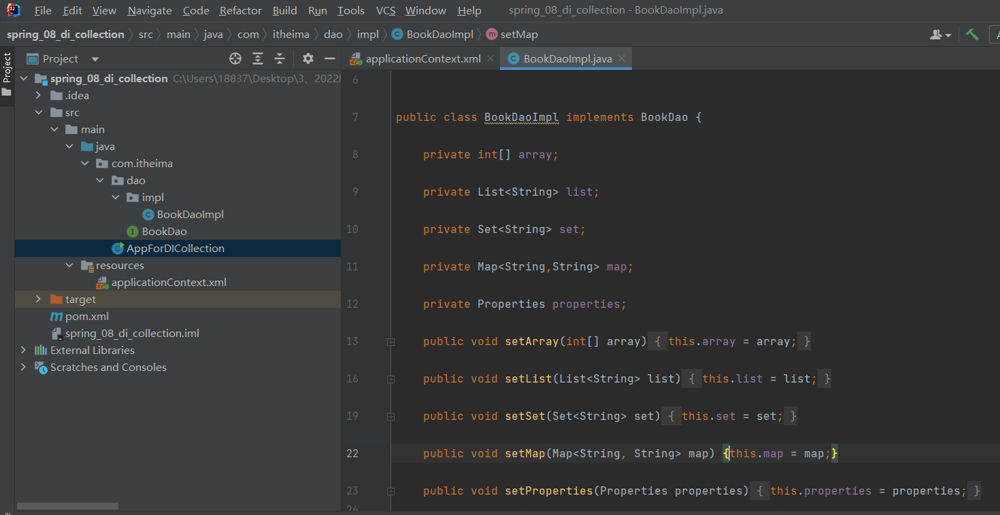


##### 6.Spring管理第三方资源

同样使用bean方法

~~~xml
<!--在maven中导入Druid的jar包和jdbc.Driver的jar包-->
<bean class="com.alibaba.druid.pool.DruidDataSource">
    <!--各个参数可以打出首字母然后看提示，或者查官方文档-->
    <property name="driverClassName" value="com.mysql.jdbc.Driver"/>
    <property name="url" value="jdbc:mysql://localhost:3306/spring_db"/>
    <property name="username" value="root"/>
    <property name="password" value="root"/>
</bean>
~~~


##### 7.加载properties文件

首先在xml配置文件中开启context命名空间，需要在开头加上如下

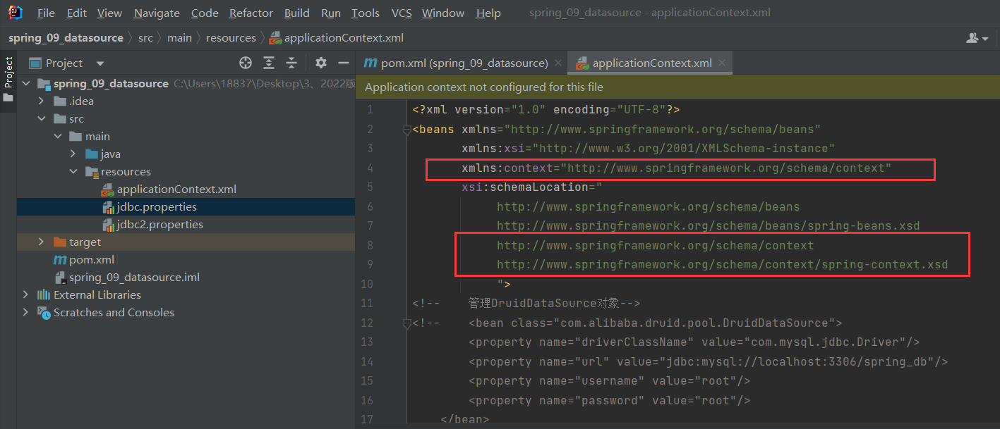


在resources文件夹内加入配置文件

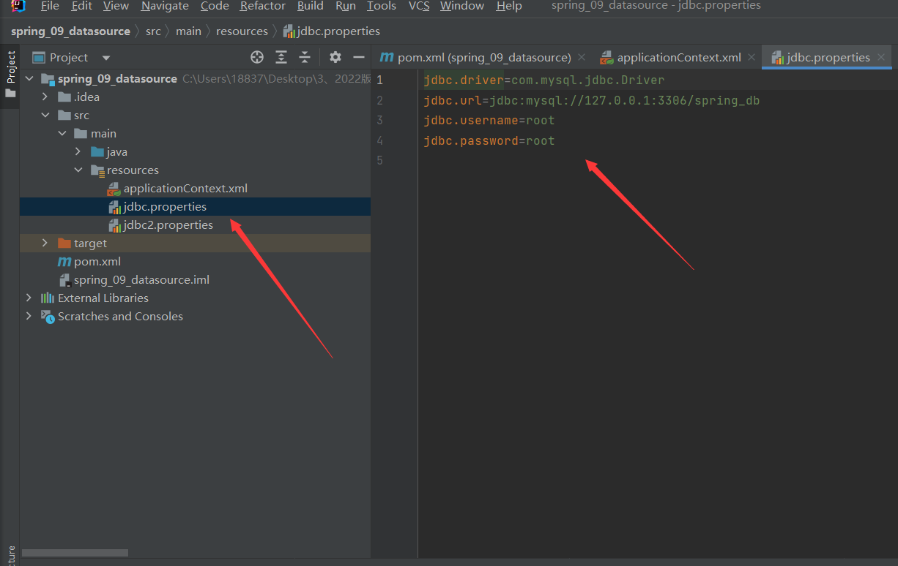

然后在xml中加载配置文件

~~~xml
<context:property-placeholder location="classpath*:*.properties" system-properties-mode="NEVER"/>
<!--clathpath表示工程文件夹，不包含导入的依赖-->
<!--clathpath*表示工程文件夹，包含导入的依赖-->
<!--*.properties表示所有后缀为properties的文件，也可以用名字指定某一个properties文件-->
<!--system-properties-mode属性表示不加载系统变量，有些变量名字会和系统变量名字一样，这样的话会被系统的覆盖，所以可以不加载系统的-->
~~~

在xml中使用properties配置文件

~~~xml
<!--3.使用属性占位符${}读取properties文件中的属性-->
<!--说明：idea自动识别${}加载的属性值，需要手工点击才可以查阅原始书写格式-->
<bean class="com.alibaba.druid.pool.DruidDataSource">
    <property name="driverClassName" value="${jdbc.driver}"/>
    <property name="url" value="${jdbc.url}"/>
    <property name="username" value="${jdbc.username}"/>
    <property name="password" value="${jdbc.password}"/>
</bean>
~~~


#### 2.1.5.容器

##### 1.创建容器

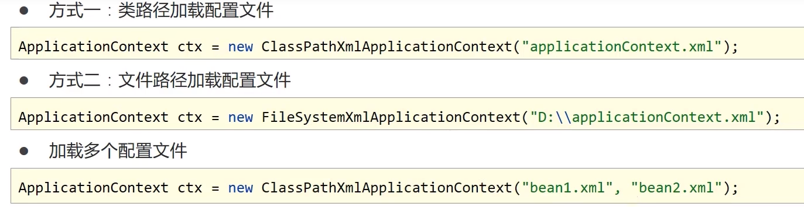


##### 2.获取bean

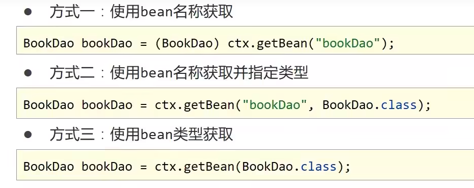


##### 3.容器类层次结构


#### 2.1.6注解开发定义bean

使用@Component注解可以代替配置文件中的bean标签

在需要的类前**加上@Component注解**

括号内的参数相当于是bean标签的id属性

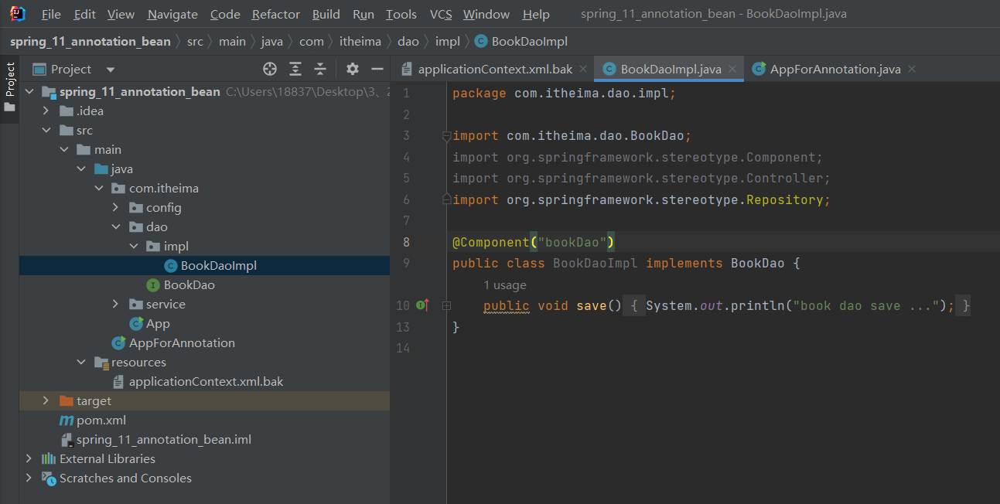

该注解相当于是Spring配置文件中的

~~~xml
<bean id="bookDao" class="com.itheima.dao.impl.BookDaoImpl"/>
~~~


加上注解后，需要在Spring配置文件中**加入组件扫描**器来加载bean（同样需要加入context命名空间）

~~~xml
<context:component-scan base-package="com.itheima"/>
<!--表示扫描com.itheima路径下的所有Component注解，并将它们变为bean对象-->
~~~


若不写括号内的参数，即没有指定id参数，则需要使用类的类型来访问类

~~~java
BookService bookService = ctx.getBean(BookService.class);
~~~


**@Component的衍生注解**

功能和Component效果一样，但是这样写使得结构更加清晰

- Controller
- Service
- Respository

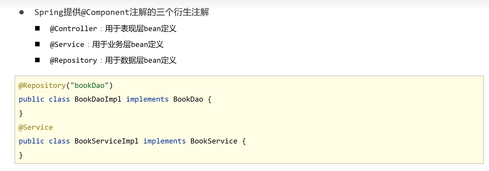


#### 2.1.7.纯注解开发模式

##### 1.配置类

使用**带@Configuration注解的类**来代替xml配置文件

即使用**配置类**

@ComponentScan注解代替context:component-scan标签

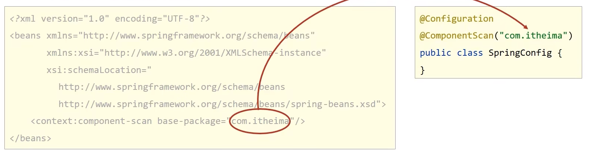


该配置类放在config文件夹内

@ComponentScan注解可以加多个扫描路径，使用数组的格式：{"路径一","路径二"}

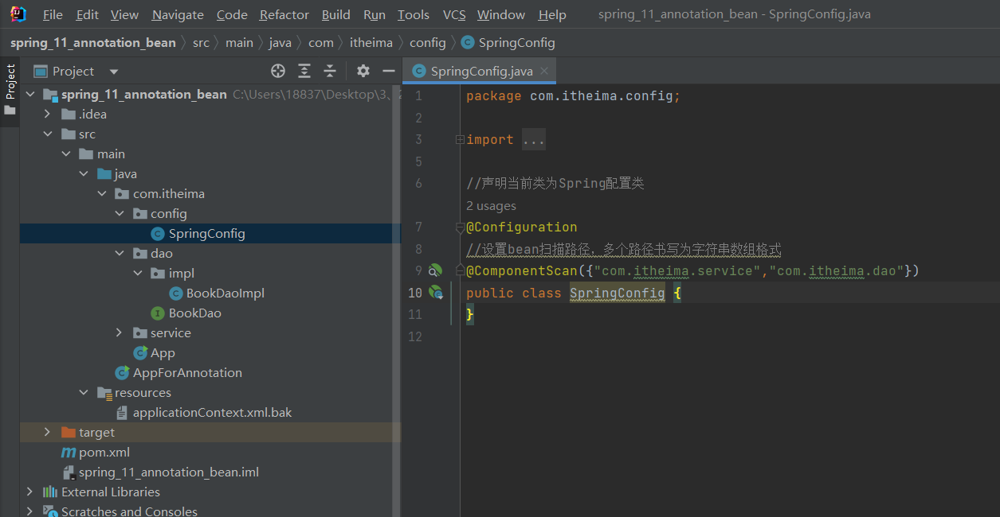


创建容器方式也要发生变化

```java
//AnnotationConfigApplicationContext加载Spring配置类初始化Spring容器
ApplicationContext ctx = new AnnotationConfigApplicationContext(SpringConfig.class);
```


##### 2.bean作用范围和生命周期

作用范围：

- 在相应的类上使用@Scope注解，并输入参数singleton或者prototype

生命周期

- 在相应的方法上使用@PostConstruct注解，在类构造之后执行
- 在相应的方法上使用@PreDestory注解，在类销毁之前执行


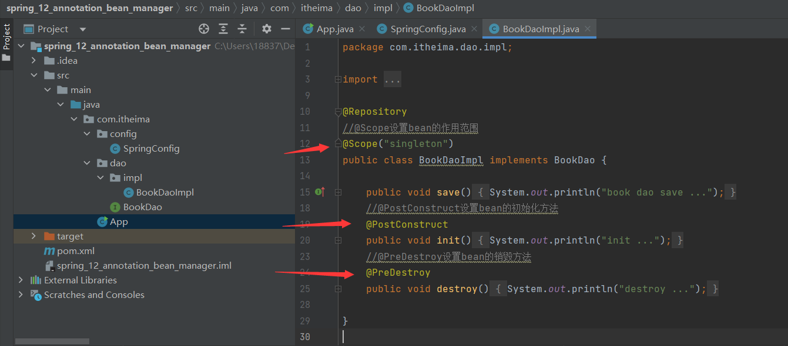


##### 3.依赖自动装配

**引用类型的注入**

在需要装配的类前使用@Autowired注解，即可完成各个属性的自动装配

该注解按照类型装配

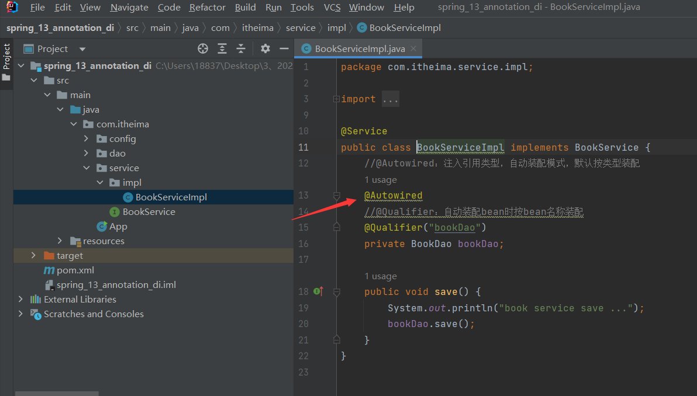


当一个接口有多个实现类时，使用@Autowired会报错，这时要多加上@Qualifier注解来指定名字（@Qualifier要依赖于@Autowired，所以@Autowired也不能丢）

@Qualifier填bookDao则表示使用BookDaoImpl进行实例化

@Qualifier填bookDao2则表示使用BookDaoImpl2进行实例化

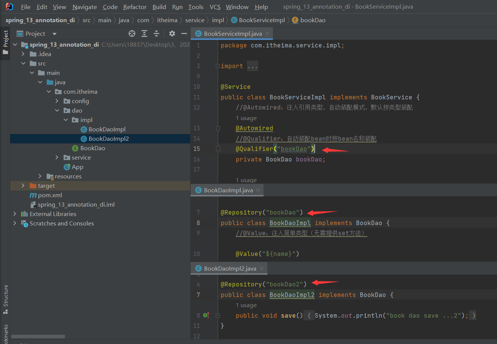


**简单类型的注入**

使用@Value标签

~~~java
@Value("100")
private Struing connectionNum;
~~~


##### 4.加载配置文件

1. 在配置类中加入@PropertySource注解，并指定配置文件路径

   多个配置文件也是使用数组的形式写入：使用数组的格式：{"配置文件1","配置文件2"}

   这里不支持使用*

   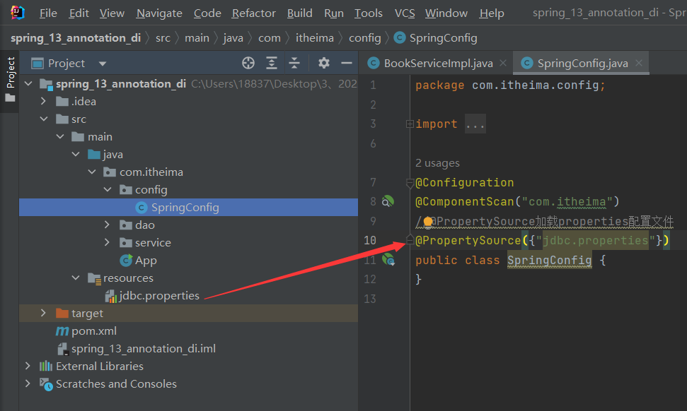

2. 使用属性占位符${}读取properties文件中的属性

   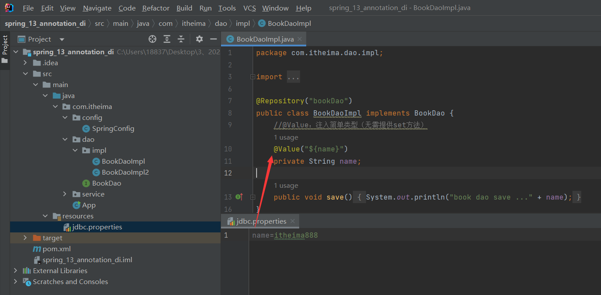


##### 5.第三方bean管理

1. 在config文件夹中添加第三方类的配置文件，将其转换为bean对象，即构造方法+@bean注解

2. 在Spring配置类中使用@Import注解导入该第三方bean类

   当需要导入多个时，使用数组的格式

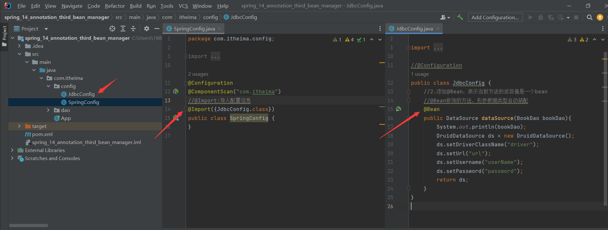


**简单类型依赖注入**

使用@Value即可

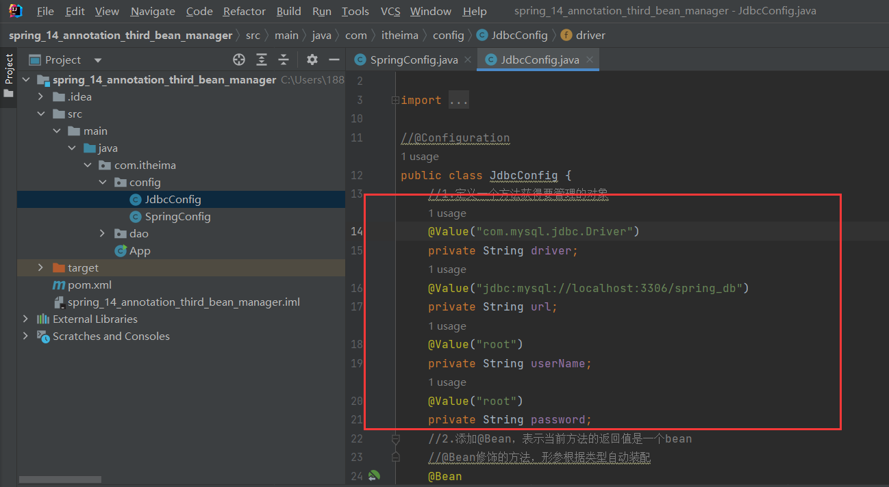


**引用类型依赖注入**

依赖的引用类型若已经使用@Component注解装配，相当于是已经定义为bean

可以作为参数传入直接使用

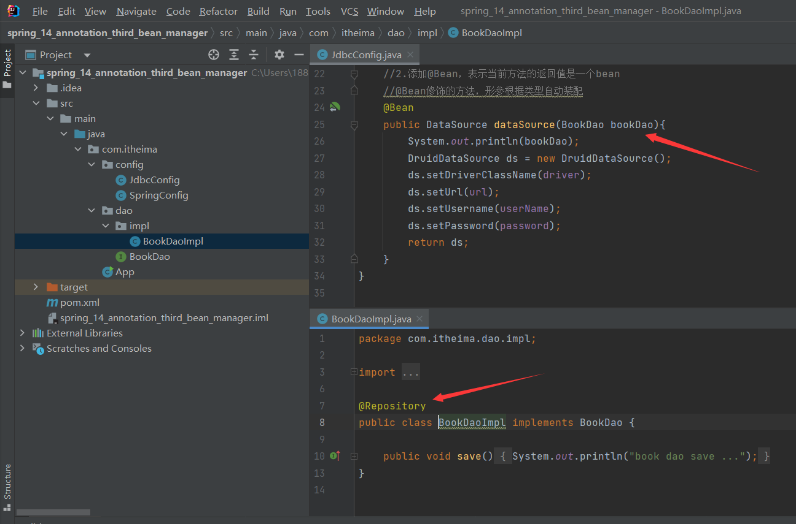


#### 2.1.8.xml配置和注解配置比较

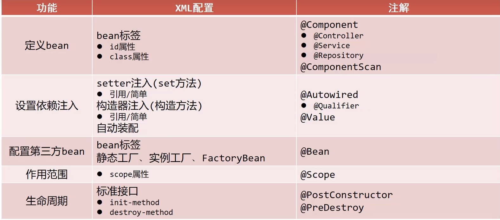


### 2.2.Spring整合MyBatis

需要加入一些依赖

~~~xml
<dependency>
  <groupId>com.alibaba</groupId>
  <artifactId>druid</artifactId>
  <version>1.1.16</version>
</dependency>

<dependency>
  <groupId>org.mybatis</groupId>
  <artifactId>mybatis</artifactId>
  <version>3.5.6</version>
</dependency>

<dependency>
  <groupId>mysql</groupId>
  <artifactId>mysql-connector-java</artifactId>
  <version>5.1.47</version>
</dependency>

<!--spring操作数据库需要用的包-->
<dependency>
  <groupId>org.springframework</groupId>
  <artifactId>spring-jdbc</artifactId>
  <version>5.2.10.RELEASE</version>
</dependency>

<!--spring使用MyBatis需要用的包-->
<dependency>
  <groupId>org.mybatis</groupId>
  <artifactId>mybatis-spring</artifactId>
  <version>1.3.0</version>
</dependency>
~~~

MyBatis基础：

- SqlSessionFactory类
  - 用来执行sql语句的类型
- Mapper类
  - 调用sql语句


**Spring整合MyBatis**

将MyBatis的配置文件转化成bean的形式

SqlSessionFactory使用SqlSessionFactoryBean转化为bean来使用

Mapper使用MapperScannerConfigurer转化为bean来使用

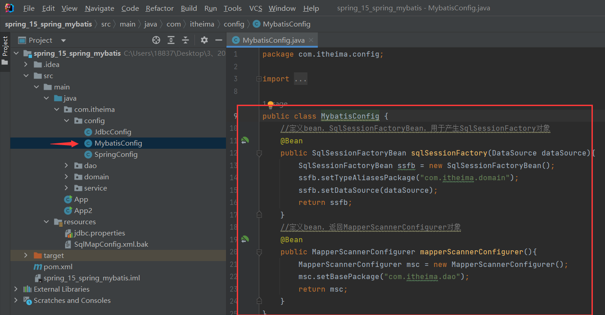


这样一来，service就能自动装配mapper类

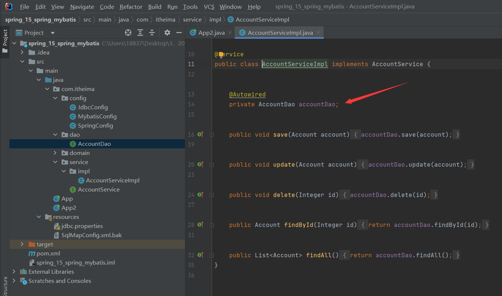


然后就可以使用service类来调用sql语句

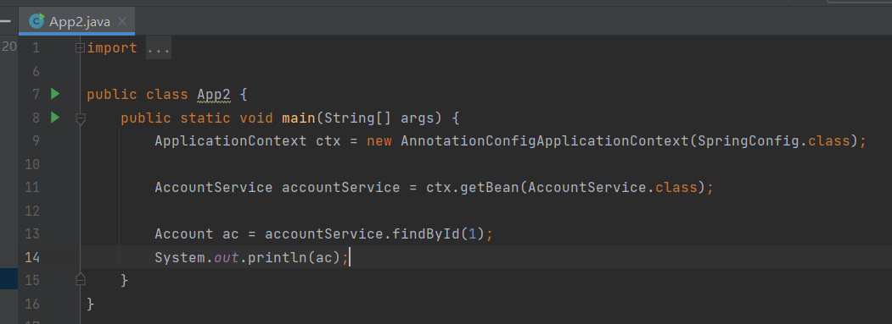


### 2.3.Spring整合Junit

加入Junit的依赖

~~~xml
<dependency>
  <groupId>junit</groupId>
  <artifactId>junit</artifactId>
  <version>4.12</version>
  <scope>test</scope>
</dependency>

<dependency>
  <groupId>org.springframework</groupId>
  <artifactId>spring-test</artifactId>
  <version>5.2.10.RELEASE</version>
</dependency>
~~~


在测试类前加上两个注解

~~~java
@RunWith(SpringJUnit4ClassRunner.class)
//设置Spring环境对应的配置类
@ContextConfiguration(classes = SpringConfig.class)
~~~

然后正常运行测试类即可


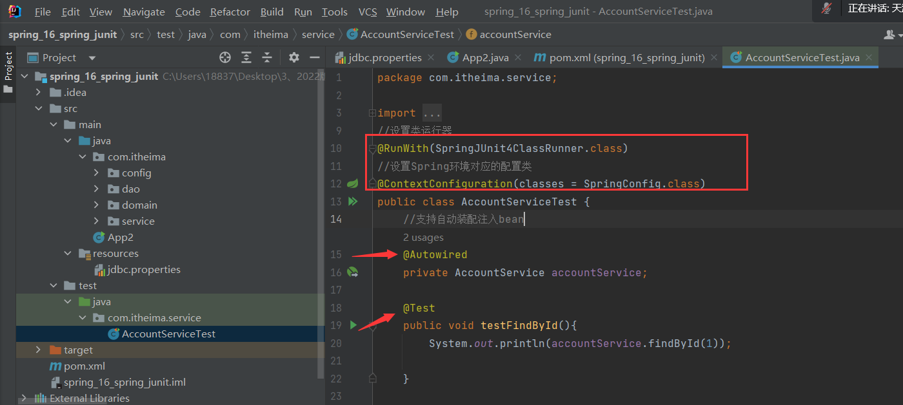


### 2.4.AOP

#### 2.4.1.AOP基础概念

AOP（Aspect Oriented Programming）

- 面向切面编程
- 在**不惊动原始程序**的基础下做**功能增强**
- 理念：无入侵式编程
- 为解耦而生


几个概念

- 通知
  - 在切入点执行的操作
  - 最终以方法的形式呈现
- 通知类
  - 定义通知的类
- 连接点
  - 执行过程中的任意位置
  - SpringAOP中指方法的执行
- 切入点
  - 一个具体的方法
  - 匹配的多个方法
  - 连接点包含切入点
- 切面
  - 描述切入点和通知的关系

有一个**通知类**，中间放入的方法被称为**通知**

一个待增强类中每个方法都是**连接点**

让某些连接点执行通知类中的通知，此时这些连接点被称为**切入点**

建立切入点和通知之间关系的代码被称为**切面**

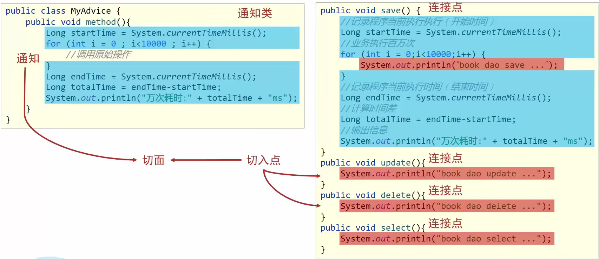


如上，update方法和delete方法被定义为切入点，则执行这两个方法时会执行左侧的通知方法


#### 2.4.2.AOP实现

##### 1.添加依赖

~~~xml
<dependency>
  <groupId>org.aspectj</groupId>
  <artifactId>aspectjweaver</artifactId>
  <version>1.9.4</version>
</dependency>
~~~


##### 2.创建通知类

1. 加入@Component注解

2. 加入@Aspect注解，标识这是用来实现AOP的类

3. 添加切入点

   - 添加一个方法，作为切入点的代理，命名随意

   - 使用@Pointcut注解，括号内填写要作为切入点的类，注意格式execution

4. 绑定切入点和通知

   - 再通知方法前加@Before注解，意为在执行pt方法前执行method方法
   - 现在，在执行update方法前，都会执行一遍method方法，并且完全没有修改BookDao的代码

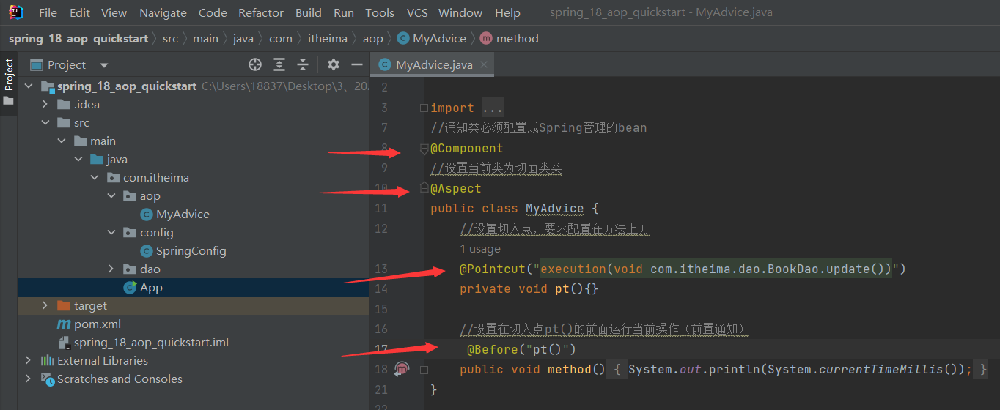


##### 3.配置文件添加AOP标识

在Spring配置类加上@EnableAspectJAutoProxy注解，告诉Spring要用AOP

~~~java
@Configuration
@ComponentScan("com.itheima")
//开启注解开发AOP功能
@EnableAspectJAutoProxy
public class SpringConfig {
}
~~~


#### 2.4.3.AOP工作流程


1. Spring容器启动
2. 读取所有切面配置中的切入点
   - 即被加入到@Before注解中的切入点
   - 没加入的切入点并没有形成切面
3. 初始化bean，判定bean对应的类中的方法是否匹配到任意切入点
   - 匹配失败，创建对象
   - 匹配成功，创建**原始对象**（目标对象）的**代理对象**，即上例中的pt方法，若此时打印对象，打印出来的是代理对象
4. 获取bean执行方法
   - 获取bean，调用方法并执行，完成操作
   - 获取的bean是代理对象时，根据定义运行原始方法和增强的内容


#### 2.4.4.切入点表达式

即@Pointcut中填写的东西

可以填写接口，也可以填写接口的实现类


**切入点表达式标准格式：**

动作关键字(访问修饰符 返回值 包名.类/接口名.方法名(参数)异常名)

例如

~~~java
execution(public void com.itheima.dao.BookDao.update())
~~~


- 可以使用*来代替**任意单个内容**，或者**前缀**或者**后缀**
  - `public * com.itheima.dao.Book*.*(*)`
    - 表示任意返回类型，名字以Book开头的接口（类）的任意名字的方法，且该方法必须只有一个参数
- .. 可以用来代表**任意多个内容**
  - public void com..UserService.findById(..)
    - 表示com下任意层级中的UserService包中的，有任意个参数的findById方法


**AOP表达式书写技巧**

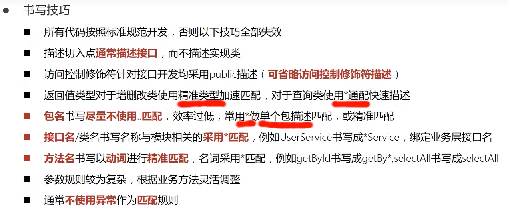


#### 2.4.5.通知类型

- @Before

  - 在执行切入点之前执行通知

- @After

  - 在执行切入点之后执行通知

- **@Around**

  - 在执行切入点前后都执行通知

  - 需要传入一个ProceedingJoinPoint类型参数用来表示什么时间执行切入点，而且必须抛出异常

  - 若原始的方法返回类型不是void类型且需要使用该返回结果，则需要将该通知定义为Object类型，并且最终返回切入点方法得到的值（不需要用的话还可以用void）

    - ~~~java
      @Around("pt()")
      public Object around(ProceedingJoinPoint pjp) throws Throwable {
          System.out.println("around before advice ...");
          //表示对原始操作的调用
          Object ret = pjp.proceed();
          
          System.out.println("around after advice ...");
          return ret;
      }
      ~~~

    - Object ret = pjp.proceed();前边的代码在切入点之前执行

    - Object ret = pjp.proceed();后边的代码在切入点之后执行

- @AfterReturning

  - 在切入点方法成功执行后执行通知
  - 若切入点抛出异常，则不会执行，但是此时@After会执行

- @AfterThrowing

  - 在切入点方法抛出异常后执行通知
  - 若切入点正常运行，则不会执行该通知


通过使用Signature类可以获取当前切入点的类型和名字

~~~java
    @Around("ProjectAdvice.servicePt()")
    public void runSpeed(ProceedingJoinPoint pjp) throws Throwable {
        //获取执行的签名对象
        Signature signature = pjp.getSignature();
        String className = signature.getDeclaringTypeName();
        String methodName = signature.getName();

        long start = System.currentTimeMillis();
        for (int i = 0; i < 10000; i++) {
           pjp.proceed();
        }
        long end = System.currentTimeMillis();
        System.out.println("万次执行："+ className+"."+methodName+"---->" +(end-start) + "ms");
    }
~~~


#### 2.4.6.通知获取数据

##### 1.获取参数

接入点有如下的int和String类型的两个参数

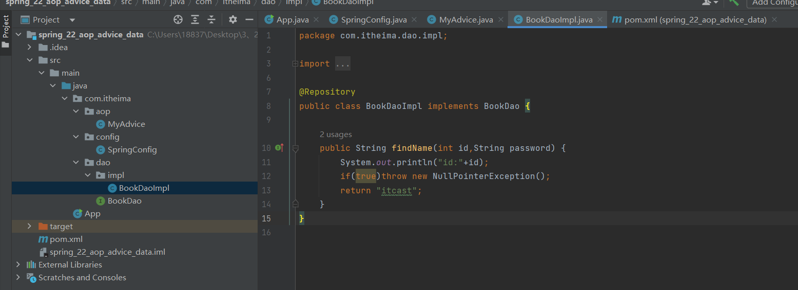


@Before和@After使用 JoinPoint来获取，存储在一个Object数组中

~~~java
@Before("pt()")
public void before(JoinPoint jp) {
    Object[] args = jp.getArgs();
    System.out.println(Arrays.toString(args));
    System.out.println("before advice ..." );
}
~~~


@Around使用ProceedJointPoint来获取，存储在一个Object数组中

若要对参数进行修改，则可以在调用peoceed时重新传入args数组

~~~java
@Around("pt()")
public Object around(ProceedingJoinPoint pjp) {
    Object[] args = pjp.getArgs();
    System.out.println(Arrays.toString(args));
    
    //修改传入的参数，并且从新传入
    args[0]=arg[0].toString().trim();//trim方法是去除字符串前后的空格
    Object ret=pjp.proceed(args);
    return ret;
}
~~~


##### 2.获取返回值

@AfterReturning需要在注解中加入returning参数，并在方法中加入Object类型的参数（这里写的是String），该形参即为返回值

@Around可以直接通过ProceedingJointPoint获取

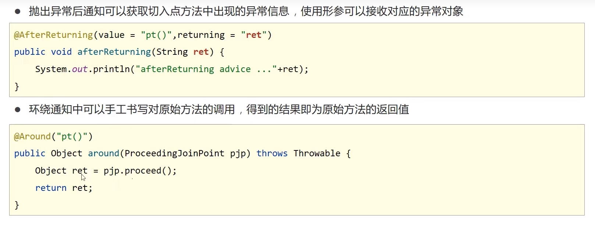


##### 3.获取抛出异常

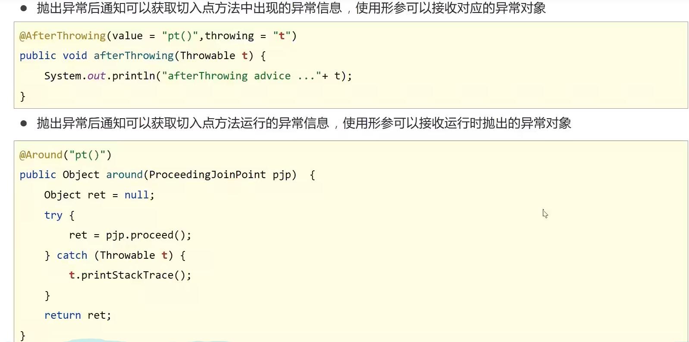


### 2.5.Spring事务


当执行一个事务时，若中途出现错误，则需要将整个数据恢复到事物开始执行的样子

例如：银行转账，a扣钱的代码在b加钱的代码之前，若执行完a扣钱后出现异常而没有执行b加钱，则a就直接少了100元，此时需要将整个事务回滚到a扣钱之前的状态


#### 2.5.1.Spring事务实现

1. 在**需要执行事务的类**（或者其接口，一般写在其接口前，降低耦合）**的方法**前加上**@Transactional注解**，表示要执行事务

   @Transactional也可以加在类前，表示该类的所有方法都要进行事务管理

   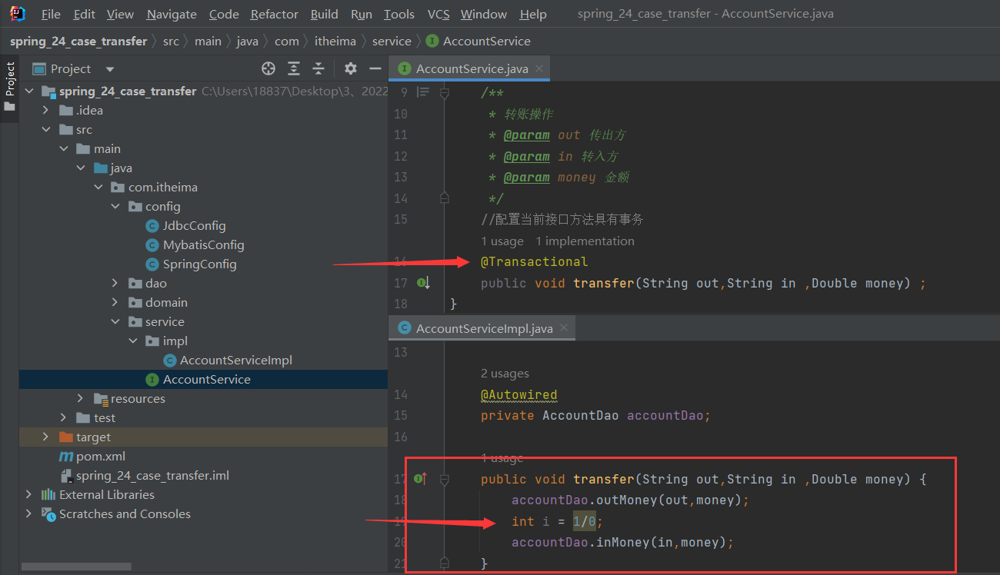

2. Jdbc配置类中**创建事务管理器**PlatformTransactionManager，并交给Spring管理

   ~~~java
   //配置事务管理器，mybatis使用的是jdbc事务
   @Bean
   public PlatformTransactionManager transactionManager(DataSource dataSource){
       //DataSource是创建为第三方的bean，可以直接使用
       DataSourceTransactionManager transactionManager = new DataSourceTransactionManager();
       transactionManager.setDataSource(dataSource);
       return transactionManager;
   }
   ~~~

   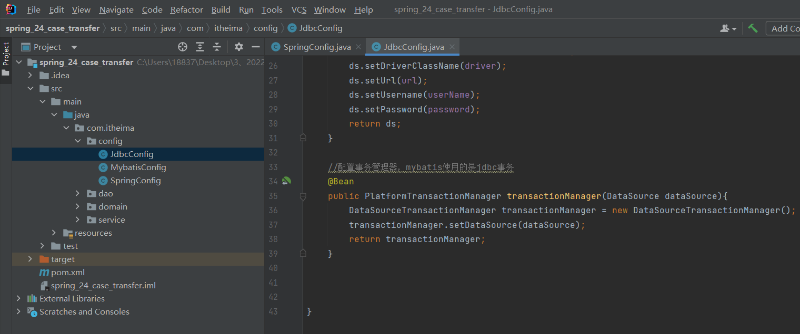

3. Spring配置类中加入@EnableTransactionalManagement注解，表示**启用事务**

   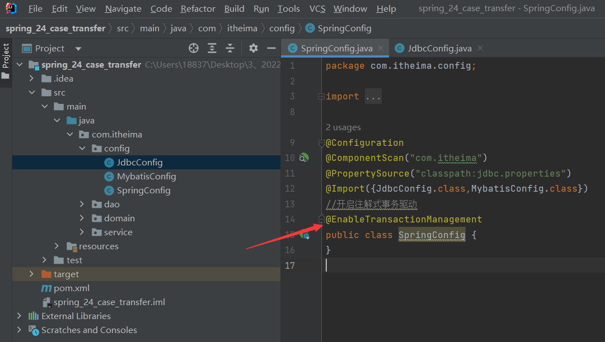


这样以后，在执行outMoney后出现异常，则inMoney不会执行，然后会进行回滚，不执行outMoney


#### 2.5.2.Spring事务角色

将所有写在同一个方法内的事务看作同一个事务

此时，共同的事务称为**事务管理员**

每个加入的事务称为**事务协调员**

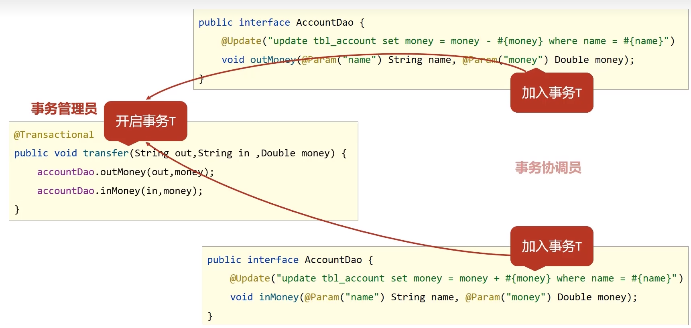


- 事务管理员：发起事务方，在Spring中代指开启事务的方法
- 事务协调员：加入事务方，在Spring中通常代指数据层方法，也可以是业务层方法


#### 2.5.3.Spring事务配置

对于有些异常，并不会执行回滚，此时需要将这些异常也加入需要回滚的队列

使用@Transactional中的roolbackFor属性，若有多个需要接入，使用数组形式roolbackFor={};

该图表示在transfer出现IOException时也要进行回滚

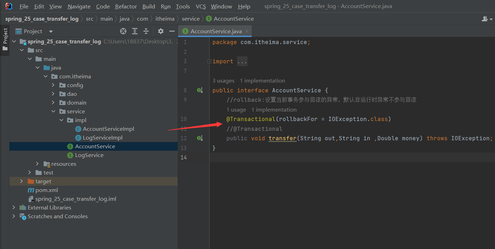


还有很多其他的配置

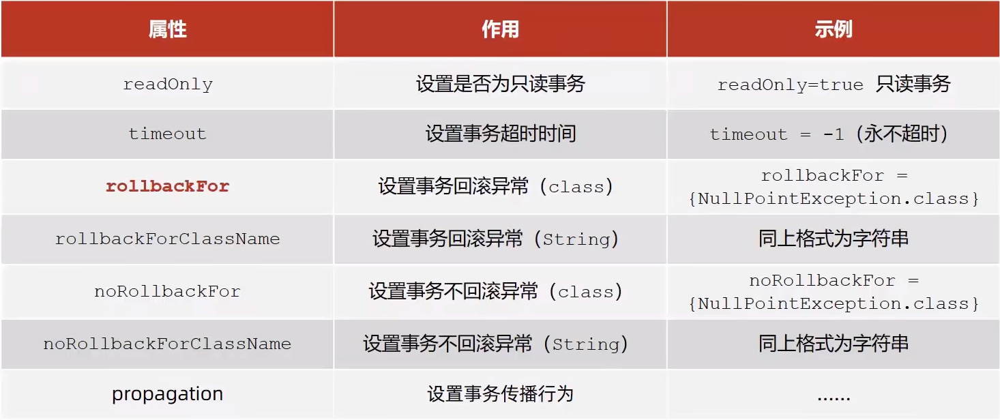


#### 2.5.4.Spring事务传播行为

即表示写在同一个方法中的几个事务对事务管理员的行为

一个事务管理员有三个事务协调员，每个事务协调员都可以决定自己是否要加入事务管理员的整体事务


对于一个事务协调员

加上@Transactional注解，并设置propagation属性，可以完成此操作

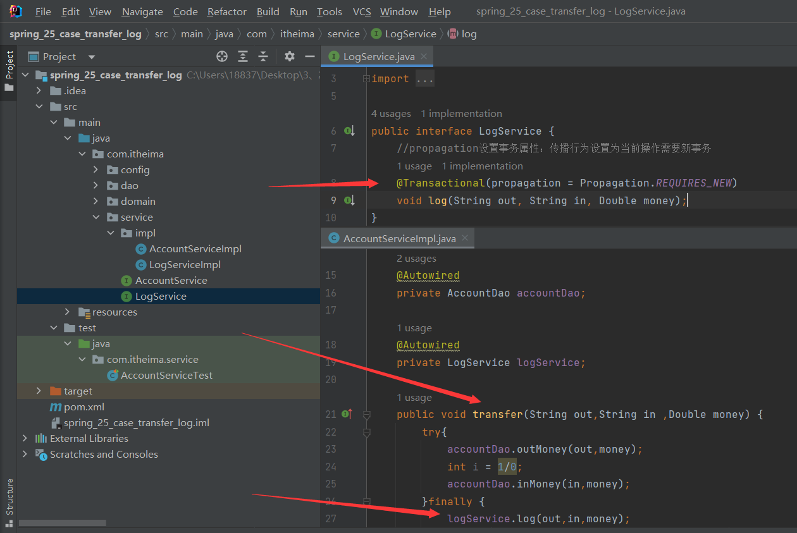


其中propagation的取值不同，对应的效果也不同

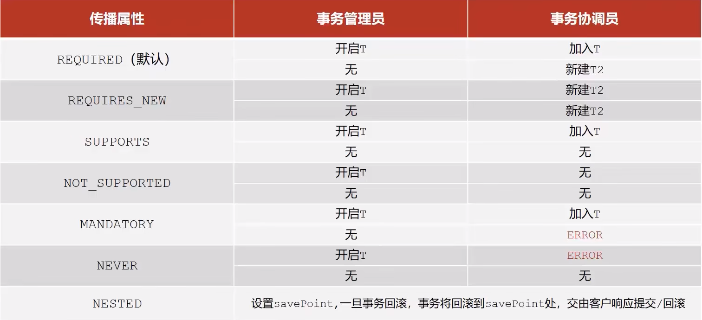


## 3.SpringMVC

### 3.1.SpringMVC简介

MyBatis用来替换数据层

SpringMVC用来替换表现层


**SpringMVC是一种基于Java实现MVC模型的轻量级Web框架**


**MVC设计模式**

针对web层进行了优化，采用了MVC设计模式，将其设计为`controller`、`view`和`Model`

* controller负责请求和数据的接收，接收后将其转发给service进行业务处理
* service根据需要会调用dao对数据进行增删改查
* dao把数据处理完后将结果交给service,service再交给controller
* controller根据需求组装成Model和View,Model和View组合起来生成页面转发给前端浏览器
* 这样做的好处就是controller可以处理多个请求，并对请求进行分发，执行不同的业务操作。


**SpringMVC主要负责的就是**

* controller如何接收请求和数据
* 如何将请求和数据转发给业务层
* 如何将响应数据转换成json发回到前端


### 3.2SpringMVC实现

#### 1.导入servlet包

~~~xml
<dependencies>
    <dependency>
      <groupId>javax.servlet</groupId>
      <artifactId>javax.servlet-api</artifactId>
      <version>3.1.0</version>
      <scope>provided</scope>
    </dependency>
    <dependency>
      <groupId>org.springframework</groupId>
      <artifactId>spring-webmvc</artifactId>
      <version>5.2.10.RELEASE</version>
    </dependency>
</dependencies>

<build>
<plugins>
  <plugin>
    <groupId>org.apache.tomcat.maven</groupId>
    <artifactId>tomcat7-maven-plugin</artifactId>
    <version>2.1</version>
    <configuration>
      <port>80</port>
      <path>/</path>
    </configuration>
  </plugin>
</plugins>
</build>
~~~

SpringMVC是基于Spring的，在pom.xml只导入了`spring-webmvc`jar包的原因是它会自动依赖spring相关坐标


#### 2.定义控制类

使用@Controller注释标识控制类

使用@RequestMapping注释标识访问路径

~~~java
@Controller
public class UserController {
    
    @RequestMapping("/save")
    public void save(){
        System.out.println("user save ...");
    }
}
~~~


#### 4.设置返回类型为Json

加上@ResponseBody注解，意为将return的内容总体作为响应内容给外界

返回一个Json格式

~~~java
@Controller
public class UserController {
    
    @RequestMapping("/save")
    @ResponseBody
    public String save(){
        System.out.println("user save ...");
        return "{'info':'springmvc'}";
    }
}
~~~


#### 5.定义SpringMVC配置类

同Spring配置类一样即可，名字变一下

~~~java
@Configuration
@ComponentScan("com.itheima.controller")
public class SpringMvcConfig {
}
~~~


#### 6.加载controller对应的bean

定义一个servlet容器启动的配置类，在里边加载Spring配置

该类需要继承AbstractDispatcherServletInitializer，并实现三个方法

~~~java
public class ServletContainersInitConfig extends AbstractDispatcherServletInitializer {
    
    //加载springmvc配置类
    protected WebApplicationContext createServletApplicationContext() {
        //初始化WebApplicationContext对象
        AnnotationConfigWebApplicationContext ctx = new AnnotationConfigWebApplicationContext();
        //加载指定配置类
        ctx.register(SpringMvcConfig.class);
        return ctx;
    }

    //设置由springmvc控制器处理的请求映射路径，这里设置为所有请求
    protected String[] getServletMappings() {
        return new String[]{"/"};
    }

    //加载spring配置类
    protected WebApplicationContext createRootApplicationContext() {
        return null;
    }
}
~~~

* AbstractDispatcherServletInitializer类是SpringMVC提供的快速初始化Web3.0容器的抽象类
* AbstractDispatcherServletInitializer提供了三个接口方法供用户实现
  * **createServletApplicationContext方法**，创建Servlet容器时，加载SpringMVC对应的bean并放入WebApplicationContext对象范围中，而WebApplicationContext的作用范围为ServletContext范围，即整个web容器范围
  * createServletApplicationContext用来加载SpringMVC环境
  * **getServletMappings方法**，设定SpringMVC对应的请求映射路径，即SpringMVC拦截哪些请求
  * **createRootApplicationContext方法**，如果创建Servlet容器时需要加载非SpringMVC对应的bean,使用当前方法进行，使用方式和createServletApplicationContext相同。
  * createRootApplicationContext用来加载Spring环境


#### 7.运行

使用tomcat运行项目


#### 8.总结

- 一次性工作
  - 创建工程，设置服务器，加载工程
  - 导入坐标
  - 创建web容器启动类，加载SpringMVC配置，并设置SpringMVC请求拦截路径
  - SpringMVC核心配置类（设置配置类，扫描controller包，加载Controller控制器bean）
- 多次工作
  - 定义处理请求的控制器类
  - 定义处理请求的控制器方法，并配置映射路径（@RequestMapping）与返回json数据（@ResponseBody）


### 3.3.bean加载控制

#### 1.问题分析

入门案例的内容已经做完了，在入门案例中我们创建过一个`SpringMvcConfig`的配置类，再回想前面咱们学习Spring的时候也创建过一个配置类`SpringConfig`。这两个配置类都需要加载资源，那么它们分别都需要加载哪些内容?

我们先来看下目前我们的项目目录结构:


* config目录存入的是配置类,写过的配置类有:

  * ServletContainersInitConfig
  * SpringConfig
  * SpringMvcConfig
  * JdbcConfig
  * MybatisConfig
* controller目录存放的是SpringMVC的controller类
* service目录存放的是service接口和实现类
* dao目录存放的是dao/Mapper接口

controller、service和dao这些类都需要被容器管理成bean对象，那么到底是该让SpringMVC加载还是让Spring加载呢?

* SpringMVC加载其相关bean(表现层bean),也就是controller包下的类
* Spring控制的bean
  * 业务bean(Service)
  * 功能bean(DataSource,SqlSessionFactoryBean,MapperScannerConfigurer等)

分析清楚谁该管哪些bean以后，接下来要解决的问题是如何让Spring和SpringMVC分开加载各自的内容。

在SpringMVC的配置类`SpringMvcConfig`中使用注解`@ComponentScan`，我们只需要将其扫描范围设置到controller即可，如


在Spring的配置类`SpringConfig`中使用注解`@ComponentScan`,当时扫描的范围中其实是已经包含了controller,如:


从包结构来看的话，Spring已经多把SpringMVC的controller类也给扫描到，所以针对这个问题该如何解决，就是咱们接下来要学习的内容。

概括的描述下咱们现在的问题就是==因为功能不同，如何避免Spring错误加载到SpringMVC的bean?==

#### 2.思路分析

针对上面的问题，解决方案也比较简单，就是:

* 加载Spring控制的bean的时候排除掉SpringMVC控制的bean

具体该如何排除：

* 方式一:Spring加载的bean设定扫描范围为精准范围，例如service包、dao包等
* 方式二:Spring加载的bean设定扫描范围为com.itheima,排除掉controller包中的bean
* 方式三:不区分Spring与SpringMVC的环境，加载到同一个环境中[了解即可]

#### 3.环境准备

- 创建一个Web的Maven项目

- pom.xml添加Spring依赖

  ```xml
  <?xml version="1.0" encoding="UTF-8"?>
  
  <project xmlns="http://maven.apache.org/POM/4.0.0" xmlns:xsi="http://www.w3.org/2001/XMLSchema-instance"
    xsi:schemaLocation="http://maven.apache.org/POM/4.0.0 http://maven.apache.org/xsd/maven-4.0.0.xsd">
    <modelVersion>4.0.0</modelVersion>
  
    <groupId>com.itheima</groupId>
    <artifactId>springmvc_02_bean_load</artifactId>
    <version>1.0-SNAPSHOT</version>
    <packaging>war</packaging>
  
    <dependencies>
      <dependency>
        <groupId>javax.servlet</groupId>
        <artifactId>javax.servlet-api</artifactId>
        <version>3.1.0</version>
        <scope>provided</scope>
      </dependency>
      <dependency>
        <groupId>org.springframework</groupId>
        <artifactId>spring-webmvc</artifactId>
        <version>5.2.10.RELEASE</version>
      </dependency>
      <dependency>
        <groupId>com.alibaba</groupId>
        <artifactId>druid</artifactId>
        <version>1.1.16</version>
      </dependency>
  
      <dependency>
        <groupId>org.mybatis</groupId>
        <artifactId>mybatis</artifactId>
        <version>3.5.6</version>
      </dependency>
  
      <dependency>
        <groupId>mysql</groupId>
        <artifactId>mysql-connector-java</artifactId>
        <version>5.1.47</version>
      </dependency>
  
      <dependency>
        <groupId>org.springframework</groupId>
        <artifactId>spring-jdbc</artifactId>
        <version>5.2.10.RELEASE</version>
      </dependency>
  
      <dependency>
        <groupId>org.mybatis</groupId>
        <artifactId>mybatis-spring</artifactId>
        <version>1.3.0</version>
      </dependency>
    </dependencies>
  
    <build>
      <plugins>
        <plugin>
          <groupId>org.apache.tomcat.maven</groupId>
          <artifactId>tomcat7-maven-plugin</artifactId>
          <version>2.1</version>
          <configuration>
            <port>80</port>
            <path>/</path>
          </configuration>
        </plugin>
      </plugins>
    </build>
  </project>
  
  ```

- 创建对应的配置类

  ```java
  public class ServletContainersInitConfig extends AbstractDispatcherServletInitializer {
      protected WebApplicationContext createServletApplicationContext() {
          AnnotationConfigWebApplicationContext ctx = new AnnotationConfigWebApplicationContext();
          ctx.register(SpringMvcConfig.class);
          return ctx;
      }
      protected String[] getServletMappings() {
          return new String[]{"/"};
      }
      protected WebApplicationContext createRootApplicationContext() {
        return null;
      }
  }
  
  @Configuration
  @ComponentScan("com.itheima.controller")
  public class SpringMvcConfig {
  }
  
  @Configuration
  @ComponentScan("com.itheima")
  public class SpringConfig {
  }
  
  ```

- 编写Controller，Service，Dao，Domain类

  ```java
  @Controller
  public class UserController {
  
      @RequestMapping("/save")
      @ResponseBody
      public String save(){
          System.out.println("user save ...");
          return "{'info':'springmvc'}";
      }
  }
  
  public interface UserService {
      public void save(User user);
  }
  
  @Service
  public class UserServiceImpl implements UserService {
      public void save(User user) {
          System.out.println("user service ...");
      }
  }
  
  public interface UserDao {
      @Insert("insert into tbl_user(name,age)values(#{name},#{age})")
      public void save(User user);
  }
  public class User {
      private Integer id;
      private String name;
      private Integer age;
      //setter..getter..toString略
  }
  ```

最终创建好的项目结构如下:

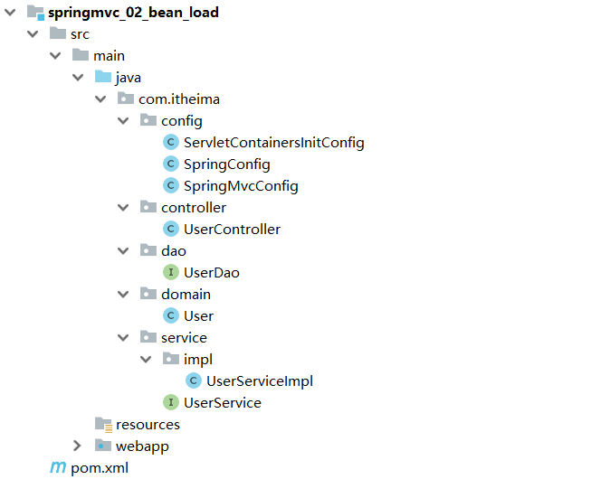

#### 4.设置bean加载控制

方式一:修改Spring配置类，设定扫描范围为精准范围。

```java
@Configuration
@ComponentScan({"com.itheima.service","comitheima.dao"})
public class SpringConfig {
}
```

**说明:**

上述只是通过例子说明可以精确指定让Spring扫描对应的包结构，真正在做开发的时候，因为Dao最终是交给`MapperScannerConfigurer`对象来进行扫描处理的，我们只需要将其扫描到service包即可。

方式二:修改Spring配置类，设定扫描范围为com.itheima,排除掉controller包中的bean

```java
@Configuration
@ComponentScan(value="com.itheima",
    excludeFilters=@ComponentScan.Filter(
    	type = FilterType.ANNOTATION,
        classes = Controller.class
    )
)
public class SpringConfig {
}
```

* excludeFilters属性：设置扫描加载bean时，排除的过滤规则

* type属性：设置排除规则，当前使用按照bean定义时的注解类型进行排除

  * ANNOTATION：按照注解排除
  * ASSIGNABLE_TYPE:按照指定的类型过滤
  * ASPECTJ:按照Aspectj表达式排除，基本上不会用
  * REGEX:按照正则表达式排除
  * CUSTOM:按照自定义规则排除

  大家只需要知道第一种ANNOTATION即可

* classes属性：设置排除的具体注解类，当前设置排除@Controller定义的bean

如何测试controller类已经被排除掉了?

```java
public class App{
	public static void main (String[] args){
        AnnotationConfigApplicationContext ctx = new AnnotationConfigApplicationContext(SpringConfig.class);
        System.out.println(ctx.getBean(UserController.class));
    }
}
```

如果被排除了，该方法执行就会报bean未被定义的错误

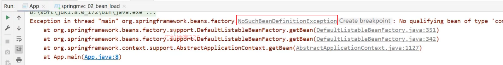

==注意:测试的时候，需要把SpringMvcConfig配置类上的@ComponentScan注解注释掉，否则不会报错==

出现问题的原因是，

* Spring配置类扫描的包是`com.itheima`
* SpringMVC的配置类，`SpringMvcConfig`上有一个@Configuration注解，也会被Spring扫描到
* SpringMvcConfig上又有一个@ComponentScan，把controller类又给扫描进来了
* 所以如果不把@ComponentScan注释掉，Spring配置类将Controller排除，但是因为扫描到SpringMVC的配置类，又将其加载回来，演示的效果就出不来
* 解决方案，也简单，把SpringMVC的配置类移出Spring配置类的扫描范围即可。

最后一个问题，有了Spring的配置类，要想在tomcat服务器启动将其加载，我们需要修改ServletContainersInitConfig

```java
public class ServletContainersInitConfig extends AbstractDispatcherServletInitializer {
    protected WebApplicationContext createServletApplicationContext() {
        AnnotationConfigWebApplicationContext ctx = new AnnotationConfigWebApplicationContext();
        ctx.register(SpringMvcConfig.class);
        return ctx;
    }
    protected String[] getServletMappings() {
        return new String[]{"/"};
    }
    protected WebApplicationContext createRootApplicationContext() {
      AnnotationConfigWebApplicationContext ctx = new AnnotationConfigWebApplicationContext();
        ctx.register(SpringConfig.class);
        return ctx;
    }
}
```

对于上述的配置方式，Spring还提供了一种更简单的配置方式，可以不用再去创建`AnnotationConfigWebApplicationContext`对象，不用手动`register`对应的配置类，如何实现?

```java
public class ServletContainersInitConfig extends AbstractAnnotationConfigDispatcherServletInitializer {

    protected Class<?>[] getRootConfigClasses() {
        return new Class[]{SpringConfig.class};
    }

    protected Class<?>[] getServletConfigClasses() {
        return new Class[]{SpringMvcConfig.class};
    }

    protected String[] getServletMappings() {
        return new String[]{"/"};
    }
}
```


#### 知识点1：@ComponentScan

| 名称     | @ComponentScan                                               |
| -------- | ------------------------------------------------------------ |
| 类型     | 类注解                                                       |
| 位置     | 类定义上方                                                   |
| 作用     | 设置spring配置类扫描路径，用于加载使用注解格式定义的bean     |
| 相关属性 | excludeFilters:排除扫描路径中加载的bean,需要指定类别(type)和具体项(classes)<br/>includeFilters:加载指定的bean，需要指定类别(type)和具体项(classes) |


### 3.4.请求与响应

**即实现postman和程序的连接**


#### 1.请求映射路径

使用`@RequestMapping`注解来指定路径

当多个不同controller类中有相同的路径时，会产生冲突，此时需要给类一个路径

在类的前边加上`@RequestMapping`注解来指定该类的一级路径

~~~Java
@Controller
@RequestMapping("/user")
public class UserController {

    @RequestMapping("/save")
    @ResponseBody
    public String save(){
        System.out.println("user save ...");
        return "{'module':'user save'}";
    }
    
    @RequestMapping("/delete")
    @ResponseBody
    public String save(){
        System.out.println("user delete ...");
        return "{'module':'user delete'}";
    }
}

@Controller
@RequestMapping("/book")
public class BookController {

    @RequestMapping("/save")
    @ResponseBody
    public String save(){
        System.out.println("book save ...");
        return "{'module':'book save'}";
    }
}
~~~


**注意:**

* 当类上和方法上都添加了`@RequestMapping`注解，前端发送请求的时候，要和两个注解的value值相加匹配才能访问到。
* @RequestMapping注解value属性前面加不加`/`都可以


#### 2.请求参数

##### GET发送单个参数

发送请求与参数:

```
http://localhost/commonParam?name=itcast
```


接收参数：

```java
@Controller
public class UserController {

    @RequestMapping("/commonParam")
    @ResponseBody
    public String commonParam(String name){
        System.out.println("普通参数传递 name ==> "+name);
        return "{'module':'commonParam'}";
    }
}
```

##### GET发送多个参数

发送请求与参数:

```
http://localhost/commonParam?name=itcast&age=15
```

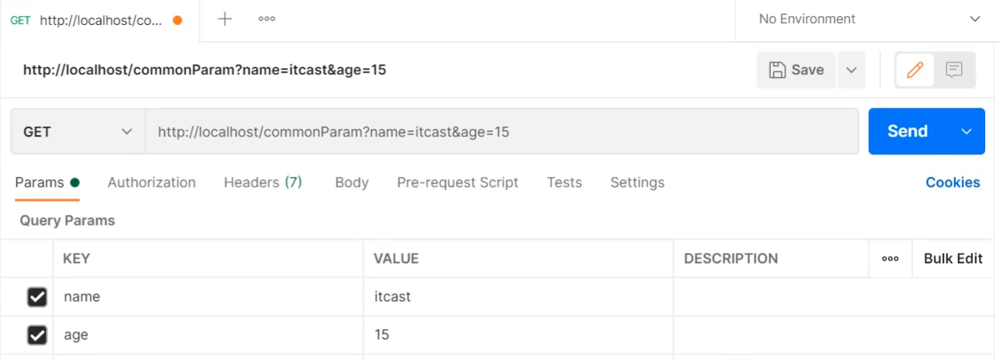

接收参数：

```java
@Controller
public class UserController {

    @RequestMapping("/commonParam")
    @ResponseBody
    public String commonParam(String name,int age){
        System.out.println("普通参数传递 name ==> "+name);
        System.out.println("普通参数传递 age ==> "+age);
        return "{'module':'commonParam'}";
    }
}
```

##### GET请求中文乱码

如果我们传递的参数中有中文，你会发现接收到的参数会出现中文乱码问题。

发送请求:`http://localhost/commonParam?name=张三&age=18`

控制台:


出现乱码的原因相信大家都清楚，Tomcat8.5以后的版本已经处理了中文乱码的问题，但是IDEA中的Tomcat插件目前只到Tomcat7，所以需要修改pom.xml来解决GET请求中文乱码问题

```xml
<build>
    <plugins>
      <plugin>
        <groupId>org.apache.tomcat.maven</groupId>
        <artifactId>tomcat7-maven-plugin</artifactId>
        <version>2.1</version>
        <configuration>
          <port>80</port><!--tomcat端口号-->
          <path>/</path> <!--虚拟目录-->
          <uriEncoding>UTF-8</uriEncoding><!--访问路径编解码字符集-->
        </configuration>
      </plugin>
    </plugins>
  </build>
```

##### POST发送参数

发送请求与参数:

接收参数：

和GET一致，不用做任何修改

```java
@Controller
public class UserController {

    @RequestMapping("/commonParam")
    @ResponseBody
    public String commonParam(String name,int age){
        System.out.println("普通参数传递 name ==> "+name);
        System.out.println("普通参数传递 age ==> "+age);
        return "{'module':'commonParam'}";
    }
}
```

##### POST请求中文乱码

发送请求与参数:


接收参数:

控制台打印，会发现有中文乱码问题。


解决方案:配置过滤器

```java
public class ServletContainersInitConfig extends AbstractAnnotationConfigDispatcherServletInitializer {
    protected Class<?>[] getRootConfigClasses() {
        return new Class[0];
    }

    protected Class<?>[] getServletConfigClasses() {
        return new Class[]{SpringMvcConfig.class};
    }

    protected String[] getServletMappings() {
        return new String[]{"/"};
    }

    //乱码处理
    @Override
    protected Filter[] getServletFilters() {
        CharacterEncodingFilter filter = new CharacterEncodingFilter();
        filter.setEncoding("UTF-8");
        return new Filter[]{filter};
    }
}
```

CharacterEncodingFilter是在spring-web包中，所以用之前需要导入对应的jar包。


### 3.5.五种类型参数传递

**postman向程序传递参数并且程序接收这些数据**


前面我们已经能够使用GET或POST来发送请求和数据，所携带的数据都是比较简单的数据，接下来在这个基础上，我们来研究一些比较复杂的参数传递，常见的参数种类有:

* 普通参数
* POJO类型参数
* 嵌套POJO类型参数
* 数组类型参数
* 集合类型参数

这些参数如何发送，后台改如何接收?我们一个个来学习。

#### 4.3.1 普通参数

* 普通参数:url地址传参，地址参数名与形参变量名相同，定义形参即可接收参数。


如果形参与地址参数名不一致该如何解决?

发送请求与参数:

```
http://localhost/commonParamDifferentName?name=张三&age=18
```

后台接收参数:

```java
@RequestMapping("/commonParamDifferentName")
@ResponseBody
public String commonParamDifferentName(String userName , int age){
    System.out.println("普通参数传递 userName ==> "+userName);
    System.out.println("普通参数传递 age ==> "+age);
    return "{'module':'common param different name'}";
}
```

因为前端给的是`name`,后台接收使用的是`userName`,两个名称对不上，导致接收数据失败:


解决方案:使用@RequestParam注解

```java
@RequestMapping("/commonParamDifferentName")
    @ResponseBody
    public String commonParamDifferentName(@RequestPaam("name") String userName , int age){
        System.out.println("普通参数传递 userName ==> "+userName);
        System.out.println("普通参数传递 age ==> "+age);
        return "{'module':'common param different name'}";
    }
```

**注意:写上@RequestParam注解框架就不需要自己去解析注入，能提升框架处理性能**

#### 4.3.2 POJO数据类型

POJO即实体类

简单数据类型一般处理的是参数个数比较少的请求，如果参数比较多，那么后台接收参数的时候就比较复杂，这个时候我们可以考虑使用POJO数据类型。

* POJO参数：请求参数名与形参对象属性名相同，定义POJO类型形参即可接收参数

此时需要使用前面准备好的POJO类，先来看下User

```java
public class User {
    private String name;
    private int age;
    //setter...getter...略
}
```

发送请求和参数:


后台接收参数:

```java
//POJO参数：请求参数与形参对象中的属性对应即可完成参数传递
@RequestMapping("/pojoParam")
@ResponseBody
public String pojoParam(User user){
    System.out.println("pojo参数传递 user ==> "+user);
    return "{'module':'pojo param'}";
}
```

**注意:**

* POJO参数接收，前端GET和POST发送请求数据的方式不变。
* ==请求参数key的名称要和POJO中属性的名称一致，否则无法封装。==

#### 4.3.3 嵌套POJO类型参数

如果POJO对象中嵌套了其他的POJO类，如

```java
public class Address {
    private String province;
    private String city;
    //setter...getter...略
}
public class User {
    private String name;
    private int age;
    private Address address;
    //setter...getter...略
}
```

* 嵌套POJO参数：请求参数名与形参对象属性名相同，按照对象层次结构关系即可接收嵌套POJO属性参数

发送请求和参数:


后台接收参数:

```java
//POJO参数：请求参数与形参对象中的属性对应即可完成参数传递
@RequestMapping("/pojoParam")
@ResponseBody
public String pojoParam(User user){
    System.out.println("pojo参数传递 user ==> "+user);
    return "{'module':'pojo param'}";
}
```

**注意:**

==请求参数key的名称要和POJO中属性的名称一致，否则无法封装==

#### 4.3.4 数组类型参数

举个简单的例子，如果前端需要获取用户的爱好，爱好绝大多数情况下都是多个，如何发送请求数据和接收数据呢?

* 数组参数：请求参数名与形参对象属性名相同且请求参数为多个，定义数组类型即可接收参数

发送请求和参数:


后台接收参数:

```java
  //数组参数：同名请求参数可以直接映射到对应名称的形参数组对象中
    @RequestMapping("/arrayParam")
    @ResponseBody
    public String arrayParam(String[] likes){
        System.out.println("数组参数传递 likes ==> "+ Arrays.toString(likes));
        return "{'module':'array param'}";
    }
```

#### 4.3.5 集合类型参数

数组能接收多个值，那么集合是否也可以实现这个功能呢?

发送请求和参数:


后台接收参数:

```java
//集合参数：同名请求参数可以使用@RequestParam注解映射到对应名称的集合对象中作为数据
@RequestMapping("/listParam")
@ResponseBody
public String listParam(List<String> likes){
    System.out.println("集合参数传递 likes ==> "+ likes);
    return "{'module':'list param'}";
}
```

运行会报错，


错误的原因是:SpringMVC将List看做是一个POJO对象来处理，将其创建一个对象并准备把前端的数据封装到对象中，但是List是一个接口无法创建对象，所以报错。

解决方案是:使用`@RequestParam`注解

```java
//集合参数：同名请求参数可以使用@RequestParam注解映射到对应名称的集合对象中作为数据
@RequestMapping("/listParam")
@ResponseBody
public String listParam(@RequestParam List<String> likes){
    System.out.println("集合参数传递 likes ==> "+ likes);
    return "{'module':'list param'}";
}
```

* 集合保存普通参数：请求参数名与形参集合对象名相同且请求参数为多个，@RequestParam绑定参数关系
* 对于简单数据类型使用数组会比集合更简单些。


#### 知识点1：@RequestParam

| 名称     | @RequestParam                                          |
| -------- | ------------------------------------------------------ |
| 类型     | 形参注解                                               |
| 位置     | SpringMVC控制器方法形参定义前面                        |
| 作用     | 绑定请求参数与处理器方法形参间的关系                   |
| 相关参数 | required：是否为必传参数 <br/>defaultValue：参数默认值 |


### 3.6.Json数据传参

**接收并处理postman传来的Json类型的数据**


前面我们说过，现在比较流行的开发方式为异步调用。前后台以异步方式进行交换，传输的数据使用的是==JSON==,所以前端如果发送的是JSON数据，后端该如何接收?

对于JSON数据类型，我们常见的有三种:

- json普通数组（["value1","value2","value3",...]）
- json对象（{key1:value1,key2:value2,...}）
- json对象数组（[{key1:value1,...},{key2:value2,...}]）

对于上述数据，前端如何发送，后端如何接收?

#### JSON普通数组

###### 步骤1:pom.xml添加依赖

SpringMVC默认使用的是jackson来处理json的转换，所以需要在pom.xml添加jackson依赖

```xml
<dependency>
    <groupId>com.fasterxml.jackson.core</groupId>
    <artifactId>jackson-databind</artifactId>
    <version>2.9.0</version>
</dependency>
```

###### 步骤2:PostMan发送JSON数据


###### 步骤3:开启SpringMVC注解支持

在SpringMVC的配置类中开启SpringMVC的注解支持，这里面就包含了将JSON转换成对象的功能。

```java
@Configuration
@ComponentScan("com.itheima.controller")
//开启json数据类型自动转换
@EnableWebMvc
public class SpringMvcConfig {
}
```

###### 步骤4:参数前添加@RequestBody

```java
//使用@RequestBody注解将外部传递的json数组数据映射到形参的集合对象中作为数据
@RequestMapping("/listParamForJson")
@ResponseBody
public String listParamForJson(@RequestBody List<String> likes){
    System.out.println("list common(json)参数传递 list ==> "+likes);
    return "{'module':'list common for json param'}";
}
```

###### 步骤5:启动运行程序

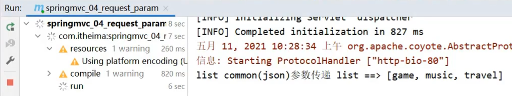

JSON普通数组的数据就已经传递完成，下面针对JSON对象数据和JSON对象数组的数据该如何传递呢?

#### JSON对象数据

我们会发现，只需要关注请求和数据如何发送?后端数据如何接收?

请求和数据的发送:

```json
{
	"name":"itcast",
	"age":15
}
```


后端接收数据：

```java
@RequestMapping("/pojoParamForJson")
@ResponseBody
public String pojoParamForJson(@RequestBody User user){
    System.out.println("pojo(json)参数传递 user ==> "+user);
    return "{'module':'pojo for json param'}";
}
```

启动程序访问测试


**说明:**

address为null的原因是前端没有传递数据给后端。

如果想要address也有数据，我们需求修改前端传递的数据内容:

```json
{
	"name":"itcast",
	"age":15,
    "address":{
        "province":"beijing",
        "city":"beijing"
    }
}
```

再次发送请求，就能看到address中的数据


#### JSON对象数组

集合中保存多个POJO该如何实现?

请求和数据的发送:

```json
[
    {"name":"itcast","age":15},
    {"name":"itheima","age":12}
]
```

 

后端接收数据:

```java
@RequestMapping("/listPojoParamForJson")
@ResponseBody
public String listPojoParamForJson(@RequestBody List<User> list){
    System.out.println("list pojo(json)参数传递 list ==> "+list);
    return "{'module':'list pojo for json param'}";
}
```

启动程序访问测试

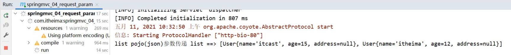

**小结**

SpringMVC接收JSON数据的实现步骤为:

(1)导入jackson包

(2)使用PostMan发送JSON数据

(3)开启SpringMVC注解驱动，在配置类上添加@EnableWebMvc注解

(4)Controller方法的参数前添加@RequestBody注解

#### 知识点1：@EnableWebMvc

| 名称 | @EnableWebMvc             |
| ---- | ------------------------- |
| 类型 | ==配置类注解==            |
| 位置 | SpringMVC配置类定义上方   |
| 作用 | 开启SpringMVC多项辅助功能 |

#### 知识点2：@RequestBody

| 名称 | @RequestBody                                                 |
| ---- | ------------------------------------------------------------ |
| 类型 | ==形参注解==                                                 |
| 位置 | SpringMVC控制器方法形参定义前面                              |
| 作用 | 将请求中请求体所包含的数据传递给请求参数，此注解一个处理器方法只能使用一次 |

#### @RequestBody与@RequestParam区别

* 区别
  * @RequestParam用于接收url地址传参，表单传参【application/x-www-form-urlencoded】
  * @RequestBody用于接收json数据【application/json】

* 应用
  * 后期开发中，发送json格式数据为主，@RequestBody应用较广
  * 如果发送非json格式数据，选用@RequestParam接收请求参数


### 3.7.日期类型参数传递

**程序接收postman中传来的日期类型的数据**


前面我们处理过简单数据类型、POJO数据类型、数组和集合数据类型以及JSON数据类型，接下来我们还得处理一种开发中比较常见的一种数据类型，`日期类型`

日期类型比较特殊，因为对于日期的格式有N多中输入方式，比如:

* 2088-08-18
* 2088/08/18
* 08/18/2088
* ......

针对这么多日期格式，SpringMVC该如何接收，它能很好的处理日期类型数据么?

#### 步骤1:编写方法接收日期数据

在UserController类中添加方法，把参数设置为日期类型

```java
@RequestMapping("/dataParam")
@ResponseBody
public String dataParam(Date date)
    System.out.println("参数传递 date ==> "+date);
    return "{'module':'data param'}";
}
```

#### 步骤2:启动Tomcat服务器

查看控制台是否报错，如果有错误，先解决错误。

#### 步骤3:使用PostMan发送请求

使用PostMan发送GET请求，并设置date参数

`http://localhost/dataParam?date=2088/08/08`


#### 步骤4:查看控制台


通过打印，我们发现SpringMVC可以接收日期数据类型，并将其打印在控制台。

这个时候，我们就想如果把日期参数的格式改成其他的，SpringMVC还能处理么?

#### 步骤5:更换日期格式

为了能更好的看到程序运行的结果，我们在方法中多添加一个日期参数

```java
@RequestMapping("/dataParam")
@ResponseBody
public String dataParam(Date date,Date date1)
    System.out.println("参数传递 date ==> "+date);
    return "{'module':'data param'}";
}
```

使用PostMan发送请求，携带两个不同的日期格式，

`http://localhost/dataParam?date=2088/08/08&date1=2088-08-08`


发送请求和数据后，页面会报400，控制台会报出一个错误

Resolved [org.springframework.web.method.annotation.==MethodArgumentTypeMismatchException==: Failed to convert value of type 'java.lang.String' to required type 'java.util.Date'; nested exception is org.springframework.core.convert.==ConversionFailedException==: Failed to convert from type [java.lang.String] to type [java.util.Date] for value '2088-08-08'; nested exception is java.lang.IllegalArgumentException]

从错误信息可以看出，错误的原因是在将`2088-08-08`转换成日期类型的时候失败了，原因是SpringMVC默认支持的字符串转日期的格式为`yyyy/MM/dd`,而我们现在传递的不符合其默认格式，SpringMVC就无法进行格式转换，所以报错。

解决方案也比较简单，需要使用`@DateTimeFormat`

```java
@RequestMapping("/dataParam")
@ResponseBody
public String dataParam(Date date,
                        @DateTimeFormat(pattern="yyyy-MM-dd") Date date1){
    System.out.println("参数传递 date ==> "+date);
	System.out.println("参数传递 date1(yyyy-MM-dd) ==> "+date1);
    return "{'module':'data param'}";
}
```

重新启动服务器，重新发送请求测试，SpringMVC就可以正确的进行日期转换了

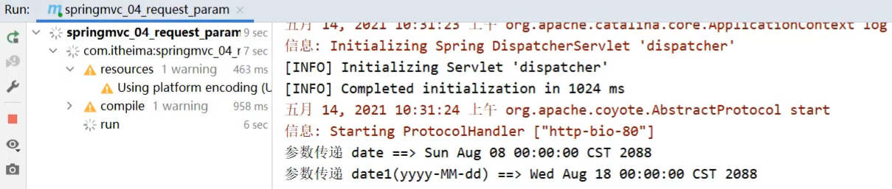

#### 步骤6:携带时间的日期

接下来我们再来发送一个携带时间的日期，看下SpringMVC该如何处理?

先修改UserController类，添加第三个参数

```java
@RequestMapping("/dataParam")
@ResponseBody
public String dataParam(Date date,
                        @DateTimeFormat(pattern="yyyy-MM-dd") Date date1,
                        @DateTimeFormat(pattern="yyyy/MM/dd HH:mm:ss") Date date2)
    System.out.println("参数传递 date ==> "+date);
	System.out.println("参数传递 date1(yyyy-MM-dd) ==> "+date1);
	System.out.println("参数传递 date2(yyyy/MM/dd HH:mm:ss) ==> "+date2);
    return "{'module':'data param'}";
}
```

使用PostMan发送请求，携带两个不同的日期格式，

`http://localhost/dataParam?date=2088/08/08&date1=2088-08-08&date2=2088/08/08 8:08:08`


重新启动服务器，重新发送请求测试，SpringMVC就可以将日期时间的数据进行转换


#### 知识点1：@DateTimeFormat

| 名称     | @DateTimeFormat                 |
| -------- | ------------------------------- |
| 类型     | ==形参注解==                    |
| 位置     | SpringMVC控制器方法形参前面     |
| 作用     | 设定日期时间型数据格式          |
| 相关属性 | pattern：指定日期时间格式字符串 |

#### 内部实现原理

讲解内部原理之前，我们需要先思考个问题:

* 前端传递字符串，后端使用日期Date接收
* 前端传递JSON数据，后端使用对象接收
* 前端传递字符串，后端使用Integer接收
* 后台需要的数据类型有很多中
* 在数据的传递过程中存在很多类型的转换

问:谁来做这个类型转换?

答:SpringMVC

问:SpringMVC是如何实现类型转换的?

答:SpringMVC中提供了很多类型转换接口和实现类

在框架中，有一些类型转换接口，其中有:

* (1) Converter接口

```java
/**
*	S: the source type
*	T: the target type
*/
public interface Converter<S, T> {
    @Nullable
    //该方法就是将从页面上接收的数据(S)转换成我们想要的数据类型(T)返回
    T convert(S source);
}
```

**注意:Converter所属的包为`org.springframework.core.convert.converter`**

Converter接口的实现类


框架中有提供很多对应Converter接口的实现类，用来实现不同数据类型之间的转换,如:

请求参数年龄数据（String→Integer）

日期格式转换（String → Date）

* (2) HttpMessageConverter接口

该接口是实现对象与JSON之间的转换工作

**==注意:SpringMVC的配置类把@EnableWebMvc当做标配配置上去，不要省略==**


### 3.8.响应

**即返回Json数据或者JS页面给请求方**


SpringMVC接收到请求和数据后，进行一些了的处理，当然这个处理可以是转发给Service，Service层再调用Dao层完成的，不管怎样，处理完以后，都需要将结果告知给用户。

比如:根据用户ID查询用户信息、查询用户列表、新增用户等。

对于响应，主要就包含两部分内容：

* 响应页面
* 响应数据
  * 文本数据
  * json数据

因为异步调用是目前常用的主流方式，所以我们需要更关注的就是如何返回JSON数据，对于其他只需要认识了解即可。

#### 3.8.1 环境准备

- 创建一个Web的Maven项目

- pom.xml添加Spring依赖

  ```xml
  <?xml version="1.0" encoding="UTF-8"?>
  
  <project xmlns="http://maven.apache.org/POM/4.0.0" xmlns:xsi="http://www.w3.org/2001/XMLSchema-instance"
    xsi:schemaLocation="http://maven.apache.org/POM/4.0.0 http://maven.apache.org/xsd/maven-4.0.0.xsd">
    <modelVersion>4.0.0</modelVersion>
  
    <groupId>com.itheima</groupId>
    <artifactId>springmvc_05_response</artifactId>
    <version>1.0-SNAPSHOT</version>
    <packaging>war</packaging>
  
    <dependencies>
      <dependency>
        <groupId>javax.servlet</groupId>
        <artifactId>javax.servlet-api</artifactId>
        <version>3.1.0</version>
        <scope>provided</scope>
      </dependency>
      <dependency>
        <groupId>org.springframework</groupId>
        <artifactId>spring-webmvc</artifactId>
        <version>5.2.10.RELEASE</version>
      </dependency>
      <dependency>
        <groupId>com.fasterxml.jackson.core</groupId>
        <artifactId>jackson-databind</artifactId>
        <version>2.9.0</version>
      </dependency>
    </dependencies>
  
    <build>
      <plugins>
        <plugin>
          <groupId>org.apache.tomcat.maven</groupId>
          <artifactId>tomcat7-maven-plugin</artifactId>
          <version>2.1</version>
          <configuration>
            <port>80</port>
            <path>/</path>
          </configuration>
        </plugin>
      </plugins>
    </build>
  </project>
  
  ```

- 创建对应的配置类

  ```java
  public class ServletContainersInitConfig extends AbstractAnnotationConfigDispatcherServletInitializer {
      protected Class<?>[] getRootConfigClasses() {
          return new Class[0];
      }
  
      protected Class<?>[] getServletConfigClasses() {
          return new Class[]{SpringMvcConfig.class};
      }
  
      protected String[] getServletMappings() {
          return new String[]{"/"};
      }
  
      //乱码处理
      @Override
      protected Filter[] getServletFilters() {
          CharacterEncodingFilter filter = new CharacterEncodingFilter();
          filter.setEncoding("UTF-8");
          return new Filter[]{filter};
      }
  }
  
  @Configuration
  @ComponentScan("com.itheima.controller")
  //开启json数据类型自动转换
  @EnableWebMvc
  public class SpringMvcConfig {
  }
  
  
  ```

- 编写模型类User

  ```java
  public class User {
      private String name;
      private int age;
      //getter...setter...toString省略
  }
  ```

- webapp下创建page.jsp

  ```jsp
  <html>
  <body>
  <h2>Hello Spring MVC!</h2>
  </body>
  </html>
  ```

- 编写UserController

  ```java
  @Controller
  public class UserController {
  
      
  }
  ```

最终创建好的项目结构如下:

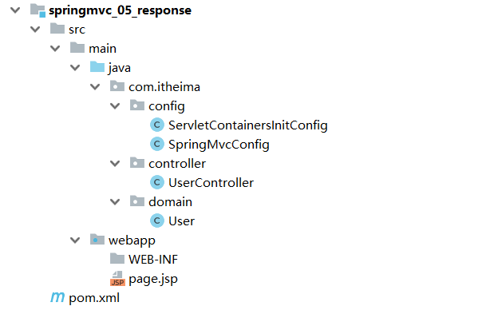

#### 3.8.2 响应页面[了解]

##### 步骤1:设置返回页面

```java
@Controller
public class UserController {
    
    @RequestMapping("/toJumpPage")
    //注意
    //1.此处不能添加@ResponseBody,如果加了该注入，会直接将page.jsp当字符串返回前端
    //2.方法需要返回String
    //3.不加@ResponseBody表示直接返回page.jsp这个文件
    public String toJumpPage(){
        System.out.println("跳转页面");
        return "page.jsp";
    }
    
}
```

##### 步骤2:启动程序测试

此处涉及到页面跳转，所以不适合采用PostMan进行测试，直接打开浏览器，输入

`http://localhost/toJumpPage`


#### 3.8.3 返回文本数据[了解]

##### 步骤1:设置返回文本内容

```java
@Controller
public class UserController {
    
   	@RequestMapping("/toText")
	//注意此处该注解就不能省略，如果省略了,会把response text当前页面(文件)名称去查找，如果没有回报404错误
    @ResponseBody
    public String toText(){
        System.out.println("返回纯文本数据");
        return "response text";
    }
    
}
```

##### 步骤2:启动程序测试

此处不涉及到页面跳转，因为我们现在发送的是GET请求，可以使用浏览器也可以使用PostMan进行测试，输入地址`http://localhost/toText`访问


#### 3.8.4 响应JSON数据

##### 响应POJO对象

```java
@Controller
public class UserController {
    
    @RequestMapping("/toJsonPOJO")
    @ResponseBody
    public User toJsonPOJO(){
        System.out.println("返回json对象数据");
        User user = new User();
        user.setName("itcast");
        user.setAge(15);
        return user;
    }
    
}
```

返回值为实体类对象，设置返回值为实体类类型，即可实现返回对应对象的json数据，需要依赖==@ResponseBody==注解和==@EnableWebMvc==注解

@EnableWebMvc注解是在配置类中的，用来完成实体对象和Json之间的转换

重新启动服务器，访问`http://localhost/toJsonPOJO`


##### 响应POJO集合对象

```java
@Controller
public class UserController {
    
    @RequestMapping("/toJsonList")
    @ResponseBody
    public List<User> toJsonList(){
        System.out.println("返回json集合数据");
        User user1 = new User();
        user1.setName("传智播客");
        user1.setAge(15);

        User user2 = new User();
        user2.setName("黑马程序员");
        user2.setAge(12);

        List<User> userList = new ArrayList<User>();
        userList.add(user1);
        userList.add(user2);

        return userList;
    }
    
}

```

重新启动服务器，访问`http://localhost/toJsonList`


##### 知识点1：@ResponseBody

| 名称     | @ResponseBody                                                |
| -------- | ------------------------------------------------------------ |
| 类型     | ==方法类注解==                                               |
| 位置     | SpringMVC控制器方法定义上方和控制类上                        |
| 作用     | 设置当前控制器返回值作为响应体,<br/>写在类上，该类的所有方法都有该注解功能 |
| 相关属性 | pattern：指定日期时间格式字符串                              |

**说明:**

* 该注解可以写在类上或者方法上
* 写在类上就是该类下的所有方法都有@ReponseBody功能
* 当方法上有@ReponseBody注解后
  * 方法的返回值为字符串，会将其作为文本内容直接响应给前端
  * 方法的返回值为对象，会将对象转换成JSON响应给前端

此处又使用到了类型转换，内部还是通过Converter接口的实现类完成的，所以Converter除了前面所说的功能外，它还可以实现:

* 对象转Json数据(POJO -> json)
* 集合转Json数据(Collection -> json)

## 


## 4.Rest风格

**即用GET POST PUT DELETE等8中不同的请求类型来区分相同的路径名**


对于Rest风格，我们需要学习的内容包括:

* REST简介
* REST入门案例
* REST快速开发
* 案例:基于RESTful页面数据交互

### 4.1 REST简介

* ==REST==（Representational State Transfer），表现形式状态转换,它是一种软件架构==风格==

  当我们想表示一个网络资源的时候，可以使用两种方式:

  * 传统风格资源描述形式
    * `http://localhost/user/getById?id=1` 查询id为1的用户信息
    * `http://localhost/user/saveUser` 保存用户信息
  * REST风格描述形式
    * `http://localhost/user/1` 
    * `http://localhost/user`

传统方式一般是一个请求url对应一种操作，这样做不仅麻烦，也不安全，因为会程序的人读取了你的请求url地址，就大概知道该url实现的是一个什么样的操作。

查看REST风格的描述，你会发现请求地址变的简单了，并且光看请求URL并不是很能猜出来该URL的具体功能

所以REST的优点有:

- 隐藏资源的访问行为，无法通过地址得知对资源是何种操作
- 书写简化

但是我们的问题也随之而来了，一个相同的url地址即可以是新增也可以是修改或者查询，那么到底我们该如何区分该请求到底是什么操作呢?

* 按照REST风格访问资源时使用==行为动作==区分对资源进行了何种操作
  * `http://localhost/users`	查询全部用户信息 GET（查询）
  * `http://localhost/users/1`  查询指定用户信息 GET（查询）
  * `http://localhost/users`    添加用户信息    POST（新增/保存）
  * `http://localhost/users`    修改用户信息    PUT（修改/更新）
  * `http://localhost/users/1`  删除用户信息    DELETE（删除）

请求的方式比较多，但是比较常用的就4种，分别是`GET`,`POST`,`PUT`,`DELETE`。

按照不同的请求方式代表不同的操作类型。

* 发送GET请求是用来做查询
* 发送POST请求是用来做新增
* 发送PUT请求是用来做修改
* 发送DELETE请求是用来做删除

但是==注意==:

* 上述行为是约定方式，约定不是规范，可以打破，所以称REST风格，而不是REST规范
  * REST提供了对应的架构方式，按照这种架构设计项目可以降低开发的复杂性，提高系统的可伸缩性
  * REST中规定GET/POST/PUT/DELETE针对的是查询/新增/修改/删除，但是我们如果非要用GET请求做删除，这点在程序上运行是可以实现的
  * 但是如果绝大多数人都遵循这种风格，你写的代码让别人读起来就有点莫名其妙了。
* 描述模块的名称通常使用复数，也就是加s的格式描述，表示此类资源，而非单个资源，例如:users、books、accounts......

清楚了什么是REST风格后，我们后期会经常提到一个概念叫`RESTful`，那什么又是RESTful呢?

* 根据REST风格对资源进行访问称为==RESTful==。

后期我们在进行开发的过程中，大多是都是遵从REST风格来访问我们的后台服务，所以可以说咱们以后都是基于RESTful来进行开发的。

### 4.2 RESTful入门案例

**RESTful是对于REST的实现**

**即使用@RequestMapping中的method参数来指定请求的类型**


#### 4.2.1 环境准备

- 创建一个Web的Maven项目

- pom.xml添加Spring依赖

  ```xml
  <?xml version="1.0" encoding="UTF-8"?>
  
  <project xmlns="http://maven.apache.org/POM/4.0.0" xmlns:xsi="http://www.w3.org/2001/XMLSchema-instance"
    xsi:schemaLocation="http://maven.apache.org/POM/4.0.0 http://maven.apache.org/xsd/maven-4.0.0.xsd">
    <modelVersion>4.0.0</modelVersion>
  
    <groupId>com.itheima</groupId>
    <artifactId>springmvc_06_rest</artifactId>
    <version>1.0-SNAPSHOT</version>
    <packaging>war</packaging>
  
    <dependencies>
      <dependency>
        <groupId>javax.servlet</groupId>
        <artifactId>javax.servlet-api</artifactId>
        <version>3.1.0</version>
        <scope>provided</scope>
      </dependency>
      <dependency>
        <groupId>org.springframework</groupId>
        <artifactId>spring-webmvc</artifactId>
        <version>5.2.10.RELEASE</version>
      </dependency>
      <dependency>
        <groupId>com.fasterxml.jackson.core</groupId>
        <artifactId>jackson-databind</artifactId>
        <version>2.9.0</version>
      </dependency>
    </dependencies>
  
    <build>
      <plugins>
        <plugin>
          <groupId>org.apache.tomcat.maven</groupId>
          <artifactId>tomcat7-maven-plugin</artifactId>
          <version>2.1</version>
          <configuration>
            <port>80</port>
            <path>/</path>
          </configuration>
        </plugin>
      </plugins>
    </build>
  </project>
  
  ```

- 创建对应的配置类

  ```java
  public class ServletContainersInitConfig extends AbstractAnnotationConfigDispatcherServletInitializer {
      protected Class<?>[] getRootConfigClasses() {
          return new Class[0];
      }
  
      protected Class<?>[] getServletConfigClasses() {
          return new Class[]{SpringMvcConfig.class};
      }
  
      protected String[] getServletMappings() {
          return new String[]{"/"};
      }
  
      //乱码处理
      @Override
      protected Filter[] getServletFilters() {
          CharacterEncodingFilter filter = new CharacterEncodingFilter();
          filter.setEncoding("UTF-8");
          return new Filter[]{filter};
      }
  }
  
  @Configuration
  @ComponentScan("com.itheima.controller")
  //开启json数据类型自动转换
  @EnableWebMvc
  public class SpringMvcConfig {
  }
  
  
  ```

- 编写模型类User和Book

  ```java
  public class User {
      private String name;
      private int age;
      //getter...setter...toString省略
  }
  
  public class Book {
      private String name;
      private double price;
       //getter...setter...toString省略
  }
  ```

- 编写UserController和BookController

  ```java
  @Controller
  public class UserController {
  	@RequestMapping("/save")
      @ResponseBody
      public String save(@RequestBody User user) {
          System.out.println("user save..."+user);
          return "{'module':'user save'}";
      }
  
      @RequestMapping("/delete")
      @ResponseBody
      public String delete(Integer id) {
          System.out.println("user delete..." + id);
          return "{'module':'user delete'}";
      }
  
      @RequestMapping("/update")
      @ResponseBody
      public String update(@RequestBody User user) {
          System.out.println("user update..." + user);
          return "{'module':'user update'}";
      }
  
      @RequestMapping("/getById")
      @ResponseBody
      public String getById(Integer id) {
          System.out.println("user getById..." + id);
          return "{'module':'user getById'}";
      }
  
      @RequestMapping("/findAll")
      @ResponseBody
      public String getAll() {
          System.out.println("user getAll...");
          return "{'module':'user getAll'}";
      }
  }
  
  
  @Controller
  public class BookController {
      
  	@RequestMapping(value = "/books",method = RequestMethod.POST)
      @ResponseBody
      public String save(@RequestBody Book book){
          System.out.println("book save..." + book);
          return "{'module':'book save'}";
      }
  
      @RequestMapping(value = "/books/{id}",method = RequestMethod.DELETE)
      @ResponseBody
      public String delete(@PathVariable Integer id){
          System.out.println("book delete..." + id);
          return "{'module':'book delete'}";
      }
  
      @RequestMapping(value = "/books",method = RequestMethod.PUT)
      @ResponseBody
      public String update(@RequestBody Book book){
          System.out.println("book update..." + book);
          return "{'module':'book update'}";
      }
  
      @RequestMapping(value = "/books/{id}",method = RequestMethod.GET)
      @ResponseBody
      public String getById(@PathVariable Integer id){
          System.out.println("book getById..." + id);
          return "{'module':'book getById'}";
      }
  
      @RequestMapping(value = "/books",method = RequestMethod.GET)
      @ResponseBody
      public String getAll(){
          System.out.println("book getAll...");
          return "{'module':'book getAll'}";
      }
      
  }
  ```

最终创建好的项目结构如下:


#### 4.2.2 思路分析

> 需求:将之前的增删改查替换成RESTful的开发方式。
>
> 1.之前不同的请求有不同的路径,现在要将其修改为统一的请求路径
>
> 修改前: 新增: /save ,修改: /update,删除 /delete...
>
> 修改后: 增删改查: /users
>
> 2.根据GET查询、POST新增、PUT修改、DELETE删除对方法的请求方式进行限定
>
> 3.发送请求的过程中如何设置请求参数?

#### 4.2.3 修改RESTful风格

##### 新增

```java
@Controller
public class UserController {
	//设置当前请求方法为POST，表示REST风格中的添加操作
    @RequestMapping(value = "/users",method = RequestMethod.POST)
    @ResponseBody
    public String save() {
        System.out.println("user save...");
        return "{'module':'user save'}";
    }
}
```

* 将请求路径更改为`/users`

  * 访问该方法使用 POST: `http://localhost/users`

* 使用method属性限定该方法的访问方式为`POST`

  * 如果发送的不是POST请求，比如发送GET请求，则会报错

    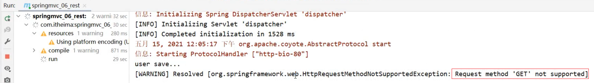

##### 删除

```java
@Controller
public class UserController {
    //设置当前请求方法为DELETE，表示REST风格中的删除操作
	@RequestMapping(value = "/users",method = RequestMethod.DELETE)
    @ResponseBody
    public String delete(Integer id) {
        System.out.println("user delete..." + id);
        return "{'module':'user delete'}";
    }
}
```

* 将请求路径更改为`/users`
  - 访问该方法使用 DELETE: `http://localhost/users`

访问成功，但是删除方法没有携带所要删除数据的id,所以针对RESTful的开发，如何携带数据参数?

###### 传递路径参数

前端发送请求的时候使用:`http://localhost/users/1`,路径中的`1`就是我们想要传递的参数。

后端获取参数，需要做如下修改:

* 修改**@RequestMapping的value属性**，将其中修改为`/users/{id}`，目的是和路径匹配
* 在方法的形参前添加**@PathVariable**注解

```java
@Controller
public class UserController {
    //设置当前请求方法为DELETE，表示REST风格中的删除操作
	@RequestMapping(value = "/users/{id}",method = RequestMethod.DELETE)
    @ResponseBody
    public String delete(@PathVariable Integer id) {
        System.out.println("user delete..." + id);
        return "{'module':'user delete'}";
    }
}
```

**思考如下两个问题:**

(1)如果方法形参的名称和路径`{}`中的值不一致，该怎么办?


(2)如果有多个参数需要传递该如何编写?

前端发送请求的时候使用:`http://localhost/users/1/tom`,路径中的`1`和`tom`就是我们想要传递的两个参数。

后端获取参数，需要做如下修改:

```java
@Controller
public class UserController {
    //设置当前请求方法为DELETE，表示REST风格中的删除操作
	@RequestMapping(value = "/users/{id}/{name}",method = RequestMethod.DELETE)
    @ResponseBody
    public String delete(@PathVariable Integer id,@PathVariable String name) {
        System.out.println("user delete..." + id+","+name);
        return "{'module':'user delete'}";
    }
}
```

##### 修改

```java
@Controller
public class UserController {
    //设置当前请求方法为PUT，表示REST风格中的修改操作
    @RequestMapping(value = "/users",method = RequestMethod.PUT)
    @ResponseBody
    public String update(@RequestBody User user) {
        System.out.println("user update..." + user);
        return "{'module':'user update'}";
    }
}
```

- 将请求路径更改为`/users`

  - 访问该方法使用 PUT: `http://localhost/users`

- 访问并携带参数:

  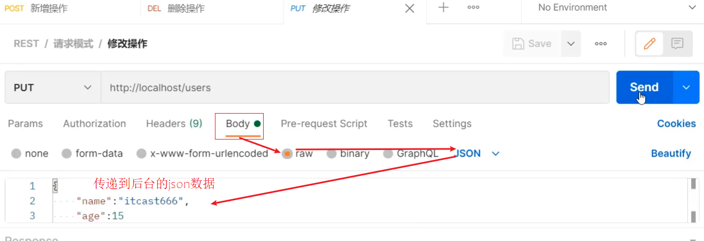

##### 根据ID查询

```java
@Controller
public class UserController {
    //设置当前请求方法为GET，表示REST风格中的查询操作
    @RequestMapping(value = "/users/{id}" ,method = RequestMethod.GET)
    @ResponseBody
    public String getById(@PathVariable Integer id){
        System.out.println("user getById..."+id);
        return "{'module':'user getById'}";
    }
}
```

将请求路径更改为`/users`

- 访问该方法使用 GET: `http://localhost/users/666`

##### 查询所有

```java
@Controller
public class UserController {
    //设置当前请求方法为GET，表示REST风格中的查询操作
    @RequestMapping(value = "/users" ,method = RequestMethod.GET)
    @ResponseBody
    public String getAll() {
        System.out.println("user getAll...");
        return "{'module':'user getAll'}";
    }
}
```

将请求路径更改为`/users`

- 访问该方法使用 GET: `http://localhost/users`

**小结**

RESTful入门案例，我们需要学习的内容如下:

(1)设定Http请求动作(动词)

@RequestMapping(value="",==method== = RequestMethod.==POST|GET|PUT|DELETE==)

(2)设定请求参数(路径变量)

@RequestMapping(value="/users/=={id}==",method = RequestMethod.DELETE)

@ReponseBody

public String delete(==@PathVariable== Integer ==id==){

}

##### 知识点1：@PathVariable

即从请求路径中直接获取参数

| 名称 | @PathVariable                                                |
| ---- | ------------------------------------------------------------ |
| 类型 | ==形参注解==                                                 |
| 位置 | SpringMVC控制器方法形参定义前面                              |
| 作用 | 绑定路径参数与处理器方法形参间的关系，要求路径参数名与形参名一一对应 |

关于接收参数，我们学过三个注解`@RequestBody`、`@RequestParam`、`@PathVariable`,这三个注解之间的区别和应用分别是什么?

* 区别
  * @RequestParam用于接收url地址传参或表单传参
  * @RequestBody用于接收json数据
  * @PathVariable用于接收路径参数，使用{参数名称}描述路径参数
* 应用
  * 后期开发中，发送请求参数超过1个时，以json格式为主，@RequestBody应用较广
  * 如果发送非json格式数据，选用@RequestParam接收请求参数
  * 采用RESTful进行开发，当参数数量较少时，例如1个，可以采用@PathVariable接收请求路径变量，通常用于传递id值

### 4.3 RESTful快速开发

**@Controller和@ReponseBody注解合并成@RestController** 

**@GetMapping @PostMapping @PutMapping @DeleteMapping代替method参数的@RequestMapping**


做完了RESTful的开发，你会发现==好麻烦==，麻烦在哪?


问题1：每个方法的@RequestMapping注解中都定义了访问路径/books，重复性太高。

问题2：每个方法的@RequestMapping注解中都要使用method属性定义请求方式，重复性太高。

问题3：每个方法响应json都需要加上@ResponseBody注解，重复性太高。

对于上面所提的这三个问题，具体该如何解决?

```java
@RestController //@Controller + ReponseBody
@RequestMapping("/books")
public class BookController {
    
	//@RequestMapping(method = RequestMethod.POST)
    @PostMapping
    public String save(@RequestBody Book book){
        System.out.println("book save..." + book);
        return "{'module':'book save'}";
    }

    //@RequestMapping(value = "/{id}",method = RequestMethod.DELETE)
    @DeleteMapping("/{id}")
    public String delete(@PathVariable Integer id){
        System.out.println("book delete..." + id);
        return "{'module':'book delete'}";
    }

    //@RequestMapping(method = RequestMethod.PUT)
    @PutMapping
    public String update(@RequestBody Book book){
        System.out.println("book update..." + book);
        return "{'module':'book update'}";
    }

    //@RequestMapping(value = "/{id}",method = RequestMethod.GET)
    @GetMapping("/{id}")
    public String getById(@PathVariable Integer id){
        System.out.println("book getById..." + id);
        return "{'module':'book getById'}";
    }

    //@RequestMapping(method = RequestMethod.GET)
    @GetMapping
    public String getAll(){
        System.out.println("book getAll...");
        return "{'module':'book getAll'}";
    }
    
}
```

对于刚才的问题，我们都有对应的解决方案：

问题1：每个方法的@RequestMapping注解中都定义了访问路径/books，重复性太高。

```
将@RequestMapping提到类上面，用来定义所有方法共同的访问路径。
```

问题2：每个方法的@RequestMapping注解中都要使用method属性定义请求方式，重复性太高。

```
使用@GetMapping  @PostMapping  @PutMapping  @DeleteMapping代替
```

问题3：每个方法响应json都需要加上@ResponseBody注解，重复性太高。

```
1.将ResponseBody提到类上面，让所有的方法都有@ResponseBody的功能
2.使用@RestController注解替换@Controller与@ResponseBody注解，简化书写
```

#### 知识点1：@RestController

| 名称 | @RestController                                              |
| ---- | ------------------------------------------------------------ |
| 类型 | ==类注解==                                                   |
| 位置 | 基于SpringMVC的RESTful开发控制器类定义上方                   |
| 作用 | 设置当前控制器类为RESTful风格，<br/>等同于@Controller与@ResponseBody两个注解组合功能 |

#### 知识点2：@GetMapping @PostMapping @PutMapping @DeleteMapping

| 名称     | @GetMapping @PostMapping @PutMapping @DeleteMapping          |
| -------- | ------------------------------------------------------------ |
| 类型     | ==方法注解==                                                 |
| 位置     | 基于SpringMVC的RESTful开发控制器方法定义上方                 |
| 作用     | 设置当前控制器方法请求访问路径与请求动作，每种对应一个请求动作，<br/>例如@GetMapping对应GET请求 |
| 相关属性 | value（默认）：请求访问路径                                  |

### 4.4 RESTful案例

#### 4.4.1 需求分析

需求一:图片列表查询，从后台返回数据，将数据展示在页面上


需求二:新增图片，将新增图书的数据传递到后台，并在控制台打印


**说明:**此次案例的重点是在SpringMVC中如何使用RESTful实现前后台交互，所以本案例并没有和数据库进行交互，所有数据使用`假`数据来完成开发。

步骤分析:

> 1.搭建项目导入jar包
>
> 2.编写Controller类，提供两个方法，一个用来做列表查询，一个用来做新增
>
> 3.在方法上使用RESTful进行路径设置
>
> 4.完成请求、参数的接收和结果的响应
>
> 5.使用PostMan进行测试
>
> 6.将前端页面拷贝到项目中
>
> 7.页面发送ajax请求
>
> 8.完成页面数据的展示

#### 4.4.2 环境准备

- 创建一个Web的Maven项目

- pom.xml添加Spring依赖

  ```xml
  <?xml version="1.0" encoding="UTF-8"?>
  
  <project xmlns="http://maven.apache.org/POM/4.0.0" xmlns:xsi="http://www.w3.org/2001/XMLSchema-instance"
    xsi:schemaLocation="http://maven.apache.org/POM/4.0.0 http://maven.apache.org/xsd/maven-4.0.0.xsd">
    <modelVersion>4.0.0</modelVersion>
  
    <groupId>com.itheima</groupId>
    <artifactId>springmvc_07_rest_case</artifactId>
    <version>1.0-SNAPSHOT</version>
    <packaging>war</packaging>
  
    <dependencies>
      <dependency>
        <groupId>javax.servlet</groupId>
        <artifactId>javax.servlet-api</artifactId>
        <version>3.1.0</version>
        <scope>provided</scope>
      </dependency>
      <dependency>
        <groupId>org.springframework</groupId>
        <artifactId>spring-webmvc</artifactId>
        <version>5.2.10.RELEASE</version>
      </dependency>
      <dependency>
        <groupId>com.fasterxml.jackson.core</groupId>
        <artifactId>jackson-databind</artifactId>
        <version>2.9.0</version>
      </dependency>
    </dependencies>
  
    <build>
      <plugins>
        <plugin>
          <groupId>org.apache.tomcat.maven</groupId>
          <artifactId>tomcat7-maven-plugin</artifactId>
          <version>2.1</version>
          <configuration>
            <port>80</port>
            <path>/</path>
          </configuration>
        </plugin>
      </plugins>
    </build>
  </project>
  
  ```

- 创建对应的配置类

  ```java
  public class ServletContainersInitConfig extends AbstractAnnotationConfigDispatcherServletInitializer {
      protected Class<?>[] getRootConfigClasses() {
          return new Class[0];
      }
  
      protected Class<?>[] getServletConfigClasses() {
          return new Class[]{SpringMvcConfig.class};
      }
  
      protected String[] getServletMappings() {
          return new String[]{"/"};
      }
  
      //乱码处理
      @Override
      protected Filter[] getServletFilters() {
          CharacterEncodingFilter filter = new CharacterEncodingFilter();
          filter.setEncoding("UTF-8");
          return new Filter[]{filter};
      }
  }
  
  @Configuration
  @ComponentScan("com.itheima.controller")
  //开启json数据类型自动转换
  @EnableWebMvc
  public class SpringMvcConfig {
  }
  
  
  ```

- 编写模型类Book

  ```java
  public class Book {
      private Integer id;
      private String type;
      private String name;
      private String description;
      //setter...getter...toString略
  }
  ```

- 编写BookController

  ```java
  @Controller
  public class BookController {
  
      
  }
  ```

最终创建好的项目结构如下:


#### 4.4.2 后台接口开发

##### 步骤1:编写Controller类并使用RESTful进行配置

```java
@RestController
@RequestMapping("/books")
public class BookController {

    @PostMapping
    public String save(@RequestBody Book book){
        //@RequestBody使得book可以接收Json数据
        System.out.println("book save ==> "+ book);
        return "{'module':'book save success'}";
    }

 	@GetMapping
    public List<Book> getAll(){
        System.out.println("book getAll is running ...");
        List<Book> bookList = new ArrayList<Book>();

        Book book1 = new Book();
        book1.setType("计算机");
        book1.setName("SpringMVC入门教程");
        book1.setDescription("小试牛刀");
        bookList.add(book1);

        Book book2 = new Book();
        book2.setType("计算机");
        book2.setName("SpringMVC实战教程");
        book2.setDescription("一代宗师");
        bookList.add(book2);

        Book book3 = new Book();
        book3.setType("计算机丛书");
        book3.setName("SpringMVC实战教程进阶");
        book3.setDescription("一代宗师呕心创作");
        bookList.add(book3);

        return bookList;
    }

}
```

##### 步骤2：使用PostMan进行测试

测试新增

```json
{
    "type":"计算机丛书",
    "name":"SpringMVC终极开发",
    "description":"这是一本好书"
}
```


测试查询


#### 4.4.3 页面访问处理

**使得对于静态页面的请求不被SpringMVC拦截**


##### 步骤1:拷贝静态页面

将`资料/功能页面`下的所有内容拷贝到项目的`webapp`目录下


##### 步骤2:访问pages目录下的books.html

打开浏览器输入`http://localhost/pages/books.html`


(1)出现错误的原因?

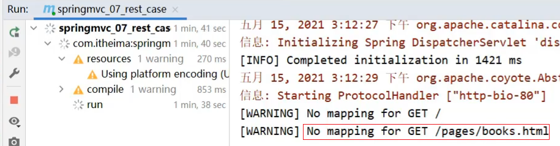

SpringMVC拦截了静态资源，根据/pages/books.html去controller找对应的方法，找不到所以会报404的错误。

(2)SpringMVC为什么会拦截静态资源呢?


(3)解决方案?

* SpringMVC需要将静态资源进行放行。

```java
@Configuration
public class SpringMvcSupport extends WebMvcConfigurationSupport {
    //设置静态资源访问过滤，当前类需要设置为配置类，并被扫描加载
    @Override
    protected void addResourceHandlers(ResourceHandlerRegistry registry) {
        //当访问/pages/????时候，从/pages目录下查找内容
        registry.addResourceHandler("/pages/**").addResourceLocations("/pages/");
        registry.addResourceHandler("/js/**").addResourceLocations("/js/");
        registry.addResourceHandler("/css/**").addResourceLocations("/css/");
        registry.addResourceHandler("/plugins/**").addResourceLocations("/plugins/");
    }
}

```

* 该配置类是在config目录下，SpringMVC扫描的是controller包，所以该配置类还未生效，要想生效需要将SpringMvcConfig配置类进行修改

```java
@Configuration
@ComponentScan({"com.itheima.controller","com.itheima.config"})
@EnableWebMvc
public class SpringMvcConfig {
}

或者

@Configuration
@ComponentScan("com.itheima")
@EnableWebMvc
public class SpringMvcConfig {
}
```

##### 步骤3:修改books.html页面

```html
<!DOCTYPE html>

<html>
    <head>
        <!-- 页面meta -->
        <meta charset="utf-8">
        <title>SpringMVC案例</title>
        <!-- 引入样式 -->
        <link rel="stylesheet" href="../plugins/elementui/index.css">
        <link rel="stylesheet" href="../plugins/font-awesome/css/font-awesome.min.css">
        <link rel="stylesheet" href="../css/style.css">
    </head>

    <body class="hold-transition">

        <div id="app">

            <div class="content-header">
                <h1>图书管理</h1>
            </div>

            <div class="app-container">
                <div class="box">
                    <div class="filter-container">
                        <el-input placeholder="图书名称" style="width: 200px;" class="filter-item"></el-input>
                        <el-button class="dalfBut">查询</el-button>
                        <el-button type="primary" class="butT" @click="openSave()">新建</el-button>
                    </div>

                    <el-table size="small" current-row-key="id" :data="dataList" stripe highlight-current-row>
                        <el-table-column type="index" align="center" label="序号"></el-table-column>
                        <el-table-column prop="type" label="图书类别" align="center"></el-table-column>
                        <el-table-column prop="name" label="图书名称" align="center"></el-table-column>
                        <el-table-column prop="description" label="描述" align="center"></el-table-column>
                        <el-table-column label="操作" align="center">
                            <template slot-scope="scope">
                                <el-button type="primary" size="mini">编辑</el-button>
                                <el-button size="mini" type="danger">删除</el-button>
                            </template>
                        </el-table-column>
                    </el-table>

                    <div class="pagination-container">
                        <el-pagination
                            class="pagiantion"
                            @current-change="handleCurrentChange"
                            :current-page="pagination.currentPage"
                            :page-size="pagination.pageSize"
                            layout="total, prev, pager, next, jumper"
                            :total="pagination.total">
                        </el-pagination>
                    </div>

                    <!-- 新增标签弹层 -->
                    <div class="add-form">
                        <el-dialog title="新增图书" :visible.sync="dialogFormVisible">
                            <el-form ref="dataAddForm" :model="formData" :rules="rules" label-position="right" label-width="100px">
                                <el-row>
                                    <el-col :span="12">
                                        <el-form-item label="图书类别" prop="type">
                                            <el-input v-model="formData.type"/>
                                        </el-form-item>
                                    </el-col>
                                    <el-col :span="12">
                                        <el-form-item label="图书名称" prop="name">
                                            <el-input v-model="formData.name"/>
                                        </el-form-item>
                                    </el-col>
                                </el-row>
                                <el-row>
                                    <el-col :span="24">
                                        <el-form-item label="描述">
                                            <el-input v-model="formData.description" type="textarea"></el-input>
                                        </el-form-item>
                                    </el-col>
                                </el-row>
                            </el-form>
                            <div slot="footer" class="dialog-footer">
                                <el-button @click="dialogFormVisible = false">取消</el-button>
                                <el-button type="primary" @click="saveBook()">确定</el-button>
                            </div>
                        </el-dialog>
                    </div>

                </div>
            </div>
        </div>
    </body>

    <!-- 引入组件库 -->
    <script src="../js/vue.js"></script>
    <script src="../plugins/elementui/index.js"></script>
    <script type="text/javascript" src="../js/jquery.min.js"></script>
    <script src="../js/axios-0.18.0.js"></script>

    <script>
        var vue = new Vue({

            el: '#app',

            data:{
				dataList: [],//当前页要展示的分页列表数据
                formData: {},//表单数据
                dialogFormVisible: false,//增加表单是否可见
                dialogFormVisible4Edit:false,//编辑表单是否可见
                pagination: {},//分页模型数据，暂时弃用
            },

            //钩子函数，VUE对象初始化完成后自动执行
            created() {
                this.getAll();
            },

            methods: {
                // 重置表单
                resetForm() {
                    //清空输入框
                    this.formData = {};
                },

                // 弹出添加窗口
                openSave() {
                    this.dialogFormVisible = true;
                    this.resetForm();
                },

                //添加
                saveBook () {
                    axios.post("/books",this.formData).then((res)=>{

                    });
                },

                //主页列表查询
                getAll() {
                    axios.get("/books").then((res)=>{
                        this.dataList = res.data;
                    });
                },

            }
        })
    </script>
</html>
```


## 5.SSM整合

**即将Spring+SpringMVC+MyBatis整合起来**


### 1.SSM整合


前面我们已经把`Mybatis`、`Spring`和`SpringMVC`三个框架进行了学习，今天主要的内容就是把这三个框架整合在一起完成我们的业务功能开发，具体如何来整合，我们一步步来学习。

#### 1.1 流程分析

(1) 创建工程

* 创建一个Maven的web工程
* pom.xml添加SSM需要的依赖jar包
* 编写Web项目的入口配置类，实现`AbstractAnnotationConfigDispatcherServletInitializer`重写以下方法
  * getRootConfigClasses()	：返回Spring的配置类->需要==SpringConfig==配置类
  * getServletConfigClasses() ：返回SpringMVC的配置类->需要==SpringMvcConfig==配置类
  * getServletMappings()      : 设置SpringMVC请求拦截路径规则
  * getServletFilters()       ：设置过滤器，解决POST请求中文乱码问题

(2)SSM整合[==重点是各个配置的编写==]

* SpringConfig
  * 标识该类为配置类 @Configuration
  * 扫描Service所在的包 @ComponentScan
  * 在Service层要管理事务 @EnableTransactionManagement
  * 读取外部的properties配置文件 @PropertySource
  * 整合Mybatis需要引入Mybatis相关配置类 @Import
    * 第三方数据源配置类 JdbcConfig
      * 构建DataSource数据源，DruidDataSouroce,需要注入数据库连接四要素， @Bean @Value
      * 构建平台事务管理器，DataSourceTransactionManager,@Bean
    * Mybatis配置类 MybatisConfig
      * 构建SqlSessionFactoryBean并设置别名扫描与数据源，@Bean
      * 构建MapperScannerConfigurer并设置DAO层的包扫描
* SpringMvcConfig
  * 标识该类为配置类 @Configuration
  * 扫描Controller所在的包 @ComponentScan
  * 开启SpringMVC注解支持 @EnableWebMvc

(3)功能模块[与具体的业务模块有关]

* 创建数据库表
* 根据数据库表创建对应的模型类
* 通过Dao层完成数据库表的增删改查(接口+自动代理)
* 编写Service层[Service接口+实现类]
  * @Service
  * @Transactional
  * 整合Junit对业务层进行单元测试
    * @RunWith
    * @ContextConfiguration
    * @Test
* 编写Controller层
  * 接收请求 @RequestMapping @GetMapping @PostMapping @PutMapping @DeleteMapping
  * 接收数据 简单、POJO、嵌套POJO、集合、数组、JSON数据类型
    * @RequestParam
    * @PathVariable
    * @RequestBody
  * 转发业务层 
    * @Autowired
  * 响应结果
    * @ResponseBody

#### 1.2 整合配置

**初始化项目，添加配置**

[SpringMVC-17-SSM整合（整合配置）](https://www.bilibili.com/video/BV1Fi4y1S7ix?p=59&vd_source=af8b97e6370b709224731e8addba379d)


掌握上述的知识点后，接下来，我们就可以按照上述的步骤一步步的来完成SSM的整合。

##### 步骤1：创建Maven的web项目

可以使用Maven的骨架创建


##### 步骤2:添加依赖

pom.xml添加SSM所需要的依赖jar包

```xml
<?xml version="1.0" encoding="UTF-8"?>

<project xmlns="http://maven.apache.org/POM/4.0.0" xmlns:xsi="http://www.w3.org/2001/XMLSchema-instance"
  xsi:schemaLocation="http://maven.apache.org/POM/4.0.0 http://maven.apache.org/xsd/maven-4.0.0.xsd">
  <modelVersion>4.0.0</modelVersion>

  <groupId>com.itheima</groupId>
  <artifactId>springmvc_08_ssm</artifactId>
  <version>1.0-SNAPSHOT</version>
  <packaging>war</packaging>

  <dependencies>
    <dependency>
      <groupId>org.springframework</groupId>
      <artifactId>spring-webmvc</artifactId>
      <version>5.2.10.RELEASE</version>
    </dependency>

    <dependency>
      <groupId>org.springframework</groupId>
      <artifactId>spring-jdbc</artifactId>
      <version>5.2.10.RELEASE</version>
    </dependency>

    <dependency>
      <groupId>org.springframework</groupId>
      <artifactId>spring-test</artifactId>
      <version>5.2.10.RELEASE</version>
    </dependency>

    <dependency>
      <groupId>org.mybatis</groupId>
      <artifactId>mybatis</artifactId>
      <version>3.5.6</version>
    </dependency>

    <dependency>
      <groupId>org.mybatis</groupId>
      <artifactId>mybatis-spring</artifactId>
      <version>1.3.0</version>
    </dependency>

    <dependency>
      <groupId>mysql</groupId>
      <artifactId>mysql-connector-java</artifactId>
      <version>5.1.47</version>
    </dependency>

    <dependency>
      <groupId>com.alibaba</groupId>
      <artifactId>druid</artifactId>
      <version>1.1.16</version>
    </dependency>

    <dependency>
      <groupId>junit</groupId>
      <artifactId>junit</artifactId>
      <version>4.12</version>
      <scope>test</scope>
    </dependency>

    <dependency>
      <groupId>javax.servlet</groupId>
      <artifactId>javax.servlet-api</artifactId>
      <version>3.1.0</version>
      <scope>provided</scope>
    </dependency>

    <dependency>
      <groupId>com.fasterxml.jackson.core</groupId>
      <artifactId>jackson-databind</artifactId>
      <version>2.9.0</version>
    </dependency>
  </dependencies>

  <build>
    <plugins>
      <plugin>
        <groupId>org.apache.tomcat.maven</groupId>
        <artifactId>tomcat7-maven-plugin</artifactId>
        <version>2.1</version>
        <configuration>
          <port>80</port>
          <path>/</path>
        </configuration>
      </plugin>
    </plugins>
  </build>
</project>


```

##### 步骤3:创建项目包结构

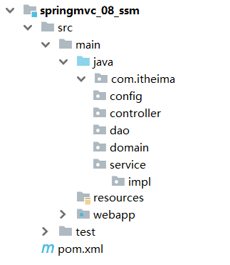

* config目录存放的是相关的配置类
* controller编写的是Controller类
* dao存放的是Dao接口，因为使用的是Mapper接口代理方式，所以没有实现类包
* service存的是Service接口，impl存放的是Service实现类
* resources:存入的是配置文件，如Jdbc.properties
* webapp:目录可以存放静态资源
* test/java:存放的是测试类

##### 步骤4:创建SpringConfig配置类

```java
@Configuration
@ComponentScan({"com.itheima.service"})
@PropertySource("classpath:jdbc.properties")
@Import({JdbcConfig.class,MyBatisConfig.class})
@EnableTransactionManagement
public class SpringConfig {
}
```

##### 步骤5:创建JdbcConfig配置类

```java
public class JdbcConfig {
    @Value("${jdbc.driver}")
    private String driver;
    @Value("${jdbc.url}")
    private String url;
    @Value("${jdbc.username}")
    private String username;
    @Value("${jdbc.password}")
    private String password;

    @Bean
    public DataSource dataSource(){
        DruidDataSource dataSource = new DruidDataSource();
        dataSource.setDriverClassName(driver);
        dataSource.setUrl(url);
        dataSource.setUsername(username);
        dataSource.setPassword(password);
        return dataSource;
    }

    @Bean
    public PlatformTransactionManager transactionManager(DataSource dataSource){
        DataSourceTransactionManager ds = new DataSourceTransactionManager();
        ds.setDataSource(dataSource);
        return ds;
    }
}
```

##### 步骤6:创建MybatisConfig配置类

```java
public class MyBatisConfig {
    @Bean
    public SqlSessionFactoryBean sqlSessionFactory(DataSource dataSource){
        SqlSessionFactoryBean factoryBean = new SqlSessionFactoryBean();
        factoryBean.setDataSource(dataSource);
        factoryBean.setTypeAliasesPackage("com.itheima.domain");
        return factoryBean;
    }

    @Bean
    public MapperScannerConfigurer mapperScannerConfigurer(){
        MapperScannerConfigurer msc = new MapperScannerConfigurer();
        msc.setBasePackage("com.itheima.dao");
        return msc;
    }
}
```

##### 步骤7:创建jdbc.properties

在resources下提供jdbc.properties,设置数据库连接四要素

```properties
jdbc.driver=com.mysql.jdbc.Driver
jdbc.url=jdbc:mysql://localhost:3306/ssm_db
jdbc.username=root
jdbc.password=root
```

##### 步骤8:创建SpringMVC配置类

```java
@Configuration
@ComponentScan("com.itheima.controller")
@EnableWebMvc
public class SpringMvcConfig {
}
```

##### 步骤9:创建Web项目入口配置类

```java
public class ServletConfig extends AbstractAnnotationConfigDispatcherServletInitializer {
    //加载Spring配置类
    protected Class<?>[] getRootConfigClasses() {
        return new Class[]{SpringConfig.class};
    }
    //加载SpringMVC配置类
    protected Class<?>[] getServletConfigClasses() {
        return new Class[]{SpringMvcConfig.class};
    }
    //设置SpringMVC请求地址拦截规则
    protected String[] getServletMappings() {
        return new String[]{"/"};
    }
    //设置post请求中文乱码过滤器
    @Override
    protected Filter[] getServletFilters() {
        CharacterEncodingFilter filter = new CharacterEncodingFilter();
        filter.setEncoding("utf-8");
        return new Filter[]{filter};
    }
}

```

至此SSM整合的环境就已经搭建好了。在这个环境上，我们如何进行功能模块的开发呢?

#### 1.3 功能模块开发

> 需求:对表tbl_book进行新增、修改、删除、根据ID查询和查询所有

##### 步骤1:创建数据库及表

```sql
create database ssm_db character set utf8;
use ssm_db;
create table tbl_book(
  id int primary key auto_increment,
  type varchar(20),
  name varchar(50),
  description varchar(255)
)

insert  into `tbl_book`(`id`,`type`,`name`,`description`) values (1,'计算机理论','Spring实战 第五版','Spring入门经典教程，深入理解Spring原理技术内幕'),(2,'计算机理论','Spring 5核心原理与30个类手写实践','十年沉淀之作，手写Spring精华思想'),(3,'计算机理论','Spring 5设计模式','深入Spring源码刨析Spring源码中蕴含的10大设计模式'),(4,'计算机理论','Spring MVC+Mybatis开发从入门到项目实战','全方位解析面向Web应用的轻量级框架，带你成为Spring MVC开发高手'),(5,'计算机理论','轻量级Java Web企业应用实战','源码级刨析Spring框架，适合已掌握Java基础的读者'),(6,'计算机理论','Java核心技术 卷Ⅰ 基础知识(原书第11版)','Core Java第11版，Jolt大奖获奖作品，针对Java SE9、10、11全面更新'),(7,'计算机理论','深入理解Java虚拟机','5个纬度全面刨析JVM,大厂面试知识点全覆盖'),(8,'计算机理论','Java编程思想(第4版)','Java学习必读经典，殿堂级著作！赢得了全球程序员的广泛赞誉'),(9,'计算机理论','零基础学Java(全彩版)','零基础自学编程的入门图书，由浅入深，详解Java语言的编程思想和核心技术'),(10,'市场营销','直播就这么做:主播高效沟通实战指南','李子柒、李佳奇、薇娅成长为网红的秘密都在书中'),(11,'市场营销','直播销讲实战一本通','和秋叶一起学系列网络营销书籍'),(12,'市场营销','直播带货:淘宝、天猫直播从新手到高手','一本教你如何玩转直播的书，10堂课轻松实现带货月入3W+');
```

##### 步骤2:编写模型类

**用来对应数据库**

```java
public class Book {
    private Integer id;
    private String type;
    private String name;
    private String description;
    //getter...setter...toString省略
}
```

##### 步骤3:编写Dao接口

**用来对应MySQL语句**

```java
public interface BookDao {

//    @Insert("insert into tbl_book values(null,#{type},#{name},#{description})")
    @Insert("insert into tbl_book (type,name,description) values(#{type},#{name},#{description})")
    public void save(Book book);

    @Update("update tbl_book set type = #{type}, name = #{name}, description = #{description} where id = #{id}")
    public void update(Book book);

    @Delete("delete from tbl_book where id = #{id}")
    public void delete(Integer id);

    @Select("select * from tbl_book where id = #{id}")
    public Book getById(Integer id);

    @Select("select * from tbl_book")
    public List<Book> getAll();
}
```

##### 步骤4:编写Service接口和实现类

**用来调用Dao的SQL语句**

```java
@Transactional
public interface BookService {
    /**
     * 保存
     * @param book
     * @return
     */
    public boolean save(Book book);

    /**
     * 修改
     * @param book
     * @return
     */
    public boolean update(Book book);

    /**
     * 按id删除
     * @param id
     * @return
     */
    public boolean delete(Integer id);

    /**
     * 按id查询
     * @param id
     * @return
     */
    public Book getById(Integer id);

    /**
     * 查询全部
     * @return
     */
    public List<Book> getAll();
}
```

```java
@Service
public class BookServiceImpl implements BookService {
    @Autowired
    private BookDao bookDao;

    public boolean save(Book book) {
        bookDao.save(book);
        return true;
    }

    public boolean update(Book book) {
        bookDao.update(book);
        return true;
    }

    public boolean delete(Integer id) {
        bookDao.delete(id);
        return true;
    }

    public Book getById(Integer id) {
        return bookDao.getById(id);
    }

    public List<Book> getAll() {
        return bookDao.getAll();
    }
}
```

**说明:**

* bookDao在Service中注入的会提示一个红线提示，为什么呢?

  * BookDao是一个接口，没有实现类，接口是不能创建对象的，所以最终注入的应该是代理对象
  * 代理对象是由Spring的IOC容器来创建管理的
  * IOC容器又是在Web服务器启动的时候才会创建
  * IDEA在检测依赖关系的时候，没有找到适合的类注入，所以会提示错误提示
  * 但是程序运行的时候，代理对象就会被创建，框架会使用DI进行注入，所以程序运行无影响。

* 如何解决上述问题?

  * 可以不用理会，因为运行是正常的

  * 设置错误提示级别

    


##### 步骤5:编写Contorller类

**用来调用Service类的方法**

```java
@RestController
@RequestMapping("/books")
public class BookController {

    @Autowired
    private BookService bookService;

    @PostMapping
    public boolean save(@RequestBody Book book) {
        return bookService.save(book);
    }

    @PutMapping
    public boolean update(@RequestBody Book book) {
        return bookService.update(book);
    }

    @DeleteMapping("/{id}")
    public boolean delete(@PathVariable Integer id) {
        return bookService.delete(id);
    }

    @GetMapping("/{id}")
    public Book getById(@PathVariable Integer id) {
        return bookService.getById(id);
    }

    @GetMapping
    public List<Book> getAll() {
        return bookService.getAll();
    }
}
```

对于图书模块的增删改查就已经完成了编写，我们可以从后往前写也可以从前往后写，最终只需要能把功能实现即可。

接下来我们就先把业务层的代码使用`Spring整合Junit`的知识点进行单元测试:

#### 1.4 单元测试

##### 步骤1:新建测试类

```java
@RunWith(SpringJUnit4ClassRunner.class)
@ContextConfiguration(classes = SpringConfig.class)
public class BookServiceTest {

}
```

##### 步骤2:注入Service类

```java
@RunWith(SpringJUnit4ClassRunner.class)
@ContextConfiguration(classes = SpringConfig.class)
public class BookServiceTest {

    @Autowired
    private BookService bookService;


}
```

##### 步骤3:编写测试方法

我们先来对查询进行单元测试。

```java
@RunWith(SpringJUnit4ClassRunner.class)
@ContextConfiguration(classes = SpringConfig.class)
public class BookServiceTest {

    @Autowired
    private BookService bookService;

    @Test
    public void testGetById(){
        Book book = bookService.getById(1);
        System.out.println(book);
    }

    @Test
    public void testGetAll(){
        List<Book> all = bookService.getAll();
        System.out.println(all);
    }

}
```

根据ID查询，测试的结果为:


查询所有，测试的结果为:


#### 1.5 PostMan测试

##### 新增

`http://localhost/books`

```json
{
	"type":"类别测试数据",
    "name":"书名测试数据",
    "description":"描述测试数据"
}
```


##### 修改

`http://localhost/books`

```json
{
    "id":13,
	"type":"类别测试数据",
    "name":"书名测试数据",
    "description":"描述测试数据"
}
```


##### 删除

`http://localhost/books/14`


##### 查询单个

`http://localhost/books/1`

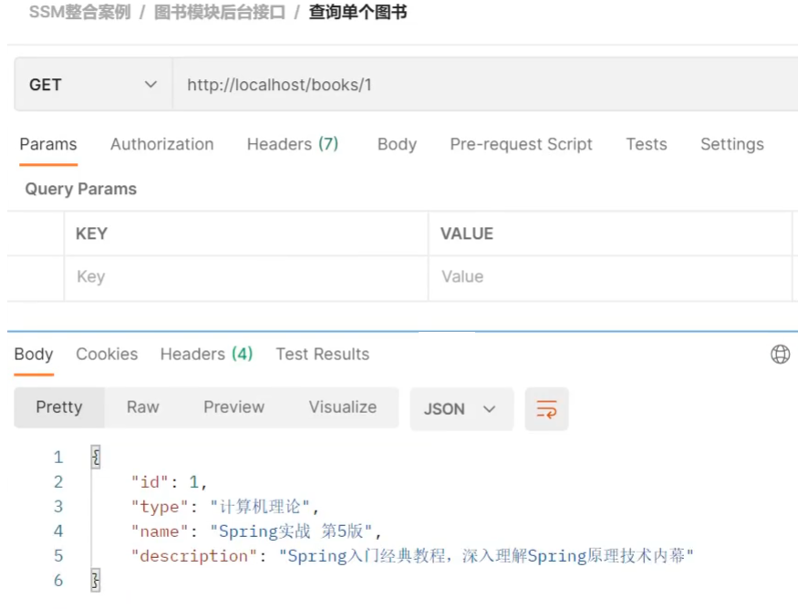

##### 查询所有

`http://localhost/books`


### 2.统一结果封装

**将返回的结果封装为数据，状态码和信息三部分**


#### 2.1 表现层与前端数据传输协议定义

SSM整合以及功能模块开发完成后，接下来，我们在上述案例的基础上分析下有哪些问题需要我们去解决下。首先第一个问题是:

* 在Controller层增删改返回给前端的是boolean类型数据

  

* 在Controller层查询单个返回给前端的是对象

  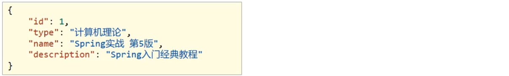

* 在Controller层查询所有返回给前端的是集合对象

  

目前我们就已经有三种数据类型返回给前端，如果随着业务的增长，我们需要返回的数据类型会越来越多。对于前端开发人员在解析数据的时候就比较凌乱了，所以对于前端来说，如果后台能够返回一个统一的数据结果，前端在解析的时候就可以按照一种方式进行解析。开发就会变得更加简单。

所以我们就想能不能将返回结果的数据进行统一，具体如何来做，大体的思路为:

* 为了封装返回的结果数据:==创建结果模型类，封装数据到data属性中==
* 为了封装返回的数据是何种操作及是否操作成功:==封装操作结果到code属性中==
* 操作失败后为了封装返回的错误信息:==封装特殊消息到message(msg)属性中==

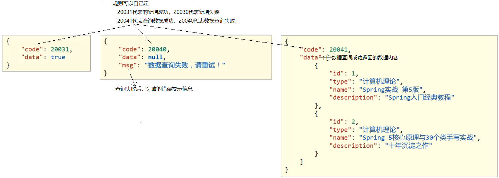

根据分析，我们可以设置统一数据返回结果类

```java
public class Result{
	private Object data;
	private Integer code;
	private String msg;
}
```

**注意:**Result类名及类中的字段并不是固定的，可以根据需要自行增减提供若干个构造方法，方便操作。

#### 2.2 表现层与前端数据传输协议实现

前面我们已经分析了如何封装返回结果数据，具体在项目中该如何实现，我们通过个例子来操作一把

##### 2.2.1 环境准备

- 创建一个Web的Maven项目
- pom.xml添加SSM整合所需jar包
- 创建对应的配置类
- 编写Controller、Service接口、Service实现类、Dao接口和模型类
- resources下提供jdbc.properties配置文件

因为这个项目环境的内容和SSM整合的内容是一致的，所以我们就不在把代码粘出来了，大家在练习的时候可以在前面整合的例子案例环境下，进行本节内容的开发。

最终创建好的项目结构如下:


##### 2.2.2 结果封装

对于结果封装，我们应该是在表现层进行处理，所以我们把结果类放在controller包下，当然你也可以放在domain包，这个都是可以的，具体如何实现结果封装，具体的步骤为:

###### 步骤1:创建Result类

```java
public class Result {
    //描述统一格式中的数据
    private Object data;
    //描述统一格式中的编码，用于区分操作，可以简化配置0或1表示成功失败
    private Integer code;
    //描述统一格式中的消息，可选属性
    private String msg;

    public Result() {
    }
	//构造方法是方便对象的创建
    public Result(Integer code,Object data) {
        this.data = data;
        this.code = code;
    }
	//构造方法是方便对象的创建
    public Result(Integer code, Object data, String msg) {
        this.data = data;
        this.code = code;
        this.msg = msg;
    }
	//setter...getter...省略
}
```

###### 步骤2:定义返回码Code类

```java
//状态码
public class Code {
    public static final Integer SAVE_OK = 20011;
    public static final Integer DELETE_OK = 20021;
    public static final Integer UPDATE_OK = 20031;
    public static final Integer GET_OK = 20041;

    public static final Integer SAVE_ERR = 20010;
    public static final Integer DELETE_ERR = 20020;
    public static final Integer UPDATE_ERR = 20030;
    public static final Integer GET_ERR = 20040;
}

```

**注意:**code类中的常量设计也不是固定的，可以根据需要自行增减，例如将查询再进行细分为GET_OK,GET_ALL_OK,GET_PAGE_OK等。

###### 步骤3:修改Controller类的返回值

```java
//统一每一个控制器方法返回值
@RestController
@RequestMapping("/books")
public class BookController {

    @Autowired
    private BookService bookService;

    @PostMapping
    public Result save(@RequestBody Book book) {
        boolean flag = bookService.save(book);
        return new Result(flag ? Code.SAVE_OK:Code.SAVE_ERR,flag);
    }

    @PutMapping
    public Result update(@RequestBody Book book) {
        boolean flag = bookService.update(book);
        return new Result(flag ? Code.UPDATE_OK:Code.UPDATE_ERR,flag);
    }

    @DeleteMapping("/{id}")
    public Result delete(@PathVariable Integer id) {
        boolean flag = bookService.delete(id);
        return new Result(flag ? Code.DELETE_OK:Code.DELETE_ERR,flag);
    }

    @GetMapping("/{id}")
    public Result getById(@PathVariable Integer id) {
        Book book = bookService.getById(id);
        Integer code = book != null ? Code.GET_OK : Code.GET_ERR;
        String msg = book != null ? "" : "数据查询失败，请重试！";
        return new Result(code,book,msg);
    }

    @GetMapping
    public Result getAll() {
        List<Book> bookList = bookService.getAll();
        Integer code = bookList != null ? Code.GET_OK : Code.GET_ERR;
        String msg = bookList != null ? "" : "数据查询失败，请重试！";
        return new Result(code,bookList,msg);
    }
}
```

###### 步骤4:启动服务测试


至此，我们的返回结果就已经能以一种统一的格式返回给前端。前端根据返回的结果，先从中获取`code`,根据code判断，如果成功则取`data`属性的值，如果失败，则取`msg`中的值做提示。

### 3，统一异常处理

**使得不同的异常返回不同的状态码和信息**


#### 3.1 问题描述

在讲解这一部分知识点之前，我们先来演示个效果，修改BookController类的`getById`方法

```java
@GetMapping("/{id}")
public Result getById(@PathVariable Integer id) {
    //手动添加一个错误信息
    if(id==1){
        int i = 1/0;
    }
    Book book = bookService.getById(id);
    Integer code = book != null ? Code.GET_OK : Code.GET_ERR;
    String msg = book != null ? "" : "数据查询失败，请重试！";
    return new Result(code,book,msg);
}
```

重新启动运行项目，使用PostMan发送请求，当传入的id为1，则会出现如下效果：


前端接收到这个信息后和之前我们约定的格式不一致，这个问题该如何解决?

在解决问题之前，我们先来看下异常的种类及出现异常的原因:

- 框架内部抛出的异常：因使用不合规导致
- 数据层抛出的异常：因外部服务器故障导致（例如：服务器访问超时）
- 业务层抛出的异常：因业务逻辑书写错误导致（例如：遍历业务书写操作，导致索引异常等）
- 表现层抛出的异常：因数据收集、校验等规则导致（例如：不匹配的数据类型间导致异常）
- 工具类抛出的异常：因工具类书写不严谨不够健壮导致（例如：必要释放的连接长期未释放等）

看完上面这些出现异常的位置，你会发现，在我们开发的任何一个位置都有可能出现异常，而且这些异常是不能避免的。所以我们就得将异常进行处理。

**思考**

1. 各个层级均出现异常，异常处理代码书写在哪一层?

   ==所有的异常均抛出到表现层进行处理==

2. 异常的种类很多，表现层如何将所有的异常都处理到呢?

   ==异常分类==

3. 表现层处理异常，每个方法中单独书写，代码书写量巨大且意义不强，如何解决?

   ==AOP==

对于上面这些问题及解决方案，SpringMVC已经为我们提供了一套解决方案:

* 异常处理器:

  * 集中的、统一的处理项目中出现的异常。

    

#### 3.2 异常处理器的使用

##### 3.2.1 环境准备

- 创建一个Web的Maven项目
- pom.xml添加SSM整合所需jar包
- 创建对应的配置类
- 编写Controller、Service接口、Service实现类、Dao接口和模型类
- resources下提供jdbc.properties配置文件

内容参考前面的项目或者直接使用前面的项目进行本节内容的学习。

最终创建好的项目结构如下:

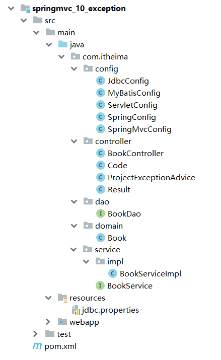

##### 3.2.2 使用步骤

###### 步骤1:创建异常处理器类

```java
//@RestControllerAdvice用于标识当前类为REST风格对应的异常处理器
@RestControllerAdvice
public class ProjectExceptionAdvice {
    //除了自定义的异常处理器，保留对Exception类型的异常处理，用于处理非预期的异常
    @ExceptionHandler(Exception.class)
    public void doException(Exception ex){
      	System.out.println("嘿嘿,异常你哪里跑！")
    }
}

```

==确保SpringMvcConfig能够扫描到异常处理器类==

###### 步骤2:让程序抛出异常

修改`BookController`的getById方法，添加`int i = 1/0`.

```java
@GetMapping("/{id}")
public Result getById(@PathVariable Integer id) {
  	int i = 1/0;
    Book book = bookService.getById(id);
    Integer code = book != null ? Code.GET_OK : Code.GET_ERR;
    String msg = book != null ? "" : "数据查询失败，请重试！";
    return new Result(code,book,msg);
}
```

###### 步骤3:运行程序，测试


说明异常已经被拦截并执行了`doException`方法。

###### 异常处理器类返回结果给前端

```java
//@RestControllerAdvice用于标识当前类为REST风格对应的异常处理器
@RestControllerAdvice
public class ProjectExceptionAdvice {
    //除了自定义的异常处理器，保留对Exception类型的异常处理，用于处理非预期的异常
    @ExceptionHandler(Exception.class)
    public Result doException(Exception ex){
      	System.out.println("嘿嘿,异常你哪里跑！")
        return new Result(666,null,"嘿嘿,异常你哪里跑！");
    }
}

```

启动运行程序，测试


至此，就算后台执行的过程中抛出异常，最终也能按照我们和前端约定好的格式返回给前端。

##### 知识点1：@RestControllerAdvice

| 名称 | @RestControllerAdvice              |
| ---- | ---------------------------------- |
| 类型 | ==类注解==                         |
| 位置 | Rest风格开发的控制器增强类定义上方 |
| 作用 | 为Rest风格开发的控制器类做增强     |

**说明:**此注解自带@ResponseBody注解与@Component注解，具备对应的功能

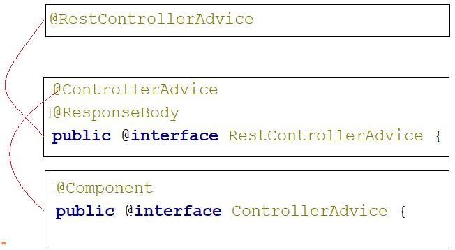

##### 知识点2：@ExceptionHandler

| 名称 | @ExceptionHandler                                            |
| ---- | ------------------------------------------------------------ |
| 类型 | ==方法注解==                                                 |
| 位置 | 专用于异常处理的控制器方法上方                               |
| 作用 | 设置指定异常的处理方案，功能等同于控制器方法，<br/>出现异常后终止原始控制器执行,并转入当前方法执行 |

**说明：**此类方法可以根据处理的异常不同，制作多个方法分别处理对应的异常

#### 3.3 项目异常处理方案

##### 3.3.1 异常分类

异常处理器我们已经能够使用了，那么在咱们的项目中该如何来处理异常呢?

因为异常的种类有很多，如果每一个异常都对应一个@ExceptionHandler，那得写多少个方法来处理各自的异常，所以我们在处理异常之前，需要对异常进行一个分类:

- 业务异常（BusinessException）

  - 规范的用户行为产生的异常

    - 用户在页面输入内容的时候未按照指定格式进行数据填写，如在年龄框输入的是字符串

      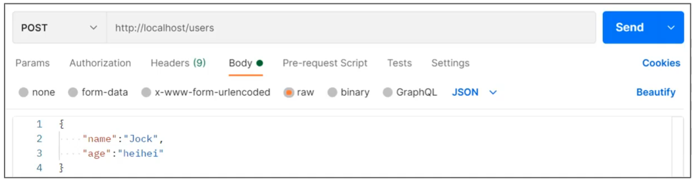

  - 不规范的用户行为操作产生的异常

    - 如用户故意传递错误数据

      

- 系统异常（SystemException）

  - 项目运行过程中可预计但无法避免的异常
    - 比如数据库或服务器宕机

- 其他异常（Exception）

  - 编程人员未预期到的异常，如:用到的文件不存在

    

将异常分类以后，针对不同类型的异常，要提供具体的解决方案:

##### 3.3.2 异常解决方案

- 业务异常（BusinessException）
  - 发送对应消息传递给用户，提醒规范操作
    - 大家常见的就是提示用户名已存在或密码格式不正确等
- 系统异常（SystemException）
  - 发送固定消息传递给用户，安抚用户
    - 系统繁忙，请稍后再试
    - 系统正在维护升级，请稍后再试
    - 系统出问题，请联系系统管理员等
  - 发送特定消息给运维人员，提醒维护
    - 可以发送短信、邮箱或者是公司内部通信软件
  - 记录日志
    - 发消息和记录日志对用户来说是不可见的，属于后台程序
- 其他异常（Exception）
  - 发送固定消息传递给用户，安抚用户
  - 发送特定消息给编程人员，提醒维护（纳入预期范围内）
    - 一般是程序没有考虑全，比如未做非空校验等
  - 记录日志

##### 3.3.3 异常解决方案的具体实现

> 思路:
>
> 1.先通过自定义异常，完成BusinessException和SystemException的定义
>
> 2.将其他异常包装成自定义异常类型
>
> 3.在异常处理器类中对不同的异常进行处理

###### 步骤1:自定义异常类

```java
//自定义异常处理器，用于封装异常信息，对异常进行分类
public class SystemException extends RuntimeException{
    private Integer code;

    public Integer getCode() {
        return code;
    }

    public void setCode(Integer code) {
        this.code = code;
    }

    public SystemException(Integer code, String message) {
        super(message);
        this.code = code;
    }

    public SystemException(Integer code, String message, Throwable cause) {
        super(message, cause);
        this.code = code;
    }

}

//自定义异常处理器，用于封装异常信息，对异常进行分类
public class BusinessException extends RuntimeException{
    private Integer code;

    public Integer getCode() {
        return code;
    }

    public void setCode(Integer code) {
        this.code = code;
    }

    public BusinessException(Integer code, String message) {
        super(message);
        this.code = code;
    }

    public BusinessException(Integer code, String message, Throwable cause) {
        super(message, cause);
        this.code = code;
    }

}


```

**说明:**

* 让自定义异常类继承`RuntimeException`的好处是，后期在抛出这两个异常的时候，就不用在try...catch...或throws了
* 自定义异常类中添加`code`属性的原因是为了更好的区分异常是来自哪个业务的

###### 步骤2:将其他异常包成自定义异常

假如在BookServiceImpl的getById方法抛异常了，该如何来包装呢?

```java
public Book getById(Integer id) {
    //模拟业务异常，包装成自定义异常
    if(id == 1){
        throw new BusinessException(Code.BUSINESS_ERR,"请不要使用你的技术挑战我的耐性!");
    }
    //模拟系统异常，将可能出现的异常进行包装，转换成自定义异常
    try{
        int i = 1/0;
    }catch (Exception e){
        throw new SystemException(Code.SYSTEM_TIMEOUT_ERR,"服务器访问超时，请重试!",e);
    }
    return bookDao.getById(id);
}
```

具体的包装方式有：

* 方式一:`try{}catch(){}`在catch中重新throw我们自定义异常即可。
* 方式二:直接throw自定义异常即可

上面为了使`code`看着更专业些，我们在Code类中再新增需要的属性

```java
//状态码
public class Code {
    public static final Integer SAVE_OK = 20011;
    public static final Integer DELETE_OK = 20021;
    public static final Integer UPDATE_OK = 20031;
    public static final Integer GET_OK = 20041;

    public static final Integer SAVE_ERR = 20010;
    public static final Integer DELETE_ERR = 20020;
    public static final Integer UPDATE_ERR = 20030;
    public static final Integer GET_ERR = 20040;
    public static final Integer SYSTEM_ERR = 50001;
    public static final Integer SYSTEM_TIMEOUT_ERR = 50002;
    public static final Integer SYSTEM_UNKNOW_ERR = 59999;

    public static final Integer BUSINESS_ERR = 60002;
}

```

###### 步骤3:处理器类中处理自定义异常

```java
//@RestControllerAdvice用于标识当前类为REST风格对应的异常处理器
@RestControllerAdvice
public class ProjectExceptionAdvice {
    //@ExceptionHandler用于设置当前处理器类对应的异常类型
    @ExceptionHandler(SystemException.class)
    public Result doSystemException(SystemException ex){
        //记录日志
        //发送消息给运维
        //发送邮件给开发人员,ex对象发送给开发人员
        return new Result(ex.getCode(),null,ex.getMessage());
    }

    @ExceptionHandler(BusinessException.class)
    public Result doBusinessException(BusinessException ex){
        return new Result(ex.getCode(),null,ex.getMessage());
    }

    //除了自定义的异常处理器，保留对Exception类型的异常处理，用于处理非预期的异常
    @ExceptionHandler(Exception.class)
    public Result doOtherException(Exception ex){
        //记录日志
        //发送消息给运维
        //发送邮件给开发人员,ex对象发送给开发人员
        return new Result(Code.SYSTEM_UNKNOW_ERR,null,"系统繁忙，请稍后再试！");
    }
}
```

###### 步骤4:运行程序

根据ID查询，

如果传入的参数为1，会报`BusinessException`


如果传入的是其他参数，会报`SystemException`

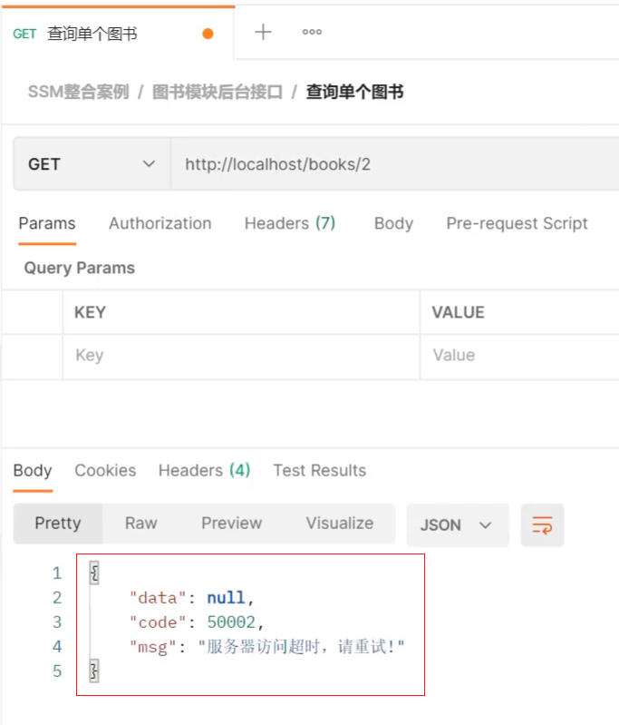

对于异常我们就已经处理完成了，不管后台哪一层抛出异常，都会以我们与前端约定好的方式进行返回，前端只需要把信息获取到，根据返回的正确与否来展示不同的内容即可。

**小结**

以后项目中的异常处理方式为:


### 4，前后台协议联调

**用前端JS调用后端功能，实现前后端功能联系**


#### 4.1 环境准备

- 创建一个Web的Maven项目
- pom.xml添加SSM整合所需jar包
- 创建对应的配置类
- 编写Controller、Service接口、Service实现类、Dao接口和模型类
- resources下提供jdbc.properties配置文件

内容参考前面的项目或者直接使用前面的项目进行本节内容的学习。

最终创建好的项目结构如下:


1. 将`资料/SSM功能页面`下面的静态资源拷贝到webapp下。

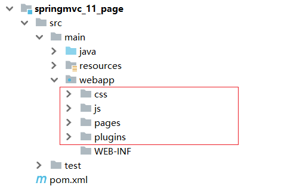

2. 因为添加了静态资源，SpringMVC会拦截，所有需要在SpringConfig的配置类中将静态资源进行放行。

* 新建SpringMvcSupport

  ```java
  @Configuration
  public class SpringMvcSupport extends WebMvcConfigurationSupport {
      @Override
      protected void addResourceHandlers(ResourceHandlerRegistry registry) {
          registry.addResourceHandler("/pages/**").addResourceLocations("/pages/");
          registry.addResourceHandler("/css/**").addResourceLocations("/css/");
          registry.addResourceHandler("/js/**").addResourceLocations("/js/");
          registry.addResourceHandler("/plugins/**").addResourceLocations("/plugins/");
      }
  }
  ```

* 在SpringMvcConfig中扫描SpringMvcSupport

  ```java
  @Configuration
  @ComponentScan({"com.itheima.controller","com.itheima.config"})
  @EnableWebMvc
  public class SpringMvcConfig {
  }
  ```

接下来我们就需要将所有的列表查询、新增、修改、删除等功能一个个来实现下。

#### 4.2 列表功能


> 需求:页面加载完后发送异步请求到后台获取列表数据进行展示。
>
> 1.找到页面的钩子函数，`created()`
>
> 2.`created()`方法中调用了`this.getAll()`方法
>
> 3.在getAll()方法中使用axios发送异步请求从后台获取数据
>
> 4.访问的路径为`http://localhost/books`
>
> 5.返回数据

返回数据res.data的内容如下:

```json
{
    "data": [
        {
            "id": 1,
            "type": "计算机理论",
            "name": "Spring实战 第五版",
            "description": "Spring入门经典教程，深入理解Spring原理技术内幕"
        },
        {
            "id": 2,
            "type": "计算机理论",
            "name": "Spring 5核心原理与30个类手写实践",
            "description": "十年沉淀之作，手写Spring精华思想"
        },...
    ],
    "code": 20041,
    "msg": ""
}
```

发送方式:

```js
getAll() {
    //发送ajax请求
    axios.get("/books").then((res)=>{
        this.dataList = res.data.data;
    });
}
```


#### 4.3 添加功能

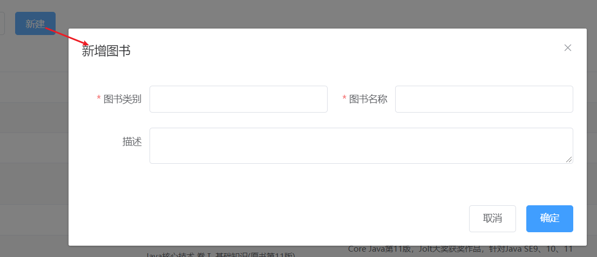

> 需求:完成图片的新增功能模块
>
> 1.找到页面上的`新建`按钮，按钮上绑定了`@click="handleCreate()"`方法
>
> 2.在method中找到`handleCreate`方法，方法中打开新增面板
>
> 3.新增面板中找到`确定`按钮,按钮上绑定了`@click="handleAdd()"`方法
>
> 4.在method中找到`handleAdd`方法
>
> 5.在方法中发送请求和数据，响应成功后将新增面板关闭并重新查询数据

`handleCreate`打开新增面板

```js
handleCreate() {
    this.dialogFormVisible = true;
},
```

`handleAdd`方法发送异步请求并携带数据

```js
handleAdd () {
    //发送ajax请求
    //this.formData是表单中的数据，最后是一个json数据
    axios.post("/books",this.formData).then((res)=>{
        this.dialogFormVisible = false;
        this.getAll();
    });
}
```

#### 4.4 添加功能状态处理

基础的新增功能已经完成，但是还有一些问题需要解决下:

> 需求:新增成功是关闭面板，重新查询数据，那么新增失败以后该如何处理?
>
> 1.在handlerAdd方法中根据后台返回的数据来进行不同的处理
>
> 2.如果后台返回的是成功，则提示成功信息，并关闭面板
>
> 3.如果后台返回的是失败，则提示错误信息

(1)修改前端页面

```js
handleAdd () {
    //发送ajax请求
    axios.post("/books",this.formData).then((res)=>{
        //如果操作成功，关闭弹层，显示数据
        if(res.data.code == 20011){
            this.dialogFormVisible = false;
            this.$message.success("添加成功");
        }else if(res.data.code == 20010){
            this.$message.error("添加失败");
        }else{
            this.$message.error(res.data.msg);
        }
    }).finally(()=>{
        this.getAll();
    });
}
```

(2)后台返回操作结果，将Dao层的增删改方法返回值从`void`改成`int`

```java
public interface BookDao {

//    @Insert("insert into tbl_book values(null,#{type},#{name},#{description})")
    @Insert("insert into tbl_book (type,name,description) values(#{type},#{name},#{description})")
    public int save(Book book);

    @Update("update tbl_book set type = #{type}, name = #{name}, description = #{description} where id = #{id}")
    public int update(Book book);

    @Delete("delete from tbl_book where id = #{id}")
    public int delete(Integer id);

    @Select("select * from tbl_book where id = #{id}")
    public Book getById(Integer id);

    @Select("select * from tbl_book")
    public List<Book> getAll();
}
```

(3)在BookServiceImpl中，增删改方法根据DAO的返回值来决定返回true/false

```java
@Service
public class BookServiceImpl implements BookService {
    @Autowired
    private BookDao bookDao;

    public boolean save(Book book) {
        return bookDao.save(book) > 0;
    }

    public boolean update(Book book) {
        return bookDao.update(book) > 0;
    }

    public boolean delete(Integer id) {
        return bookDao.delete(id) > 0;
    }

    public Book getById(Integer id) {
        if(id == 1){
            throw new BusinessException(Code.BUSINESS_ERR,"请不要使用你的技术挑战我的耐性!");
        }
//        //将可能出现的异常进行包装，转换成自定义异常
//        try{
//            int i = 1/0;
//        }catch (Exception e){
//            throw new SystemException(Code.SYSTEM_TIMEOUT_ERR,"服务器访问超时，请重试!",e);
//        }
        return bookDao.getById(id);
    }

    public List<Book> getAll() {
        return bookDao.getAll();
    }
}

```

(4)测试错误情况，将图书类别长度设置超出范围即可


处理完新增后，会发现新增还存在一个问题，

新增成功后，再次点击`新增`按钮会发现之前的数据还存在，这个时候就需要在新增的时候将表单内容清空。

```js
resetForm(){
	this.formData = {};
}
handleCreate() {
    this.dialogFormVisible = true;
    this.resetForm();
}
```

#### 4.5 修改功能

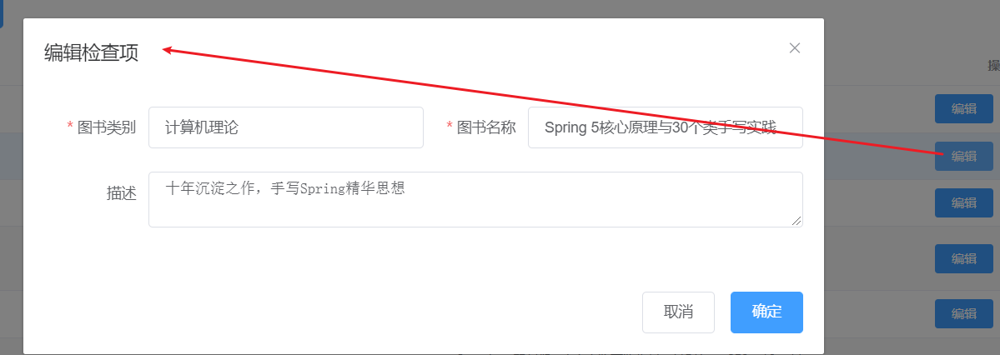

>需求:完成图书信息的修改功能
>
>1.找到页面中的`编辑`按钮，该按钮绑定了`@click="handleUpdate(scope.row)"`
>
>2.在method的`handleUpdate`方法中发送异步请求根据ID查询图书信息
>
>3.根据后台返回的结果，判断是否查询成功
>
>​	如果查询成功打开修改面板回显数据，如果失败提示错误信息
>
>4.修改完成后找到修改面板的`确定`按钮，该按钮绑定了`@click="handleEdit()"`
>
>5.在method的`handleEdit`方法中发送异步请求提交修改数据
>
>6.根据后台返回的结果，判断是否修改成功
>
>​	如果成功提示错误信息，关闭修改面板，重新查询数据，如果失败提示错误信息

scope.row代表的是当前行的行数据，也就是说,scope.row就是选中行对应的json数据，如下:

```json
{
    "id": 1,
    "type": "计算机理论",
    "name": "Spring实战 第五版",
    "description": "Spring入门经典教程，深入理解Spring原理技术内幕"
}
```

修改`handleUpdate`方法

```js
//弹出编辑窗口
handleUpdate(row) {
    // console.log(row);   //row.id 查询条件
    //查询数据，根据id查询
    axios.get("/books/"+row.id).then((res)=>{
        if(res.data.code == 20041){
            //展示弹层，加载数据
            this.formData = res.data.data;
            this.dialogFormVisible4Edit = true;
        }else{
            this.$message.error(res.data.msg);
        }
    });
}
```

修改`handleEdit`方法

```js
handleEdit() {
    //发送ajax请求
    axios.put("/books",this.formData).then((res)=>{
        //如果操作成功，关闭弹层，显示数据
        if(res.data.code == 20031){
            this.dialogFormVisible4Edit = false;
            this.$message.success("修改成功");
        }else if(res.data.code == 20030){
            this.$message.error("修改失败");
        }else{
            this.$message.error(res.data.msg);
        }
    }).finally(()=>{
        this.getAll();
    });
}
```

至此修改功能就已经完成。

#### 4.6 删除功能


> 需求:完成页面的删除功能。
>
> 1.找到页面的删除按钮，按钮上绑定了`@click="handleDelete(scope.row)"`
>
> 2.method的`handleDelete`方法弹出提示框
>
> 3.用户点击取消,提示操作已经被取消。
>
> 4.用户点击确定，发送异步请求并携带需要删除数据的主键ID
>
> 5.根据后台返回结果做不同的操作
>
> ​	如果返回成功，提示成功信息，并重新查询数据
>
> ​	如果返回失败，提示错误信息，并重新查询数据

修改`handleDelete`方法

```js
handleDelete(row) {
    //1.弹出提示框
    this.$confirm("此操作永久删除当前数据，是否继续？","提示",{
        type:'info'
    }).then(()=>{
        //2.做删除业务
        axios.delete("/books/"+row.id).then((res)=>{
            if(res.data.code == 20021){
                this.$message.success("删除成功");
            }else{
                this.$message.error("删除失败");
            }
        }).finally(()=>{
            this.getAll();
        });
    }).catch(()=>{
        //3.取消删除
        this.$message.info("取消删除操作");
    });
}
```

接下来，下面是一个完整页面

```html
<!DOCTYPE html>

<html>

    <head>

        <!-- 页面meta -->

        <meta charset="utf-8">

        <meta http-equiv="X-UA-Compatible" content="IE=edge">

        <title>SpringMVC案例</title>

        <meta content="width=device-width,initial-scale=1,maximum-scale=1,user-scalable=no" name="viewport">

        <!-- 引入样式 -->

        <link rel="stylesheet" href="../plugins/elementui/index.css">

        <link rel="stylesheet" href="../plugins/font-awesome/css/font-awesome.min.css">

        <link rel="stylesheet" href="../css/style.css">

    </head>

    <body class="hold-transition">

        <div id="app">

            <div class="content-header">

                <h1>图书管理</h1>

            </div>

            <div class="app-container">

                <div class="box">

                    <div class="filter-container">

                        <el-input placeholder="图书名称" v-model="pagination.queryString" style="width: 200px;" class="filter-item"></el-input>

                        <el-button @click="getAll()" class="dalfBut">查询</el-button>

                        <el-button type="primary" class="butT" @click="handleCreate()">新建</el-button>

                    </div>

                    <el-table size="small" current-row-key="id" :data="dataList" stripe highlight-current-row>

                        <el-table-column type="index" align="center" label="序号"></el-table-column>

                        <el-table-column prop="type" label="图书类别" align="center"></el-table-column>

                        <el-table-column prop="name" label="图书名称" align="center"></el-table-column>

                        <el-table-column prop="description" label="描述" align="center"></el-table-column>

                        <el-table-column label="操作" align="center">

                            <template slot-scope="scope">

                                <el-button type="primary" size="mini" @click="handleUpdate(scope.row)">编辑</el-button>

                                <el-button type="danger" size="mini" @click="handleDelete(scope.row)">删除</el-button>

                            </template>

                        </el-table-column>

                    </el-table>

                    <!-- 新增标签弹层 -->

                    <div class="add-form">

                        <el-dialog title="新增图书" :visible.sync="dialogFormVisible">

                            <el-form ref="dataAddForm" :model="formData" :rules="rules" label-position="right" label-width="100px">

                                <el-row>

                                    <el-col :span="12">

                                        <el-form-item label="图书类别" prop="type">

                                            <el-input v-model="formData.type"/>

                                        </el-form-item>

                                    </el-col>

                                    <el-col :span="12">

                                        <el-form-item label="图书名称" prop="name">

                                            <el-input v-model="formData.name"/>

                                        </el-form-item>

                                    </el-col>

                                </el-row>


                                <el-row>

                                    <el-col :span="24">

                                        <el-form-item label="描述">

                                            <el-input v-model="formData.description" type="textarea"></el-input>

                                        </el-form-item>

                                    </el-col>

                                </el-row>

                            </el-form>

                            <div slot="footer" class="dialog-footer">

                                <el-button @click="dialogFormVisible = false">取消</el-button>

                                <el-button type="primary" @click="handleAdd()">确定</el-button>

                            </div>

                        </el-dialog>

                    </div>

                    <!-- 编辑标签弹层 -->

                    <div class="add-form">

                        <el-dialog title="编辑检查项" :visible.sync="dialogFormVisible4Edit">

                            <el-form ref="dataEditForm" :model="formData" :rules="rules" label-position="right" label-width="100px">

                                <el-row>

                                    <el-col :span="12">

                                        <el-form-item label="图书类别" prop="type">

                                            <el-input v-model="formData.type"/>

                                        </el-form-item>

                                    </el-col>

                                    <el-col :span="12">

                                        <el-form-item label="图书名称" prop="name">

                                            <el-input v-model="formData.name"/>

                                        </el-form-item>

                                    </el-col>

                                </el-row>

                                <el-row>

                                    <el-col :span="24">

                                        <el-form-item label="描述">

                                            <el-input v-model="formData.description" type="textarea"></el-input>

                                        </el-form-item>

                                    </el-col>

                                </el-row>

                            </el-form>

                            <div slot="footer" class="dialog-footer">

                                <el-button @click="dialogFormVisible4Edit = false">取消</el-button>

                                <el-button type="primary" @click="handleEdit()">确定</el-button>

                            </div>

                        </el-dialog>

                    </div>

                </div>

            </div>

        </div>

    </body>

    <!-- 引入组件库 -->

    <script src="../js/vue.js"></script>

    <script src="../plugins/elementui/index.js"></script>

    <script type="text/javascript" src="../js/jquery.min.js"></script>

    <script src="../js/axios-0.18.0.js"></script>

    <script>
        var vue = new Vue({

            el: '#app',
            data:{
                pagination: {},
				dataList: [],//当前页要展示的列表数据
                formData: {},//表单数据
                dialogFormVisible: false,//控制表单是否可见
                dialogFormVisible4Edit:false,//编辑表单是否可见
                rules: {//校验规则
                    type: [{ required: true, message: '图书类别为必填项', trigger: 'blur' }],
                    name: [{ required: true, message: '图书名称为必填项', trigger: 'blur' }]
                }
            },

            //钩子函数，VUE对象初始化完成后自动执行
            created() {
                this.getAll();
            },

            methods: {
                //列表
                getAll() {
                    //发送ajax请求
                    axios.get("/books").then((res)=>{
                        this.dataList = res.data.data;
                    });
                },

                //弹出添加窗口
                handleCreate() {
                    this.dialogFormVisible = true;
                    this.resetForm();
                },

                //重置表单
                resetForm() {
                    this.formData = {};
                },

                //添加
                handleAdd () {
                    //发送ajax请求
                    axios.post("/books",this.formData).then((res)=>{
                        console.log(res.data);
                        //如果操作成功，关闭弹层，显示数据
                        if(res.data.code == 20011){
                            this.dialogFormVisible = false;
                            this.$message.success("添加成功");
                        }else if(res.data.code == 20010){
                            this.$message.error("添加失败");
                        }else{
                            this.$message.error(res.data.msg);
                        }
                    }).finally(()=>{
                        this.getAll();
                    });
                },

                //弹出编辑窗口
                handleUpdate(row) {
                    // console.log(row);   //row.id 查询条件
                    //查询数据，根据id查询
                    axios.get("/books/"+row.id).then((res)=>{
                        // console.log(res.data.data);
                        if(res.data.code == 20041){
                            //展示弹层，加载数据
                            this.formData = res.data.data;
                            this.dialogFormVisible4Edit = true;
                        }else{
                            this.$message.error(res.data.msg);
                        }
                    });
                },

                //编辑
                handleEdit() {
                    //发送ajax请求
                    axios.put("/books",this.formData).then((res)=>{
                        //如果操作成功，关闭弹层，显示数据
                        if(res.data.code == 20031){
                            this.dialogFormVisible4Edit = false;
                            this.$message.success("修改成功");
                        }else if(res.data.code == 20030){
                            this.$message.error("修改失败");
                        }else{
                            this.$message.error(res.data.msg);
                        }
                    }).finally(()=>{
                        this.getAll();
                    });
                },

                // 删除
                handleDelete(row) {
                    //1.弹出提示框
                    this.$confirm("此操作永久删除当前数据，是否继续？","提示",{
                        type:'info'
                    }).then(()=>{
                        //2.做删除业务
                        axios.delete("/books/"+row.id).then((res)=>{
                            if(res.data.code == 20021){
                                this.$message.success("删除成功");
                            }else{
                                this.$message.error("删除失败");
                            }
                        }).finally(()=>{
                            this.getAll();
                        });
                    }).catch(()=>{
                        //3.取消删除
                        this.$message.info("取消删除操作");
                    });
                }
            }
        })

    </script>

</html>
```

### 5，拦截器

对于拦截器这节的知识，我们需要学习如下内容:

* 拦截器概念
* 入门案例
* 拦截器参数
* 拦截器工作流程分析

#### 5.1 拦截器概念

讲解拦截器的概念之前，我们先看一张图:


(1)浏览器发送一个请求会先到Tomcat的web服务器

(2)Tomcat服务器接收到请求以后，会去判断请求的是静态资源还是动态资源

(3)如果是静态资源，会直接到Tomcat的项目部署目录下去直接访问

(4)如果是动态资源，就需要交给项目的后台代码进行处理

(5)在找到具体的方法之前，我们可以去配置过滤器(可以配置多个)，按照顺序进行执行

(6)然后进入到到中央处理器(SpringMVC中的内容)，SpringMVC会根据配置的规则进行拦截

(7)如果满足规则，则进行处理，找到其对应的controller类中的方法进行执行,完成后返回结果

(8)如果不满足规则，则不进行处理

(9)这个时候，如果我们需要在每个Controller方法执行的前后添加业务，具体该如何来实现?

这个就是拦截器要做的事。

* 拦截器（Interceptor）是一种动态拦截方法调用的机制，在SpringMVC中动态拦截控制器方法的执行
* 作用:
  * 在指定的方法调用前后执行预先设定的代码
  * 阻止原始方法的执行
  * 总结：拦截器就是用来做增强

看完以后，大家会发现

* 拦截器和过滤器在作用和执行顺序上也很相似

所以这个时候，就有一个问题需要思考:拦截器和过滤器之间的区别是什么?

- 归属不同：Filter属于Servlet技术，Interceptor属于SpringMVC技术
- 拦截内容不同：Filter对所有访问进行增强，Interceptor仅针对SpringMVC的访问进行增强

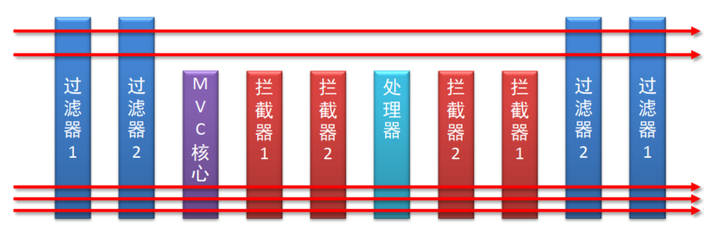

#### 5.2 拦截器入门案例

##### 5.2.1 环境准备

- 创建一个Web的Maven项目

- pom.xml添加SSM整合所需jar包

  ```xml
  <?xml version="1.0" encoding="UTF-8"?>
  
  <project xmlns="http://maven.apache.org/POM/4.0.0" xmlns:xsi="http://www.w3.org/2001/XMLSchema-instance"
    xsi:schemaLocation="http://maven.apache.org/POM/4.0.0 http://maven.apache.org/xsd/maven-4.0.0.xsd">
    <modelVersion>4.0.0</modelVersion>
  
    <groupId>com.itheima</groupId>
    <artifactId>springmvc_12_interceptor</artifactId>
    <version>1.0-SNAPSHOT</version>
    <packaging>war</packaging>
  
    <dependencies>
      <dependency>
        <groupId>javax.servlet</groupId>
        <artifactId>javax.servlet-api</artifactId>
        <version>3.1.0</version>
        <scope>provided</scope>
      </dependency>
      <dependency>
        <groupId>org.springframework</groupId>
        <artifactId>spring-webmvc</artifactId>
        <version>5.2.10.RELEASE</version>
      </dependency>
      <dependency>
        <groupId>com.fasterxml.jackson.core</groupId>
        <artifactId>jackson-databind</artifactId>
        <version>2.9.0</version>
      </dependency>
    </dependencies>
  
    <build>
      <plugins>
        <plugin>
          <groupId>org.apache.tomcat.maven</groupId>
          <artifactId>tomcat7-maven-plugin</artifactId>
          <version>2.1</version>
          <configuration>
            <port>80</port>
            <path>/</path>
          </configuration>
        </plugin>
          <plugin>
              <groupId>org.apache.maven.plugins</groupId>
              <artifactId>maven-compiler-plugin</artifactId>
              <configuration>
                  <source>8</source>
                  <target>8</target>
              </configuration>
          </plugin>
      </plugins>
    </build>
  </project>
  
  ```

- 创建对应的配置类

  ```java
  public class ServletContainersInitConfig extends AbstractAnnotationConfigDispatcherServletInitializer {
      protected Class<?>[] getRootConfigClasses() {
          return new Class[0];
      }
  
      protected Class<?>[] getServletConfigClasses() {
          return new Class[]{SpringMvcConfig.class};
      }
  
      protected String[] getServletMappings() {
          return new String[]{"/"};
      }
  
      //乱码处理
      @Override
      protected Filter[] getServletFilters() {
          CharacterEncodingFilter filter = new CharacterEncodingFilter();
          filter.setEncoding("UTF-8");
          return new Filter[]{filter};
      }
  }
  
  @Configuration
  @ComponentScan({"com.itheima.controller"})
  @EnableWebMvc
  public class SpringMvcConfig{
     
  }
  ```

- 创建模型类Book

  ```java
  public class Book {
      private String name;
      private double price;
  
      public String getName() {
          return name;
      }
  
      public void setName(String name) {
          this.name = name;
      }
  
      public double getPrice() {
          return price;
      }
  
      public void setPrice(double price) {
          this.price = price;
      }
  
      @Override
      public String toString() {
          return "Book{" +
                  "书名='" + name + '/'' +
                  ", 价格=" + price +
                  '}';
      }
  }
  ```

- 编写Controller

  ```java
  @RestController
  @RequestMapping("/books")
  public class BookController {
  
      @PostMapping
      public String save(@RequestBody Book book){
          System.out.println("book save..." + book);
          return "{'module':'book save'}";
      }
  
      @DeleteMapping("/{id}")
      public String delete(@PathVariable Integer id){
          System.out.println("book delete..." + id);
          return "{'module':'book delete'}";
      }
  
      @PutMapping
      public String update(@RequestBody Book book){
          System.out.println("book update..."+book);
          return "{'module':'book update'}";
      }
  
      @GetMapping("/{id}")
      public String getById(@PathVariable Integer id){
          System.out.println("book getById..."+id);
          return "{'module':'book getById'}";
      }
  
      @GetMapping
      public String getAll(){
          System.out.println("book getAll...");
          return "{'module':'book getAll'}";
      }
  }
  ```

最终创建好的项目结构如下:


##### 5.2.2 拦截器开发

###### 步骤1:创建拦截器类

让类实现HandlerInterceptor接口，重写接口中的三个方法。

```java
@Component
//定义拦截器类，实现HandlerInterceptor接口
//注意当前类必须受Spring容器控制
public class ProjectInterceptor implements HandlerInterceptor {
    @Override
    //原始方法调用前执行的内容
    public boolean preHandle(HttpServletRequest request, HttpServletResponse response, Object handler) throws Exception {
        System.out.println("preHandle...");
        return true;
    }

    @Override
    //原始方法调用后执行的内容
    public void postHandle(HttpServletRequest request, HttpServletResponse response, Object handler, ModelAndView modelAndView) throws Exception {
        System.out.println("postHandle...");
    }

    @Override
    //原始方法调用完成后执行的内容
    public void afterCompletion(HttpServletRequest request, HttpServletResponse response, Object handler, Exception ex) throws Exception {
        System.out.println("afterCompletion...");
    }
}
```

**注意:**拦截器类要被SpringMVC容器扫描到。

###### 步骤2:配置拦截器类

```java
@Configuration
public class SpringMvcSupport extends WebMvcConfigurationSupport {
    @Autowired
    private ProjectInterceptor projectInterceptor;

    //过滤静态页面
    @Override
    protected void addResourceHandlers(ResourceHandlerRegistry registry) {
        registry.addResourceHandler("/pages/**").addResourceLocations("/pages/");
    }

    @Override
    protected void addInterceptors(InterceptorRegistry registry) {
        //配置拦截器
        registry.addInterceptor(projectInterceptor).addPathPatterns("/books" );
    }
}
```

###### 步骤3:SpringMVC添加SpringMvcSupport包扫描

```java
@Configuration
@ComponentScan({"com.itheima.controller","com.itheima.config"})
@EnableWebMvc
public class SpringMvcConfig{
   
}
```

###### 步骤4:运行程序测试

使用PostMan发送`http://localhost/books`


如果发送`http://localhost/books/100`会发现拦截器没有被执行，原因是拦截器的`addPathPatterns`方法配置的拦截路径是`/books`,我们现在发送的是`/books/100`，所以没有匹配上，因此没有拦截，拦截器就不会执行。

###### 步骤5:修改拦截器拦截规则

```java
@Configuration
public class SpringMvcSupport extends WebMvcConfigurationSupport {
    @Autowired
    private ProjectInterceptor projectInterceptor;

    @Override
    protected void addResourceHandlers(ResourceHandlerRegistry registry) {
        registry.addResourceHandler("/pages/**").addResourceLocations("/pages/");
    }

    @Override
    protected void addInterceptors(InterceptorRegistry registry) {
        //配置拦截器
        registry.addInterceptor(projectInterceptor).addPathPatterns("/books","/books/*" );
    }
}
```

这个时候，如果再次访问`http://localhost/books/100`，拦截器就会被执行。

最后说一件事，就是拦截器中的`preHandler`方法，如果返回true,则代表放行，会执行原始Controller类中要请求的方法，如果返回false，则代表拦截，后面的就不会再执行了。

###### 步骤6:简化SpringMvcSupport的编写

将拦截器的代码放在SpringMvcConfig类中

```java
@Configuration
@ComponentScan({"com.itheima.controller"})
@EnableWebMvc
//实现WebMvcConfigurer接口可以简化开发，但具有一定的侵入性
public class SpringMvcConfig implements WebMvcConfigurer {
    @Autowired
    private ProjectInterceptor projectInterceptor;

    @Override
    public void addInterceptors(InterceptorRegistry registry) {
        //配置多拦截器
        registry.addInterceptor(projectInterceptor).addPathPatterns("/books","/books/*");
    }
}
```

此后咱们就不用再写`SpringMvcSupport`类了。

最后我们来看下拦截器的执行流程:


当有拦截器后，请求会先进入preHandle方法，

​	如果方法返回true，则放行继续执行后面的handle[controller的方法]和后面的方法

​	如果返回false，则直接跳过后面方法的执行。

#### 5.3 拦截器参数

##### 5.3.1 前置处理方法

原始方法之前运行preHandle

```java
public boolean preHandle(HttpServletRequest request,
                         HttpServletResponse response,
                         Object handler) throws Exception {
    System.out.println("preHandle");
    return true;
}
```

* request:请求对象
* response:响应对象
* handler:被调用的处理器对象，本质上是一个方法对象，对反射中的Method对象进行了再包装

使用request对象可以获取请求数据中的内容，如获取请求头的`Content-Type`

```java
public boolean preHandle(HttpServletRequest request, HttpServletResponse response, Object handler) throws Exception {
    String contentType = request.getHeader("Content-Type");
    System.out.println("preHandle..."+contentType);
    return true;
}
```

使用handler参数，可以获取方法的相关信息

```java
public boolean preHandle(HttpServletRequest request, HttpServletResponse response, Object handler) throws Exception {
    HandlerMethod hm = (HandlerMethod)handler;
    String methodName = hm.getMethod().getName();//可以获取方法的名称
    System.out.println("preHandle..."+methodName);
    return true;
}
```

##### 5.3.2 后置处理方法

原始方法运行后运行，如果原始方法被拦截，则不执行  

```java
public void postHandle(HttpServletRequest request,
                       HttpServletResponse response,
                       Object handler,
                       ModelAndView modelAndView) throws Exception {
    System.out.println("postHandle");
}
```

前三个参数和上面的是一致的。

modelAndView:如果处理器执行完成具有返回结果，可以读取到对应数据与页面信息，并进行调整

因为咱们现在都是返回json数据，所以该参数的使用率不高。

##### 5.3.3 完成处理方法

拦截器最后执行的方法，无论原始方法是否执行

```java
public void afterCompletion(HttpServletRequest request,
                            HttpServletResponse response,
                            Object handler,
                            Exception ex) throws Exception {
    System.out.println("afterCompletion");
}
```

前三个参数与上面的是一致的。

ex:如果处理器执行过程中出现异常对象，可以针对异常情况进行单独处理  

因为我们现在已经有全局异常处理器类，所以该参数的使用率也不高。

这三个方法中，最常用的是==preHandle==,在这个方法中可以通过返回值来决定是否要进行放行，我们可以把业务逻辑放在该方法中，如果满足业务则返回true放行，不满足则返回false拦截。

#### 5.4 拦截器链配置

**即多个拦截器与它们的运行顺序**


目前，我们在项目中只添加了一个拦截器，如果有多个，该如何配置?配置多个后，执行顺序是什么?

##### 5.4.1 配置多个拦截器

###### 步骤1:创建拦截器类

实现接口，并重写接口中的方法

```java
@Component
public class ProjectInterceptor2 implements HandlerInterceptor {
    @Override
    public boolean preHandle(HttpServletRequest request, HttpServletResponse response, Object handler) throws Exception {
        System.out.println("preHandle...222");
        return false;
    }

    @Override
    public void postHandle(HttpServletRequest request, HttpServletResponse response, Object handler, ModelAndView modelAndView) throws Exception {
        System.out.println("postHandle...222");
    }

    @Override
    public void afterCompletion(HttpServletRequest request, HttpServletResponse response, Object handler, Exception ex) throws Exception {
        System.out.println("afterCompletion...222");
    }
}
```

###### 步骤2:配置拦截器类

```java
@Configuration
@ComponentScan({"com.itheima.controller"})
@EnableWebMvc
//实现WebMvcConfigurer接口可以简化开发，但具有一定的侵入性
public class SpringMvcConfig implements WebMvcConfigurer {
    @Autowired
    private ProjectInterceptor projectInterceptor;
    @Autowired
    private ProjectInterceptor2 projectInterceptor2;

    @Override
    public void addInterceptors(InterceptorRegistry registry) {
        //配置多拦截器
        registry.addInterceptor(projectInterceptor).addPathPatterns("/books","/books/*");
        registry.addInterceptor(projectInterceptor2).addPathPatterns("/books","/books/*");
    }
}
```

步骤3:运行程序，观察顺序


拦截器执行的顺序是**和配置顺序有关**。就和前面所提到的运维人员进入机房的案例，先进后出。

* 当配置多个拦截器时，形成拦截器链
* 拦截器链的运行顺序参照拦截器添加顺序为准
* 当拦截器中出现对原始处理器的拦截，后面的拦截器均终止运行
* 当拦截器运行中断，仅运行配置在前面的拦截器的afterCompletion操作


preHandle：与配置顺序相同，必定运行

postHandle:与配置顺序相反，可能不运行

afterCompletion:与配置顺序相反，可能不运行。

这个顺序不太好记，最终只需要把握住一个原则即可:==以最终的运行结果为准==


先配置的先运行，后结束

后配置的后运行，先结束

例：

- 进门先进1门，再进2门
- 出门的时候要先出2门，在出1门

