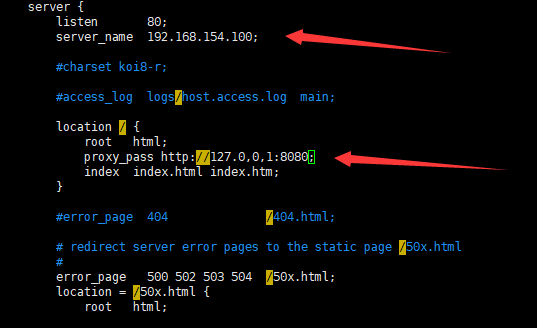
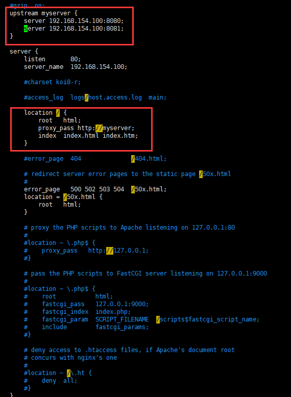
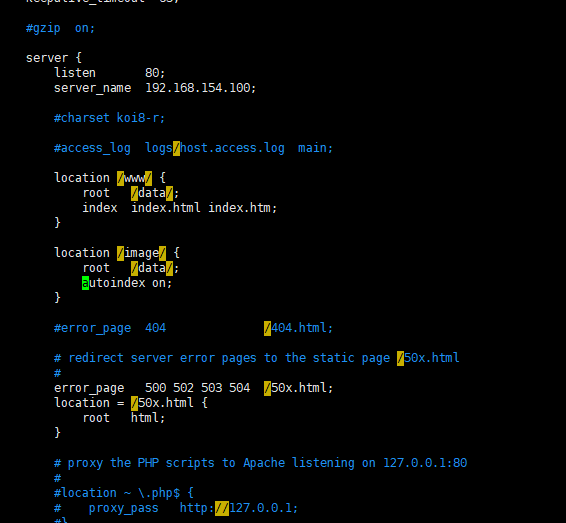
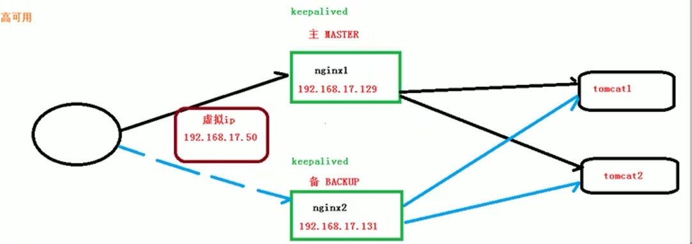

# nginx

## 简介

是一个高性能的http和反向代理的web服务器

占用内存少，并发能力强

专门为性能优化而开发

能承受50000个并发连接

支持热部署

## 反向代理

### 正向代理

nginx也可以用作正向代理

正向代理即使用代理服务器

### 反向代理

客户端对代理是没有感知的

反向代理服务器直接充当目标服务器

隐藏真实服务器ip，暴漏的是反向代理服务器地址

客户端不需要进行任何配置

## 负载均衡

 增加服务器数量，将请求分发到多个服务器上

增强处理能力

## 动静分离

为了加快网页响应速度，将动态页面和静态页面放在不同的服务器中

## nginx安装

将ngnix压缩包放到/root目录并解压

安装之前需要先安装依赖

安装gcc

~~~bash
yum install -y gcc
~~~

安装perl库

~~~bash
yum install -y pcre pcre-devel
~~~

安装zlib库

~~~bash
yum install -y zlib zlib-devel
~~~

执行安装(后边指定目录)

~~~bash
./configure --prefix=/usr/local/nginx
~~~

最后执行make和make install

~~~bash
make
make install
~~~

## nginx启动

先进入nginx的bin目录

~~~bash
cd /usr/local/nginx/sbin
~~~

启动和关闭

~~~bash
./nginx 启动
./nginx -s stop 快速停止
./nginx -s quit 优雅关闭，在退出前完成已经接收的请求
./nginx -s reload 重新加载配置
~~~

学习期间可以关闭linux防火墙（自启动也关了），否则连接不上

### 将nginx安装成系统服务

创建服务脚本

~~~bash
vi /usr/lib/systemd/system/nginx.service
~~~

服务脚本内容

~~~yml
[Unit]
Description=nginx - web service
Documentation=http://nginx.org/en/docs/
After=network.target remote -fs.target nss-lookup.target
 
[Service]
Type=forking
PIDFile=/usr/local/nginx/logs/nginx.pid
ExecStartPre=/usr/local/nginx/sbin/nginx -t -c /usr/local/nginx/conf/nginx.conf
ExecStart=/usr/local/nginx/sbin/nginx -c /usr/local/nginx/conf/nginx.conf
ExecReload=/usr/local/nginx/sbin/nginx -s reload
ExecStop=/usr/local/nginx/sbin/nginx -s stop
ExecQuit=/usr/local/nginx/sbin/nginx -s quit
PrivateTmp=true
 
[Install]
WantedBy=multi-user.target
~~~

重新加载系统服务

~~~bash
systemctl daemon-reload
~~~

可以将nginx设置为开机自启动，方式和防火墙一样

这样以后就可以使用systemctl来操控nginx的开启关闭等服务

### 将nginx的端接口设置为防火墙开放

nginx默认的端口号是80端口

查看开放的端口号

~~~bash
firewall-cmd --list-all
~~~

设置开放的端口号

~~~bash
sudo firewall-cmd --add-port=80/tcp --permanent
~~~

然后重启防火墙即可

## nginx配置文件

### 配置文件简介

配置文件位置

~~~bash
cd /usr/local/nginx/conf/nginx.conf
~~~

配置文件组成

由三部分组成

1. 全局块

   设置一些影响nginx服务器整体运行的配置指令

   ~~~yml
   #user  nobody;
   worker_processes  1;     #表示nginx处理并发的数量
   
   #error_log  logs/error.log;
   #error_log  logs/error.log  notice;
   #error_log  logs/error.log  info;
   
   #pid        logs/nginx.pid;
   ~~~

   

2. events块

   主要影响nginx服务器与用户之间的网络连接

   ~~~yml
   events {
       worker_connections  1024;
   }
   #表示nginx支持的最大连接的数量
   ~~~

   

3. http块

   配置最频繁的部分，又包括以下两块

   1. http全局块，即直接在http块中的部分

      包括文件引入，MIME-TYPE定义，日志自定义，连接超时时间，单链接请求上限等

      ~~~yml
      http {
          include       mime.types;
          default_type  application/octet-stream;
      
          #log_format  main  '$remote_addr - $remote_user [$time_local] "$request" '
          #                  '$status $body_bytes_sent "$http_referer" '
          #                  '"$http_user_agent" "$http_x_forwarded_for"';
      
          #access_log  logs/access.log  main;
      
          sendfile        on;
          #tcp_nopush     on;
      
          #keepalive_timeout  0;
          keepalive_timeout  65;
      
          #gzip  on;
          
          sever{
          	这里是sever块的内容
          }
          
      }
      ~~~

      

   2. server块，即http块中包裹在sever中的部分

      和虚拟主机有密切关系

      分为全局sever块和location块

      1. 全局sever块，直接在sever这种的部分
      2. location块，包裹在location中的部分

      ~~~yml
      server {
          listen       80; #监听端口
          server_name  localhost; #主机名称
      
          #charset koi8-r;
      
          #access_log  logs/host.access.log  main;
      
          location / {
          
              root   html;
              index  index.html index.htm;
          }
      
          #error_page  404              /404.html;
      
          # redirect server error pages to the static page /50x.html
          #
          error_page   500 502 503 504  /50x.html;
          location = /50x.html {
              root   html;
          }
      
          # proxy the PHP scripts to Apache listening on 127.0.0.1:80
          #
          #location ~ \.php$ {
          #    proxy_pass   http://127.0.0.1;
          #}
      
          # pass the PHP scripts to FastCGI server listening on 127.0.0.1:9000
          #
          #location ~ \.php$ {
          #    root           html;
          #    fastcgi_pass   127.0.0.1:9000;
          #    fastcgi_index  index.php;
          #    fastcgi_param  SCRIPT_FILENAME  /scripts$fastcgi_script_name;
          #    include        fastcgi_params;
          #}
      
          # deny access to .htaccess files, if Apache's document root
          # concurs with nginx's one
          #
          #location ~ /\.ht {
          #    deny  all;
          #}
      }
      ~~~

      

### 反向代理1

**实现效果**

1. 打开浏览器，输入地址www.123.com，跳转到linux系统的tomcat主页面

**具体实现**

> 提前准备:

1. 安装tomcat，使用默认端口号8080

2. 进入tomcat的bin目录中，./startup.sh启动tomcat服务器

   ~~~bash
   cd bin
   ./startup.sh
   ~~~

   

3. 防火墙对外开放访问端口，然后重启防火墙

   ~~~bash
   sudo firewall-cmd --add-port=8080/tcp --permanent
   firewall-cmd-reload
   ~~~

> 进行配置

1. 在windows的c盘中修改hosts文件

2. 在nginx中进行反向代理的配置

   ~~~bash
   cd /usr/local/nginx/conf
   vim nginx.conf
   ~~~

3. 修改server块，修改server_name并加上代理路径

   

4. 重启nginx（或者重现加载）

5. 正在浏览器输入www.123.com，显示tomcat的页面

### 反向代理2

**实现效果**

根据访问的路径跳转到不同的端口的服务中

nginx监听9001端口

访问http://127.0.0.1:9001/edu/跳转到127.0.0.1:8081

访问http://127.0.0.1:9001/vod/跳转到127.0.0.1:8082

**具体实现**

> 准备工作

查看tomcat的进程，并关闭当前所有tomcat进程

~~~bash
ps -ef | grep tomcat
~~~

~~~bash
kill -9 pid
~~~

准备两个tomcat服务器，一个用8080端口，一个使用8081端口

将两个tomcat分别解压到两个文件夹tomcat8080和tomcat8081之中

修改tomcat8081的配置文件，./conf/sever.xml

1. 将Server port改为8015
2. 将Connector port改为8081

启动两个tomcat

在两个tomcat文件夹的webapp文件夹中分别建立edu和vod文件夹，并分别放入不同的html文件

> 配置反向代理

1. 在windows的c盘中修改hosts文件

2. 在nginx中进行反向代理的配置

   ~~~bash
   cd /usr/local/nginx/conf
   vim nginx.conf
   ~~~

3. 在http块中新写一个sever块，使其监听9091端口并实现转发

   ~~~yml
   server{
   	listen 9001;
   	server_name 192.168.154.100;
   	
   	location ~ /edu/ {
   		proxy_pass http://127.0.0.1:8080;
   	}
   	location ~ /vod/ {
   		proxy_pass http://127.0.0.1:8081;
   	}
   }
   ~~~

4. 开放对外访问的端口号

   ~~~bash
   sudo firewall-cmd --add-port=8080/tcp --permanent
   sudo firewall-cmd --add-port=8081/tcp --permanent
   sudo firewall-cmd --add-port=9001/tcp --permanent
   ~~~

5. 重启防火墙

使用路径访问

~~~bash
http://192.168.154.100:9001/edu/a.html

http://192.168.154.100:9001/vod/b.html
~~~

### 负载均衡

**实现效果**

浏览器输入地址http://192.168.154.100/edu/a.html，负载均衡效果，平均分配到8080和8081端口中去

> 准备工作

两台tomcat服务器，分别使用8080和8081端口

两个webapps文件夹中都放入/edu/a.html

> 配置负载均衡

在http块中加入upstream myserver块，写入参与负载均衡的服务器地址

.0

~~~yml
upstream myserver {
    server 192.168.154.100:8080;
    server 192.168.154.100:8081;
}
~~~

在location块中添加一行

~~~yml
proxy_pass http://myserver;
~~~

这样以后每次访问192.168.154.100/edu/a.html都会到两个地址的其中一个

#### 分配方式

> 轮询（默认）

按照请求时间顺序逐一分配到不同的服务器中

>weight

代表权值，默认为1，权重越高没分配的请求越高

~~~yml
upstream myserver {
    server 192.168.154.100:8080 weight=11;
    server 192.168.154.100.8081 weight=10;
}
~~~

>ip_hash

按照每个请求访问的ip的hash结果分配

这样每个访客固定访问一个后端服务器，可以解决session问题

~~~bash
upstream myserver {
	ip_hash;
    server 192.168.154.100:8080;
    server 192.168.154.100.8081;
}
~~~

>fair（第三方）

按照后端服务器的响应时间分配，响应时间短的优先分配

~~~yml
upstream myserver {
    server 192.168.154.100:8080;
    server 192.168.154.100.8081;
    fair;
}
~~~

### 动静分离

将静态页面的请求和动态页面的请求分开

nginx处理静态页面请求，tomcat处理动态页面请求

大致分为两种方案：

1. 把静态文件独立成单独的域名，放在独立的服务器上，也是目前的主流方案
2. 将静态和动态文件混合在一起发布，通过nginx分开

**准备工作**

在linux中建立/data目录

在data中建立image和www目录

分别放入一张图片和一个html文件

> 修改配置文件

修改sever块中的location块

如果加上autoindex on表示输入文件夹的网址会显示出文件夹内的文件（否则会403）

然后重启nginx

### 高可用集群

应对nginx宕机

**实现模型**

用一个虚拟ip来代表一个集群

两台服务器都装配一个keepalive

同时使用一个ip地址作为虚拟ip

**准备工作**

配置两台虚拟机的ip为192.168.154.100和192.168.154.101

在两台虚拟机上安装keeplive

~~~bash
yum install keepalived -y
~~~

安装之后，在etc目录下会生成目录keepalived，有文件keepalived.conf

**配置**

主要修改keepalived的配置文件

- keepalived的主要作用是检测所在的服务器是否宕机

主服务器使用下面的配置

~~~yml
global_defs {
	 notification_email {
		 acassen@firewall.loc
		 failover@firewall.loc
		 sysadmin@firewall.loc
	 }
	 notification_email_from Alexandre.Cassen@firewall.loc
	 smtp_server 192.168.154.100
	 smtp_connect_timeout 30
	 # 通过它，可以访问到主机，在hosts文件中，要做映射关系，类似于 127.0.0.1 LVS_DEVEL
	 router_id hadoop100
}

vrrp_script chk_http_port {
	 script "/usr/local/src/nginx_check.sh"	 # 执行脚本所在的位置
	 interval 2 	#检测脚本执行的间隔，单位秒，每个2秒执行一次脚本
	 weight 2        #权重参数
}
	
vrrp_instance VI_1 {
	 state MASTER	 # 备份服务器上将 MASTER 改为 BACKUP
	 interface ens33	 # 绑定的网卡
	 virtual_router_id 51	 # 主、备机的 virtual_router_id 必须相同
	 priority 100 	# 主、备机取不同的优先级，主机值较大，备份机值较小
	 advert_int 1 	#每隔一秒发送一次心跳，确保从服务器是否还活着
	 authentication {		# 心跳检测需要的密码
		 auth_type PASS
		 auth_pass 1111
 	}
	 virtual_ipaddress {
	 192.168.154.50 	# VRRP H 虚拟地址
	 }
}
~~~

从服务器中需要修改ip地址和state

创建脚本文件，nginx_check.sh，放入/usr/local/src中

~~~yml
#!/bin/bash
A=`ps -C nginx –no-header |wc -l`
if [ $A -eq 0 ];then
    /usr/local/nginx/sbin/nginx 	#Nginx启动命令的位置
    sleep 2
    if [ `ps -C nginx --no-header |wc -l` -eq 0 ];then
        killall keepalived
    fi
fi
~~~

启动nginx和keepalived

此时访问192.168.154.50就可以访问到集群

keepalived的配置文件主要分为三部分

> global_defs

全局配置

~~~yml
global_defs {
	 notification_email {
		 acassen@firewall.loc
		 failover@firewall.loc
		 sysadmin@firewall.loc
	 }
	 notification_email_from Alexandre.Cassen@firewall.loc
	 smtp_server 192.168.154.100
	 smtp_connect_timeout 30
	 # 通过它，可以访问到主机，在hosts文件中，要做映射关系，类似于 127.0.0.1 hadoop100
	 router_id hadoop100
}
~~~

>vrrp_script

检测脚本配置

先执行第一行中的脚本，若成立在执行后边的内容

~~~yml
vrrp_script chk_http_port {
	 script "/usr/local/src/nginx_check.sh"	 # 执行脚本所在的位置
	 interval 2 	#检测脚本执行的间隔，单位秒，每个2秒执行一次脚本
	 weight 2        #权重参数
}
~~~

>vrrp_instance

虚拟ip的配置

~~~yml
vrrp_instance VI_1 {
	 state MASTER	 # 备份服务器上将 MASTER 改为 BACKUP
	 interface ens33	 # 绑定的网卡
	 virtual_router_id 51	 # 主、备机的 virtual_router_id 必须相同
	 priority 100 	# 主、备机取不同的优先级，主机值较大，备份机值较小
	 advert_int 1 	#每隔一秒发送一次心跳，确保从服务器是否还活着
	 authentication {		# 心跳检测需要的密码，进行校验时使用
		 auth_type PASS
		 auth_pass 1111
 	}
	 virtual_ipaddress {
	 192.168.154.50 	# 设置虚拟ip，可以设置多个
	 }
}
~~~

> 脚本文件

若主服务器宕机，则杀死所有主服务器中的keepalived进程

~~~yml
#!/bin/bash
A=`ps -C nginx –no-header |wc -l`
if [ $A -eq 0 ];then
    /usr/local/nginx/sbin/nginx 	#Nginx启动命令的位置
    sleep 2
    if [ `ps -C nginx --no-header |wc -l` -eq 0 ];then
        killall keepalived
    fi
fi
~~~

## nginx原理

**nginx中包含多个进程**

主要分为两种：

> master进程

只有一个

用来接收请求，并将它们分配给worker进程

> worker进程

可以有好多个

当master收到请求时会争抢去处理请求

请求的分配通过争抢机制，各个worker之间争抢处理请求

**一个master和多个worker的好处**

> 利于热部署

通过这样的方式利于实现热部署

重新加载时，一部分worker继续之前的请求，而其他的worker进行重新加载

之后这一部分worker在进行重新加载

>减小开销，降低风险

每个worker都是独立的进程，所以省去了加锁的开销

一个worker停了不至于全部停止，降低风险

**设置多少worker合适**

和redis一样，nginx也采用了多路复用的机制

每个worker都是独立的线程，但是每个线程都有一个主线程，通过异步非阻塞的方式处理请求，即使是成千上万个请求也不在话下

每个worker都能把一个cpu的性能发挥到极致，所以worker数和服务器的cpu数相等最为合适

**worker连接数**

worker_connection 单个工作进程可以允许同时建立外部连接的数量

worker_processes 工作进程数，即worker的数量

> 一个请求会占用worker的几个连接数

2个或者4个（看是否有3和4）

1. 接收客户端的请求
2. 向客户端发送
3. 向tomcat请求
4. 接收tomcat消息

> nginx有一个master，4个worker，一个worker支持的最大连接数是1024，这个系统支持的最大并发数是多少

最大并发数：即请求的数量

普通的静态访问（这时一个请求只占用两个连接）最大并发数是： `worker_connections*worker_processes/2`

而如果是 HTTP 作 为反向代理来说，最大并发数量应该是 `worker_connections*worker_processes/4`

