# tomcat

## Web概念

资源分类

1. 静态资源： 所有用户访问后，得到的结果都是一样的，称为静态资源。静态资源可以直接被浏览器解析。
   - 如： html,css,JavaScript，jpg
2. 动态资源: 每个用户访问相同资源后，得到的结果可能不一样 , 称为动态资
   源。动态资源被访问后，需要先转换为静态资源，再返回给浏览器，通过浏览器进行解析。
   - 如：servlet/jsp,php,asp....

浏览器只能解析静态资源

## web服务器

> 服务器

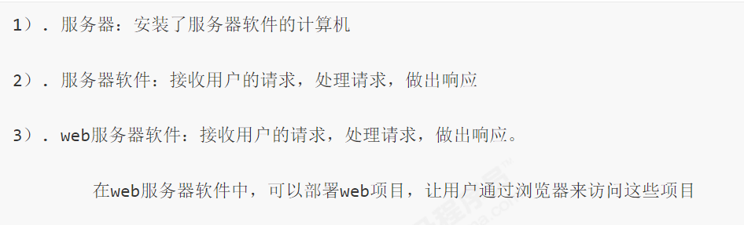

> 常见web服务器软件

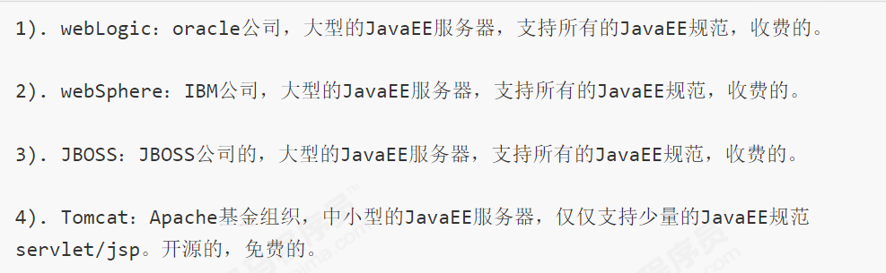

## tomcat历史

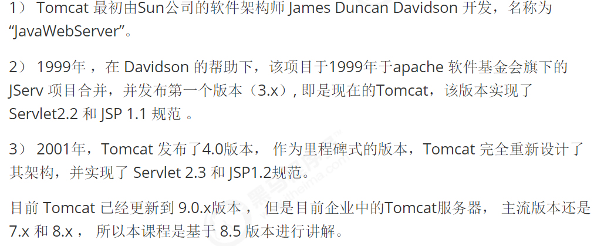

## tomcat安装

[Apache Tomcat® - Apache Tomcat 8 Software Downloads](https://tomcat.apache.org/download-80.cgi)

官网下载即可，解压后即可使用，卸载可以直接删除文件夹

## tomcat文件结构

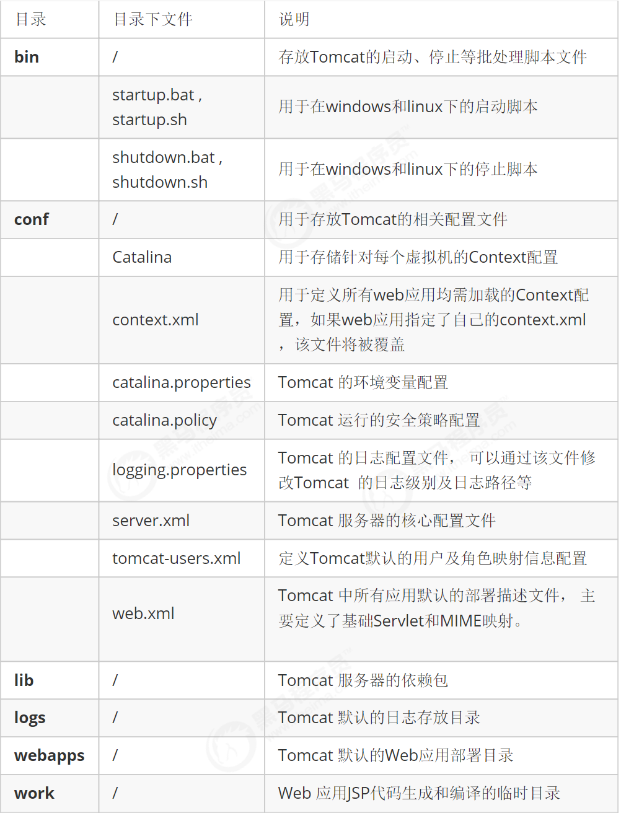

## 基本操作

### 启动

~~~bash
双击 bin/startup.bat 文件 ；
~~~

### 关闭

直接关闭窗口，强制关闭，后续运行的事务全部断掉

正确关闭方法

~~~bash
双击 bin/shutdown.bat 文件 ；
或者
在运行窗口ctrl+c可以正常关闭
~~~

### 访问

~~~bash
访问tomcat默认的8080端口即可
~~~

### 启动中的问题

> 运行后一闪而过

没有正确配置`JAVA_HOME`环境变量

需要再环境变量中设置`JAVA_HOME`，地址为jdk的地址

然后在path中添加`%JAVA_HOME%\bin`

> 运行报错

主要原因是端口号8080被占用了

1. 杀死占用进程

   ~~~bash
   netstat -ano
   #查看进程，找到8080对应进程的pid
   taskkill /pid 14396 -t -f
   #杀死对应进程，数字是pid
   ~~~

2. 修改自己端口号

   进入/conf/server.xml，修改配置

   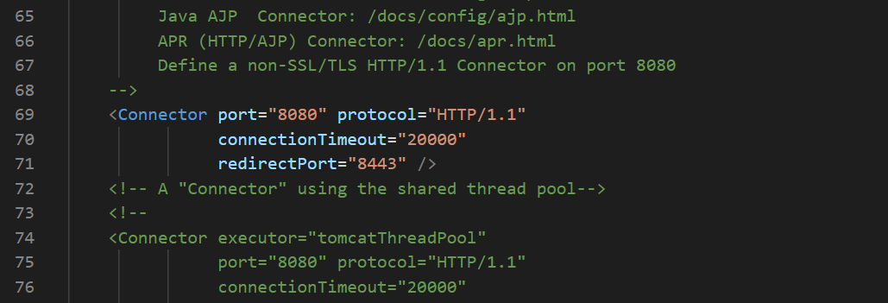

## tomcat项目部署方式

有三种方式

==直接将项目放到webapps目录下即可==

加入在webapps目录下放入laobuzhang文件夹，文件夹内放l`aobuzhang.html`

则访问`localhost:8080/laobuzhang/laobuzhang.html`即可访问到该文件

注意，必须要有外层的那个laobuzhang文件夹

简化部署：

将项目打包成war包放入webapps文件夹，会自动解压成相应的项目

==配置conf/server.xml文件（不太推荐）==

在\<Host>标签之中加入

~~~xml
<Context docBase="D:\laobuzhang" path="hello" />
~~~

docBase可以指定本机上任意路径

path是访问时使用的名称，也叫虚拟路径

访问`localhost:8080/hello/laobuzhang.html`，即可访问到本机的`D:\laobuzhang\laobuzhang.html`

==额外的配置文件（最推荐）==

该方法可以实现热部署

在`conf\Catalina\localhost`下创建任意名称的xml文件，在文件中编写

~~~xml
<Context docBase="D:\laobuzhang" />
~~~

docBase可以指定本机上任意路径

此时的虚拟目录即为创建的xml文件的名称

## web项目目录

目录结构：

~~~java
--项目根目录
    --WEB-INF目录
    	-- web.xml web项目的核心配置文件
    	-- classes目录 防止字节码文件的目录
    	-- lib目录 防止依赖的jar包
~~~

## idea集成tomcat

创建一个空项目web_tomcat

run->edit configurations->+->tomcat sever->local

按照下图配置即可

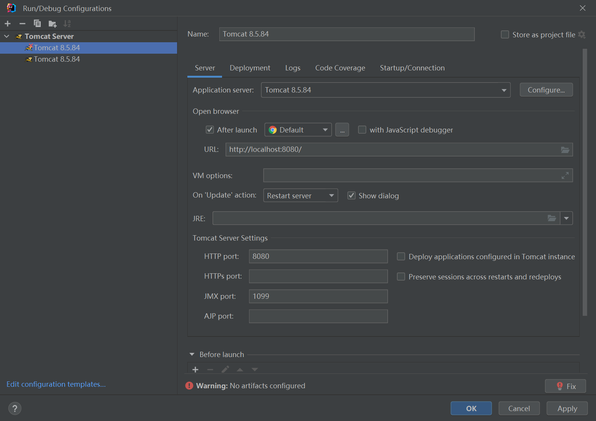

新建module创建web项目

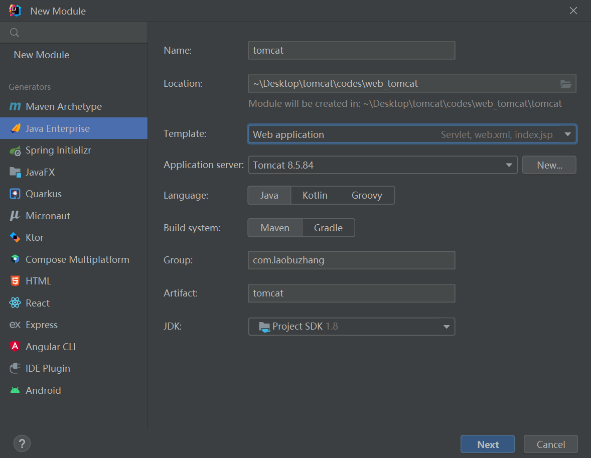

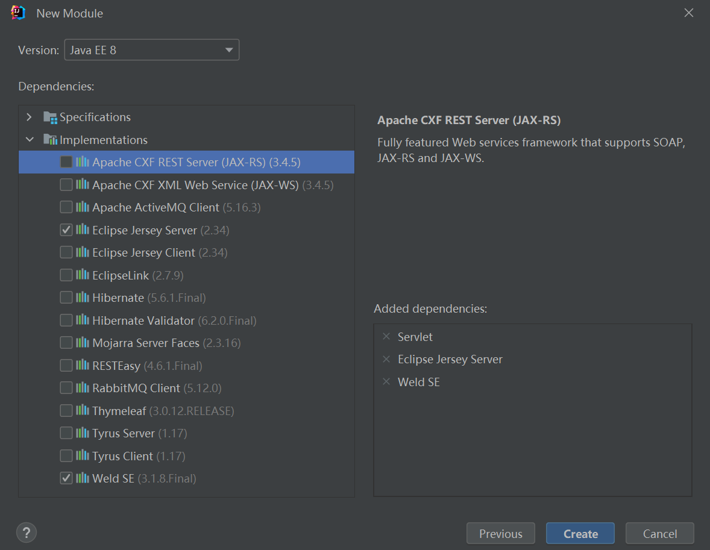

运行tomcat即可使用8080访问index.jsp页面

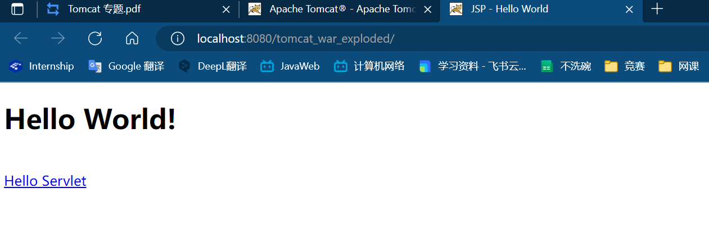

更改下面两个设置可以实现热部署

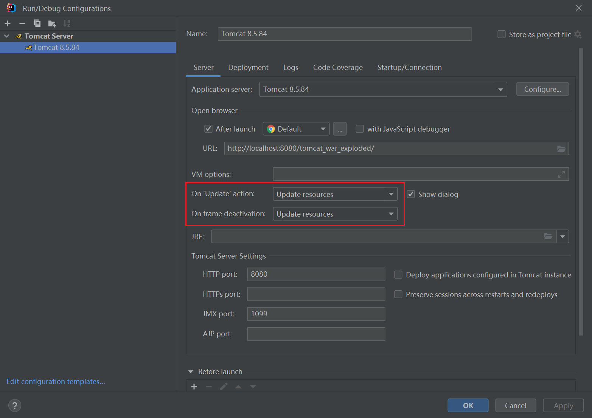

## tomcat源码部署运行

这篇博客讲的非常好

[Tomcat8.5.8源码编译](https://blog.csdn.net/sagemwireless_jsc/article/details/113739616)

去官网下载，download拉到最下边有source code，下载即可[Apache Tomcat® - Apache Tomcat 8 Software Downloads](https://tomcat.apache.org/download-80.cgi)

## tomcat整体架构

###  Http服务器请求处理

HTTP服务器不直接调用业务类，而是把**请求交给容器来处理**，**容器通过Servlet接口调用业务类**。Servlet接口和Servlet容器的出现，达到了HTTP服务器与业务类解耦的目的。而Servlet接口和Servlet容器这一整套规范叫作**Servlet规范。**

Tomcat按照Servlet规范的要求实现了Servlet容器，同时它们也具有HTTP服务器的功能。作为Java程序员，如果我们要**实现新的业务功能**，只需要**实现一个Servlet，并把它注册到Tomcat（Servlet容器）中**，剩下的事情就由Tomcat帮我们处理了

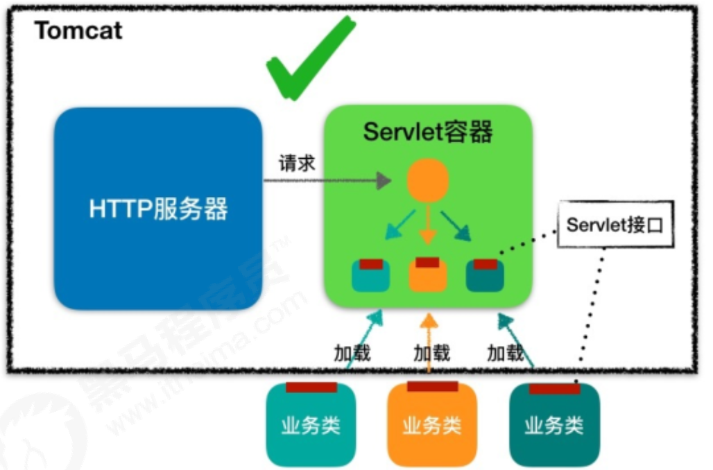

### Servlet容器工作流程

当客户请求某个资源时，HTTP服务器会用一个ServletRequest对象把客户的请求信息封装起来发给Servlet容器

Servlet容器接收请求，根据请求的URL和Servlet的映射关系，找到相应的Servlet，如果Servlet还没有被加载，就用反射机制创建这个Servlet，调用Servlet的init方法来完成初始化，接着调用Servlet的service方法来处理请求

把ServletResponse对象返回给HTTP服务器，HTTP服务器会把响应发送给客户端。

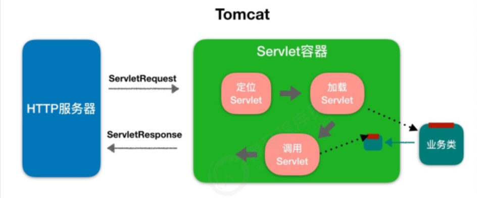

==Tomcat要实现两个核心功能==

1. 处理Socket连接，负责网络字节流与Request和Response对象的转化。
2. 加载和管理Servlet，以及具体处理Request请求

Tomcat设计了**两个核心组件** **连接器（Connector）**和**容器（Container）**来分别做这两件事情。连接器负责对外交流，容器负责内部处理。

### 连接器 - Coyote

#### 架构介绍

Coyote 是Tomcat的连接器框架

客户端通过Coyote与服务器建立连接、发送请求并接受响应 。

Coyote 作为独立的模块，只负责具体协议和IO的相关操作

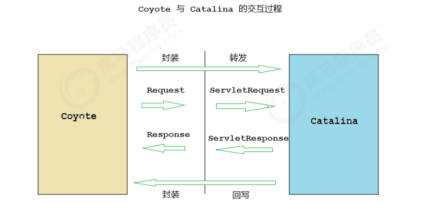

#### IO模型与协议

在Coyote中 ， Tomcat支持的多种I/O模型和应用层协议

Tomcat 支持的IO模型（自8.5/9.0 版本起，Tomcat 移除了 对 BIO 的支持）：

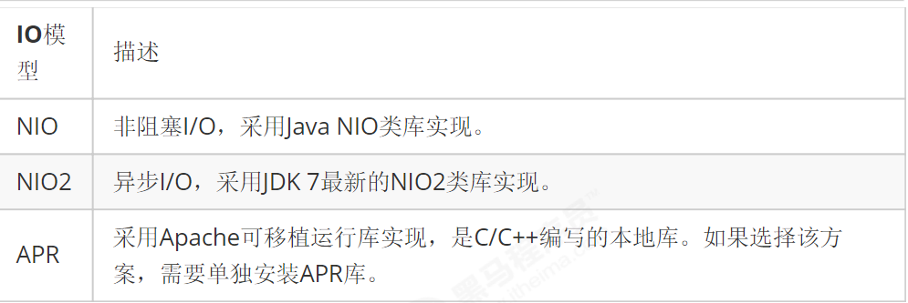

Tomcat 支持的应用层协议 ：

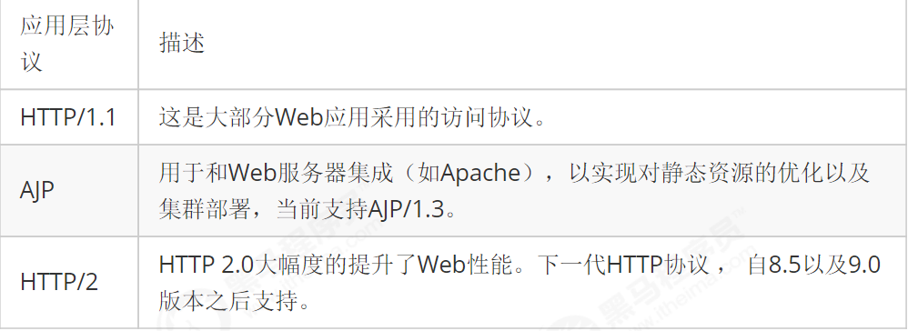

协议分层 ：

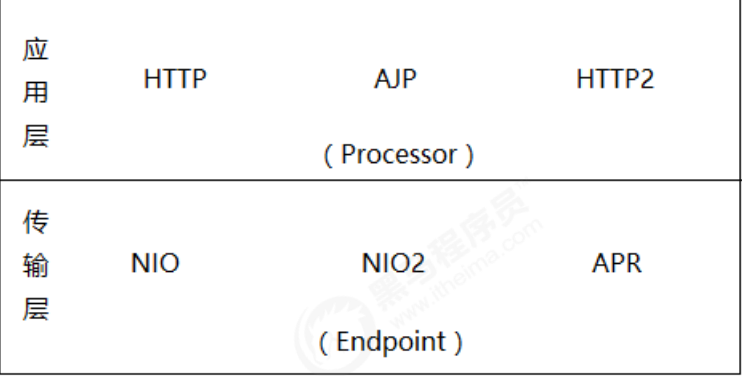

Tomcat为了实现支持多种I/O模型和应用层协议，**一个容器可能对接多个连接器**

单独的连接器或者容器都不能对外提供服务，需要把它们组装起来才能工作，组装后这个整体叫作**Service组件**

**Service本身**没有做什么重要的事情，只是在**连接器和容器**外面多包了一层，**把它们组装在一起**，**Tomcat内可能有多个Service**

通过在Tomcat中配置多个Service，可以实现通过不同的端口号来访问同一台机器上部署的不同应用。

#### 连接器组件

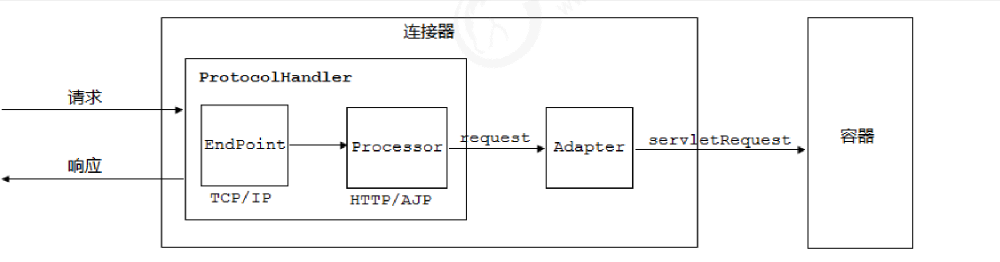

连接器中的各个组件的作用如下：

==EndPoint==

1. EndPoint ： **Coyote 通信端点**，即**通信监听的接口**，是具体Socket接收和发送处理器，是对传输层的抽象，因此**EndPoint用来实现TCP/IP协议**的。
2. Tomcat 并没有EndPoint 接口，而是提供了一个抽象类AbstractEndpoint ， 里面定义了两个内部类：Acceptor和SocketProcessor。Acceptor用于监听Socket连接请求。SocketProcessor用于处理接收到的Socket请求，它实现Runnable接口，在Run方法里调用协议处理组件Processor进行处理。为了提高处理能力，SocketProcessor被提交到线程池来执行。而这个线程池叫作执行器（Executor)，我在后面的专栏会详细介绍Tomcat如何扩展原生的Java线程池。

==Processor==

Processor ： **Coyote 协议处理接口** ，如果说EndPoint是用来实现TCP/IP协议的，那么**Processor用来实现HTTP协议**，Processor接收来自EndPoint的Socket，读取字节流**解析成Tomcat Request和Response对象**，并通过Adapter将其提交到容器处理，Processor是对应用层协议的抽象。

==ProtocolHandler==

ProtocolHandler： **Coyote 协议接口**， **ProtocolHandler接口负责解析请求并生成Tomcat Request类**。通过Endpoint 和 Processor ， 实现针对具体协议的处理能力。Tomcat 按照协议和I/O 提供了6个实现类 ： AjpNioProtocol ，AjpAprProtocol， AjpNio2Protocol ， Http11NioProtocol ，Http11Nio2Protocol ，Http11AprProtocol。我们在配置tomcat/conf/server.xml 时 ， 至少要指定具体的ProtocolHandler , 当然也可以指定协议名称 ， 如 ： HTTP/1.1 ，如果安装了APR，那么将使用Http11AprProtocol ， 否则使用 Http11NioProtocol 。

==Adapter==

CoyoteAdapter负责**将Tomcat Request转成ServletRequest**，再调用容
器的Service方法

### 容器 - Catalina

Tomcat是一个由一系列可配置的组件构成的Web容器，而Catalina是Tomcat的servlet容器。

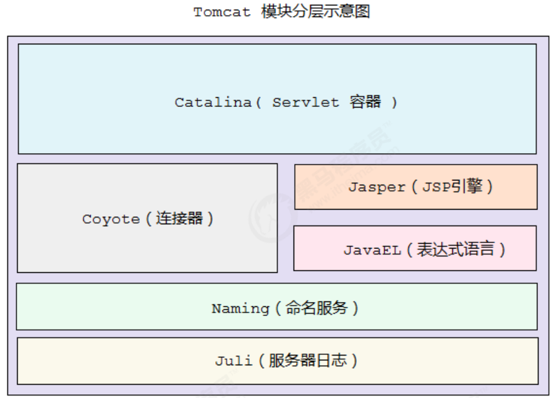

Tomcat 本质上就是一款 Servlet 容器， 因此Catalina 才是 Tomcat 的核心 ， 其他模块都是为Catalina 提供支撑的。

#### Catalina 结构

Catalina 是Servlet 容器实现，包含了之前讲到的所有的容器组件

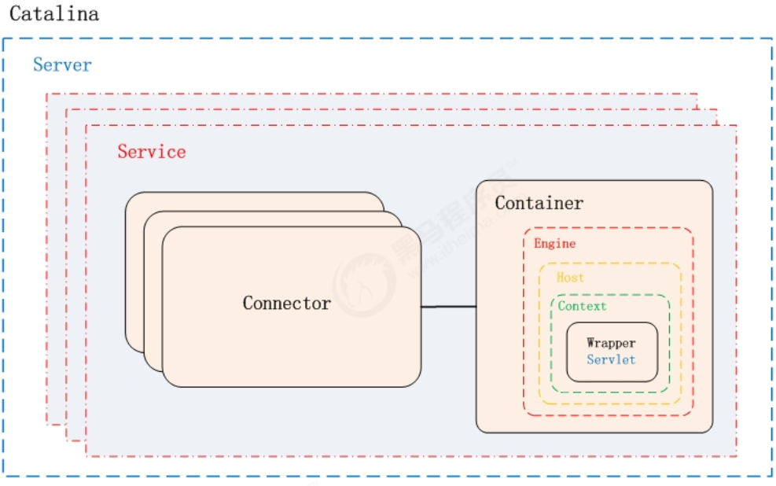

Catalina负责管理Server，而Server表示着整个服务器。Server下面有多个服务Service，每个服务都包含着多个连接器组件Connector（Coyote 实现）和一个容器组件Container。在Tomcat 启动的时候， 会初始化一个Catalina的实例

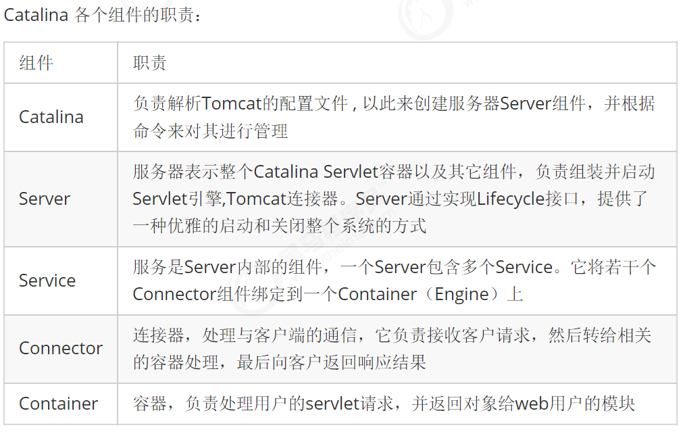

#### Container 结构

Tomcat设计了4种容器，分别是Engine、Host、Context和Wrapper。这4种容器不是平行关系，而是**父子关系**。， Tomcat通过一种分层的架构，使得Servlet容器具有很好的灵活性。

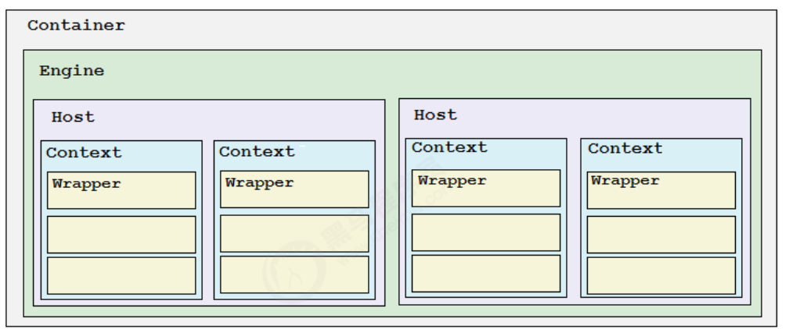

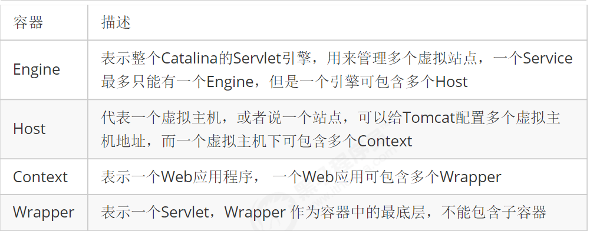

我们也可以再通过Tomcat的**server.xml配置文件**来加深对Tomcat容器的理解。Tomcat采用了组件化的设计，它的构成组件都是可配置的，其中最外层的是Server，其他组件按照一定的格式要求配置在这个顶层容器中。

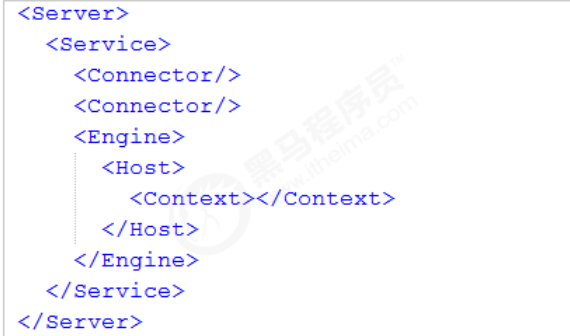

##  Tomcat 启动流程

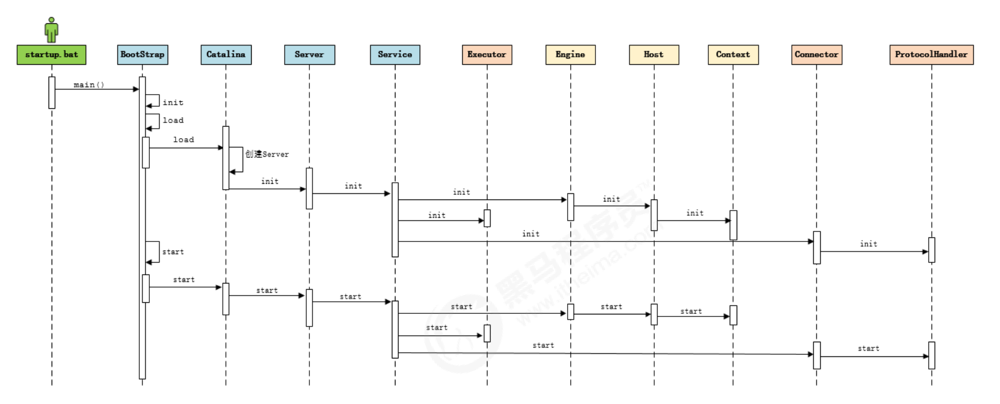

##  Tomcat 请求处理流程

Tomcat是用Mapper组件来确定每一个请求应该由哪个Wrapper容器里的Servlet来处理的

Mapper组件的功能就是将用户请求的URL定位到一个Servlet

Host容器里配置的域名、Context容器里的Web应用路径，以及Wrapper容器里Servlet映射的路径，这些配置信息就是一个多层次的Map。

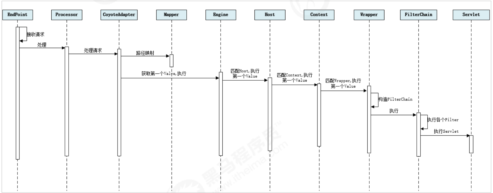

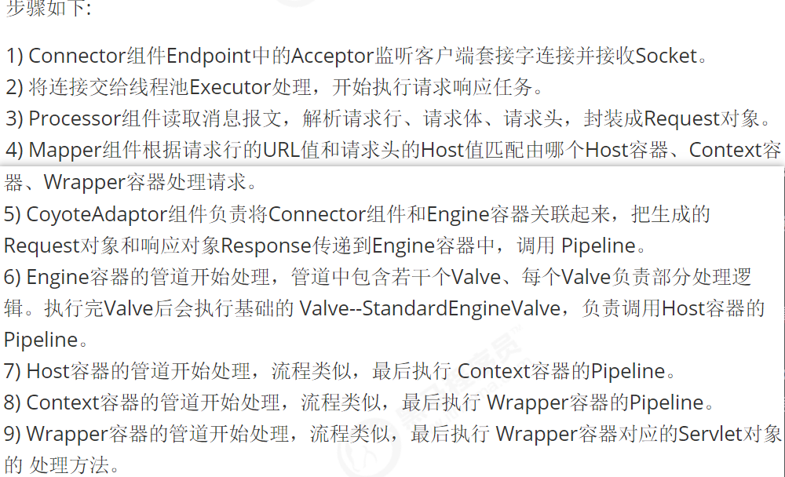

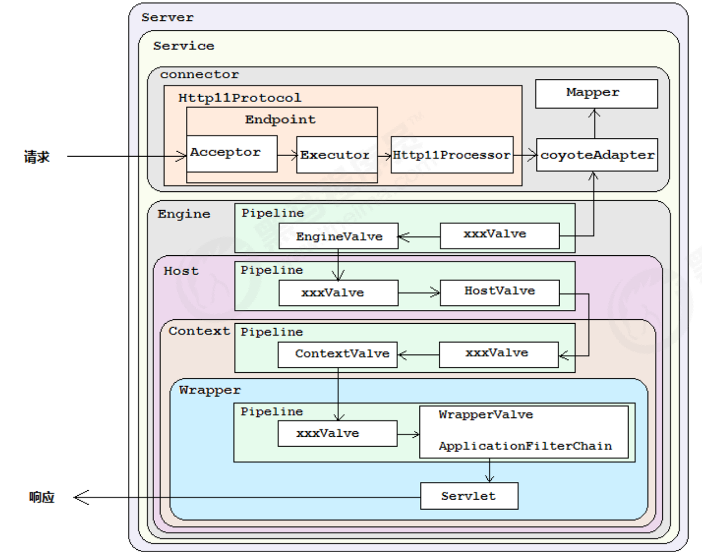

在Tomcat中，每个Container组件采用责任链模式来完成具体的请求处理。

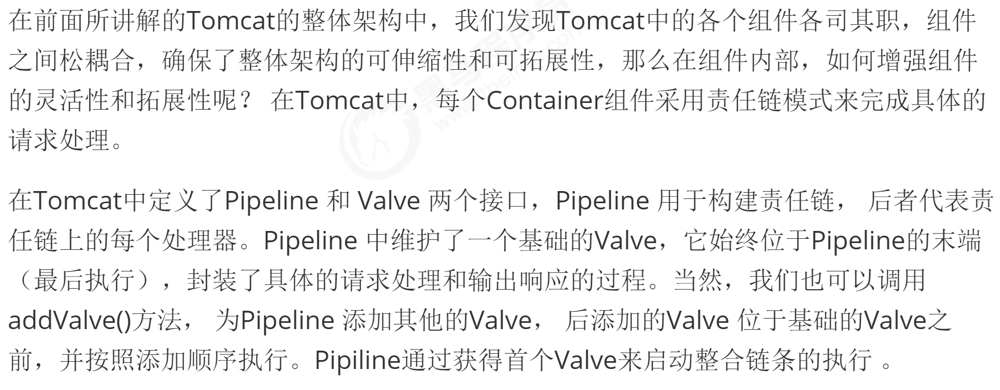

## Jasper

[js、jsp、javascript的区别是什么？ - html中文网](https://www.html.cn/qa/javascript/14565.html#:~:text=jsp和js（javascript）的区别,1、位置上的不同，javascript一般在前台运行，要求浏览器要支持js，而JSP是在后台服务器上的，主要用于控制html。 2、jsp是在html中以<%%>的形式出现，而js是在HTML中以<%2Fscript>来实现。)

对于基于JSP 的web应用来说，我们可以直接在JSP页面中编写 Java代码，添加第三方的标签库，以及使用EL表达式。但是无论经过何种形式的处理，最终输出到客户端的都是标准的HTML页面（包含js ，css...），并不包含任何的java相关的语法。 也就是说， 我们可以把jsp看做是一种运行在服务端的脚本。

Jasper模块是Tomcat的JSP核心引擎，我们知道JSP本质上是一个Servlet。Tomcat使用Jasper对JSP语法进行解析，生成Servlet并生成Class字节码，用户在进行访问jsp时，会访问Servlet，最终将访问的结果直接响应在浏览器端 。另外，在运行的时候，Jasper还会检测JSP文件是否修改，如果修改，则会重新编译JSP文件。

## tomcat配置