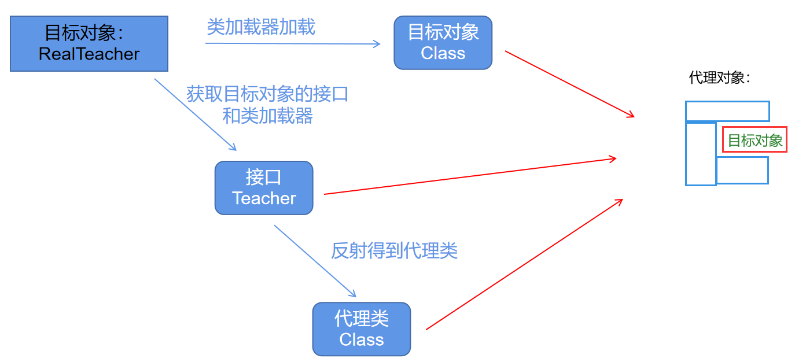
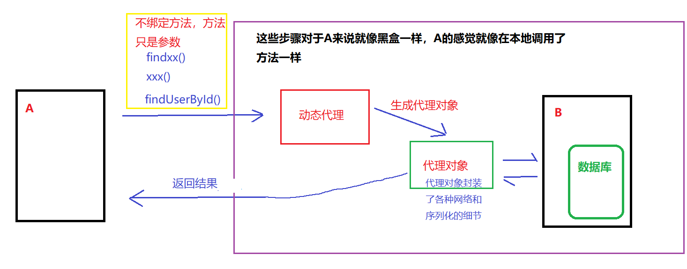
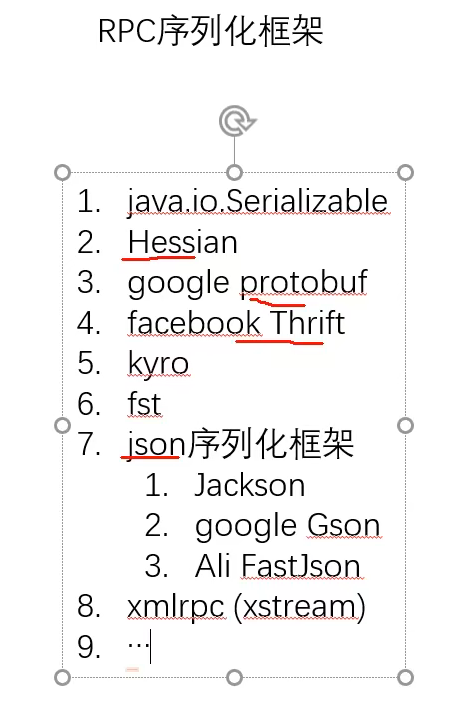

# RPC

## RPC简介

remote procedure call

远程方法调用

RPC（Remote Procedure Call）远程过程调用协议，一种通过网络从远程计算机上请求服务，而不需要了解底层网络技术的协议。

从单机到分布式->分布式通信->最基本：二进制数据传输tpc/ip

最原始的方式：client端中使用inputstream和outputstream

## 静态代理

此部分主要参考博客

[Java 动态代理，invoke() 自动调用原理，invoke() 参数](https://blog.csdn.net/Justin_bibo/article/details/114888702?spm=1001.2014.3001.5501)

假如现在我们面临一个需求，把一个项目中所有访问数据库的方法都记录日志。最直接的方法是修改所有代码，在每个方法里面都加入写日志代码：

~~~java
public class Dao {
	User findUserbyId(int id) {
		// 业务代码
		xxx;
		// 加入写日志代码
		xxx;
	}
	
}
~~~

去修改所有业务代码，显然这种方法是不可取的。

**如果不可以修改业务代码呢？**

很容易就想到静态代理，写**代理类**对业务代码进行调用

即使用类似aop的方式，写出一个proxy类（代理类），继承原本的接口，在proxy类中可以做些其他的事，然后在调用原本的方法

用老师教学生举例子：

~~~java
/**
* 老师接口，老师可以教学生
*/
public interface Teacher { 
    void teach();
}
~~~

~~~java
/**
* 老师接口的实现类，具体实现 teach() 方法
*/
public class RealTeacher implements Teacher {
    @Override
    public void teach() {
        System.out.println("I am a teacher, I am teaching!");
    }
}
~~~

~~~java
/**
* 老师代理对象，增强 teach() 方法
*/
public class TeacherProxy implements Teacher {
    Teacher teacher = new RealTeacher();
    @Override
    public void teach() {
    	// 这里 dosomething() 可以实现一些代理类的功能
    	dosomething();
    	// 这里执行 RealTeacher 的 teach() 方法
    	teacher.teach();
        dosomething();
    }
}
~~~

~~~java
/**
* 测试代理类
*/
public class ProxyTest {
    public static void main(String args[]) {
    	Teacher teacher = new TeacherProxy();
    	// 这里执行代理类的 teach() 方法
    	teacher.teach();
    }
}
~~~

关系如下图：

静态代理就是一个代理类代理一个类

动态代理就是一个代理类代理很多类

## 动态代理

为每一个需要代理的对象（下文通称为目标对象）都编写相应的代理类很麻烦，那么能不能不写死代理对象和目标对象，只写一个代理对象就可以使用不同的目标对象呢？

答案是可以的，就是用动态代理。动态代理的代理对象不依赖于目标对象，不和目标对象耦合。

其原理是把目标对象的类型信息（比如接口）作为参数，利用 Java 支持的**反射**来创建代理对象，这样，就解除了代理对象和目标对象的耦合，一个代理对象可以适用一些列的目标对象。用图表示为：

如上图所示，目标对象作为一个参数，动态代理得到这个参数之后分成三步走：

1. 获得目标对象的**接口信息和类加载器**，然后根据这两个信息来**反射得到代理类的 Class**
2. 获得目标对象的 Class
3. 根据1 2两步获得的接口，代理类 Class，目标类 Class 实例化一个代理对象

动态代理并没有和目标对象绑定，而是把目标对象作为一个参数。

JDK 提供了 java.lang.reflect.InvocationHandler 接口和 java.lang.reflect.Proxy 类来实现上述反射等功能

java.lang.reflect.InvovationHandler 接口用于**绑定**目标对象需要增强的**方法**

java.lang.reflect.Proxy 提供静态方法 NewProxyInstance() 用于**创建一个代理类实例**

这样，这个代理类实例就被创建出来并且通过嵌入 InvocationHandler 绑定了目标类的方法。
上面的静态代理代码的例子改成动态代理：

~~~java
/**
 * 老师接口，老师可以教学生
 */
public interface Teacher {
    void teach();
}
~~~

~~~java
/**
 * 老师接口的实现类，具体实现 teach() 方法
 */
public class RealTeacher implements Teacher {
    @Override
    public void teach() {
        // 老师正在教书
        System.out.println("I am a teacher, I am teaching!");
    }
}
~~~

~~~java
import java.lang.reflect.InvocationHandler;
import java.lang.reflect.Method;
import java.lang.reflect.Proxy;
/**
 * 代理类，根据接口等信息动态地创建代理对象，其中 MyProxy 是 InvocationHandler 的实现类，用于绑定方法
 */
public class MyProxy implements InvocationHandler {
    // tar用于接收目标类的参数
    private Object tar;

    // 绑定目标类，根据目标类的类加载器和接口创建代理对象，并返回
    public Object bind(Object target) {
        this.tar = target;
        // 注意：此处代码返回代理类
        return Proxy.newProxyInstance(tar.getClass().getClassLoader(), 
        tar.getClass().getInterfaces(), this);
    }
    // invoke() 方法用于方法的增强
    @Override
    public Object invoke(Object proxy, Method method, Object[] args) throws Throwable {
        Object result = null;
        // 执行一些方法
        System.out.println("Do something before");

        // 目标类的方法执行，这里实际上是执行目标对象的方法，
        // 也就是 bind(Object target)参数 object target 的方法
        result = method.invoke(tar, args);
        //tar对应目标类，arge对应目标类的对象的方法

        System.out.println("Do something after");
        return result;
    }
}
~~~

~~~java
import java.lang.reflect.InvocationHandler;
import java.lang.reflect.Method;
import java.lang.reflect.Proxy;
/**
 * 测试类
 */
public class ProxyTest {
    public static void main(String[] args) throws Throwable {
        MyProxy proxy = new MyProxy();

        // 传入目标对象，进行绑定
        Teacher teacher = (Teacher)proxy.bind(new RealTeacher());

        // 执行代理对象的方法
        teacher.teach();
    }
}
~~~

目标对象 RealTeacher 可以看成是一个纯粹的参数，不和代理类耦合。

在应用的时候，可以把具体实现过程忽略，把`Teacher teacher = (Teacher)getProxy(new RealTeacher());`看成一个黑箱，它输入一个目标类作为参数，返回一个实现了 Teacher 接口的代理类。到此为止，我们成功使用了动态代理，在没有和目标类 RealTeacher 绑定的情况下，创建了一个代理类，增强了 teach() 方法。

**invoke()的参数**

- Object proxy
  - **proxy 参数就是代指反射创建的代理类 $Proxy0** 
- Method method
  - **参数 method 用于绑定的目标类的方法**
- Object[] args
  - **传入调用的方法的参数**

## RPC原理

主要参考

[RPC 原理，Demo 演示，为什么 RPC 用动态代理](https://blog.csdn.net/Justin_bibo/article/details/115057124?spm=1001.2101.3001.6661.1&utm_medium=distribute.pc_relevant_t0.none-task-blog-2~default~CTRLIST~Rate-1-115057124-blog-108706846.pc_relevant_multi_platform_whitelistv3&depth_1-utm_source=distribute.pc_relevant_t0.none-task-blog-2~default~CTRLIST~Rate-1-115057124-blog-108706846.pc_relevant_multi_platform_whitelistv3&utm_relevant_index=1)

**一句话概括RPC：**

invoke方法将需要调用的**类名**，**方法名**，**各个参数的类型**，**各个参数**传输给服务器，然后得到服务器传来的结果返回给客户端的方法

当我们需要调用远程方法时

例如：

~~~
有一个客户类 User 代表用户的信息，这些信息存储在服务器 B 上面，服务器B提供查询用户的方法。
~~~

~~~
假设现在客户端A同样需要一个查询用户的方法 findUserById()，需要这个方法去访问服务器 B，一般的步骤是：
	A 把参数、接口和方法等信息序列化
	A 把序列化的信息通过网络发送给 B
	B 收到信息之后，反序列化解析信息
	B 根据解析到的信息找到方法，执行得到结果
	B 把结构序列化通过网络发送给 A
	A 反序列化解析信息，得到结果
~~~

~~~
为了完成上述的功能，最直接的做法是在 findUserById() 方法里面写这些序列化、网络请求、反序列化的代码，但是这样做有明显的缺点：
	代码复杂，网络请求序列化等方法和业务代码混杂在一起
	如果用户类 User 改变，那么代码的序列化等部分都要变
	如果有很多地方需求这种远程调用，需要为每一个方法写这一大堆代码
	如果远程服务器地址、端口甚至服务改变，需要修改每一个远程调用的方法
~~~

看到上述的缺点，可能大家想到的是用一个类把这些网络请求序列化等方法封装起来，让 findUserById() 直接去调用封装的代码:

~~~java
 findUserById(){
	 xx();// 调用封装方法
 }
 xx(){// 封装方法
 	把 findUserById 序列化
 	网络传输
 	// 服务器 B 执行 findUserById 返回
 	反序列化
 	返回
 }
~~~

但是这样，有上述伪代码可以看出，一个封装的方法只能用于 findUserById()，其他远程方法依然还要再写代码，再封装调用，和上面没有本质区别。

一个好的解决方法是用动态代理，这样就和方法无关，一系列的方法只需要写一个代理类，修改代码也只需要修改代理类。这其实就是 RPC 的原理：利用动态代理，创建代理类去实现这些细节，把接口（方法）作为参数传递，而不是绑定方法，上述的伪代码改成动态代理可以表示为：

~~~java
 findUserById(){
	 user = xx(接口);// 得到代理类
	 user.findUserById(参数);// 执行方法，这个方法实际上是 invoke() 里面的方法
 }
 xx(接口){// 封装方法,接口是一个参数
 	invoke(代理类，方法，参数){
	 	把 方法，参数 序列化
	 	网络传输
	 	// 服务器 B 执行 接口方法 返回
	 	反序列化
	 	返回
 	}
 	return 代理类
 	
 }
~~~

>这样，我们需要远程调用的方法（接口）只是一个参数，全部细节都可以在代理类中实现，并且一个代理类可以处理很多方法，**从而把远程访问代码和本地代码解耦**，便于项目扩展和维护，非常优雅。

## RCP实现

> 演进第一步

将client段中的代码封装成一个类，称为代理类

一般命名为stub类

> 演进第二步

在调用目标方法时相当于是向动态代理类传入 类名，方法名，各个参数类型，各个参数

通过动态代理类来向服务器发送 类名，方法名，各个参数类型，各个参数

然后动态代理类得到服务器返回的结果返回给目标方法

> 演进第三步

从服务器返回的结果也都封装成一个Object

> 演进第四步

使用更加高效的序列化方式

java自带的serializeable效率很低，时间长，序列也长

使用的是ObjectOutputStream和ObjectInputStream

演示hessian序列化框架：

序列化：

~~~java
puclic static byte[] serialize(Object o) throws Exception{
    ByteArrayOutputStream baos=new ByteArrayOutputStream;
    Hessian2Output output=new Hessian2output(baos);
    output.writeObject(o);//o通过hessian序列化，然后存储在baos中
    
    byte[] bytes=baos.toByteArray();//将序列化后的数据存储在二进制数组中
    
    baos.close();
    output.close();
    return bytes;
}
~~~

反序列化：

~~~java
puclic static Object deserialize(byte[] bytes) throws Exception{
    ByteArrayInputStream bais=new ByteArrayInputStream;
    Hessian2Input input=new Hessian2Input(bais);
    
    Object o=input.readObject();
    
    bais.close();
    input.close();
    return o;
}
~~~

他们两个都可以写进一个工具类中

~~~java
public class HessianUtil{
    puclic static byte[] serialize(Object o) throws Exception{
   		ByteArrayOutputStream baos=new ByteArrayOutputStream;
   		Hessian2Output output=new Hessian2output(baos);
    	output.writeObject(o);//o通过hessian序列化，然后存储在baos中
    
    	byte[] bytes=baos.toByteArray();//将序列化后的数据存储在二进制数组中
    
    	baos.close();
    	output.close();
    	return bytes;
	}
    puclic static Object deserialize(byte[] bytes) throws Exception{
        ByteArrayInputStream bais=new ByteArrayInputStream;
        Hessian2Input input=new Hessian2Input(bais);

        Object o=input.readObject();

        bais.close();
        input.close();
        return o;
    }
}
~~~

> 演进第五步

可以自己指定使用的传输协议

## RPC Demo

（没有使用其他的序列化方式）

客户端代码：

~~~java
/**
 * 用户类的接口
 */
public interface IUserService {
    User findUserById(int id);
    
}
~~~

~~~java
import java.io.ObjectInputStream;
import java.io.ObjectOutputStream;
import java.lang.reflect.InvocationHandler;
import java.lang.reflect.Method;
import java.lang.reflect.Proxy;
import java.net.Socket;

/**
 * 代理类，接受一个接口参数，通过反射创建一个代理类，并且封装了远程访问服务器的一系列细节，
 * 此代理类和具体的接口无关，接口只是一个参数
 */
public class Agent {
    public static Object getObject(Class target) {
        Object result = Proxy.newProxyInstance(target.getClassLoader(), new Class[]{target}, new InvocationHandler() {
            @Override
            public Object invoke(Object proxy, Method method, Object[] args) throws Throwable {
                Socket s = new Socket("127.0.0.1", 8088);

                ObjectOutputStream objectOutputStream = new ObjectOutputStream(s.getOutputStream());
                String className = target.getName();
                String methodName = method.getName();
                Class[] parametersTypes = method.getParameterTypes();// 获得target的一些参数

                objectOutputStream.writeUTF(className);//类名
                objectOutputStream.writeUTF(methodName);//方法名
                objectOutputStream.writeObject(parametersTypes);//各个参数的类型
                objectOutputStream.writeObject(args);//各个参数
                objectOutputStream.flush();// 把获得的参数信息写到socket里面,发送给服务器

                ObjectInputStream objectInputStream = new ObjectInputStream(s.getInputStream());
                Object result = objectInputStream.readObject();// 从socket里面读取服务端执行返回的信息
                objectOutputStream.close();
                s.close();
                return result;// 返回结果
            }
        });
        return result;
    }
}
~~~

~~~java
/**
 * 客户端用封装好的动态代理，获得代理类user，执行方法，代理类封装了访问网络的细节。
 */
public class Client {
    public static void main(String[] args) {
        IUserService user = (IUserService)Agent.getObject(IUserService.class);// 获得代理类
        System.out.println(user.findUserById(1));// 执行方法
    }
}
~~~

服务器代码：

~~~java

import java.io.Serializable;
import java.util.Objects;

/**
 * 用户类
 */
public class User implements Serializable, IUserService {
    String userName;
    int userId;
    // 无参构造器
    public User(){

    }

    public User(String userName, int userId) {
        this.userName = userName;
        this.userId = userId;
    }

    public String getUserName() {
        return userName;
    }

    public void setUserName(String userName) {
        this.userName = userName;
    }

    public int getUserId() {
        return userId;
    }

    public void setUserId(int userId) {
        this.userId = userId;
    }

    @Override
    public boolean equals(Object o) {
        if (this == o) return true;
        if (o == null || getClass() != o.getClass()) return false;
        User user = (User) o;
        return userId == user.userId &&
                Objects.equals(userName, user.userName);
    }

    @Override
    public int hashCode() {
        return Objects.hash(userName, userId);
    }

    @Override
    public User findUserById(int id) {
        return new User("user1",id);// 模拟访问数据库
    }

    @Override
    public String toString() {
        return "User{" +
                "userName='" + userName + '\'' +
                ", userId=" + userId +
                '}';
    }
}
~~~

~~~java
import java.io.IOException;
import java.io.ObjectInputStream;
import java.io.ObjectOutputStream;
import java.lang.reflect.InvocationTargetException;
import java.lang.reflect.Method;
import java.net.ServerSocket;
import java.net.Socket;

/**
 * Server模拟服务器，接受Socket的信息，找到方法，执行方法，并且返回
 */
public class Server {
    public static void main(String[] args) throws Exception {
        ServerSocket server = new ServerSocket(8088);// 用socket模拟客户端访问服务器的方法
        while(true){
            Socket client = server.accept();
            System.out.println(client);
            process(client);// 服务器执行服务，访问方法
            client.close();
            break;
        }

    }
    static void process(Socket socket) throws Exception {
        ObjectInputStream ois = new ObjectInputStream(socket.getInputStream());
        ObjectOutputStream oos = new ObjectOutputStream(socket.getOutputStream());

        String className = ois.readUTF();
        String methodName = ois.readUTF();
        Class[] parameterTypes = (Class[]) ois.readObject();
        Object[] parameters = (Object[]) ois.readObject();// 读取客户端发送的信息

        Class myclass = User.class;// 实际代码为注册表查找或者 Spring 的 bean 注入找到类（这时会使用className这个参数），这里先用这个代替
        Method method = myclass.getMethod(methodName, parameterTypes);// 获取方法

        Object o = method.invoke(myclass.newInstance(), parameters);// 执行方法
        oos.writeObject(o);
        oos.flush();// 把结果发送到客户端
    }
}
~~~

## RPC和HTTP

http 请求只是 RPC 中网络请求的工具，RPC 强调的是用动态代理去实现一个封装的、易修改扩展的远程访问方式，http 请求只是 RPC 实现网络请求的部分。

换句话说，RPC 不仅仅是一次网络请求，更类似于一种设计模式。