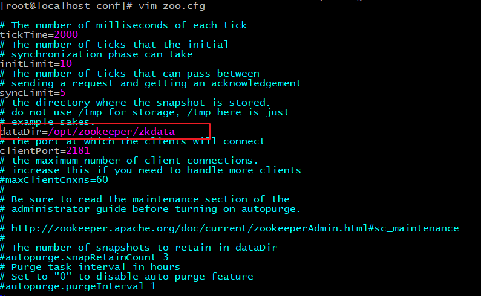
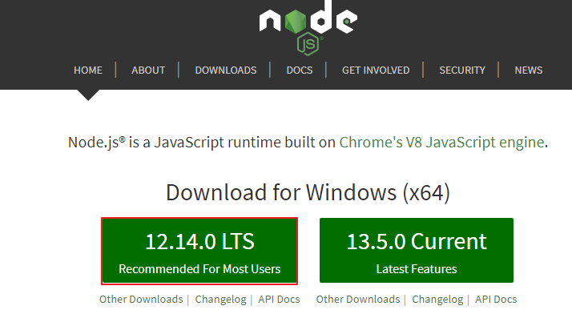
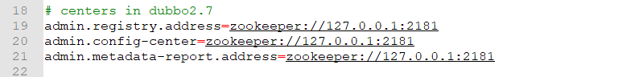

# Dubbo

## 分布式系统

### 大型互联网项目架构目标

**用户体验**

- 美观、功能、速度、稳定性


互联网项目特点：

- 用户多
- 流量大，并发高
- 海量数据
- 易受攻击
- 功能繁琐
- 变更快


**衡量网站的性能指标：**

- **响应时间**：指执行一个请求从开始到最后收到响应数据所花费的总体时间。

- **并发数**：指系统同时能处理的请求数量。
  - **并发连接数**：指的是客户端向服务器发起请求，并建立了TCP连接。每秒钟服务器连接的总TCP数量
  - **请求数**：也称为QPS(Query Per Second) 指每秒多少请求.
  - **并发用户数**：单位时间内有多少用户

- **吞吐量**：指单位时间内系统能处理的请求数量。
  - **QPS**：Query Per Second 每秒查询数。 
  - **TPS**：Transactions Per Second 每秒事务数。 

- 一个事务是指一个客户机向服务器发送请求然后服务器做出反应的过程。客户机在发送请求时开始计时，收到服务器响应后结束计时，以此来计算使用的时间和完成的事务个数。
- 一个页面的一次访问，只会形成一个TPS；但一次页面请求，可能产生多次对服务器的请求，就会有多个QPS


### 集群和分布式

- 集群：很多“人”一起 ，干一样的事。 
- 分布式：很多“人”一起，干不一样的事。这些不一样的事，合起来是一件大事


- 集群：很多“人”一起 ，干一样的事。

  - 一个业务模块，部署在多台服务器上。 
- 分布式：很多“人”一起，干不一样的事。这些不一样的事，合起来是一件大事。
  - 一个大的业务系统，拆分为小的业务模块，分别部署在不同的机器上。 


### 架构演进


> 单体架构


> 垂直架构


>分布式架构

主要是使用RPC技术


> SOA架构

加入中间服务者


> 微服务架构


Dubbo 是 SOA时代的产物，SpringCloud 是微服务时代的产物


## Dubbo概述

### Dubbo概念

- Dubbo是阿里巴巴公司开源的一个高性能、轻量级的 Java RPC 框架。
- 致力于提供高性能和透明化的 RPC 远程服务调用方案，以及 SOA 服务治理方案。
- 官网：[http://dubbo.apache.org](http://dubbo.apache.org/)


**节点角色说明：**

- **Provider**：暴露服务的服务提供方
- **Container**：服务运行容器
- **Consumer**：调用远程服务的服务消费方
- **Registry**：服务注册与发现的注册中心
- **Monitor**：统计服务的调用次数和调用时间的监控中心


### Dubbo入门

#### zookeeper安装

Dubbo官方推荐使用Zookeeper作为注册中心

##### 1.1 下载安装

**1、环境准备**

ZooKeeper服务器是用Java创建的，它运行在JVM之上。需要安装JDK 7或更高版本。

**2、上传**

将下载的ZooKeeper放到/opt/ZooKeeper目录下

```shell
#上传zookeeper alt+p
put f:/setup/apache-zookeeper-3.8.0-bin.tar.gz
#打开 opt目录
cd /opt
#创建zooKeeper目录
mkdir  zooKeeper
#将zookeeper安装包移动到 /opt/zooKeeper
mv apache-zookeeper-3.8.0-bin.tar.gz /opt/zookeeper/
```

**3、解压**

将tar包解压到/opt/zookeeper目录下

```shell
tar -zxvf apache-zookeeper-3.8.0-bin.tar.gz 
```

##### 1.2 配置启动

**1、配置zoo.cfg**

进入到conf目录拷贝一个zoo_sample.cfg并完成配置

```shell
#进入到conf目录
cd /opt/zookeeper/apache-zookeeper-3.8.0-bin/conf/
#拷贝
cp  zoo_sample.cfg  zoo.cfg
```


修改zoo.cfg

```shell
#打开目录
cd /opt/zookeeper/
#创建zooKeeper存储目录
mkdir  zkdata
#修改zoo.cfg
vim /opt/zooKeeper/apache-zooKeeper-3.8.0-bin/conf/zoo.cfg
```



修改存储目录：dataDir=/opt/zookeeper/zkdata

**2、启动ZooKeeper**

```shell
cd /opt/zookeeper/apache-zookeeper-3.8.0-bin/bin/
#启动
 ./zkServer.sh  start
```


看到上图表示ZooKeeper成功启动

**3、查看ZooKeeper状态**

```shell
./zkServer.sh status
```

zookeeper启动成功。standalone代表zk没有搭建集群，现在是单节点


zookeeper没有启动


#### Dubbo快速入门

主要是dubbo-pro这个项目

- 创建dubbo-service模块，作为方法提供者
- 创建dubbo-web模块，作为方法调用者
- 创建dubbo-interface模块，作为接口提供者

dubbo-service模块对dubbo-interface模块的类进行实现

dubbo-web模块和dubbo-service模块都需要依赖dubbo-interface模块


dubbo-web模块和dubbo-service模块的依赖差别不大

~~~xml
<?xml version="1.0" encoding="UTF-8"?>
<project xmlns="http://maven.apache.org/POM/4.0.0"
         xmlns:xsi="http://www.w3.org/2001/XMLSchema-instance"
         xsi:schemaLocation="http://maven.apache.org/POM/4.0.0 http://maven.apache.org/xsd/maven-4.0.0.xsd">
    <modelVersion>4.0.0</modelVersion>

    <groupId>com.itheima</groupId>
    <artifactId>dubbo-web</artifactId>
    <version>1.0-SNAPSHOT</version>
    <packaging>war</packaging>


    <properties>
        <spring.version>5.1.9.RELEASE</spring.version>
        <dubbo.version>2.7.4.1</dubbo.version>
        <zookeeper.version>4.0.0</zookeeper.version>

    </properties>

    <dependencies>
        <!-- servlet3.0规范的坐标 -->
        <dependency>
            <groupId>javax.servlet</groupId>
            <artifactId>javax.servlet-api</artifactId>
            <version>3.1.0</version>
            <scope>provided</scope>
        </dependency>
        <!--spring的坐标-->
        <dependency>
            <groupId>org.springframework</groupId>
            <artifactId>spring-context</artifactId>
            <version>${spring.version}</version>
        </dependency>
        <!--springmvc的坐标-->
        <dependency>
            <groupId>org.springframework</groupId>
            <artifactId>spring-webmvc</artifactId>
            <version>${spring.version}</version>
        </dependency>

        <!--日志-->
        <dependency>
            <groupId>org.slf4j</groupId>
            <artifactId>slf4j-api</artifactId>
            <version>1.7.21</version>
        </dependency>
        <dependency>
            <groupId>org.slf4j</groupId>
            <artifactId>slf4j-log4j12</artifactId>
            <version>1.7.21</version>
        </dependency>


        <!--Dubbo的起步依赖，版本2.7之后统一为rg.apache.dubb -->
        <dependency>
            <groupId>org.apache.dubbo</groupId>
            <artifactId>dubbo</artifactId>
            <version>${dubbo.version}</version>
        </dependency>
        <!--ZooKeeper客户端实现 -->
        <dependency>
            <groupId>org.apache.curator</groupId>
            <artifactId>curator-framework</artifactId>
            <version>${zookeeper.version}</version>
        </dependency>
        <!--ZooKeeper客户端实现 -->
        <dependency>
            <groupId>org.apache.curator</groupId>
            <artifactId>curator-recipes</artifactId>
            <version>${zookeeper.version}</version>
        </dependency>

<!--        <dependency>-->
<!--            <groupId>com.itheima</groupId>-->
<!--            <artifactId>dubbo-service</artifactId>-->
<!--            <version>1.0-SNAPSHOT</version>-->
<!--        </dependency>-->

        <dependency>
            <groupId>com.itheima</groupId>
            <artifactId>dubbo-interface</artifactId>
            <version>1.0-SNAPSHOT</version>
        </dependency>

    </dependencies>


    <build>
        <plugins>
            <!--tomcat插件-->
            <plugin>
                <groupId>org.apache.tomcat.maven</groupId>
                <artifactId>tomcat7-maven-plugin</artifactId>
                <version>2.1</version>
                <configuration>
                    <port>8000</port>
                    <!--另一个用9000-->
                    <path>/</path>
                </configuration>
            </plugin>
        </plugins>
    </build>


</project>
~~~

dubbo-web和dubbo-service使用两个不同的tomcat运行，端口分别设置为8000和9000


三个模块的代码的关系：


在dubbo-web和dubbo-service中，需要配置resource中的配置文件

配置dubbo和zookeeper，然后才能使用


实现类前要用dubbo的@Service注解

控制类中要使用@Reference注入类（代替@Autowired）


dubbo-web和dubbo-service都tomcat:run后，可以访问

http://localhost:8000/user/sayHello.do

得到实现类中的字符串


### Dubbo高级特性

#### dubbo-admin

##### dubbo-admin概述

- dubbo-admin 管理平台，是图形化的服务管理页面

- 从注册中心中获取到所有的提供者 / 消费者进行配置管理

- 路由规则、动态配置、服务降级、访问控制、权重调整、负载均衡等管理功能

- dubbo-admin 是一个前后端分离的项目。前端使用vue，后端使用springboot

- 安装 dubbo-admin 其实就是部署该项目

##### dubbo-admin安装

可以去官方github地址按照步骤来

[apache/dubbo-admin](https://github.com/apache/dubbo-admin)

**1、环境准备**

dubbo-admin 是一个前后端分离的项目。前端使用vue，后端使用springboot，安装 dubbo-admin 其实就是部署该项目。我们将dubbo-admin安装到开发环境上。要保证开发环境有jdk，maven，nodejs

安装node**(如果当前机器已经安装请忽略)**

**建议安装16版本以下的node.js**，17版本的更新使得前端的部分运行会出错，需要配置来解决

因为前端工程是用vue开发的，所以需要安装node.js，node.js中自带了npm，后面我们会通过npm启动

下载地址

```
https://nodejs.org/en/
```




**2、下载 Dubbo-Admin**

进入github，搜索dubbo-admin

```
https://github.com/apache/dubbo-admin
```

下载：


**3、把下载的zip包解压到指定文件夹(解压到那个文件夹随意)**


**4、修改配置文件**

解压后我们进入…\dubbo-admin-develop\dubbo-admin-server\src\main\resources目录，找到 **application.properties** 配置文件 进行配置修改


修改zookeeper地址



```shell
# centers in dubbo2.7
admin.registry.address=zookeeper://192.168.149.135:2181
admin.config-center=zookeeper://192.168.149.135:2181
admin.metadata-report.address=zookeeper://192.168.149.135:2181

```

admin.registry.address注册中心
admin.config-center 配置中心
admin.metadata-report.address元数据中心

**5、打包项目**

在 dubbo-admin-develop 目录执行打包命令（跳过测试，否则报错）

```shell
mvn clean package -Dmaven.test.skip=true
```


**6、启动后端**

在dubbo-admin-develop 目录执行命令

~~~shell
mvn --projects dubbo-admin-server spring-boot:ru
~~~


或者：

切换到目录

```shell
dubbo-Admin-develop\dubbo-admin-distribution\target>
```

执行下面的命令启动 dubbo-admin，dubbo-admin后台由SpringBoot构建。

```shell
java -jar .\dubbo-admin-0.1.jar
```


**7、前台后端**

dubbo-admin-ui 目录下执行命令

```shell
npm run dev
```


**8、访问**

浏览器输入。用户名密码都是root

```
http://localhost:8081/
```


##### dubbo-admin简单使用


注意:Dubbo Admin【服务Mock】【服务统计】将在后续版本发布....

在上面的步骤中，我们已经进入了Dubbo-Admin的主界面，在【快速入门】章节中，我们定义了服务生产者、和服务消费者，下面我们从Dubbo-Admin管理界面找到这个两个服务

**1、点击服务查询**

这里可以查询正在运行中的dubbo项目


**2、查询结果**


A:输入的查询条件com.itheima.service.UserService

B:搜索类型，主要分为【按服务名】【按IP地址】【按应用】三种类型查询

C:搜索结果

**3.1.4 dubo-admin查看详情**

我们查看com.itheima.service.UserService （服务提供者）的具体详细信息，包含【元数据信息】

**1）点击详情**


从【详情】界面查看，主要分为3个区域

A区域：主要包含服务端 基础信息比如服务名称、应用名称等

B区域：主要包含了生产者、消费者一些基本信息

**C区域：是元数据信息，注意看上面的图,元数据信息是空的**

我们需要打开我们的生产者配置文件加入下面配置

```xml
    <!-- 元数据配置 -->
    <dubbo:metadata-report address="zookeeper://192.168.149.135:2181" />
```

重新启动生产者，再次打开Dubbo-Admin

这样我们的元数据信息就出来了


##### 多个dubbo项目同时运行

多个dubbo项目同时运行时会发生端口冲突，需要修改默认端口


### Dubbo常用高级配置

#### 序列化

一般会添加一个pojo实体类模块

接口类所在的模块会依赖该模块

消费者和生产者会通过依赖传递得到对于该模块的依赖

所以该模块需要在网络之间传输，因此：

pojo类需要implements serializable


#### 地址缓存

**注册中心挂了，服务是否可以正常访问？**

- 可以，因为dubbo服务消费者在第一次调用时，会将服务提供方地址缓存到本地，以后在调用则不会访问注册中心。
- 当服务提供者地址发生变化时，注册中心会通知服务消费者。


#### 超时与重试

- 服务消费者在调用服务提供者的时候发生了阻塞、等待的情形，这个时候，服务消费者会一直等待下去。
- 在某个峰值时刻，大量的请求都在同时请求服务消费者，会造成线程的大量堆积，势必会造成雪崩。


- dubbo 利用超时机制来解决这个问题，设置一个超时时间，在这个时间段内，无法完成服务访问，则自动断开连接。
- 使用timeout属性配置超时时间，默认值1000，单位毫秒。
- 使用retries属性配置重试次数，默认值为2

使用方法：

在@Service注解中加入参数

~~~java
@Service（timeout=3000,retries=2）
//表示3秒未反应即超时，重试次数为2次
~~~


也可以在@Reference注解中加入参数

~~~java
@Reference（timeout=3000,retries=2）
//表示3秒未反应即超时，重试次数为2次
~~~

其中@Reference的优先级更高


#### 多版本


- 灰度发布：当出现新功能时，会让一部分用户先使用新功能，用户反馈没问题时，再将所有用户迁移到新功能。

- dubbo 中使用version 属性来设置和调用同一个接口的不同版本


对于同一个接口不同的实现类标识为不同的版本，即可做出区别

1. 在@Service注解中加入版本信息

   ~~~java
   @Service(version="v1.0")
   ~~~

2. 在@Reference注解中加入所注入的版本即可

   ~~~java
   @Reference(version="v1.0")
   ~~~

   


#### 负载均衡

> 修改配置

每一个重新启动的dubbo模块（不管是消费者还是生产者）都需要重新指定端口，否则会产生冲突

需要修改的地方：

1. tomcat服务器端口，默认为8080

   - 在pom.xml文件中

2. dubbo端口，默认为20880

   - 在resource中的配置文件中（可以指定，-1表示自动分配一个没有使用的）

   - ~~~xml
     <dubbo:protocol port="-1"/>
     ~~~

3. qos端口，默认为22222

   - 在resource中的配置文件中

   - ~~~xml
     <dubbo:application name="dubbo-web">
         <dubbo:parameter key="qos.port" value="33333"/>
     	<!--默认端口是22222，和service的会发生冲突，需要改一下-->
     </dubbo:application>
     ~~~


> 修改代码

在@Service中添加weight

~~~java
@Service(weight=100)
~~~


在@Reference中指定分配的规则

~~~java
@Reference(loadbalance="random")
//或者使用下面的几种
~~~


> 分配规则

- Random ：按权重随机，默认值。按权重设置随机概率。

  

- RoundRobin ：按权重轮询。

- LeastActive：最少活跃调用数，相同活跃数的随机。
  
- 调用上次处理最快的一台服务器
  
- ConsistentHash：一致性 Hash，相同参数的请求总是发到同一提供者。


#### 集群容错

> 集群容错模式

- Failover Cluster：失败重试。默认值。当出现失败，重试其它服务器 ，默认重试2次，使用 retries 配置。一般用于读操作
- Failfast Cluster ：快速失败，只发起一次调用，失败立即报错。通常用于写操作。
- Failsafe Cluster ：失败安全，出现异常时，直接忽略。返回一个空结果。
- Failback Cluster ：失败自动恢复，后台记录失败请求，定时重发。通常用于消息通知操
- Forking Cluster ：并行调用多个服务器，只要一个成功即返回。
- Broadcast  Cluster ：广播调用所有提供者，逐个调用，任意一台报错则报错。


> 代码

在@Reference注解中填写cluster参数

~~~Java
@Reference(cluster="failover")
~~~

可填写参数：

1. 按两下shift
2. 搜索cluster
3. 找到cluster接口
4. 查看该接口的实现类，对应的实现类中有对应的名字


#### 服务降级


比如现在不想要广告服务和日志服务了


> 降级方式


> 代码

在@Reference注解中加入mock参数，取值如上

~~~Java
@Reference(mock="force:return null")
//不在调用所注入的类
~~~

