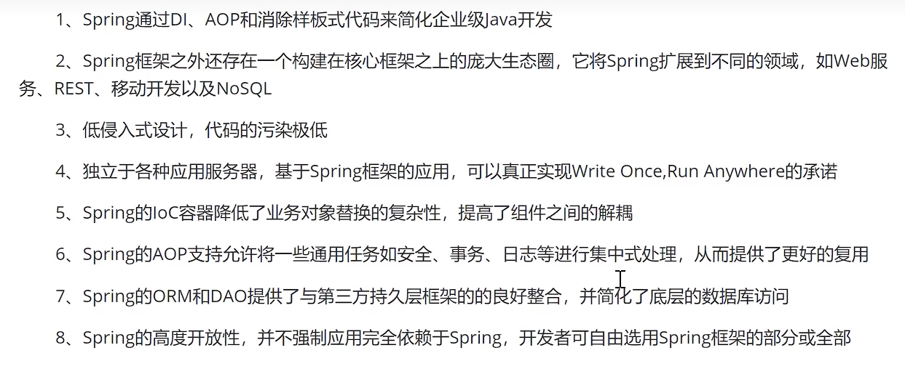
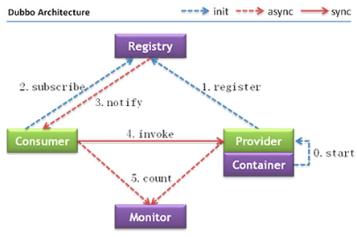

# Java

## java面向对象特征

封装

不影响使用改变类的内部结构，保护数据

继承

继承属性和行为，扩展新能力

多态

有继承和重写，调用父类时引用指向子类对象

~~~java
Animal a=new Dog();
~~~

重复使用，增加复用性，增加可移植性和健壮性和灵活性

## 对象

**对象在内存中的存储布局**

一个类分为四部分：

markword：占8字节（64位虚拟机占64位，即八字节，32位占32位），标记码

class pointer：占4字节，指向该类

instance data：不确定，存储数据

padding：对齐，补充字节使得类的大小可以被8整除

**类占用字节**

空类：占16字节，8+4+补4

**对象头：**

markword+class pointer

**markword：**

锁信息：记录锁的信息，上锁后markword中这部分会变

hashcode：不用每次计算，直接从头部拿即可

GC：类的颜色

**对象定位**

**堆内存逻辑分区：**

**新生代**

eden（伊甸）：新创建的对象，分为公共区域，同时也为每个线程单独分一点

survivor1：未死去的对象

survivor2：为死去的对象，和1打配合

**老年代**

tenured（终身）：

**对象如何分配**

栈上--线程本地--eden--old

创建时先尝试能否能在栈（只有256k）中创建，看大小和引用关系等

分配不下的话：

1. 若够大，直接进入old
2. 否则，先判断是否能放在线程本地缓存（eden给线程分配的区域），否则放公共区域

**对象创建过程**

new时执行

1. 申请空间
2. 初始化，如数据初始化等
3. 建立关联，将对象绑定到所申请的空间中的数据

**单例模式**

一个类只有一个对象，将构造方法私有，在类创建对象，使用方法返回该对象，由此所有调用都是同一个对象

**DCL**

双重检查机制

主要用来解决单例模式中的多线程问题，通过两把锁来实现单例模式

**但还是有个bug**

执行new时可能发生指令重排（只要不影响最终结果，都可以重排）

若是先绑定上，在进行了初始化

则在绑定上之后，初始化之前，其他线程会访问到没有初始化的对象（此时已经不为null，第一层if直接退出）

**volatile**

1. 使得线程之间可见
2. 禁止指令重排

在对象声明时加上volatile即可

~~~java
public static Mgr06{
    private static volatile Mgr06 INSTANCE;
    ...
}
~~~

## ArrayList和LinkList

数组和链表

## jdk1.8新特性

接口可以使用default添加默认方法

Lambda表达式，简化编程

产生了很多新的接口

新类

支持多重注解

## java接口和抽象类

语法不同，语义不同

抽象类描写**概念**，动物，哺乳动物

接口描写共同事物之间的**共同特征**，会飞，会游泳

## java代理

 代理模式，就是给一个对象提供一种代理对象以控制对该对象的访问。

 代理模式能带给我们控制访问某个对象的能力，在某些情况下，一个对象的某些方法想要进行屏蔽或者某种逻辑的控制，则我们可以通过代理的方式进行。

再此能力上，引申出来的作用，也是目前在开发中经常使用的一个作用，就是——“**在不修改原对象代码的基础上，对原对象的功能进行修改或者增强**”。

==静态代理==

**静态代理就是一个代理类代理一个类**

==动态代理==

proxy代理和CGLIB动态代理

**动态代理就是一个代理类代理很多类**

把目标对象的类型信息（比如接口）作为参数，利用 Java 支持的**反射**来创建代理对象，动态代理并没有和目标对象绑定，而是把目标对象作为一个参数。

## ==和equals

==：

比较基本数据类型时，比较数值

比较引用数据类型时，比较地址

equals：

只能比较引用数据类型，比较地址

可以进行重写，重新规则

## java异常处理

try：包裹可能异常的代码

catch：跟据所出现的异常种类执行操作

finally：最后一定执行

throw：方法内部，人为制造的异常

throws：方法签名处，声明可能出现的异常，需要对异常进行处理

## 重写和重载

override重写是父类和子类之间方法的重写

overload同一个类中的同名方法

## String StringBuffer StringBuilder

String不可变，即地址不可变，若改变内容，其实是指向了新的字符串

后两个可变

后两个底层都是数组，保存了数据和长度

起初分配一定长度的数组，若到了长度，则进行扩容，新创建一块更大的地址，将数据复制过去，同时改变成新地址

buffer从jdk1.0开始，builder从jdk1.5开始

bulider效率更高，但是线程没buffer安全，buffer都加锁了，其他基本一样

## 无子类

使用final修饰

无法被继承

Math类就是个例子，同时构造方法设置为private，但是方法都设置为static，所以都可以直接使用方法名访问到

## 自定义异常

需要继承系统的异常，实现具体的接口和类

## HashMap和HashTable

1. table线程同步，很多方法都加了锁，但是效率低，map非线程同步
2. table 的<键,值>中两个都不允许为null，map中键可以由一个为null，值可以由多个为null
3. table使用Enumeration，map使用iterator，后来table也支持了iterator
4. table默认大小为11，增加方式old*2+1，map默认大小16，增长方式是2的指数倍
5. table继承Dictionary类，map继承AbstractMap类，都实现Map接口

## hashmap线程安全

方法1：通过Collections.synchronizedMap()返回新的Map，这个是安全的，但是返回的不是HashMap，而是一个Map的新的实现

方法二：重新改写HashMap，可以查看java.util.concurrent.ConcurrentHashMap包

# mysql

## 事务的基本特性

被称为ACID

原子性，一致性，隔离性，持久性

原子性：全部成功，全部失败

一致性：事务执行前后都要满足设定的约束条件，比如总和不变等

隔离性：事务之间互不影响

持久性：对数据的改动在事务成功结束前都要保存至物理存储设备

原子性：undolog保证，记录历史版本数据

一致性：由其他三大特性保证

隔离性：MVCC保证，多版本并发控制

- MVCC 在 MySQL InnoDB 中的实现主要是为了提高数据库并发性能，用更好的方式去处理读-写冲突，做到即使有读写冲突时，也能做到不加锁，非阻塞并发读
- 简单来说，mysql的MVCC就是使得我们读到的可能是之前的版本，以此来避免读写冲突

持久性：redolog保证，写日志

## 索引设计原则

## MVCC

[理解MySQL的MVCC及实现原理](https://blog.csdn.net/SnailMann/article/details/94724197?ops_request_misc=%7B%22request%5Fid%22%3A%22167229072016800192294417%22%2C%22scm%22%3A%2220140713.130102334..%22%7D&request_id=167229072016800192294417&biz_id=0&utm_medium=distribute.pc_search_result.none-task-blog-2~all~top_positive~default-1-94724197-null-null.142^v68^pc_rank_34_queryrelevant25,201^v4^add_ask,213^v2^t3_control1&utm_term=MVCC&spm=1018.2226.3001.4187)

全称 `Multi-Version Concurrency Control` ，即多版本并发控制。

MVCC 在 MySQL InnoDB 中的实现主要是为了提高数据库并发性能，用更好的方式去处理读-写冲突，做到即使有读写冲突时，也能做到不加锁，非阻塞并发读

简单来说，mysql的MVCC就是使得我们读到的可能是之前的版本，以此来避免读写冲突

mysql的MVCC机制是由undo log来实现的：

- 版本链

  - 行的roll_pointer指向undo log，这个undo log就是这行记录之前的状态
  - 若该undo log是update undo log的话，它会继续指向前序的undo log，直到以insert undo log结尾
  - 当前行记录和它对应的undo log通过roll_Pointer指针共同构成了一个链表结构，称为**版本链**

  

实现MVCC的方式：

- 查询语句执行前，生成一个ReadView，也称作“一致性试图”，ReadView包含了当前活跃事务的trx_id信息
- 在执行查询时，把查询到的数据行中的trx_id和ReadView进行比较
- 如果数据的trx_id是当前正在活跃或者在生成ReadView时还未被分配的，并且也不是当前查询事务本身，就说明当前事务不能读取这行数据
- 接下来就需要追溯版本链，直至找到可以读取的数据

## mysql主从复制

数据可以从一个主节点复制到多个从节点

mysql采用异步复制的方法

通过binlog实现

从节点可以不用复制所有，复制自己需要的即可

## mysql为什么主从同步

1. 读写分离，主库负责写，从库负责读，即使主库锁起来，也可以读
2. 数据的热备，预防宕机，做集群
3. 分库分表，多库存储，防止单机爆炸

## 处理mysql慢查询

## 索引基本原理

索引为了加速查询

是一种键，一种数据结构，是优化查询最有效的手段

原理：

通过不断缩小数据的范围筛选出最终想要的结果

随机事件变为顺序事件

## mysql索引类型

非聚簇索引叶子节点存储聚簇索引节点的key值，聚簇改变，非聚簇也要改变

## mysql索引结构

mysql中使用较多的是 hash索引（memory存储引擎），B+树（innodb）

等值查询，hash索引有绝对优势，范围查询，hash索引寄，因为内部无序

大量键值重复时，效率也低

但是因为memory在内存中，本身速度快，所以可以使用

无法排序，无法like模糊查询

## mysql聚簇索引和非聚簇索引

数据和索引在一起，是聚簇索引

不在一起是非聚簇索引

innodb中两种都有，有的B+树都存，有的B+树只存储索引，都在.ibd中

myisam只有非聚簇，数据在.myd中，索引在.myi中

## myisam和innodb的区别

文件:

 innodb   .ibd 存所有

 myisam   .frm 存表结构，.MYD 存数据，.MYI 存索引

行锁：

innodb支持，锁越小，影响的代码越少，效率越高，myisam不支持

事务：

只有innodb支持

读写：

innodb读略低于myisan，写远优于myisam

## mysql执行计划

查看sql的具体执行过程，进行分析后改进以加快sql语句的执行效率

在平时的开发工作中，少不了数据库的使用，那么就会涉及到sql语句，如何知道sql语句执行的过程，以及sql语句执行的性能，通过执行计划模拟优化器执行sql进行分析

语法：EXPLAIN/DESC + SQL语句

例如：explain select * from user;

执行计划输出内容：

EXPLAIN SELECT * FROM test_tb1;

- id：执行的顺序，id相同，从上向下，id不同，大的优先级高（子查询）
- table：操作的是哪个表
- type：以何种方式访问数据的，有很多种类型，range以下的效率过低，需要改进索引或者数据库结构
  - 
- key：使用了哪些索引
- rows：预估检索的行数
- extra：额外信息

## 脏读幻读不可重复读

人家事务读到了你修改之后还没提交的值，这就是**脏读**了。

事务A 按照一定条件进行数据读取， 期间事务B 插入了相同搜索条件的新数据，事务A再次按照原先条件进行读取时，发现了事务B 新插入的数据 称为**幻读（虚读）**。

如果事务A 按一定条件搜索， 期间事务B 删除了符合条件的某一条数据，导致事务A 再次读取时数据少了一条。这种情况归为 **不可重复读**。

## mysql隔离级别

一些规则和约束，限制哪些事务之间可见，哪些不可见

级别越高，效率越低

## mysql锁的类型

按属性分类：共享锁（读锁）（只能都读），排他锁（写锁）（只能有着一个在写）

按粒度分类（锁定的范围）：行级锁（一行或者多行），表级锁，页级锁，记录锁（也是一种行锁，只能锁一行），间隙锁（也是一种行锁，锁一个范围，解决幻读），临键锁（记录锁+间隙锁）

- 在mysql这里：范围越小，效率越低，因为需要查找的越细

基于锁的状态分类：意向共享锁，意向排他锁

意向锁：先判断当前又没有更大的锁正在锁，比如需要加行锁，但是这个表已经锁上了，这时候就不用在加了

# spring，springmvc和springboot区别

底层框架

web框架

脚手架：整合所有东西，开发容易方便

**Spring包含了SpringMVC，而SpringBoot又包含了Spring或者说是在Spring的基础上做得一个扩展。**

SpringMVC属于Spring的一部分

- spring是全栈java开发框架，核心是控制反转（IOC）和面向切面（AOP），针对开发的web层（SpringMvc），业务层（IOC），持久层（jdbcTemplate）等都提供了多种配置解决方案

- springmvc是spring基础上的一个mvc框架，主要处理web开发的路径映射和视图渲染，属于spring框架中web层开发的一部分

SpringBoot相对SpringMVC大大简化配置流程

- springmvc涵盖前端视图开发、文件配置、后台逻辑开发等，XML、config等配置比较繁琐复杂
- springboot框架更专注于开发微服务后台接口，不开发前端视图，同时遵循默认由于配置，简化配置流程，不需要配置xml
- springboot和前端解耦，虽然也可以配合springmvc前后端一起开发，但是不符合springboot框架初衷

# Spring

## Spring

**Spring是一个轻量级的控制反转(IoC)和面向切面(AOP)的容器（框架）。**

一个框架，一个容器，一个生态（boot，cloud等都是以spring为基础）

## Spring优势

## spring如何简化开发

IOC：

基于POJO（可以理解为bean）的轻量级和最小侵入性编程

通过依赖注入和面向接口实现松耦合，可以自主扩展功能或者直接使用现成功能

AOP：

基于切面和惯例进行声明式编程，

通过切面和模板减少样板式代码

## IOC

IoC（Inversion of Control）控制反转

是一种思想：

- 使用对象时，在程序中不要主动使用new产生对象，转换为由**外部**提供对象
- 由程序员自己控制对象，变为IOC容器控制对象
- 创建权转移到外部，依赖的对象由IOC容器创建后注入到对象中，所以称为控制反转
- 依赖的对象被反转

**目的**：降低程序耦合度

[为什么Spring中的IOC(控制反转)能够降低耦合性（解耦）？](https://blog.csdn.net/tinpo_123/article/details/108718367?ops_request_misc=&request_id=&biz_id=102&utm_term=控制反转如何降低耦合&utm_medium=distribute.pc_search_result.none-task-blog-2~all~sobaiduweb~default-1-108718367.nonecase&spm=1018.2226.3001.4187)

**使用：**用配置文件或者注解的方式来代替new的使用

## IOC容器的实现

## BeanFactory和ApplicationContext

ioc：Inversion of Control控制反转

[什么是IOC容器——简单明了](https://blog.csdn.net/HD243608836/article/details/122482578?ops_request_misc=%7B%22request%5Fid%22%3A%22167522705116800213022213%22%2C%22scm%22%3A%2220140713.130102334..%22%7D&request_id=167522705116800213022213&biz_id=0&utm_medium=distribute.pc_search_result.none-task-blog-2~all~top_positive~default-1-122482578-null-null.142^v72^control_1,201^v4^add_ask&utm_term=IOC容器&spm=1018.2226.3001.4187)

相同

1. 都是spring的ioc容器，ApplicationContext继承于BeanFactory
2. 都可以用来配置XML属性，支持属性自动注入
3. 都提供了getBean()方法获取bean

不同

1. beanfactory在调用getBean方法时实例化bean，applicationcontext在启动容器时实例化单例bean
2. beanfactory不支持国际化，即i18n，applicationcontext支持国际化
3. beanfactory支持将事件发布到注册为监听器的bean，applicationcontext不支持
4. 核心实现不同
5. applicationcontext可以使用xml进行配置，beanfactory需要使用api注册autowiredbeanpostprocessor
6. applicationcontext更高级和丰富，一般更常用

## bean

构成应用程序主干并由Spring IoC容器管理的对象称为bean。bean是一个由Spring IoC容器实例化、组装和管理的对象。

## bean的自动装配

缺省（默认）

更常使用@Autowired注解

## bean的作用域

spring中bean默认是单例的，只有一个对象

可以通过`@Scope("session")`注解进行指定，参数填作用域

## spring的单例bean是否线程安全

1. 默认单例，并没有对多线程进行处理
2. 如果bean有状态（有数据存储功能），需要自己保证，建议改为prototype模式
3. 使用时不要再bean中声明有状态的实例变量或者类变量，如果必须如此。可以使用ThreadLocal把变量变成线程私有
4. 如果变量需要多个线程共享，那就加锁

## DI

DI = Dependency Injection = 依赖注入。

见名知义，DI 就是把依赖项注入到对象中。

它是一种编程技巧。使用它，可以编写出松散耦合的代码。

## AOP

AOP（Aspect Oriented Programming）

- 面向切面编程
- 在**不惊动原始程序**的基础下做**功能增强**
- 理念：无入侵式编程
- 为解耦而生

很多和业务无关的功能，例如日志，事务，权限等，这些组件简称需要融入到具体的业务逻辑中，所以就抽象出来，然后注入到需要使用的具体业务之中

## spring事务什么情况会失效

3.自身调用时，直接自己内部调，不会走外部aop代理等，所以事务配置就不会生效

7.回滚可以设置出现指定的异常时才回滚，所以此时出现其他异常就不会回滚

## spring事务实现方式

可以自己手动实现编程式事务，但是一般不这样做

使用@Transactional注解可以实现声明式事务，spring会把数据库事务自动提交关闭，由spring控制提交和回滚

## spring事务的传播机制

## spring框架中的设计模式和使用场景

# springMVC

## springMVC工作流程

原本使用servlet进行处理，给每一个请求都配置一个servlet，但是很麻烦

springMVC相当于是一个大型的servlet，都给配置好了

## MVC设计模式

针对web层进行了优化，采用了MVC设计模式，将其设计为`controller`、`view`和`Model`

* controller负责请求和数据的接收，接收后将其转发给service进行业务处理
* service根据需要会调用dao对数据进行增删改查
* dao把数据处理完后将结果交给service,service再交给controller
* controller根据需求组装成Model和View,Model和View组合起来生成页面转发给前端浏览器
* 这样做的好处就是controller可以处理多个请求，并对请求进行分发，执行不同的业务操作。

# Springboot

## starter

之前想要加入mybatis框架，需要在xml中定义需要的bean对象，麻烦，springboot中引入了starter

starter就是jar包，加入了一些常用的bean

## springboot自动配置

首先找到springboot项目的启动类，查看核心注解 `@SpringBootApplication`

 **SpringBoot自动配置流程：**

## springboot嵌入式服务器

一般情况下，需要部署好web服务器（如tomcat），然后把jar包放进去，在启动服务进行访问

springboot中由一个内嵌的tomcat，可以实现一键开发部署，简化开发流程

启动项目时直接按照java应用程序的方式来启动项目，不需要额外的依赖

 

# mybatis

## mybatis

它是一款半自动的ORM持久层框架，具有较高的SQL灵活性，支持高级映射(一对一，一对多)，动态SQL，延迟加载和缓存等特性，但它的数据库无关性较低

orm：类和数据库映射

半自动：用mybatis进行开发，需要手动编写SQL语句。而全自动的ORM框架，如hibernate，则不需要编写SQL语句。

也因为要手写SQL，当要切换数据库时，SQL语句可能就要重写，因为不同的数据库有不同的**方言**(Dialect)

提供了输入映射和输出映射，可以很方便地进行SQL参数设置，以及结果集封装。并且还提供了**关联查询**和**动态SQL**等功能，极大地提升了开发的效率。

## mybatis优缺点

1. 简单易学
2. 减少代码量
3. 兼容各种数据库，mybatis使用jdbc来连接数据库
4. 提供了很多第三方插件
5. 可以于spring集成
6. sql与代码解耦
7. 提供xml标签，支持动态sql语句（加一些if标签，choose标签等丰富sql）
8. 提供映射标签
9. 提供对象关系映射标签，支持对象关系组建维护

缺点：

1. sql语句编写工作量大
2. 数据库移植性差

## mybatis和hibernate

1. hibernate是全自动，会根据映射结构自动生成sql语句，mybatis需要手写
2. hibernate耦合性第，mybatis耦合性取决于sql语句，所以sql移植成本高
3. hibernate日志系统非常健全
4. mybatis学习简单，开发快，但是容易不细心写出bug
5. inbernate难以进行优化，因为sql自动生成
6. hibernate缓存机制更好

## #{}和${}的区别

用在xml文件中的sql语句中

例如：${name}传入`a=10 or 1=1`就把name赋值为成`true`，#{name}传入`a=10 or 1=1`就是把name赋值为`a=10 or 1=1`

示例

~~~xml
<select id="find" resultType="student" parameterType="student">
        SELECT * FROM student WHERE age >= 18
        <if test="name != null and name != ''">
            AND name like '%${name}%'
        </if>
</select>
~~~

# MybatisPlus

## MybatisPlus

MyBatisPlus（简称MP）是基于MyBatis框架基础上开发的增强型工具，旨在==简化开发、提高效率==

它是在MyBatis的基础上进行开发的，我们虽然使用MP但是底层依然是MyBatis的东西，也就是说我们也可以在MP中写MyBatis的内容。

MP的特性:

- 无侵入：只做增强不做改变，不会对现有工程产生影响
- 强大的 CRUD 操作：内置通用 Mapper，少量配置即可实现单表CRUD 操作
- 支持 Lambda：编写查询条件无需担心字段写错
- 支持主键自动生成
- 内置分页插件
- ……

# NoSql

## NoSql

NoSQL(NoSQL = **Not Only SQL** )泛指**非关系型的数据库**。 

NoSQL以简单的key-value模式存储。

- 不遵循SQL标准。

- 不支持ACID。

- 远超于SQL的性能。

NoSQL可以**通过内存进行读取**，NoSQL可以当作缓存数据库

# redis

## redis

redis是一种典型的NoSQL数据库

**使用场景**

- 对数据高并发的读写

- 海量数据的读写

- 对数据高可扩展性的

**特点**

- Redis是一个开源的key-value存储系统。
- 和Memcached类似，它支持存储的value类型相对更多，包括string(字符串)、list(链表)、set(集合)、zset(sorted set --有序集合)和hash（哈希类型）。
- 这些数据类型都支持push/pop、add/remove及取交集并集和差集及更丰富的操作，而且这些操作都是原子性的。
- 在此基础上，Redis支持各种不同方式的排序。
- 与memcached一样，为了保证效率，数据都是缓存在内存中。
- 区别的是Redis会**周期性的把更新的数据写入磁盘**或者把修改操作写入追加的记录文件，**即实现持久化**。
- 并且在此基础上实现了master-slave(主从)同步。

## redis库

默认16个数据库，类似数组下标从0开始，初始默认使用0号库

## redis数据类型

key 键，下面每种类型都有一个键，相当于是变量名

String 字符串

List 字符串列表

Set 可去重列表

Hash map `<key><field><value>`field是这个map的hash键值

Zset 有评分的Set

geospatial 地理

Hyperloglog 基数，一个集合中不重复的元素的个数

Bitmaps 位存储，二进制数

## jedis

Jedis是redis官方推荐的java连接开发工具

使用java操作redis中间件

## 缓存穿透

前提都是高并发，大量请求

key值少，redis中没有数据，回去mysql查询，当mysql受不了大量的询问时，mysql宕机，接连导致redis等也宕机

## 缓存击穿

前提都是高并发，大量请求

某一个key是热点，有大量并发，若这个key失效（过期），则大量并发直接访问mysql，mysql受不了大量的询问

## 缓存雪崩

前提都是高并发，大量请求

热点数据集中创建，又集中过期，导致都访问mysql

除了数据集中过期，还可能有节点宕机或者断网而自然形成缓存雪崩，这种雪崩更加致命，因为对服务器造成的压力时不可预知的

## redis主从复制

将一台redis服务器的服务复制到其他的服务器中

前者是主节点（master/leader），后者是从节点（slave。follower）

真实项目中一定会使用主从复制建立集群

基本配置：一主二从

==单台redis最大使用内存不应该超过20G==

过程：

- master和slave正常连接时，master发送一连串的命令流保持对slave的更新，便于将自身的数据集改变赋值给slave，包括客户端写入，key过期或被逐出等
- 断开连接后，slave重新连接上master并尝试进行部分重同步，只获取在连接期间内丢失的命令流
- 无法部分重同步，则进行全量重同步

关注点：

1. 异步复制
2. 用链式的方法去连接集群，每个分节点将上一个分节点当作主节点这样依然只有第一个节点是可以写入的
3. 复制默认时非阻塞的，master在同步时也可以处理请求

## redis事务

一组命令的集合，一个事务中的所有命令都会被序列化，在事务执行的过程中，会按照顺序执行。

==radis单条命令要么同时成功，要么同时失败，保证原子性==

==但是redis的事务不保证原子性==

==redis事务没有隔离级别的概念==

所有的命令在事物中，并没有被执行，只有发起执行命令时才会执行

## redis集群方案

主从复制集群，手动切换

带有哨兵的HA的主从复制集群

分片集群

## redis缓存回收

有多种不同的策略，将缓存中的数据进行删除等操作

## redis过期键删除

有一定的精度误差，可能会差毫秒级的时间

有两种过期方式：被动和主动

## redis线程

[Redis的线程模型](https://blog.csdn.net/weixin_44950174/article/details/114599880?ops_request_misc=%7B%22request%5Fid%22%3A%22167565850916782425174408%22%2C%22scm%22%3A%2220140713.130102334..%22%7D&request_id=167565850916782425174408&biz_id=0&utm_medium=distribute.pc_search_result.none-task-blog-2~all~sobaiduend~default-2-114599880-null-null.142^v73^control_1,201^v4^add_ask,239^v1^control&utm_term=redis线程模型&spm=1018.2226.3001.4187)

redis 实际上是个单线程工作模型

redis 基于 reactor 模式开发了网络事件处理器，这个处理器叫做**文件事件处理器**，file event headler，它是单线程的，因此 redis 才叫做单线程的模型。

采用 **IO多路复用机制**同时监听多个 socket，根据 socket 上的事件来选择对应的时间处理器来处理这个事件。

文件事件处理器是单线程模式运行的，但是通过IO多路复用机制监听多个 socket，可以实现高性能的网络通信模型，又可以跟内部其他单线程的模块进行对接，保证了 redis 内部的线程模型的简单性。

## redis单线程效率也高

1. IO多路复用程序不负责处理事件，只是监听所有的socket产生的一个请求，之后将请求压入队列。其是**非阻塞**的。
2. 事件处理器是基于纯内存操作的，性能非常高
3. 单线程反而避免了多线程的频繁上下文切换问题

## redis持久化机制

两种持久化方案既可以同时使用(aof),又可以单独使用,在某种情况下也可以都不使用,具体使用那种持久化方案取决于用户的数据和应用决定。

==快照(Snapshot)==

这种方式可以将某一时刻的所有数据都写入硬盘中,当然这也是**redis的默认开启持久化方式**,保存的文件是以.rdb形式结尾的文件因此这种方式也称之为**RDB方式**。

==AOF (Append Only File) 只追加日志文件==

这种方式可以将**所有客户端执行的写命令记录到日志文件中**,AOF持久化会将被执行的写命令写到AOF的文件末尾,以此来记录数据发生的变化,因此只要redis从头到尾执行一次AOF文件所包含的所有写命令,就可以恢复AOF文件的记录的数据集.

若有100条相同的命令，记录100条很多余

为了压缩aof的持久化文件Redis提供了AOF重写(ReWriter)机制，用来在一定程度上减小AOF文件的体积

## 双写一致性

进行数据修改时 缓存（redis）和数据库（mysql）中数据的改变

1. 先更新缓存，再更新数据库（不可取）
2. 先更新数据库，再更新缓存（不可取）
3. 先删除缓存，再更新数据库（不可取）
4. 先更新数据库，再删除缓存（可取，有问题待解决）

# MongoDB

## MongoDB

MongoDB也是NoSQL类型的数据库，是高性能、无模式的文档型数据库

==数据库  >  集合=表  > 字段=列=域，文档=行==

它支持的数据结构非常松散，是一种类似于 JSON 的 格式叫BSON，所以它既可以存储比较复杂的数据类型，又相当的灵活。

MongoDB中的记录是一个文档，它是一个由字段和值对（field:value）组成的数据结构。

MongoDB适合的场景

- 数据量大（TB甚至 PB 级别）
- 写入频繁
- 数据价值较低

## MongoDB作用

- 可以根据数据的特点**替代RDBMS（关系型数据库管理系统）** ，成为独立的数据库
- 配合RDBMS，存储特定的数据
- 作为缓存数据库

# nginx

## nginx

是一个高性能的http和反向代理的web服务器

占用内存少，并发能力强

专门为性能优化而开发

能承受50000个并发连接

支持热部署

## 正向代理

nginx也可以用作正向代理

正向代理即使用代理服务器

## 反向代理

客户端对代理是没有感知的

反向代理服务器直接充当目标服务器

隐藏真实服务器ip，暴漏的是反向代理服务器地址

## nginx原理

**nginx中包含多个进程**

主要分为两种：

> master进程

只有一个

用来接收请求，并将它们分配给worker进程

> worker进程

可以有好多个

当master收到请求时会争抢去处理请求

请求的分配通过争抢机制，各个worker之间争抢处理请求

## 一个master和多个worker的好处

> 利于热部署

通过这样的方式利于实现热部署

重新加载时，一部分worker继续之前的请求，而其他的worker进行重新加载

之后这一部分worker在进行重新加载

>减小开销，降低风险

每个worker都是独立的进程，所以省去了加锁的开销

一个worker停了不至于全部停止，降低风险

# dubbo

## RPC

RPC（Remote Procedure Call）远程过程调用协议，一种通过网络从远程计算机上请求服务，而不需要了解底层网络技术的协议。

RPC利用动态代理，创建代理类去实现这些细节，把接口（方法）作为参数传递，而不是绑定方法

invoke方法将需要调用的**类名**，**方法名**，**各个参数的类型**，**各个参数**传输给服务器，然后得到服务器传来的结果返回给客户端的方法

## dubbo

- Dubbo是阿里巴巴公司开源的一个高性能、轻量级的 Java RPC 框架。
- 致力于提供高性能和透明化的 RPC 远程服务调用方案，以及 SOA 服务治理方案。

## dubbo构成

**节点角色说明：**

- **Provider**：暴露服务的服务提供方
- **Container**：服务运行容器
- **Consumer**：调用远程服务的服务消费方
- **Registry**：服务注册与发现的注册中心，Dubbo官方推荐使用Zookeeper作为注册中心
- **Monitor**：统计服务的调用次数和调用时间的监控中心

# zookeeper

## zookeeper

zookeeper是一个树形目录服务

zookeeper是一个分布式协调服务

所谓分布式协调主要是来解决分布式系统中多个进程之间的同步限制，防止出现脏读，例如我们常说的分布式锁。

zookeeper中的数据是**存储在内存**当中的

## zookeeper主要功能

- 统一配置管理
- 统一命名服务
- 分布式锁
- 集群管理

## 分布式系统

- 很多台计算机组成一个整体, 一个整体一致对外并且处理同一请求
- 内部的每台计算机都可以相互通信(rest/rpc)
- 客户端到服务端的一次请求到响应结束会经历多台计算机

## ZNode

ZNode就是zookeeper树形结构中的节点

可以存储数据和节点信息

一般大小小于1mb

## 监听器watch

**常见**的监听场景有以下两项：

- 监听Znode节点的**数据变化**
- 监听子节点的**增减变化**

通过**监听+Znode节点(持久/短暂[临时])**，ZooKeeper就可以实现诸多功能

## 统一配置管理

A,B,C三个系统拥有很多类似的配置

可以将配置中相同的部分抽取出来，放在ZNode中，作为公用配置

以后想要修改配置文件就能够只修改一次即可，同时也不需要A，B，C系统重启，监听到ZNode变化及时响应即可

## 统一命名服务

类似域名，zookeeper将多台资源都存在一个节点中，对外暴漏一个域名，其他人在zookeeper这里访问域名即可拿到资源ip地址

## 分布式锁

一般锁用在同一jvm的不同线程之间

分布式锁则处理跨机器的进程之间的数据同步问题

zookeeper也可以实现这种功能

## 集群状态

绑定系统和ZNode，系统挂掉，节点就会删除，由此就可以知道集群的状态

通过订阅机制，其中的其他系统也可以感知到所订阅系统的状态

## CAP

CAP指的是：数据一致性（Consistency）、服务可用性（Availability）、分区容错性（Partition tolerance）。

CAP原则指的是：在一个分布式系统中，这三个要素最多只能同时实现两点，不可能三者兼顾。

- 分布式系统中,必须要容忍网络的卡顿和延迟,所以分布式系统必须有个P（即，分区容错性）.

- zookeeper保证的是CP, 即：数据一致性，分区容错性.
  eureka保证的是ap，即：服务可用性，分区容错性.

# Docker

## Docker

**docker是一种容器技术，可以解决软件跨环境迁移的问题**

- Docker 可以让开发者打包他们的应用以及依赖包到一个轻量级、可移植的容器中，然后发布到任何流行的Linux 机器上。
- 容器是完全使用沙箱机制，相互隔离，可以同时启动好几个容器
- 容器性能开销极低。

# MQ消息队列

MQ全称 Message Queue（消息队列），是在消息的传输过程中保存消息的容器。多用于分布式系统之间进行通信。

应用解耦，异步提速，削峰填谷

**使用条件**

生产者不需要从消费者处获得反馈。

容许短暂的不一致性。

确实是用了有效果。即解耦、提速、削峰这些方面的收益，超过加入MQ，管理MQ这些成本

## kafka

一种消息队列，类似rabbitmq

## rocketmq

一种消息队列类似rabbitmq

## rabbitmq

一种消息队列

### 死信队列

当消息成为Dead message后，可以被重新发送到另一个交换机，这个交换机就是DLX。死信交换机和死信队列和普通的没有区别

消息成为死信的三种情况：

1. 队列消息长度到达限制；
2. 消费者拒接消费消息，basicNack/basicReject,并且不把消息重新放入原目标队列,requeue=false；
3. 原队列存在消息过期设置，消息到达超时时间未被消费

### 延迟队列

延迟队列，即消息进入队列后不会立即被消费，只有到达指定时间后，才会被消费

在RabbitMQ中并未提供延迟队列功能。

但是可以使用：TTL+死信队列 组合实现延迟队列的效果

### rabbitmq确保消息发送

**ConfirmCallback方法**，消息发送到broker后触发的回调函数，确认消息是否正确到达exchange

**ReturnCallback方法**，当交换机找不到队列时触发的回调函数，不过一般不会失败，因为交换机和队列在代码中绑定

### rabbitmq确保消息接收

有三种确认模式

1. 自动确认
2. 根据情况确认
3. 手动确认

默认是自动确认，发送给消费者后立即确认，但是若消费者逻辑抛出异常，无法处理，这是可以使用后两种

### rabbitmq事务消息处理

**确认**：对一件事的确认，如消息从生产者到消费者

**事务**：对批量的确认，如对增删改的保证

==发送方事务==

开启事务，发送多条数据

这些发送要么都成功，要么都失败

==消费方事务==

rabbitmq的消费行为会触发queue中的msg是否删除、是否重新放回队列等行为，类似增删改

消费方的ack要手动提交，最终确定以事务的提交和回滚决定.

### rabbitmq架构设计：AMQP

是AMQP的实现

AMQP，即 Advanced Message Queuing Protocol（高级消息队列协议），是一个网络协议，是应用层协议的一个开放标准，为面向消息的中间件设计。基于此协议的客户端与消息中间件可传递消息，并不受客户端/中间件不同产品，不同的开发语言等条件的限制。

- Broker：接收和分发消息的应用
- Virtual host：出于多租户和安全因素设计的，把 AMQP 的基本组件划分到一个虚拟的分组中，类似于网络中的 **namespace 概念**。当多个不同的用户使用同一个 RabbitMQ server 提供的服务时，可以划分出多个vhost，每个用户在自己的 vhost 创建 exchange／queue 等
- Connection：publisher／consumer 和 broker 之间的 **TCP 连接**
- Channel：Channel 是在 connection 内部建立的逻辑连接

- **Exchange**：**交换机的功能**，message 到达 broker 的第一站，根据分发规则，匹配查询表中的 routing key，分发消息到queue 中去。
- **Queue**：消息最终被送到这里等待 consumer 取走
- **Binding**：**exchange 和 queue 之间的虚拟连接**。Binding 信息被保存到 exchange 中的查询表中，用于 message 的分发依据

# SpringCloud

## SpringCloud

==SpringCloud是目前国内使用最广泛的微服务框架==

SpringCloud集成了各种微服务功能组件，并**基于SpringBoot实现了这些组件的自动装配**，从而提供了良好的开箱即用体验。

其中常见的组件包括：

## Eureka注册中心

Eureka的作用和zookeeper是一样的，都是注册中心

## Ribbon

SpringCloud底层其实是利用了一个名为Ribbon的组件，来实现负载均衡功能的。

## Nacos

国内公司一般都推崇阿里巴巴的技术，比如注册中心，SpringCloudAlibaba也推出了一个名为Nacos的注册中心。

相比[Eureka](https://github.com/Netflix/eureka)功能更加丰富，在国内受欢迎程度较高。

## elasticsearch

elasticsearch是一款非常强大的开源**搜索引擎**，具备非常多强大功能，可以帮助我们从海量数据中快速找到需要的内容

elasticsearch结合kibana、Logstash、Beats，也就是elastic stack（ELK）。被广泛应用在日志数据分析、实时监控等领域：

## sentinel

Sentinel是阿里巴巴开源的一款**微服务流量控制**组件

# 算法

## 雪花算法

现在的服务基本是分布式、微服务形式的，而且大数据量也导致分库分表的产生，对于水平分表就需要**保证表中 id 的全局唯一性**。

对于 MySQL 而言，一个表中的主键 id 一般使用自增的方式，但是如果进行水平分表之后，多个表中会生成重复的 id 值。

雪花算法是其中一个用于解决分布式 id 的高效方案，也是许多互联网公司在推荐使用的。

雪花算法的原理就是生成一个的 64 位比特位的 long 类型的唯一 id。

- 最高 1 位固定值 0，因为生成的 id 是正整数，如果是 1 就是负数了。
- 接下来 41 位存储毫秒级时间戳，2^41/(1000*60*60*24*365)=69，大概可以使用 69 年。
- 再接下 10 位存储机器码，包括 5 位 datacenterId 和 5 位 workerId。最多可以部署 2^10=1024 台机器。
- 最后 12 位存储序列号。同一毫秒时间戳时，通过这个递增的序列号来区分。即对于同一台机器而言，同一毫秒时间戳下，可以生成 2^12=4096 个不重复 id。
  

可以将雪花算法作为一个单独的服务进行部署，然后需要全局唯一 id 的系统，请求雪花算法服务获取 id 即可。

雪花算法有以下几个优点：

- 高并发分布式环境下生成不重复 id，每秒可生成百万个不重复 id。
- 基于时间戳，以及同一时间戳下序列号自增，基本保证 id 有序递增。
- 不依赖第三方库或者中间件。
- 算法简单，在内存中进行，效率高。

雪花算法有如下缺点：

- 依赖服务器时间，服务器时钟回拨时可能会生成重复 id。算法中可通过记录最后一个生成 id 时的时间戳来解决，每次生成 id 之前比较当前服务器时钟是否被回拨，避免生成重复 id。
  