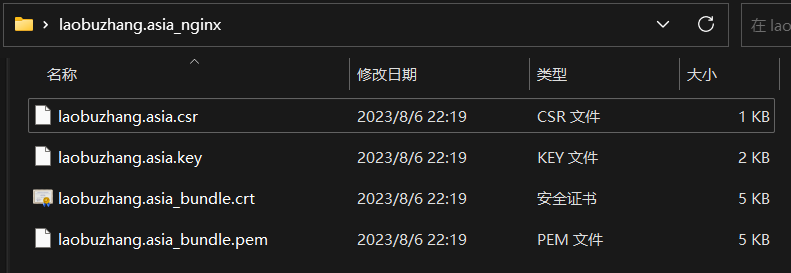

# 微信小程序后端开发

一般来说，我们将后端服务部署在服务器上后，就作为接口供前端使用（入门阶段）

这样前端使用`http`+`ip地址`请求访问接口

而微信小程序要求必须使用`https`+域名的请求（并且域名必须备案过），所以我们还需要进一步的操作

大致分为以下步骤：

1. 购买服务器
2. 服务器上部署接口
3. 购买域名和`DNS`服务
4. 申请`ssl`证书
5. 在服务器上部署`nginx`做反向代理
6. 域名备案

注意步骤6域名备案需要的时间比较长，所以尽早开始准备

我使用的都是腾讯的服务，所以服务器、域名、`ssl`证书都是在腾讯申请或者购买的

## 1.购买服务器

不再赘述

这里我的服务器地址是`101.43.170.185`

## 2.服务器上部署接口

`springboot`项目打包后部署在`docker`上

1. 将`Dockerfile`（文件夹中有示例）和`jar`包都放在服务器的同一个文件夹中

   ~~~dockerfile
   # 使用 Java 8 镜像作为基础镜像
   FROM openjdk:8-jre-slim
   # 在容器中创建一个目录来存放应用程序
   WORKDIR /docker/app/MCCM-server
   # 将本地的 JAR 文件复制到容器中
   COPY MCCM-server-0.0.1-SNAPSHOT.jar /docker/app/MCCM-server/MCCM-server-0.0.1-SNAPSHOT.jar
   # 指定容器启动时运行的命令
   CMD ["java", "-jar", "MCCM-server-0.0.1-SNAPSHOT.jar", "--spring.profiles.active=test"]
   ~~~

2. 执行命令，构建镜像（名称使用小写，docker不支持大写）

   ~~~bash
   docker build -f ./Dockerfile -t [镜像名称] .
   ~~~

3. 在服务器中创建需要挂载的文件夹

   - `/docker/app/mccm-server/file-system`
   - `/docker/app/mccm-server/logs`

4. 执行命令，创建并启动容器，开放8004端口

   ~~~bash
   docker run -id -p 8004:8004 \
   -v /docker/app/mccm-server/file-system:/docker/app/mccm-server/file-system \
   -v /docker/app/mccm-server/logs:/docker/app/mccm-server/logs \
   --name=[容器名称] \
   [镜像名称]
   ~~~

   ~~~bash
   docker run -id -p 8004:8004 \
   -v /docker/app/MCCM-server/file-system:/docker/app/MCCM-server/file-system \
   -v /docker/app/MCCM-server/logs:/docker/app/MCCM-server/logs \
   --name=mccm-server mccm-server
   ~~~

   

防火墙开放端口后，就可以使用`http://101.43.170.185:8004/api/..`访问到接口了

至此，如果对于加密等没什么要求，就可以作为后端服务器使用了

## 3.购买域名和DNS服务

若想要使用ssl进行加密成为https请求，则必须使用域名

因为：HTTPS 通常需要使用 SSL/TLS 证书，这些证书是与域名关联的。证书颁发机构 (CA) 需要验证你对域名的拥有权，以颁发证书。

（当然也可以自签发证书绑定ip地址，但是这种一般不受信任）

在腾讯的网站中购买域名并购买DNS服务，然后将域名和服务器地址绑定

[概览 - 域名注册 - 控制台 (tencent.com)](https://console.cloud.tencent.com/domain)

我购买了`laobuzhang.asia`这个域名

这样以后，访问``http://laobuzhang.asia:8004/api/..``就能访问到接口

## 4.申请ssl证书

在腾讯的网站中申请ssl证书

这一步需要用到上述购买的域名

[我的证书 - SSL 证书 - 控制台 (tencent.com)](https://console.cloud.tencent.com/ssl/dsc/apply)

然后把申请的ssl证书下载下来，下载nginx形式的证书

[我的证书 - SSL 证书 - 控制台 (tencent.com)](https://console.cloud.tencent.com/ssl)

会得到一个文件夹，包含证书的文件

然后将其中的`crt`和`key`文件放到服务器中

## 5.在服务器上部署nginx做反向代理

首先安装`nginx`

可以部署在docker（易于迁移）上，也可以直接装在服务器（更直观）上

我是直接装在服务器上，因为感觉docker中如果要增加监听的端口比较麻烦，还需要多一步配置端口映射

安装后修改`nginx`的配置文件`nginx.conf`

内容如下：

~~~bash
# For more information on configuration, see:
#   * Official English Documentation: http://nginx.org/en/docs/
#   * Official Russian Documentation: http://nginx.org/ru/docs/

user nginx;
worker_processes auto;
error_log /var/log/nginx/error.log;
pid /run/nginx.pid;

# Load dynamic modules. See /usr/share/doc/nginx/README.dynamic.
include /usr/share/nginx/modules/*.conf;

events {
    worker_connections 1024;
}

http {
    log_format  main  '$remote_addr - $remote_user [$time_local] "$request" '
                      '$status $body_bytes_sent "$http_referer" '
                      '"$http_user_agent" "$http_x_forwarded_for"';

    access_log  /var/log/nginx/access.log  main;

    sendfile            on;
    tcp_nopush          on;
    tcp_nodelay         on;
    keepalive_timeout   65;
    types_hash_max_size 4096;

    include             /etc/nginx/mime.types;
    default_type        application/octet-stream;

    # Load modular configuration files from the /etc/nginx/conf.d directory.
    # See http://nginx.org/en/docs/ngx_core_module.html#include
    # for more information.
    include /etc/nginx/conf.d/*.conf;

    server {
        listen       80;
        listen       [::]:80;
        server_name  laobuzhang.asia;
        root         /usr/share/nginx/html;

        # Load configuration files for the default server block.
        include /etc/nginx/default.d/*.conf;

        error_page 404 /404.html;
        location = /404.html {
        }

        error_page 500 502 503 504 /50x.html;
        location = /50x.html {
        }
    }

    # Settings for a TLS enabled server.

    # mccm的后台管理系统
    server {
        listen       443 ssl;
        listen       [::]:443 ssl;
        server_name  laobuzhang.asia;

        ssl_certificate /etc/nginx/ssl/laobuzhang.asia_bundle.crt;
        ssl_certificate_key /etc/nginx/ssl/laobuzhang.asia.key;
        ssl_session_cache shared:SSL:1m;
        ssl_session_timeout  10m;
        ssl_ciphers HIGH:!aNULL:!MD5;
        ssl_prefer_server_ciphers on;

        # Load configuration files for the default server block.
        include /etc/nginx/default.d/*.conf;

        location ~ /mccm-admin/ {
            root /home/mccm-admin;
            index index.html;
        }
    }

    # mccm的后端接口
    server {
        listen 8014 ssl;
        server_name laobuzhang.asia;

        ssl_certificate /etc/nginx/ssl/laobuzhang.asia_bundle.crt;
        ssl_certificate_key /etc/nginx/ssl/laobuzhang.asia.key;

        location / {
            proxy_pass http://101.43.170.185:8004;
            proxy_set_header Host $host;
            proxy_set_header X-Real-IP $remote_addr;
            proxy_set_header X-Forwarded-For $proxy_add_x_forwarded_for;
            proxy_set_header X-Forwarded-Proto $scheme;
        }

        if ($scheme = http) {
            rewrite ^ https://$host$request_uri permanent;
        }
    }

}
~~~

> 其中80端口对应http请求的默认地址，即不加端口号对应80，443端酒对应https请求的默认地址，即不加端口号对应443。一般来说，前端页面或者是后台管理系统页面对应这两个端口
>
> 注意监听端口和接口端口不能一样，会冲突，这里就是8014端口代理8004端口，访问8014的请求都会转发到8004然后返回
>
> 没备案的域名，解析到国内服务器会被封80/443端口，不封其他端口（因此可以作为接口使用）
>
> 微信小程序的信任域名要求必须进行备案，所以写微信小程序的后端接口，即使不使用80/443端口，仍然需要备案

## 6.域名备案

在腾讯的网站申请备案

[我的备案 - 网站备案 - 控制台 (tencent.com)](https://console.cloud.tencent.com/beian/manage/material)

备案通过后，即可正常使用

# 关于备案我的理解

没有备案的域名会禁用80/443端口，但是其他接口可以使用

但是我们明明可以使用其他端口建站，所以这不是相当于没有禁止吗

按照我目前的理解是：

- 对于80/443这最常用的端口，国家监管严格，所以一定禁止，其他的端口确实可以建站，属于一般不查，但是查到了就会禁。
- 作为接口使用基本不会出现问题。建站虽然不太允许，但是和梯子类似，你自己使用，不传播的话，一般不会去管你。但是如果这个网站使用量很大就很有可能引起相关部门注意，进而直接把你的ip给封禁掉
  - 引用网友的话：需不需要备案？问就是需要，查就是关停。
  - 但是只要你没有特别显眼，就不会去查你
- 有的网友也说：腾讯云会在几分钟内阻断，阿里云不确定，其他的没试过。（这个我也不确定，因为我腾讯云搭建后台管理系统就没事）

综上所述：

- 只作为接口使用，可以不去备案，毕竟接口使用ip地址即可（微信小程序等除外，人家要求必须备案）
- 搭建网站，最好去备案