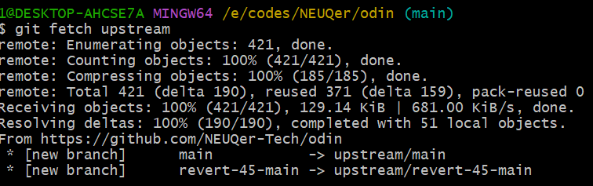
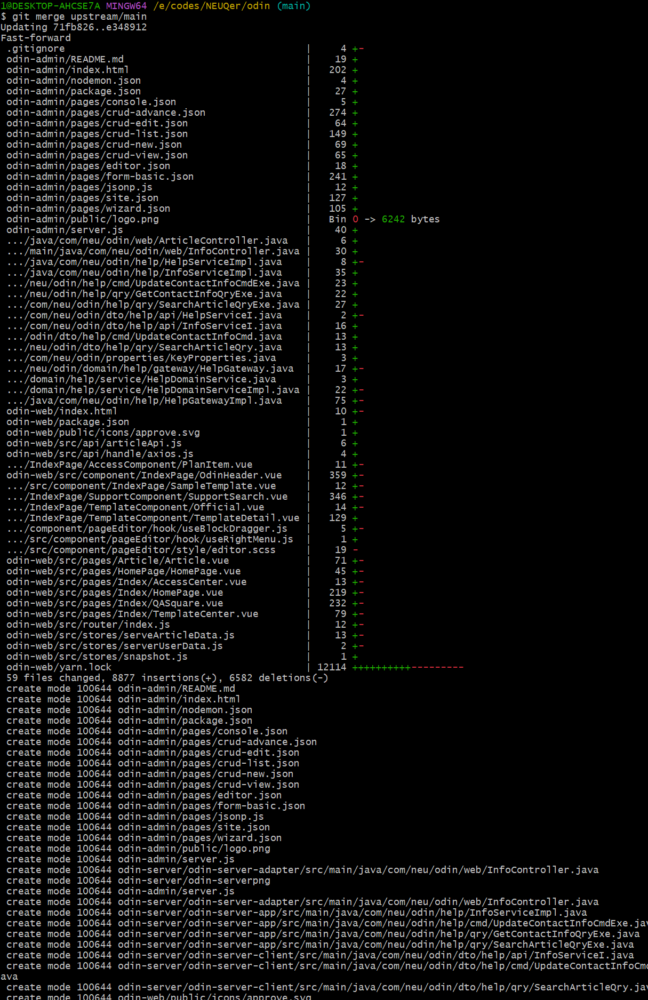
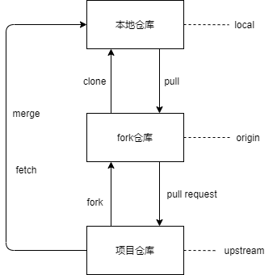

# Git学习笔记

## 1.版本控制工具

1. 本地版本控制

   适合个人使用，如RCS

2. 集中版本控制

   所有版本都放在服务器上，用户本地只有自己以前所同步的版本，必须联网，如SVN，CVS，VSS

3. 分布式版本控制

   每个用户都有所有的版本信息，每个人都有全部的代码，可不联网时也工作，没有中央服务器，一般有一个共享版本库，如Git

## 2.Git历史

Linux开源项目由众多参与者，维护繁琐，所以最开始与BitKeeper合作来管理和维护代码

社区中很多大佬研究破解BitKeeper

合作破裂，Linux创始人用两周左右开发了Git系统，替代BitKeeper

Linux和Git之父，李纳斯·托兹沃（Linus Benedic Torvalds）1969 芬兰

## 3.Git优点

- 速度
- 简单设计
- 对非线性开发的强力支持
- 完全分布式
- 有能力管理大规模项目

## 4.Git配置

### Git Bash

Unix与Linux风格的命令行，使用最多，推荐

### Git CMD

Windows风格的版本命令行

### Git GUI

图形化的Git

### Linux基本命令

1. cd：更改目录
2. cd ..：退回到上一个目录
3. pwd：显示当前路径
4. ls(ll)：列出目录所有文件，加上(ll)会列出更详细的信息
5. touch 文件名：新建一个文件
6. rm 文件名：删除文件
7. mkdir：新建文件夹
8. rm -r 文件夹名：删除文件夹
9. mv 文件名 文件夹名：移动文件到文件夹，需要在同一目录下
10.  reset ：清屏
11. clear：清屏
12. history：查看历史命令
13. help：帮助
14. exit：退出
15. #：注释

### Git环境配置

在git bash或者cmd中

~~~shell
git config -l
git config --system --list
git config --global --list

#查看git配置
~~~

~~~shell
git config --global user.name "用户名"
git config --global user.email 邮箱

#配置用户信息
~~~

### 配置指令别名

1. 打开用户目录，创建一个 .bashrc文件

   若无创建权限，在git bash里输入touch ~/.bashrc是一样的效果

   

2. 在.bashrc输入如下内容

   ~~~shell
   #用于输出git提交日志
   alias git-log='git log --pretty=oneline --all --graph --abbrev-commit'
   
   #用于输出当前目录所有文件及基本信息
   alias ll='ls -al'
   ~~~

3. 打开git Bash执行source ~/.bashrc

**Git配置文件存储地址：**

1. git\etc\gitconfig                                  --system的配置
2. C:\User\Administrator\.gitconfig      --global的配置

可以手动修改

## 5.Git基本理论

### Git组成

本地由三个工作区域：

1. 工作目录（Working Directory）
2. 暂存区（Stage/Index）
3. 资源库（Respository或Git Directory）

远程有一个工作区

- 远程git仓库（remote Directory）

- Workspace：工作区，平时存放项目代码的地方
- Index/Stage：暂存区，用于临时存放改动，就是一个文件，保存即将提交到文件列表的信息
- Repository：仓库区（本地仓库），就是安全存放数据的位置，这里由你提交的所有版本的数据。HEAD（位于.git文件夹内）指向最新放入仓库的版本
- Remote：远程仓库，托管代码的服务器

### Git工作流程

##  6.Git文件状态

git中的文件分有几种状态，需要通过几步操作最终提交文件到Git控制的版本中

## 7.Git文件提交流程

通过git add和git commit改变文件状态，并最终通过git push提交文件到远程仓库

1. git add  工作区->暂存区
2. git commit 暂存区->本地仓库
3. git psuh 本地仓库->远程仓库

## 8.Git远程仓库

使用代码托管服务

1. github
2. gitee
3. gitlab 需要自己搭建，但是更加安全

### 配置SSH公钥

不用每次都提交都输入账号密码

1. ~~~shell
   ssh-keygen -t rsa
   #生成公钥，若有则覆盖
   ~~~

2. ~~~shell
   cat ~/.ssh/id_rsa.pub
   #查看公钥
   ~~~

3. 在gitee或者github的设置中输入生成的公钥

## 9.Git相关命令

在想创建的位置打开git Bash或者cmd

### 1.创建工程

#### 1.1.在本地创建工程

~~~shell
git init
~~~

生成.git目录说明创建成功

#### 1.2.克隆工程

将工程文件夹复制到当前所在的本地文件夹

~~~shell
git clone 网址

# git clone http://119.3.199.81:8888/neuq202208/team05
~~~

### 2.分支

使用分支可以把工作从开发主线上分离开来进行重大的BUG修改，开发新功能，以免影响主线开发

#### 2.1.查看工程分支

- 查看本地分支

  ~~~shell
  git branch
  ~~~

- 查看远程仓库的所有分支

  ~~~shell
  git branch -a
  ~~~

  

#### 2.2.创建工程分支

- 创建并切换分支(创建后新分支并进入该分支)

  ~~~shell
  git checkout -b 分支名
  
  # git checkout -b laobuzhang
  ~~~

- 创建分支(创建后仍然停留在当前分支)

  ~~~shell
  git branch 分支名
  
  # git branch laobuzhang
  ~~~

#### 2.3.切换分支

- 切换到指定分支

  ~~~shell
  git checkout 分支名
  
  # git checkout laobuzhang
  ~~~

#### 2.4.查看对应的远端分支

~~~shell
git branch -vv
#查看当前分支对应远程的哪个分支
~~~

#### 2.5.合并分支

~~~shell
git merge 分支名称
#将指定的分支合并到当前分支
~~~

#### 2.6.解决冲突

若在两个分支中修改了相同的文件，并且对两个分支执行merge操作，则会产生冲突，此时需要手动解决冲突

执行merge后会报错，并且冲突的文件会被修改为下列样式

- 其中HEAD到====之间的是当前分支中该文件的内容

- ====到>>>dev之间表示dev分支中该文件的内容

此时**手动修改**成想要的内容（记得将git生成的那三行删掉），然后add+commit即可完成合并

在commit后会进入一个merge的信息界面，此时先esc，再输入:wq即可退出该界面

### 3.远程仓库

#### 3.1.和远程仓库建立连接

~~~shell
git remote add origin 远程仓库地址
#将本地git项目和远程仓库建立连接，并将远程仓库起名为origin
~~~

#### 3.2.检查远程仓库

~~~shell
git remote
~~~

### 4.提交文件

#### 4.1.获取远程仓库文件

1. ~~~shell
   git fetch [remote name] [branch name]
   
   #将远程的分支抓取到本地，并作为一个新分支保存再本地
   #若不指定参数，则抓取相连接的分支
   ~~~

2. ~~~shell
   git merge origin/master
   #将fetch下来的分支合并到本地分支
   ~~~

这两步操作可以合并为一步，拉取远程分支到本地

~~~shell
git pull
#git pull == git fetch && git merge
~~~

有冲突时，git pull会报错，需要使用merge手动合并，在idea中比较容易操作

#### 4.2.查看文件状态

- 查看当前是否有新加入的文件或者删除的文件

  ~~~shell
  git status
  ~~~

#### 4.3.提交文件

使用copy con或者直接在文件夹中新建新文件

使用git status查看当前未提交的文件

- 添加指定文件到缓存

  ~~~shell
  git add 文件名
  
  # git add 1.txt
  ~~~

- 添加所有文件到缓存区

  ~~~shell
  git add .\
  ~~~

- 将缓存区内容添加到本地仓库中

  ~~~shell
  git commit -m "日志信息(自己写)"
  
  # git commit -m "init commit"
  ~~~

- 推送到远程仓库

  ~~~shell
  git push [-f] [--set-upstream] [远程仓库名称[本地分支名][:远程仓库分支名]]
  
  #git push origin master:master
  #两个仓库名字一样可以省略
  #git push相当于是将当前分支推送的到远端对应连接的分支
  ~~~
  
  - -f 表示强制覆盖
  - --set-upstream 推送的同时建立和远端仓库的分支建立关联关系，若之前连接过一次，后边就不用再连接

#### 4.4.查看日志

- 查看提交记录的日志

~~~shell
git log --X

#--X处可省略或者填入不同参数
--all 显示所有分支
--pretty=oneline 将提交信息显示为一行
--abbrev-commit 使得输出的commitld更加简短
--graph 以图的形式显示

（配置指令别名后可用git-log，包含上边所有参数）
~~~

### 5.删除

#### 5.1.删除文件

使用del或者直接在文件夹中删除文件

使用git status查看当前未提交的文件

~~~shell
git commit -m 只是git add 之后⽂件在暂存区之后的提交，如果暂存区没有add，是没有效果的。

git commit -am 是之前 提交过到⼯作区的⽇志信息已经存在（git commit -m “⽇志信息” ⽂件名）已经
  执⾏过，再执⾏同样的⽇志信息可以不⽤add，⼀步到位  
~~~

- 提交删除

  ~~~shell
  git commit -am "日志信息(自己写)"
  
  # git commit -am "delete 3.txt"
  ~~~

- 推送到相应的分支

  ~~~shell
  git push origin 分支名
  ~~~

#### 5.2.删除分支

- 删除远程仓库的分支(分支名不带前边的remotes/origin)

  ~~~shell
  git push origin --delete 分支名
  
  # git push origin --delete laobuzhang
  ~~~

- 删除本地分支(不能删除当前所在的分支)

  ~~~shell
  git branch -D 分支名
  
  # git branch -D laobuzhang
  ~~~

### 6.版本回退

~~~shell
git reset --hard commitID

#commitID可以通过git-log查询
~~~

**查看已删除的记录**

回退版本后，当前版本之后的提交都无法在通过git-log查询，此时若想在回去，可以使用git reflog查询到那些后来版本的commitID

然后再次使用git reset回到那些版本

### 7.忽略文件

创建一个.gitignore文件，在里边输入需要忽略的文件

~~~shell
*.a
#忽略所有后缀名为a的文件
~~~

## 10.分支的使用原则与流程

- master （生产）分支

  线上分支，主分支，运行的项目对应的分支

- develop （开发）分支

  从master中拉取的分支，需要开发功能时，从develop分支拉取feature分支，再feature分支上修改，再合并到develop分支上

  开发完成后，将develop分支合并到master分支上

- feature分支

  从develop中拉取，用于开发

- hotfix分支

  从master中拉取，用于修改bug，修改完成后，同时合并到master和develop分支

## 11.Idea的Git

右上角的三个分别代表pull add+commit 和 push

左下边是分支查看，黄色标签代表当前所查看的分支

右边是各个版本，可以右键某一版本

1. copy revision nymber：复制版本编号，每个版本都有相应编号

2. create patch：创建补丁，方便一次修改多个分支

   [IDEA 使用补丁 patch，idea导入patch](https://blog.csdn.net/LitongZero/article/details/83012196)

3. chery pick：只拉取某些commit

   [idea中，git的cherry-pick](https://blog.csdn.net/qq_23167527/article/details/102595278)

4. check out ''：查看某一版本

5. conpare with local：与本地最新版本进行比较

## 12.Git问题总结

1.error: failed to push some refs to "远程仓库地址"

共有下面的错误原因：

1. 分支名不完整
2. 没有提交代码
3. 本地与远程产生冲突

解决方法：

[提交代码报错 error: failed to push some refs to](https://cloud.tencent.com/developer/article/1773434)

2.this exceeds GitHub's file size limit of 100.00 MB

上传文件超过100MB时会发生错误，在commit时不会出现问题，在push时会报错

此时需要将commit中的该文件给去掉

- 运行如下命令删除有关某个文件的push

~~~cmd
git filter-branch --force --index-filter "git rm --cached --ignore-unmatch 后端/MySQL/mysql-installer-community-8.0.31.0.msi"  --prune-empty --tag-name-filter cat -- --all
# 其中 后端/MySQL/mysql-installer-community-8.0.31.0.msi为超出大小的文件，其中 后端 目录和.git目录同级
~~~

然后再push即可

[解决this exceeds GitHub's file size limit of 100.00 MB](https://blog.csdn.net/lizy928/article/details/100047941)

## 13.github

[GitHub 通过修改HOSTS文件实现提速](https://blog.csdn.net/u013806366/article/details/120035993?ops_request_misc=%7B%22request%5Fid%22%3A%22167601020916800180693928%22%2C%22scm%22%3A%2220140713.130102334..%22%7D&request_id=167601020916800180693928&biz_id=0&utm_medium=distribute.pc_search_result.none-task-blog-2~all~sobaiduend~default-4-120035993-null-null.142^v73^control_1,201^v4^add_ask,239^v1^control&utm_term=github修改host&spm=1018.2226.3001.4187)

GitHub是全球最大Git仓库的托管平台，也就是说你的本地Git仓库可以同步到GitHub上，可以选择开源(publish)，也可以选择私有(private)。

这样，你和你的好朋友就可以共同对这个项目进行开发，更新，迭代。

---

> 首先注册GitHub

前往GitHub：https://github.com/

点击右上角sign up，完成注册。

然后点击sign in，进行登录。

---

> 配置GitHub

本地如何访问到远程仓库呢?

常用的方式有两种,一种是 ==https== 方式,每次pull或者push时都需要输入密码,另外一种是 ==ssh== 方式,只需要一次配置ssh 密钥对.

GitHub出于安全考虑，建议使用ssh来推送，且==在2021年8月13日github停止了对https用户名及验证码的支持==                   详情[点击](https://github.blog/2020-12-15-token-authentication-requirements-for-git-operations/)

我们最常用也是最方便的第二种 ssh 方式访问 github 

大致思路是本地**生成密钥对**,然后将公钥上传给 github 表明身份,之后本地再次推送给远程仓库时,github 自然就能识别到我们身份了.

1. **生成密钥对**

   先查看用户目录(~)下是否有`.ssh`目录：输入`ll -a | grep .ssh`，没有则输入`mkdir .ssh`进行创建

   然后进入`.ssh`目录：`cd .ssh`

   输入`ssh-keygen -t rsa -C "your email"`，这里的your email一定要写GitHub注册用的email。然后会有交互小程序，一路回车就行。

2. **复制公钥**

   之后就可以在`.ssh`目录下看到两个新的文件（输入`ll`或`ls`或`ls -l`或`dir`命令可以看到）

   输入`cat id_rsa.pub`，即可把id_rsa.pub里保存的公钥打印在屏幕上。(也可以用记事本打开)

   生成一对密钥对,包括**公钥**和**私钥**.其中公钥可以发送给任何人,而**私钥千万不可泄露**.

   选中ssh-rsa一直到@xx.com的所有内容，win10是`control + c`复制，Mac是`command + c`复制。

3. **设置GitHub**

   **把本地生成的ssh公钥输入到GitHub**中。

   点击右上角的Settings，然后点击SSH and GPG keys

   然后点击New SSH key

   Title 随便填，Key把刚刚复制的公钥粘贴进去，然后点击Add SSH key即可。

4. **验证 ssh**

   利用 ssh 协议测试一下是否能够正常访问 github 网站,如果出现成功提示,那就证明我们的配置没问题.

   输入`ssh git@github.com`命令

   再输入Yes即可

   `Are you sure you want to continue connecting (yes/no)? `yes

## 14.github周报收集

之前学习工程时的笔记，可以简单了解下使用github协作的过程

有时间再详细学习并更新

周报仓库地址：[https://github.com/NEUQ-ACM/NEUQ-ACM-Weekly-2020](https://github.com/NEUQ-ACM/NEUQ-ACM-Weekly-2020)

题解仓库地址：https://github.com/zeroacmer/NEUQ-ACM-Solution

1. 先star我们的总仓库

2. 再Fork我们的总仓库

3. 将Fork后的仓库（你的） clone到本地

   `git clone SSH key(Fork下来的个人仓库) `

4. `git remote -v ` 可以查看当前的绑定，默认origin为clone下来的远程个人仓库

5. 然后执行`git remote add upstream xxx`，绑定一个别名叫做upstream的仓库，也就是我们的总仓库。

6. 每次要写周报前都执行一次，保持**自己仓库跟总仓库**一致。

   `git pull upstream master`

7. 然后在你的目录下新建一个.md文件，写好周报内容后`git add file`(请勿修改别人的周报,否则可能不通过)

8. 然后`git commit -m 'xxx在几月几日交了周报'`

9. 再` git push origin master `，将本地仓库提交到远程仓库

10. 然后登录GitHub上，到**你的仓库**里，点击pull request (pr)，然后new一个pr

11. 最后等待审核(review)，通过后就会被合并进主分支。

> 注意区分远程总仓库，远程个人仓库，本地仓库。
>
> 不懂的地方优先百度或者看[文档](https://www.liaoxuefeng.com/wiki/896043488029600/900937935629664)       [文档](https://gitee.com/all-about-git)
>
> 实在难以确定可以咨询群主(技术部部长 黄一珂)

## 15.fork仓库同步

一般的协作方式和步骤14中类似

1. 将项目仓库fork一个自己的仓库
2. 将fork的仓库clone到本地
3. 本地修改文件
4. 提交到fork仓库
5. fork仓库申请pull request提交到项目仓库

但是github不会将项目仓库中的修改同步到fork仓库

这就需要我们自己进行同步

### 1.设置上游仓库

先进入本地仓库，执行命令查看远程仓库情况

~~~bash
$ git remote -v
~~~

结果:

~~~bash
origin  https://github.com/LaoBuZhang/odin (fetch)
origin  https://github.com/LaoBuZhang/odin (push)
~~~

如果只有上面2行，说明你未设置 `upstream` （中文叫：上游代码库）。一般情况下，设置好一次 `upstream` 后就无需重复设置。

执行命令设置上游仓库，将项目仓库设置为fork仓库的上游仓库

~~~bash
git remote add upstream https://github.com/NEUQer-Tech/odin
~~~

执行 `git remote -v` 查看是否成功

出现upstream即成功

~~~bash
origin  https://github.com/LaoBuZhang/odin (fetch)
origin  https://github.com/LaoBuZhang/odin (push)
upstream        https://github.com/NEUQer-Tech/odin (fetch)
upstream        https://github.com/NEUQer-Tech/odin (push)
~~~

### 2.提交本地修改

执行add，commit和push命令先将本地的修改推送到fork仓库

### 3.同步项目仓库的修改

执行`git fetch upstream`抓取原仓库的更新

执行`git checkout main`切换到本地使用的分支（这里是main，更多的时候用master，看具体的项目）

执行`git merge upstream/main`将项目仓库的修改合并到本地仓库

执行`git push`命令将本地仓库推送到fork仓库

至此就完成了fork仓库的更新以及本地修改的提交

然后fork仓库再提交pull request即可

### 4.仓库结构

最终形成的结构如下

## 16.解决 unable to get local issuer certificate 问题

~~~bash
git config --global http.sslVerify false
~~~

直接去掉git的ssl验证

~~~bash
git config --global http.sslVerify true
~~~

恢复git的ssl验证

## 17.为git设置代理

使用clash代理可以通过浏览器访问github

但是默认情况下clash无法代理git bash

这一部分就是为git bash设置clash代理

针对 Git 使用 HTTP / HTTPS 传输协议的代理方法如下：

- 针对所有域名的仓库

  ~~~bash
  git config --global http.proxy <protocol>://<host>:<port>
  ~~~

  命令注解

  - `--glboal` 选项指的是修改 Git 的全局配置文件 `~/.gitconfig`（而非各个 Git 仓库里的配置文件 `.git/config`）。
  - `<protocol>` 指的是代理协议，如 http，https，socks5 等。
  - `<host>` 为代理主机，如使用本地代理主机 127.0.0.1 或 localhost 等。
  - `<port>` 则为代理端口号，如 clash 使用的 7890 或 7891 等。
  - 常见误用：`git config --global https.proxy <protocol>://<host>:<port>`，这一写法完全是错误的。请记住: Git 代理配置项正确写法为 `http.proxy`，并不支持`https.proxy` 这一错误写法。
  - 如果想了解`<url>` 的更多模式，如子域名等的情况，可参照[Git 的官方文档](https://git-scm.com/docs/git-config#Documentation/git-config.txt-httplturlgt) 。

- 针对特定域名的仓库

  ~~~bash
  git config --global http.<url>.proxy <protocol>://<host>:<port>
  ~~~

  命令注解

  - `--glboal` 选项指的是修改 Git 的全局配置文件 `~/.gitconfig`（而非各个 Git 仓库里的配置文件 `.git/config`）。
  - `<url>` 指的是你需要使用代理的远程仓库，该 `<url>` 支持 HTTP / HTTPS 传输协议的格式：
    - `<url>` 格式为 `http://example.com` 或 `https://example.com`
  - `<protocol>` 指的是**代理协议**，如 http，https，socks5 等。
  - `<host>` 为代理主机，如使用本地代理主机 127.0.0.1 或 localhost 等。
  - `<port>` 则为代理端口号，如 clash 使用的 7890 或 7891 等。
  - **常见误用**：针对 HTTPS 传输协议（即 `https://` 开头）的 `<url>` 代理，命令写成 “`git config --global` **`https`**`.https://github.com.proxy protocol://127.0.0.1:7890`” ，这一写法**完全是错的**。请记住：请记住: Git 代理配置项**正确写法**为 **`http`**`.<url>.proxy`，并不支持 **`https`**`.<url>.proxy` 这一**错误写法**。
  - 如果想了解 `<url>` 的更多模式，如子域名等的情况，可参照 [Git 的官方文档](https://git-scm.com/docs/git-config#Documentation/git-config.txt-httplturlgt) 。

实例：

7089是clash代理的端口

针对所有域名

~~~bash
git config --global http.proxy http://127.0.0.1:7890
~~~

针对特定域名的 Git 仓库

~~~bash
git config --global http.https://github.com.proxy http://127.0.0.1:7890
~~~

