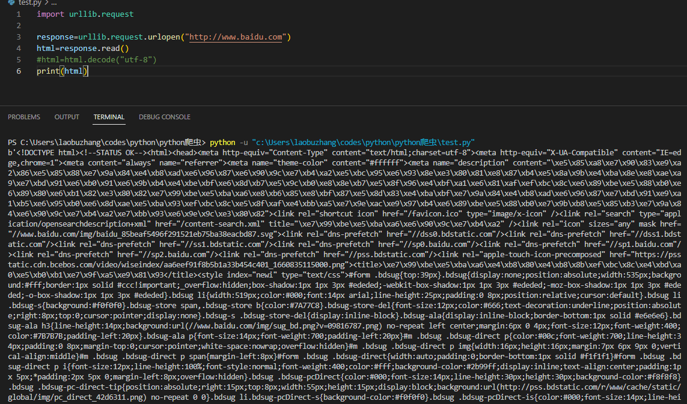
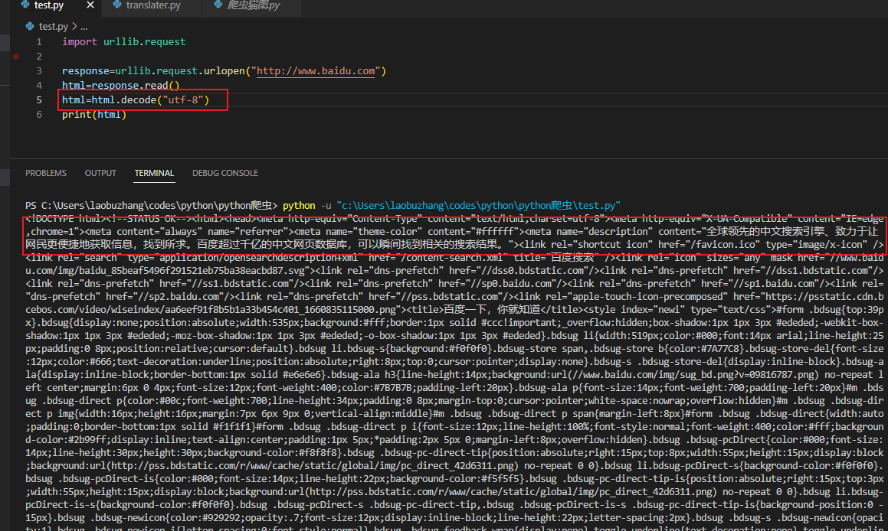
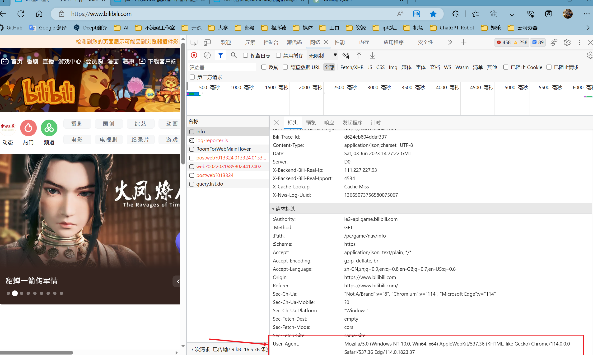
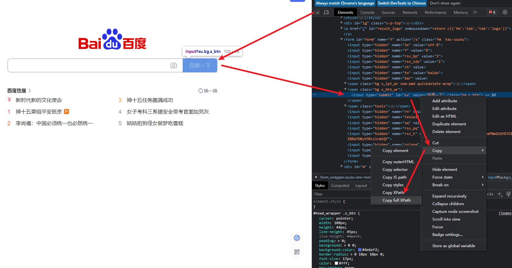

# 爬虫

## 爬虫的概念

爬虫（Crawler），也称为网络爬虫、网络蜘蛛或网络机器人，是一种自动化程序，用于在互联网上浏览和获取信息。它模拟人类用户在网络上浏览页面的行为，通过HTTP协议发送请求，获取网页内容并进行解析和提取所需的数据。

## 爬虫的优势

自动化，效率高

比如ODIN之中的模板，我们手动去搞得话，只能一个页面一个页面点进去下载，但是爬虫能够自动进行该过程，省时省力

## python爬虫

爬虫说白了就是在执行和浏览器相同的功能：访问互联网上的资源

所以基本上任何语言都能够编写爬虫

但是我们最常使用python进行爬虫的编写

Python在爬虫领域非常流行的原因有以下几点：

1. **简单易学**：Python语法简洁、易于理解，对于初学者来说，上手门槛相对较低。它提供了许多易于使用的库和框架，使得编写爬虫变得更加简单。
2. **丰富的第三方库**：Python拥有大量的第三方库，其中包括许多专门用于爬虫的库，如Requests、Beautiful Soup、Scrapy等。这些库提供了丰富的功能和工具，使得编写爬虫程序更加高效。
3. **高效的开发速度**：Python具有良好的开发效率，可以快速构建原型和进行迭代开发。Python的动态类型和自动内存管理减少了开发过程中的繁琐工作，使得开发者可以更专注于业务逻辑。
4. **社区支持和文档丰富**：Python拥有庞大的开发者社区，其中许多人专注于爬虫和数据抓取。这意味着您可以轻松找到相关的教程、示例代码和解决方案。Python的文档也非常全面，提供了丰富的资源供开发者学习和参考。
5. **跨平台性**：Python是一种跨平台的编程语言，可以在多个操作系统上运行。这使得爬虫程序在不同的环境中具有良好的可移植性和适应性。

从我自己来说，就是python写着简单，并且第三方库强大

所以除了爬虫，很多要实现得到小功能，都会首选python进行编写

**例子：**

比如要去某网站上得到一张猫猫的图片

这是python代码：

~~~python
import urllib.request

response = urllib.request.urlopen("http://placekitten.com/g/1920/1080")
cat_img=response.read()
with open('cat_1920_1080_5.jpg','wb') as f:
    f.write(cat_img)
~~~

这是java代码

~~~java
import java.io.FileOutputStream;
import java.io.IOException;
import java.io.InputStream;
import java.net.URL;
import java.net.HttpURLConnection;

public class SpiderExample {
    public static void main(String[] args) {
        String imageUrl = "http://placekitten.com/g/1920/1080";
        String savePath = "cat_1920_1080_5.jpg";

        try {
            URL url = new URL(imageUrl);
            HttpURLConnection connection = (HttpURLConnection) url.openConnection();
            connection.setRequestMethod("GET");

            InputStream inputStream = connection.getInputStream();
            byte[] buffer = new byte[1024];
            int bytesRead;
            FileOutputStream outputStream = new FileOutputStream(savePath);

            while ((bytesRead = inputStream.read(buffer)) != -1) {
                outputStream.write(buffer, 0, bytesRead);
            }

            outputStream.close();
            inputStream.close();

            System.out.println("Image downloaded successfully!");
        } catch (IOException e) {
            e.printStackTrace();
        }
    }
}
~~~

# 传统python爬虫

前边说过，爬虫的本质就是自动化通过HTTP协议发送请求（和postman中的get，post那种一样）

所以使用python编写爬虫，首先要了解如何使用python发送网络请求

==python的库==

python的库其实和Java的库是一样的

~~~python
import urllib.request

response = urllib.request.urlopen("http://placekitten.com/g/1920/1080")
cat_img=response.read()
with open('cat_1920_1080_5.jpg','wb') as f:
    f.write(cat_img)
~~~

这段代码中的`import urllib.request`其实就是导入`urllib`库中的`request`包

java中我们通常使用maven进行包管理

而python中使用的是pip，遇到程序报错找不到包是，我们只需要执行pip安装即可（也会安装到本地仓库，和maven类似）

例如，想要安装一个叫做selenium的包时，直接执行以下命令即可：

~~~powershell
pip install selenium
~~~

## 1.urllib库

`urllib`是python3中自带的库，无需安装即可使用

它一共包含四个模块：

~~~python
urllib.request
urllib.error
urllib.parse
urllib.robotparser
~~~

其中我们主要使用request进行爬虫的编写

以一个最简单的爬虫代码为例简单说明：

~~~python
import urllib.request

response = urllib.request.urlopen("http://placekitten.com/g/1920/1080")
cat_img=response.read()
with open('cat_1920_1080_5.jpg','wb') as f:
    f.write(cat_img)
~~~

可以看到，使用`request`包中的`urlopen`方法即可发送一个网络请求并得到返回的结果

本例中请求的是一张图片，我们可以直接将得到的二进制数据存储到.jpg文件中，这样就相当于将所请求的图片下载到本地了

### (1)发送请求：urlopen方法

`urlopen`方法返回的是一个`response`对象

因此，你可以从中得到如 HTTP状态码、响应头部、响应内容等信息。

而`read()`方法就是获得响应内容

- `geturl()`能得到请求的url
- `info()`能得到response的头部
- `getcode()`能得到HTTP状态码

如下面的爬虫程序就能获得到百度主页的html代码

~~~python
import urllib.request

response=urllib.request.urlopen("http://www.baidu.com")
html=response.read()
#html=html.decode("utf-8")
print(html)
~~~

#### decode解码

可以发现，得到的html中并不包含汉字，因为得到的结果是utf-8编码的bytes对象，即保存的都是二进制编码，要是想要得到原数据，可以使用decode进行解码

### (2)编辑请求内容：request对象

其实在`urlopen`中填写字符串类型的链接，先被转化成为request对象后才发送请求的

我们可以自己创建request对象，然后在发送请求，这样方便加入更多信息

~~~python
req=urllib.request.Request(url,data,header)
response=urllib.request.urlopen(req)
~~~

#### data

请求有多种不同的类型，GET类型不含数据，POST类型包含数据

因此创建request对象时

- 如果传入了data参数，则发送的时GET类型
- 如果不传入，则发送的时POST类型

以下为创建一个data的步骤

1. 使用python的字典将data的各个字段都添加进字典

   ~~~python
   data={}
   data['id']=123
   data['name']="zhangsan"
   ~~~

2. 将这个字段转化为`application/x-www-form-urlencoded`格式

   ~~~python
   data=urllib.parse.urlencode(data).encode('utf-8')
   ~~~

3. 将data添加进request对象

   ~~~python
   req=urllib.request.Request(url,data)
   ~~~

转化为`application/x-www-form-urlencoded`格式是因为`urllib.request`的默认头部中`Content-Type`为`application/x-www-form-urlencoded`

如果想发送`json`类型，可以修改头部`Content-Type`为`application/json`

#### header

在发送request时，可以附加头部信息

除了cookie可以用作账号登陆外，比较重要的一个是修改User-Agent

大多数服务器并不欢迎非人类的访问，因此会使用头部中的User-Agent字段识别访问者身份

直接使用python进行请求，User-Agent显示的是`Python-urllib/3.4`

而我们可以修改该字段，伪装成人类：

在任意网站中按F12即可查看当前浏览器使用的User-Agent，可以直接复制下来使用

除此以外还可以加上cookie信息直接登陆

~~~python
headers = {
    "user-agent": "Mozilla/5.0 (Windows NT 10.0; Win64; x64) AppleWebKit/537.36 (KHTML, like Gecko) Chrome/113.0.0.0 Safari/537.36 Edg/113.0.1774.57",
    "Cookie": "cookie_name=cookie_value"
}
req=urllib.request.Request(url,data,headers)
~~~

### (3)使用代理：避免ip封禁

当我们短时间内使用同一个ip多次请求一个网站时，ip可能会被封掉

为此我们可以使用代理来使用多个不同的ip进行访问

`urlopen`方法底层其实使用的是`openner`进行请求得到发送

而代理需要修改`openner`的`proxy_handler`属性

~~~python
import urllib.request

#为opener设置代理
ipList=["1.1.1.1","2.2.2.2","3.3.3.3"]
ip=random.choice(ipList)
proxy_handler = urllib.request.ProxyHandler({'http': ip})
opener = urllib.request.build_opener(proxy_handler)

#使用opener发送请求
url = "http://example.com"
req=urllib.request.Request(url,data,headers)
response = opener.open(req)

print(response.read().decode())

~~~

## 2.requests库

除了可以使用`urllib`库编写爬虫，还可以使用request库进行编写

`requests`库相比`urllib.request`库更加简洁且易于使用，但是它不是python自带的库，需要自己安装

~~~powershell
pip install requests
~~~

### (1)发送请求

requests库中不同类型的请求可以使用不同的方法：

~~~python
response = requests.get(url)
response = requests.post(url,data=data)
response = requests.put(url,data=data)
...
~~~

requests库得到的response会根据头部的信息自动解码

~~~python
import requests

url = "http://www.baidu.com"
response = requests.get(url)
html = response.text
print(html)
~~~

你会发现有时使用`requests.get(url)`和`urllib.request.urlopen(url)`得到的结果并不一样

这是因为两者使用的默认头部不同

- `requests`库会使用一个默认的用户代理(User-Agent)头部信息。具体来说，默认的用户代理头部信息是`python-requests/{version}`，其中`{version}`是`requests`库的版本号。

- `urlopen`函数会使用默认的用户代理(User-Agent)头部信息。具体来说，默认的用户代理头部信息是`Python-urllib/{version}`，其中`{version}`是Python版本号。

而服务器会根据不同的User-Agent返回不同的信息，比如requests库使用默认头部时不会返回script的内容，而`urlopen`函数使用默认头部时会返回script的内容

#### response

同样的可以获得返回信息的不同部分

~~~python
import requests

url = "http://www.baidu.com"
response = requests.get(url)

# 获取HTTP状态码
status_code = response.status_code
print("HTTP状态码:", status_code)

# 获取响应头部
headers = response.headers
print("响应头部:")
for header, value in headers.items():
    print(header + ": " + value)

# 获取响应信息str类型
html = response.text
print("响应信息1:")
print(html)

# 获取响应信息bytes类型(推荐使用，上边那个偶尔会乱码)
html = response.content
html=html.decode("utf-8")
print("响应信息2:")
print(html)
~~~

### (2)编写request

#### get

在requests库中不需要request对象，而是在使用get,post等方法时，传入参数

~~~python
url = "http://www.example.com"
headers = {
    "User-Agent": "Mozilla/5.0 (Windows NT 10.0; Win64; x64) AppleWebKit/537.36 (KHTML, like Gecko) Chrome/91.0.4472.124 Safari/537.36"
}
params = {
    "param1": "value1",
    "param2": "value2"
}

response = requests.get(url, headers=headers, params=params)
~~~

在使用get方法时，可以传入`params`参数，会自动转化为`url?param1=123&param2=456`的形式

除了headers，params，还有很多参数，比如cookies，auth等，这里就不多说

#### post

post方法可以传入data参数

该data可以为任何格式，requests会自动修改头部

传入`json`则会使用`json`格式，传入字典类型则会自动转换为`x-www-form-urlencoded`格式并使用该格式

~~~python
url = "http://www.example.com"
data = {
    "param1": "value1",
    "param2": "value2"
}
response = requests.posy(url, data=data)
~~~

~~~python
url = "http://www.example.com"
data = {
    "param1": "value1",
    "param2": "value2"
}
data=json.dump(data)
response = requests.posy(url, data=data)
~~~

### (3)代理

requests库中代理信息直接作为参数传入

~~~python
url = "http://www.example.com"
proxies = {
    'http': "1.1.1.1",
    'https': "2.2.2.2"
}
response = requests.posy(url, proxies=proxies)
~~~

# HTML解析

我们在上述得到的html都是byte类型或者str类型

我们想要从中寻找到想要的内容，就需要进行字符串处理，很麻烦

而将得到的html转换为html类型，然后通过标签名，id，class等信息进行查找效率就会高很多

这时我们需要使用到Beautiful Soup库

Beautiful Soup库的包名是bs4，因此需要先安装

~~~python
pip install bs4
~~~

使用时要导入该包的`BeautifulSoup`类

~~~python
from bs4 import BeautifulSoup
~~~

## 1.解析

将str类型的html转换成BeautifulSoup类型：

~~~python
html=response.read()
soup=BeautifulSoup(html,"html.parser")
~~~

这里使用了两个最常用的参数，第一个html是str类型的html，第二个参数是使用的解析器，例子中的这个可以解析html

## 2.查找

BeautifulSoup提供了很多进行查找的方法

最常用的是：`find_all`

这个方法可以找到所有满足要求的内容并且返回一个列表

~~~python
#找到所有tr标签
trs=soup.find_all('tr')
#使用text可以获取到标签内的文本
for tr in trs:
    print(tr.text)
    
#找到所有herf属性带有view的
views=soup.find_all(herf=re.compile("view"))
~~~

# 正则表达式

有时使用BeautifulSoup寻找所需要的部分可能比较麻烦：

- 需要一个标签一个标签定位，而且可能不同页面之间的标签名还不同
- 即使找到了标签，也可能需要从标签的文本中再次提取才能得到需要的信息

所以我们还可以使用正则表达式进行查找

**正则表达式就是一个模板字符串**，可以通过它来查找所有符合该模板的部分

例如：我想要查找所有的ipv4地址，那么我的模板字符串就是：

`(0~255的数字).(0~255的数字).(0~255的数字).(0~255的数字)`

而正则表达式就是制定了一系列符号来方便的编写模板字符串

上例中的`(0~255的数字)`就可以使用`[0-2][0-5][0-5]`来表示

当然这个写法并不完全正确

## python的正则表达式

python中通过re模块来实现正则表达式

主要使用两个方法：

~~~python
import re
re.search(r"buxiwan","buxiwangongzuoshi")
~~~

找到第一个匹配的位置：(0,6)

~~~python
import re
re.findall(r"i","buxiwangongzuoshi")
~~~

会返回一个列表，全都是i

## 通配符

`.`可以用来表示任何**单个**字符

## 反斜杠

对于特殊字符可以进行转义

对于普通字符可以赋予特殊含义（如\n）

## 字符类

`[]`只要单个字符在中括号表示的范围内，就能匹配上

~~~python
re.search(r"[aeiou]","buxiwangongzuoshi")
~~~

会得到`(3,4)`，即第一个`i`

可以在中括号内使用`-`表示范围

`[a-z]`表示a到z之间的所有小写字母都能匹配上

`[0-5]`表示0到5之间的所有数字都能匹配上

## 重复匹配

可以使用大括号来表示重复前边的字符

`ab{3}c`表示的是`abbbc`

大括号也可以使用范围

`ab{3,5}c`表示中间的b可以3个4个或者5个

## 分组

小括号可以用来表示分组

`a(bc){3}d`就表示`abcbcbcd`

## 特殊符号

正则表达式中特殊符号有很多：

`^`表示开始位置

`$`表示结束位置

`*`等价于`{0,}`

`+`等价于`{1,}`

`?`等价于`{0,1}`

`|`表示或者

...

上边只列出了比较常用的

[可以在这里看到所有的](https://www.runoob.com/regexp/regexp-syntax.html)

## 匹配ipv4

为什么说`[0-2][0-5][0-5].[0-2][0-5][0-5].[0-2][0-5][0-5].[0-2][0-5][0-5]`

来匹配ipv4并不完全正确呢

- 首先，ipv4的每一位可能不是3位数：`127.0.0.1`后边三个都只有一位
- 其次，当百位为2时，后两位才限制到5，否则是可以取到0-9的

127.0.0.1

正确的写法如下

`((\d|\d\d|1\d\d|2[0-4]\d|25[0-5])\.){3}(\d|\d\d|1\d\d|2[0-4]\d|25[0-5])`

~~~python
import re
re.search(r"((\d|\d\d|1\d\d|2[0-4]\d|25[0-5])\.){3}(\d|\d\d|1\d\d|2[0-4]\d|25[0-5])","asd127.0.0.1sadasd")
~~~

## 编译正则表达式

将正则表达式编译后就可以重复使用

~~~python
ipv4=re.compile("((\d|\d\d|1\d\d|2[0-4]\d|25[0-5])\.){3}(\d|\d\d|1\d\d|2[0-4]\d|25[0-5])")
ipv4.search("asd127.0.0.1sadasd")
~~~

# selenium

Selenium 是一个用于 Web 应用程序测试的工具。

Selenium 测试直接运行在浏览器中，就像真正的用户在操作一样。

在爬虫领域 selenium 同样是一把利器，能够解决大部分的网页的反爬问题。

使用selenium可以完成打开网页，标签定位，模拟鼠标点击，模拟滚轮，模拟键盘等操作

安装selenium：

~~~powershell
pip install selenium
~~~

因为使用selenium需要使用浏览器，所以我们需要安装需要使用的浏览器和相应的驱动

我的chrome版本是113.0.5672.129，就下载对应的驱动

- **Firefox** 浏览器驱动：[Firefox](https://github.com/mozilla/geckodriver/releases)
- **Chrome** 浏览器驱动：[Chrome](https://chromedriver.storage.googleapis.com/index.html)
- **IE** 浏览器驱动：[IE](http://selenium-release.storage.googleapis.com/index.html)
- **Edge** 浏览器驱动：[Edge](https://developer.microsoft.com/en-us/microsoft-edge/tools/webdriver/)
- **PhantomJS** 浏览器驱动：[PhantomJS](https://phantomjs.org/)
- **Opera** 浏览器驱动：[Opera](https://github.com/operasoftware/operachromiumdriver/releases)

下载下来的.exe文件就是驱动

## 打开页面

按照下面的步骤即可打开页面

~~~python
from selenium import webdriver

url = "http://www.baidu.com"

# 配置驱动
executable_path = 'chromedriver.exe' #填写驱动的路径
service = webdriver.chrome.service.Service(executable_path)
service.start()

# 使得页面不会自动关闭
option = webdriver.ChromeOptions()
option.add_experimental_option("detach", True)

# 打开页面
driver = webdriver.Chrome(service=service,options=option)
driver.get(url)
~~~

## 定位

可以通过id，name，class，tag，xpath等进行定位

这里使用xpath进行示范

首先在浏览器中可以看到**百度一下**这个按钮有一个value属性，我们定位到这个按钮并且输出这个属性

右键这个标签并复制full XPath，将其写入到代码中即可定位到

然后使用get_attribute方法即可得到value属性的值

~~~python
ans=driver.find_element(By.XPATH,'/html/body/div[1]/div[1]/div[5]/div/div/form/span[2]/input')
print(ans.get_attribute("value"))
~~~

## 鼠标点击

上例中定位到按钮后，还可以实现点击该按钮的操作

~~~python
button = driver.find_element(By.XPATH,'/html/body/div[1]/div[1]/div[5]/div/div/form/span[2]/input')
# 执行单击操作
button.click()
~~~

还有右键，双击等很多操作，这里不再赘述

## 例子

PTA气球打印

ODIN模板爬取

## 总结

selenium还有很多能够完成的操作，比如执行javascript代码，截图，下载文件等，感兴趣可以自行学习

[ selenium用法详解【从入门到实战】【Python爬虫】【4万字】_Dream丶Killer的博客-CSDN博客](https://blog.csdn.net/qq_43965708/article/details/120658713?ops_request_misc=%7B%22request%5Fid%22%3A%22167940039316800225535802%22%2C%22scm%22%3A%2220140713.130102334..%22%7D&request_id=167940039316800225535802&biz_id=0&utm_medium=distribute.pc_search_result.none-task-blog-2~all~top_positive~default-1-120658713-null-null.142^v75^insert_down2,201^v4^add_ask,239^v2^insert_chatgpt&utm_term=selenium&spm=1018.2226.3001.4187)

[selenium + python 中文手册_w3cschool](https://www.w3cschool.cn/selenium2/)

很多爬虫的操作都可以通过selenium完成，但是可以发现因为他要打开浏览器，所以速度上较慢

但是它比较直观，编写代码时方便根据页面进行编写，同时还能越过很多反爬虫机制

# scrapy

scrapy是一个为了爬取网站数据、提取结构性数据而编写的应用框架

但是基本上和都和上边讲的内容原理一致，所以这里就不多赘述

想要深入学习的可以自行搜索

[Scrapy | A Fast and Powerful Scraping and Web Crawling Framework](https://scrapy.org/)

[Scrapy 入门教程 | 菜鸟教程 (runoob.com)](https://www.runoob.com/w3cnote/scrapy-detail.html)

