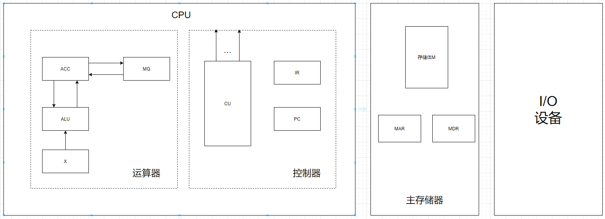

# 计算机组成原理

## 1 计算机系统概述

## 1.2 计算机系统层次结构

### 1.2.1 计算机系统的组成

硬件系统和软件系统共同构成完成的计算机系统

对于某一功能，既可以使用软件实现，又可以使用硬件实现，称为软硬件在逻辑上是等效的

### 1.2.2 计算机硬件

#### 1 冯诺依曼机

1. 采用存储程序的工作方式
2. 硬件系统由：运算器，存储器，控制器，输入设备，输出设备5部分组成
3. 指令和数据以同等地位存储在存储器中，CPU通过指令周期的不同阶段区分它们
4. 指令和数据都是用二进制码表示。指令由操作码和地址码组成

存储程序基本思想：

- 将事先编制好的程序和原始数据送入主存后才能执行，一旦程序启动执行，计算机会自动逐条执行，直至程序执行结束

#### 2 计算机的功能部件

1. 输入设备
2. 输出设备
3. 存储器
   - 分为主存储器和辅助存储器
   - 包括MAR（地址寄存器）和MDR（数据寄存器）
4. 运算器
   - 执行算术运算和逻辑运算
   - 包括：ALU（算数逻辑单元）
   - 若干寄存器：**ACC（累加器），MQ（乘商寄存器），X（操作数寄存器）**，IX（变址寄存器），BR（基址寄存器）
5. 控制器
   - PC（程序计数器）
   - IR（指令寄存器）
   - CU（控制单元）

主机框图如下：

- PC存储当前要执行指令的地址，每次执行往后可跳转到下一条指令的地址，主要来自MAR
- IR存储当前指令的内容，主要来自MDR
- CU分析指令并发出各种微操作命令序列，IR中指令的操作码会送到CU

