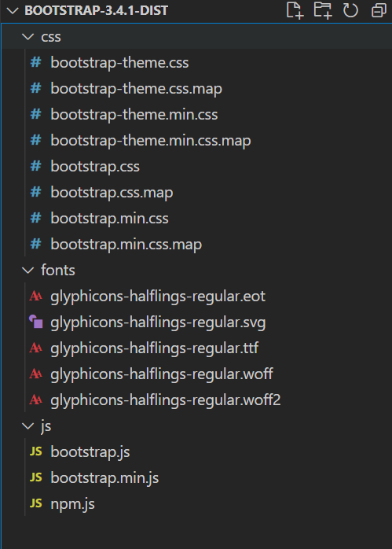
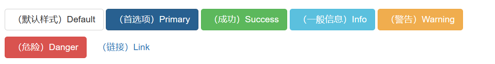
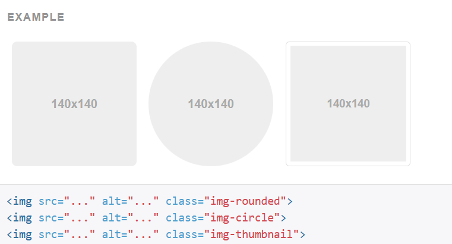
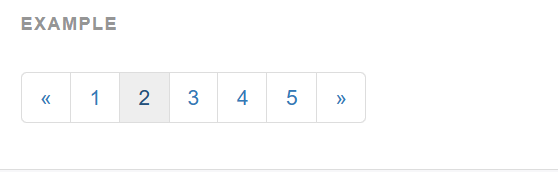
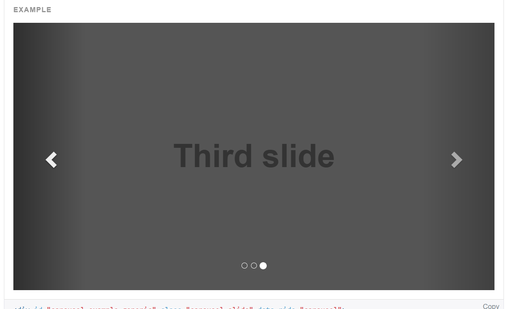

# Bootstrap

## 概念

Bootstrap是一个前端开发的框架，Bootstrap，来自 Twitter，是目前很受欢迎的前端框架。

Bootstrap 是基于 HTML、CSS、JavaScript 的，它简洁灵活，使得 Web 开发更加快捷。

**框架**

一个半成品软件，开发人员可以在框架基础上，在进行开发，简化编码。

**好处**

1. 定义了很多的css样式和js插件。我们开发人员直接可以使用这些样式和插件得到丰富的页面效果。
2. 响应式布局。
   * 同一套页面可以兼容不同分辨率的设备。
   * 自适应布局：一套布局，自动适配不同屏幕。
     响应式布局：根据不同设备或屏幕大小，定义不同的布局。
   * 上述两者并不相同，Bootstrap支持的是响应式布局

**使用**

基本都是改变标签的class属性，来获得对应的样式

**学习网站**

[Bootstrap中文网 (bootcss.com)](https://www.bootcss.com/)

在该网站上可以看到Bootstrap代码对应的样式

很多代码懒得打直接上官方文档复制就行

## 准备

### 1.下载Bootstrap

[起步 · Bootstrap v3 中文文档 | Bootstrap 中文网 (bootcss.com)](https://v3.bootcss.com/getting-started/#download)

下载用于生产环境的Bootstrap

### 2.Boostrap构成

下载的文件解压后，，是这样的结构

其实也是写好的js，css也页面

其中后缀.min的文件和不带后缀的文件内容是一样的，引用哪个都可以

区别：带.min的文件中所有的代码都缩成一行，体积较小，适合传输，一般引用这个文件。不带.min的文件正常缩进，适合我们进行阅读

### 3.引入资源

在官网上可以看到示范的你好世界代码

~~~html
<!doctype html>
<html lang="zh-CN">
  <head>
    <meta charset="utf-8">
    <meta http-equiv="X-UA-Compatible" content="IE=edge">
    <meta name="viewport" content="width=device-width, initial-scale=1">
    <!-- 上述3个meta标签*必须*放在最前面，任何其他内容都*必须*跟随其后！ -->
    <title>Bootstrap 101 Template</title>

    <!-- Bootstrap -->
    <link rel="stylesheet" href="https://stackpath.bootstrapcdn.com/bootstrap/3.4.1/css/bootstrap.min.css" integrity="sha384-HSMxcRTRxnN+Bdg0JdbxYKrThecOKuH5zCYotlSAcp1+c8xmyTe9GYg1l9a69psu" crossorigin="anonymous">

    <!-- HTML5 shim 和 Respond.js 是为了让 IE8 支持 HTML5 元素和媒体查询（media queries）功能 -->
    <!-- 警告：通过 file:// 协议（就是直接将 html 页面拖拽到浏览器中）访问页面时 Respond.js 不起作用 -->
    <!--[if lt IE 9]>
      
      
    <![endif]-->
  </head>
  <body>
    <h1>你好，世界！</h1>

    <!-- jQuery (Bootstrap 的所有 JavaScript 插件都依赖 jQuery，所以必须放在前边) -->
    
    <!-- 加载 Bootstrap 的所有 JavaScript 插件。你也可以根据需要只加载单个插件。 -->
    
  </body>
</html>
~~~

这中间引用的资源都是布局在远程服务器上的资源，我们只需要将这些路径都改为方才下载的Bootstrap文件即可

1. 一般将Boostarap中的三个文件夹复制到项目中和html同级的目录
2. 修改css和js文件的引用路径
3. jquery的引用路径可以先注释掉

~~~html
<!doctype html>
<html lang="zh-CN">
  <head>
    <meta charset="utf-8">
    <meta http-equiv="X-UA-Compatible" content="IE=edge">
    <meta name="viewport" content="width=device-width, initial-scale=1">
    <!-- 上述3个meta标签*必须*放在最前面，任何其他内容都*必须*跟随其后！ -->
    <title>Bootstrap HelloWorld</title>

    <!-- Bootstrap -->
    <link rel="stylesheet" href="css/bootstrap.min.css" integrity="sha384-HSMxcRTRxnN+Bdg0JdbxYKrThecOKuH5zCYotlSAcp1+c8xmyTe9GYg1l9a69psu" crossorigin="anonymous">

    <!-- jQuery (Bootstrap 的所有 JavaScript 插件都依赖 jQuery，所以必须放在前边) -->
    <!--  -->
    <!-- 加载 Bootstrap 的所有 JavaScript 插件。你也可以根据需要只加载单个插件。 -->
    
    
    <!-- HTML5 shim 和 Respond.js 是为了让 IE8 支持 HTML5 元素和媒体查询（media queries）功能 -->
    <!-- 警告：通过 file:// 协议（就是直接将 html 页面拖拽到浏览器中）访问页面时 Respond.js 不起作用 -->
    <!--[if lt IE 9]>   
      
      
    <![endif]-->

  </head>
  <body>
    <h1>你好，世界！</h1>

  </body>
</html>
~~~

这个代码可以作为Bootstrap的模板代码

## 响应式布局

同一套页面可以兼容不同分辨率的设备。

实现：依赖于栅格系统：将一行平均分成12个格子，可以指定元素占几个格子

**步骤：**

设置的都是标签的class属性

1. 定义容器。相当于之前的table
	* 容器分类：
		1. container：固定宽度，两边可能会有留白
		2. container-fluid：每一种设备都是100%宽度
2. 定义行。相当于之前的tr   样式：row
3. 定义元素。指定该元素在不同的设备上，所占的格子数目。样式：col-设备代号-格子数目
	* 设备代号：
		1. xs：超小屏幕 手机 (<768px)：col-xs-12
		2. sm：小屏幕 平板 (≥768px)
		3. md：中等屏幕 桌面显示器 (≥992px)
		4. lg：大屏幕 大桌面显示器 (≥1200px)

~~~html
<!DOCTYPE html>
<html lang="zh-CN">
<head>
    <meta charset="utf-8">
    <meta http-equiv="X-UA-Compatible" content="IE=edge">
    <meta name="viewport" content="width=device-width, initial-scale=1">
    <!-- 上述3个meta标签*必须*放在最前面，任何其他内容都*必须*跟随其后！ -->
    <title>Bootstrap HelloWorld</title>

    <!-- Bootstrap -->
    <link href="css/bootstrap.min.css" rel="stylesheet">

    <!-- jQuery (Bootstrap 的所有 JavaScript 插件都依赖 jQuery，所以必须放在前边) -->
    
    <!-- 加载 Bootstrap 的所有 JavaScript 插件。你也可以根据需要只加载单个插件。 -->
    
    
</head>
<body>
    <!--1.定义容器-->
    

        <!--2.定义行-->
        

            <!--3.定义元素
                在大显示器一行12个格子
                在pad上一行6个格子
            -->
            <!--
栅格

            
栅格

            
栅格

            
栅格

            
栅格

            
栅格

            
栅格

            
栅格

            
栅格

            
栅格

            
栅格

            
栅格
-->
            
栅格

            
栅格

            
栅格

        

    

</body>
</html>
~~~

注意：
1. 一行中如果格子数目超过12，则超出部分自动换行。
2. 栅格类属性可以向上兼容。栅格类适用于与屏幕宽度大于或等于分界点大小的设备。
3. 如果真实设备宽度小于了设置栅格类属性的设备代码的最小值，会一个元素沾满一整行。

## 全局CSS样式

### 按钮

设置class属性，基本上所有标签都能变成按钮

btn btn-default   是最基础的白色按钮，除此以外还有很多种不同样式

对应如下图所示

~~~html
<a class="btn btn-default" href="#" >Link</a>
<button class="btn btn-default" type="submit">Button</button>
<input class="btn btn-default"  type="button" value="Input">
<input class="btn btn-default" type="submit" value="Submit">

 

<!-- Provides extra visual weight and identifies the primary action in a set of buttons -->
<button type="button" class="btn btn-primary">（首选项）Primary</button>

<!-- Indicates a successful or positive action -->
<button type="button" class="btn btn-success">（成功）Success</button>

<!-- Contextual button for informational alert messages -->
<button type="button" class="btn btn-info">（一般信息）Info</button>

<!-- Indicates caution should be taken with this action -->
<button type="button" class="btn btn-warning">（警告）Warning</button>

<!-- Indicates a dangerous or potentially negative action -->
<button type="button" class="btn btn-danger">（危险）Danger</button>

<!-- Deemphasize a button by making it look like a link while maintaining button behavior -->
<button type="button" class="btn btn-link">（链接）Link</button>
~~~

### 图片

主要对应img标签

**响应式图片**

`class="img-responsive"`图片在任意尺寸都占100%，即会随页面缩放

**图片形状**

~~~html
：方形
 ： 圆形
 ：相框
~~~

**混搭**

占比和形状可以写在一起，同时拥有两种属性

~~~html

~~~

### 表格

主要对应table标签

**水平分割线**

~~~html
<table class="table">
  ...
</table>
~~~

**边框**

~~~html
<table class="table table-bordered">
  ...
</table>
~~~

**鼠标悬停**

~~~html
<table class="table table-hover">
  ...
</table>
~~~

**组合**

~~~html
<table class="table table-bordered table-hover">
  ...
</table>
~~~

### 表单

主要是form标签中的一些内容

[官网表单部分](https://v3.bootcss.com/css/?#forms)

## 组件

### 导航条

页面上部的条

[官网导航条部分](https://v3.bootcss.com/components/#navbar)

### 分页条

选页的条

[官网导分页部分](https://v3.bootcss.com/components/#pagination)

## 插件

### 轮播图

对应英文名为Carousel

[轮播图](https://v3.bootcss.com/javascript/#carousel)

还有很多样式就不再赘述，需要使用就去官网cv即可