## 前言

HTML5内容不多，相对来说还是比较简单学习的
学习笔记全部蕴含在代码中，使用编辑器为VSCode


## 基本操作

**在VSCode中的快捷键：**
crtl+/  生成注释标签
h1+Tab  快速生成h1标签
!+回车    生成HTML基本代码
**注意：**
有些文件无法在这里展示，所以展示一下文件层级


## 基本标签

```html
<!DOCTYPE html>
<html lang="en">
<head>
    <meta charset="UTF-8">
    <title>基本标签学习</title>
</head>
<body>

<!-- 标题标签 -->
<h1>一级标签</h1>
<h2>二级标签</h2>
<h3>三级标签</h3>
<h4>四级标签</h4>
<h5>五级标签</h5>
<h6>六级标签</h6>

<!-- 段落标签 -->
<p>两只老虎爱跳舞</p>
<p>小兔子乖乖拔萝卜</p>
<p>我光着脚丫子学走路</p>
<p>童年是最美好的礼物</p>

<!-- 水平线标签 -->
<hr/>

<!-- 换行标签 -->
两只老虎爱跳舞<br/>
小兔子乖乖拔萝卜<br/>
我光着脚丫子学走路<br/>
童年是最美好的礼物<br/>

<!-- 粗体，斜体 -->
<h1>字体样式标签</h1>
粗体: <strong>I Love You</strong><br/>
斜体: <em>I Love You</em><br/>

<!-- 注释标签 -->
注释快捷键:ctrl+/

<br/>
<!-- 特殊符号 -->
空格:1&nbsp;&nbsp;&nbsp;&nbsp;&nbsp;2
<br>
大于号:&gt;
<br>
小于号:&lt;
<br>
版权符号:&copy;laobuzhang666

<!-- 
    记忆符号
        打出&和字母自动查找
        百度
-->

</body>
</html>
```

效果：

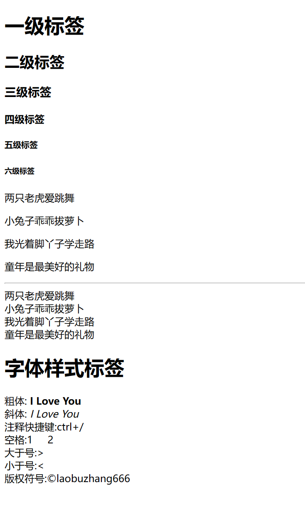

## 链接标签

```html
<!DOCTYPE html>
<html lang="en">
<head>
    <meta charset="UTF-8">
    <title>链接标签学习</title>
</head>
<body>
    <a href="#down">回到底部</a>
    <a name="top"></a>
<!-- 
    超链接标签
    herf:必填，表示要跳转的页面标签
    target:表示窗口在哪里打开
        _blank   在新标签打开
        _self    在自己的网页中打开（默认）
 -->
    <a href="test.html" target="_blank">点我跳转到test</a>
    <a href="https://www.baidu.com" target="_self">点我跳转到百度</a>
    <br>
<p>
    <a href="https://www.baidu.com">
        
    </a>
</p>
    <a href="https://www.baidu.com">
        
    </a>
    <a href="https://www.baidu.com">
        
    </a>


    <!-- 锚链接
        1.需要一个锚标记,使用name作为标记
        2.跳转到标记
        3.#+name跳转
    -->
    
    <a href="#top">回到顶部</a>
    <a name="down"></a>

    <a href="3.图像标签.HTML#top">回到图像标签顶部</a>


    <!-- 功能性链接
        邮件链接：mailto:
        QQ链接：搜索QQ推广->推广工具->选择组件样式和提示语->复制生成的代码
    -->
    <a href="mailto:18837409040@163.com">点击联系我</a>
    <a target="_blank" href="http://wpa.qq.com/msgrd?v=3&uin=&site=qq&menu=yes"></a>
</body>
</html>
```

效果

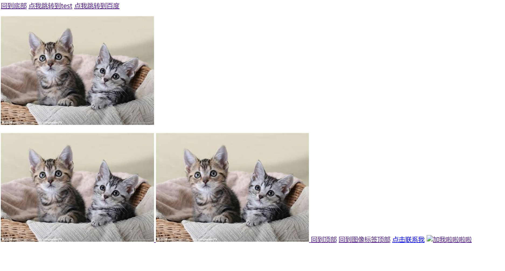

## 图像标签

图片无法加载时用alt来替代展示

```html
<!DOCTYPE html>
<html lang="en">
<head>
    <meta charset="UTF-8">
    <title>图像标签学习</title>
</head>
<body>
<!-- 
    img学习
    src:图片地址（必填）相对地址，绝对地址
    alt:图片名字（必填）
    title:悬停文字
    width，height:宽，高
    ../  当前文件的上一级目录
    
 -->
    
    
    
    
    <a href="2.链接标签.HTML#down">回到</a>
</body>
</html>
```

效果

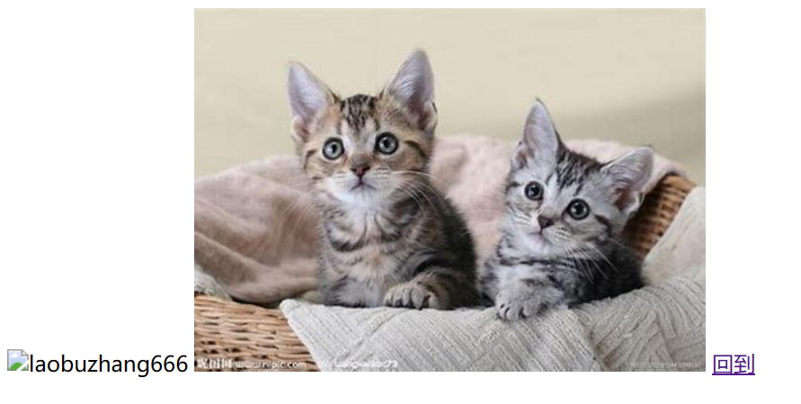

## 页面结构

```html
<!DOCTYPE html>
<html lang="en">
<head>
    <meta charset="UTF-8">
    <title>页面结构分析</title>
</head>
<body>
    <header>
        <h2>网页头部</h2>
    </header>

    <section>
        <h2>网页主体</h2>
    </section>

    <article>这是一篇小短文</article>

    <aside>侧边栏</aside>

    <nav>123</nav>

    <footer>
        <h2>网页脚部</h2>
    </footer>

</body>
</html>
```


效果

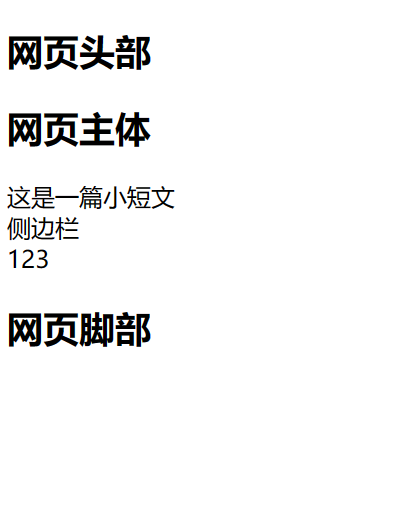


## 列表标签

```html
<!DOCTYPE html>
<html lang="en">
<head>
    <meta charset="UTF-8">
    <title>列表学习</title>
</head>
<body>
    <!-- 有序列表ol
        前边是编号
    -->
    <ol>
        <li>Java</li>
        <li>Python</li>
        <li>C/C++</li>
    </ol>


    <hr>
    <!-- 无序列表ul
        前边是点
    -->
    <ul>
        <li>Java</li>
        <li>Python</li>
        <li>C/C++</li>
    </ul>


    <hr>
    <!-- 自定义列表dl
        dt 列表名称
        dd 列表内容
    -->
    <dl>
        <dt>学科</dt>

        <dd>Java</dd>
        <dd>Python</dd>

        <dt>位置</dt>

        <dd>许昌</dd>
        <dd>秦皇岛</dd>
    </dl>

</body>
</html>
```

效果

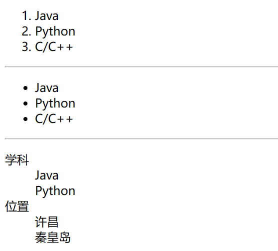


## 表格标签

```html
<!DOCTYPE html>
<html lang="en">
<head>
    <meta charset="UTF-8">
    <title>表格学习</title>
</head>
<body>
    <!-- 表格table
    行 tr
    列 td
    border 表格边框宽度
    -->

    <table border="1px">
        <tr>
            <!-- colspan 跨列 -->
            <td colspan="2">1</td>
            <td>2</td>
        </tr>
        <tr>
            <!-- rowspan 跨行 -->
            <td rowspan="3">3</td>
            <td>4</td>
        </tr>
        <tr>
            <td>5</td>
            <td>6</td>
        </tr>
    </table>

    <table border="1px">
        <tr>
            <!-- style="text-align:center" 使文字居中 -->
            <td colspan="3" style="text-align:center">英语四级成绩</td>
        </tr>
        <tr>
            <td rowspan="2">老部长</td>
            <td>阅读</td>
            <td>100</td>
        </tr>
        <tr>
            <td>听力</td>
            <td>100</td>
        </tr>
        <tr>
            <td rowspan="2">寒冰战士</td>
            <td>阅读</td>
            <td>50</td>
        </tr>
        <tr>
            <td>听力</td>
            <td>60</td>
        </tr>
    </table>
</body>

</html>
```

效果

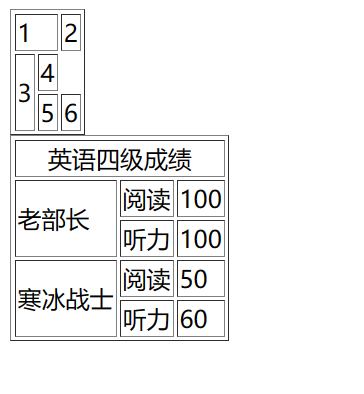


## 媒体元素

```html
<!DOCTYPE html>
<html lang="en">
<head>
    <meta charset="UTF-8">
    <title>媒体元素学习</title>
</head>
<body>
    <!-- 
        video和audio
        src:资源路径
        controls:控制条
        autoplay:自动播放（有的浏览器用这个无效）
     -->
    <video src="../resource/video/新猫和老鼠.mp4" controls autoplay></video>

    <audio src="../resource/audio/Believer.flac" controls autoplay></audio>
</body>
</html>
```

效果

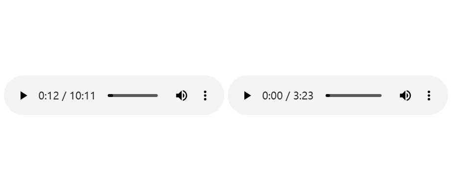

视频没有画面是因为格式和编码方式的问题，浏览器可能不支持这个格式


## 内联框架

```html
<!DOCTYPE html>
<html lang="en">
<head>
    <meta charset="UTF-8">
    <title>内联框架</title>
</head>
<body>
    <!--下边代码复制自bilibili视频里分享中的代码 
    <iframe src="//player.bilibili.com/player.html?aid=55631961&bvid=BV1x4411V75C&cid=97257967&page=11" scrolling="no" border="0" frameborder="no" framespacing="0" allowfullscreen="true"> </iframe> -->
    <!--内联框架iframe
    	相当于在页面中的小页面
        src 地址
        w-h 宽度高度
        name 标记，可以在用a标签时添加target在此内联框架打开
     -->
    <iframe src="https://www.csdn.net" frameborder="0" width="500px" height="400px" name="bilibili"></iframe>
    
    <!--target表示在名为bilibili的地方（在这里就是上边的内联标签）打开链接 -->
     <a href="https://www.bilibili.com" target="bilibili">点此摸鱼</a>
     <a href="https://www.csdn.net" target="bilibili">点此上班</a>
</body>
</html>
```

效果

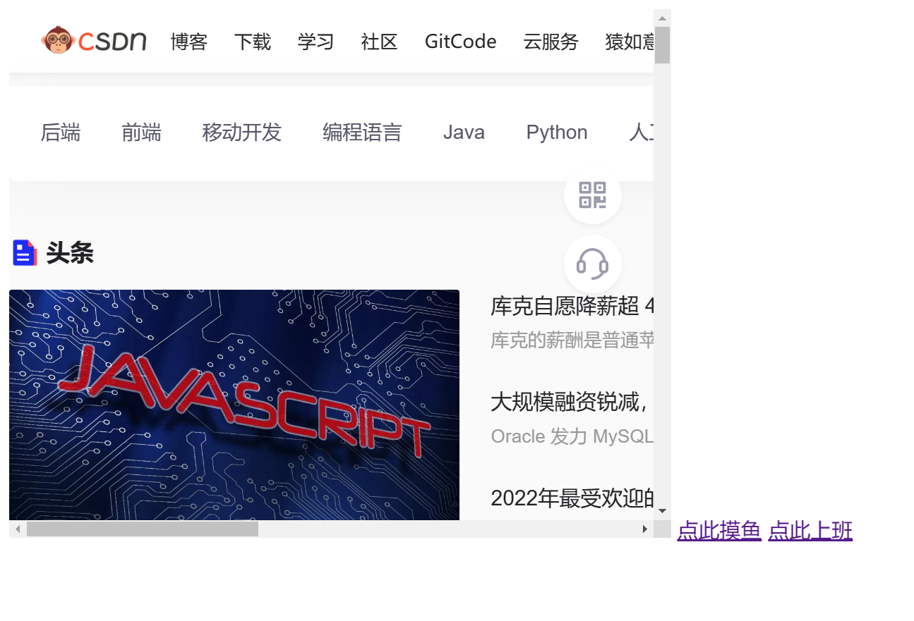


## *表单

```html
<!DOCTYPE html>
<html lang="en">
<head>
    <meta charset="UTF-8">
    <title>表单大全</title>
</head>
<body>
    <h1>注册</h1>

    <!-- form
        action 表单提交位置，可以是网站，也可以是一个请求处理地址
        method 提交方式
            get方式提交：可以在ULR中看到提交的信息，不安全，高效
            post方式提交：比较安全。可以传输大文件
    -->
    <form action="test.html" method="get">
        <!-- 文本输入框input 
            type 输入的类型
                text文本
                passw密码
                radio选择（在前边点黑点），同name的只能选择其中一个
            name 文本框名字
            value 文本框初始值
            maxlength 最长长度
            size 文本框长度
            readonly 无法修改value，只读
            hidden 隐藏该框

            下边操作一般用于表单验证：
            placeholder 提示信息
            required 必填信息，空则无法提交
            pattern 正则表达式，可以判断填入的是否合法
                使用时查询，https://www.jb51.net/tools/regex.htm
        -->
        <p>名字: <input type="text" name="username" value="laobuzhang" readonly></p>
        <p>名字1: <input type="text" name="username1" placeholder="请输入用户名" maxlength="10" size="30"></p>
        <p>名字2: <input type="text" name="username2" placeholder="请输入用户名" required></p>
        <p>邮箱: <input type="text" name="email1" pattern="\w+([-+.]\w+)*@\w+([-.]\w+)*\.\w+([-.]\w+)*"></p>
        <p>密码: <input type="password" name="pwd" hidden></p>
        
        <!-- 单选框标签input
            type="radio"
            value单选框的值
            name表示组，同组只能选一个
            checked默认选中
            disabled禁用，无法点击
        -->
        <p>
            性别:
            <input type="radio" value="boy" name="sex" checked disabled>男
            <input type="radio" value="gril" name="sex">女
        </p>

        
        <!-- 多选框 input
            type="checkbox"
            value多选选框的值
            name表示组，同组能选多个
            checked默认选中
        -->
        <p>
            爱好:
            <input type="checkbox" value="sleep" name="hobby">睡觉
            <input type="checkbox" value="game" name="hobby">游戏
            <input type="checkbox" value="study" name="hobby">学习
            <input type="checkbox" value="code" name="hobby" checked>码字
        </p>

        <!-- 按钮input
            type
                button 普通按钮
                image 图像按钮
                submit 提交表单按钮
                reset 重置表单按钮
            value 按钮名字
            name 按钮名字
            disabled禁用
         -->
         <p>
             <input type="button" name="btn1" value="点击变长">
             <input type="image" src="../resource/image/1.jpg">
         </p>
        <p>
            <!-- submit相当于一个按钮，点击后跳转到action后的地址 -->
            <input type="submit">
            <!-- reset清除刚才的输入 -->
            <input type="reset">
        </p>

        <!--下拉框select
            name下拉框的名字
            option选项
                value 选项的值
                selected默认选择
        -->
        <p>
            国家:
            <select name="国家名称">
                <option value="china">中国</option>
                <option value="Russian">俄罗斯</option>
                <option value="Australia" selected>澳大利亚</option>
                <option value="India">印度</option>
            </select>
        </p>

        <!-- 文本域（多行文本）textarea
            name文本域名字
            cols列数
            rows行数
        -->
        <p>
            反馈:
            <textarea name="textarea" cols="50" rows="10">文本内容</textarea>
        </p>

        <!-- 文件域input
            type=file
            name文件域名字
        -->
        <p>
            <input type="file" name="files">
        </p>

        <!-- 邮件验证input
            type=email
        -->
        <p>
            邮箱:
            <input type="email" name="email">
        </p>

        <!-- URL验证input
            type=url
        -->
        <p>
            URL:
            <input type="url" name="erl">
        </p>

        <!-- 数字验证input
            type=number
            max最大值
            min最小值
            step调节大小
        -->
        <p>
            数量:
            <input type="number" name="number" max="100" min="0" step="1">
        </p>

        <!-- 滑块input
            type=range
        -->
        <p>
            音量:
            <input type="range" name="voice" min="0" max="100" step="2">
        </p>

        <!-- 搜索框input
            type=search
        -->
        <p>
            搜索:
            <input type="search" name="search">
        </p>

        <!-- 增强鼠标可用性label
            for指向框的id，使得点击文字时相当于点击框
        -->
        <p>
            <label for="mark">你点我试试</label>
            <input type="text" id="mark">
        </p>
    </form>
</body>
</html>
```

效果

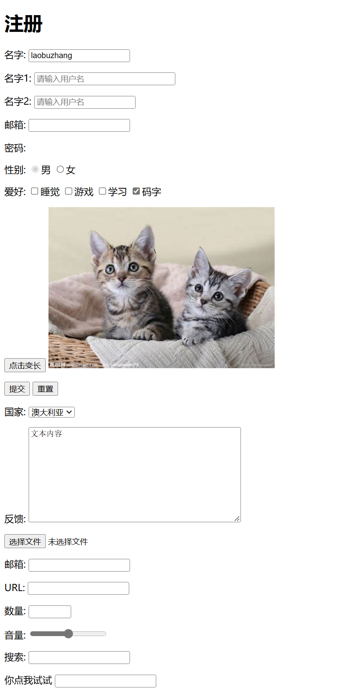


## 总结

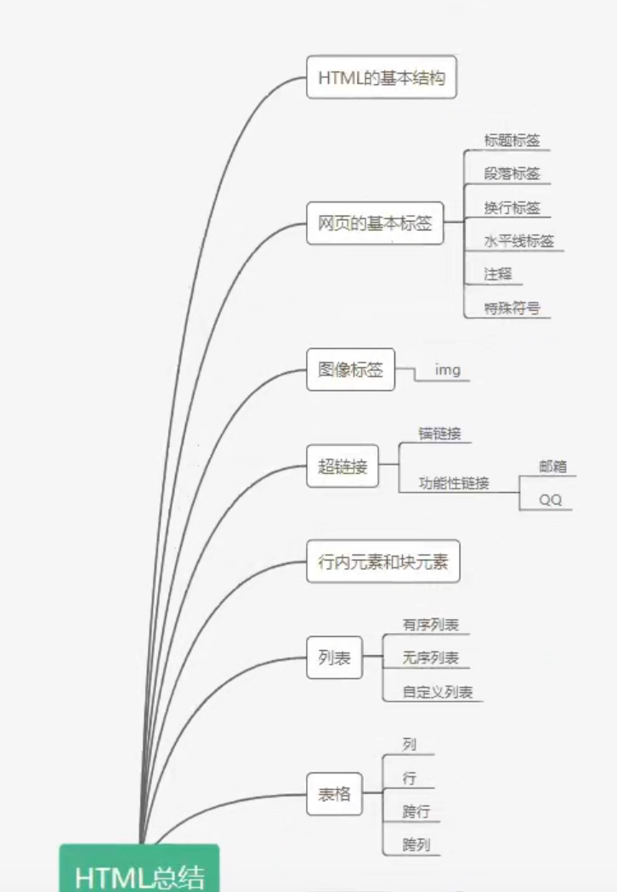

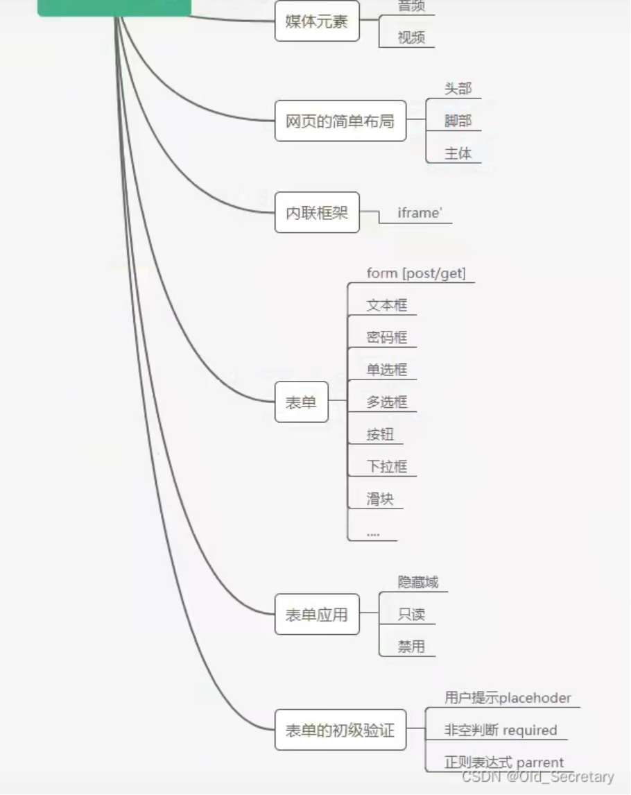