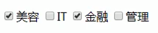
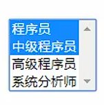

# JQuery


## 概念

 一个JavaScript框架。简化JS开发

jQuery是一个快速、简洁的JavaScript框架，是继Prototype之后又一个优秀的JavaScript代码库（或JavaScript框架）。jQuery设计的宗旨	是“write Less，Do More”，即倡导写更少的代码，做更多的事情。它封装JavaScript常用的功能代码，提供一种简便的JavaScript设计模式，优	化HTML文档操作、事件处理、动画设计和Ajax交互。

**JavaScript框架：**本质上就是一些js文件，封装了js的原生代码而已


## 快速入门

**步骤**

1. 下载JQuery [jQuery](https://jquery.com/)
	* 目前jQuery有三个大版本：
		1.x：兼容ie678,使用最为广泛的，官方只做BUG维护，
			 功能不再新增。因此一般项目来说，使用1.x版本就可以了，
			 最终版本：1.12.4 (2016年5月20日)
		2.x：不兼容ie678，很少有人使用，官方只做BUG维护，
			 功能不再新增。如果不考虑兼容低版本的浏览器可以使用2.x，
			 最终版本：2.2.4 (2016年5月20日)
		3.x：不兼容ie678，只支持最新的浏览器。除非特殊要求，
			 一般不会使用3.x版本的，很多老的jQuery插件不支持这个版本。
			 目前该版本是官方主要更新维护的版本。最新版本：3.2.1（2017年3月20日）
	* jquery-xxx.js 与 jquery-xxx.min.js区别：
		1. jquery-xxx.js：开发版本。给程序员看的，有良好的缩进和注释。体积大一些
		2. jquery-xxx.min.js：生产版本。程序中使用，没有缩进。体积小一些。程序加载更快

2. 导入JQuery的js文件：导入min.js文件

3. 使用
	
	~~~javascript
	var div1 = $("#div1");
	alert(div1.html());
	~~~


**$符号是JQuery中非常常用的符号**，用来对元素进行选择，相当于document.getElement等一系列函数


## JQuery和JS

JQuery对象和JS对象区别与转换


1. JQuery对象在操作时，更加方便。
 2. JQuery对象和js对象方法不通用的.
 3. 两者相互转换
     * jq -- > js : jq对象[索引] 或者 jq对象.get(索引)
     * js -- > jq : $(js对象)


## 选择器

筛选具有相似特征的元素(标签)

### 基本操作学习

#### 事件绑定

写在括号内的匿名函数

~~~javascript
//1.获取b1按钮
$("#b1").click(function(){
   alert("abc");
});
~~~


#### 入口函数

dom文档加载完成后执行入口函数中的代码，和window.onload有类似的效果

```
 $(function () {
 
 });
```
 window.onload  和 \$(function) 区别
   * window.onload 只能定义一次,如果定义多次，后边的会将前边的覆盖掉
   * \$(function)可以定义多次的。


#### 样式控制

css方法

~~~javascript
//两种写法
$("#div1").css("background-color","red");
$("#div1").css("backgroundColor","pink");
~~~


### 选择器分类

主要通过$符号进行选择

#### 基本选择器

1. 标签选择器（元素选择器）
	
	* 语法： `$("html标签名")` 获得所有匹配标签名称的元素
2. id选择器 
	
	* 语法： `$("#id的属性值")` 获得与指定id属性值匹配的元素
3. 类选择器
	
	* 语法： `$(".class的属性值")` 获得与指定的class属性值匹配的元素
4. 并集选择器：
	- 语法： `$("html标签,#id,.class,....")` 获取多个选择器选中的所有元素


#### 层级选择器

A和B代表基本选择器中的名字

1. 后代选择器
	
	* 语法： `$("A B")` 选择A元素内部的**所有**B元素，子代，孙代等都会选到
2. 子选择器
	
	* 语法： `$("A > B")` 选择A元素内部的所有B**子元素**


#### 属性选择器

A代表基本选择器中的名字

1. 属性名称选择器 
	* 语法： `$("A[属性名]")` 包含指定属性的选择器
2. 属性选择器
	* 语法： `$("A[属性名='值']")` 包含指定属性等于指定值的选择器，不等于可以用`!=`，可以用正则表达式，以开头可以用`^=`，以结尾可以用`$=`，包含可以用`*=`
3. 复合属性选择器
	* 语法： `$("A[属性名='值'][]...")` 包含多个属性条件的选择器


#### 过滤选择器

1. 首元素选择器 
	
	* 语法： :first 获得选择的元素中的第一个元素
	
	  ~~~javascript
	  $("div:first").css("backgroundColor","pink");
	  ~~~
2. 尾元素选择器 
	
	* 语法： :last 获得选择的元素中的最后一个元素
3. 非元素选择器
	
	* 语法： :not(selector) 不包括指定内容的元素
	
	  ~~~javascript
	  $("div:not(.one)").css("backgroundColor","pink");
	  ~~~
4. 偶数选择器
	
	* 语法： :even 偶数，从 0 开始计数，第偶数个指定标签
5. 奇数选择器
	
	* 语法： :odd 奇数，从 0 开始计数
6. 等于索引选择器
	
	* 语法： :eq(index) 指定索引元素，第index个指定标签
7. 大于索引选择器 
	
	* 语法： :gt(index) 大于指定索引元素
8. 小于索引选择器 
	
	* 语法： :lt(index) 小于指定索引元素
9. 标题选择器
	
	* 语法： :header 获得标题（h1~h6）元素，固定写法
	
	  ~~~javascript
	  $(":header").css("backgroundColor","pink");
	  ~~~


#### 表单过滤选择器

1. 可用元素选择器 
	
	* 语法： :enabled 获得可用元素
2. 不可用元素选择器 
	
	* 语法： :disabled 获得不可用元素
3. 选中选择器 
	
	* 语法： :checked 获得单选/复选框选中的元素
	
	  
	
	  ~~~javascript
	  alert($("input[type='checkbox']:checked").length);
	  ~~~
4. 选中选择器 
	
	* 语法： :selected 获得下拉框选中的元素，加上multiple属性即可创建多选下拉框
	
	  
	
	  ~~~html
	  <select name="job" id="job" multiple="multiple" size=4>
	      <option>程序员</option>
	      <option>中级程序员</option>
	      <option>高级程序员</option>
	      <option>系统分析师</option>
	  </select>
	  <script>
	  	alert($("#job > option:selected").length);
	  </script>
	  ~~~
	
	  


## DOM操作

### 内容操作

获取标签中的内容

1. html(): 获取/设置元素的标签体内容   `<a><font>内容</font></a>`  --> `<font>内容</font>`

2. text(): 获取/设置元素的标签体纯文本内容   `<a><font>内容</font></a>` --> 内容

   - 获取确实只能获取到纯文本的内容，但是设置是所有内容都会改变

     ~~~javascript
     <div id="mydiv"><p><a href="#">标题标签</a></p></div>
     $("#mydiv").text("bbb");
     
     //会变成
     <div id="mydiv">bbb</div>
     //即p标签也被删掉了
     ~~~

3. val()： 获取/设置元素的value属性值


### 属性操作


**通用属性操作**

1. attr(): 获取/设置元素的属性
2. removeAttr():删除属
3. prop():获取/设置元素的属性
4. removeProp():删除属性


* attr和prop区别？
  1. 如果操作的是元素的固有属性，则建议使用prop
  2. 如果操作的是元素自定义的属性，则建议使用attr


**获取**

~~~javascript
var name = $("#bj").attr("name");
~~~


**设置**

~~~javascript
$("#bj").attr("name","dabeijing");
~~~


**新增**

~~~javascript
$("#bj").attr("discription","didu");
~~~


**删除**

~~~javascript
$("#bj").removeAttr("name");
~~~


**获取选择框的选中状态**

checked属性只有通过prop才能得到，用attr会得到undefined

~~~javascript
<input type="checkbox" id="hobby"/>


var checked = $("#hobby").prop("checked");
alert(checked);
~~~


**对class属性操作**

1. addClass():添加class属性值

2. removeClass():删除class属性值

3. toggleClass():切换class属性
	* toggleClass("one"): 
		* 判断如果元素对象上存在class="one"，则将属性值one删除掉。  如果元素对象上不存在class="one"，则添加
	
4. css():可以获取和修改css样式

   ~~~javascript
   var backgroundColor = $("#one").css("backgroundColor");
   alert(backgroundColor);
   
   
   $("#one").css("backgroundColor","green");
   ~~~

   


### CRUD操作

就是对Node对象进行操作

1. append():父元素将子元素追加到末尾
	
	* 对象1.append(对象2): 将对象2添加到对象1元素内部，并且在末尾
	
2. prepend():父元素将子元素追加到开头
	
	* 对象1.prepend(对象2):将对象2添加到对象1元素内部，并且在开头
	
3. appendTo():
	
	* 对象1.appendTo(对象2):将对象1添加到对象2内部，并且在末尾
	
4. prependTo()：
	
	* 对象1.prependTo(对象2):将对象1添加到对象2内部，并且在开头

5. after():添加元素到元素后边
	
	* 对象1.after(对象2)： 将对象2添加到对象1后边。对象1和对象2是兄弟关系
6. before():添加元素到元素前边
	* 对象1.before(对象2)： 将对象2添加到对象1前边。对象1和对象2是兄弟关系
7. insertAfter()
	* 对象1.insertAfter(对象2)：将对象2添加到对象1后边。对象1和对象2是兄弟关系
8. insertBefore()
	* 对象1.insertBefore(对象2)： 将对象2添加到对象1前边。对象1和对象2是兄弟关系
9. remove():移除元素
	* 对象.remove():将对象删除掉
10. empty():清空元素的所有后代元素。
	* 对象.empty():将对象的后代元素全部清空，但是保留当前对象以及其属性节点


## 动画

三种方式显示和隐藏元素

### 默认显示和隐藏方式

1. show(speed,easing,fn) 显示
	1. 参数：
		1. speed：动画的速度。三个预定义的值("slow","normal", "fast")或表示动画时长的毫秒数值(如：1000)
		2. easing：用来指定切换效果，默认是"swing"，可用参数"linear"
			* swing：动画执行时效果是 先慢，中间快，最后又慢
			* linear：动画执行时速度是匀速的
		3. fn：在动画完成时执行的函数，每个元素执行一次。

2. hide(speed,easing,fn) 隐藏
3. toggle(speed,easing,fn) 切换显示和隐藏的状态


~~~javascript
$("#showDiv").hide(5000,"swing");
$("#showDiv").show(5000,"linear");
$("#showDiv").toggle("slow");
~~~


### 滑动显示和隐藏方式

1. slideDown(speed,easing,fn)
2. slideUp(speed,easing,fn)
3. slideToggle(speed,easing,fn)


### 淡入淡出显示和隐藏方式

1. fadeIn(speed,easing,fn)
2. fadeOut(speed,easing,fn)
3. fadeToggle(speed,easing,fn)


## 遍历（循环）

### js的遍历方式

**for(初始化值;循环结束条件;步长)**

jq获取的对象也可以使用这种方法

~~~javascript
var citys = $("#city li");
for (var i = 0; i < citys.length; i++) {
    if("上海" == citys[i].innerHTML){
        break; //结束循环
        continue; //结束本次循环，继续下次循环
    }
    //获取内容
    alert(i+":"+citys[i].innerHTML);
}
~~~


### jq的遍历方式

**jq对象.each(callback)**

1. 语法：
    jquery对象.each(function(index,element){});

   * index：就是元素在集合中的索引
   * element：就是集合中的每一个元素对象
  * this：集合中的每一个元素对象

  ~~~javascript
  //id为city的标签中有多个li标签
  var citys = $("#city li");
  citys.each(function (index,element) {
      //3.1 获取li对象 第一种方式 this，获取到的是当前遍历到的那一个
      alert(this.innerHTML);
      alert($(this).html());
      //3.2 获取li对象 第二种方式 在回调函数中定义参数   index（索引） element（元素对象）
      alert(index+":"+element.innerHTML);
      alert(index+":"+$(element).html());
  
      //判断如果是上海，则结束循环
      if("上海" == $(element).html()){
          //如果当前function返回为false，则结束循环(break)。
          //如果返回为true，则结束本次循环，继续下次循环(continue)
          return true;
      }
      alert(index+":"+$(element).html());
  });
  ~~~

2. 回调函数返回值：
  * true:如果当前function返回为false，则结束循环(break)。
  * false:如果当前function返回为true，则结束本次循环，继续下次循环(continue)


**$.each(object, callback)**

全局each遍历方式

和上一种方式的区别：

- 上一种只能用jq对象
- 这种可以用普通的js对象

其他的使用方式和上一种方式一样

~~~javascript
$.each(citys,function (index,element) {
    alert($(this).html());
});
~~~


**for..of**

jquery 3.0 版本之后提供的方式
for(元素对象 of 容器对象)

~~~javascript
for(li of citys){
    alert($(li).html());
}
~~~


## 事件绑定

### jquery标准的绑定方式

* jq对象.事件方法(回调函数)；
* 注：如果调用事件方法，不传递回调函数，则会触发浏览器默认行为。
	* 表单对象.submit();//让表单提交

~~~javascript
$("#name").click(function () {
   alert("我被点击了...")
});
~~~


也支持链式编程

~~~javascript
$("#name").mouseover(function () {
    alert("鼠标来了...")
}).mouseout(function () {
    alert("鼠标走了...")
});
~~~


focus事件

即使不传入函数，也会使文本框切换到点击状态，获得焦点

~~~javascript
$("#name").focus();//让文本输入框获得焦点
~~~


### on绑定事件/off解除绑定

* jq对象.on("事件名称",回调函数)
* jq对象.off("事件名称")
	* 如果off方法不传递任何参数，则将组件上的所有事件全部解绑

~~~javascript
$("#btn").on("click",function () {
   alert("我被点击了。。。")
});

$("#btn").off();
~~~


### 事件切换：toggle

* jq对象.toggle(fn1,fn2...)
	* 当单击jq对象对应的组件后，会执行fn1.第二次点击会执行fn2.....
	* 按钮以外的其他组件可以
	

~~~javascript
$("#btn").toggle(function () {
   //改变div背景色backgroundColor 颜色为 green
   $("#myDiv").css("backgroundColor","green");
},function () {
   //改变div背景色backgroundColor 颜色为 pink
   $("#myDiv").css("backgroundColor","pink");
});
~~~


* 注意：1.9版本 .toggle() 方法删除,引入jQuery Migrate（迁移）插件可以恢复此功能。
	
~~~html
<script src="../js/jquery-migrate-1.0.0.js" type="text/javascript" charset="utf-8"></script>
~~~


## 插件

增强JQuery的功能

**实现方式**

1. $.fn.extend(object) 
	
	* 增强通过Jquery获取的对象的功能  $("#id")
	* 自定义jq对象的方法
	
	~~~javascript
	$.fn.extend({
	    //定义了一个check()方法。所有的jq对象都可以调用该方法
	    check:function () {
	       //让复选框选中
	
	        //this:调用该方法的jq对象
	        this.prop("checked",true);
	    },
	    uncheck:function () {
	        //让复选框不选中
	
	        this.prop("checked",false);
	    }
	
	});
	
	$(function () {
	   // 获取按钮
	    //$("#btn-check").check();
	    //复选框对象.check();
	
	    $("#btn-check").click(function () {
	        //获取复选框对象
	        $("input[type='checkbox']").check();
	
	    });
	
	    $("#btn-uncheck").click(function () {
	        //获取复选框对象
	        $("input[type='checkbox']").uncheck();
	
	    });
	});
	~~~
	
2. $.extend(object)
	
	* 增强JQeury对象自身的功能  $/jQuery
	* 自定义全局方法
	
	~~~javascript
	$.extend({
	    max:function (a,b) {
	        return a >= b ? a:b;
	    },
	    min:function (a,b) {
	        return a <= b ? a:b;
	    }
	});
	
	var max = $.max(4,3);
	alert(max);
	
	var min = $.min(1,2);
	alert(min);
	~~~
	
	


