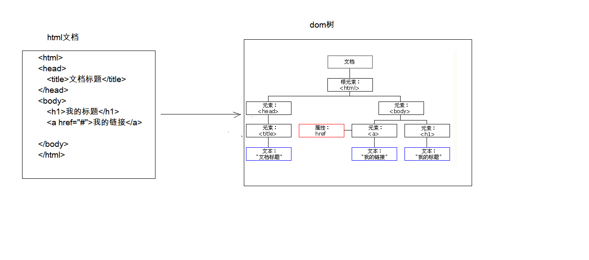
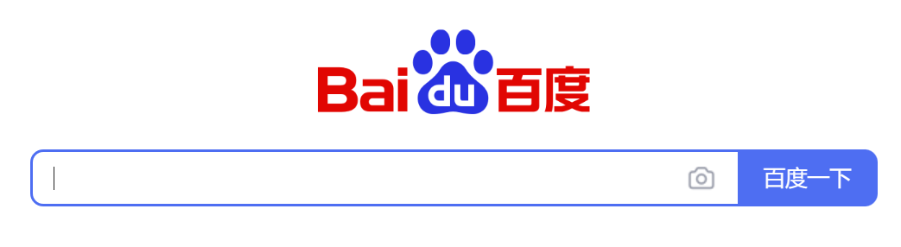
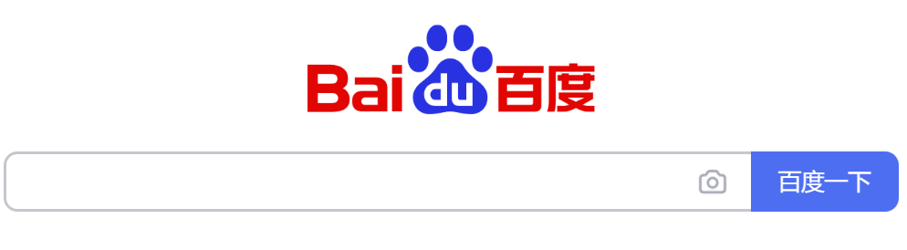

# JavaScript

## 1.概念

一门客户端脚本语言

- 运行在客户端浏览器的浏览器中，每一个浏览器都有JavaScript的解析引擎
- 脚本语言：不需要编译，直接就可以被浏览器解析执行的语言

## 2.功能

- 增强用户和HTML页面交互的过程，可以控制HTML元素，让页面有一些动态的效果，增强用户的体验

## 3.发展史

1. 1992年，Nombase公司，开发出第一门客户端脚本语言，专门用于表单的校验，命名为：C--，后来更名为ScriptEase
2. 1995年，Netscape（网景）公网，开发了一门客户端脚本语言：LiveScript。后来，请来了sun公司的专家，修改LiveScript，命名为JavaScript
3. 1996年，微软抄袭了JavaScript开发出JScript语言
4. 1997年，ECMA（欧洲计算机制造商协会），ECMAScript，就是所有客户端脚本语言的标准。

JavaScript=ECMAScript + JavaScript自己特有的东西（BOM+DOM）

## 4.ECMAScript

### 1.基本语法

#### 1.1与HTML结合

1. 内部js：script标签内就是js代码

2. 外部js：script标签src属性引入外部js文件

   ~~~html
   <!DOCTYPE html>
   <html>
       <head>
           <meta charaset="UTF-8">
           <title>
               Title
           </title>
   
           <!-- 
               内部JS
               可以放在任意位置
               按顺序执行
               alert是阻塞语句，不按确定，后边的语句就不会执行
           -->
           
   
   
           <!-- 
               外部JS 
           -->
           
       </head>
       <body></body>
   </html>
   ~~~

script标签可以写在任意位置，但是位置不同，执行顺序不同

但是这个顺序对于有些浏览器无用

#### 1.2注释

   1. 单行注释：  //

   2. 多行注释： /* */

#### 1.3分号

再js中如果我们不写分号其实也没有问题，再解释时会自动加上

所以就有两种js风格：带分号的和不带分号的

- 带分号基本不会出错，但是很多的分号有可能会带来很多不必要的工作量
- 不带分号只需要注意一点即可：
  - 为了避免语法错误，当一行以`(` 、`[`、`/`、`+`、`-`为开头时，在前边加上分号即可

   ### 2.数据类型

   1. 原始数据类型（基本数据类型）：
      1. number：整数，小数，NaN（一个不是数字的数字类型）
      2. string：字符和字符串，可单引可双引
      3. boolean：真和假
      4. null：对象为空的占位符
      5. undefined：未定义。如果一个变量没有给初始化值，则会默认赋值为undefined
      
   2. 引用数据类型：对象

      

   

   ### 3.变量

   java是强类型语言，JS是弱类型语言

   - 强类型就是在开辟存储空间是，定义了空间的数据类型，只能存储固定类型数据
   - 弱类型就是只开辟空间，该空间可以放任意类型的数据

   语法：

   ~~~javascript
   var 变量名=初始化值;
   
   var a=3;
   alert(a);
   a="abc";
   alert(a);
   
   //在html输出num1
   document.write(num1+" ");
   
   //可以使用typeof运算符查看变量类型
   document.write(typeof(obj2));//null类型会返回object
   ~~~

   

变量可以用var定义，也可以不使用

- 用了是局部变量
- 不用是全局变量

### 4.运算符

JS中，如果运算数不是运算符所要求的类型，那么js会自动将运算数转换为所需的类型

1. 转换为number的转换规则：

   ~~~javascript
   string转number：按照字面值转换，如果字面包含非数字，则转为NaN
   boolean转number：true转1，false转0
   null和undefined都转为NaN
   
   var a=+"123";
   document.write(a+1);//输出124
   
   var a="123";
   document.write(a+1);//输出124
   
   var b=+"123ab";
   document.write(a+1);//输出NaN(NaN+1仍然等于NaN)
   ~~~

2. 转换为boolean类型

   ~~~javascript
   number转boolean：0和NaN为false，其他为true
   string转boolean：除了空字符串，其他都是true
   null和undefined转boolean：都是false
   对象：所有非null对象都是true。
   ~~~
   
   

1. **一元运算符：**只有一个运算数的运算符（类型适用于number，其他类型会转换为number）

   ~~~javascript
   ++ -- + -（正负号可用于类型转换）
   ~~~

2. **算数运算符**：和java一样

3. 赋值运算符

   ~~~javascript
   = += -=
   ~~~

4. **比较运算符**

   ~~~javascript
   //其他和java一样
   ==   //等于，当两边类型不一样时，会先进行类型转换在进行比较
   ===   //全等于，JS特有，如果类型不一样，直接返回false
   ~~~

   可以比较**类型相同**的变量：数字，字符串（按找字典序比较）

   可以比较**类型不同**的变量：先进行类型转换，在比较

   `==`的比较规则：

   1. 如果一个是null，一个是undefined，那么相等
   2. 如果一个是字符串，一个是数值，把字符串转换成数值之后再进行比较
   3. NaN和NaN不相等，出现至少一个NaN就返回false

5. **逻辑运算符**（适用于boolean类型，其他类型会转换为boolean）

   逻辑会全部运算，短路得到答案就结束，短路效率更高（因为少了一些运算）

   ~~~javascript
   &（逻辑与）
   |（逻辑或）
   &&（短路与）
   ||（短路或）
   !
   ~~~

6. **三元运算符**：`? :`

   

### 5.流程控制语句

基本和java一样

1. if else

2. switch
   - switch可接收的数据类型
     - java中：byte int short char 枚举 String
     - JS中：任意原始数据类型，每个case的类型都可以不一样
   
3. while

4. do while

5. for

   `for(var i=1;i<=100;i++){};`

### 6.对象

#### 6.1.Function

函数对象

- 创建和使用，有三种方法

  1. ~~~javascript
     //1. var fun=new Function(形式参数列表,方法体);(基本不用)
     var fun1=new Function("a","b","alert(a);");
     fun1(3,4);
     ~~~

  2. ~~~javascript
     /*
     2.
     function 方法名称(形式参数列表){
         方法体
     }
     */
     function fun2(a,b){//形参的类型可以不写
         alert(a+b);
     }
     fun2(3,4);//函数的调用
     ~~~

  3. ~~~javascript
     /*
     3.
     var 方法名=function(形式参数列表){
         方法体
     }
     */
     var fun3=function(a,b){
         alert(a+b);
     }
     fun3(4,5);
     ~~~

- 属性：

  ~~~javascript
  function fun2(a,b){
      alert(a+b);
  }
  alert(fun2.length);//方法的参数个数
  ~~~

- 特点

  1. 定义时，形参类型可以不用写，返回值也可以不写

  2. 方法是一个对象，如果定义名称相同的方法，后者会覆盖前者

     ~~~javascript
     function fun2(a,b){
         alert(a+b);
     }
     function fun2(a,b){
         alert(a-b);
     }
     fun2=function(a,b,c){
         alert(a*b*c);
     }
     ~~~

  3. 方法的调用值，只与方法的名称有关，和参数列表无关

     ~~~javascript
     function fun2(a,b){
         alert(a+b);
     }
     fun2(1);//a为1，b为undefined
     fun2();//都为undefined
     fun3(1,2,3);//a为1，b为2，3被内置对象接收
     ~~~

  4. 在方法声明中有一个隐藏的内置对象（数组），arguments，封装所有的实际参数

     ~~~javascript
     function sum(){
         var sum=0;
         for(var i=0;i<arguments.length;i++){
             sum+=arguments[i];
         }
         return sum;
     }
     alert(sum(1,2,3,4,5));
     ~~~

  5. 函数的定义要写在调用上边

#### 6.2.Array

数组对象

- 创建

  ~~~javascript
  //数组对象
  
  //1. var arr=new Array(列表元素);
  var arr1=new Array(1,2,3);
  
  //2. var arr=new Array(默认长度);
  var arr2=new Array(5);
  
  //3. var arr=[元素列表];
  var arr3=[1,2,3,4,5];
  
  document.write(arr1+" ");
  document.write(arr2+" ");
  document.write(arr3+" ");
  ~~~

- 特点

  1. Array元素类型可变
  2. 数组长度可变，越界访问时，越界元素为undefined，同时数组长度自动扩充为越到的地方

- 属性

  - length，数组的长度
  - 访问：和java一样`alert(arr[0])`

- 方法：常用的是join和push

  ~~~javascript
  join(参数);//将数组中的元素按照指定的分隔符拼接为字符串，默认用,分隔
  
  var arr3=[1,2,3,4,5];
  
  document.write(arr3.join("--"));
  
  
  
  
  push();//向数组的末尾添加一个或更多元素，并返回新的长度
  
  arr3.push(6);
  ~~~

  

#### 6.3.Boolean

boolean的包装对象

#### 6.4.Date

日期对象

- 创建：

  ~~~javascript
  //1. var date=new Date();
  var date=new Date;
  
  document.write(date);
  ~~~

- 方法：

  ~~~javascript
  //toLocaleString();  返回当前date对象对应的事件本地字符串格式（和系统区域有关）
  
  var date=new Date;
  
  document.write(date.toLocaleString());
  
  
  
  //getTime();  返回当前日期对象描述的时间到1970年1月1日0点的毫秒值差
  document.write(date.getTime());
  ~~~
  
  

#### 6.5.Math

包含一些数学方法的对象

- 创建：Math对象不用创建，直接使用`Math.方法名();`

- 方法：

  ~~~Javascript
  //圆周率
  document.write(Math.PI);
  
  //0~1之间的随机数，含0不含1
  document.write(Math.random());
  
  //向上取整
  document.write(Math.ceil(3.14));
  
  //向下取整
  document.write(Math.floor(3.14));
  
  //四舍五入
  document.write(Math.round(3.14));
  ~~~

  

#### 6.6.Number

number的包装类

#### 6.7.String

string的包装类

#### 6.8.RegExp

正则表达式对象

1. 正则表达式：定义字符串的组成规则。

   1. 单个字符：[]

      如：[a]  [ab]  [a-zA-z0_9_]

      - 特殊符号代表特殊含义的单个字符：

        \d：单个数字字符 [1-9]

        \w：单个单词字符 [a-zA-Z0-9_]

   2. 量词符号：

      ?：表示出现0次或1次

      *：表示出现0次或多次

      +：表示出现1次或多次

      {m,n}：表示m<=数量<=n

      {,n}：最多n次

      {m,}：最少m次

   3. 开始结束符号

      - ^：开始
      - $：结束

2. 正则对象：

   - 创建

     ~~~javascript
     //1.  var reg=new RegExp("正则表达式");
     
     //2.  var reg=/正则表达式/;
     ~~~

     

   - 方法

     ~~~javascript
     //test();  验证定义的字符串是否满足正则定义的规范
     
     var reg1=new RegExp("^\\w{1,12}$");
     var reg2=/^\w{1,12}$/;
     
     
     var username="zhangsan";
     var username1="zhangsanasdasdasdadasasdas";
     alert(reg1.test(username));//true
     alert(reg2.test(username1));//false
     ~~~

     

#### 6.9.Global

全局对象，这个Globe中封装的方法不需要对象就可以直接调用

- 方法：

  - encodeURI();
    decodeURI();

    encodeURIComponent();
    decodeURIComponent();

    ~~~javascript
    encodeURI();//url编码
    decodeURI();//url解码
    
    encodeURIComponent();//url编码，编码的字符更多，有些字符在上边两种不会编码，但是这两种会编码
    decodeURIComponent();//url解码
    
    
    
    
    var str1="http://www.baidu.com?wd=老部长";
    var encode1=encodeURI(str1);//http://www.baidu.com?wd=%E8%80%81%E9%83%A8%E9%95%BF
    document.write(encode1+" ");
    var str2=decodeURI(encode1);
    document.write(str2+" ");
    
    
    var str1="http://www.baidu.com?wd=老部长";
    var encode1=encodeURIComponent(str1);//http%3A%2F%2Fwww.baidu.com%3Fwd%3D%E8%80%81%E9%83%A8%E9%95%BF
    document.write(encode1+" ");
    var str2=decodeURIComponent(encode1);
    document.write(str2+" ");
    ~~~

    url编码：

    ​	二进制数，每4位记成一个16进制数，没两个16进制数之间用%分割

    ~~~javascript
    1001 1100 1111 0001
    %9   C    %F   1
    ~~~

    

  - parseInt();

    ~~~javascript
    //逐一判断每一个字符是否是数字，知道不是数字为止，将前面数字部分转为number，若第一个都不是数字，返回NaN
    var s="123abc";
    document.write(parseInt(s)+1);//124
    var s1="a123abc";
    document.write(parseInt(s1)+1);//NaN
    ~~~

  - isNaN();

    ~~~javascript
    //判断是否是NaN，不能用正常方法，只要是有NaN参与的比较，就会返回false
    document.write(NaN==NaN);//false
    
    document.write(isNaN("abc"));//true
    ~~~

  - eval();

    ~~~javascript
    //解析JS字符串，并把它作为脚本代码来执行
    var strr="alert(123)";
    document.write(strr);//alert(123)
    eval(strr);//发出警报123
    ~~~

    

  

  

  

## 5.DOM

### 1.简介

**Document Object Model 文档对象模型**

- 将标记语言文档的各个组成部分，封装成对象
- 可以使用这些对象，对标记语言文档进行CRUD的操作

**DOM把标记语言文档转换为一个树形结构**

**DOM标准有三个不同的部分**

- 核心DOM：针对任何结构化文档的标准模型
  - Document：文档对象
  - Element：元素对象
  - Attribute：属性对象
  - Text：文本对象
  - Comment：注释对象
  - Node：节点对象，其他5个的父对象
- XML DOM：针对XML文档的标准模型
- HTML DOM：针对HTML文档的标准模型

### 2.核心DOM

#### 2.1.Docuement：文档对象

**获取**

在html DOM中有两种获取方法

~~~javascript
window.document
document
~~~

在XML DOM中则是其他的方式

**方法**

获取Element对象

1. getElementById(id) 根据id属性获取元素对象

   ~~~javascript
   var div=document.getElementById("div1")
   ~~~

2. getElementsByTagName(tagName) 根据标签名称获取元素对象们，返回值是数组

   ~~~javascript
   var divs=document.getElementsByTagName("div")//获取所有div标签
   ~~~

3. getElementsByClassName(className) 根据class属性获取元素对象们，返回值是数组

   ~~~javascript
   var classes=document.getElementsByClassName("cls1")
   ~~~

4. getElementsByName(name) 根据name属性获取元素对象们，返回值是数组

   ~~~javascript
   var names=document.getElementsByName("username")
   ~~~

创建其他DOM对象

1. createAttribute() 创建新的属性节点

2. createComment() 创建注释节点

3. createElement(tagName) 创建元素节点，参数为标签名

   ~~~javascript
   var table = document.createElement("table");
   document.write(table); //输出 [object HTMLTableElement]
   ~~~

4. createTextNode() 创建文本节点

#### 2.2.Element：元素对象

**创建、获取：**

如上使用document操作

**方法**

- removeAttribute(name) 删除属性

  ~~~javascript
  var element_a=document.getElementsByTagName("a")[0]  
  element_a.removeAttribute("href")
  ~~~

- setAttribute(name,value) 设置属性

  ~~~javascript
  var element_a=document.getElementsByTagName("a")[0]           element_a.setAttribute("href","http://www.baidu.com")
  ~~~

**操作Element对象**

设置属性值

1. 明确获取的对象
2. 查看API文档，查看有哪些属性可以修改

~~~html
<body>

    

    
</body>
~~~

#### 2.3.Node：节点对象

其他5个的父对象，代表文档函数树中的一个单独节点

特点：所有DOM对象都可以认为是一个节点

**方法**

- appendChild(nodeObject) 向节点的字节点列表的结尾添加新的子节点

  ~~~javascript
  

      div1
  

  
  ~~~

- removeChild(nodeObject) 删除（并返回）当前节点的指定子节点

  ~~~html
  

      
div2

      div1
  

  
  ~~~

- replaceChild( newNodeObject , oldNodeObject ) 用新节点替换一个子节点

  ~~~javascript
  

      
div2

      div1
  

  
  ~~~

**属性**

parentNode 返回父节点

~~~javascript

    
div2

    div1

~~~

**Tips**

html的链接标签有两种功能

1. 可以被点击，有链接的样式
2. 点击后跳转到href指定的url

但是当href为空时，跳转的地址是当前页面，相当于是刷新页面

如果想要**将标签链接当作按钮标签**来使用，会出现一些问题

- 相当做按钮使用，就是还要停留在当前页面，所以href要填空
- 但是href填空时，这个链接相当于刷新页面，按下时所产生的效果会消失

想要达成目的，只需要href这样填即可

~~~javascript
<a href="javascript:void(0);">这是一个链接按钮</a>
~~~

### 3.HTML DOM

是关于如何获取、修改、添加和删除HTML元素的标准

#### 3.1.innerHTML

标签体的设置和获取

**获取**

所有的回车、制表符和内容全部都获取到

~~~javascript
var div1=document.getElementById("div1")
var innerHTML=div1.innerHTML
alert(innerHTML)
~~~

注意**返回的是标签中的内容，而不是标签内容对象本身**，相当于是形式参数

换言之，下面的代码会不起到修改内容的作用

~~~javascript
var div1=document.getElementById("div1")
var div1_innerHTML=div1.innerHTML
div1_innerHTML="变了一下"
div1_innerHTML+="加了一点"
~~~

**设置**

1. 更改内容

   ~~~javascript
   var div1=document.getElementById("div1")
   div1.innerHTML="变了一下<input type='text'>"
   ~~~

2. 添加内容

   ~~~javascript
   var div1=document.getElementById("div1")
   div1.innerHTML+="加了一点<input type='text'>"
   ~~~

#### 3.2.元素对象的属性

每个标签都有自己对应的属性

如：

- a标签有href属性
- img标签有src属性
- ......

他们都可以被获取和修改，方法和innerHTML一样，不在赘述

~~~javascript
var img=document.getElementById("img")
img.src="./1.jpg"
~~~

#### 3.3.控制样式

即修改标签的css属性

**使用style属性**

每个标签都有一个style属性，style属性中又包含在sytle标签中可以设置的属性

普通单词属性：直接用

~~~javascript
var div1=document.getElementById("div1")
div1.style.border="1px solid red"
~~~

带连字符的属性：去掉连字符，后面单词首字母大写

~~~javascript
var div1=document.getElementById("div1")
div1.style.fontSize="20px"
~~~

使用calssName

在style标签中写好不同calssName的样式，通过更改标签的className，来使用不同的样式

~~~html
<!DOCTYPE html>
<html>
    <head>
        <meta charaset="UTF-8">
        <title>HTMLDOM</title>
        
    </head>
    <body>
        

            div2
        

        
    </body>
</html>
~~~

## 6.BOM

### 1.简介

**Browser Object Model  浏览器对象模型**

- 将浏览器的各个组成部分封装成对象

主要学习下面三种对象

### 2.Window：窗口对象

**特点：**

- Window对象不需要创建可以直接使用。`window.方法名();`
- window引用可以省略

**方法：**

~~~javascript
alert();//显示带有一段消息和一个确认按钮的警告框

confirm();//显示带有一段消息和一个确认按钮和一个取消按钮的对话框，按确定返回true，按取消返回false

var flag=confirm("点一下");
 if(flag){
     alert("来了老弟");
 }else{
     alert("别手抖");
 }

prompt();//显示可提示用户输入的对话框，可加参数表示输入框之前的描述，返回值为用户输入的值

var s=prompt("请随便输入点啥");
alert(s);
~~~

**打开和关闭:**

~~~html
close();//关闭调用该方法的浏览器窗口

open();//打开一个新的浏览器窗口，参数可设置新窗口的地址,返回值是新窗口的Windows对象

<body>
        <input id="openBtn" type="button" value="打开窗口">
        <input id="closeBtn" type="button" value="关闭窗口">

        
    </body>
~~~

**定时器:**

  ~~~javascript
  setTimeout("JS代码",毫秒数);//在指定毫秒数后调用函数或者计算表达式，返回值为一个id，表示该定时器的id编号
  clearTimeout();//取消由上者方法设置的timeout，可通过id来关闭定时器
  
  setInterval();//按照指定的周期（以毫秒计）来调用函数或者计算表达式，同样会返回id
  clearInterval();//取消由上者设置的Interval，可通过id来关闭定时器
  
  
  
  var id=setTimeout(fun,3000);
  clearTimeout(id);
  function fun(){
      alert("boom");
  }
  
  var id1=setInterval(fun,2000);
  clearInterval(id1);
  ~~~

**属性：**

1. 可以通过window对象获取到其他BOM对象

   - Navigator：浏览器对象
   - Screen：显示器屏幕对象
   - History：历史记录对象
   - Location：地址栏对象

   ~~~javascript
   //其他同理 
   var h1=window.history
   var h2=history
   
   alert(h1)
   alert(h2)
   ~~~

2. 可以获取DOM对象

   ~~~javascript
   var h1=window.document.getElementById();//这才是原本的写法
   var h2=document.getElementById();
   ~~~

### 3.Location：地址栏对象

浏览器上方的地址栏，包含URL信息

**获取**

两种方式

~~~javascript
window.location
location
~~~

**方法**

reload刷新当前页面

~~~javascript
locaiton.reload()
~~~

**属性**

herf获取路径

~~~javascript
var href=location.href
alert(href)
~~~

### 4.History：历史记录对象

当前window窗口所访问过的历史记录

**创建**

两种方式

~~~javascript
window.hisroty
history
~~~

**方法**

back

~~~javascript
history.back()
~~~

forward

~~~javascript
history.forward()
~~~

go

~~~javascript
history.go(参数)
/**参数的值
*正数，前进几个历史记录
*负数，后退几个历史记录
*/
~~~

**属性**

length 当前窗口历史记录列表中的URL个数

~~~javascript
var len=history.length
~~~

## 7.事件

### 1.概念

功能：某些组件被执行了某些操作后，触发某些代码的执行

### 2.事件

某些操作，如单击，双击，键盘按下，鼠标移动等

**常见事件**

#### 2.1.点击事件

onclick 单击

ondblclick 双击

#### 2.2.焦点事件

onblur 元素失去焦点

- 一般用于表单校验
- 离开文本框后便进行校验并显示校验信息

onfocus 元素获得焦点

例如：搜索框

点击时：

点击外部时：

#### 2.3.加载事件

onload 一张页面或者一张图像完成加载

- 一般可以用`window.onload`用来再页面加载完毕时执行一些操作

#### 2.4.鼠标事件

onmousedown 鼠标被按下

- 左键右键和中间都会反应

- 按下后会返回一个参数叫event，通过event可以获取这次点击的一些信息，例如button可以获取点击的是哪一个按键

  ~~~javascript
  document.getElementById("username").onmousedown = function(event){
      alert(event.button);
  }
  ~~~

onmouseup 鼠标被松开

onmousemove 鼠标被移动

onmouseover 鼠标移到某元素之上

onmouseout 鼠标从元素移开

#### 2.5.键盘事件

onkeydown 某个键盘按键被按下

- 按下后会返回一个参数叫event，通过event可以获取这次点击的一些信息，例如keyCode可以获取点击的是哪一个按键（返回的是ASCII码）

- 可以用于按下回车（ASCII码为13）提交表单

  ~~~javascript
  document.getElementById("username").onkeydown = function(event){
      alert(event.keyCode);
  }
  ~~~

onkeyup 某个键盘按键被松开

onkeypress 某个键盘按键被按下并松开

#### 2.6.选择和改变

onchange 区域的内容被改变

- 可以用于下拉框，做出省市区联动的效果

onselect 文本被选中

#### 2.7.表单事件

onsubmit 确认按钮被点击

- 可以阻止表单的提交

- 函数返回false即可阻止提交

  - 注意：这里要是采用标签属性进行注册监听，则需要在值里边加上return

  - 否则相当于是onlick之中直接写了一个false

  - checkForm()return的是checkForm这个函数，并没有return onclick这个事件

    ~~~html
    
    <form action="#" id="form" onclick="return checkForm();">
    ~~~

    

onreset 重置按钮被点击

### 3.事件源

组件，如按钮，文本输入框等

其实就是html的标签

### 4.监听器

代码，事件发生后执行的代码

js代码

### 5.注册监听

将事件源和监听器绑定在一起

一般有两种方式

**设置标签属性**

在标签的onclick等属性中直接写入调用函数的代码

~~~html

~~~

**匿名函数**

先获取DOM对象

然后再设置匿名函数

~~~html

~~~

绑定事件：

1. 直接在html标签上，指定事件的属性，属性值就是js代码
   1. 事件：onclick    单击事件，是标签的一个属性，后边填js代码
2. 通过js获取元素对象，指定事件属性，设置一个函数

~~~html
<!DOCTYPE html>
<html>
    <head>
        <meta charaset="UTF-8">
        <title>事件绑定</title>

        
        
    </head>

    <body>
        

    </body>
</html>
~~~

