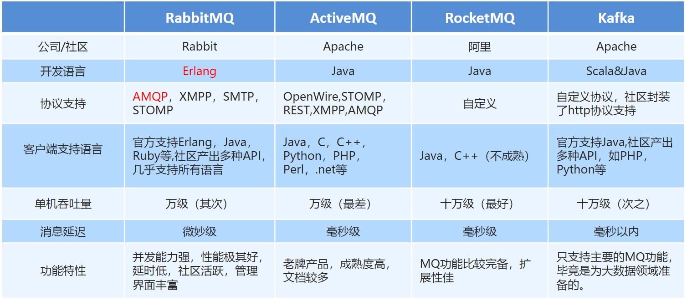
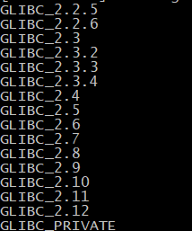
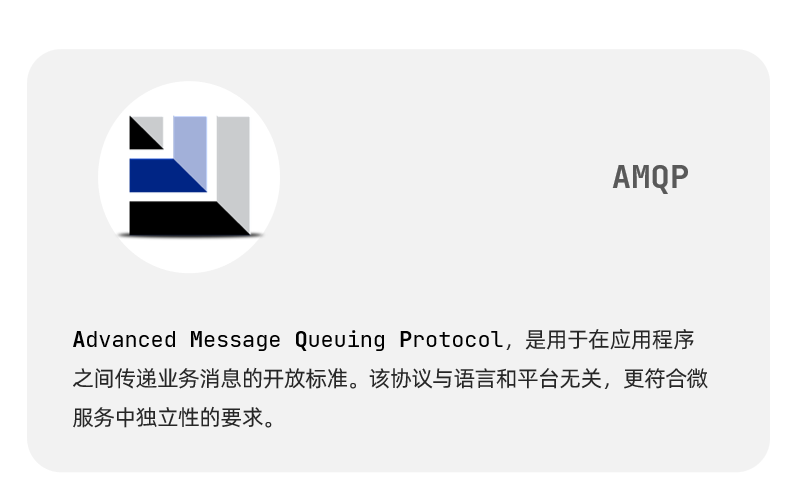
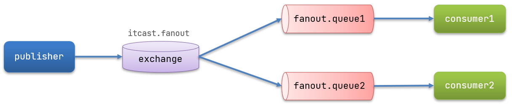

# Rabbit MQ

## MQ基本概念

### MQ概述

MQ全称 Message Queue（消息队列），是在消息的传输过程中保存消息的容器。多用于分布式系统之间进行通信。


- MQ，消息队列，存储消息的中间件
- 分布式系统通信两种方式：直接远程调用 和 借助第三方 完成间接通信
- 发送方称为生产者，接收方称为消费者


### MQ的优缺点


> MQ优势

系统的耦合性越高，容错性就越低，可维护性就越低

- 应用解耦：提高系统容错性和可维护性

- 异步提速：提升用户体验和系统吞吐量

- 削峰填谷：提高系统稳定性

  - 相当于是将请求放在MQ中，缓慢地给予服务器

  - 


> MQ劣势


### MQ使用条件

1. 生产者不需要从消费者处获得反馈。引入消息队列之前的直接调用，其接口的返回值应该为空，这才让明明下层的动作还没做，上层却当成动作做完了继续往后走，即所谓异步成为了可能。
2. 容许短暂的不一致性。
3. 确实是用了有效果。即解耦、提速、削峰这些方面的收益，超过加入MQ，管理MQ这些成本


### 常见MQ产品




## RabbitMQ简介

### 历史

AMQP，即 Advanced Message Queuing Protocol（高级消息队列协议），是一个网络协议，是应用层协议的一个开放标准，为面向消息的中间件设计。基于此协议的客户端与消息中间件可传递消息，并不受客户端/中间件不同产品，不同的开发语言等条件的限制。2006年，AMQP 规范发布。类比HTTP。


2007年，Rabbit 技术公司基于 AMQP 标准开发的 RabbitMQ 1.0 发布。RabbitMQ 采用 Erlang 语言开发。Erlang 语言由 Ericson 设计，专门为开发高并发和分布式系统的一种语言，在电信领域使用广泛


### RabbitMQ组成


- Broker：接收和分发消息的应用，**RabbitMQ Server**就是 Message Broker
- Virtual host：出于多租户和安全因素设计的，把 AMQP 的基本组件划分到一个虚拟的分组中，类似于网络中的 **namespace 概念**。当多个不同的用户使用同一个 RabbitMQ server 提供的服务时，可以划分出多个vhost，每个用户在自己的 vhost 创建 exchange／queue 等
- Connection：publisher／consumer 和 broker 之间的 **TCP 连接**
- Channel：如果每一次访问 RabbitMQ 都建立一个 Connection，在消息量大的时候建立 TCP Connection的开销将是巨大的，效率也较低。**Channel 是在 connection 内部建立的逻辑连接**，如果应用程序支持多线程，通常每个thread创建单独的 channel 进行通讯，AMQP method 包含了channel id 帮助客户端和
  message broker 识别 channel，所以 channel 之间是完全隔离的。Channel 作为轻量级的 Connection极大减少了操作系统建立 TCP connection 的开销

- **Exchange**：**交换机的功能**，message 到达 broker 的第一站，根据分发规则，匹配查询表中的 routing key，分发消息到queue 中去。常用的类型有：direct (point-to-point), topic (publish-subscribe) and fanout (multicast)
- **Queue**：消息最终被送到这里等待 consumer 取走
- **Binding**：**exchange 和 queue 之间的虚拟连接**，binding 中可以包含 routing key。Binding 信息被保存到 exchange 中的查询表中，用于 message 的分发依据


### RabbitMQ工作模式


### JMS

- JMS 即 Java 消息服务（JavaMessage Service）应用程序接口，是一个 Java 平台中关于面向消息中间件的API
- JMS 是 JavaEE 规范中的一种，类比JDBC
- 很多消息中间件都实现了JMS规范，例如：ActiveMQ。RabbitMQ 官方没有提供 JMS 的实现包，但是开源社区有


## RabbitMQ安装

[官网](http://www.rabbitmq.com)

[最新版安装](https://blog.csdn.net/m0_67392182/article/details/126040124?ops_request_misc=%7B%22request%5Fid%22%3A%22167048214616782425121222%22%2C%22scm%22%3A%2220140713.130102334..%22%7D&request_id=167048214616782425121222&biz_id=0&utm_medium=distribute.pc_search_result.none-task-blog-2~all~top_positive~default-2-126040124-null-null.142^v68^js_top,201^v4^add_ask,213^v2^t3_esquery_v3&utm_term=rabbitmq安装&spm=1018.2226.3001.4187)


> 使用文件夹中的版本安装

### 1. 安装依赖环境

在线安装依赖环境：

```shell
yum install build-essential openssl openssl-devel unixODBC unixODBC-devel make gcc gcc-c++ kernel-devel m4 ncurses-devel tk tc xz

```


### 2. 安装Erlang

上传

erlang-18.3-1.el7.centos.x86_64.rpm
socat-1.7.3.2-5.el7.lux.x86_64.rpm
rabbitmq-server-3.6.5-1.noarch.rpm

```sh
# 安装
rpm -ivh erlang-18.3-1.el7.centos.x86_64.rpm
```

如果出现如下错误


说明gblic 版本太低。我们可以查看当前机器的gblic 版本

```shell
strings /lib64/libc.so.6 | grep GLIBC
```



当前最高版本2.12，需要2.15.所以需要升级glibc

- 使用yum更新安装依赖

  ```shell
  sudo yum install zlib-devel bzip2-devel openssl-devel ncurses-devel sqlite-devel readline-devel tk-devel gcc make -y
  ```

- 下载rpm包

  ```shell
  wget http://copr-be.cloud.fedoraproject.org/results/mosquito/myrepo-el6/epel-6-x86_64/glibc-2.17-55.fc20/glibc-utils-2.17-55.el6.x86_64.rpm &
  wget http://copr-be.cloud.fedoraproject.org/results/mosquito/myrepo-el6/epel-6-x86_64/glibc-2.17-55.fc20/glibc-static-2.17-55.el6.x86_64.rpm &
  wget http://copr-be.cloud.fedoraproject.org/results/mosquito/myrepo-el6/epel-6-x86_64/glibc-2.17-55.fc20/glibc-2.17-55.el6.x86_64.rpm &
  wget http://copr-be.cloud.fedoraproject.org/results/mosquito/myrepo-el6/epel-6-x86_64/glibc-2.17-55.fc20/glibc-common-2.17-55.el6.x86_64.rpm &
  wget http://copr-be.cloud.fedoraproject.org/results/mosquito/myrepo-el6/epel-6-x86_64/glibc-2.17-55.fc20/glibc-devel-2.17-55.el6.x86_64.rpm &
  wget http://copr-be.cloud.fedoraproject.org/results/mosquito/myrepo-el6/epel-6-x86_64/glibc-2.17-55.fc20/glibc-headers-2.17-55.el6.x86_64.rpm &
  wget http://copr-be.cloud.fedoraproject.org/results/mosquito/myrepo-el6/epel-6-x86_64/glibc-2.17-55.fc20/nscd-2.17-55.el6.x86_64.rpm &
  ```

- 安装rpm包

  ```shell
  sudo rpm -Uvh *-2.17-55.el6.x86_64.rpm --force --nodeps
  ```

- 安装完毕后再查看glibc版本,发现glibc版本已经到2.17了

  ```shell
  strings /lib64/libc.so.6 | grep GLIBC
  ```

  

  


### 3. 安装RabbitMQ

```sh
# 安装
rpm -ivh socat-1.7.3.2-1.1.el7.x86_64.rpm

# 安装
rpm -ivh rabbitmq-server-3.6.5-1.noarch.rpm

```


### 4. 开启管理界面及配置

```sh
# 开启管理界面
rabbitmq-plugins enable rabbitmq_management
# 修改默认配置信息
vim /usr/lib/rabbitmq/lib/rabbitmq_server-3.6.5/ebin/rabbit.app 
# 比如修改密码、配置等等，例如：loopback_users 中的 <<"guest">>,只保留guest

```


### 5. 启动

```sh
service rabbitmq-server start # 启动服务
service rabbitmq-server stop # 停止服务
service rabbitmq-server restart # 重启服务
```


- 设置配置文件

```shell
cd /usr/share/doc/rabbitmq-server-3.6.5/
#这里也是rabbitmq的默认安装路径

cp rabbitmq.config.example /etc/rabbitmq/rabbitmq.config
#将配置的模板移动到规定的位置即可开始生效

```


### 6. 配置虚拟主机及用户

#### 6.1. 用户角色

RabbitMQ在安装好后，可以访问`http://ip地址:15672` （访问不到的话需要修改防火墙）；其自带了guest/guest的用户名和密码；如果需要创建自定义用户；那么也可以登录管理界面后，如下操作：

 


**角色说明**：

1、 超级管理员(administrator)

可登陆管理控制台，可查看所有的信息，并且可以对用户，策略(policy)进行操作。

2、 监控者(monitoring)

可登陆管理控制台，同时可以查看rabbitmq节点的相关信息(进程数，内存使用情况，磁盘使用情况等)

3、 策略制定者(policymaker)

可登陆管理控制台, 同时可以对policy进行管理。但无法查看节点的相关信息(上图红框标识的部分)。

4、 普通管理者(management)

仅可登陆管理控制台，无法看到节点信息，也无法对策略进行管理。

5、 其他

无法登陆管理控制台，通常就是普通的生产者和消费者。

#### 6.2. Virtual Hosts配置

像mysql拥有数据库的概念并且可以指定用户对库和表等操作的权限。RabbitMQ也有类似的权限管理；在RabbitMQ中可以虚拟消息服务器Virtual Host，每个Virtual Hosts相当于一个相对独立的RabbitMQ服务器，每个VirtualHost之间是相互隔离的。exchange、queue、message不能互通。 相当于mysql的db。Virtual Name一般以/开头。


##### 6.2.1. 创建Virtual Hosts


##### 6.2.2. 设置Virtual Hosts权限


## docker部署rabbitmq

### 1.单机部署

#### 1.1.下载镜像

``` sh
docker pull rabbitmq:3-management
```


#### 1.2.安装MQ

执行下面的命令来运行MQ容器：

```sh
docker run \
 -e RABBITMQ_DEFAULT_USER=itcast \
 -e RABBITMQ_DEFAULT_PASS=123321 \
 --name mq \
 --hostname mq1 \
 -p 15672:15672 \
 -p 5672:5672 \
 -d \
 rabbitmq:3-management
 
 
 #解释
 docker run \
 -e RABBITMQ_DEFAULT_USER=itcast \ #环境变量，设置用户和密码
 -e RABBITMQ_DEFAULT_PASS=123321 \
 --name mq \ #容器名
 --hostname mq1 \ #主机名，部署集群会用到
 -p 15672:15672 \ #开放管理平台端口
 -p 5672:5672 \ #开放通信端口
 -d \
 rabbitmq:3-management
```


### 2.集群部署

接下来，我们看看如何安装RabbitMQ的集群。

#### 2.1.集群分类

在RabbitMQ的官方文档中，讲述了两种集群的配置方式：

- 普通模式：普通模式集群不进行数据同步，每个MQ都有自己的队列、数据信息（其它元数据信息如交换机等会同步）。例如我们有2个MQ：mq1，和mq2，如果你的消息在mq1，而你连接到了mq2，那么mq2会去mq1拉取消息，然后返回给你。如果mq1宕机，消息就会丢失。
- 镜像模式：与普通模式不同，队列会在各个mq的镜像节点之间同步，因此你连接到任何一个镜像节点，均可获取到消息。而且如果一个节点宕机，并不会导致数据丢失。不过，这种方式增加了数据同步的带宽消耗。


我们先来看普通模式集群。

#### 2.2.设置网络

首先，我们需要让3台MQ互相知道对方的存在。

分别在3台机器中，设置 /etc/hosts文件，添加如下内容：

```
192.168.150.101 mq1
192.168.150.102 mq2
192.168.150.103 mq3
```

并在每台机器上测试，是否可以ping通对方：


## rabbitmq工作模式


### 简单模式


需求：使用简单模式完成消息传递

步骤：

1. 创建工程（生成者、消费者）
2. 分别添加依赖
3. 编写生产者发送消息
4. 编写消费者接收消


以codes中的rabbitmq工程为例

> ==创建工程==

创建一个空的工程，命名为rabbitmq

添加两个maven模块rabbitmq-producer和rabbit-consumer

> ==添加依赖==

在两个模块中都加入依赖

~~~xml
    <dependencies>
        <!--  rabbitmq的客户端依赖      -->
        <dependency>
            <groupId>com.rabbitmq</groupId>
            <artifactId>amqp-client</artifactId>
            <version>5.6.0</version>
        </dependency>
    </dependencies>


    <build>
        <plugins>
            <plugin>
                <groupId>org.apache.maven.plugins</groupId>
                <artifactId>maven-compiler-plugin</artifactId>
                <version>3.8.0</version>
                <configuration>
                    <source>1.8</source>
                    <target>1.8</target>
                </configuration>
            </plugin>
        </plugins>
    </build>
~~~


> ==编写生产者==

idea中ctrl+alt+v快捷键可以生成创建对象的代码

connection.createChannel(); -> Connection connection = factory.newConnection();


步骤

~~~java
//1.创建连接工厂
//2.设置参数
//3.创建连接connection
//4.创建channel
//5.创建队列queue
//6.发送消息
//7.释放资源
~~~


~~~java
package com.laobuzhang.producer;

import com.rabbitmq.client.Channel;
import com.rabbitmq.client.Connection;
import com.rabbitmq.client.ConnectionFactory;

import java.io.IOException;
import java.util.concurrent.TimeoutException;

public class Producer_HelloWorld {
    public static void main(String[] args) throws IOException, TimeoutException {


        //1.创建连接工厂
        ConnectionFactory factory=new ConnectionFactory();

        //2.设置参数
        factory.setHost("192.168.234.100");//ip，默认为localhost
        factory.setPort(5672);//端口，默认为5672
        factory.setVirtualHost("/laobuzhang");//虚拟机，默认为/
        factory.setUsername("laobuzhang");//用户名 默认为guest
        factory.setPassword("20030425");//密码，默认为guest

        //3.创建连接connection
        Connection connection = factory.newConnection();

        //4.创建channel
        Channel channel = connection.createChannel();

        //5.创建队列queue
        /*
            queueDeclare(String queue, boolean durable, boolean exclusive, boolean autoDelete, Map<String, Object> arguments)
            参数：
            1. queue：队列名称
            2. durable:是否持久化，当mq重启之后，还在
            3. exclusive：
                * 是否独占。只能有一个消费者监听这队列
                * 当Connection关闭时，是否删除队列
                *
            4. autoDelete:是否自动删除。当没有Consumer时，自动删除掉
            5. arguments：参数。
        */
        //如果没有一个名字叫hello_world的队列，则会创建该队列，如果有则不会创建
        channel.queueDeclare("hello_world",true,false,false,null);

        //6.发送消息
        /*
            basicPublish(String exchange, String routingKey, AMQP.BasicProperties props, byte[] body)
            参数
            1. exchange：交换机名称。简单模式下交换机会使用默认的 ""
            2. routingKey：路由名称，需要和队列名字一样
            3. props：配置信息
            4. body：发送消息数据
        */
        String body="hello rabbitmq~~~~";
        channel.basicPublish("","hello_world",null,body.getBytes());

        //7.释放资源
        channel.close();
        connection.close();
    }
}
~~~

运行后管理界面queue中会找到一条消息


> ==编写消费者==

基本代码都一样，第六步后边不太一样

~~~java
//1.创建连接工厂
//2.设置参数
//3.创建连接connection
//4.创建channel
//5.创建队列queue
//6.接收消息
~~~


~~~java
package com.laobuzhang.consumer;

import com.rabbitmq.client.*;

import java.io.IOException;
import java.util.concurrent.TimeoutException;

public class Consumer_HelloWorld {
    public static void main(String[] args) throws IOException, TimeoutException {

        //1.创建连接工厂
        ConnectionFactory factory=new ConnectionFactory();

        //2.设置参数
        factory.setHost("192.168.234.100");//ip，默认为localhost
        factory.setPort(5672);//端口，默认为5672
        factory.setVirtualHost("/laobuzhang");//虚拟机，默认为/
        factory.setUsername("laobuzhang");//用户名 默认为guest
        factory.setPassword("20030425");//密码，默认为guest

        //3.创建连接connection
        Connection connection = factory.newConnection();

        //4.创建channel
        Channel channel = connection.createChannel();

        //5.创建队列queue
        /*
            queueDeclare(String queue, boolean durable, boolean exclusive, boolean autoDelete, Map<String, Object> arguments)
            参数：
            1. queue：队列名称
            2. durable:是否持久化，当mq重启之后，还在
            3. exclusive：
                * 是否独占。只能有一个消费者监听这队列
                * 当Connection关闭时，是否删除队列
                *
            4. autoDelete:是否自动删除。当没有Consumer时，自动删除掉
            5. arguments：参数。
        */
        //如果没有一个名字叫hello_world的队列，则会创建该队列，如果有则不会创建
        channel.queueDeclare("hello_world",true,false,false,null);

        //6.接收消息

        //创建回调对象
        Consumer consumer=new DefaultConsumer(channel){
            /*
                回调方法，当收到消息后，会自动执行该方法
                1. consumerTag：标识
                2. envelope：获取一些信息，交换机，路由key...
                3. properties:配置信息
                4. body：数据
             */
            @Override
            public void handleDelivery(String consumerTag, Envelope envelope, AMQP.BasicProperties properties, byte[] body) throws IOException {
                System.out.println("consumerTag："+consumerTag);
                System.out.println("Exchange："+envelope.getExchange());
                System.out.println("RoutingKey："+envelope.getRoutingKey());
                System.out.println("properties："+properties);
                System.out.println("body："+new String(body));
            }
        };

        /*
        basicConsume(String queue, boolean autoAck, Consumer callback)
        参数：
            1. queue：队列名称
            2. autoAck：是否自动确认
            3. callback：回调对象，自动执行的方法

         */
        channel.basicConsume("hello_world",true,consumer);

        //消费者不要关闭资源
    }
}
~~~

运行后会将生产者发送的消息接收到，并且该消息在mq中删除


### 工作队列模式

Work queues 工作队列模式


Work Queues：与入门程序的简单模式相比，多了一个或一些消费端，多个消费端共同消费同一个队列中的消息，他们彼此之间是竞争关系

对于任务过重或任务较多情况使用工作队列可以提高任务处理的速度


代码和简单模式一样，只需要更改一下队列名，并且将consumer复制一下同时启动两个即可


### 订阅模式

Pub/Sub 订阅模式


Exchange：交换机（X）。一方面，接收生产者发送的消息。另一方面，知道如何处理消息，例如递交给某个特别队列、递交给所有队列、或是将消息丢弃。到底如何操作，取决于Exchange的类型。Exchange有常见以下3种类型：

- Fanout：广播，将消息交给所有绑定到交换机的队列
- Direct：定向，把消息交给符合指定routing key 的队列
- Topic：通配符，把消息交给符合routing pattern（路由模式） 的队列

Exchange（交换机）只负责转发消息，不具备存储消息的能力，因此如果没有任何队列与 Exchange 绑定，或者没有符合路由规则的队列，那么消息会丢失


代码详见codes文件夹rabbitmq项目中的带有PubSub的类

producer主要步骤

~~~java
//1.创建连接工厂
//2.设置参数
//3.创建连接connection
//4.创建channel
//5.创建交换机
//6.创建队列（两个不同名字的）
//8.绑定队列和交换机
//7.发送消息
//9.释放资源
~~~

consumer主要步骤不变，记得更改队列名


1. 交换机需要与队列进行绑定，绑定之后；一个消息可以被多个消费者都收到。
2. 发布订阅模式与工作队列模式的区别：
   - 工作队列模式不用定义交换机，而发布/订阅模式需要定义交换机
   - 发布/订阅模式的生产方是面向交换机发送消息，工作队列模式的生产方是面向队列发送消息(底层使用默认交换机)
   - 发布/订阅模式需要设置队列和交换机的绑定，工作队列模式不需要设置，实际上工作队列模式会将队列绑 定到默认的交换机


### 路由模式

Routing 路由模式


- 队列与交换机的绑定，不能是任意绑定了，而是要指定一个 RoutingKey（路由key）
- 消息的发送方在向 Exchange 发送消息时，也必须指定消息的 RoutingKey
- Exchange 不再把消息交给每一个绑定的队列，而是根据消息的 Routing Key 进行判断，只有**队列的Routingkey 与消息的 Routing key 完全一致**，才会接收到消息


不同的消息类型会被发送到不同的消息队列


主要步骤和订阅模式差不多，只是交换机的模式需要该改为DIRECT


并且**队列和交换机绑定时需要设置routingKey**

**发送消息时也需要设置routingKey**


### 通配符模式

Topics 通配符模式


- Topic 类型与 Direct 相比，都是可以根据 RoutingKey 把消息路由到不同的队列。只不过 Topic 类型Exchange 可以让队列在绑定 Routing key 的时候使用通配符！
- Routingkey 一般都是有一个或多个单词组成，多个单词之间以”.”分割，例如： item.insert
- 通配符规则：# 匹配一个或多个词，* 匹配不多不少恰好1个词，例如：item.# 能够匹配 item.insert.abc或者 item.insert，item.* 只能匹配 item.insert


路由模式的升级版：

\*    用来代替一个单词

\#    用来代替1个或者多个单词


交换机类型改为TOPIC

routingKey改为分级模式，并使用通配符


Topic 主题模式可以实现 Pub/Sub 发布与订阅模式和 Routing 路由模式的功能，只是 Topic 在配置routing key的时候可以使用通配符，显得更加灵活


## Spirng整合rabbitmq

没有动手写，在codes文件夹中黑马代码中有

主要需要复制配置文件


## SpringBoot整合rabbitmq

### 生产者代码编写

1. 创建生产者SpringBoot工程

2. 引入start，依赖坐标

   ~~~xml
       <!--父工程依赖-->
       <parent>
           <groupId>org.springframework.boot</groupId>
           <artifactId>spring-boot-starter-parent</artifactId>
           <version>2.1.4.RELEASE</version>
       </parent>
   
       <dependencies>
           <!--rabbitmq依赖-->
           <dependency>
               <groupId>org.springframework.boot</groupId>
               <artifactId>spring-boot-starter-amqp</artifactId>
           </dependency>
           <dependency>
               <groupId>org.springframework.boot</groupId>
               <artifactId>spring-boot-starter-test</artifactId>
           </dependency>
       </dependencies>
   ~~~

3. 编写yml配置，基本信息配置
   
   ~~~yml
   #配置rabbitmq基本信息
   spring:
     rabbitmq:
       host: 192.168.234.100
       port: 5672
       username: guest
       password: guest
       virtual-host: /
   ~~~
   
   
   
4. 定义交换机，队列以及绑定关系的配置类

   ~~~java
   package com.laobuzhang.rabbitmq.config;
   
   import org.springframework.amqp.core.*;
   import org.springframework.beans.factory.annotation.Qualifier;
   import org.springframework.context.annotation.Bean;
   import org.springframework.context.annotation.Configuration;
   
   @Configuration
   public class RabbitMQConfig {
   
       public static final String EXCHANGE_NAME="boot_topic_exchange";
       public static final String QUEUE_NAME="boot_queue";
   
       //1.交换机
       @Bean("bootExchange")
       public Exchange bootExchange(){
           return ExchangeBuilder.topicExchange(EXCHANGE_NAME).durable(true).build();
       }
   
       //2.queue队列
       @Bean("bootQueue")
       public Queue bootQueue(){
           return QueueBuilder.durable(QUEUE_NAME).build();
       }
   
       //3.队列和交换机绑定
       @Bean
       public Binding bindQueueExchange(@Qualifier("bootQueue") Queue queue,@Qualifier("bootExchange") Exchange exchange){
           return BindingBuilder.bind(queue).to(exchange).with("boot.#").noargs();
       }
   }
   ~~~

5. 注入RabbitTemplate，调用方法，完成消息发送

   ~~~java
   //使用的是测试类
   package com.laobuzhang.test;
   
   import com.laobuzhang.rabbitmq.config.RabbitMQConfig;
   import org.junit.Test;
   import org.junit.runner.RunWith;
   import org.springframework.amqp.rabbit.core.RabbitTemplate;
   import org.springframework.beans.factory.annotation.Autowired;
   import org.springframework.boot.test.context.SpringBootTest;
   import org.springframework.test.context.junit4.SpringRunner;
   
   @SpringBootTest
   @RunWith(SpringRunner.class)
   public class ProducerTest {
   
       @Autowired
       private RabbitTemplate rabbitTemplate;
   
       @Test
       public void testSend(){
           rabbitTemplate.convertAndSend(RabbitMQConfig.EXCHANGE_NAME,"boot.haha","boot mq hello~~~");
       }
   }
   ~~~

   


### 消费者代码编写

1. 创建消费者SpringBoot工程

2. 引入start，依赖坐标（和上边一样）

   ~~~xml
       <!--父工程依赖-->
       <parent>
           <groupId>org.springframework.boot</groupId>
           <artifactId>spring-boot-starter-parent</artifactId>
           <version>2.1.4.RELEASE</version>
       </parent>
   
       <dependencies>
           <!--rabbitmq依赖-->
           <dependency>
               <groupId>org.springframework.boot</groupId>
               <artifactId>spring-boot-starter-amqp</artifactId>
           </dependency>
           <dependency>
               <groupId>org.springframework.boot</groupId>
               <artifactId>spring-boot-starter-test</artifactId>
           </dependency>
       </dependencies>
   ~~~

3. 编写yml配置，基本信息配置（和上边一样）

4. 定义监听类，使用@RabbitListener注解完成队列监听

   ~~~java
   package com.laobuzhang.consumerspringboot;
   
   import org.springframework.amqp.core.Message;
   import org.springframework.amqp.rabbit.annotation.RabbitListener;
   import org.springframework.stereotype.Component;
   
   @Component
   public class RabbitMQListener {
   
       @RabbitListener(queues="boot_queue")
       public void ListenQueue(Message message){
           System.out.println(message);
       }
   }
   ~~~

   


### 总结

- SpringBoot提供了快速整合RabbitMQ的方式
- 基本信息再yml中配置，队列交互机以及绑定关系在配置类中使用Bean的方式配置
- 生产端直接注入RabbitTemplate完成消息发送
- 消费端直接使用@RabbitListener完成消息接收


# 3.SpringAMQP

SpringAMQP是基于RabbitMQ封装的一套模板，并且还利用SpringBoot对其实现了自动装配，使用起来非常方便。

SpringAmqp的官方地址：https://spring.io/projects/spring-amqp




SpringAMQP提供了三个功能：

- 自动声明队列、交换机及其绑定关系
- 基于注解的监听器模式，异步接收消息
- 封装了RabbitTemplate工具，用于发送消息 


## 3.0 队列和交换机的创建

有三种方式创建队列：

1. 直接在rabbitmq的管理界面创建

2. 在config中声明@Bean来创建，exchange也是在这里创建，绑定关系也是在这里边

   ~~~java
   package cn.itcast.mq.config;
   
   import org.springframework.amqp.core.Binding;
   import org.springframework.amqp.core.BindingBuilder;
   import org.springframework.amqp.core.FanoutExchange;
   import org.springframework.amqp.core.Queue;
   import org.springframework.context.annotation.Bean;
   import org.springframework.context.annotation.Configuration;
   
   @Configuration
   public class FanoutConfig {
       @Bean
       public FanoutExchange fanoutExchange(){
           return new FanoutExchange("itcast.fanout");
       }
       @Bean
       public Queue fanoutQueue1(){
           return new Queue("fanout.queue1");
       }
       @Bean
       public Binding fanoutBinding1(Queue fanoutQueue1,FanoutExchange fanoutExchange){
           return BindingBuilder.bind(fanoutQueue1).to(fanoutExchange);
       }
   }
   
   ~~~

3. 使用在SpringRabbitListener中@RabbitListener注解直接创建，这样还可以直接创建并绑定exchange，并且省去在config中写

   ~~~java
   package cn.itcast.mq.listener;
   
   import org.springframework.amqp.rabbit.annotation.Exchange;
   import org.springframework.amqp.rabbit.annotation.Queue;
   import org.springframework.amqp.rabbit.annotation.QueueBinding;
   import org.springframework.amqp.rabbit.annotation.RabbitListener;
   import org.springframework.aop.scope.ScopedProxyUtils;
   import org.springframework.stereotype.Component;
   
   import java.time.LocalTime;
   
   @Component
   public class SpringRabbitListener {
       @RabbitListener(bindings = @QueueBinding(
               value=@Queue(name="topic.queue1"),
               exchange=@Exchange(name = "itcast.topic",type = "topic"),
               key={"china.#"}
       ))
       public void listenTopicQueue1(String msg){
           System.out.println("消费者接收到topic.queue1的消息：【"+msg+"】");
       }
   }
   
   ~~~

   


## 3.1.Basic Queue 简单队列模型

在父工程mq-demo中引入依赖

```xml
<!--AMQP依赖，包含RabbitMQ-->
<dependency>
    <groupId>org.springframework.boot</groupId>
    <artifactId>spring-boot-starter-amqp</artifactId>
</dependency>
```

需要提前使用方法1创建队列

### 3.1.1.消息发送

首先配置MQ地址，在publisher服务的application.yml中添加配置：

```yaml
spring:
  rabbitmq:
    host: 192.168.234.100 # 主机名
    port: 5672 # 端口
    virtual-host: / # 虚拟主机
    username: itcast # 用户名
    password: 123321 # 密码
```


然后在publisher服务中编写测试类SpringAmqpTest，并利用RabbitTemplate实现消息发送：

```java
package cn.itcast.mq.spring;

import org.junit.Test;
import org.junit.runner.RunWith;
import org.springframework.amqp.rabbit.core.RabbitTemplate;
import org.springframework.beans.factory.annotation.Autowired;
import org.springframework.boot.test.context.SpringBootTest;
import org.springframework.test.context.junit4.SpringRunner;

@RunWith(SpringRunner.class)
@SpringBootTest
public class SpringAmqpTest {

    @Autowired
    private RabbitTemplate rabbitTemplate;

    @Test
    public void testSimpleQueue() {
        // 队列名称
        String queueName = "simple.queue";
        // 消息
        String message = "hello, spring amqp!";
        // 发送消息
        rabbitTemplate.convertAndSend(queueName, message);
    }
}
```


### 3.1.2.消息接收

首先配置MQ地址，在consumer服务的application.yml中添加配置：

```yaml
spring:
  rabbitmq:
    host: 192.168.234.100 # 主机名
    port: 5672 # 端口
    virtual-host: / # 虚拟主机
    username: itcast # 用户名
    password: 123321 # 密码
```


然后在consumer服务的`cn.itcast.mq.listener`包中新建一个类SpringRabbitListener，代码如下：

```java
package cn.itcast.mq.listener;

import org.springframework.amqp.rabbit.annotation.RabbitListener;
import org.springframework.stereotype.Component;

@Component
public class SpringRabbitListener {

    @RabbitListener(queues = "simple.queue")
    public void listenSimpleQueueMessage(String msg) throws InterruptedException {
        System.out.println("spring 消费者接收到消息：【" + msg + "】");
    }
}
```


### 3.1.3.测试

启动consumer服务，然后在publisher服务中运行测试代码，发送MQ消息


## 3.2.WorkQueue

Work queues，也被称为（Task queues），任务模型。简单来说就是**让多个消费者绑定到一个队列，共同消费队列中的消息**。


当消息处理比较耗时的时候，可能生产消息的速度会远远大于消息的消费速度。长此以往，消息就会堆积越来越多，无法及时处理。

此时就可以使用work 模型，多个消费者共同处理消息处理，速度就能大大提高了。


这里使用方法2创建队列


### 3.2.1.消息发送

这次我们循环发送，模拟大量消息堆积现象。

在publisher服务中的SpringAmqpTest类中添加一个测试方法：

```java
/**
     * workQueue
     * 向队列中不停发送消息，模拟消息堆积。
     */
@Test
public void testWorkQueue() throws InterruptedException {
    // 队列名称
    String queueName = "work.queue";
    // 消息
    String message = "hello, message_";
    for (int i = 0; i < 50; i++) {
        // 发送消息
        rabbitTemplate.convertAndSend(queueName, message + i);
        Thread.sleep(20);
    }
}
```


### 3.2.2.消息接收

要模拟多个消费者绑定同一个队列，我们在consumer服务的SpringRabbitListener中添加2个新的方法：

```java
@RabbitListener(queues = "work.queue")
public void listenWorkQueue1(String msg) throws InterruptedException {
    System.out.println("消费者1接收到消息：【" + msg + "】" + LocalTime.now());
    Thread.sleep(20);
}

@RabbitListener(queues = "work.queue")
public void listenWorkQueue2(String msg) throws InterruptedException {
    System.err.println("消费者2........接收到消息：【" + msg + "】" + LocalTime.now());
    //err打印出来的是红色，out打印出来的是白色
    Thread.sleep(200);
}
```

注意到这个消费者sleep了1000秒，模拟任务耗时。


### 3.2.3.测试

启动ConsumerApplication后，在执行publisher服务中刚刚编写的发送测试方法testWorkQueue。

可以看到消费者1很快完成了自己的25条消息。消费者2却在缓慢的处理自己的25条消息。


也就是说消息是平均分配给每个消费者，并没有考虑到消费者的处理能力。这样显然是有问题的。

这是由于rabbitmq的预取功能，预取默认设置为无限大


### 3.2.4.能者多劳

在spring中有一个简单的配置，可以解决这个问题。我们修改consumer服务的application.yml文件，添加配置：

```yaml
spring:
  rabbitmq:
    listener:
      simple:
        prefetch: 1 # 每次只能获取一条消息，处理完成才能获取下一个消息
```


### 3.2.5.总结

Work模型的使用：

- 多个消费者绑定到一个队列，同一条消息只会被一个消费者处理
- 通过设置prefetch来控制消费者预取的消息数量


## 3.3.发布/订阅

发布订阅的模型如图：


可以看到，在订阅模型中，多了一个exchange角色，而且过程略有变化：

- Publisher：生产者，也就是要发送消息的程序，但是不再发送到队列中，而是发给X（交换机）
- Exchange：交换机，图中的X。一方面，接收生产者发送的消息。另一方面，知道如何处理消息，例如递交给某个特别队列、递交给所有队列、或是将消息丢弃。到底如何操作，取决于Exchange的类型。Exchange有以下3种类型：
  - Fanout：广播，将消息交给所有绑定到交换机的队列
  - Direct：定向，把消息交给符合指定routing key 的队列
  - Topic：通配符，把消息交给符合routing pattern（路由模式） 的队列
- Consumer：消费者，与以前一样，订阅队列，没有变化
- Queue：消息队列也与以前一样，接收消息、缓存消息。


**Exchange（交换机）只负责转发消息，不具备存储消息的能力**，因此如果没有任何队列与Exchange绑定，或者没有符合路由规则的队列，那么消息会丢失！


## 3.4.Fanout

Fanout，英文翻译是扇出，我觉得在MQ中叫广播更合适。


在广播模式下，消息发送流程是这样的：

- 1）  可以有多个队列
- 2）  每个队列都要绑定到Exchange（交换机）
- 3）  生产者发送的消息，只能发送到交换机，交换机来决定要发给哪个队列，生产者无法决定
- 4）  交换机把消息发送给绑定过的所有队列
- 5）  订阅队列的消费者都能拿到消息


我们的计划是这样的：

- 创建一个交换机 itcast.fanout，类型是Fanout
- 创建两个队列fanout.queue1和fanout.queue2，绑定到交换机itcast.fanout




### 3.4.1.声明队列和交换机

Spring提供了一个接口Exchange，来表示所有不同类型的交换机：


在consumer中创建一个类，声明队列和交换机：

```java
package cn.itcast.mq.config;

import org.springframework.amqp.core.Binding;
import org.springframework.amqp.core.BindingBuilder;
import org.springframework.amqp.core.FanoutExchange;
import org.springframework.amqp.core.Queue;
import org.springframework.context.annotation.Bean;
import org.springframework.context.annotation.Configuration;

@Configuration
public class FanoutConfig {
    /**
     * 声明交换机
     * @return Fanout类型交换机
     */
    @Bean
    public FanoutExchange fanoutExchange(){
        return new FanoutExchange("itcast.fanout");
    }

    /**
     * 第1个队列
     */
    @Bean
    public Queue fanoutQueue1(){
        return new Queue("fanout.queue1");
    }

    /**
     * 绑定队列和交换机
     */
    @Bean
    public Binding bindingQueue1(Queue fanoutQueue1, FanoutExchange fanoutExchange){
        return BindingBuilder.bind(fanoutQueue1).to(fanoutExchange);
    }

    /**
     * 第2个队列
     */
    @Bean
    public Queue fanoutQueue2(){
        return new Queue("fanout.queue2");
    }

    /**
     * 绑定队列和交换机
     */
    @Bean
    public Binding bindingQueue2(Queue fanoutQueue2, FanoutExchange fanoutExchange){
        return BindingBuilder.bind(fanoutQueue2).to(fanoutExchange);
    }
}
```


### 3.4.2.消息发送

在publisher服务的SpringAmqpTest类中添加测试方法：

```java
@Test
public void testFanoutExchange() {
    // 队列名称
    String exchangeName = "itcast.fanout";
    // 消息
    String message = "hello, everyone!";
    rabbitTemplate.convertAndSend(exchangeName, "", message);
}
```


### 3.4.3.消息接收

在consumer服务的SpringRabbitListener中添加两个方法，作为消费者：

```java
@RabbitListener(queues = "fanout.queue1")
public void listenFanoutQueue1(String msg) {
    System.out.println("消费者1接收到Fanout消息：【" + msg + "】");
}

@RabbitListener(queues = "fanout.queue2")
public void listenFanoutQueue2(String msg) {
    System.out.println("消费者2接收到Fanout消息：【" + msg + "】");
}
```


### 3.4.4.总结


交换机的作用是什么？

- 接收publisher发送的消息
- 将消息按照规则路由到与之绑定的队列
- 不能缓存消息，路由失败，消息丢失
- FanoutExchange的会将消息路由到每个绑定的队列

声明队列、交换机、绑定关系的Bean是什么？

- Queue
- FanoutExchange
- Binding


## 3.5.Direct

在Fanout模式中，一条消息，会被所有订阅的队列都消费。但是，在某些场景下，我们希望不同的消息被不同的队列消费。这时就要用到Direct类型的Exchange。


 在Direct模型下：

- 队列与交换机的绑定，不能是任意绑定了，而是要指定一个`RoutingKey`（路由key）
- 消息的发送方在 向 Exchange发送消息时，也必须指定消息的 `RoutingKey`。
- Exchange不再把消息交给每一个绑定的队列，而是根据消息的`Routing Key`进行判断，只有队列的`Routingkey`与消息的 `Routing key`完全一致，才会接收到消息


**案例需求如下**：

1. 利用@RabbitListener声明Exchange、Queue、RoutingKey

2. 在consumer服务中，编写两个消费者方法，分别监听direct.queue1和direct.queue2

3. 在publisher中编写测试方法，向itcast. direct发送消息


### 3.5.1.基于注解声明队列和交换机

基于@Bean的方式声明队列和交换机比较麻烦，Spring还提供了基于注解方式来声明。

在consumer的SpringRabbitListener中添加两个消费者，同时基于注解来声明队列和交换机：

```java
@RabbitListener(bindings = @QueueBinding(
    value = @Queue(name = "direct.queue1"),
    exchange = @Exchange(name = "itcast.direct", type = ExchangeTypes.DIRECT),
    key = {"red", "blue"}
))
public void listenDirectQueue1(String msg){
    System.out.println("消费者接收到direct.queue1的消息：【" + msg + "】");
}

@RabbitListener(bindings = @QueueBinding(
    value = @Queue(name = "direct.queue2"),
    exchange = @Exchange(name = "itcast.direct", type = ExchangeTypes.DIRECT),
    key = {"red", "yellow"}
))
public void listenDirectQueue2(String msg){
    System.out.println("消费者接收到direct.queue2的消息：【" + msg + "】");
}
```


### 3.5.2.消息发送

在publisher服务的SpringAmqpTest类中添加测试方法：

```java
@Test
public void testSendDirectExchange() {
    // 交换机名称
    String exchangeName = "itcast.direct";
    // 消息
    String message = "红色警报！日本乱排核废水，导致海洋生物变异，惊现哥斯拉！";
    // 发送消息
    rabbitTemplate.convertAndSend(exchangeName, "red", message);
}
```


### 3.5.3.总结

描述下Direct交换机与Fanout交换机的差异？

- Fanout交换机将消息路由给每一个与之绑定的队列
- Direct交换机根据RoutingKey判断路由给哪个队列
- 如果多个队列具有相同的RoutingKey，则与Fanout功能类似

基于@RabbitListener注解声明队列和交换机有哪些常见注解？

- @Queue
- @Exchange


## 3.6.Topic


### 3.6.1.说明

`Topic`类型的`Exchange`与`Direct`相比，都是可以根据`RoutingKey`把消息路由到不同的队列。只不过`Topic`类型`Exchange`可以让队列在绑定`Routing key` 的时候使用通配符！


`Routingkey` 一般都是有一个或多个单词组成，多个单词之间以”.”分割，例如： `item.insert`

 通配符规则：

`#`：匹配一个或多个词

`*`：匹配不多不少恰好1个词


举例：

`item.#`：能够匹配`item.spu.insert` 或者 `item.spu`

`item.*`：只能匹配`item.spu`

​     

图示：

 

解释：

- Queue1：绑定的是`china.#` ，因此凡是以 `china.`开头的`routing key` 都会被匹配到。包括china.news和china.weather
- Queue2：绑定的是`#.news` ，因此凡是以 `.news`结尾的 `routing key` 都会被匹配。包括china.news和japan.news


案例需求：

实现思路如下：

1. 并利用@RabbitListener声明Exchange、Queue、RoutingKey

2. 在consumer服务中，编写两个消费者方法，分别监听topic.queue1和topic.queue2

3. 在publisher中编写测试方法，向itcast. topic发送消息


### 3.6.2.消息发送

在publisher服务的SpringAmqpTest类中添加测试方法：

```java
/**
     * topicExchange
     */
@Test
public void testSendTopicExchange() {
    // 交换机名称
    String exchangeName = "itcast.topic";
    // 消息
    String message = "喜报！孙悟空大战哥斯拉，胜!";
    // 发送消息
    rabbitTemplate.convertAndSend(exchangeName, "china.news", message);
}
```


### 3.6.3.消息接收

在consumer服务的SpringRabbitListener中添加方法：

```java
@RabbitListener(bindings = @QueueBinding(
    value = @Queue(name = "topic.queue1"),
    exchange = @Exchange(name = "itcast.topic", type = ExchangeTypes.TOPIC),
    key = "china.#"
))
public void listenTopicQueue1(String msg){
    System.out.println("消费者接收到topic.queue1的消息：【" + msg + "】");
}

@RabbitListener(bindings = @QueueBinding(
    value = @Queue(name = "topic.queue2"),
    exchange = @Exchange(name = "itcast.topic", type = ExchangeTypes.TOPIC),
    key = "#.news"
))
public void listenTopicQueue2(String msg){
    System.out.println("消费者接收到topic.queue2的消息：【" + msg + "】");
}
```


### 3.6.4.总结

描述下Direct交换机与Topic交换机的差异？

- Topic交换机接收的消息RoutingKey必须是多个单词，以 `**.**` 分割
- Topic交换机与队列绑定时的bindingKey可以指定通配符
- `#`：代表0个或多个词
- `*`：代表1个词


## 3.7.消息转换器

之前说过，Spring会把你发送的消息序列化为字节发送给MQ，接收消息的时候，还会把字节反序列化为Java对象。


只不过，默认情况下Spring采用的序列化方式是JDK序列化。众所周知，JDK序列化存在下列问题：

- 数据体积过大
- 有安全漏洞
- 可读性差

我们来测试一下。


### 3.7.1.测试默认转换器


我们修改消息发送的代码，发送一个Map对象：

```java
@Test
public void testSendMap() throws InterruptedException {
    // 准备消息
    Map<String,Object> msg = new HashMap<>();
    msg.put("name", "Jack");
    msg.put("age", 21);
    // 发送消息
    rabbitTemplate.convertAndSend("simple.queue","", msg);
}
```


停止consumer服务


发送消息后查看控制台：


### 3.7.2.配置JSON转换器

显然，JDK序列化方式并不合适。我们希望消息体的体积更小、可读性更高，因此可以使用JSON方式来做序列化和反序列化。

在publisher和consumer两个服务中都引入依赖（直接放到父工程中即可）：

```xml
<dependency>
    <groupId>com.fasterxml.jackson.dataformat</groupId>
    <artifactId>jackson-dataformat-xml</artifactId>
    <version>2.9.10</version>
</dependency>
```

配置消息转换器。


> 生产者

在启动类（配置类也行，启动类也是配置类）中添加一个Bean即可：

```java
@Bean
public MessageConverter jsonMessageConverter(){
    return new Jackson2JsonMessageConverter();
}
```

发送的代码在上边


> 消费者

在启动类（配置类也行，启动类也是配置类）中添加一个Bean即可：

```java
@Bean
public MessageConverter jsonMessageConverter(){
    return new Jackson2JsonMessageConverter();
}
```

监听代码

~~~java
    @RabbitListener(queues = "object.queue")
    public void listenObjectaQueue(Map<String,Object>msg){
        System.out.println("接收到object.queue的消息"+msg);
    }
~~~


### 3.7.3 总结

SpringAMQP中消息的序列化和反序列化时怎么实现的

- 利用MessageConverter实现的，默认是JDK序列化
- 注意发送方与接受方必须使用相同的MessageConverter


# RabbitMQ高级

## RabbitMQ高级特性

### 消息的可靠投递

在使用 RabbitMQ 的时候，作为消息发送方希望杜绝任何消息丢失或者投递失败场景。RabbitMQ 为我们提供了两种方式用来控制消息的投递可靠性模式。

- confirm 确认模式
- return 退回模式

rabbitmq 整个消息投递的路径为：

producer--->rabbitmq broker--->exchange--->queue--->consumer

- 消息从 producer 到 exchange 则会返回一个 confirmCallback 。
- 消息从 exchange-->queue 投递失败则会返回一个 returnCallback 。我们将利用这两个 callback 控制消息的可靠性投递


> confirm确认模式

~~~java
确认模式(producer的代码)：
	步骤：
	1. 确认模式开启：ConnectionFactory中开启publisher-confirms="true"
	2. 在rabbitTemplate定义ConfirmCallBack回调函数
~~~


确认模式开启，在resource中的配置文件中开启

~~~xml
    <rabbit:connection-factory id="connectionFactory" host="${rabbitmq.host}"
                               port="${rabbitmq.port}"
                               username="${rabbitmq.username}"
                               password="${rabbitmq.password}"
                               virtual-host="${rabbitmq.virtual-host}"
                               publisher-confirms="true"
                               publisher-returns="true"
    />
~~~

定义回调函数

~~~java
//2. 定义回调
rabbitTemplate.setConfirmCallback(new RabbitTemplate.ConfirmCallback() {
    /**
     *
     * @param correlationData 相关配置信息
     * @param ack   exchange交换机 是否成功收到了消息。true 成功，false代表失败
     * @param cause 失败原因
     */
    @Override
    public void confirm(CorrelationData correlationData, boolean ack, String cause) {
        System.out.println("confirm方法被执行了....");

        if (ack) {
            //接收成功
            System.out.println("接收成功消息" + cause);
        } else {
            //接收失败
            System.out.println("接收失败消息" + cause);
            //做一些处理，让消息再次发送。
        }
    }
});
~~~


> return退回模式

~~~java
回退模式(producer的代码)： 当消息发送给Exchange后，Exchange路由到Queue失败是 才会执行 ReturnCallBack
     * 步骤：
     * 1. 开启回退模式:publisher-returns="true"
     * 2. 设置ReturnCallBack
     * 3. 设置Exchange处理消息的模式：
     	1. 如果消息没有路由到Queue，则丢弃消息（默认）
     	2. 如果消息没有路由到Queue，返回给消息发送方ReturnCallBack
~~~


确认模式开启，在resource中的配置文件中开启

~~~xml
    <rabbit:connection-factory id="connectionFactory" host="${rabbitmq.host}"
                               port="${rabbitmq.port}"
                               username="${rabbitmq.username}"
                               password="${rabbitmq.password}"
                               virtual-host="${rabbitmq.virtual-host}"
                               publisher-confirms="true"
                               publisher-returns="true"
    />
~~~

设置ReturnCallBack，设置Exchange处理消息的模式：

~~~java
//设置交换机处理失败消息的模式
rabbitTemplate.setMandatory(true);

//2.设置ReturnCallBack
rabbitTemplate.setReturnCallback(new RabbitTemplate.ReturnCallback() {
    /**
     *
     * @param message   消息对象
     * @param replyCode 错误码
     * @param replyText 错误信息
     * @param exchange  交换机
     * @param routingKey 路由键
     */
    @Override
    public void returnedMessage(Message message, int replyCode, String replyText, String exchange, String routingKey) {
        System.out.println("return 执行了....");

        System.out.println(message);
        System.out.println(replyCode);
        System.out.println(replyText);
        System.out.println(exchange);
        System.out.println(routingKey);

        //处理
    }
});
~~~


➢ 设置ConnectionFactory的publisher-confirms="true" 开启 确认模式。

➢ 使用rabbitTemplate.setConfirmCallback设置回调函数。当消息发送到exchange后回调confirm方法。在方法中判断ack，如果为true，则发送成功，如果为false，则发送失败，需要处理。

➢ 设置ConnectionFactory的publisher-returns="true" 开启 退回模式。

➢ 使用rabbitTemplate.setReturnCallback设置退回函数，当消息从exchange路由到queue失败后，如果设置了rabbitTemplate.setMandatory(true)参数，则会将消息退回给producer。并执行回调函数returnedMessage。

➢ 在RabbitMQ中也提供了事务机制，但是性能较差，此处不做讲解。
使用channel下列方法，完成事务控制：

- txSelect(), 用于将当前channel设置成transaction模式
- txCommit()，用于提交事务
- txRollback(),用于回滚事务


### consumer ack

ack指Acknowledge，确认。 表示消费端收到消息后的确认方式。

有三种确认方式：

- 自动确认：acknowledge="none"
- 手动确认：acknowledge="manual"
- 根据异常情况确认：acknowledge="auto"，（这种方式使用麻烦）

其中自动确认是指，当消息一旦**被Consumer接收到**，则自动确认收到，并将相应 message **从 RabbitMQ 的消息缓存中移除**。但是在实际业务处理中，很可能消息接收到，业务处理出现异常，那么该消息就会丢失。

如果设置了手动确认方式，则需要在业务处理成功后，调用**channel.basicAck()，手动签收**，如果出现异常，则调用**channel.basicNack()方法，让其自动重新发送消息**


~~~java
Consumer ACK机制(consumer的代码)：
 *  1. 设置手动签收。acknowledge="manual"
 *  2. 让监听器类实现ChannelAwareMessageListener接口
 *  3. 如果消息成功处理，则调用channel的 basicAck()签收
 *  4. 如果消息处理失败，则调用channel的basicNack()拒绝签收，broker重新发送给consumer
~~~


做这些之前，需要先把监听器类的包加入扫描器

~~~xml
<!-- resource中的配置文件-->
<context:component-scan base-package="com.itheima.listener" />
~~~

设置手动签收

~~~xml
<!-- resource中的配置文件-->
<!--定义监听器容器-->
<rabbit:listener-container connection-factory="connectionFactory" acknowledge="manual" >
   <rabbit:listener ref="ackListener" queue-names="test_queue_confirm"></rabbit:listener>
</rabbit:listener-container>
~~~


~~~java
@Component
public class AckListener implements ChannelAwareMessageListener {
    @Override
    public void onMessage(Message message, Channel channel) throws Exception {
        long deliveryTag = message.getMessageProperties().getDeliveryTag();//消息标签

        try {
            //1.接收转换消息
            System.out.println(new String(message.getBody()));

            //2. 处理业务逻辑
            System.out.println("处理业务逻辑...");
            int i = 3/0;//出现错误
            //3. 手动签收
            channel.basicAck(deliveryTag,true);
        } catch (Exception e) {
            //e.printStackTrace();

            //4.拒绝签收
            /*
            第三个参数：requeue：重回队列。如果设置为true，则消息重新回到queue，broker会重新发送该消息给消费端
             */
            channel.basicNack(deliveryTag,true,true);
            //channel.basicReject(deliveryTag,true);
        }
    }
}

~~~


➢ 在rabbit:listener-container标签中设置acknowledge属性，设置ack方式 none：自动确认，manual：手动确认

➢ 如果在消费端没有出现异常，则调用channel.basicAck(deliveryTag,false);方法确认签收消息

➢ 如果出现异常，则在catch中调用 basicNack或 basicReject，拒绝消息，让MQ重新发送消息。


### 消费者限流

防止消费者因流量过大而宕机


~~~java
Consumer 限流机制
 *  1. 确保ack机制为手动确认。
 *  2. listener-container配置属性
 *      perfetch = 1,表示消费端每次从mq拉去一条消息来消费，直到手动确认消费完毕后，才会继续拉去下一条消息。
~~~


配置属性

~~~xml
<!--定义监听器容器-->
<rabbit:listener-container connection-factory="connectionFactory" acknowledge="manual" prefetch="1" >
   rabbit:listener ref="qosListener" queue-names="test_queue_confirm"></rabbit:listener>
</rabbit:listener-container>
~~~


➢ 在\<rabbit:listener-container> 中配置 prefetch属性设置消费端一次拉取多少消息

➢ 消费端的确认模式一定为手动确认。acknowledge="manual"


### TTL

- TTL 全称 Time To Live（存活时间/过期时间）。
- 当消息到达存活时间后，还没有被消费，会被自动清除。
- RabbitMQ可以对消息设置过期时间，也可以对整个队列（Queue）设置过期时间，都设置了的话以短的为主


可以在管理界面中新建队列时直接设置这个队列的过期时间，通过下边的arguments添加TTL参数


~~~java
TTL:过期时间
     *  1. 队列统一过期
     *
     *  2. 消息单独过期
     *
     *
     * 如果设置了消息的过期时间，也设置了队列的过期时间，它以时间短的为准。
     * 队列过期后，会将队列所有消息全部移除。
     * 消息过期后，只有消息在队列顶端，才会判断其是否过期(移除掉)
~~~


> 设置队列过期时间

修改producer的配置文件，创建队列时加上TTL的参数

~~~xml
<!--ttl-->
<rabbit:queue name="test_queue_ttl" id="test_queue_ttl">
    <!--设置queue的参数-->
    <rabbit:queue-arguments>
        <!--x-message-ttl指队列的过期时间，是参数的名称-->
        <entry key="x-message-ttl" value="100000" value-type="java.lang.Integer"></entry>
    </rabbit:queue-arguments>

</rabbit:queue>
~~~


> 设置消息的过期时间

在发送消息时添加一个匿名内部类（为了阅读这里再外边先定义了）

~~~java
//消息单独过期
MessagePostProcessor messagePostProcessor = new MessagePostProcessor() {
    @Override
    public Message postProcessMessage(Message message) throws AmqpException {
        //1.设置message的信息
        message.getMessageProperties().setExpiration("5000");//消息的过期时间
        //2.返回该消息
        return message;
    }
};
rabbitTemplate.convertAndSend("test_exchange_ttl", "ttl.hehe", "message ttl....",messagePostProcessor);
~~~


### 死信队列

死信队列，英文缩写：DLX 。Dead Letter Exchange（死信交换机），当消息成为Dead message后，可以被重新发送到另一个交换机，这个交换机就是DLX。死信交换机和死信队列和普通的没有区别


消息成为死信的三种情况：

1. 队列消息长度到达限制；
2. 消费者拒接消费消息，basicNack/basicReject,并且不把消息重新放入原目标队列,requeue=false；
3. 原队列存在消息过期设置，消息到达超时时间未被消费


> 队列绑定死信交换机：

给队列设置参数： x-dead-letter-exchange 和 x-dead-letter-routing-key

表示其绑定的死信路由器和死信路由key


~~~xml
	<!--
        死信队列：
            1. 声明正常的队列(test_queue_dlx)和交换机(test_exchange_dlx)
            2. 声明死信队列(queue_dlx)和死信交换机(exchange_dlx)
            3. 正常队列绑定死信交换机
                设置两个参数：
                    * x-dead-letter-exchange：死信交换机名称
                    * x-dead-letter-routing-key：发送给死信交换机的routingkey
    -->

    <!--
        1. 声明正常的队列(test_queue_dlx)和交换机(test_exchange_dlx)
    -->

    <rabbit:queue name="test_queue_dlx" id="test_queue_dlx">
        <!--3. 正常队列绑定死信交换机-->
        <rabbit:queue-arguments>
            <!--3.1 x-dead-letter-exchange：死信交换机名称-->
            <entry key="x-dead-letter-exchange" value="exchange_dlx" />

            <!--3.2 x-dead-letter-routing-key：发送给死信交换机的routingkey-->
            <entry key="x-dead-letter-routing-key" value="dlx.hehe" />

            <!--4.1 设置队列的过期时间 ttl-->
            <entry key="x-message-ttl" value="10000" value-type="java.lang.Integer" />
            <!--4.2 设置队列的长度限制 max-length -->
            <entry key="x-max-length" value="10" value-type="java.lang.Integer" />
        </rabbit:queue-arguments>
    </rabbit:queue>
    <rabbit:topic-exchange name="test_exchange_dlx">
        <rabbit:bindings>
            <rabbit:binding pattern="test.dlx.#" queue="test_queue_dlx"></rabbit:binding>
        </rabbit:bindings>
    </rabbit:topic-exchange>


    <!--
       2. 声明死信队列(queue_dlx)和死信交换机(exchange_dlx)
   -->

    <rabbit:queue name="queue_dlx" id="queue_dlx"></rabbit:queue>
    <rabbit:topic-exchange name="exchange_dlx">
        <rabbit:bindings>
            <rabbit:binding pattern="dlx.#" queue="queue_dlx"></rabbit:binding>
        </rabbit:bindings>
    </rabbit:topic-exchange>
~~~


### 延迟队列

延迟队列，即消息进入队列后不会立即被消费，只有到达指定时间后，才会被消费

在RabbitMQ中并未提供延迟队列功能。

但是可以使用：TTL+死信队列 组合实现延迟队列的效果


~~~xml
    <!--
        延迟队列：
            1. 定义正常交换机（order_exchange）和队列(order_queue)
            2. 定义死信交换机（order_exchange_dlx）和队列(order_queue_dlx)
            3. 绑定，设置正常队列过期时间为30分钟（为了方便展示效果这里设置为10秒）
    -->
    <!-- 1. 定义正常交换机（order_exchange）和队列(order_queue)-->
    <rabbit:queue id="order_queue" name="order_queue">
        <!-- 3. 绑定，设置正常队列过期时间为30分钟-->
        <rabbit:queue-arguments>
            <entry key="x-dead-letter-exchange" value="order_exchange_dlx" />
            <entry key="x-dead-letter-routing-key" value="dlx.order.cancel" />
            <entry key="x-message-ttl" value="10000" value-type="java.lang.Integer" />

        </rabbit:queue-arguments>

    </rabbit:queue>
    <rabbit:topic-exchange name="order_exchange">
        <rabbit:bindings>
            <rabbit:binding pattern="order.#" queue="order_queue"></rabbit:binding>
        </rabbit:bindings>
    </rabbit:topic-exchange>

    <!--  2. 定义死信交换机（order_exchange_dlx）和队列(order_queue_dlx)-->
    <rabbit:queue id="order_queue_dlx" name="order_queue_dlx"></rabbit:queue>
    <rabbit:topic-exchange name="order_exchange_dlx">
        <rabbit:bindings>
            <rabbit:binding pattern="dlx.order.#" queue="order_queue_dlx"></rabbit:binding>
        </rabbit:bindings>
    </rabbit:topic-exchange>
~~~


消费者的代码部分，监听器要监听私信队列


### 日志与监控

#### 日志

RabbitMQ默认日志存放路径： /var/log/rabbitmq/rabbit@xxx.log

日志包含了RabbitMQ的版本号、Erlang的版本号、RabbitMQ服务节点名称、cookie的hash值、RabbitMQ配置文件地址、内存限制、磁盘限制、默认账户guest的创建以及权限配置等


#### web管控台监控

访问`http://ip地址:15672`即可


#### rabbitmqctl管理和监控

~~~bash
# 查看队列
rabbitmqctl list_queues

# 查看exchanges
rabbitmqctl list_exchanges

# 查看用户
rabbitmqctl list_users

# 查看连接
rabbitmqctl list_connections

# 查看消费者信息
rabbitmqctl list_consumers

# 查看环境变量
rabbitmqctl environment

# 查看未被确认的队列
rabbitmqctl list_queues name messages_unacknowledged

# 查看单个队列的内存使用
rabbitmqctl list_queues name memory

# 查看准备就绪的队列
rabbitmqctl list_queues name messages_ready
~~~


### 消息追踪

在使用任何消息中间件的过程中，难免会出现某条消息异常丢失的情况。对于RabbitMQ而言，可能是因为生产者或消费者与RabbitMQ断开了连接，而它们与RabbitMQ又采用了不同的确认机制；也有可能是因为交换器与队列之间不同的转发策略；甚至是交换器并没有与任何队列进行绑定，生产者又不感知或者没有采取相应的措施；另外RabbitMQ本身的集群策略也可能导致消息的丢失。这个时候就需要有一个较好的机制跟踪记录消息的投递过程，以此协助开发和运维人员进行问题的定位。

在RabbitMQ中可以使用Firehose和rabbitmq_tracing插件功能来实现消息追踪。


#### Firehose

firehose的机制是将生产者投递给rabbitmq的**消息**，rabbitmq投递给消费者的消息按照指定的格式**发送到默认的exchange上**。这个默认的exchange的名称为amq.rabbitmq.trace，它是一个topic类型的exchange。发送到这个exchange上的消息的routing key为 publish.exchangename 和deliver.queuename。其中exchangename和queuename为实际exchange和queue的名称，分别对应生产者投递到exchange的消息，和消费者从queue上获取的消息。

注意：打开 trace 会影响消息写入功能，适当打开后请关闭。

~~~bash
rabbitmqctl trace_on #开启Firehose命令
rabbitmqctl trace_off #关闭Firehose命令
~~~


#### rabbitmq_tracing

rabbitmq_tracing和Firehose在实现上如出一辙，只不过rabbitmq_tracing的方式比Firehose多了一层GUI的包装，更容易使用和管理。

启用插件：rabbitmq-plugins enable rabbitmq_tracin


## rabbitmq应用

### 消息可靠性保障--消息补偿


### 消息幂等性保障--乐观锁机制

幂等性指一次和多次请求某一个资源，对于资源本身应该具有同样的结果。也就是说，其任意多次执行对资源本身所产生的影响均与一次执行的影响相同。

在MQ中指，消费多条相同的消息，得到与消费该消息一次相同的结果。


# 3.RabbitMQ集群搭建

摘要：实际生产应用中都会采用消息队列的集群方案，如果选择RabbitMQ那么有必要了解下它的集群方案原理

一般来说，如果只是为了学习RabbitMQ或者验证业务工程的正确性那么在本地环境或者测试环境上使用其单实例部署就可以了，但是出于MQ中间件本身的可靠性、并发性、吞吐量和消息堆积能力等问题的考虑，在生产环境上一般都会考虑使用RabbitMQ的集群方案。

### 3.1 集群方案的原理

RabbitMQ这款消息队列中间件产品本身是基于Erlang编写，Erlang语言天生具备分布式特性（通过同步Erlang集群各节点的magic cookie来实现）。因此，RabbitMQ天然支持Clustering。这使得RabbitMQ本身不需要像ActiveMQ、Kafka那样通过ZooKeeper分别来实现HA方案和保存集群的元数据。集群是保证可靠性的一种方式，同时可以通过水平扩展以达到增加消息吞吐量能力的目的。


### 3.2 单机多实例部署

由于某些因素的限制，有时候你不得不在一台机器上去搭建一个rabbitmq集群，这个有点类似zookeeper的单机版。真实生成环境还是要配成多机集群的。有关怎么配置多机集群的可以参考其他的资料，这里主要论述如何在单机中配置多个rabbitmq实例。

主要参考官方文档：https://www.rabbitmq.com/clustering.html

首先确保RabbitMQ运行没有问题

```shell
[root@super ~]# rabbitmqctl status
Status of node rabbit@super ...
[{pid,10232},
 {running_applications,
     [{rabbitmq_management,"RabbitMQ Management Console","3.6.5"},
      {rabbitmq_web_dispatch,"RabbitMQ Web Dispatcher","3.6.5"},
      {webmachine,"webmachine","1.10.3"},
      {mochiweb,"MochiMedia Web Server","2.13.1"},
      {rabbitmq_management_agent,"RabbitMQ Management Agent","3.6.5"},
      {rabbit,"RabbitMQ","3.6.5"},
      {os_mon,"CPO  CXC 138 46","2.4"},
      {syntax_tools,"Syntax tools","1.7"},
      {inets,"INETS  CXC 138 49","6.2"},
      {amqp_client,"RabbitMQ AMQP Client","3.6.5"},
      {rabbit_common,[],"3.6.5"},
      {ssl,"Erlang/OTP SSL application","7.3"},
      {public_key,"Public key infrastructure","1.1.1"},
      {asn1,"The Erlang ASN1 compiler version 4.0.2","4.0.2"},
      {ranch,"Socket acceptor pool for TCP protocols.","1.2.1"},
      {mnesia,"MNESIA  CXC 138 12","4.13.3"},
      {compiler,"ERTS  CXC 138 10","6.0.3"},
      {crypto,"CRYPTO","3.6.3"},
      {xmerl,"XML parser","1.3.10"},
      {sasl,"SASL  CXC 138 11","2.7"},
      {stdlib,"ERTS  CXC 138 10","2.8"},
      {kernel,"ERTS  CXC 138 10","4.2"}]},
 {os,{unix,linux}},
 {erlang_version,
     "Erlang/OTP 18 [erts-7.3] [source] [64-bit] [async-threads:64] [hipe] [kernel-poll:true]\n"},
 {memory,
     [{total,56066752},
      {connection_readers,0},
      {connection_writers,0},
      {connection_channels,0},
      {connection_other,2680},
      {queue_procs,268248},
      {queue_slave_procs,0},
      {plugins,1131936},
      {other_proc,18144280},
      {mnesia,125304},
      {mgmt_db,921312},
      {msg_index,69440},
      {other_ets,1413664},
      {binary,755736},
      {code,27824046},
      {atom,1000601},
      {other_system,4409505}]},
 {alarms,[]},
 {listeners,[{clustering,25672,"::"},{amqp,5672,"::"}]},
 {vm_memory_high_watermark,0.4},
 {vm_memory_limit,411294105},
 {disk_free_limit,50000000},
 {disk_free,13270233088},
 {file_descriptors,
     [{total_limit,924},{total_used,6},{sockets_limit,829},{sockets_used,0}]},
 {processes,[{limit,1048576},{used,262}]},
 {run_queue,0},
 {uptime,43651},
 {kernel,{net_ticktime,60}}]
```

停止rabbitmq服务

```shell
[root@super sbin]# service rabbitmq-server stop
Stopping rabbitmq-server: rabbitmq-server.

```


启动第一个节点：

```shell
[root@super sbin]# RABBITMQ_NODE_PORT=5673 RABBITMQ_NODENAME=rabbit1 rabbitmq-server start

              RabbitMQ 3.6.5. Copyright (C) 2007-2016 Pivotal Software, Inc.
  ##  ##      Licensed under the MPL.  See http://www.rabbitmq.com/
  ##  ##
  ##########  Logs: /var/log/rabbitmq/rabbit1.log
  ######  ##        /var/log/rabbitmq/rabbit1-sasl.log
  ##########
              Starting broker...
 completed with 6 plugins.
```

启动第二个节点（克隆一个会话）：

> web管理插件端口占用,所以还要指定其web插件占用的端口号。

```shell
[root@super ~]# RABBITMQ_NODE_PORT=5674 RABBITMQ_SERVER_START_ARGS="-rabbitmq_management listener [{port,15674}]" RABBITMQ_NODENAME=rabbit2 rabbitmq-server start

              RabbitMQ 3.6.5. Copyright (C) 2007-2016 Pivotal Software, Inc.
  ##  ##      Licensed under the MPL.  See http://www.rabbitmq.com/
  ##  ##
  ##########  Logs: /var/log/rabbitmq/rabbit2.log
  ######  ##        /var/log/rabbitmq/rabbit2-sasl.log
  ##########
              Starting broker...
 completed with 6 plugins.

```

结束命令：

```shell
rabbitmqctl -n rabbit1 stop
rabbitmqctl -n rabbit2 stop
```


rabbit1操作作为主节点：

```shell
[root@super ~]# rabbitmqctl -n rabbit1 stop_app  
Stopping node rabbit1@super ...
[root@super ~]# rabbitmqctl -n rabbit1 reset	 
Resetting node rabbit1@super ...
[root@super ~]# rabbitmqctl -n rabbit1 start_app
Starting node rabbit1@super ...
[root@super ~]# 
```

rabbit2操作为从节点：

```shell
[root@super ~]# rabbitmqctl -n rabbit2 stop_app
Stopping node rabbit2@super ...
[root@super ~]# rabbitmqctl -n rabbit2 reset
Resetting node rabbit2@super ...
[root@super ~]# rabbitmqctl -n rabbit2 join_cluster rabbit1@'hadoop100' ''内是主机名换成自己的
Clustering node rabbit2@super with rabbit1@super ...
[root@super ~]# rabbitmqctl -n rabbit2 start_app
Starting node rabbit2@super ...

```

查看集群状态：

```
[root@super ~]# rabbitmqctl cluster_status -n rabbit1
Cluster status of node rabbit1@super ...
[{nodes,[{disc,[rabbit1@super,rabbit2@super]}]},
 {running_nodes,[rabbit2@super,rabbit1@super]},
 {cluster_name,<<"rabbit1@super">>},
 {partitions,[]},
 {alarms,[{rabbit2@super,[]},{rabbit1@super,[]}]}]
```

web监控：


### 3.3 集群管理

**rabbitmqctl join_cluster {cluster_node} [–ram]**
将节点加入指定集群中。在这个命令执行前需要停止RabbitMQ应用并重置节点。

**rabbitmqctl cluster_status**
显示集群的状态。

**rabbitmqctl change_cluster_node_type {disc|ram}**
修改集群节点的类型。在这个命令执行前需要停止RabbitMQ应用。

**rabbitmqctl forget_cluster_node [–offline]**
将节点从集群中删除，允许离线执行。

**rabbitmqctl update_cluster_nodes {clusternode}**

在集群中的节点应用启动前咨询clusternode节点的最新信息，并更新相应的集群信息。这个和join_cluster不同，它不加入集群。考虑这样一种情况，节点A和节点B都在集群中，当节点A离线了，节点C又和节点B组成了一个集群，然后节点B又离开了集群，当A醒来的时候，它会尝试联系节点B，但是这样会失败，因为节点B已经不在集群中了。

**rabbitmqctl cancel_sync_queue [-p vhost] {queue}**
取消队列queue同步镜像的操作。

**rabbitmqctl set_cluster_name {name}**
设置集群名称。集群名称在客户端连接时会通报给客户端。Federation和Shovel插件也会有用到集群名称的地方。集群名称默认是集群中第一个节点的名称，通过这个命令可以重新设置。

### 3.4 RabbitMQ镜像集群配置

> 上面已经完成RabbitMQ默认集群模式，但并不保证队列的高可用性，尽管交换机、绑定这些可以复制到集群里的任何一个节点，但是队列内容不会复制。虽然该模式解决一项目组节点压力，但队列节点宕机直接导致该队列无法应用，只能等待重启，所以要想在队列节点宕机或故障也能正常应用，就要复制队列内容到集群里的每个节点，必须要创建镜像队列。
>
> 镜像队列是基于普通的集群模式的，然后再添加一些策略，所以你还是得先配置普通集群，然后才能设置镜像队列，我们就以上面的集群接着做。

**设置的镜像队列可以通过开启的网页的管理端Admin->Policies，也可以通过命令。**

> rabbitmqctl set_policy my_ha "^" '{"ha-mode":"all"}'


> - Name:策略名称
> - Pattern：匹配的规则，如果是匹配所有的队列，是^.
> - Definition:使用ha-mode模式中的all，也就是同步所有匹配的队列。问号链接帮助文档。

### 3.5 负载均衡-HAProxy

**实现集群中多个服务器之间的切换（挂掉一个自动使用另一个）**

HAProxy提供高可用性、负载均衡以及基于TCP和HTTP应用的代理，支持虚拟主机，它是免费、快速并且可靠的一种解决方案,包括Twitter，Reddit，StackOverflow，GitHub在内的多家知名互联网公司在使用。HAProxy实现了一种事件驱动、单一进程模型，此模型支持非常大的并发连接数。

##### 3.5.1  安装HAProxy

```shell
//下载依赖包
yum install gcc vim wget
//上传haproxy源码包
//解压
tar -zxvf haproxy-1.6.5.tar.gz -C /usr/local
//进入目录、进行编译、安装
cd /usr/local/haproxy-1.6.5
make TARGET=linux31 PREFIX=/usr/local/haproxy
make install PREFIX=/usr/local/haproxy
mkdir /etc/haproxy
//赋权
groupadd -r -g 149 haproxy
useradd -g haproxy -r -s /sbin/nologin -u 149 haproxy
//创建haproxy配置文件
mkdir /etc/haproxy
vim /etc/haproxy/haproxy.cfg
```


##### 3.5.2 配置HAProxy

配置文件路径：/etc/haproxy/haproxy.cfg

需要修改其中的ip地址

```shell
#logging options
global
	log 127.0.0.1 local0 info
	maxconn 5120
	chroot /usr/local/haproxy
	uid 99
	gid 99
	daemon
	quiet
	nbproc 20
	pidfile /var/run/haproxy.pid

defaults
	log global
	
	mode tcp

	option tcplog
	option dontlognull
	retries 3
	option redispatch
	maxconn 2000
	contimeout 5s
   
     clitimeout 60s

     srvtimeout 15s	
#front-end IP for consumers and producters

listen rabbitmq_cluster
	bind 0.0.0.0:5672 #这里是haproxy的访问地址，也是部署完成后producer和consumer访问的地址
	
	mode tcp
	#balance url_param userid
	#balance url_param session_id check_post 64
	#balance hdr(User-Agent)
	#balance hdr(host)
	#balance hdr(Host) use_domain_only
	#balance rdp-cookie
	#balance leastconn
	#balance source //ip
	
	balance roundrobin
	
        server node1 127.0.0.1:5673 check inter 5000 rise 2 fall 2
        server node2 127.0.0.1:5674 check inter 5000 rise 2 fall 2 #各个集群服务器的地址

listen stats
	bind 172.16.98.133:8100 # 控制台得到访问端口
	mode http
	option httplog
	stats enable
	stats uri /rabbitmq-stats
	stats refresh 5s
```

启动HAproxy负载

```shell
/usr/local/haproxy/sbin/haproxy -f /etc/haproxy/haproxy.cfg
//查看haproxy进程状态
ps -ef | grep haproxy

访问如下地址对mq节点进行监控
http://172.16.98.133:8100/rabbitmq-stats
```

代码中访问mq集群地址，则变为访问haproxy地址:5672