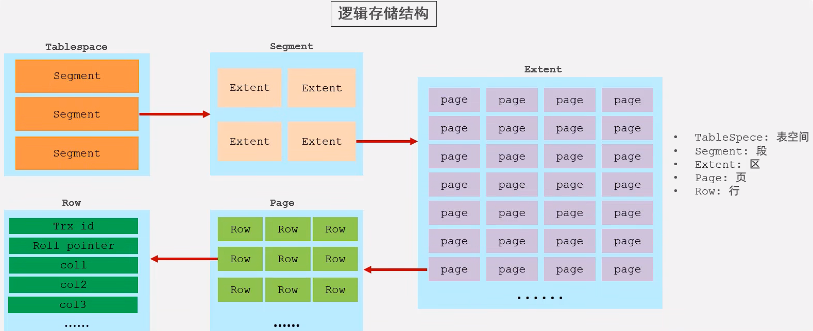
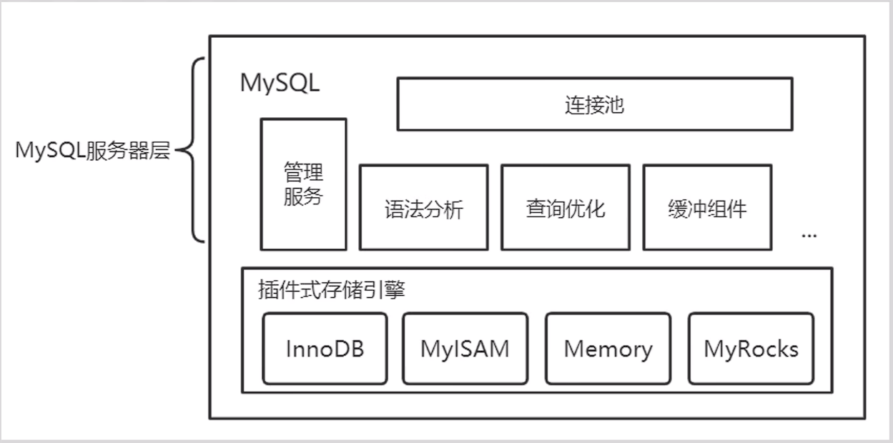
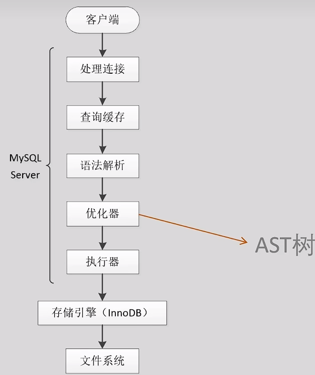
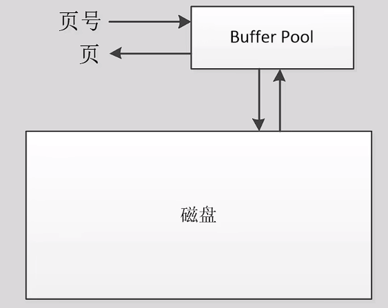
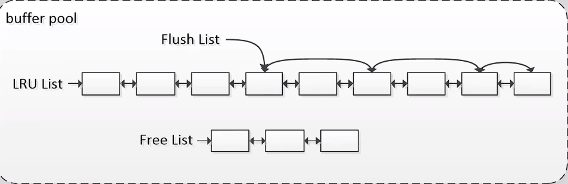
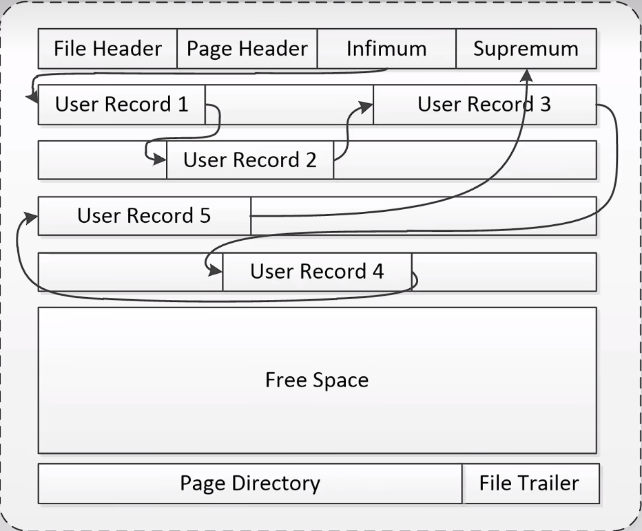
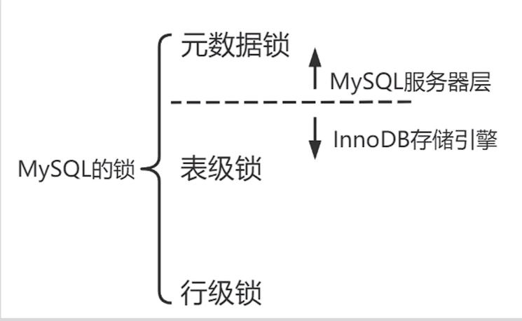
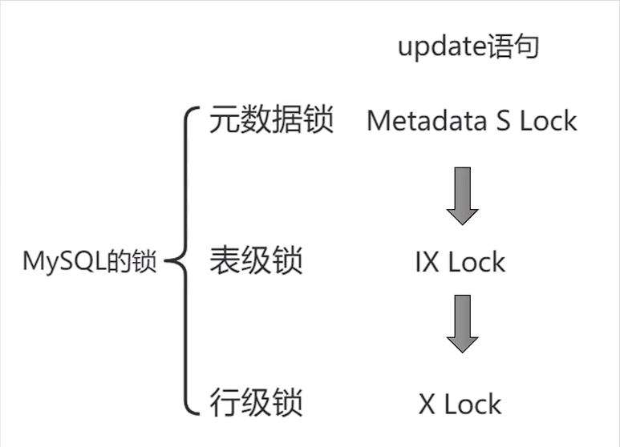
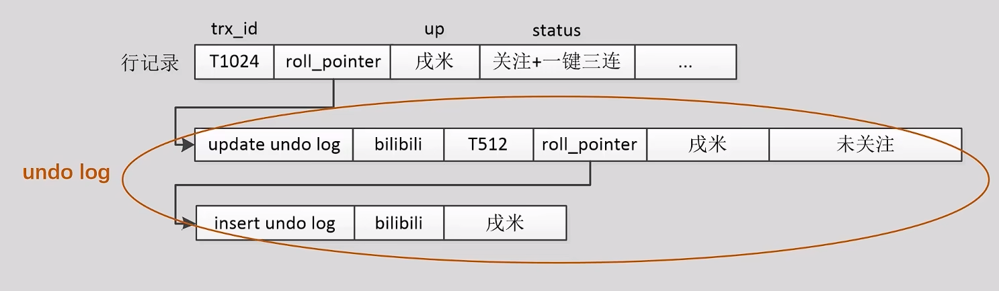

# MySQL InnoDB执行update语句过程具体分析

[学习地址](https://www.bilibili.com/video/BV1Tv4y1o7tA/?vd_source=af8b97e6370b709224731e8addba379d)

## 存储引擎

MySQL中有许多不同类型的存储引擎

存储引擎是存储数据，建立索引，更新查询数据等技术的实现方式

在MySQL5.5之后都默认使用InnoDB作为存储引擎

存储引擎基于表，同一数据库中的不同表可以使用不同的存储引擎

## update语句

~~~sql
start transaction;
update bilibili set status='关注+一键三连' where id='NEUQ'；
commit;
//ststus字段原本为 "未关注"
~~~

主键为id，要修改status列的数据

## InnoDB逻辑存储结构

套娃式分级，从最大到最小分别为

- TableSpace表空间
  - Segment段
    - Extent区
      - Page页
        - Row行
          - 最后操作的事务的id
          - 指针
          - 字段

page页是InnoDB中磁盘操作的最小单元，大小固定为16k

## MySQL组成

数据库连接池、sql接口、查询解析和优化、二进制日志、存储过程、触发器、试图和一些管理服务等功能都是由MySQL服务器层负责

二进制日志一般称为binlog，是MySQL体系中的逻辑日志

存储引擎主要负责数据在磁盘和内存上的存储、检索和管理，并向服务器层提供数据操作接口

redo log和undolog都是在存储引擎中实现的

## 1.开启事务

默认情况下autocommit=1，即要是我们没有开启事务和commit语句而只执行update语句，则MySQL会隐式地开启一个事务，并自动提交

若是我们先执行了

- set autocommit=0;
- begin;
- start transaction;

则执行完成后不会自动提交，需要手动commit或者rollback

不管哪种方式，MySQL都会在事务内执行第一次增删改操作时，给事务分配一个事务号。

为方便分析，假设该事务的事务号为**1024**

## 2.SQL解析、查询计划生成

事务开启后，update下发到MySQL正式开始执行

先来分析服务器层的执行过程

1. MySQL服务器层从连接中读取命令，通过词法分析、语法分析、查询优化等步骤生成一个AST树
2. AST树就是我们需要的物理执行计划
3. 执行器按照执行计划，调用InnoDB存储的接口来执行update语句

之前的版本中都有查询缓存，若是执行缓存中相同的语句可以直接使用

但是由于不好维护，所以5.7版本后默认禁用，8.0版本之后直接被删除了

## 3. 查询要修改的数据

想要修改数据，得先把数据给查出来，所以需要先查询要修改的数据

需要在InnoDB buffer pool即缓存池和磁盘中进行一些列操作

InnoDB对磁盘和buffer pool的读取都是以**页**为单位

定位一个页：**表空间号+页号**

具体的过程：

1. 表空间号和页号传到buffer pool
2. buffer pool判断这个页是否在buffer pool中
3. 在的话直接返回这个页
4. 不在的话从磁盘中加载这个页到buffer pool中，再返回

### B+树

[b+树详解](https://blog.csdn.net/qq_45814695/article/details/117171536)

1. 类似二叉搜索树
2. B+ 树一个节点相当于是一个页，非叶子节点上是不存储数据的，仅存储键值，只有叶子节点会存储数据。
3. B+ 树索引的所有数据均存储在叶子节点，而且数据是按照顺序排列的。

**寻找数据的过程：**根据页号获取B+树的根节点，然后解析根节点这个索引页，通过条件比较，找到下一层节点的页号，直到找到根节点，解析数据页，获取想要的数据。

读取时会对读取到的子树加latch闩锁，实现并发控制

### buffer pool

连续的内存区域，逻辑结构是一个个缓冲页连接起来的链表（实际上是和缓冲页对应的控制块连接起来的链表）

缓冲到buffer pool中的页被称为**缓冲页**

> 主要由三条链组成

1. Free List：空闲链，主要负责管理未被使用的缓冲池空间
2. LRU List：最近最少使用链，主要负责在缓冲池满时淘汰缓冲页
   - 这里最近最少使用通关算法决定
   - 可以说所有加载到buffer pool中的页都位于LRU List之中
3. Flush List：脏链，主要负责管理要被刷新到磁盘的页
   - 修改后的页不会立即落盘，而是会先作为脏页在内存中保留一段时间，后台线程周期性将他们刷入磁盘
   - Flush List一定在LRU List之中

还有很多其他链，一般不会用到

> 寻找页

为了在缓冲池中快速寻找页，mysql建立了一个哈希表

> buffer pool中查找过程

1. 拿页号在buffer pool中读取，会通过哈希表扫描buffer pool
2. 命中，则直接读取缓冲页
3. 未命中，在磁盘中找到页
4. 若Free List有空白页，则将数据页加载到这个空白页，并从Free List转移到LRU List
5. 若Free List无空白页，则先执行LRU算法，在加载

### 页的结构

有很多种也得结构，这里相关的主要是数据页和索引页

- 各行记录在页中的排列是乱序的，通过链表连接起来实现有序
- 头指针是Infimum，尾指针是Suprermum
- 查找数据时，page directory可以进行二分查找
  - page directory中分为许多槽，每个槽中都可以包含好几条记录，槽和槽中的数据都是按照顺序排列的

### 行的格式

目前共有四种行格式

COMPACT，REDUNDANT，DYNAMIC，COMPRESSED

mysql5.7之后默认的行格式时DYNAMIC

- 变长字段列表：记录一些类似varchar等变长类型的列的信息
- NULL值列表：记录可以为NULL的列的信息
- 记录头信息：记录该行数据的一些额外信息，如deleted_flag，用来标识记录是否被删除
- trx_id：记录最近更新这行记录的事务号
- roll_pointer：一个指向undo log的指针，指向这条记录的上一个版本
- trx_id和roll_pointer：MySQL自动生成的隐藏列，主要用于实现MVCC

> 页中查找过程

1. 通过page directory查找到数据所在的组
2. 从组中最小的记录开始查找，通过每个记录的next_record属性向后遍历，直到找到
3. 通过行记录格式解析这行记录的内容

## 4.校验锁和加锁

mysql的锁主要有以下三种

再执行update这条语句时：

- 首先会在服务器层获取表的元数据读锁 Metadata S Lock
- 然后再InnoDB存储引擎层上表的意向排他锁 IX Lock
- 最后上指定的行记录的行级X lock，即排他锁

> 加锁过程中可能会被阻塞

在加元数据锁时可能会被DDL操作所加的锁阻塞，但是时间非常短

对一条记录加锁的本质就是在内存结构中创建一个锁结构与之关联

在获取元数据锁和行锁后就会对 id='NEUQ' 这行数据进行行锁的校验，即查看有没有上锁（有没有对应的内存结构）

- update遇到其他锁的话会被阻塞，其他的锁释放后会有一个线程来唤醒它
- 若没有，则直接生成对应的内存结构，即上锁

## 5.修改数据和生成日志

上锁后就可以对数据进行修改

InnoDB引擎在这步主要写三部分内容

### 数据页（缓冲页）

InnoDB中对数据的修改操作可以分为两类：

- 修改前后这行数据的大小完全没变：就地更新
- 任何字段的大小发生了改变：插入一条新纪录，删除旧记录

不但要修改数据，还要修改两个隐藏列

- status：`"未关注"`  ->  `"关注+一键三连"`
- trx_id：512  ->  1024
- roll_pointer：指向undo log

### undo log

记录页修改前的结果，主要用来进行回滚和MVCC

undo log记录的是事务T改变了元素X，而X原来的值是v，这样的一个<T,X,v>三元组

**回滚：**

undo log分为insert undo log和update undo log两种：

- 回滚insert操作，只需要把它删除即可，insert undo log只需要记录插入数据的主键即可

  

- 回滚update\delete操作，需要回到从前，update undo log需要完整记录操作前的数据

  

**MVCC：**

[理解MySQL的MVCC及实现原理](https://blog.csdn.net/SnailMann/article/details/94724197?ops_request_misc=%7B%22request%5Fid%22%3A%22167229072016800192294417%22%2C%22scm%22%3A%2220140713.130102334..%22%7D&request_id=167229072016800192294417&biz_id=0&utm_medium=distribute.pc_search_result.none-task-blog-2~all~top_positive~default-1-94724197-null-null.142^v68^pc_rank_34_queryrelevant25,201^v4^add_ask,213^v2^t3_control1&utm_term=MVCC&spm=1018.2226.3001.4187)

全称 `Multi-Version Concurrency Control` ，即多版本并发控制。

MVCC 在 MySQL InnoDB 中的实现主要是为了提高数据库并发性能，用更好的方式去处理读-写冲突，做到即使有读写冲突时，也能做到不加锁，非阻塞并发读

简单来说，mysql的MVCC就是使得我们读到的可能是之前的版本，以此来避免读写冲突

mysql的MVCC机制是由undo log来实现的：

- 版本链

  - 行的roll_pointer指向undo log，这个undo log就是这行记录之前的状态
  - 若该undo log是update undo log的话，它会继续指向前序的undo log，直到以insert undo log结尾
  - 当前行记录和它对应的undo log通过roll_Pointer指针共同构成了一个链表结构，称为**版本链**

  

实现MVCC的方式：

- 查询语句执行前，生成一个ReadView，也称作“一致性试图”，ReadView包含了当前活跃事务的trx_id信息
- 在执行查询时，把查询到的数据行中的trx_id和ReadView进行比较
- 如果数据的trx_id是当前正在活跃或者在生成ReadView时还未被分配的，并且也不是当前查询事务本身，就说明当前事务不能读取这行数据
- 接下来就需要追溯版本链，直至找到可以读取的数据

生成的undo log会写到undo log buffer中，等待后续的落盘

### redo log

记录页修改后的结果，用来做WAL，替代脏页落盘，应对宕机故障

redo log记录的时事务T改变了元素X，而X原来的值是v，这样一个<T,X,v>三元组

- type：redo log的类型，8.0版本中有65种
- space ID：表空间号
- page number：页号
- data：把页中哪个位置修改成了哪些值

修改一条数据时，会发生很多相关的改变，比如页中的链表顺序，各条记录的指针，page directory等都会发生改变

redo log可以直接记录一个页的所有变化，但是这样redo log就会过于臃肿，**所以设计了65种redo log**，用来记录不同的改变

总之，我们的update语句会生成许多个小的redo log，我们把这些redo log称为一个**组**

一个组的redo log有一个基本要求：一个组的redo log具有**原子性**，要么都写入成功，要么都写入失败

一个**MTR（Mini_TRANSACTION）**可以包含一组redo log，无论是写入还是恢复时都要保证这组redo log的原子性

组的最后，会有一种特殊类型的redo log被生成并写入，恢复时，也只有检测到这个特殊的redo log，才认为这个组是完整的

生成好一个个redo log后，就要把他们存入到log buffer中，作为写入磁盘的缓冲

log buffer是一块连续空间，默认大小未16MB，由多个512B的Block组成（类似页）

redo log还有一个全局递增的日志序列号，**LSN（Log Sequence Number）**

用来标记redo log buffer的位置，每次都会以MTR为单位进行增长

两类LSN：

- buf_free标记最新生成的redo log的位置
- buf_next_to_write标记最新未落盘的redo log的位置

sql执行完成后，事务提交前，redo log不需要落盘

原因：修改后的数据页、redo log，undo log和binlog此时都在内存中未落盘，所以若此时崩溃，则所有的信息都会丢失，相当于是这条sql从未执行过或者回滚了，也不用考虑恢复它

但是还是会有原因导致redo log落盘

- log buffer空间不足（低于50%）时
- 后台线程周期性刷log buffer
- mysql服务正常关闭时
- 做checkpoint时

若事务未提交，但是却由于以上原因落盘了，反而比较麻烦

因为对这些redo log进行恢复会造成对未提交事务的脏页的恢复，对这种情况需要特殊处理

这三者在这一步都是不需要落盘的

Write Ahead Log：

- 针对数据页和undo log的改动或者写入，都会生成对应的redo log
- 若数据页或者undo log要在提交前落盘，相应的redo log一定要先落盘
- 而redo log可以直接落盘，不用管数据页和undo log

恢复的过程：

- 从磁盘上的checkpoint_lsn位置开始读取redo log，来恢复脏页和undo log
- 然后通过undo log把所有未提交事务的脏页进行回滚
- 由此就能保证所有已提交的事务都没丢失数据，所有未提交数据都回滚了

## 6.本地提交

只有完成了commit，这个update才真正的持久化了下来

对于InnoDB，提交过程真正要写入的只有redo log

redo log落盘步骤：

MySQL8.0.30之前，redo日志文件默认由两个，ib_logfile0和ib_logfile1，两个日志文件会交替进行写入

MySQL8.0.30，对redo log进行了重构，允许redo log空间的动态修改

提交阶段不仅要把InnoDB处的redo log落盘，还需要把服务器层的binlog落盘

binlog在事务执行阶段就会生成，只不过它不属于InnoDB存储引擎

### binlog

一个非常好用的逻辑日志，在逻辑备份和主备复制的场景下都能发挥重要作用

大部分的其他数据库没有binlog，由redo log实现其功能

MySQL也可以这样做以实现更高的性能

MySQL采用了一种内部XA事务的机制保证binlog和redo log的状态和顺序都一致

XA（eXtended Architecture），核心是两阶段提交（2PC）

- 两阶段提交协议包含一个协调者和若干个参与者
- XA事务中，binlog担任协调者，redo log担任参与者

> XA事务

事务提交前，事务状态未TRC_ACTIVE

1. prepare阶段
   - InnoDB刷redo log到磁盘，redo log落盘完成后，修改事务状态未TRX_PREPARED
   - prepare如果失败，那么事务会回滚，而prepare成功后，就进入两阶段提交的commit阶段
2. commit阶段
   - MySQL服务器层写入binlog，写入完成后，修改事务状态未TRX_NOT_STARTED，事务的提交就算完成

mysql8.0之前，可以自己决定是否开始内部XA事务，8.0之后已经强制开启

### 物理落盘策略

主要由以下两个变量控制：

1. innodb_flush_log_at_trx_commit：可选值为0，1，2，0表示每秒进行一次刷新，1表示每次提交事务都会进行落盘，2表示每次事务提交会把redo log缓冲写入操作系统缓冲，每秒刷盘
2. sync_binlog：控制binlod落盘，可选值为0，1，0表示每次提交事务，不刷binlog，1表示每次提交事务，都会立刻写binlog到磁盘

MySQL8.0默认值否设置为1

## 7.主备复制

如果我们设置了主从策略，此时还需要根据我们的同策略判断是否符合提交成功的条件

MySQL目前的主从同步机制

- 主库写入binlog之后，备库的IO线程会读取主库的binlog，并转储为本地的中继日志（relay log）
- 备库上的SQL线程会读取relay log并在本地执行

主从复制策略：

- 异步复制：主库写完binlog后即可返回提交成功，无需等待备库响应
- 半同步复制：主库接收到指定数量的备机转出relay log成功的ACK后可返回提交成功
- 同步复制：主库等到备库回放relay log执行完事务之后才可返回提交成功

半同步复制兼顾高可用和性能，一般较为常用

## 8.返回并提交成功

若备机长时间未响应，主机会自己提交，退化为异步复制

在完成主备复制后就可以返回并提交成功

## 9.脏页刷入磁盘

如果写一个页时，只写了一半，系统发生了宕机

MySQL设计了两次写（double write）机制

- 先把脏页都复制到doublewrite buffer中
- 然后doublewrite buffer先落盘，而后脏页在落盘
- 恢复时，先用doublewrite中的页覆盖磁盘中的页，在进一步用redo log恢复

