# Docker

用于解决软件跨环境迁移问题

同一个软件正在不同版本的运行环境中会有不同的结果，被称为“水土不服”

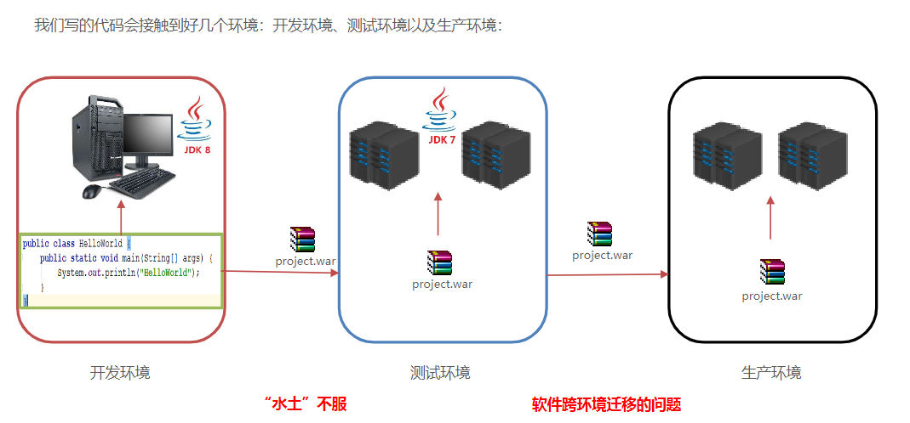


使用docker容器可以解决此类问题，将代码和环境一起发送

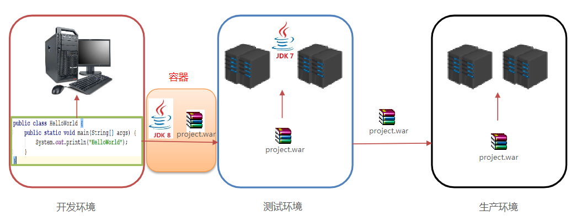


## Docker 概念

**docker是一种容器技术，可以解决软件跨环境迁移的问题**

- Docker 是一个开源的应用容器引擎
- 诞生于 2013 年初，基于 Go 语言实现， dotCloud 公司出品（后改名为Docker Inc）
- Docker 可以让开发者打包他们的应用以及依赖包到一个轻量级、可移植的容器中，然后发布到任何流行的Linux 机器上。
- 容器是完全使用沙箱机制，相互隔离，可以同时启动好几个容器
- 容器性能开销极低。
- Docker 从 17.03 版本之后分为 CE（Community Edition: 社区版） 和 EE（Enterprise Edition: 企业版）


## 安装docker

Docker可以运行在MAC、Windows、CentOS、UBUNTU等操作系统上，本课程基于CentOS 7 安装Docker。官网：https://www.docker.com


linux安装：依次执行以下去命令即可

~~~bash
# 1、yum 包更新到最新 
yum update
# 2、安装需要的软件包， yum-util 提供yum-config-manager功能，另外两个是devicemapper驱动依赖的 
yum install -y yum-utils device-mapper-persistent-data lvm2
# 3、 设置yum源
yum-config-manager --add-repo https://download.docker.com/linux/centos/docker-ce.repo
# 4、 安装docker，出现输入的界面都按 y 
yum install -y docker-ce
# 5、 查看docker版本，验证是否验证成功
docker -v
~~~


## docker架构

- 镜像（Image）：Docker 镜像（Image），就相当于是一个 root 文件系统。比如官方镜像 ubuntu:16.04 就包含了完整的一套 Ubuntu16.04 最小系统的 root 文件系统。
- 容器（Container）：镜像（Image）和容器（Container）的关系，就像是面向对象程序设计中的类和对象一样，镜像是静态的定义，容器是镜像运行时的实体。容器可以被创建、启动、停止、删除、暂停等。
- 仓库（Repository）：仓库可看成一个代码控制中心，用来保存镜像。

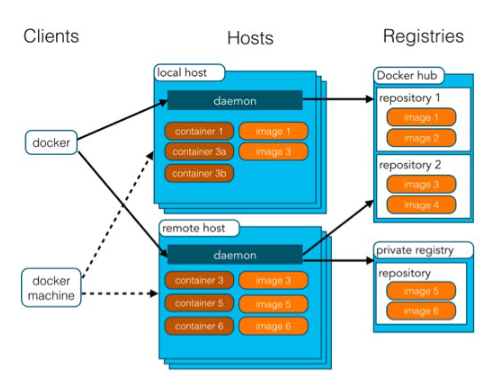


## 配置docker镜像加速器

默认情况下，将来从docker hub（https://hub.docker.com/）上下载
docker镜像，太慢。一般都会配置镜像加速器：

- USTC：中科大镜像加速器（https://docker.mirrors.ustc.edu.cn）

最简单的方式：阿里云，会直接给安装命令

浏览器->阿里云->控制台->左上角三横杆->搜索镜像->容器镜像服务->镜像工具->镜像加速器->下边会生成代码（记得选择操作系统）

不同的用户的下载地址都不一样

~~~bash
sudo mkdir -p /etc/docker
sudo tee /etc/docker/daemon.json <<-'EOF'
{
  "registry-mirrors": ["https://m9s7dua2.mirror.aliyuncs.com"]
}
EOF
sudo systemctl daemon-reload
sudo systemctl restart docker
~~~


使用以下命令可以查看是否配置成功

~~~bash
cat /etc/docker/daemon.json
~~~

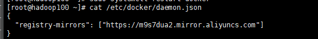


## docker命令

### 服务相关命令

即操作daemon的命令

- 启动docker服务
- 停止docker服务
- 重启docker服务
- 查看docker服务状态
- 开机启动docker服务

全部都可以使用systemctl系列的命令

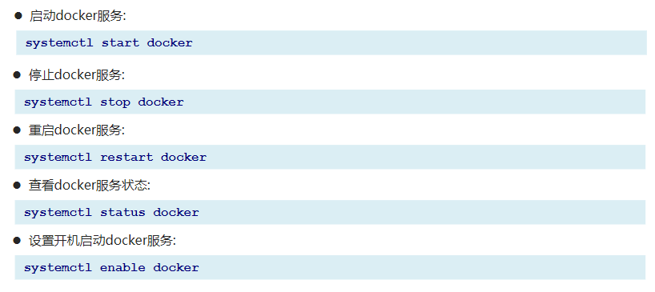


### 镜像(image)相关命令

即对image的操作

- 查看镜像

  ~~~bash
  docker images
  docker images –q # 查看所用镜像的id
  ~~~

  会出现5列信息，第一行是表头，下边是表的内容

  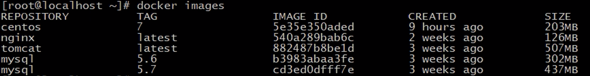

  - repository，仓库，即镜像的名称
  - tag，版本号
  - image id，标识符删除时会用到
  - created，创建时间
  - size，镜像大小

- 搜索镜像

  在远程仓库中搜索是否有所需的镜像

  ~~~bash
  docker search 镜像名称
  ~~~

- 拉取镜像

  从Docker仓库下载镜像到本地，镜像名称格式为 名称:版本号，如果版本号不指定则是最新的版本。如果不知道所需的镜像版本是否有，可以去[Docker Hub](https://hub.docker.com/)搜索对应镜像查看，描述信息中有

  ~~~bash
  docker pull 镜像名称
  ~~~

  

- 删除镜像

  ~~~bash
  docker rmi 镜像id # 删除指定本地镜像
  docker rmi 镜像名:版本号 # 删除指定本地镜像
  docker rmi `docker images -q` # 删除所有本地镜像
  ~~~

  

### 容器(container)相关命令

容器是镜像的物理文件运行出来的实例

- 查看容器

  ~~~bash
  docker ps # 查看正在运行的容器
  docker ps –a # 查看所有容器
  docker ps –aq # 查看所有容器的id
  ~~~

- 创建并进入容器

  ~~~bash
  docker run 参数 镜像名 目录
  # docker run -it --name=cl centos:7 /bin/bash
  # 以上命令相当于进入了另一个centos系统
  # -it 相当于是 -i -t组合起来，name后边的等号也可以使用空格
  ~~~

  - -i：保持容器运行。通常与 -t 同时使用。加入it这两个参数后，容器创建后自动进入容器中，退出容器后，容器自动关闭。

  - -t：为容器重新分配一个伪输入终端，通常与 -i 同时使用。

  - -d：以守护（后台）模式运行容器。创建一个容器在后台运行，需要使用docker exec 进入容器。退出后，容器不会关闭。

    ~~~bash
    docker exec -it c2 /bin/bash
    #进入名为c2的守护模式的容器
    ~~~

  - -it 创建的容器一般称为交互式容器，-id 创建的容器一般称为守护式容器

  - --name：为创建的容器命名

  - /bin/bash：进入容器后直接打开控制容器的终端

  进入容器后可以使用exit退出容器

- 启动容器

  ~~~bash
  docker start 容器名称
  ~~~

- 停止容器

  ~~~bash
  docker stop 容器名称
  ~~~

- 删除容器

  正在启动中的容器无法删除

  ~~~bash
  docker rm 容器名称 # 删除指定容器
  docker rm `docker ps -aq` # 删除所有的容器
  ~~~

- 查看容器信息

  ~~~bash
  docker inspect 容器名称
  ~~~


### 在容器内修改内容

在容器内没有vi和vim，因此想要修改文件内容的话，可以使用以下命令

但是不推荐这种方式，一般使用数据卷

~~~bash
sed -i 's#Welcome to nginx#传智教育欢迎您#g' index.html
sed -i 's#<head>#<head><meta charset="utf-8">#g' index.html
#每条命令最后那个index.html表示要修改的文件
#第一行是将Welcome to nginx改为传智教育欢迎您
#第二行是编码格式改为utf-8支持中文
~~~


## docker容器的数据卷

### 数据卷概念

**数据卷是宿主机中的一个目录(文件夹)或者文件**

在容器之中也创建一个目录，将两个目录挂载起来，则宿主机中的那个目录就成为了数据卷

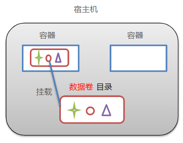

- 数据卷是宿主机中的一个目录或文件
- 当容器目录和数据卷目录绑定后，对方的修改会立即同步
- 一个数据卷可以被多个容器同时挂载
- 一个容器也可以被挂载多个数据卷


**数据卷作用**

- 容器数据持久化
- 外部机器和容器间接通信
- 容器之间数据交换


数据卷操作的基本语法如下：

```sh
docker volume [COMMAND]
```

docker volume命令是数据卷操作，根据命令后跟随的command来确定下一步的操作：

- create 创建一个volume
- inspect 显示一个或多个volume的信息
- ls 列出所有的volume
- prune 删除未使用的volume
- rm 删除一个或多个指定的volume


### 数据集操作命令

数据卷操作的基本语法如下：

```sh
docker volume [COMMAND]
```

docker volume命令是数据卷操作，根据命令后跟随的command来确定下一步的操作：

- create 创建一个volume
- inspect 显示一个或多个volume的信息
- ls 列出所有的volume
- prune 删除未使用的volume
- rm 删除一个或多个指定的volume


### 创建和查看数据卷

**需求**：创建一个数据卷，并查看数据卷在宿主机的目录位置

① 创建数据卷

```sh
docker volume create html
```


② 查看所有数据

```sh
docker volume ls
```

结果：


③ 查看数据卷详细信息卷

```sh
docker volume inspect html
```

结果：


可以看到，我们创建的html这个数据卷关联的宿主机目录为`/var/lib/docker/volumes/html/_data`目录。


**小结**：

数据卷的作用：

- 将容器与数据分离，解耦合，方便操作容器内数据，保证数据安全

数据卷操作：

- docker volume create：创建数据卷
- docker volume ls：查看所有数据卷
- docker volume inspect：查看数据卷详细信息，包括关联的宿主机目录位置
- docker volume rm：删除指定数据卷
- docker volume prune：删除所有未使用的数据卷


### 数据卷挂载

启动容器时使用-v设置参数即可挂载数据卷（若没有提前创建数据卷则会自动创建）

~~~bash
docker run ... –v 宿主机目录(文件夹):容器内目录(文件夹) ...
~~~

注意事项：

1. 目录必须是绝对路径
2. 如果目录（数据卷）不存在，会自动创建
3. 可以挂载多个数据卷


下面命令就可以创建一个容器，他的/root/data_container和宿主机的/root/data挂载在一起

~~~bash
docker run -it --name=c1 -v /root/data:/root/data_container centos:7 /bin/bash
~~~

- 修改/root/data目录中文件（如新建一个txt），都会同步到/root/data_container之中，反之亦然
- 关闭容器后，宿主机内的数据卷并不会消失，下次再有容器连接到该数据卷时会直接同步

挂载两个容器则打两个-v部分即可

~~~bash
docker run -it --name=c1 -v /root/data1:/root/data_container1 -v /root/data2:/root/data_container2 centos:7 /bin/bash
~~~


### 三种挂载

挂载一般有三种

- 数据卷挂载：宿主机目录 --> 数据卷 ---> 容器内目录
- 目录挂载：宿主机目录 ---> 容器内目录
- 文件挂载：宿主机文件 --> 容器内文件


[Docker的数据卷挂载、目录挂载、文件挂载](https://blog.csdn.net/weixin_43721000/article/details/123519834)

**语法**：

三者语法都是是类似的：

- -v [数据卷名称]:[容器内目录]
- -v [宿主机目录]:[容器内目录]
- -v [宿主机文件]:[容器内文件]


数据卷挂载与目录直接挂载的

- 数据卷挂载耦合度低，由docker来管理目录，但是目录较深，不好找
- 目录挂载耦合度高，需要我们自己管理目录，不过目录容易寻找查看

目录和数据卷本质上都是宿主机内的目录，只不过数据卷是通过数据卷命令创建，由docker管理，目录由自己创建，自己进行管理


### 数据卷容器

多容器进行数据交换有两种方法

- 多个容器挂载同一个数据卷
- 数据卷容器


数据卷容器即**其他容器继承自该容器**

- 创建一个容器，挂载一个目录，让**其他容器继承自该容器**( --volume-from )。
- 通过简单方式实现数据卷配置


c1和c2直接挂载在c3上，这样之后他们两个不仅和c3的数据卷挂载上了，还会相应的·宿主机中的数据卷挂载上

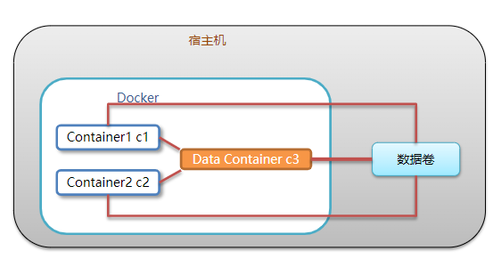


### 配置数据卷容器

> 创建启动c3数据卷容器，使用 –v 参数 设置数据卷

在这一步中没有指定宿主机的数据卷目录，会自动创建一个宿主机内的数据卷并将/volume与其挂载上

~~~bash
docker run –it --name=c3 –v /volume centos:7 /bin/bash
~~~


>创建启动 c1 c2 容器，使用 –-volumes-from 参数 设置数据卷

~~~bash
docker run –it --name=c1 --volumes-from c3 centos:7 /bin/bash
docker run –it --name=c2 --volumes-from c3 centos:7 /bin/bash
~~~


## Docker 应用部署

### 1.部署MySQL

1. 搜索mysql镜像

```shell
docker search mysql
```

2. 拉取mysql镜像

```shell
docker pull mysql:5.6
```

3. 创建容器，设置端口映射、目录映射

```shell
# 在/root目录下创建mysql目录用于存储mysql数据信息
mkdir ~/mysql
cd ~/mysql
```

```shell
#\表示当前命令未打完，换到下一行继续打
docker run -id \
-p 3307:3306 \
--name=c_mysql \
-v $PWD/conf:/etc/mysql/conf.d \
-v $PWD/logs:/logs \
-v $PWD/data:/var/lib/mysql \
-e MYSQL_ROOT_PASSWORD=123456 \
mysql

docker run -id -p 3306:3306 --name=c_mysql -v $PWD/conf:/etc/mysql/conf.d -v $PWD/logs:/logs -v $PWD/data:/var/lib/mysql -e MYSQL_ROOT_PASSWORD=root mysql
```

- 参数说明：
  - **-p 3307:3306**：将容器的 3306 端口映射到宿主机的 3307 端口。（一般都用一样的，这里是为了方便区分）
  - **-v $PWD/conf:/etc/mysql/conf.d**：将主机当前目录下的 conf/my.cnf 挂载到容器的 /etc/mysql/my.cnf。配置目录，$PWD可以代替当前所在的目录
  - **-v $PWD/logs:/logs**：将主机当前目录下的 logs 目录挂载到容器的 /logs。日志目录
  - **-v $PWD/data:/var/lib/mysql** ：将主机当前目录下的data目录挂载到容器的 /var/lib/mysql 。数据目录
  - **-e MYSQL_ROOT_PASSWORD=123456：**初始化 root 用户的密码。


4. 修改mysql设置，输入密码进入mysql，执行下列命令

   新版的mysql进行了密码加密，使得sqlyog会报2058的错误

   [sqlyog报错2058](https://blog.csdn.net/qq_22325259/article/details/115905077?ops_request_misc=&request_id=&biz_id=102&utm_term=sqlyog%202058&utm_medium=distribute.pc_search_result.none-task-blog-2~all~sobaiduweb~default-1-115905077.nonecase&spm=1018.2226.3001.4187)

   ~~~sql
   ALTER USER 'root'@'localhost' IDENTIFIED WITH mysql_native_password BY 'root';
   
   ALTER USER 'root'@'%' IDENTIFIED WITH mysql_native_password BY 'root';
   
   /*中间使用localhost还是%需要使用两个语句进行查询*/
   use mysql
   select user,host from user
   /*看root对应的是啥就用哪个*/
   ~~~

   

5. 进入容器，操作mysql

```shell
docker exec -it c_mysql /bin/bash

mysql -uroot -p #需要先输入密码登陆mysql
```

6. 使用外部机器连接容器中的mysql


### 2.部署Tomcat

1. 搜索tomcat镜像

```shell
docker search tomcat
```

2. 拉取tomcat镜像

```shell
docker pull tomcat
```

3. 创建容器，设置端口映射、目录映射

```shell
# 在/root目录下创建tomcat目录用于存储tomcat数据信息
mkdir ~/tomcat
cd ~/tomcat
```

```shell
docker run -id --name=c_tomcat \
-p 8080:8080 \
-v $PWD:/usr/local/tomcat/webapps \
tomcat 
```

- 参数说明：

  - **-p 8080:8080：**将容器的8080端口映射到主机的8080端口

    **-v $PWD:/usr/local/tomcat/webapps：**将主机中当前目录挂载到容器的webapps


4. 使用外部机器访问tomcat

   （需要先将html文件放入tomcat文件夹，8080所对应的文件夹就是tomcat文件夹）


### 3.部署Nginx

1. 搜索nginx镜像

```shell
docker search nginx
```

2. 拉取nginx镜像

```shell
docker pull nginx
```

3. 创建容器，设置端口映射、目录映射


```shell
# 在/root目录下创建nginx目录用于存储nginx数据信息
mkdir ~/nginx
cd ~/nginx
mkdir conf
cd conf
# 在~/nginx/conf/下创建nginx.conf文件,粘贴下面内容
vim nginx.conf
```

```shell
user  nginx;
worker_processes  1;

error_log  /var/log/nginx/error.log warn;
pid        /var/run/nginx.pid;


events {
    worker_connections  1024;
}


http {
    include       /etc/nginx/mime.types;
    default_type  application/octet-stream;

    log_format  main  '$remote_addr - $remote_user [$time_local] "$request" '
                      '$status $body_bytes_sent "$http_referer" '
                      '"$http_user_agent" "$http_x_forwarded_for"';

    access_log  /var/log/nginx/access.log  main;

    sendfile        on;
    #tcp_nopush     on;

    keepalive_timeout  65;

    #gzip  on;

    include /etc/nginx/conf.d/*.conf;
}


```


```shell
docker run -id --name=c_nginx \
-p 80:80 \
-v $PWD/conf/nginx.conf:/etc/nginx/nginx.conf \
-v $PWD/logs:/var/log/nginx \
-v $PWD/html:/usr/share/nginx/html \
nginx
```

- 参数说明：
  - **-p 80:80**：将容器的 80端口映射到宿主机的 80 端口。
  - **-v $PWD/conf/nginx.conf:/etc/nginx/nginx.conf**：将主机当前目录下的 /conf/nginx.conf 挂载到容器的 :/etc/nginx/nginx.conf。配置目录
  - **-v $PWD/logs:/var/log/nginx**：将主机当前目录下的 logs 目录挂载到容器的/var/log/nginx。日志目录

4. 使用外部机器访问nginx


### 4.部署Redis

1. 搜索redis镜像

```shell
docker search redis
```

2. 拉取redis镜像

```shell
docker pull redis
```

3. 创建容器，设置端口映射

```shell
docker run -id --name=c_redis -p 6379:6379 redis
```

4. 使用外部机器(windows10)连接redis

   进入redis文件夹运行下面的命令

```shell
redis-cli.exe -h 192.168.234.100 -p 6379
```


## dockerfile

是一种创建镜像的方法

### docker镜像原理

linux文件系统由bootfs和rootfs两部分组成

- bootfs：包含bootloader（引导加载程序）和 kernel（内核）
- rootfs： root文件系统，包含的就是典型 Linux 系统中的/dev，/proc，/bin，/etc等标准目录和文件
- 不同的linux发行版，bootfs基本一样，而rootfs不同，如ubuntu，centos等


**docker镜像原理**

- Docker镜像是由特殊的文件系统叠加而成
- 最底端是 bootfs，并使用宿主机的bootfs
- 第二层是 root文件系统rootfs,称为base image
- 然后再往上可以叠加其他的镜像文件
- 统一文件系统（Union File System）技术能够将不同的层整合成一个文件系统，为这些层提供了一个统一的视角，这样就隐藏了多层的存在，在用户的角度看来，只存在一个文件系统。
- 一个镜像可以放在另一个镜像的上面。位于下面的镜像称为父镜像，最底部的镜像成为基础镜像。
- 当从一个镜像启动容器时，Docker会在最顶层加载一个读写文件系统作为容器（进行修改后可以通过这个容器创建新的镜像）

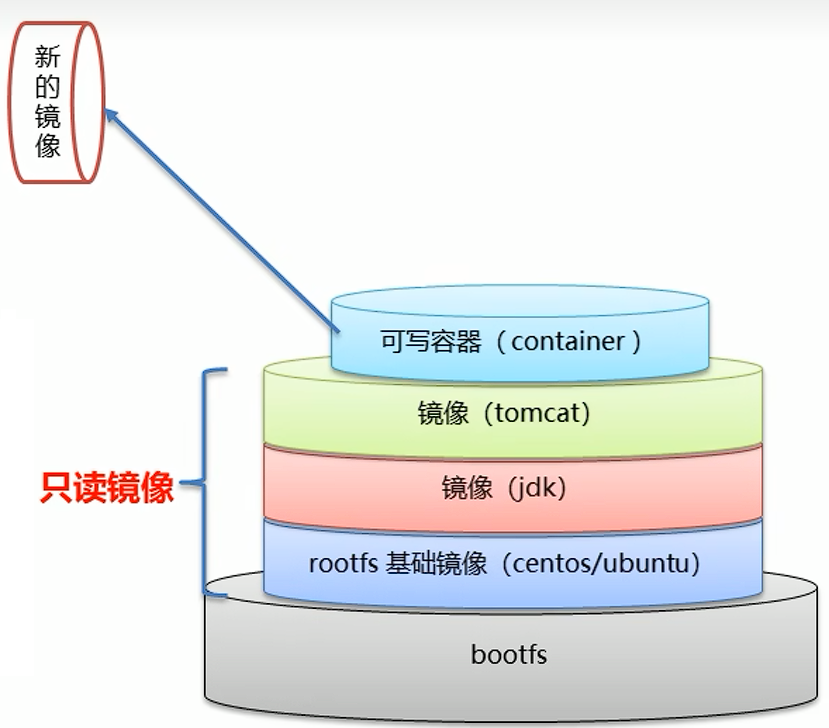


解释了以下问题：

1. Docker 镜像本质是什么？
   - 是一个分层文件系统
2. Docker 中一个centos镜像为什么只有200MB，而一个centos操作系统的iso文件要几个个G？
   - Centos的iso镜像文件包含bootfs和rootfs，而docker的centos镜像复用操作系统的bootfs，只有rootfs和其他镜像层
3. Docker 中一个tomcat镜像为什么有500MB，而一个tomcat安装包只有70多MB？
   - 由于docker中镜像是分层的，tomcat虽然只有70多MB，但他需要依赖于父镜像和基础镜像，所有整个对外暴露的tomcat镜像大小500多MB


### docker镜像的制作

#### 容器转为镜像

> 容器转为镜像

~~~bash
docker commit 容器id 镜像名称:版本号
#docker commit 123 laobuzhang:1.0
#id号可以使用前几位，只要能跟其他容器的id区分开即可
~~~

镜像文件无法直接传输，但是可以打包成压缩文件然后传输


> 将镜像压缩为压缩文件

~~~bash
docker save -o 压缩文件名称 镜像名称:版本号
#docker save -o laobuzhang_tomcat.tar laobuzhang:1.0
~~~


> 解压缩镜像压缩文件

~~~bash
docker load -i 压缩文件名称
#docker load -i laobuzhang_tomcat.tar
~~~


使用这种方法进行制作，得到的镜像只会包含正常修改的文件，不会包含挂载问文件和信息


#### dockerfile

dockerfile也是一种制作镜像的方式


### dockerfile概念

- Dockerfile 是一个文本文件
- 包含了**一条条的指令**
- 每一条指令构建一层，基于基础镜像，**最终构建出一个新的镜像**
- 对于开发人员：可以为开发团队提供一个完全一致的开发环境
- 对于测试人员：可以直接拿开发时所构建的镜像或者通过Dockerfile文件构建一个新的镜像开始工作了
- 对于运维人员：在部署时，可以实现应用的无缝移植


### dockerfile关键字

| 关键字      | 作用                     | 备注                                                         |
| ----------- | ------------------------ | ------------------------------------------------------------ |
| FROM        | 指定父镜像               | 指定dockerfile基于那个image构建                              |
| MAINTAINER  | 作者信息                 | 用来标明这个dockerfile谁写的                                 |
| LABEL       | 标签                     | 用来标明dockerfile的标签 可以使用Label代替Maintainer 最终都是在docker image基本信息中可以查看 |
| RUN         | 执行命令                 | 执行一段命令 默认是/bin/sh 格式: RUN command 或者 RUN ["command" , "param1","param2"] |
| CMD         | 容器启动命令             | 提供启动容器时候的默认命令 和ENTRYPOINT配合使用.格式 CMD command param1 param2 或者 CMD ["command" , "param1","param2"] |
| ENTRYPOINT  | 入口                     | 一般在制作一些执行就关闭的容器中会使用                       |
| COPY        | 复制文件                 | build的时候复制文件到image中                                 |
| ADD         | 添加文件                 | build的时候添加文件到image中 不仅仅局限于当前build上下文 可以来源于远程服务 |
| ENV         | 环境变量                 | 指定build时候的环境变量 可以在启动的容器的时候 通过-e覆盖 格式ENV name=value |
| ARG         | 构建参数                 | 构建参数 只在构建的时候使用的参数 如果有ENV 那么ENV的相同名字的值始终覆盖arg的参数 |
| VOLUME      | 定义外部可以挂载的数据卷 | 指定build的image那些目录可以启动的时候挂载到文件系统中 启动容器的时候使用 -v 绑定 格式 VOLUME ["目录"] |
| EXPOSE      | 暴露端口                 | 定义容器运行的时候监听的端口 启动容器的使用-p来绑定暴露端口 格式: EXPOSE 8080 或者 EXPOSE 8080/udp |
| WORKDIR     | 工作目录                 | 指定容器内部的工作目录 如果没有创建则自动创建 如果指定/ 使用的是绝对地址 如果不是/开头那么是在上一条workdir的路径的相对路径 |
| USER        | 指定执行用户             | 指定build或者启动的时候 用户 在RUN CMD ENTRYPONT执行的时候的用户 |
| HEALTHCHECK | 健康检查                 | 指定监测当前容器的健康监测的命令 基本上没用 因为很多时候 应用本身有健康监测机制 |
| ONBUILD     | 触发器                   | 当存在ONBUILD关键字的镜像作为基础镜像的时候 当执行FROM完成之后 会执行 ONBUILD的命令 但是不影响当前镜像 用处也不怎么大 |
| STOPSIGNAL  | 发送信号量到宿主机       | 该STOPSIGNAL指令设置将发送到容器的系统调用信号以退出。       |
| SHELL       | 指定执行脚本的shell      | 指定RUN CMD ENTRYPOINT 执行命令的时候 使用的shell            |


### dockerfile案例

#### 自定义centos

pull下来的centos不带有vim编辑器，这里自制一个带有vim编辑器的centos系统

~~~bash
FROM centos:7
MAINTAINER laobuzhang <18837409040@163com>
RUN yum install -y vim
#执行安装vim命令
WORKDIR /usr
#定义默认的工作目录
CMD /bin/bash
#定义容器启动执行的命令
~~~


通过dockerfile创建镜像

~~~bash
docker build -f ./centos_dockerfile -t laobuzhang_centos:1 .
~~~

创建容器发现可以使用vim编辑器

~~~bash
docker run -it laobuzhang_cnetos:1
~~~


#### 部署springboot项目

> 将项目打包并传到linux中

在windows中编写好springboot代码

使用maven的package达成jar包

将jar放到/root/docker-files文件夹中


> 编辑dockerfile文件

在/root/docker-files中创建dockerfile文件

~~~bash
vim springboot_dockerfile
~~~

写入以下命令

~~~bash
FROM java:8
#定义父镜像，父镜像相当于是一系列的dockerfile命令，java:8这个父镜像的作用是构建一个java8的环境
MAINTAINER laobuzhang <18837409040@163com>
#作者信息
ADD springboot-hello-0.0.1-SNAPSHOT.jar app.jar
#将当前目录下的springboot-hello-0.0.1-SNAPSHOT.jar添加到容器里边并改名为app.jar
CMD java -jar app.jar
#定义容器启动执行的命令
~~~

> 通过dockerfile创建镜像 

~~~bash
#docker build -f dockerfile文件路径 -t 镜像名称:版本 .
#最后那个点是寻址路径
docker build -f ./springboot_dockerfile -t app .
~~~


> 创建容器

~~~bash
docker run -id -p 8080:8080 app
~~~


> 访问

在Windows中访问192.168.234.100:8080/hello即可

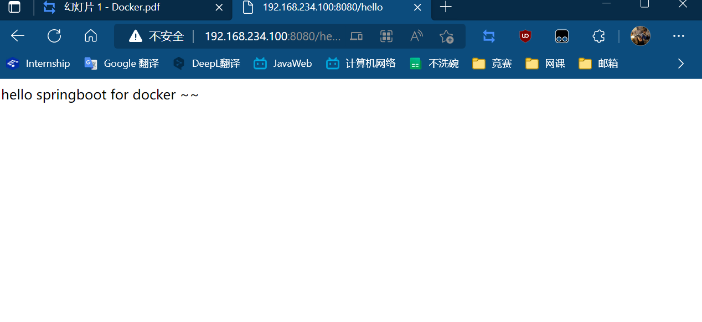


## docker compose

**按照一定的业务规则批量管理容器**


微服务架构的应用系统中一般包含若干个微服务，每个微服务一般都会部署多个实例，如果每个微服务都要手动启停，维护的工作量会很大。

- 要从Dockerfile build image 或者去dockerhub拉取image
- 要创建多个container
- 要管理这些container（启动停止删除）


### docker  compose概念

Docker Compose是一个编排多容器分布式部署的工具，提供命令集管理容器化应用的完整开发周期，包括服务构建，启动和停止。

简单来说就是按照一定的顺序执行dockerfile，然后将他们创建为容器并启动


使用步骤：

1. 利用 Dockerfile 定义运行环境镜像
2. 使用 docker-compose.yml 定义组成应用的各服务
3. 运行 docker-compose up 启动应用

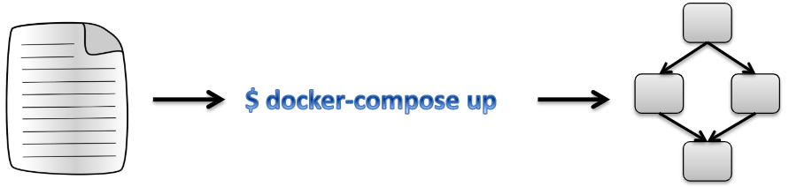


### 

## Docker Compose安装

### 1.安装Docker Compose

```shell
# Compose目前已经完全支持Linux、Mac OS和Windows，在我们安装Compose之前，需要先安装Docker。下面我 们以编译好的二进制包方式安装在Linux系统中。 
sudo curl -L "https://github.com/docker/compose/releases/download/1.28.4/docker-compose-$(uname -s)-$(uname -m)" -o /usr/local/bin/docker-compose
# 设置文件可执行权限 
chmod +x /usr/local/bin/docker-compose
# 查看版本信息 
docker-compose -version
```

### 2.卸载Docker Compose

```shell
# 二进制包方式安装的，删除二进制文件即可
rm /usr/local/bin/docker-compose
```


### 3.使用docker compose编排nginx+springboot项目

1. 创建docker-compose目录

```shell
mkdir ~/docker-compose
cd ~/docker-compose
vim docker-compose.yml
```

2. 编写 docker-compose.yml 文件

```yaml
#第三行和第十一行的两个名字可以自己起
version: '3'
services:
  nginx:
   image: nginx
   ports:
    - 80:80
   links:
    - app
   volumes:
    - ./nginx/conf.d:/etc/nginx/conf.d
  app:
    image: app
    expose:
      - "8080"
```

3. 创建./nginx/conf.d目录

```shell
mkdir -p ./nginx/conf.d
```


4. 在./nginx/conf.d目录下 编写itheima.conf文件

```shell
server {
    listen 80;
    access_log off;

    location / {
        proxy_pass http://app:8080;
    }
   
}
```

5. 在~/docker-compose 目录下 使用docker-compose 启动容器

```shell
docker-compose up
```

6. 测试访问

```shell
http://192.168.149.135/hello
```


## Docker 私有仓库

### 1.私有仓库搭建

```shell
# 1、拉取私有仓库镜像 
docker pull registry
# 2、启动私有仓库容器 
docker run -id --name=registry -p 5000:5000 registry
# 3、打开浏览器 输入地址http://私有仓库服务器ip:5000/v2/_catalog可以查看私有仓库中的镜像列表，看到{"repositories":[]} 表示私有仓库 搭建成功
# 4、修改daemon.json   
vim /etc/docker/daemon.json    
# 在上述文件中添加一个key，保存退出。此步用于让 docker 信任私有仓库地址；注意将私有仓库服务器ip修改为自己私有仓库服务器真实ip
#注意格式，都写在大括号内，中括号间用,分割
"insecure-registries":["私有仓库服务器ip:5000"]
# 5、重启docker 服务 
systemctl restart docker
docker start registry
```

### 2.将镜像上传至私有仓库

```shell
# 1、标记镜像为私有仓库的镜像，类似git中的commit或者add
docker tag centos:7 私有仓库服务器IP:5000/centos:7
 
# 2、上传标记的镜像     
docker push 私有仓库服务器IP:5000/centos:7

```

再次访问http://私有仓库服务器ip:5000/v2/_catalog就可以看到centos7

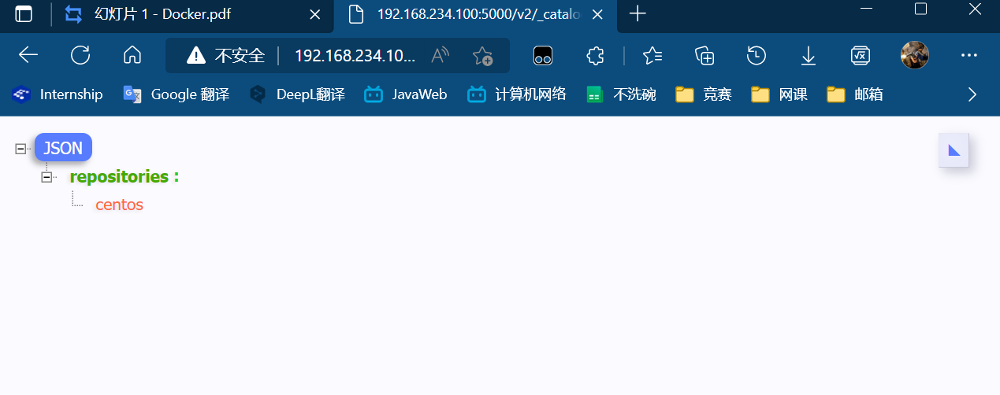

### 3.从私有仓库拉取镜像 

```shell
#拉取镜像 
docker pull 私有仓库服务器ip:5000/centos:7
```


## docker与虚拟机

> docker容器虚拟化 与 传统虚拟机比较

容器就是将软件打包成标准化单元，以用于开发、交付和部署。

- 容器镜像是轻量的、可执行的独立软件包 ，包含软件运行所需的所有内容：代码、运行时环境、系统工具、系统库和设置。
- 容器化软件在任何环境中都能够始终如一地运行。
- 容器赋予了软件独立性，使其免受外在环境差异的影响，从而有助于减少团队间在相同基础设施上运行不同软件时的冲突

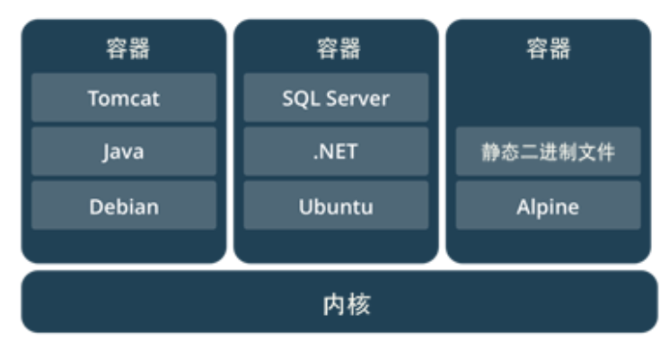


相同：

- 容器和虚拟机具有相似的资源隔离和分配优势

不同：

- 容器虚拟化的是操作系统，虚拟机虚拟化的是硬件。
- 传统虚拟机可以运行不同的操作系统，容器只能运行同一类型操作系统

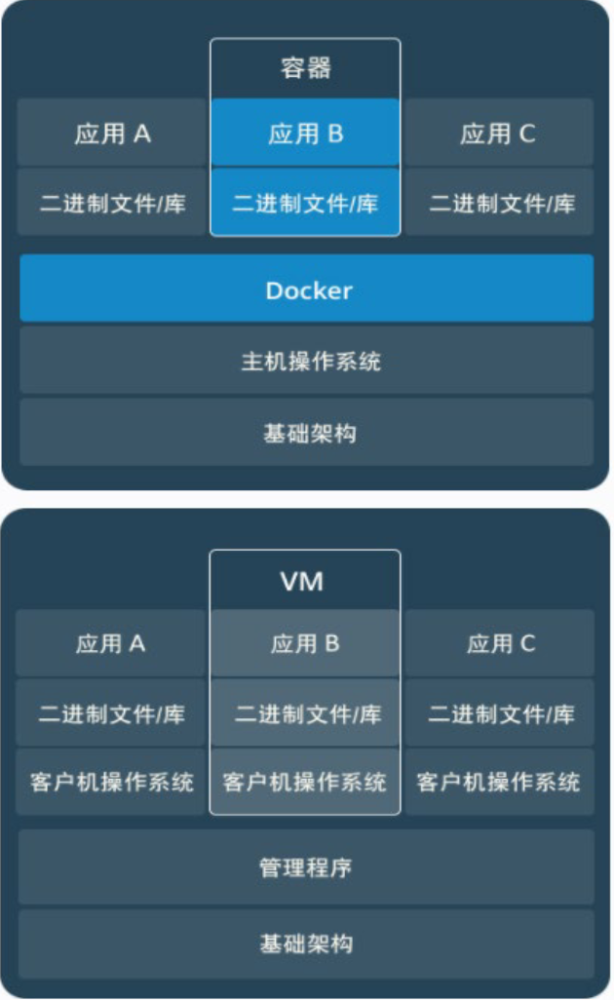

vm比docker还要多虚拟化一个系统


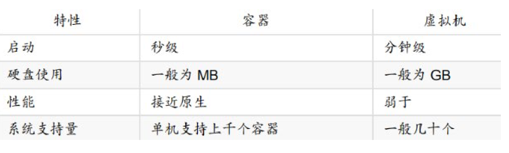