# maven学习笔记

## 1.什么是maven

- maven本质是一个项目管理工具，**将项目**开发和管理过程**抽象成**一个项目**对象**模型（POM）
- POM（project object model）：项目对象模型


## 2.maven作用

- 项目构建

- 依赖管理：管理jar包，并解决冲突

- 构建生命周期/阶段：哪些插件在那些时间使用

- 统一开发结构

  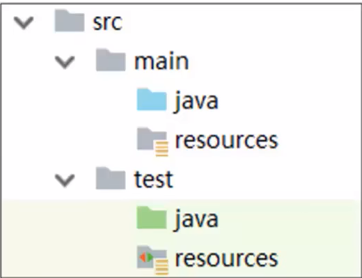


蓝色框内代表maven

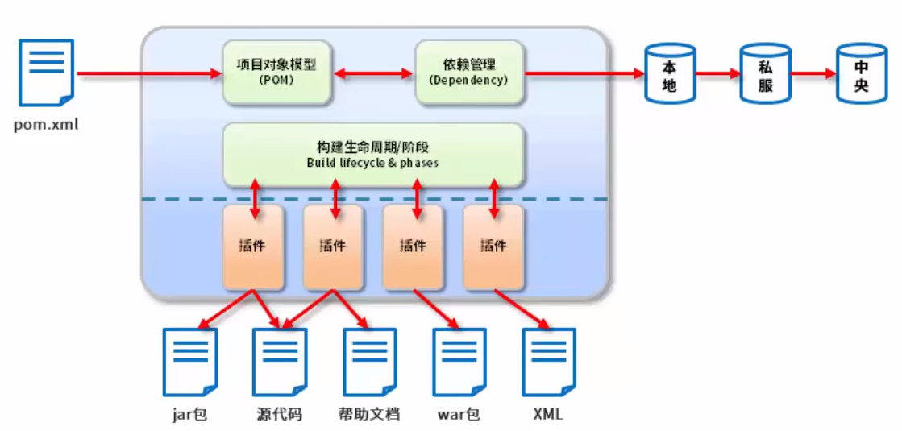

Maven本质上是一个插件框架，并不执行任何具体的构建任务，它把所有这些任务都交给插件来完成。

作为开发利器的maven，为我们提供了十分丰富的命令，了解maven的命令行操作并熟练运用常见的maven命令还是十分必要的，即使譬如IDEA等工具给我提供了图形界面化工具，但其底层还是依靠maven命令来驱动的。

**Maven的命令格式如下：**

```shell
mvn [plugin-name]:[goal-name]
```

该命令的意思是：执行`plugin-name`插件的`goal-name`目标。


## 3.maven配置

[Maven – Download Apache Maven](https://maven.apache.org/download.cgi)

1. 下载
2. 配置JAVA_HOEM
3. 配置MAVEN_HOME
4. path中添加%MAVEN_HOME%/bin


## 4.maven概念

### 仓库

用于存储资源，存储各种jar包

- 中央仓库
  - 由maven团队维护，存有世界上的大部分jar包
  - 需要使用时，从中央仓库下载
  - 存储的jar包都是开源的
- 私服
  - 由公司等创建的服务器，从中央仓库下载jar包并保存下来
  - 可以保护具有版权的资源，包含购买的或者自主研发的jar包
- 本地仓库
  - 本地可以从私服上直接拿取jar包
  - 自己电脑上存储资源的仓库


### 坐标

用于描述仓库中资源的位置

[Maven Repository: Search/Browse/Explore (mvnrepository.com)](https://mvnrepository.com/)

可以在此网站上查询jar包坐标

**坐标组成**

- groupId
  - 定义当前Maven隶属的组织名称（通常是域名反写，如：org.mybatis）
- artifactId
  - Maven项目名称
- version
  - 版本号
- packaging
  - 打包方式


### 配置本地仓库

默认地址为C:/Users/18837/.m2

可在E:/apache-maven-3.8.6/conf/settings.xml中更改

加上此行即可

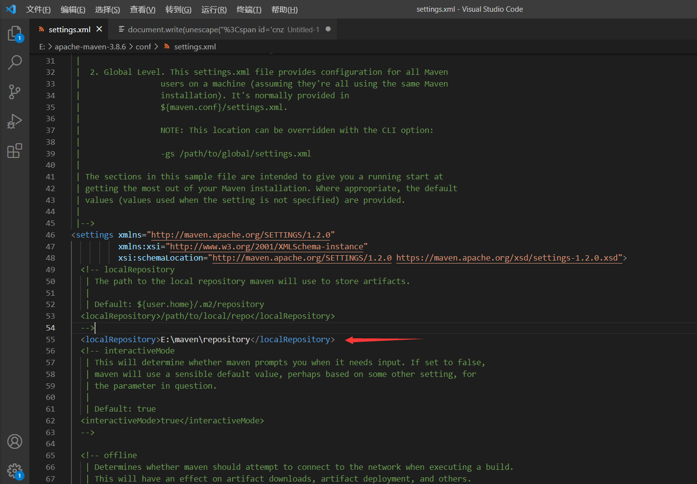


### 修改远程仓库

使用maven的服务器很慢，可以修改为国内镜像网站

同样是在settings.xml中加入

~~~xml
<mirror>
    <id>nexus-aliyun</id>
    <mirrorOf>central</mirrorOf>
    <name>Nexus aliyun</name>
    <url>http://maven.aliyun.com/nexus/content/groups/public</url>
</mirror>
~~~

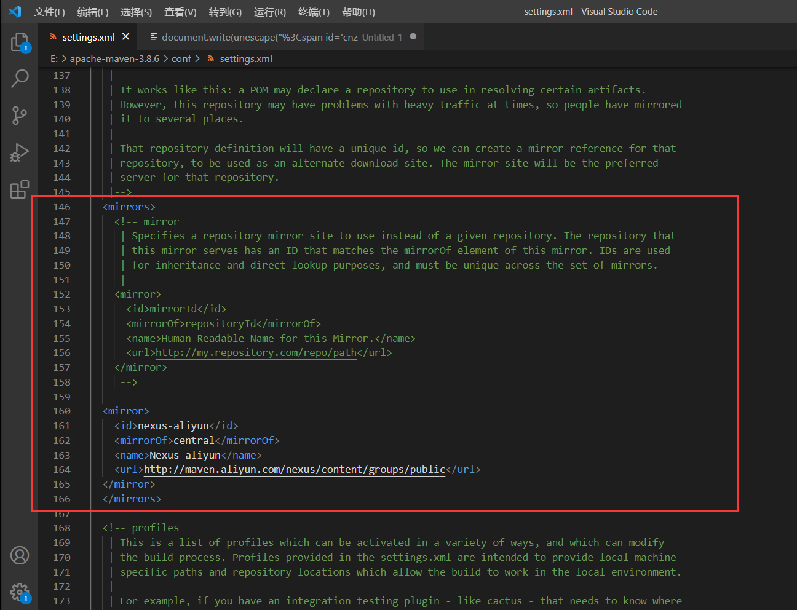

## 5.maven工程

项目构建的生命周期

即开发一个项目要需要经历的过程


### 5.1.maven工程结构

包含两部分

1. 目录文件，存储代码

   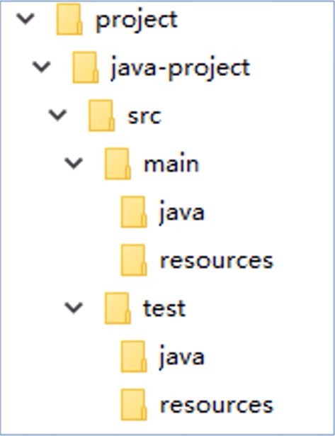

2. pom.xml文件

   和src同级，用来配置maven

### 5.2.创建maven工程

#### IDEA中Maven

##### 配置maven

配置需要使用的maven的地址

配置本地仓库（默认.m2）

配置用户设置（默认.m2中的settings.xml）

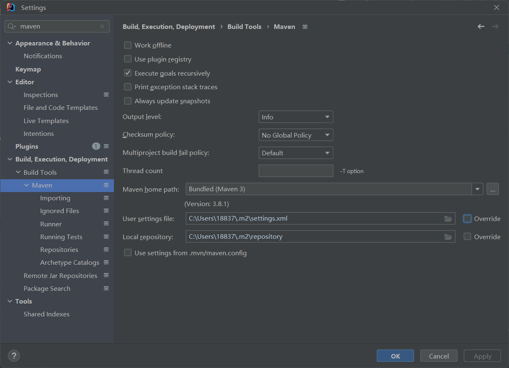

##### 给项目导入maven模块

在左上角new选择module（也可在创建项目时直接选择创建maven项目）

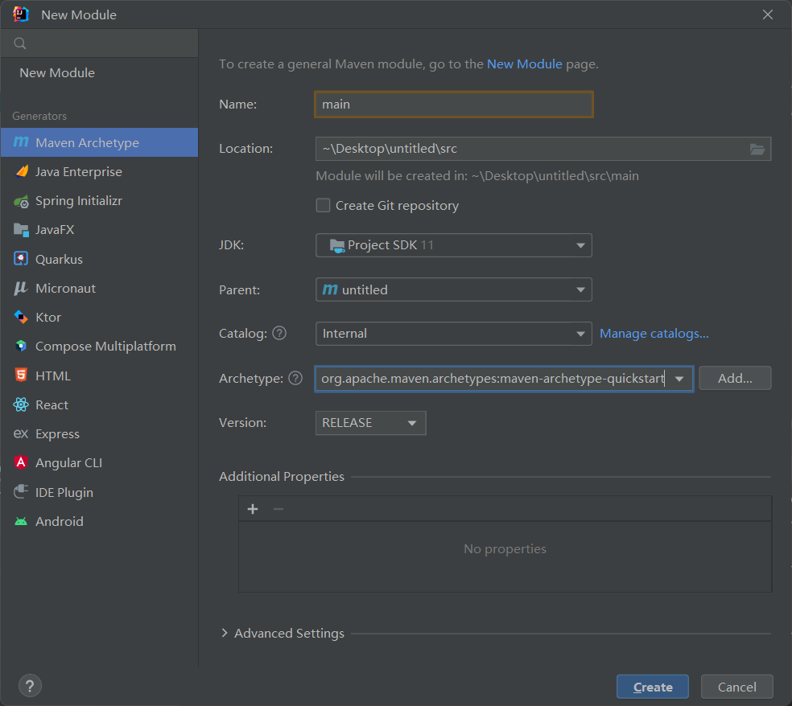

##### 创建快捷maven命令


#### 脚手架生成maven项目

需要在下面的网址上生成最基本的maven工程源码

该网址被称为脚手架

[Spring Initializr](https://start.spring.io/)

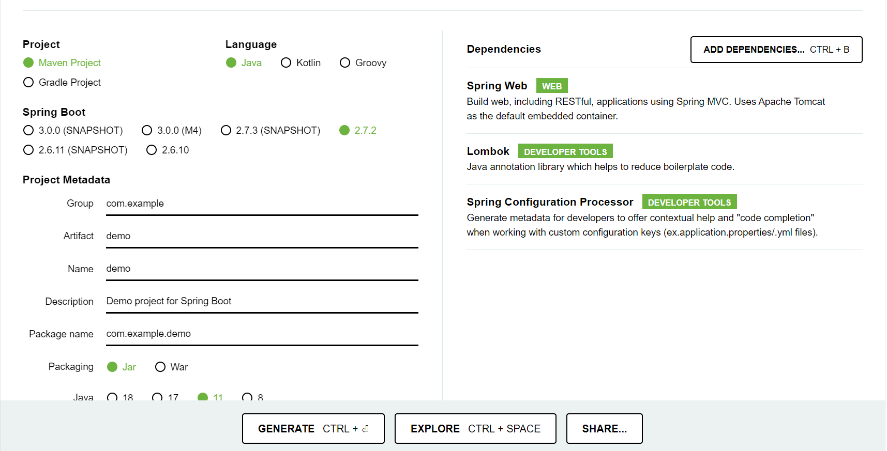

1. 选择maven项目，jdk版本，SpringBoot版本等
2. 右侧添加依赖，常用的有如图的三个
3. 点击generate生成maven项目的zip压缩包


### 5.3.maven命令

下面的表格列出了maven的常用命令

| 一个普通标题           | 一个普通标题                      |
| ---------------------- | :-------------------------------- |
| mvn -help              | 查看帮助                          |
| mvn -v                 | 查看当前maven版本                 |
| mvn compile            | 编译源代码，会生成target目录      |
| mvn test-compile       | 编译测试源代码                    |
| mvn verify             | 运行检查                          |
| mvn  test              | 运行测试代码                      |
| mvn package            | 项目打包命令                      |
| mvn jar:jar            | 打成jar命令                       |
| mvn install            | 本地Repository中安装本项目的jar包 |
| mvn source:jar         | 生成源码jar包                     |
| mvn  clean             | 清楚target目录                    |
| mvn dependency:tree    | 打印整个依赖树                    |
| mvn dependency:sources | 打印出已解决依赖的列表            |


#### 1.查看帮助文档

~~~shell
mvn -help
~~~


#### 2.查看maven版本

~~~shell
mvn -v
~~~

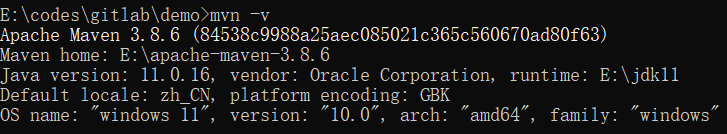


#### 3.编译源代码

~~~shell
mvn compile
~~~

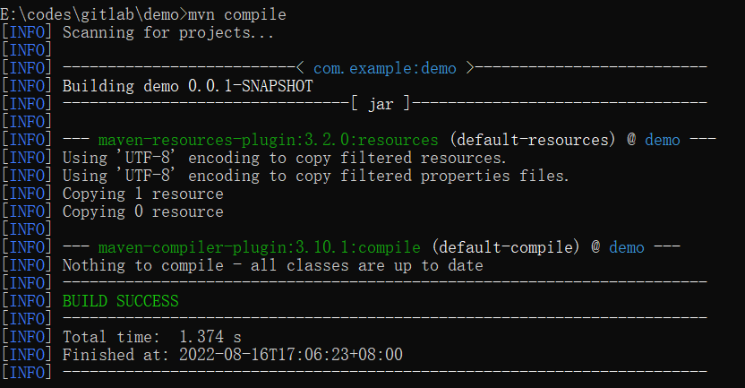


**效果：**

生成target目录

并且生成java文件所对应的class文件


#### 4.编译测试源代码

~~~shell
mvn test-compile
~~~

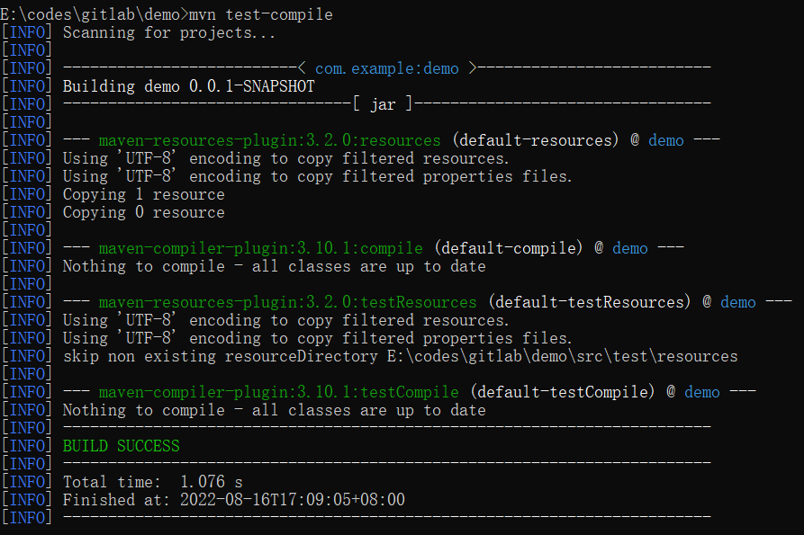


**效果：**

target/test-classes目录下会有编译生成的 .class文件


#### 5.运行检查

~~~shell
mvn verify
~~~

对集成测试结果进行任何检查，以确保符合质量标准，会从多个方面验证，看下面的部分截图，如

- 编译
- 测试case
- 是否能打包
- 等等等

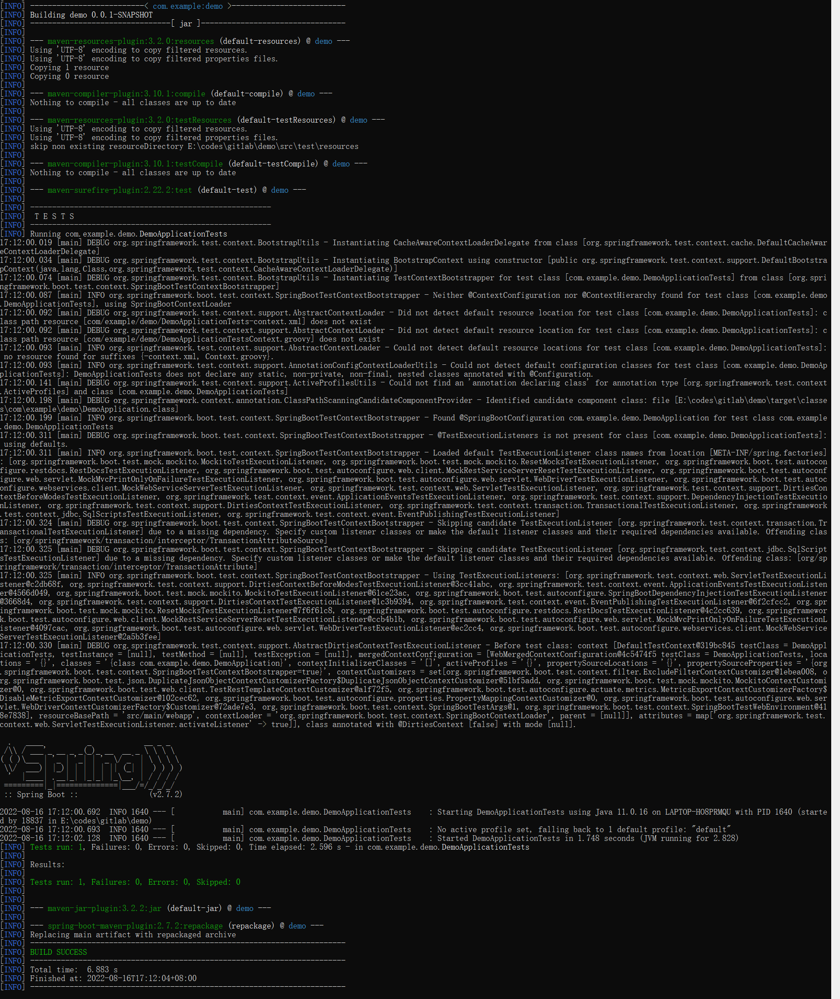


#### 6.运行测试代码

~~~shell
mvn test
~~~

Maven通过插件来执行 JUnit 和 TestNG 的测试用例。

maven-surefire-plugin 的test目标会自动执行测试源码路径下符合命名模式的测试类。

默认测试源代码路径： src/test/java/

测试类命名模式：
/*/*/Test/*.java
/*/*//*Test.java
/*/*//*TestCase.java

按上述模式命名的类， 使用 mvn test 命令就能自动运行他们。


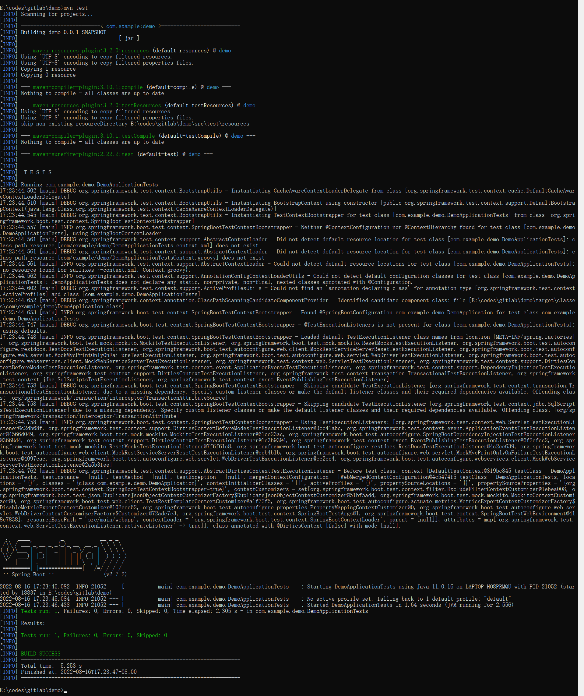


#### 7.项目打包命令

~~~shell
mvn package
~~~

- 运行打包命令，我们能看到

  - 正常执行

  - target目录中生成了jar文件：demo-0.0.1-SNAPSHOT.jar

**打包后的target目录**

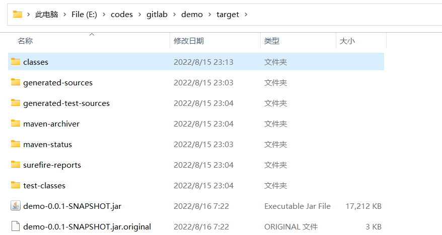

[springboot项目用maven打包生成的.jar.original是什么？](https://blog.csdn.net/wupan6688/article/details/103629664)


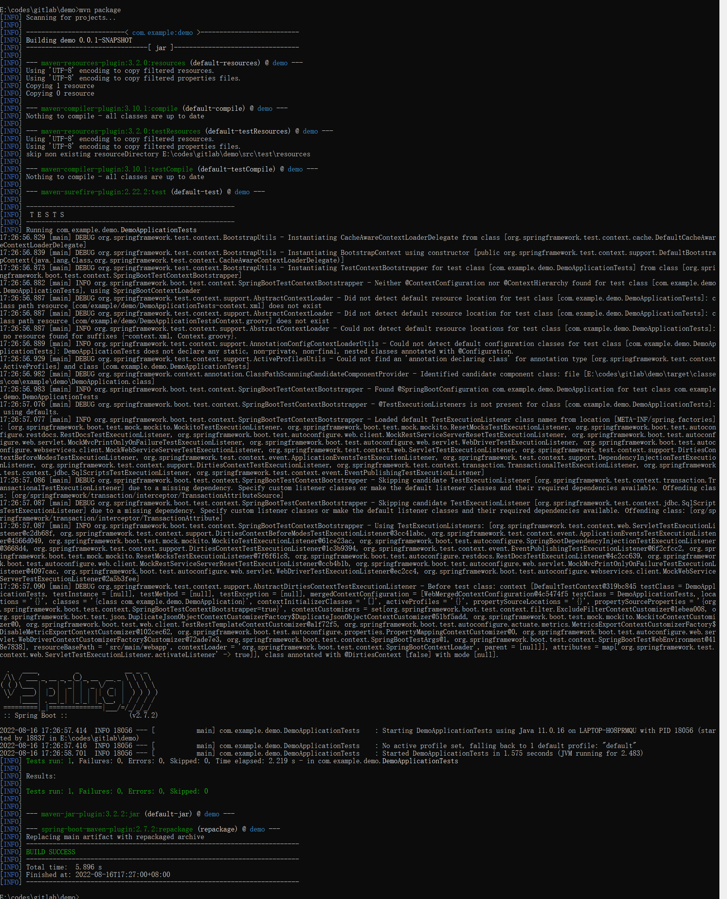


**只打包不测试**

~~~shell
 mvn clean package -DskipTests -Prelease
~~~

**注意：**

跳过测试打包速度比较快


**只打jar包**

~~~shell
mvn jar:jar
~~~

target目录中生成了jar文件：demo-0.0.1-SNAPSHOT.jar

(本操作包含在mvn package中)


#### 8.本地Repository中安装jar

~~~shell
mvn install
~~~

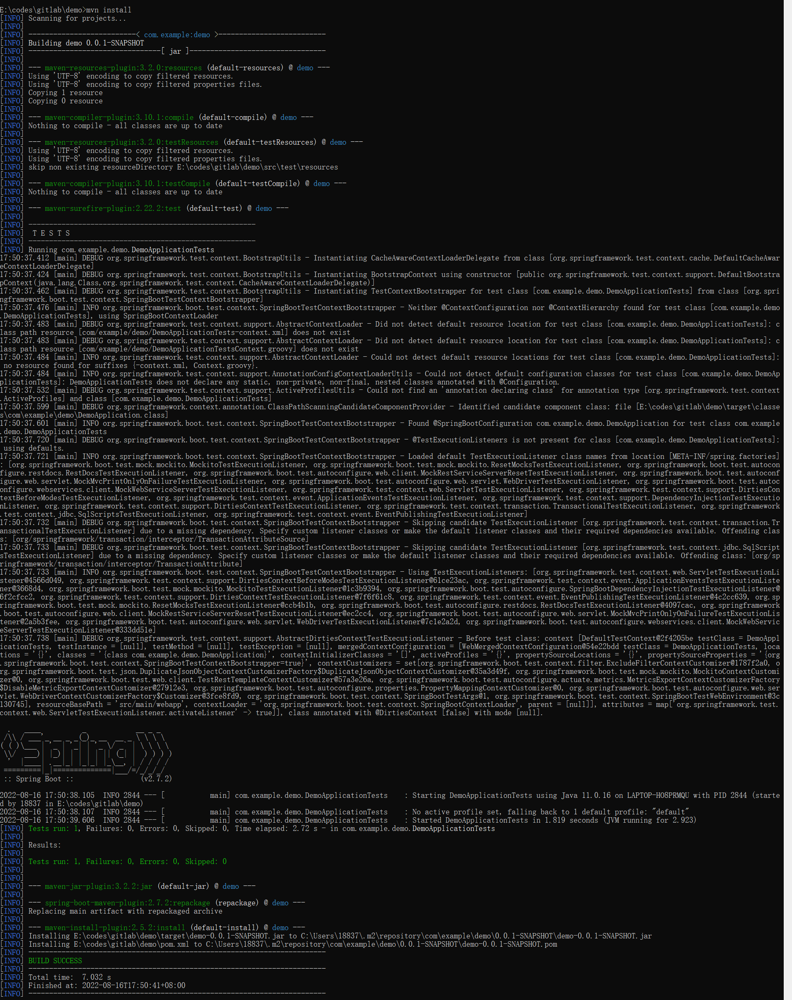


**效果**

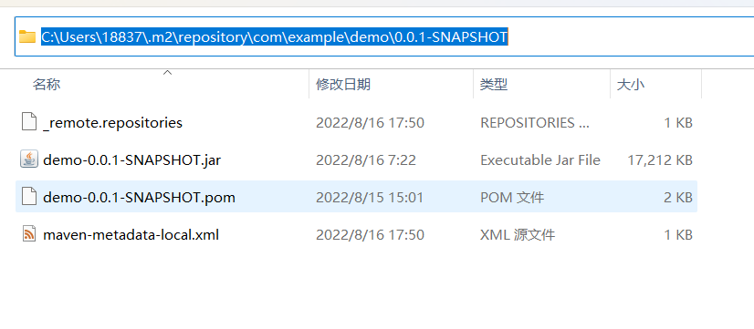


#### 9.生成源码jar包

~~~shell
mvn source:jar
~~~

target目录中生成 demo-0.0.1-SNAPSHOT-sources.jar,包含源代码


#### 10.清除项目

执行命令前，target目录下生成了很多文件，都是之前执行命令生成的。

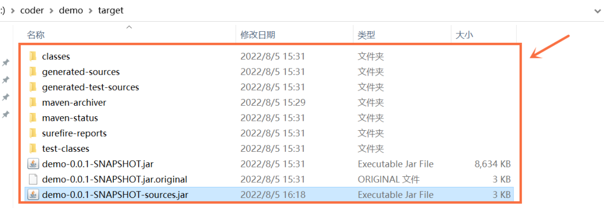

- 执行`mvn clean`

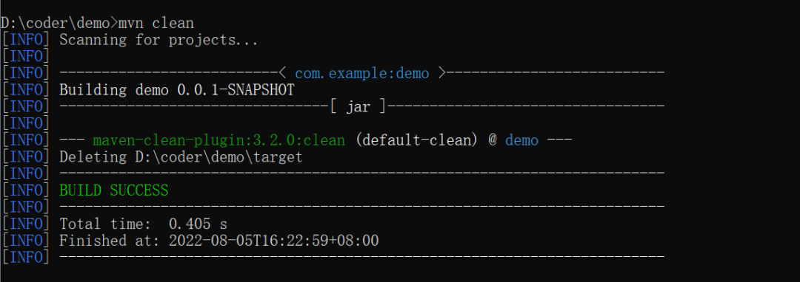

删除target目录

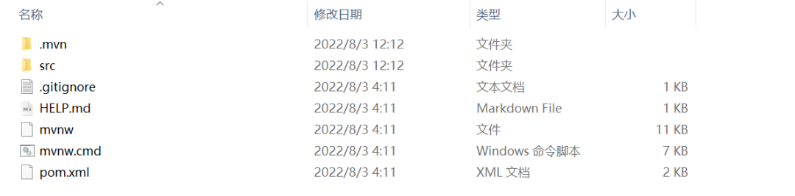


#### 11.生成项目相关信息的网站

```
mvn site
```


#### 12.发布项目到远程仓库：mvn:deploy

```
mvn:deploy
```


#### 13.依赖树

##### 打印整个依赖树: `mvn dependency:tree`

```
mvn dependency:tree
```

**执行命令截图**


##### 打印出已解决依赖的列表: `mvn dependency:resolve`

```
mvn dependency:resolve
```

**执行命令截图**

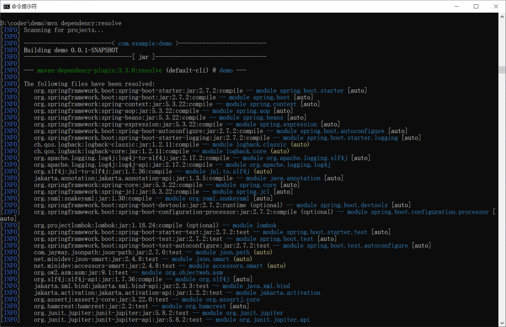

**关于依赖冲突后面会单独写一篇文章来分享，敬请期待！！！，记得关注：小码匠和老码农**

##### 下载依赖包的源码：`mvn dependency:sources`

```
mvn dependency:sources
```

**执行命令截图**这个命令好理解，下载依赖包源码，就不多废话了

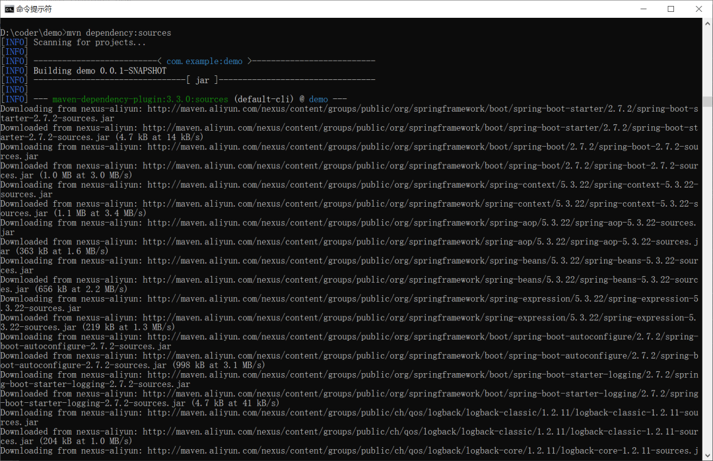


### 5.4.tomcat插件安装

Tomcat是常见的免费的web服务器.
Tomcat 这个名字的来历，Tomcat是一种野外的猫科动物，不依赖人类，独立生活。

1. 去[Maven Repository: Search/Browse/Explore (mvnrepository.com)](https://mvnrepository.com/)中找到tomcat

   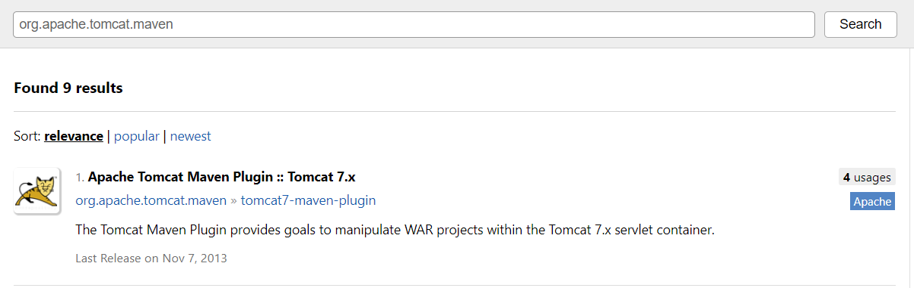

2. 复制代码

   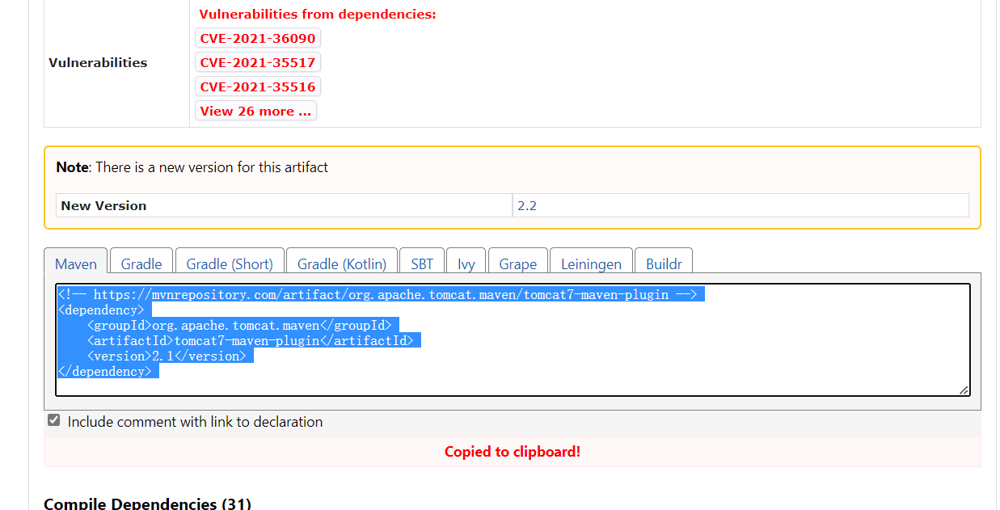

3. 添加到pom中

   写在build，plugins中，创建一个新的plugin

   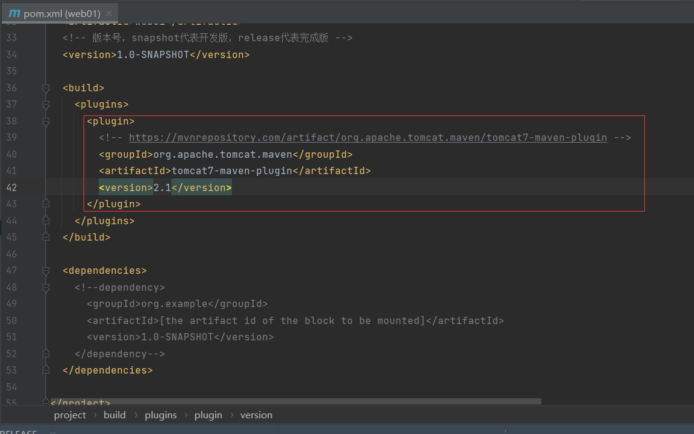
   
4. 在右侧maven处可以启动tomcat

   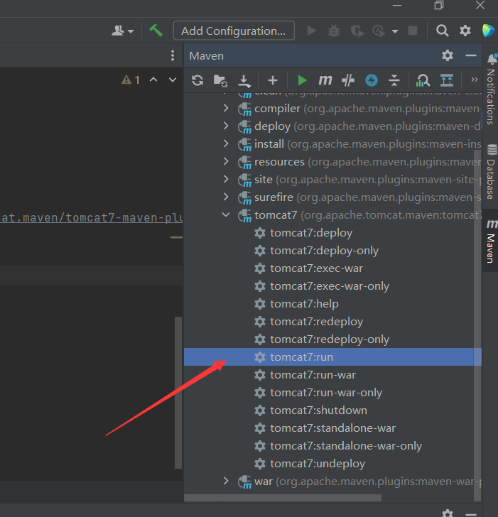


## 6.依赖

即maven项目所需要的各种jar包

添加依赖，在pom文件的dependiencies标签中添加即可

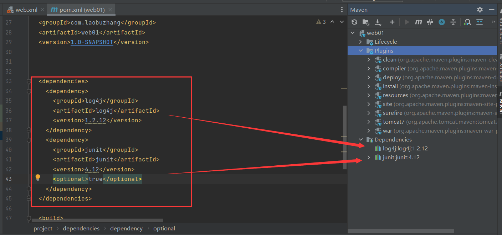

### 依赖传递

当你的工程依赖别的工程，你可以使用这个工程jar包中的依赖

这种依赖是间接依赖

若依赖出现冲突

- **不同层级**的依赖有版本不同的相同资源：路径优先

  - 此时优先使用高层级的资源
  - 即**直接依赖**会覆盖不同版本的**间接依赖**

- **相同层级**的依赖有版本不同的依赖：声明优先

  - 如这样的依赖关系：A－＞ C－＞X（1.0）、A－＞D－＞X（2.0），X（1.0）和 X（2.0）冲突

  - C比D先声明，则先使用X（1.0）

- **同一pom**中冲突：特殊优先

  - 写在靠后的覆盖写在靠前的

### 可选依赖（不透明）

**对外隐藏当前所选的依赖**，不透明，别的项目依赖该项目时，不会看到该项目中使用了该依赖（即不进行依赖传递）


加一个option标签并设为true

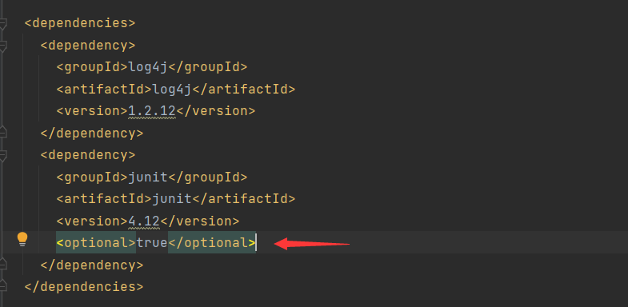


### 排除依赖（不需要）

使用exclusion标签

例如下面的例子表示：引用web02作为依赖，但是不使用web02的依赖junit（这里不用写版本号）

~~~xml
<dependency>
  <groupId>web02</groupId>
  <artifactId>web02</artifactId>
  <version>1.0-SNAPSHOT</version>
  <exclusion>
      <groupId>junit</groupId>
  	  <artifactId>junit</artifactId>
  </exclusion>
</dependency>
~~~


### 依赖范围

jar默认可以在任何时间使用，即compile

使用scope标签可以决定jar包作用的范围

scope的取值：

- compile
- test
- provided
- runtime

作用范围

- 主程序有效
- 测试程序范围有效
- 是否参与打包

以下是几种常用的jar的常用的作用范围

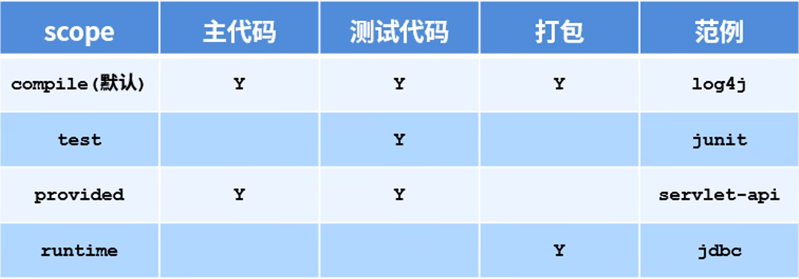


配置后会在右侧显示

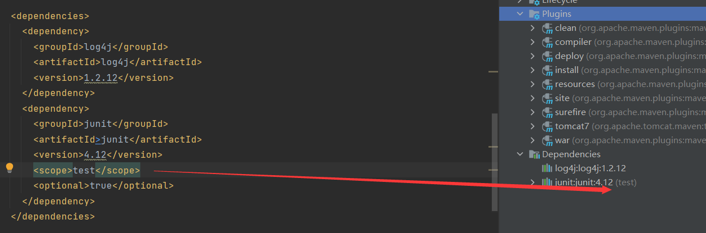


只有作用范围内的代码可以import该依赖包


**依赖范围的传递性**

该表格表示间接依赖的作用范围

例如

- web01依赖web02，作用范围是compile
- web02依赖junit，作用范围是runtime
- 则此时junit在web01中范围是runtime


## 7.生命周期与插件

生命周期时几岁

插件是几岁时干的事


maven对项目构建的生命周期划分为3个阶段

- clean：清理工作
- default：核心工作，例如编译，测试，打包，部署等等
- site：产生报告，发布站点等等


### default构建生命周期

若执行某一个命令，则会连带该命令和前边的所有命令都执行一遍

例如：

- 执行compile，则会从validate按顺序执行到compile
- 执行test，则会从validate按顺序执行到test

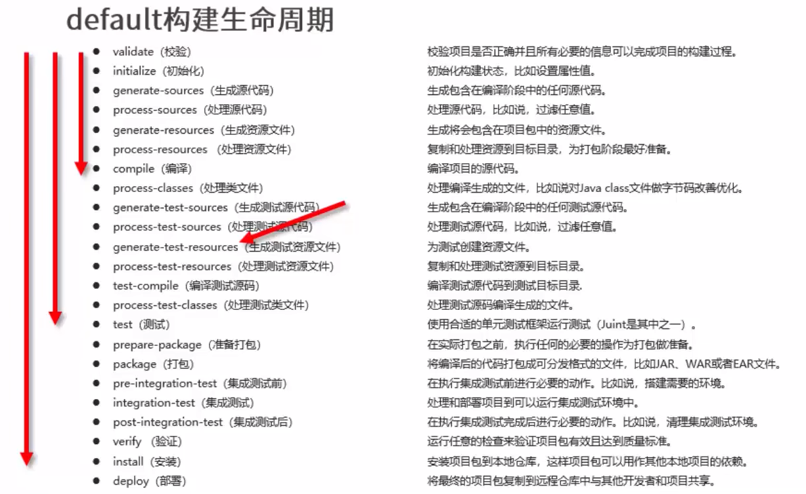


### 插件

添加插件和前边添加tomcat类似

build标签->plugins标签->plugin标签->插件内容


- 插件与生命周期内的阶段绑定，相应的生命周期执行相应的插件
- 默认都有预设的功能
- 通过插件可以自定义更多的插件


自定义插件作用周期

- 使用execution标签

  ~~~xml
  <plugin>
    	<groupId>org.apache.maven.plugins</groupId>
    	<artifactId>maven-source-plugin</artifactId>
    	<version>2.2.1</version>
      <executions>
          <goals>
              <goal>jar</goal>
          </goals>
    		<phase>compile</phase>
  	</executions>
  </plugin>
  
  执行到compile时，执行该插件
  这个插件是一个打包插件，这里表示在compile时将项目源代码打包成jar
  ~~~


## 8.

