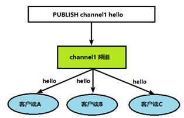
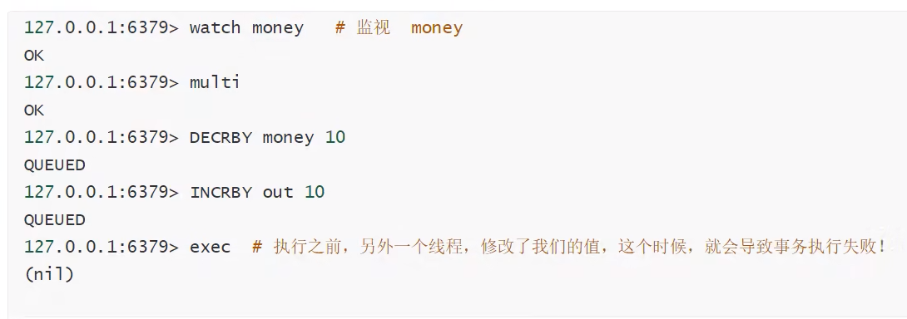

# Redis6

[学习链接](https://www.bilibili.com/video/BV1S54y1R7SB?p=36&spm_id_from=pageDriver&vd_source=af8b97e6370b709224731e8addba379d)

## session简介

Session：在计算机中，尤其是在网络应用中，称为“会话控制”。[Session对象](https://baike.baidu.com/item/Session对象/5250998?fromModule=lemma_inlink)存储特定用户会话所需的属性及配置信息。这样，当用户在应用程序的Web页之间跳转时，存储在Session对象中的变量将不会丢失，而是在整个用户会话中一直存在下去。当用户请求来自应用程序的 Web页时，如果该用户还没有会话，则Web服务器将自动创建一个 Session对象。当会话过期或被放弃后，服务器将终止该会话。Session 对象最常见的一个用法就是存储用户的首选项。例如，如果用户指明不喜欢查看图形，就可以将该信息存储在Session对象中。

## 1 NoSQL数据库简介

redis是一种典型的NoSQL数据库

技术的分类：

1. 解决功能性的问题：Java、Jsp、RDBMS、Tomcat、HTML、Linux、JDBC、SVN
2. 解决扩展性的问题：Struts、Spring、SpringMVC、Hibernate、Mybatis
3. 解决性能的问题：NoSQL、Java线程、Hadoop、Nginx、MQ、ElasticSearch

web1.0时代

问题不大

web2.0时代

用户暴增，服务器和数据库面临巨大挑战

### 1.1 解决CPU及内存压力

NoSQL可以通过内存进行读取

### 1.2 解决IO压力

NoSQL可以当作缓存数据库

加入缓存数据库，提高查询速度，还不破坏数据库

## 2 NoSQL数据库

### 2.1 NoSQL概述

NoSQL(NoSQL = **Not Only SQL** )，意即“不仅仅是SQL”，泛指**非关系型的数据库**。 

NoSQL 不依赖业务逻辑方式存储，而以简单的key-value模式存储。因此大大的增加了数据库的扩展能力

- 不遵循SQL标准。

- 不支持ACID。

- 远超于SQL的性能。

### 2.2 NoSQL使用场景

- 对数据高并发的读写

- 海量数据的读写

- 对数据高可扩展性的

### 2.3 NoSQL不适用场景

- 需要事务支持

- 基于sql的结构化查询存储，处理复杂的关系,需要即席查询。

- （**用不着sql**的和用了sql也不行的情况，请考虑用NoSql）

### 2.4 主要的NoSQL

#### Memcache

- 很早出现的NoSql数据库

- 数据都在内存中，一般不持久化

- 支持简单的key-value模式，支持类型单一

- 一般是作为缓存数据库辅助持久化的数据库

#### Redis

- 几乎覆盖了Memcached的绝大部分功能

- 数据都在内存中，支持持久化，主要用作备份恢复

- 除了支持简单的key-value模式，还支持多种数据结构的存储，比如 list、set、hash、zset等。

- 一般是作为缓存数据库辅助持久化的数据库

#### MongoDB

- 高性能、开源、模式自由(schema free)的**文档型数据库**

- 数据都在内存中， 如果内存不足，把不常用的数据保存到硬盘

- 虽然是key-value模式，但是对value（尤其是**json**）提供了丰富的查询功能

- 支持二进制数据及大型对象

- 可以根据数据的特点**替代RDBMS** ，成为独立的数据库。或者配合RDBMS，存储特定的数据。

## 3 Redis

### 3.1 redis简介

- Redis是一个开源的key-value存储系统。

- 和Memcached类似，它支持存储的value类型相对更多，包括string(字符串)、list(链表)、set(集合)、zset(sorted set --有序集合)和hash（哈希类型）。

- 这些数据类型都支持push/pop、add/remove及取交集并集和差集及更丰富的操作，而且这些操作都是原子性的。

- 在此基础上，Redis支持各种不同方式的排序。

- 与memcached一样，为了保证效率，数据都是缓存在内存中。

- 区别的是Redis会**周期性的把更新的数据写入磁盘**或者把修改操作写入追加的记录文件，**即实现持久化**。

- 并且在此基础上实现了master-slave(主从)同步。

#### 3.1.1 redis安装

官网下载压缩包

[http://redis.io](http://redis.io)

- 将下载好的**redis-6.2.1.tar.gz**文件放入到/opt下

- 解压**redis-6.2.1.tar.gz**，进入redis-6.2.1文件夹
- 执行make命令
- 执行make install命令

最终安装目录：/usr/local/bin

查看默认安装目录：

redis-benchmark:性能测试工具，可以在自己本子运行，看看自己本子性能如何

redis-check-aof：修复有问题的AOF文件，rdb和aof后面讲

redis-check-dump：修复有问题的dump.rdb文件

redis-sentinel：Redis集群使用

redis-server：Redis服务器启动命令

redis-cli：客户端，操作入口

#### 3.1.2 redis运行

##### 1 前台运行

执行命令（任意位置即可）

~~~bash
redis-server
~~~

##### 2 后台运行

需要先配置

1. 在opt中将redis.conf拷贝到/etc中

   ~~~bash
   cp redis.conf /etc/redis.conf
   ~~~

2. 进入etc里的redis.conf文件

   ~~~bash
   vi /etc/redis.conf
   ~~~

3. 将**daemonize no改成yes**

   linux的文本编辑需要单独学习

   1. 使用/dae搜索到该处
   2. 按i切换到插入模式，将no改为yes
   
   

至此完成配置

执行命令（任意位置即可）

~~~bash
redis-server /etc/redis.conf
~~~

使用命令进入redis客户端

~~~bash
redis-cli
~~~

使用ping测试连接，出现pong表示成功

使用shutdown关闭redis服务器

使用exit退出redis客户端

##### 3 查看后台进程和关闭服务

~~~bash
ps -ef | grep redis
~~~

可以看到redis在运行和它对应的进程号

此时也可以通过以下命令关闭redis

~~~bash
kill -9 进程号
~~~

### 3.2 redis相关知识

一个女演员叫 Merz，对应的9键输入法的**6379**，这是**redis端口号**的由来

#### 3.2.1 库和工作方式

**库**

默认16个数据库，类似数组下标从0开始，初始默认使用0号库

使用命令 `select 库号 `来切换数据库。如: select 8 

统一密码管理，所有库同样密码。

`dbsize`查看当前数据库的key的数量

`flushdb`清空当前库

`flushall`通杀全部库

**实现方式**

redis使用单线程+多路IO复用

- 只有一个线程
- 排到了去找一个空闲的服务

#### 3.2.2 数据类型

##### 1 键（key）

`keys *`查看当前库所有key  (匹配：keys *1)

`exists key`判断某个key是否存在

`type key `查看你的key是什么类型

`del key`    删除指定的key数据

`unlink key`  根据value选择非阻塞删除

仅将keys从keyspace元数据中删除，真正的删除会在后续异步操作，类似懒标记。

`expire key 10`  10秒钟：为给定的key设置过期时间

`ttl key` 查看还有多少秒过期，-1表示永不过期，-2表示已过期

 

`select`命令切换数据库

`dbsize`查看当前数据库的key的数量

`flushdb`清空当前库

`flushall`通杀全部库

##### 2 String

**简介：**

- String类型是二进制安全的。意味着Redis的string可以包含任何数据。比如jpg图片或者序列化的对象。

- String类型是Redis最基本的数据类型，一个Redis中字符串value最多可以是512M

**常用命令：**

`set <key><value>`添加键值对，后续key相同的话，会覆盖

`get <key>`查询对应键值

`append <key><value>`将给定的value追加到原值的末尾

`strlen <key>`获得值的长度

`setnx <key><value>`只有在 key 不存在时，设置 key 的值

`incr <key>`

将 key 中储存的数字值增1

只能对数字值操作，如果为空，新增值为1

`decr <key>`

将 key 中储存的数字值减1

只能对数字值操作，如果为空，新增值为-1

`incrby/decrby <key> <步长>`将 key 中储存的数字值增减。自定义步长。

~~~
其中的incr和decr都是原子性操作

所谓**原子操作**是指不会被线程调度机制打断的操作

这种操作一旦开始，就一直运行到结束，中间不会有任何 context switch （切换到另一个线程）。

（1）在单线程中， 能够在单条指令中完成的操作都可以认为是"原子操作"，因为中断只能发生于指令之间。

（2）在多线程中，不能被其它进程（线程）打断的操作就叫原子操作。

Redis单命令的原子性主要得益于Redis的单线程。

java中的i++就不是原子操作，两个线程都执行i++100次，i的最终范围可能是2~200
~~~

`mset <key1><value1><key2><value2> ..... `

同时设置一个或多个 key-value对 

`mget <key1><key2><key3> .....`

同时获取一个或多个 value 

`msetnx <key1><value1><key2><value2> ..... `

同时设置一个或多个 key-value 对，当且仅当所有给定 key 都不存在。

**原子性**，有一个失败则都失败

 

`getrange <key><起始位置><结束位置>`

获得值的范围，类似java中的substring，即子串，**前包，后包**

`setrange <key><起始位置><value>`

用 <value> 覆写<key>所储存的字符串值，从<起始位置>开始(索引从0开始)。

 

`setex <key><过期时间><value>`

设置键值的同时，设置过期时间，单位秒。

`getset <key><value>`

以新换旧，设置了新值同时获得旧值。

**数据结构：**

String的数据结构为简单动态字符串(Simple Dynamic String,缩写SDS)。是可以修改的字符串，内部结构实现上类似于Java的ArrayList，采用预分配冗余空间的方式来减少内存的频繁分配.

内部为当前字符串实际分配的空间capacity一般要高于实际字符串长度len。当字符串长度小于1M时，扩容都是加倍现有的空间，如果超过1M，扩容时一次只会多扩1M的空间。需要注意的是字符串最大长度为512M。

##### 3 List

**简介：**

Redis 列表是简单的字符串列表，按照插入顺序排序。你可以添加一个元素到列表的头部（左边）或者尾部（右边）。

它的底层实际是个双向链表，对两端的操作性能很高，通过索引下标的操作中间的节点性能会较差。

**常用命令：**

`lpush/rpush <key><value1><value2><value3> ....` 从左边/右边插入一个或多个值。

`lpop/rpop <key>`从左边/右边吐出一个值。值在键在，值光键亡。

`rpoplpush <key1><key2>`从key1列表右边吐出一个值，插到key2列表左边。

`lrange <key><start><stop>`

按照索引下标获得元素(从左到右)

lrange mylist 0 -1  0左边第一个，-1右边第一个，（0-1表示获取所有）

`lindex <key><index>`按照索引下标获得元素(从左到右)

`llen <key>`获得列表长度 

`linsert <key> before <value><newvalue>`在value的后面插入newvalue插入值

`lrem <key><n><value>`从左边删除n个value(从左到右)（只删等于value的）

`lset <key><index><value>`将列表key下标为index的值替换成value

**数据结构：**

List的数据结构为快速链表**quickList**。

首先在列表元素较少的情况下会使用一块连续的内存存储，这个结构是**ziplist**，也即是压缩列表。

它将所有的元素紧挨着一起存储，分配的是一块连续的内存。

当数据量比较多的时候才会改成quicklist。

因为普通的链表需要的附加指针空间太大，会比较浪费空间。比如这个列表里存的只是int类型的数据，结构上还需要两个额外的指针prev和next。

**Redis将链表和ziplist结合起来组成了quicklist**。也就是将多个ziplist使用双向指针串起来使用。这样既满足了快速的插入删除性能，又不会出现太大的空间冗余。

##### 4 Set

**简介：**

Redis set对外提供的功能与list类似是一个列表的功能，特殊之处在于set是可以**自动去重**的，当你需要存储一个列表数据，又不希望出现重复数据时，set是一个很好的选择，并且set提供了判断某个成员是否在一个set集合内的重要接口，这个也是list所不能提供的。

Redis的Set是string类型的无序集合。它底层其实是一个value为null的hash表，所以添加，删除，查找的**复杂度都是O(1)**。 

一个算法，随着数据的增加，执行时间的长短，如果是O(1)，数据增加，查找数据的时间不变

**常用命令：**

`sadd <key><value1><value2> ..... `

将一个或多个 member 元素加入到集合 key 中，已经存在的 member 元素将被忽略

`smembers <key>`取出该集合的所有值。

`sismember <key><value>`判断集合key是否为含有该value值，有1，没有0

`scard<key>`返回该集合的元素个数。

`srem <key><value1><value2> .... `删除集合中的某个元素。

`spop <key>`**随机从该集合中吐出一个值。**

`srandmember <key><n>`随机从该集合中取出n个值。不会从集合中删除 。

`smove <source><destination>`value把集合中一个值从一个集合移动到另一个集合

`sinter <key1><key2>`返回两个集合的交集元素。

`sunion <key1><key2>`返回两个集合的并集元素。

`sdiff <key1><key2>`返回两个集合的**差集**元素(key1中的，不包含key2中的)

**数据结构：**

Set数据结构是dict字典，字典是用哈希表实现的。

Java中HashSet的内部实现使用的是HashMap，只不过所有的value都指向同一个对象。Redis的set结构也是一样，它的内部也使用hash结构，所有的value都指向同一个内部值。

##### 5 Hash

**简介：**

Redis hash 是一个键值对集合。

Redis hash是一个string类型的field和value的映射表，hash特别适合用于存储对象。

类似Java里面的Map<String,Object>

用户ID为查找的key，存储的value用户对象包含姓名，年龄，生日等信息，如果用普通的key/value结构来存储

**常用命令：**

`hset <key><field><value>`给key集合中的 field键赋值value

`hget <key1><field>`从key1集合field取出 value 

`hmset <key1><field1><value1><field2><value2>... `批量设置hash的值

`hexists<key1><field>`查看哈希表 key 中，给定域 field 是否存在。 

`hkeys <key>`列出该hash集合的所有field

`hvals <key>`列出该hash集合的所有value

`hincrby <key><field><increment>`为哈希表 key 中的域 field 的值加上增量 1  -1

`hsetnx <key><field><value>`将哈希表 key 中的域 field 的值设置为 value ，当且仅当域 field 不存在 .

**数据结构：**

Hash类型对应的数据结构是两种：ziplist（压缩列表），hashtable（哈希表）。当field-value长度较短且个数较少时，使用ziplist，否则使用hashtable。

##### 6 Zset

**简介：**

Redis有序集合zset与普通集合set非常相似，是一个没有重复元素的字符串集合。

不同之处是有序集合的每个成员都关联了一个**评分（score）**,这个评分（score）被用来按照从最低分到最高分的方式排序集合中的成员。集合的成员是唯一的，但是评分可以是重复了 。

因为元素是有序的, 所以你也可以很快的根据评分（score）或者次序（position）来获取一个范围的元素。

访问有序集合的中间元素也是非常快的,因此你能够使用有序集合作为一个没有重复成员的智能列表。

**常用命令：**

`zadd <key><score1><value1><score2><value2>…`

将一个或多个 member 元素及其 score 值加入到有序集 key 当中。

`zrange <key><start><stop> [WITHSCORES] `

返回有序集 key 中，下标在start stop之间的元素

带WITHSCORES，可以让分数一起和值返回到结果集。

`zrangebyscore key min max [withscores] [limit offset count]`

返回有序集 key 中，所有 score 值介于 min 和 max 之间(包括等于 min 或 max )的成员。有序集成员按 score 值递增(从小到大)次序排列。 

`zrevrangebyscore key max min [withscores] [limit offset count]        `

同上，改为从大到小排列。 

`zincrby <key><increment><value>`   为元素的score加上增量

`zrem <key><value>`删除该集合下，指定值的元素

`zcount <key><min><max>`统计该集合，分数区间内的元素个数 

`zrank <key><value>`返回该值在集合中的排名，从0开始

**数据结构：**

SortedSet(zset)是Redis提供的一个非常特别的数据结构，一方面它等价于Java的数据结构Map<String, Double>，可以给每一个元素value赋予一个权重score，另一方面它又类似于TreeSet，内部的元素会按照权重score进行排序，可以得到每个元素的名次，还可以通过score的范围来获取元素的列表。

zset底层使用了两个数据结构

（1）hash，hash的作用就是关联元素value和权重score，保障元素value的唯一性，可以通过元素value找到相应的score值。

（2）跳跃表，跳跃表的目的在于给元素value排序，根据score的范围获取元素列表。

##### 7 geospatial

可以推算地理位置的细腻些，两地之间的距离，方圆几里的人

`geoadd <key> <维度> <经度> <value> <维度> <经度> <value>...` 添加多个geo数据，两级无法添加，一般在使用时通过java程序直接一次性导入

~~~bash
geoadd china:city 121.47 31.23 shanghai
~~~

`geopos <key> <value1> <value2>`获取多个value的经纬值

~~~bash
geopos china:city beijing shanghai
~~~

`grodist <key> <value1> <value2> <单位>`  查询两个value之间的距离

m表示米，km表示千米，mi表示英里，ft表示英尺

`georadius <key> <维度> <经度> <距离> <单位> <条件> count 查询个数`  查询在指定的位置方圆距离内的数据，加上count表示要查询的个数

~~~bash
georadius china:city 110 30 500 km withcoord count 2
#列出2个china:city中110 30这个位置方圆500km之内的geo数据,并列出每个数据的经纬度，若是withdist表示列出距离
~~~

`georadiusbymember <key> <value> <距离> <单位>` 上述操作的经纬度换做一个指定的位置，功能相同

`geohash <key> <value1> <value2>...` 查询value的经纬度，但是返回hash串的形式

geospatial底层是基于Zset的，所以**geospatial都可以使用Zset的指令**。

##### 8 Hyperloglog

基数：一个集合中不重复的元素的个数

用来做基数统计

优点：占用内存固定，且非常小，可以使用12kb的空间统计2^64个不同元素的基数

有0.81%的错误率，可以忽略不计

若允许容错，可使用hyperloglog

如果不允许容错，则使用set或者自定义数据类型

**常用命令：**

`pfadd <key> <value1> <value2>...` 添加数据

`pfcount <key>` 计算基数

`pfmerge <key1> <key2> <key3>` 将key2和key3合并成为一个新的key3

##### 9 Bitmaps

位存储

只有两种状态的都可以使用bitmaps

都是操作二进制位来进行记录

`setbit <key> <位> <值>` 将key这个二进制数的指定位设为指定的值（0或1）

`getbit <key> <位>` 查询key这个二进制数的指定位的值（0或1）

`getcount <key>` 查询key这个二进制数中1的个数

### 3.3 redis配置文件

启动时就是通过配置文件启动

配置文件是redis.conf

为了学习使用，bind和protected-mode需要更改

> 单位

对大小写不敏感

> INCLUDE

在这里可以导入其他的配置文件

>NETWORK

- **bind=127.0.0.1** 表示只能接收本机的访问，将此行注释掉即可远程访问
- **protected-mode** 如果开启了`protected-mode`，那么在没有设定`bind ip`且没有设密码的情况下，Redis只允许接受本机的响应，这里设置为no
- **port** 默认为6379，可更改
- **tcp-backlog** 设置`tcp`的`backlog`，`backlog`其实是一个连接队列，`backlog`队列总和=未完成三次握手队列 + 已经完成三次握手队列。在高并发环境下需要一个高backlog值来避免慢客户端连接问题。注意Linux内核会将这个值减小到/proc/sys/net/core/somaxconn的值（128），所以需要确认增大/proc/sys/net/core/somaxconn和/proc/sys/net/ipv4/tcp_max_syn_backlog（128）两个值来达到想要的效果
- **timeout** 一个空闲的客户端维持多少秒会关闭，0表示关闭该功能。即永不关闭
- **tcp-keepalive** 对访问客户端的一种心跳检测，每个n秒检测一次。单位为秒，如果设置为0，则不会进行Keepalive检测，建议设置成60

> GENERAL

- **daemonize** 是否为后台进程，设置为yes，守护进程，后台启动
- **pidfile** 若以后台方式运行，需要指定一个pid文件
- **loglevel** 指定日志记录级别，Redis总共支持四个级别：debug、verbose、notice、warning，默认为**notice**。四个级别根据使用阶段来选择，生产环境选择notice 或者warning
- **logfile** 日志文件名称
- **databases 16** 设定库的数量 默认16，默认数据库为0。
- **always-show-logo yes** 开启或者关闭logo

> SNAPSHOTTING

持久化，在规定时间内执行了多少次操作，则会持久化到文件.rdb.aof

redis是持久化数据库，若没有持久化，断电即失。

~~~bash
save 900 1  #如果900s内，至少有1个key进行了修改，即进行持久化操作（下面两个类似）
save 300 10
save 60 10000

stop-writes-on-bgsave-error yes  #持久化出错后是否还继续工作

rdbcompression yes   #是否压缩rdb文件，需要消耗一些cpu资源

rdbchecksum yes   #保存rdb文件时，是否进行错误的校验检查

dir ./    #rdb文件保存的目录
~~~

> REPLICATION

用来配置主从关系

`masterauth <masterip> <masterport>` 配置该服务器的主节点

`masterauth <master-password>` 输入主机的密码（若主机有的话）

> SECURITY

- **requirepass 123** 设置密码为123

  - 可以使用命令config set requirepass "123"
  - 使用config get requirepass可以查看密码
  - 使用auth 123可以进行登录

> CLIENTS

- **maxclients** 设置redis同时可以与多少个客户端进行连接。默认情况下为10000个客户端。如果达到了此限制，redis则会拒绝新的连接请求，并且向这些连接请求方发出“max number of clients reached”以作回应。
- **maxmemory** 
  - 建议**必须设置**，否则，将内存占满，造成服务器宕机
  - 设置redis可以使用的内存量。一旦到达内存使用上限，redis将会试图移除内部数据，移除规则可以通过maxmemory-policy来指定。
  - 如果redis无法根据移除规则来移除内存中的数据，或者设置了“不允许移除”，那么redis则会针对那些需要申请内存的指令返回错误信息，比如SET、LPUSH等。
  - 但是对于无内存申请的指令，仍然会正常响应，比如GET等。如果你的redis是主redis（说明你的redis有从redis），那么在设置内存使用上限时，需要在系统中留出一些内存空间给同步队列缓存，只有在你设置的是“不移除”的情况下，才不用考虑这个因素。
  - **maxmemory-policy**是移除的规则
    -  volatile-lru：使用LRU算法移除key，只对设置了过期时间的键；（最近最少使用）
    - allkeys-lru：在所有集合key中，使用LRU算法移除key
    - volatile-random：在过期集合中移除随机的key，只对设置了过期时间的键
    - allkeys-random：在所有集合key中，移除随机的key
    - volatile-ttl：移除那些TTL值最小的key，即那些最近要过期的key
    - noeviction：不进行移除。针对写操作，只是返回错误信息
- **maxmemory-samples** 设置样本数量，LRU算法和最小TTL算法都并非是精确的算法，而是估算值，所以你可以设置样本的大小，redis默认会检查这么多个key并选择其中LRU的那个。一般设置3到7的数字，数值越小样本越不准确，但性能消耗越小。

> APPEND ONLY MODE

AOF配置

- **appendonly no** 开启或关闭AOF，默认使用rdb进行持久化，此处是no
- **appendfilename "appendonly.aof"** 持久化文件名字
- **appendfsync everysec** 执行sync的频率，everysec表示每秒都同步一次，always表示每次修改都要写入，no表示不执行

### 3.4 redis6的发布和订阅

#### 发布和订阅

Redis 发布订阅 (pub/sub) 是一种消息通信模式：发送者 (pub) 发送消息，订阅者 (sub) 接收消息。

Redis 客户端可以订阅任意数量的频道。

1、客户端可以订阅频道如下图

2、当给这个频道发布消息后，消息就会发送给订阅的客户端

#### 发布订阅的命令行实现

1.  打开一个客户端订阅channel1

   ~~~bash
   subscribe channel1
   ~~~

   

2. 打开另一个客户端，给channel1发布消息hello

   ~~~bash
   publish channel1 hello
   ~~~

   

3. 打开第一个客户端可以看到发送的消息

   

发送的消息没有持久化，所以在发送hello之后订阅的客户看不到hello

   

### 3.5 事务

**redis事务**：一组命令的集合，一个事务中的所有命令都会被序列化，在事务执行的过程中，会按照顺序执行。

==radis单条命令要么同时成功，要么同时失败，保证原子性==

==但是redis的事务不保证原子性==

==redis事务没有隔离级别的概念==

所有的命令在事物中，并没有被执行，只有发起执行命令时才会执行

事务流程：

- 开启事务（multi）
- 命令入队（上文所说的命令 ）
- 执行事务（exec）

锁：redis可以实现乐观锁

#### **正常执行事务：**

#### **放弃事务：**

#### **编译型异常：**

代码有问题。命令有错，事务中所有的命令都不会执行

 

#### **运行时异常：**

事务队列中存在语法性错误，那么其他命令仍然会正常执行

### 3.6 监控Watch

使用watch命令来监视实现锁的功能

#### 悲观锁

认为什么时间都会出问题，无论什么时候都要加锁

#### 乐观锁

认为什么时间都不出问题，所以不会上锁

更新数据时去判断，在此期间是否有人修改过这个数据

- 获取version
- 更新时比较version

#### redis监视测试

  正常执行成功：

测试多线程修改值，使用watch可以当作redis的乐观锁操作：

如果修改失败，获取最新的值就好

## 4 Jedis

Jedis是redis官方推荐的java连接开发工具

使用java操作redis中间件

### 1 导入对应的依赖

~~~xml
<dependencies>
    <!-- https://mvnrepository.com/artifact/redis.clients/jedis -->
    <dependency>
        <groupId>redis.clients</groupId>
        <artifactId>jedis</artifactId>
        <version>3.2.0</version>
    </dependency>
    <dependency>
        <groupId>com.alibaba</groupId>
        <artifactId>fastjson</artifactId>
        <version>1.2.62</version>
    </dependency>
</dependencies>
~~~

### 2 测试连接

1. 连接数据库

   ~~~java
   package com.laobuzhang;
   
   import redis.clients.jedis.Jedis;
   
   public class TestPing {
       public static void main(String[] args){
           Jedis jedis=new Jedis("127.0.0.1",6379);
           System.out.println(jedis.ping());
       }
   }
   //输出PONG
   ~~~

2. 操作命令

3. 断开连接

### 3 API

redis的指令在jedis中就是jedis对象的一个个方法

所有的API命令，就是上面所学的指令，一个都没有变化

### 4 事务

事务对象Transaction

数据库对象Jedis

JSON对象JSONObject

~~~java
package com.laobuzhang;

import com.alibaba.fastjson.JSONObject;
import redis.clients.jedis.Jedis;
import redis.clients.jedis.Transaction;

public class TestTX {
    public static void main(String[] args){
        Jedis jedis=new Jedis("127.0.0.1",6379);
        jedis.flushDB();

        JSONObject jsonObject=new JSONObject();
        jsonObject.put("hello","world");
        jsonObject.put("name","laobuzhang");

        //开启事务
        Transaction multi=jedis.multi();
        String result=jsonObject.toJSONString();

        //jedis.watch(result);//乐观锁

        try {
            multi.set("user1",result);
            multi.set("user2",result);
            //int i=1/0;   //模拟异常
            multi.exec();
        } catch (Exception e) {
            multi.discard();//放弃事务
            throw new RuntimeException(e);
        } finally {
            System.out.println(jedis.get("user1"));
            System.out.println(jedis.get("user2"));
            jedis.close();//关闭连接
        }
    }
}
~~~

## 5 SpringBoot集成redis

SpringData也是和SpringBoot齐名的项目

1. 导入依赖

2. 配置连接，在Springboot配置文件中

3. 测试

   ~~~java
   @Test
   void contextLoads() {
       //redisTemplate 操作不同的数据类型，api和我们的指令是一样的
       //opsForValue  操作字符串
       //opsForList  操作List
       //opsForSet
       //opsForHash
       //opsForZSet
       //opsForDeo
       //opsForHyperLogLog
       
       //除了这些基本的操作，常用的方法都可以直接通过redisTemplate操作，比如事务和基本的CRUD
       
       
       redisTemplate.opsForValue().set("myKey","myValue");
       System.out.println(redisTemplate.opsForValue().get("myKey"));
       
       //获取redis连接对象
       RedisConnection redisConnection=redisTemplate.getConnectionFactory().getConnection();
       redisConnection.flushDb();
       redisConnection.flushAll();
   }
   ~~~

真实的开发中一般使用JSON来传递对象

且JSON对象需要序列化

下面这个模板可以重写RedisTemplate类，且完成了序列化操作

可以直接拿来用

~~~java
package com.laobuzhang.config;

import com.fasterxml.jackson.annotation.JsonAutoDetect;
import com.fasterxml.jackson.annotation.PropertyAccessor;
import com.fasterxml.jackson.databind.ObjectMapper;
import org.springframework.context.annotation.Bean;
import org.springframework.context.annotation.Configuration;
import org.springframework.data.redis.connection.RedisConnectionFactory;
import org.springframework.data.redis.core.RedisTemplate;
import org.springframework.data.redis.serializer.Jackson2JsonRedisSerializer;
import org.springframework.data.redis.serializer.StringRedisSerializer;

@Configuration
public class RedisConfig {

  @Bean
  @SuppressWarnings("all")
  public RedisTemplate<String, Object> redisTemplate(RedisConnectionFactory factory) {
      RedisTemplate<String, Object> template = new RedisTemplate<String, Object>();
      template.setConnectionFactory(factory);

      //JSON序列化
      Jackson2JsonRedisSerializer jackson2JsonRedisSerializer = new Jackson2JsonRedisSerializer(Object.class);
      ObjectMapper om = new ObjectMapper();
      om.setVisibility(PropertyAccessor.ALL, JsonAutoDetect.Visibility.ANY);
      om.enableDefaultTyping(ObjectMapper.DefaultTyping.NON_FINAL);
      jackson2JsonRedisSerializer.setObjectMapper(om);

      //String序列化
      StringRedisSerializer stringRedisSerializer = new StringRedisSerializer();

      // key采用String的序列化方式
      template.setKeySerializer(stringRedisSerializer);
      // hash的key也采用String的序列化方式
      template.setHashKeySerializer(stringRedisSerializer);
      // value序列化方式采用jackson
      template.setValueSerializer(jackson2JsonRedisSerializer);
      // hash的value序列化方式采用jackson
      template.setHashValueSerializer(jackson2JsonRedisSerializer);
      template.afterPropertiesSet();

      return template;
  }
}
~~~

## 6 redis持久化

### rdb

在指定的时间间隔内将内存中的数据集快照写入磁盘，也就是行话讲的snapshot快照，它恢复时是将快照文件直接读到内存里

单独创建（fork）一个子进程进行持久化

会先将数据写入到一个临时文件中，待持久化的进程都结束了，在用这个临时文件替换上次持久化好的文件。

进行大规模的数据恢复，且对数据恢复的完整性不是特别敏感，RDB要比AOF更加高效

RDB缺点是最后一次持久化后的数据可能丢失

默认使用的就是RDB

==对应的配置文件区域是snapshotting==

==rdb保存的文件就是dump.rdb== 

 

> 触发机制

1. save满足时触发
2. 执行flushall触发
3. 退出redis触发

> 恢复rdb文件

将rdb文件放到redis启动目录即可，redis启动时会自动检查dump.rdb来恢复数据

查看需要存在的位置

优点：

- 适合大规模数据恢复
- 对数据的完整性要求不高

缺点

- 需要设定一定的时间间隔，最后一次修改可能丢失
- fork进程会进行一定的空间占用

### aof

append only file

将我们的所有写命令都记录下来，启动时从前向后执行一遍所有的写操作

==对应的配置文件区域是APPEND ONLY MODE==

默认不开启，需要手动开启

若AOF文件有错误，则redis无法正常启动

redis提供了一个工具redis-check-aof，可以用来修复aof文件

~~~bash
redis-check-aof --fix appendonly.aof
~~~

优点

- 每次修改都同步，文件完整性更加好
- 从不同步时，效率最高

缺点

- aof大于rdb，修复速度也慢
- aof运行比rdb慢

、

## 7 redis主从复制

### 概念

将一台redis服务器的服务复制到其他的服务器中

前者是主节点（master/leader），后者是从节点（slave。follower）

真实项目中一定会使用主从复制建立集群

数据复制是单向的

==主从复制，读写分离，80%的情况是在进行读操作，减缓服务器的压力==

基本配置：一主二从

==单台redis最大使用内存不应该超过20G==

主要作用：

- 数据冗余：实现数据的热备份
- 故障恢复：主节点出错，可以由分节点提供服务
- 负载均衡：配合读写分离，主节点提供写服务，从节点提供读服务，提高并发量
- 高可用基石：是哨兵和集群能够实施的基础

### 配置

只配置从库，不用配置主库

~~~bash
info replication  #查看当前库的信息，效果如下
~~~

在一台机器上模拟集群：

复制三个配置文件，然后修改对应信息，来让他们使用不同的端口号

1. 端口号
2. pid名字
3. log文件名字
4. dump.rdb文件名字

修改完毕后启动三个redis集群

### 一主二从

==默认情况下，每台redis服务器都是主节点==

所以只用配置从机即可

~~~bash
slaveof 127.0.0.1 6379
#为当前主机任主节点  
~~~

此时查看主节点信息

### 细节

主解可以写

从机不能写

主机的所有数据都会被从机保存

- 若主机断开连接，从机依旧连接，只是没有写操作
- 如果使用命令行配置的主从关系，从机断开后，再次开启成为主机，若此时在将其变为从机，则仍然会获取到主机中的全部数据

### 层层链路

即用链式的方法去连接集群，每个分节点将上一个分节点当作主节点

这样依然只有第一个节点是可以写入的

### 主机宕机

这是可以选择任意一个分节点使其继续作为主节点

只需要在选择的节点执行

~~~bash
slaveof no one
~~~

然后这个节点变为主节点，其他节点都成为该节点的从节点

## 8 哨兵模式（自动选取主节点）

### 哨兵模式的原理

一般一个哨兵也有可能出现问题，此时需要使用多哨兵模式

若主服务器宕机，则哨兵们会执行下面的操作

新的主节点由算法决定，最简单情况下每个分节点成为主节点的概率相同

### 配置哨兵

1. 配置哨兵的配置文件sentinel.conf（需要自己建立）

   ~~~
   #sentinel monitor 被监控的名称（自己随意起） host port 1
   sentinel monitor myredis 127.0.0.1 6379 1
   ~~~

   后边的1固定即可

2. 启动哨兵

   ~~~bash
   redis-sentinel /kconfig/sentinel.conf
   #后边为配置文件放的路径
   ~~~

   

如果原主机宕机后再次打开，它只能成为新主机的从机

优点：

1. 基于主从复制模式，由=有主从模式优点
2. 主从可以切换，故障可以转移，系统的可用性好
3. 自动

缺点：

1. redis不好在线扩容
2. 哨兵模式的全部配置非常麻烦

## 9 redis缓存穿透和雪崩

### 缓存穿透概念（查不到）

即当redis中没有数据，回去mysql查询，当mysql受不了大量的询问时，mysql宕机，接连导致redis等也宕机

### 缓存穿透解决方案

**布隆过滤器**

这种方法有一定的缺点

### 缓存击穿概念（量太大）

### 缓存击穿解决方案

加锁保证一次只用一个线程尽心查询，其余的进行等待

### 缓存雪崩概念

除了数据集中过期，还可能有节点宕机或者断网而自然形成缓存雪崩，这种雪崩更加致命，因为对服务器造成的压力时不可预知的

### 缓存雪崩解决方案

