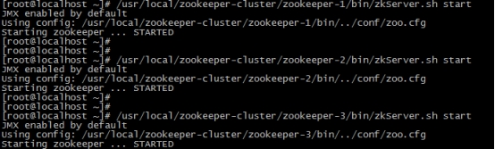
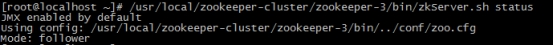
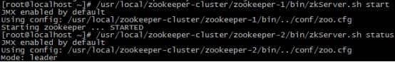

# zookeeper

## 概念


## 数据模型


## 服务器端常用命令


## 客户端常用命令


## javaAPI操作

主要使用Curator进行操作，zookeeper本身也有相应的代码，但是比较繁琐，Curator对他们进行了封装和简化

~~~xml
<!--curator-->
<dependency>
    <groupId>org.apache.curator</groupId>
    <artifactId>curator-framework</artifactId>
    <version>4.0.0</version>
</dependency>

<dependency>
    <groupId>org.apache.curator</groupId>
    <artifactId>curator-recipes</artifactId>
    <version>4.0.0</version>
</dependency>
~~~


### 建立连接

~~~java

/*
 *
 * @param connectString       连接字符串。zk server 地址和端口 "192.168.149.135:2181,192.168.149.136:2181"
 * @param sessionTimeoutMs    会话超时时间 单位ms
 * @param connectionTimeoutMs 连接超时时间 单位ms
 * @param retryPolicy         重试策略
 * @param namespace           命名空间，所有的操作都在该目录下进行，默认为 / 目录，代码中表示在 /itheima 目录下操作
 */
 
//重试策略
RetryPolicy retryPolicy = new ExponentialBackoffRetry(3000,10);
/*
1.第一种方式
CuratorFramework client = CuratorFrameworkFactory.newClient("192.168.149.135:2181",60 * 1000, 15 * 1000, retryPolicy);
*/

//2.第二种方式
//CuratorFrameworkFactory.builder();
CuratorFramework client = CuratorFrameworkFactory.builder()
        .connectString("192.168.149.135:2181")
        .sessionTimeoutMs(60 * 1000)
        .connectionTimeoutMs(15 * 1000)
        .retryPolicy(retryPolicy)
        .namespace("itheima")
        .build();

//开启连接
client.start();
~~~


### 创建节点

~~~java
//创建节点 带有数据
//如果创建节点，没有指定数据，则默认将当前客户端的ip作为数据存储
String path = client.create().forPath("/app2", "hehe".getBytes());
System.out.println(path);

//3. 设置节点的类型
//默认类型：持久化
String path = client.create().withMode(CreateMode.EPHEMERAL).forPath("/app3");
System.out.println(path);

//4. 创建多级节点  /app1/p1
//creatingParentsIfNeeded():如果父节点不存在，则创建父节点
String path = client.create().creatingParentsIfNeeded().forPath("/app4/p1");
System.out.println(path);
~~~


### 查询节点

~~~java
/**
 * 查询节点：
 * 1. 查询数据：get: getData().forPath()
 * 2. 查询子节点： ls: getChildren().forPath()
 * 3. 查询节点状态信息：ls -s:getData().storingStatIn(状态对象).forPath()
 */


//1. 查询数据：get
byte[] data = client.getData().forPath("/app1");
System.out.println(new String(data));

// 2. 查询子节点： ls
List<String> path = client.getChildren().forPath("/");
System.out.println(path);

//3. 查询节点状态信息：ls -s
Stat status = new Stat();
client.getData().storingStatIn(status).forPath("/app1");
System.out.println(status);
~~~


### 修改节点


~~~java
/**
 * 修改数据
 * 1. 基本修改数据：setData().forPath()
 * 2. 根据版本修改: setData().withVersion().forPath()
 * * version 是通过查询出来的。目的就是为了让其他客户端或者线程不干扰我。
 *
 * @throws Exception
 */

//正常修改
client.setData().forPath("/app1", "itcast".getBytes());


//修改相应版本的数据
Stat status = new Stat();
client.getData().storingStatIn(status).forPath("/app1");

int version = status.getVersion();//查询出来的
System.out.println(version);
client.setData().withVersion(version).forPath("/app1", "hehe".getBytes());
~~~


### 删除节点

~~~java
/**
 * 删除节点： delete deleteall
 * 1. 删除单个节点:delete().forPath("/app1");
 * 2. 删除带有子节点的节点:delete().deletingChildrenIfNeeded().forPath("/app1");
 * 3. 必须成功的删除:为了防止网络抖动。本质就是重试。  client.delete().guaranteed().forPath("/app2");
 * 4. 回调：inBackground,执行完删除后运行回调函数中的内容
 * @throws Exception
 */


// 1. 删除单个节点
client.delete().forPath("/app1");


//2. 删除带有子节点的节点
client.delete().deletingChildrenIfNeeded().forPath("/app4");


//3. 必须成功的删除
client.delete().guaranteed().forPath("/app2");


//4. 回调
client.delete().guaranteed().inBackground(new BackgroundCallback(){
    @Override
    public void processResult(CuratorFramework client, CuratorEvent event) throws Exception {
        System.out.println("我被删除了~");
        System.out.println(event);
    }
}).forPath("/app1");
~~~


### Watch监听事件

#### 概念

ZooKeeper 允许用户在指定节点上注册一些Watcher，并且在一些特定事件触发的时候，ZooKeeper 服务端会将事件通知到感兴趣的客户端上去，该机制是 ZooKeeper 实现分布式协调服务的重要特性。

ZooKeeper 中引入了Watcher机制来实现了发布/订阅功能能，能够让多个订阅者同时监听某一个对象，当一个对象自身状态变化时，会通知所有订阅者。

ZooKeeper 原生支持通过注册Watcher来进行事件监听，但是其使用并不是特别方便需要开发人员自己反复注册Watcher，比较繁琐。

Curator引入了 Cache 来实现对 ZooKeeper 服务端事件的监听。

ZooKeeper提供了三种Watcher：

- NodeCache : 只是监听某一个特定的节点

- PathChildrenCache : 监控一个ZNode的子节点. 

- TreeCache : 可以监控整个树上的所有节点，类似于PathChildrenCache和NodeCache的组合


#### NodeCache

只监听指定节点

~~~java
public void testNodeCache() throws Exception {
    //1. 创建NodeCache对象
    final NodeCache nodeCache = new NodeCache(client,"/app1");
    //2. 注册监听
    nodeCache.getListenable().addListener(new NodeCacheListener() {
        @Override
        public void nodeChanged() throws Exception {
            System.out.println("节点变化了~");

            //获取修改节点后的数据
            byte[] data = nodeCache.getCurrentData().getData();
            System.out.println(new String(data));
        }
    });

    //3. 开启监听.如果设置为true，则开启监听是，加载缓冲数据
    nodeCache.start(true);


    while (true){
		//使得代码一直运行，否则运行结束后监听就会关闭
    }
}
~~~


运行后，可以在客户端添加、修改或者删除节点，在终端会打印 节点变化了~


#### PathChildCache

监听指定节点的所有子节点，不包括自己

~~~java
public void testPathChildrenCache() throws Exception {
    //1.创建监听对象
    PathChildrenCache pathChildrenCache = new PathChildrenCache(client,"/app2",true);

    //2. 绑定监听器
    pathChildrenCache.getListenable().addListener(new PathChildrenCacheListener() {
        @Override
        public void childEvent(CuratorFramework client, PathChildrenCacheEvent event) throws Exception {
            System.out.println("子节点变化了~");
            System.out.println(event);
            
            //监听子节点的数据变更，并且拿到变更后的数据
            //1.获取类型
            PathChildrenCacheEvent.Type type = event.getType();
            //2.判断类型是否是update
            if(type.equals(PathChildrenCacheEvent.Type.CHILD_UPDATED)){
                System.out.println("数据变了！！！");
                byte[] data = event.getData().getData();//event中的data字段中的data字段才是真正的数据
                System.out.println(new String(data));

            }
        }
    });
    //3. 开启
    pathChildrenCache.start();

    while (true){

    }
}
~~~


#### TreeCache

监听子树的所有节点

~~~java
public void testTreeCache() throws Exception {
    //1. 创建监听器
    TreeCache treeCache = new TreeCache(client,"/app2");

    //2. 注册监听
    treeCache.getListenable().addListener(new TreeCacheListener() {
        @Override
        public void childEvent(CuratorFramework client, TreeCacheEvent event) throws Exception {
            System.out.println("节点变化了");
            System.out.println(event);
        }
    });

    //3. 开启
    treeCache.start();

    while (true){

    }
}
~~~


### 分布式锁

#### 概念

在我们进行单机应用开发，涉及并发同步的时候，我们往往采用synchronized或者Lock的方式来解决多线程间的代码同步问题，这时多线程的运行都是在同一个JVM之下，没有任何问题。

但当我们的应用是分布式集群工作的情况下，属于多JVM下的工作环境，跨JVM之间已经无法通过多线程的锁解决同步问题。

那么就需要一种更加高级的锁机制，来处理种**跨机器的进程之间的数据同步问题**——这就是分布式锁。


在Curator中有五种锁方案：

- InterProcessSemaphoreMutex：分布式排它锁（非可重入锁）

- InterProcessMutex：分布式可重入排它锁

- InterProcessReadWriteLock：分布式读写锁

- InterProcessMultiLock：将多个锁作为单个实体管理的容器

- InterProcessSemaphoreV2：共享信号量


#### 原理

核心思想：当客户端要获取锁，则创建节点，使用完锁，则删除该节点。

1. 客户端获取锁时，在lock节点下创建**临时顺序**节点。
   - 临时节点是为了防止获取锁的节点突然宕机导致锁不释放
   - 顺序是为了找最小节点
2. 然后获取lock下面的所有子节点，客户端获取到所有的子节点之后，如果发现自己创建的子节点序号最小，那么就认为该客户端获取到了锁。使用完锁后，将该节点删除。
3. 如果发现自己创建的节点并非lock所有子节点中最小的，说明自己还没有获取到锁，此时客户端需要找到比自己小的那个节点，同时对其注册事件监听器，监听删除事件。
4. 如果发现比自己小的那个节点被删除，则客户端的Watcher会收到相应通知，此时再次判断自己创建的节点是否是lock子节点中序号最小的，如果是则获取到了锁，如果不是则重复以上步骤继续获取到比自己小的一个节点并注册监听。


#### 实现

主要代码

~~~java
private InterProcessMutex lock ;//创建锁

lock = new InterProcessMutex(client,"/lock");//在线程的构造函数中给锁绑定客户端

lock.acquire(3, TimeUnit.SECONDS);//设置重试获取锁操作的次数
~~~


主要场景如下，12306存储票资源，并绑定zookeeper提供分布式锁


Ticket2306类，充当12306的角色

~~~java
package com.itheima.curator;

import org.apache.curator.RetryPolicy;
import org.apache.curator.framework.CuratorFramework;
import org.apache.curator.framework.CuratorFrameworkFactory;
import org.apache.curator.framework.recipes.locks.InterProcessMutex;
import org.apache.curator.retry.ExponentialBackoffRetry;

import java.util.concurrent.TimeUnit;

public class Ticket12306 implements Runnable{

    private int tickets = 10;//数据库的票数

    private InterProcessMutex lock ;


    public Ticket12306(){
        //重试策略
        RetryPolicy retryPolicy = new ExponentialBackoffRetry(3000, 10);
        //2.第二种方式
        //CuratorFrameworkFactory.builder();
        CuratorFramework client = CuratorFrameworkFactory.builder()
                .connectString("192.168.149.135:2181")
                .sessionTimeoutMs(60 * 1000)
                .connectionTimeoutMs(15 * 1000)
                .retryPolicy(retryPolicy)
                .build();

        //开启连接
        client.start();

        lock = new InterProcessMutex(client,"/lock");
    }

    @Override
    public void run() {

        while(true){
            //获取锁
            try {
                lock.acquire(3, TimeUnit.SECONDS);
                if(tickets > 0){

                    System.out.println(Thread.currentThread()+":"+tickets);
                    Thread.sleep(100);
                    tickets--;
                }
            } catch (Exception e) {
                e.printStackTrace();
            }finally {
                //释放锁
                try {
                    lock.release();
                } catch (Exception e) {
                    e.printStackTrace();
                }
            }


        }

    }
}
~~~


LockTest类，充当买票的角色

~~~java
package com.itheima.curator;

import org.apache.curator.RetryPolicy;
import org.apache.curator.framework.CuratorFramework;
import org.apache.curator.framework.CuratorFrameworkFactory;
import org.apache.curator.framework.recipes.cache.*;
import org.apache.curator.retry.ExponentialBackoffRetry;
import org.junit.After;
import org.junit.Before;
import org.junit.Test;

public class LockTest {


    public static void main(String[] args) {
        Ticket12306 ticket12306 = new Ticket12306();

        //创建客户端
        Thread t1 = new Thread(ticket12306,"携程");
        Thread t2 = new Thread(ticket12306,"飞猪");

        t1.start();
        t2.start();
    }

}
~~~


## 集群

### 概念

Leader选举：

- **Serverid：服务器ID**，比如有三台服务器，编号分别是1,2,3，编号越大在选择算法中的权重越大。

- **Zxid：数据ID**，服务器中存放的最大数据ID.值越大说明数据越新，在选举算法中数据越新权重越大。

- 在Leader选举的过程中，如果某台ZooKeeper获得了超过半数的选票，则此ZooKeeper就可以成为Leader了。

### 搭建Zookeeper集群

#### 1.1 搭建要求

真实的集群是需要部署在不同的服务器上的，但是在我们测试时同时启动很多个虚拟机内存会吃不消，所以我们通常会搭建**伪集群**，也就是把所有的服务都搭建在一台虚拟机上，用端口进行区分。

我们这里要求搭建一个三个节点的Zookeeper集群（伪集群）。

#### 1.2 准备工作

重新部署一台虚拟机作为我们搭建集群的测试服务器。

（1）安装JDK  【此步骤省略】。

（2）Zookeeper压缩包上传到服务器

（3）将Zookeeper解压 ，建立/usr/local/zookeeper-cluster目录，将解压后的Zookeeper复制到以下三个目录

/usr/local/zookeeper-cluster/zookeeper-1

/usr/local/zookeeper-cluster/zookeeper-2

/usr/local/zookeeper-cluster/zookeeper-3

```shell
#注意版本不同版本号要改
[root@localhost ~]# mkdir /usr/local/zookeeper-cluster
[root@localhost ~]# cp -r  apache-zookeeper-3.5.6-bin /usr/local/zookeeper-cluster/zookeeper-1
[root@localhost ~]# cp -r  apache-zookeeper-3.5.6-bin /usr/local/zookeeper-cluster/zookeeper-2
[root@localhost ~]# cp -r  apache-zookeeper-3.5.6-bin /usr/local/zookeeper-cluster/zookeeper-3
```

（4）创建data目录 ，并且将 conf下zoo_sample.cfg 文件改名为 zoo.cfg

```shell
mkdir /usr/local/zookeeper-cluster/zookeeper-1/data
mkdir /usr/local/zookeeper-cluster/zookeeper-2/data
mkdir /usr/local/zookeeper-cluster/zookeeper-3/data

mv  /usr/local/zookeeper-cluster/zookeeper-1/conf/zoo_sample.cfg  /usr/local/zookeeper-cluster/zookeeper-1/conf/zoo.cfg
mv  /usr/local/zookeeper-cluster/zookeeper-2/conf/zoo_sample.cfg  /usr/local/zookeeper-cluster/zookeeper-2/conf/zoo.cfg
mv  /usr/local/zookeeper-cluster/zookeeper-3/conf/zoo_sample.cfg  /usr/local/zookeeper-cluster/zookeeper-3/conf/zoo.cfg
```


（5） 配置每一个Zookeeper 的dataDir 和 clientPort 分别为2181  2182  2183

修改/usr/local/zookeeper-cluster/zookeeper-1/conf/zoo.cfg

```shell
vim /usr/local/zookeeper-cluster/zookeeper-1/conf/zoo.cfg

clientPort=2181
dataDir=/usr/local/zookeeper-cluster/zookeeper-1/data
```

修改/usr/local/zookeeper-cluster/zookeeper-2/conf/zoo.cfg

```shell
vim /usr/local/zookeeper-cluster/zookeeper-2/conf/zoo.cfg

clientPort=2182
dataDir=/usr/local/zookeeper-cluster/zookeeper-2/data
```

修改/usr/local/zookeeper-cluster/zookeeper-3/conf/zoo.cfg

```shell
vim /usr/local/zookeeper-cluster/zookeeper-3/conf/zoo.cfg

clientPort=2183
dataDir=/usr/local/zookeeper-cluster/zookeeper-3/data
```


#### 1.3 配置集群

（1）在每个zookeeper的 data 目录下创建一个 myid 文件，内容分别是1、2、3 。这个文件就是记录每个服务器的ID

echo是把指定的内容打印到指定的文件中的命令

```shell
echo 1 >/usr/local/zookeeper-cluster/zookeeper-1/data/myid
echo 2 >/usr/local/zookeeper-cluster/zookeeper-2/data/myid
echo 3 >/usr/local/zookeeper-cluster/zookeeper-3/data/myid
```


（2）在每一个zookeeper 的 zoo.cfg配置客户端访问端口（clientPort）和集群服务器IP列表。

集群服务器IP列表如下

```shell
vim /usr/local/zookeeper-cluster/zookeeper-1/conf/zoo.cfg
vim /usr/local/zookeeper-cluster/zookeeper-2/conf/zoo.cfg
vim /usr/local/zookeeper-cluster/zookeeper-3/conf/zoo.cfg

#都加入如下内容
server.1=192.168.149.135:2881:3881
server.2=192.168.149.135:2882:3882
server.3=192.168.149.135:2883:3883
```

解释：server.服务器ID=服务器IP地址：服务器之间通信端口：服务器之间投票选举端口


 

#### 1.4 启动集群

启动集群就是分别启动每个实例。

```shell
/usr/local/zookeeper-cluster/zookeeper-1/bin/zkServer.sh start
/usr/local/zookeeper-cluster/zookeeper-2/bin/zkServer.sh start
/usr/local/zookeeper-cluster/zookeeper-3/bin/zkServer.sh start
```


 

启动后我们查询一下每个实例的运行状态

```shell
/usr/local/zookeeper-cluster/zookeeper-1/bin/zkServer.sh status
/usr/local/zookeeper-cluster/zookeeper-2/bin/zkServer.sh status
/usr/local/zookeeper-cluster/zookeeper-3/bin/zkServer.sh status
```


先查询第一个服务

 

Mode为follower表示是**跟随者**（从）

再查询第二个服务Mod 为leader表示是**领导者**（主）

 

查询第三个为跟随者（从）

 


#### 1.5 模拟集群异常

（1）首先我们先测试如果是从服务器挂掉，会怎么样

把3号服务器停掉，观察1号和2号，发现状态并没有变化

```shell
/usr/local/zookeeper-cluster/zookeeper-3/bin/zkServer.sh stop

/usr/local/zookeeper-cluster/zookeeper-1/bin/zkServer.sh status
/usr/local/zookeeper-cluster/zookeeper-2/bin/zkServer.sh status
```

 

由此得出结论，3个节点的集群，从服务器挂掉，集群正常

（2）我们再把1号服务器（从服务器）也停掉，查看2号（主服务器）的状态，发现已经停止运行了。

```shell
/usr/local/zookeeper-cluster/zookeeper-1/bin/zkServer.sh stop

/usr/local/zookeeper-cluster/zookeeper-2/bin/zkServer.sh status
```


 

由此得出结论，3个节点的集群，2个从服务器都挂掉，主服务器也无法运行。**因为可运行的机器没有超过集群总数量的半数。**

（3）我们再次把1号服务器启动起来，发现2号服务器又开始正常工作了。而且依然是领导者。

```shell
/usr/local/zookeeper-cluster/zookeeper-1/bin/zkServer.sh start

/usr/local/zookeeper-cluster/zookeeper-2/bin/zkServer.sh status
```


 

（4）我们把3号服务器也启动起来，把2号服务器停掉,停掉后观察1号和3号的状态。

```shell
/usr/local/zookeeper-cluster/zookeeper-3/bin/zkServer.sh start
/usr/local/zookeeper-cluster/zookeeper-2/bin/zkServer.sh stop

/usr/local/zookeeper-cluster/zookeeper-1/bin/zkServer.sh status
/usr/local/zookeeper-cluster/zookeeper-3/bin/zkServer.sh status
```


 

发现新的leader产生了~  

由此我们得出结论，当集群中的主服务器挂了，集群中的其他服务器会自动进行选举状态，然后产生新得leader 

（5）我们再次测试，当我们把2号服务器重新启动起来启动后，会发生什么？2号服务器会再次成为新的领导吗？我们看结果

```shell
/usr/local/zookeeper-cluster/zookeeper-2/bin/zkServer.sh start

/usr/local/zookeeper-cluster/zookeeper-2/bin/zkServer.sh status
/usr/local/zookeeper-cluster/zookeeper-3/bin/zkServer.sh status
```


 

我们会发现，2号服务器启动后依然是跟随者（从服务器），3号服务器依然是领导者（主服务器），没有撼动3号服务器的领导地位。

由此我们得出结论，当领导者产生后，再次有新服务器加入集群，不会影响到现任领导者。


### 集群角色

在ZooKeeper集群服中务中有三个角色，每个角色中的数据都一模一样：

- Leader 领导者：
  1. 处理事务请求，处理完成后会向所有角色发送信息进行同步
  2. 集群内部各服务器的调度者

- Follower 跟随者 ：
  1. 处理客户端非事务请求，转发事务请求给Leader服务器
  2. 参与Leader选举投票

- Observer 观察者：
  1. 处理客户端非事务请求，转发事务请求给Leader服务器

