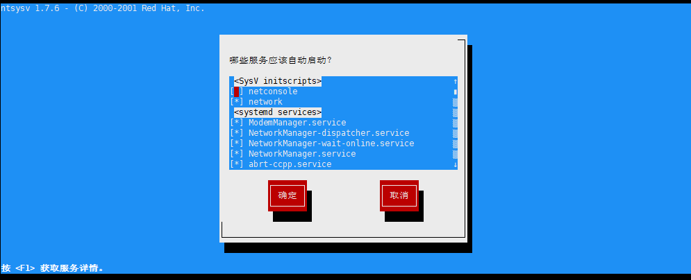
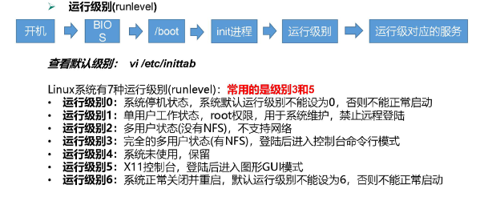

# Linux

## 网络配置

### 1 网络模式

### 2 修改静态ip

进入配置文件

~~~bash
vim /etc/sysconfig/network-scripts/ifcfg-ens33
~~~

文件如下，需要修改BOOTPROTO为static，并加入最后三行（把注释去掉）

~~~yml
TYPE=Ethernet
PROXY_METHOD=none
BROWSER_ONLY=no
BOOTPROTO="dhcp"
DEFROUTE=yes
IPV4_FAILURE_FATAL=no
IPV6INIT=yes
IPV6_AUTOCONF=yes
IPV6_DEFROUTE=yes
IPV6_FAILURE_FATAL=no
IPV6_ADDR_GEN_MODE=stable-privacy
NAME=ens33
UUID=f88d6100-8cd4-4d30-afc1-52391aa2001e
DEVICE=ens33
ONBOOT=yes
#IPADDR=192.168.154.100
#GATEWAY=192.168.154.2
#DNS1=192.168.154.2
~~~

第三个网段需要和分配的VMnet8的第三个网段一致，而且VMware8的IP地址必须设置为自动获取

（不过现在的路由器，很多都比较智能，就算重新分配，也会把你之前用过的IP继续分配给你，路由器获取了你的网卡Mac物理地址。如果没有其它新机器占用你的IP，它默认还是分配给你的。）

192.168.154.2是VMware创建的虚拟路由器的地址

然后重新启动网络服务

~~~bash
service network restart
~~~

### 3 配置主机名

方便连接

使用下面的命令可以查看主机名

~~~bash
hostname
~~~

修改配置文件修改主机名

~~~bash
vim /etc/hostname
~~~

这样修改以后需要重启才能看到效果

直接使用命令修改主机名

~~~bash
hostnamectl set-hostname 主机名
~~~

这样修改以后重新打开的终端都是新的名字

### 4 修改host文件

进入linux的hosts文件

~~~bash
vim /etc/hosts
~~~

在配置文件最下边添加

~~~yml
192.168.154.100 hadoop100
192.168.154.101 hadoop101
192.168.154.102 hadoop102
192.168.154.103 hadoop103
192.168.154.104 hadoop104
192.168.154.105 hadoop105
~~~

windows也同样添加

路径

C:\Windows\System32\drivers\etc\hosts

同样添加

~~~yml
192.168.154.100 hadoop100
192.168.154.101 hadoop101
192.168.154.102 hadoop102
192.168.154.103 hadoop103
192.168.154.104 hadoop104
192.168.154.105 hadoop105
~~~

## 远程登陆和文件传输

### 命令行操作

可以使用ssh远程登陆linux主机

在windows主机cmd中

~~~shell
ssh root@hadoop100
~~~

表示使用root身份登陆hadoop100，之后输入密码即可登陆成功

使用exit可以退出登陆

使用scp命令可以进行文件传输，这里不再赘述

### 使用软件Xshell

使用Xshell可以方便快捷的连接远程主机

使用Xftp可以方便的传输文件

## 系统管理

### 进程

一般被称为**服务**

**守护进程**就是系统的服务

查看系统服务

~~~bash
cd /etc/init.d
~~~

centos6主要使用service命令进行管理

centos7主要使用systemctl进行服务管理

~~~bash
cd /usr/lib/systemd
~~~

基本语法

~~~bash
systemctl stat|stop|restart|status 服务名
~~~

### 进程开机自启动

**命令行模式**

~~~bash
systemctl list-unit-files （功能描述：查看服务开机启动状态）

systemctl disable service_name （功能描述：关掉指定服务的自动启动）

systemctl enable service_name （功能描述：开启指定服务的自动启动）
~~~

**图形化模式**

使用setup命令进入即可设置

加星表示开机自启动，使用空格可以加星或者去星

 

### 运行级别

不同的运行级别会启动不同的服务

**centos6的运行级别**

**centos7的运行级别**

CentOS7 的运行级别简化为:

multi-user.target 等价于原运行级别 3（多用户有网，无图形界面）

graphical.target 等价于原运行级别 5（多用户有网，有图形界面）

查看当前运行级别:

~~~bash
systemctl get-default
~~~

修改当前运行级别

~~~bash
systemctl set-default TARGET.target （这里 TARGET 取 multi-user 或者 graphical）
~~~

ctrl alt F2也可以进入运行级别3

### 关机

60秒后关机

~~~bash
shutdown
~~~

取消关机指令

~~~bash
shutdown -c
~~~

立即关机

~~~bash
shutdown now
~~~

定时关机

~~~bash
shutdown 15:28
#15:28关机

shutdown 13
#3分钟后关机
~~~

其他命令

（1）sync （功能描述：将数据由内存同步到硬盘中）

（2）halt （功能描述：停机，关闭系统，但不断电）

（3）poweroff （功能描述：关机，断电）

（4）reboot （功能描述：就是重启，等同于 shutdown -r now）

Linux 系统中为了提高磁盘的读写效率，对磁盘采取了 “预读迟写”操作方式。当用户保存文件时，Linux 核心并不一定立即将保存数据写入物理磁盘中，而是将数据保存在缓冲区中，等缓冲区满时再写入磁盘，这种方式可以极大的提高磁盘写入数据的效率。但是，也带来了安全隐患，如果数据还未写入磁盘时，系统掉电或者其他严重问题出现，则将导致数据丢失。使用 sync 指令可以立即将缓冲区的数据写入磁盘。

## 常用基本命令

Shell 可以看作是一个命令解释器，为我们提供了交互式的文本控制台界面。我们可以通过终端控制台来输入命令，由 shell 进行解释并最终交给内核执行。 本章就将分类介绍常用的基本 shell 命令。

### 1 帮助命令

#### 1.1 man获取帮助信息

查看命令的说明

~~~bash
man 命令
~~~

一部分基础功能的系统命令是直接内嵌在 shell 中的，系统加载启动之后会随着 shell一起加载，常驻系统内存中。这部分命令被称为“内置（built-in）命令”；相应的其它命令被称为“外部命令”

查看内置命令

~~~bash、
help 命令
~~~

### 2 文件目录类

