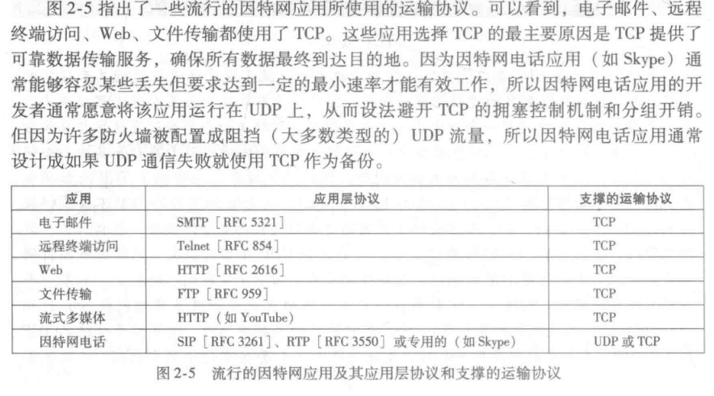
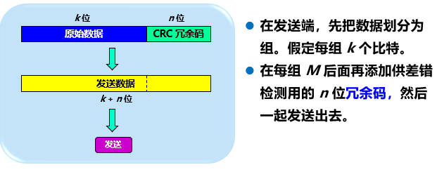
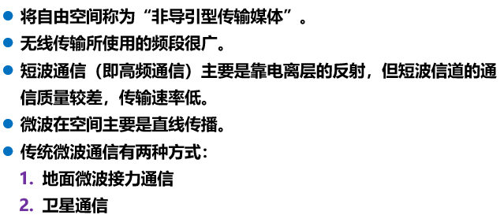

# 计算机网络

## 1 计算机网络和因特网

### 1.1 什么是因特网

1. 因特网的具体构成，即因特网的基本硬件和软件组件
2. 为分布式应用提供服务的联网基础设施

internet互连网：泛指多个计算机组成的网络，除TCP/IP外，还可以使用其他协议

Internet互联网（因特网）：当前全球最大的计算机网络，使用 TCP/IP

#### 1.1.1具体构成描述

##### 因特网，端系统，主机和分组

因特网是一个世界范围的计算机网络，是互联了全世界数十亿计算设备的网络

所有的这些设备被成为**主机（host）**或者**端系统（end system）**

发送数据时发送端会将数据分段，并为每段加上首部字节，称为**分组**

##### 通信链路和分组交换机

端系统通过**通信链路（communication link）**和**分组交换机（packet switch）**连接到一起

- **通信链路**：由不同的物理媒介组成，不同的链路具有不同的**传输速率**
- **分组交换机**：一条入通信链路接受分组，一条出通信链路转发分组
  - 主要有**路由器（router）**和**链层交换机（link-layer switch）**
    - **路由器**用于网络核心
    - **链路交换机**用于接入网
  - [交换机和路由器的区别](https://zhuanlan.zhihu.com/p/344718618)
  - 连接顺序如下：端系统->交换机->路由器->调制解调器（猫）->因特网
  - 现在家庭中的路由器一般都集成交换机的功能
- **路径（router或path）**

##### ISP

端系统通过**因特网服务提供商（Internet Service Provider，ISP）**接入因特网

- 每个**ISP**是一个由**多台分组交换机**和**多段通信链路**组成的网络

较低层的ISP通过较高层的ISP连接起来

较高层的ISP是由通过高速光纤链路互联的高速路由器组成

不论层级，每个ISP都是独立管理的

##### 协议

因特网部件都要运行一系列**协议（protocol）**，协议控制信息的接受和发送

**TCP（Transmission Control Protocol，传输层控制协议）**和**IP（Internet Protocol，网际协议）**是其中最重要的两个协议

IP定义了在路由器和端系统之间发送和接受的分组格式

因特网的主要协议统称为**TCP/IP**

##### 因特网标准RFC

**因特网标准（Internet standard）**由因特网工程任务组**（Internet Engineering Task Force，IETF）**研发

**IETF**的标准文档称为**请求评论（Request For Comment，RFC）**

RFC定义了TCP、IP、HTTP和SMTP等协议，目前已经有将近7000个RFC

其他组织也在制定网络组件的标准，例如 IEEE 802 LAN/MAN 标准化委员会制定了以太网和无限WIFI的标准

##### 网络类型

> 作用范围

**广域网** **WAN** **(Wide Area Network)**：作用范围通常为几十到几千公里。

**城域网** **MAN** **(Metropolitan Area Network)**：作用距离约为5~50公里。

**局域网** **LAN** **(Local Area Network)** ：局限在较小的范围（如1公里左右）。

**个人区域网** **PAN** **(Personal Area Network)** ：范围很小，大约在10米左右

> 使用者

**公用网** **(public network)** 

按规定交纳费用的人都可以使用的网络。因此也可称为公众网。

**专用网** **(private network)** 

为特殊业务工作的需要而建造的网络。

#### 1.1.2 服务描述

**为应用程序提供服务的基础设施的角度**描述因特网

电子邮件、视频会议等应用程序，涉及多个相互交换数据的端系统，故称为**分布式应用程序**

##### 套接字

与因特网相连的端系统提供了一个**套接字接口（socket interface）**

- **套接字接口规定了**：运行在一个端系统上的程序 请求因特网基础设施 向运行在另一个端系统 的特定目的地程序 交付数据 的方式
- **因特网套接字接口**：是一套发送程序必须遵守的规则合集

#### 1.1.3 什么是协议

为了完成一项工作，要求多个通信实体间运行相同的协议

**报文的交换**和**报文发送和接收时所采取的一系列动作**是定义一个协议的关键元素

- **协议（protocol）：**

  定义了 在两个或者多个通信实体之间 交换的报文格式和顺序，以及报文发送和接收一条报文 或其他事件 所采取的动作

不同的协议用于完成不同的通信任务

### 1.2 网络边缘

端系统位于因特网的边缘，因而得名

- 端系统包括：桌面计算机、服务器、移动计算机和多种其他类型的设备

主机=端系统

- 主机分为**客户（client）**和**服务器（server）**

大部分提供搜索结果、电子邮件、Web页面和视频的**服务器**都属于大型**数据中心（data center）**，每个数据中心都有大量服务器组成

#### 1.2.1 接入网

##### 接入网和边缘路由器

**接入网**是指将端系统物理连接到其边缘路由器的网络

**边缘路由器**是端系统到任何其他**远程端系统**的路径上的第一台路由器（同一个局域网内的路由器不是边缘路由器）

如下图，红色的表示**接入链路**和**边缘路由器**

##### 家庭接入因特网：DSL等

**“猫”指调制解调器**，所谓调制，就是把数字信号转换成电话线上传输的模拟信号;解调，即把模拟信号转换成数字信号。合称调制解调器。调制解调器的英文是“Modem”，读音与“猫”相似，因此被称作“猫”。简单来说，“猫”的主要作用是上连宽带线路，下连电脑，实现电脑与宽带的连接，这样电脑才能够正常上网。

**路由器**，又称网关设备，英文名是“Router”，是连接因特网中各局域网、广域网的设备，它会根据信道的情况自动选择和设定路由，以最佳路径，按前后顺序发送信号。路由器的作用是可以通过一根网线使几台电脑可以同时上网，起到一个分配的作用。路由器上面连接猫，下面连接电脑。

[“光猫”调制解调器 和 路由器的区别](https://blog.csdn.net/i1tws/article/details/88932669)

- **数字用户线（Digital Subscriber Line，DSL）**
  - 通常由电话公司提供，此时电话公司是ISP
  - 利用频分复用技术，可以使得电话呼叫和因特网连接共享DSL链路
  - 用户处，一个分配器（不是猫或者路由器）将电话信号和数据信号分开，并将数据信号分配给DSL调制解调器（modem）（猫）
- **电缆因特网接入（cable Internet access）**
  - 利用有限电视公司现有的有限电视基础设施
  - 需要用到特殊的调制解调器称为电缆调制解调器（cable modem）
  - 重要特点：共享广播媒体
- **光纤到户（Fiber To The Home，FTTH）**
  - 从本地中心局直接到家庭提供一条光纤路径
  - 光调制解调器（光猫），也叫光纤网络端接器（Optical Network Terminator，ONT）

##### 企业（和家庭）接入：以太网和WIFI

**局域网（LAN）**技术，将端系统接入到边缘路由器

- **以太网：**使用双铜绞线与以太网交换机相连，即家里的网线，交换机接路由器，路由器接因特网
- **WIFI：**基于IEEE 802.11技术的无限LAN接入，**基站（或者叫无限接入点，热点）**连接在企业网中（一般用有限以太网），并发出WIFI信号供设备无限连接，家庭中的路由器一般都继承了基站的功能

##### 广域无限接入：3G和LTE

用一个强大的基站覆盖广阔的范围，手机中的流量数据即为此

#### 1.2.2 物理媒介

对于每个 发射-接收器 对，通过跨域一种物理媒体（physical medium）传播电磁波或者光脉冲来发送数据

可以由多种形式，并且沿途的每对发射-接收器可使用不同的类型

##### 主要应用的物理媒介

- 双绞铜线
- 同轴电缆
- 光纤
- 陆地无线电信道：无线耳机，WIFI，流量数据等
- 卫星无限电信道

##### 分类

- **导引型媒体（guided media）：**电波沿固定媒体前行，如光缆、双铜绞线或同轴电缆
- **非导引型媒体（unguided media）：**电波在空气或外层空间中传播，如无线局域网或数字卫星频道

### 1.3 网络核心

由因特网端系统的分组交换机和链路构成的网状网络

如下图，红色部分为网络核心

通过网络链路和交换机移动数据有两种基本方法：

- 电路交换（circuit switching）
- 分组交换（packet switching）

#### 1.3.1 分组交换（packet switching）

##### 报文

端系统彼此交换**报文（message）**

报文

- 可以执行一种控制功能
- 可以包含数据

源系统将**长报文**划分成较小的数据块，给每个数据块加上一个首部，形成**分组（packet）**

每个分组都通过**分组交换机**和**通信链路**在源系统和目的地之间传送

每一个分组的首部都含有地址（诸如目的地址和源地址）等控制信息。

分组以等于该链路最大传输速率的速度传输通过通信链路

- L比特的分组
- 链路的传输速率为R比特/秒（不论链路长度）
- 传输分组的时间为L/R

##### 存储转发传输

多数分组交换机在链路的输入端使用**存储转发传输（store-and-forward transmission）**机制

- 在交换机能由开始向输出链路传输该分组的第一个比特之前，必须接收到整个分组
- 分组交换机会缓存（存储）已经到达的一个分组的部分

##### 传输时延

端系统或者路由器将分组**推到链路上**所用的时间

- 一个分组
  - d~tot~=L/R~1~+L/R~2~+L/R~3~+...+L/R~n~
- 多个分组(若没有拥塞的话)
  - d~tot~=L~n-1~/R~1~+ d~n~

##### 排队时延和分组丢失

每台分组交换机有多条链路与之相连

对于**每条相连的链路**，该分组交换机都具有一个**输出缓存（output buffer**，也称为**输出队列（output queue）**）

输出缓存用来存储需要传输到某条链路的分组

分组到达缓存时前边已有分组正在传输，则产生**排队时延（queuing delay）**

缓存有限，当以充满时，将出现**分组丢失（丢包）（packet loss）**，已经到达的分组或者已经排队的分组之一**将被丢弃**

##### 转发表和路由选择协议

当源系统向目的端系统发送一个分组时，源在该分组的首部包含目的地的IP地址

路由器检查该分组的目的地址的一部分，并向相邻路由器转发该分组

每台路由器具有一个**转发表（forwarding table）**，用于将目的地地址映射为输出链路

因特网具有特殊的**路由选择协议（routing protocol）**，用于**自动设置**转发表，该协议可以决定最短路径并且配置转发表

#### 1.3.2 电路交换

端系统通信会话期间，**预留了**端系统间延路径通信**所需要的资源**（缓存，链路传输速率等）

在分组交换网络中，这些资源不预留

会话的报文按需使用这些资源，后果是会产生排队接入线路

##### 电话网络

**电话网络**就是**电路交换网络**的例子

在能发送信息前，网络在发送方和接收方之间建立一条连接，路径上的所有交换机都将为该连接维护连接状态

同时在该网络链路上预留了恒定的传输速率（表示为每条链路传输容量的一部分），即预留了带宽，确保发送方能以**恒定的速率**向接收方传送数据

链路上剩余的带宽可并行（同时）供其他用户使用

该连接被称为一条**电路（circuit）**

##### 电路交换网络中的复用

链路中的电路通过**频分复用（Frequency-Division Multiplexing，FDM）**或**时分复用（Time-Division Multiplexing，TDM）**来实现

- **FDM**：链路的**频谱（不同振幅不同频率的简谐振动）**由跨越链路创建的所有连接共享

  每条连接专用一个频段，电话网络中，该频段宽度通常为4kHz（每秒4000周期），该频段宽度称为**带宽（band-width）**

  例如：调频无线电台使用FDM共享88MHz~108MHz的频谱，每个电台被分配一个特定的频段

- **TDM**：时间被划分为固定期间的**帧**，并且每个帧被划分为固定数量的**时隙**

  当网络建立一条连接时，网络在**每个帧**中为该连接**指定一个时隙**，这些时隙由该链接单独专门使用，一个时隙（在每个帧内）可用于传输该连接的数据

  对于TDM，一条电路中的**传输速率**等于**帧速率**乘**一个时隙中的比特数量**

  或者等于**比特速率**除以**每帧的时隙数**

  例如：链路每秒传输8000个帧，每个时隙由8个比特组成，则每条电路的传输速率是64kbps

还有STDM统计时分复用，即按照需求动态分配时隙，提高线路利用率

##### 电路交换的时延

总时延=电路的建立时延+发送时延+传播时延

电路交换没有存储转发，并且一直占有线路，所以没有处理时延和排队时延。

##### 电路交换和分组交换的对比

总的来说，**分组交换更好**

#### 1.3.3 网络中的网络

不仅端用户和内容提供商要连接到接入ISP，接入ISP之间也要互联

通过创建**网络的网络**能够做到这点

##### 因特网结构

以逐步递进的方式建造一系列网络结构，其中每个新结构都能更好的接近现在的复杂的因特网：

1. **网络结构1**：用单一的**全球传输ISP**互联所有接入ISP，接入ISP向全球传输ISP付费，此时接入ISP被认为是**客户（customer）**，全球传输ISP被认为是**提供商（provider）**

2. **网络结构2**：不同的公司建立了**很多**全球传输ISP，这些全球传输ISP之间互联

3. **网络结构3**：在任何给定的区域，可能有一个**区域ISP（regional ISP）**，区域中的接入ISP与之相连，区域ISP则与**第一层ISP（tier-1 ISP）**（即全球传输ISP）连接。全球大约有十几个第一层ISP。

   每个接入ISP连接区域ISP，每个区域ISP连接第一层ISP（接入ISP也能直接与第一层ISP连接）

   某些区域可能有较大的区域ISP，该区域中较小的区域ISP与之相连，较大的区域ISP又与第一层ISP相连

   例如：在中国， 每个城市都有接入ISP，他们与省级ISP相连，省级ISP又与国家级ISP相连，国家级ISP最终与第一层ISP相连
   
4. **网络结构4**：增加存在点（Point of Presence，PoP）、多宿、对等和因特网交换点。

   - **PoP（Point of Presence，PoP）**：存在于等级结构的所有层次，底层除外（接入ISP），一个PoP是提供商网络中的一台或者多台路由器（在相同位置）群组，对于要与提供商PoP连接的客户网络，他能从第三方电信提供商租用告诉链路将它的路由器之一连接到位于该PoP的一台路由器即可

   - **多宿（multi-home）**：任何ISP（第一层ISP除外）可以选择多宿（multi-home），即可以与多个提供商ISP相连

     例如：一个接入ISP即可以与两个区域ISP多宿，也可以与一个第一层ISP多宿

     当一个ISP多宿时，即使提供商之一出现故障，他仍然能继续接收和发送分组

   - **对等（peer）**：为减少向上层ISP支付的费用，位于相同等级结构的一对临近ISP能够对等，即将他们连接在一起，使他们之间的流量不用经过上游的ISP提供商

     当两个ISP对等时，通常不进行结算，即一个ISP不用向另一个ISP支付费用

     第一层ISP之间互相对等

   - **因特网交换点（Internet Exchange Point，IXP）**：第三方公司创建，IXP是一个汇合点，多个ISP可以在这里一起对等。

     IXP通常位于一个有自己的交换机的独立建筑中，今天的互联网中有400多个IXP

   网络结构4由接入ISP、区域ISP、第一层ISP、PoP、多宿、对等和IXP组成

5. **网络结构5**：在网络结构4顶部增加**内容提供商（content provider network）**

   某些公司建立专用的TCP/IP网络，独立于公共因特网，将一系列数据中心连接起来，这些专用网络仅承载出入该公司服务器的的流量

   同时这些专用网络通过与较低层的ISP对等（无结算）（直连或者在IXP连），尝试绕过因特网较高层

   同时有些接入ISP只能通过第一层ISP网络传输，所以谷歌网络也与第一层ISP相连，并就这些流量付费

下图粗略描述了因特网:

##### 因特网概述

今天的因特网就是一个网络中的网络，结构复杂，有十多个第一层ISP和数十万个较低层ISP组成

- 较低层的ISP与较高层ISP相连
- 较高层ISP彼此互联
- 用户和内容提供商使较低层的ISP客户
- 较低层的ISP是较高层的ISP的客户

### 1.4 分组交换网中的时延、丢包和吞吐量

#### 带宽

**两种不同意义：**

- **“带宽”(bandwidth)** 本来是指信号具有的频带宽度，其单位是赫（或千赫、兆赫、吉赫等）。

- 在计算机网络中，带宽用来表示网络中某通道传送数据的能力。表示在单位时间内网络中的某信道所能通过的“最高数据率”。单位是**bit/s**，即 **“比特每秒”。**  

在“带宽”的上述两种表述中，前者为**频域**称谓，而后者为**时域**称谓，其本质是相同的。也就是说，一条通信链路的“带宽”越宽，其所能传输的“最高数据率”也越高。

#### 往返时间RTT

round-trip time

表示从发送方发送数据开始，到发送方收到来自接收方的确认，总共经历的时间

在互联网中，往返时间还包括各中间结点的处理时延、排队时延以及转发数据时的发送时延。

#### 1.4.1 分组交换网中的时延概述

delay或者latency

##### 四种主要时延

- **节点处理时延（nodal processing delay）**：微秒或更低的数量级，处理完毕后将分组引向通向下一路由器链路之前的队列
  
  - 检查分组首部和决定该将分组导向何处所需要的时间
  - 检查比特级别的差错所需要的时间
- **排队时延（queuing delay）**：毫秒到微秒量级
  
  - 分组在队列中等待所需要的时间
  
- **传输时延（transmission delay）**：毫秒到微秒量级

  传输时延=分组长度/链路传输速率

  - 将分组的所有比特从队列推向链路所需要的时间

- **传播时延（propagation delay）**：广域网中，传播时延为毫秒量级

  传播延时=链路距离/链路传播速率

  - 从链路的起点到路由器B传播所需要的时间
    - **一个比特**从一台路由器传播到另一台路由器所需要的时间
  - 主要取决于该链路的物理媒介，速率范围为$2/times10^8 $~$3/times10^8 $m/s

##### 总时延

$d_{proc}$、$d_{queue}$、$d_{trans}$、$d_{prop}$分别表示处理时延、排队时延、传输时延、传播时延

则：

- $d_{tot}$=$d_{proc}$+$d_{queue}$+$d_{trans}$+$d_{prop}$

在不同的场景中，各个延时所占的比重不同

##### 时延带宽积

**BDP，Bandwidth Delay Product）**

BPD=传播时延*带宽

#### 1.4.2 排队时延和丢包

对于不同的分组，排队延时往往不同，因此常用统计量来度量

如：平均排队延时，排队延时方差和排队延时超过某些特定值的概率

##### 流量强度

- a表示分组到达队列的**平均速率**，单位为分组/秒，即pkt/s
- R代表**传输速率**，即队列中退出比特的速率，以bps即b/s为单位
- 假定所有分组都是由**L比特组成**
- 则比特到达队列的平均速率为La bps
- 最后假定该队列无限大

**流量强度（traffic intensity）：**

比率 **La/R** 被称为流量强度

用来估计排队时延范围

若La/R>1，则队列趋向于无限增加

流量工程中的金科玉律：**设计系统是流量强度不能大于1**

随着流量强度接近1，平均排队长度将变长

下图展示了流量强度和平均排队时长的关系

##### 丢包

实际上，队列的长度有限，若分组到达时队列是满的，则路由器将**丢弃（drop）**该分组

即该分组将会**丢失（lost）**

丢失的分组可能基于端到端的原则重传

##### 节点性能的度量

- 时延
- 丢包率

#### 1.4.3 端到端时延

各个节点延时相加即可

##### Traceroute

输入一个地址，该程序可以输出传输链路间的所有路由器的地址和名称，并记录丢包和延时的情况

[Traceroute网站](http://www.traceroute.com)

PingPlotter是图形化Traceroute软件

##### 端系统、应用程序和其他时延

还有一些其他重要时延

例如：

- 希望向共享媒体传输分组的端系统可能有意识地延迟传输
- 媒体分组化时延

#### 1.4.4 计算机网络中的吞吐量

**吞吐量** **(throughput)** 表示在单位时间内通过某个网络（或信道、接口）的数据量。

计算机网络中另一个至关重要的性能测度是**端到端吞吐量**

希望具有更可能高的吞吐量

任何时间的**瞬时吞吐量（instantaneous throughput）**是主机B接收到该文件地速率（以bps记）（在下载时一般软件会显示出来）

若文件由F比特组成，主机B接收到所有的F比特用时T秒，则文件的**平均吞吐量（average throughput）**是F/T bps

端到端传输中，吞吐量由**瓶颈链路（bottleneck link）**决定，即所有链路中最小的传输速率

如图：

.png)

$R_1$、$R_2$......$R_n$表示各个链路的传输速率

则端到端吞吐量为：min{$R_1,R_2...R_n$}

今天因特网中对吞吐量限制的因素通常是接入网（接入网的链路传输速率较低）

##### 共享链路，速率分配

多个连接共享链路时，每个链路会占用一部分链路速率

- 假如总链路速率为5Mbps
- 加入有10个连接
- 则平均分配时每个连接的速率为500kbps
- 此时该链路可能会称为瓶颈链路

### 1.5 协议层次及其服务模型

用来组织网络体系结构

#### 1.5.1 分层的体系结构

##### 协议分层

为了给网络协议的设计提供一个结构，网络设计者以**分层（layer）**的方式组织协议以及实现这些协议的网络硬件和软件

每个协议属于这些层次之一

每层通过在该层执行某些动作或使用直接下层的服务来提供服务

一个协议层能够用软件、硬件或者两者的结合来实现

协议分层具有概念化和结构化的优点

##### 协议栈

各层的所有协议被称为**协议栈（protocol stack）**

##### 5层因特网协议栈

是tcp/ip和OSI的综合

- **应用层（Application Layer）**：网络应用程序以及他们的应用协议存留的地方

  把位于应用层的信息分组称为**报文（message）**

  - HTTP：Web文档的请求和传送
  - SMTP：电子邮件报文的传输
  - FTP：提供两个端系统之间的文件传输
  - DNS：域名系统

- **运输层（Transport Layer）**：在应用程序端点之间传送应用层报文

  运输层的分组称为**报文段（segment）**

  - **TCP**：面向连接的服务
  - **UDP**：无连接服务

- **网络层（Network Layer）**：将分组通过网络从一台主机移动到另一台主机，也称为IP层

  网络层分组称为**数据报（datagram）**

  - **网际协议IP（Internet Protocol）**：定义了在 数据报中的各个字段 以及 端系统和路由器如何作用于这些字段
  - **路由选择协议**：决定路由，因特网有很多路由选择协议

- **链路层（Link Layer）**：将整个帧从一个网络元素移动到临近的网络元素

  网络层将数据报下传给链路层，链路层沿着路径将数据报传递给下一个节点

  由链路层提供的服务取决于应用于该链路的特定链路层协议

  链路层的分组称为**帧（frame）**

  - 以太网
  - WiFi
  - 电缆接入网的DOCSIS协议

- **物理层（Physical Layer）**：将帧中的一个个比特从一个节点移动到下一个节点

  该层协议于链路相关并于实际传输物理媒体有关

**对等层次之间**传送的数据单位称为该层的协议数据单元**PDU**(Protocol Data Unit)

**各层协议**实际上就是在各个对等层之间传递数据时的各项规定。

同一系统相**邻两层的实体进行交互的地方**，称为**服务访问点** **SAP** (Service Access Point)。

服务访问点SAP是一个抽象的概念，它实际上就是一个**逻辑接口**。

OSI把**层与层之间**交换的数据的单位称为服务数据单元 **SDU** (Service Data Unit)。

##### tcp/ip

是四层体系结构：应用层、运输层、网际层和网络接口层。

##### OSI模型

因特网协议栈不是唯一的协议栈

国际标准化组织（ISO）提出计算机网络围绕7层来组织，称为**开放系统互联（OSI）**模型

- 应用层
- 表示层：使通信的应用程序能够解释交换数据的含义，如数据压缩、数据加密和数据包描述
- 会话层：提供了数据交换的定界和同步功能，包括建立检查点和恢复方案的方法
- 运输层
- 网络层
- 数据链路层
- 物理层

是否需要表示层和会话层提供服务，留给应用程序开发者自己处理

[osi和tcp/ip的区别和联系是什么](https://www.php.cn/faq/494920.html#:~:text=OSI七层和TCP%2FIP的区别：,1、TCP%2FIP他是一个协议簇；而OSI（开放系统互联）则是一个模型，且TCP%2FIP的开发时间在OSI之前。 2、TCP%2FIP是由一些交互性的模块做成的分层次的协议，其中每个模块提供特定的功能；OSi则指定了哪个功能是属于哪一层的。)

#### 1.5.2 封装

链路层交换机实现了第一层和第二层，不能实现IP协议，但是能识别第二层地址，如以太网地址

路由器实现了第一层到第三层，能够实现IP协议

主机实现了所有5个层次

##### 封装（encapsulation）

每一层在接收到上一层的分组后，在该分组首部加上附加信息，形成该层的分组

1. **应用层报文（application-layer message）**传输给运输层，运输层收到报文并附上附加信息（所谓运输层首部信息），该首部被接收端运输层使用，应用层报文和运输层首部信息构成了**运输层报文段（transport-layer segment）**,运输层报文段因此封装了应用层报文
   - 附加信息也许包含下列信息：
     - 允许接收端运输层向上应用层交付报文的信息
     - 差错检测位信息，让接收方判断报文中的比特是否在途中改变
2. 运输层向网络层传输报文段，网络层增加首部信息，生成**网络层数据报（network-layer datagram）**
   - 附加信息包含：
     - 源的信息
     - 目的端系统地址
3. 网络层数据报传递给链路层，链路层增加链路层首部信息生成**链路层帧（link-layer frame）**

分组在每一层由两部分组成：

1. 首部字段
2. **有效载荷字段（payload field）**（通常来自上一层的分组）

下图粗略地展示了封装的过程

封装地过程还包括：

- 一个应用层大报文可能被分解为多个运输层报文段
- 一个运输层报文段可能被分解为多个网络层数据包

在接收端，必须从其连续的数据报中重构这样一个报文段

### 1.6 面对攻击的网络

##### 网络安全领域

- 如何攻击计算机网络
- 如何防御免受攻击
- 设计更好的能免除攻击的新型体系结构

##### 恶意软件

有恶意的东西统称为**恶意软件（malware）**

受害主机会称为数以千计的类似受害设备网络中的一员，他们被统称为**僵尸网路（botnet）**

黑客利用僵尸网络控制并有效地对目标主机展开垃圾邮件分发或分布式

**自我复制（self-replicating）**：感染一台主机后，会从那台主机寻求进入因特网上的其他主机，从而感染新主机

- **病毒（virus）**：需要某种形式的用户交互来感染用户设备的恶意软件，如包含可执行代码的电子邮件的附件
- **蠕虫（worm）**：无需任何用户交互就能进入设备的恶意程序，如攻击者能够利用来发送软件的脆弱网络应用程序

##### 拒绝服务攻击（Denial-of-Service（DoS） attack）

DoS攻击使得网络、主机或其他基础设施部分不能由合法用户使用

Web服务器、电子邮件服务器、DNS服务器和机构网络都能称为DoS攻击的目标

- **弱点攻击**：向目标主机上的易受攻击的应用程序或者操作系统发送制作精细的报文

- **带宽泛红**：向目标主机发送大量分组

- **连接泛红**：在目标主机中创建大量的半开或全卡的TCP连接

  - 单一攻击源有可能被服务器拦截

  - 攻击者可控制多个源并让他们发送流量，称为**分布式DoS（Distributed DoS，DDoS）**，充分利用数以千计的受害主机组成僵尸网络，DDoS更加难以检测和防范

    

##### 嗅探分组

在无限传输设备的附近放置一台被动的接收器，该接收器就能得到传输的每个分组的副本

还接收器被称为**分组嗅探器（packet sniffer）**

分组嗅探器也能部署在有线环境中，如以太网

##### 伪装

一个用户能够冒充另一个用户

- **IP哄骗（IP spoofing）**：将具有虚假源地址的分组注入因特网

**端点鉴别机制**可以解决这个问题

### 1.7 计算机网络和因特网的历史

#### 1.7.1 分组交换的发展：1961~1972

#### 1.7.2 专用网络和网络互联：1972~1980

#### 1.7.3 网络的激增：1980-1990

#### 1.7.4 因特网爆炸：20世纪90年代

#### 1.7.5 最新发展

## 2 应用层

网络应用是计算机网络**存在的理由**

因特网应用包括：

- 基于文本的应用
- 万维网
- 即使讯息和对等（P2P）文件共享
- IP电话
- 视频会议
- 。。。

### 2.1 应用层协议原理

研发网络应用程序的核心是写出能够 运行在不同的端系统 和 通过网络彼此通信 的程序

#### 2.1.1 网络应用程序体系结构

**应用程序体系结构（application architecture）**：规定了如何在各种端系统上组织该应用程序

- 客户-服务器体系结构
- 对等（P2P）体系结构

##### 客户-服务器体系结构（client-server architecture）

- 有一个总是打开的主机称为**服务器**，它服务来自许多其他称为客户的主机的请求
- 客户之间不直接通信
- 服务器具有固定的、周知的地址，称为IP地址

一台服务器的处理能力有限，配备大量主机的**数据中心（data center）**常被用于创建强大的虚拟服务器

##### P2P体系结构（P2P architecture）

对位于数据中心的服务器有最小的（或者没有）依赖

应用程序在间断连接的主机之间直接通信，这些主机被称为**对等方**

该体系结构被称为对等方到对等方的

例如：

- 文件共享（例如BitTorrent）
- 对等方协助下载加速器（例如迅雷）
- 因特网电话和视频会议（Skype）

某些应用具有混合体系结构，**结合了客户-服务器和P2P**的元素

例如：对于许多即使讯息应用而言，服务器被用于跟踪用户的IP地址，但是用户到用户的报文在用户主机之间（无需通过中间服务器）直接发送

**自扩展性（self-scalability）**

尽管每个对等方都由于请求文件产生工作负载，但是每个对等方通过向其他对等方分发文件也为系统增加服务能力

**优点和缺陷**

P2P体系结构也是有成本效率的，因为他们通常不需要庞大的服务器基础设施和服务器带宽

由于高度非集中式结构，面临安全性、性能和可靠性等挑战

#### 2.1.2 进程通信

##### 进程（process）

进行通信的实际上是进程而不是程序

在同一个端系统上，进程间通过进程间通信机制相互通信，该通信规则由端系统上的操作系统确定

计算机网络关注不同端系统（可能有不同的操作系统）上的进程间的通信

**多进程**：操作系统中同时运行的多个程序

**多线程**：在同一个进程中同时运行的多个任务

##### 客户和服务器进程

网络应用程序由**成对的进程**组成

这些进程间通过网络**互相发送报文**

对每对进程而言：

- 将两个进程之一标识为客户
- 另一个进程标识为服务器
  - 对Web：浏览器是客户进程，Web服务器是服务器进程
  - 对P2P：下载文件的对等方是客户，上载文件的对等方是服务器

**发起通信**的进程被标识为客户，在会话开始前**等待联系**的进程是服务器

##### 进程与计算机网络之间的接口：套接字

进程通过一个称为**套接字（socket）**的软件接口向网络发送报文和从网络接收报文

套接字是同一台主机内**应用层和运输层之间**的接口

套接字是建立网络应用程序的可编程接口，所以也被称为应用程序和网络之间的**应用程序编程接口（Application Programming Interface，API）**

开发者可以控制套接字在应用层的一切，但是对套接字在运输层端几乎没有控制权，仅能

- 选择运输层协议
- 也许能设定几个运输层参数，如最大缓存和最大报文段长度等

##### 进程寻址

为了标识接收进程，需要：

- 接收主机的地址
- 在主机中接收进程的标识符

##### IP地址（IP address）

因特网中，主机由IP地址标识，是一个32比特的量

##### 端口号（port number）

标识主机中的进程的套接字

流行的应用已经被分配了特定的端口号

- Web服务用端口号80标识
- 邮件服务器进程用端口号25标识
- 。。。

#### 2.1.3 可供应用程序使用的运输服务

应用层需要运输层协议提供下列服务：

- 可靠数据传输
- 吞吐量
- 定时
- 安全性

##### 可靠数据传输

数据丢失可能造成严重的后果

**可靠数据传输（reliable data transfer）**：确保由应用程序的一段发送的数据正确、完全地交付给应用程序地另一端

不提供该服务地协议，可能被**容忍丢失的应用（loss-tolerant application）**所接收，例如：多媒体应用，交谈式音频等

##### 吞吐量

1/rtt

网络路径的带宽被共享，所以其可用吞吐量可能随时变化

运输层协议能以某种特定的速率**提供确保的可用吞吐量**

- 应用程序能够请求r比特/秒的确保吞吐量
- 运输协议能确保可用吞吐量至少r比特/s

若运输协议不能提供这种吞吐量，则该应用程序或以较低的速率进行编码，或必须放弃发送

具有吞吐量要求的应用程序被称为**带宽敏感的应用（bandwidth-sensitive application）**，如多媒体应用

**弹性应用（elastic application）**能够根据当时可用的带宽或多或少地利用可供使用的吞吐量，如电子邮件、文件传输和Web传送

##### 定时

定时保证能以多种形式实现

例如：发送方注入套接字的每个比特到达接收方的套接字不迟于100ms

##### 安全性

有多种安全性协议：

- **机密性：**
  - 在发送主机：运输协议能够加密由发送进程传输的所有数据
  - 在接收主机：运输层协议能够在将数据交付给接收进程前解密这些数据
- **数据完整性和端点鉴别**
- 。。。

#### 2.1.4 因特网提供的运输服务

因特网（更一般时TCP/IP网络）为应用程序提供了两个运输层协议，UDP和TCP

不同的应用程序需要选择不同的协议

##### TCP服务

包括多种服务：

- 面向连接服务
  - 报文流动前，TCP让客户和服务器互相交换运输层控制信息，称为**握手**
  - 握手后，一个**TCP连接（TCP connection）**就在两个进程之间的套接字之间建立了
  - 该连接双工，即双方的进程可以同时在此连接上进行报文收发
  - 应用程序结束报文发送时，必须拆除该连接
- 可靠数据传输服务
  - 依靠TCP无差错、按适当顺序交付所有发送的数据
- 拥塞控制机制
  - 不一定为通信进程带来好处，但是能为整个因特网带来好处
  - 网络出现拥塞时，TCP会抑制所在的发送进程

##### SSL

TCP和UDP都没有提供任何加密机制

**安全套接字层（Secure Sockets Layer，SSL）**，是TCP的加强版本

在TCP基础上提供了安全性服务，包括加，数据完整性和端点鉴别

**具体过程**为：分组->SSL(进行加密)->TCP(密文传输给TCP)->TCP(接收端TCP)->SSL(接收端SSL解密)->接收端进程

##### UDP服务

不提供不必要服务的轻量级运输协议

无连接，通信前没有握手过程

- 不保报文到达接收进程
- 到达的报文可能乱序
- 无拥塞控制，能以选定的任何速率向其下层（网络层）注入数据

##### 因特网运输协议所不提供的服务

TCP和UDP能**保证**可靠数据传输和安全性，但是**无法保证**吞吐量和定时

现在的方法是通过设计技巧，将网络设计的**尽最大可能（但不保证）**去满足吞吐量和定时

##### TCP和UDP的选用

#### 2.1.5 应用层协议

##### 应用层协议（application-layer protocol）

定义了运行在不同端系统上的应用程序进程如何相互传递报文：

- 交换**报文的类型**，如请求报文和响应报文
- 各种报文类型的**语法**，如报文中的各个字段及这些字段是如何描述的
- 字段的**语义**，即这些字段中信息的含义
- 确定一个进程**何时以及如何**发送报文，对报文进行响应的规则

有些应用层协议有RFC文档定义，位于公共域中

- Web应用层协议HTTP（超文本传输协议[RFC2616]）

有些部位公共域使用：

- Skype使用了专用的应用层协议

##### 区分网络应用和应用层协议

应用层协议是网络应用非常重要的一部分

例如：

##### Web应用程序的组成

- 文档格式的标准（即HTML）
- Web浏览器
- Web服务器（如Apache、Microsoft服务器程序）
- 应用层协议，Web的应用层协议是**HTTP**

##### 电子邮件应用程序的组成

- 能容纳用户邮箱的邮件服务器
- 允许用户读取和生成邮件的客户程序
- 定义电子邮件报文结构的标准
- 定义报文如何传递的应用层协议
- 定义如何解释报文首部的应用层协议
- 电子邮件应用的主要应用层协议是**SMTP**

#### 2.1.6 本书涉及的网络应用

- Web应用
- 文件传输
- 电子邮件
- 目录服务
- 流式视频
- P2P

### 2.2 Web和HTTP

20世纪90年代之前，因特网的使用者主要是学术界和研究界

20世纪90年代初，一个新型的应用即**万维网（World Wide Web）**诞生

Web是一个引起公众注意的因特网应用，它将因特网从只是很多数据网之一的地位提升为仅有的一个数据网

特点：

- 按需操作：可以得到所想要的内容，不同于无线电广播和电视
- 信息发布简单：只需要极低的费用即可称为出版人
- 搜索引擎可以导航
- 。。。

#### 2.2.1 HTTP概况

Web的应用层协议是**超文本传输协议（HyperText Transfer Protocol，HTTP）**,它是Web的核心

##### Web术语

- **Web页面（Web page）（也叫文档）**

  - 由对象组成的，一个对象（object）是一个文件，他们可以通过一个URL寻址，如HTML文件，JPEG图形，JAVA小程序，视频片段
  - 多数Web页面含有一个**HTML基本文件（base HTML file**）以及几个引用对象
  - HTML基本文件通过对象的URL地址引用页面中的其他对象

- **URL地址**

  - 每个URL地址由两部分组成

    - 存放对象的服务器主机名

    - 对象的路径名
    
    例如：http://www.neu.edu.cn/SSTC/index.html，www.neu.edu.cn是主机名，/SSTC/index.html是路径名

- **Web服务器（Web server）**
  - 存储Web对象，由URL寻址
  - 流行的Web服务器：Apache，Microsoft Internet Information Server（微软互联网信息服务器）

##### 客户和服务器的交互过程

如下图

1. 用户请求一个Web页面（点击一个超链接）
2. 浏览器向服务器发出对该页面中所包含对象的HTTP请求报文
3. 服务器用包含这些对象的HTTP响应报文进行响应

HTTP使用TCP作为运输协议

HTTP是**无状态协议（stateless protocol）**，即不会保存客户的状态信息

#### 2.2.2 非持续连接和持续连接

HTTP默认使用持续连接，也能配置成使用非持续连接

##### 非持续连接（non-persistent connection）

每个TCP连接只传输一个请求报文和一个响应报文

- 第一次请求得到HTML文件
- 后续通过HTML中的引用得到更多的对象
- 服务器每发送一个对象，服务器进程通知TCP断开TCP连接，客户接收对象后TCP连接关闭
- 每个对象都是一个不同的TCP连接

浏览器可以**设置**TCP连接的**并行数量**，大部分浏览器默认打开5~10个并行的TCP连接

若将最大并行连接数设置为1，这样多条连接就会串行建立

使用并行连接可以缩短响应时间

###### 往返时间（Round-Trip Time，RTT）

一个短分组从客户到服务器然后再返回客户所花费的时间

包括：

- 传播时延
- 排队时延
- 分组处理时延

###### 三次握手

- 第一次握手：客户向服务器发送一个小TCP报文段
- 第二次握手：服务器用一个小TCP报文段做出确认和响应
- 第三次握手：客户向服务器返回确认

三次握手前两握耗费了一个RTT

客户的请求包含再第三次握手之中

总响应时间是**两个RTT**加上服务器**传输HTML文件的时间**

##### 持续连接（persistent connection）

###### HTTP1.1

HTTP1.1采用持续连接

服务器在发送响应后保持该TCP连接打开

后续的请求和响应报文能够通过相同的连接进行传送

- **一个完整的Web页面**（HTML基本文件和其他的对象），可以用单个持续TCP连接进行传送
- 位于一台服务器的**多个Web页面**发送给同一个用户时，可以在单个持续TCP连接上进行

一般来说，连接在一定时间未被使用，则HTTP服务器关闭该连接

###### HTTP/2

HTTP/2在HTTP1.1基础上构建

允许在相同的连接中多个请求和回答交错

增加了在该连接中优化HTTP报文请求和回答的机制

#### 2.2.3 HTTP报文格式

http报文有两种格式：请求报文和响应报文

##### HTTP请求报文

请求报文的通用格式

下面提供一个典型的HTTP请求报文：

~~~
GET /somedir/page.html HTTP/1.1
Host: www.someschool.edu
Connection: close
User-agent: Mozilla/5.0
Accept-language: fr

~~~

- 报文由ASCLL文本书写
- 报文由5行组成，每行由一个回车和换行符结束
- 一个请求报文至少为1行
- 末尾有一个回车和换行符

###### 请求行（request line）

第一行，有三个字段

- 方法字段
- URL字段
- HTTP版本字段

方法字段可取不同的值：GET，POST，HEDA，PUT和DELETE

当浏览器请求一个对象时，使用GET方法

###### 首部行（header line）

后继的行叫首部行

- Host行：指明了对象所在的主机（TCP连接中已经有该信息，但是Web代理高速缓存要用）
- Connection行：连接方式为非持续连接
- User-agent行：指明用户代理，即向服务器发送请求的浏览器类型（Mozilla/5.0表示Firefox浏览器），可以根据该信息发送相同对象的不同版本（有相同的URL地址）
- Accept-language行：表示用户想得到的对象的语言版本

###### 实体体（entity body）

GET时为空，POST时使用

包含的是用户在表单字段中的输入值

HTML表单在所请求的URL中包含输入的数据，例如：https://cn.bing.com/search?q=banana表示用bing搜索banana

其他的请求类型：

##### HTTP响应报文

响应报文的通用格式

下面这段报文是对上述报文的响应报文

~~~
HTTP/1.1 200 OK
Connection: close
Date: Tue, 18 Aug 2015 15:44:04 GMT
Server: Apache/2.2.3 (CentOS)
Last-Modified: Tue, 18 Aug 2015 15:11:03 GMT
Content-Length: 6821
Content-Type: text/html
(data data data......)
~~~

###### 状态行（status line）

包含三个字段：

- 协议版本
- 状态码
- 相应状态信息

###### 实体体（entity body）

报文的主要部分

包含了请求报文所请求的对象（data data data......）

###### 首部行（header line）

- Connection行：非持续连接
- Date行：指示服务器产生并发送响应报文的时间和日期
- Server行：指示服务器类型
- Last-Modified行：对象创建或者最后修改的时间
- Content-Length行：指示发送对象中的字节数
- Content-Type行：指示实体体中的对象是HTML文本

状态码：

首部行有很多不同类型

首部行可以被浏览器、Web服务器和Web缓存服务器插入

决定含有哪些首部行的因素：

- 浏览器类型
- 协议版本
- 浏览器的用户配置
- 等

#### 2.2.4 用户与服务器的交互：cookie

cookie在[RFC 6265]中定义

允许站点对用户进行追踪

cookie技术有4个组件：

- 在HTTP响应报文中的一个cookie首部行
- 在HTTP请求报文中的一个cookie首部行
- 在用户端系统中保留一个cookie文件，由浏览器管理
- Web站点的后端数据库

##### cookie工作流程

- 用户第一次访问某个站点，服务器端给用户一个标识，用一个包含Set-cookie:首部行的响应报文发送给客户
- 客户端收到响应报文，把标识信息保存在cookie文件中
- 后来每次用户访问该服务器，都会发送带有cookie:首部行的请求报文
- 服务器端根据cookie信息返回普通的响应报文

cookie可以在无状态的HTTP之上建立一个用户会话层

cookie可能会对隐私产生侵害

#### 2.2.5 Web缓存

**Web缓存器（Web cache）**也叫**代理服务器（proxy server）**

代表初始Web服务器来满足HTTP请求的网络实体

Web缓存器有自己的磁盘存储空间，并在存储空间中保存最近请求过的对象的副本

##### Web缓存器工作流程

- 浏览器创建一个到Web缓存器的TCP连接，并向Web缓存器中的对象发送一个HTTP请求
- Web缓存器检查缓存中看有没有副本，有就直接返回客户
- 没有，则Web与对象的初始服务器建立TCP连接，请求该对象
- Web缓存器收到对象后，将其保存为副本，再将该副本返回客户

Web缓存器通常由ISP购买安装

例如：大学再校园网上安装，并将所有校园网用户指向它

##### 使用Web缓存器的原因

- 大大减少对客户请求的响应时间（主要通过Web缓存器的缓存，Web缓存器一般与客户间有高速链路）
- 大大减少机构的接入链路到因特网的通信量，由此不必急于增加带宽，降低了费用
- 降低因特网的Web流量，改善所有应用的性能
- 成本较低，很多缓存器使用了运行在廉价PC上的公共域软件

实践中，Web缓存中存在请求对象的概率为0.2~0.7

通过使用**内容分发网络（Content Distribution Network，CDN）**，Web缓存器正在因特网发挥越来越重要的作用

#### 2.2.6 条件GET方法

Web缓存其中的对象副本可能是陈旧的，即原始服务器上的该对象已经更新

HTTP协议的**条件GET（conditional GET）**机制允许缓存器正是它的对象是最新的

若：

- 请求报文使用GET方法
- 报文包含一个If-Modified-since: 首部行

则，这个HTTP请求是一个条件GET请求报文

##### 条件GET工作流程

1. Web缓存器缓存副本时会记录该对象的上次修改时间（由原始路由器的响应报文得知）
2. 过一段时间后用户请求该对象，则Web缓存器向原始服务器发送含If-Modified-since: 首部行的GET报文，询问自1步骤中的时间后，对象是否修改过
3. 若未修改，则原始服务器发送响应报文并表明没修改（不包含所请求的对象）
4. 若已修改，则原始服务器发送最新的对象

### 2.3 因特网中的电子邮件

电子邮件系统的主要组成部分：

- **用户代理（user agent）**
- **邮件服务器（mail server）**
- **简单邮件传输协议（Simple Mail Transfer Protocol，SMTP）**

##### 电子邮件的工作流程

- 发送方的邮件代理程序向发送方的邮件服务器发送邮件（此时邮件放在邮件服务器的外出报文队列中）
- 发送方的邮件服务器将邮件发送到接收方的邮件服务器
- 接收方在其邮件服务器上有一个邮箱（mailbox），管理和维护这发送给该用户的报文
- 接收方通过用户代理阅读邮箱中的报文

如果发送方的服务器不能将邮件发送到接收方的服务器，则会在一个报文队列（message queue）中保存该邮件报文，并尝试再次发送，通常30min左右进行一次尝试，若几天后仍然不能成功，则会删除该报文并以电子邮件的方式通知发送方

#### 2.3.1 SMTP

是因特网电子邮件中的主要应用层协议

是用TCP可靠数据传输

从发送方的邮件服务器向接收方的邮件服务器发送报文

SMTP有两个部分：

- 运行在发送方邮件服务器的客户端
- 运行在接收方邮件服务器的服务器端

每台邮件服务器既能运行SMTP客户端，也能运行SMTP服务器端

SMTP有许多出色的性质，但是也有很多陈旧的性质（继承自早期版本的SMTP）

例如：限制所有邮件报文的体部分（并不只首部）**只能采用简单的7比特ASCII表示**

在SMTP传送二进制多媒体数据时，会将其编码为ASCII码，并在传输后解码还原为二进制多媒体数据

HTTP则可直接传输

##### 发送邮件的过程

1. A调用邮件代理程序并提供B的邮件地址，写报文，指示用户代理发送
2. A的用户代理把报文发送给邮件服务器，邮件服务器将该报文放在报文队列
3. A的邮件服务器上的SMTP客户端发现该报文，创建一个运行在B邮件服务器上的SMTP服务器的TCP连接
4. 握手后，SMTP通过TCP发送报文
5. 在B邮件服务器上的SMTP服务器端接收报文，并将其放入B的邮箱
6. B可通过调用用户代理阅读邮件

SMTP一般**不使用中间邮件服务器**发送邮件，即使这两个邮件服务器位于地球两端

SMTP采用持续的TCP连接，如果一个客户有多个报文要发送到服务器，则都可使用同一个TCP连接

#### 2.3.2 SMTP与HTTP的对比

**协议类型不同**

- HTTP是一个**拉协议（pull protocol）**，用户从服务器上拉取对象
- HTTP的TCP连接由想接收文件的机器发起
- SMTP是一个**推协议（push protocol）**，发送文件服务器将文件推给接收邮件服务器
- SMTP的TCP连接由发送文件的机器发起

**报文格式不同**

- SMTP要求报文采取7比特二进制码格式（若不是需要编码转换）
- HTTP不受限制

**报文封装方式不同**

- HTTP把每个对象单独封装到HTTP响应报文
- SMTP把所有报文对象放在一个报文中

#### 2.3.3 邮件报文格式

邮件报文包含两部分：

- 首部

  包含环境信息的一系列首部行，在RFC 5322中定义

  - From:    必须的首部行，表示发送者
  - To:    必须的首部行，表示接收者
  - Subject:    可选的首部行
  - 还有其他很多可选的首部行

- 首部和报文体之间用一个空行分隔

- 报文体

  包含邮件的内容，以ACSII格式表示

一个典型的报文首部：

#### 2.3.4 邮件访问协议

以前：

- 接收方登录到服务器主机，并直接在该主机上运行一个邮件阅读程序来阅读他的邮件

现在：

- 采用客户-服务器体系结构
- 接收方的邮件服务器为服务器端，客户的个人主机为客户端
- 邮件服务器由一群用户共享，通常由用户的ISP进行维护

发送方可以直接将邮件报文发送给接收方的服务器

但是使用邮件服务器发送，可以实现不断尝试重发的功能（因为邮件服务器一直开机，但用户主机不会）

##### 接收方访问邮箱

SMTP是推协议，所以接收方的用户代理不能使用SMTP得到报文

此时需要用到邮件访问协议，流行的有三种：

- **第三版的邮局协议（Post Office Protocol-Version 3，POP3）**
- **因特网邮件访问协议（Internet Mail Access Protocol，IMAP）**
- HTTP

###### POP3

当用户代理打开了一个到邮件服务器端口110上的TCP连接后，POP3就开始工作

POP3按照三个阶段进行工作：

- 特许（authorization）
  - 用户代理明文发送用户名和口令以鉴别用户
- 事务处理
  - 用户代理取回报文（传输到接收者的主机）
  - 对报文左删除标记，或者取消报文删除标记
  - 获取邮件的统计信息
- 事务更新
  - 出现在客户发出quit命令后，目的是结束该POP3对话
  - 结束后，邮件服务器删除被标记为删除的报文

###### IMAP

IMAP使用户可以在邮件服务器上管理邮件，而POP3无法做到

- IMAP服务器把每个报文与一个文件夹联系起来
- 报文第一次到达时，与收件人的INBOX文件夹相关联
- 收件人能将邮件移动到一个新的、用户创建的文件夹中，阅读邮件，删除邮件
- 收件人还能在远程文件夹中查询邮件（根据发件人，主题等信息）

IMAP允许用户获取报文的某些部分

- 一个用户代理可以只读取一个报文的报文首部
- 当用户代理和邮件服务器之间使用低宽带连接时，用户可能并不像取回某些大文件，此时比较有用

###### 基于Web的电子邮件

此时用户代理就是浏览器

用户使用HTTP协议和远程邮箱之间通信

发送方也可以使用HTTP将邮件报文发送到邮件服务器

### 2.4 DNS：因特网目录服务

因特网上的主机可以使用多种方式进行标识

一种标识方法时**主机名（hostname）**，如：

- www.facebook.com
- www.google.com
- gaia.cs.umass.edu
- cis.poly.edu

这些名字便于人们接收，但是主机名几乎没有提供主机的位置信息

由于主机名可能由不定长的字母数字组成，路由器难以处理

因此主机也可以使用**IP地址（IP address）**进行标识

#### 2.4.1 DNS提供的服务

人类喜欢使用主机名

路由器喜欢使用IP地址

所以需要用到DNS，即**域名系统（Domain Name System，DNS）**

DNS可以实现主机名和IP地址之间的转换

DNS是：

1. 一个由分层的**DNS服务器（DNS server）**实现的分布式数据库
2. 一个使得主机能够查询分布式数据库的应用层协议

DNS服务器通常是运行BIND（Berkeley Internet Name Domain）软件的UNIX机器

DNS协议运行在UDP之上，使用**53号端口**

DNS也是应用层协议，原因如下：

- 使用客户-服务器模式运行在通信的端系统之间
- 通过运输层协议传输DNS报文

DNS通常为其他应用层协议所使用

##### DNS工作流程

- 同一台主机上运行着DNS应用的客户端
- 浏览器从URL中提取出主机名，并将主机名传给DNS应用客户端
- DNS客户端向DNS服务器发送一个包含主机名的报文
- DNS客户收到响应报文，包换主机名对应的IP地址
- 浏览器接收到DNS提供的IP地址，向该IP地址发起TCP连接

DNS会带来额外的时延

想要的IP地址通常就缓存在一个附近的DNS服务器中，有助于减少时延

##### DNS提供的服务

- **主机别名（host aliasing）**：有的主机拥有好多个主机名，其中的一个为**规范主机名（canonical hostname）**，应用程序可以调用DNS来获取主机别名对应的规范主机名和主机的IP地址
- **邮件服务器别名（mail server aliasing）**：邮件服务器的主机也会有别名，然后运用上述相同的步骤。事实上，MX记录允许一个公司的邮件服务器和Web服务器能够使用同样的主机名
- **负载分配（load distribution）**：DNS也用于在冗余的服务器之间进行负载分配，一个服务器可能过于繁忙，因此多个不同IP地址的服务器可以对应一个主机名，即一个IP地址集合与同一个规范主机名相联系。DNS服务器用IP地址集合进行响应，每个回答中循环这些地址次序，由此完成了负载分配。同样可用于邮件服务器

#### 2.4.2 DNS工作机理概述

用户主机的DNS接受到主机名后，向网络中发送一个DNS查询报文

所有DNS请求报文和回答报文使用UDP数据报经端口53发送

DNS由分布于全球的大量DNS服务器以及定义了 DNS服务器与查询主机通讯方式 的应用层协议组成

DNS采用分布式的设计方案

##### 分布式、层次数据库

DNS采用了大量的服务器，他们以层次方式组织，并且分布在全球范围内

没有一台DNS服务器拥有因特网上所有主机的映射，这些映射分布在所有DNS服务器上

有三类DNS服务器

- **根DNS服务器**
  - 有400多个根名字服务器遍及世界，由13个不同的组织管理
  - 根服务器提供TLD服务器的IP地址
- **顶级域（Top-Level Domain，TLD）DNS服务器**
  - 每个**顶级域（如com、org、net、edu和gov）**和所有**国家的顶级域（如uk、fr、ca和jp）**都有TLD服务器
  - TLD服务器提供了权威DNS服务器的IP地址
- **权威DNS服务器**
  - 因特网上有公共可访问主机的每个机构必须提供公共可访问的DNS记录，这些记录将这些主机的名字映射为IP地址
  - 一个组织机构的权威DNS服务器收藏了这些DNS记录
  - 一个组织机构能够选择实现它自己的权威DNS服务器以保存这些记录，也可以付费使用服务提供商
- 本地DNS服务器
  - 用于充当主机的代理服务器，帮助主机向各个DNS服务器查询

##### DNS查询过程

有两种方式

- 递归查询+迭代查询（通常是此模式）
- 递归查询

###### 递归查询+迭代查询

1. 主机向本地DNS服务器发送请求
2. 本地DNS服务器访问根DNS服务器，得到TLD DNS服务器地址
3. 本地DNS服务器访问TLD DNS服务器，得到权威DNS服务器地址
4. 本地DNS服务器访问权威DNS服务器，得到请求主机地址

###### 递归查询

每个服务器依次向下一级访问，最终得到地址

##### DNS缓存（DNS caching）

为了改善时延性能并减少因特网上到处传输的DNS报文数量

在一个请求链中，当某DNS服务器接收到一个DNS回答时，他能将改映射缓存到本地存储器中（通常时本地DNS服务器），当有相同的询问时直接返回

缓存一般保存两天

除了主机地址，TLD DNS服务器地址和权威服务器地址都会被缓存

大多数的查询都因为DNS缓存而绕过了根服务器

#### 2.4.3 DNS记录和报文

所有DNS服务器都存储了**资源记录（Resource Record，RR）**

RR提供了主机名到IP的映射

每个DNS回答报文包含了一条或者多条资源记录

##### 资源记录

包含以下字段的四元组

**(Name,Value,Type,TTL)**

- TTL是纪录生存时间，决定了资源记录应当从缓存中删除的时间，下面都先忽略TTL

Name和Value取决于Type

- **Type=A**
  - Name是主机名，Value是主机名对应的IP地址
  - 如：(relay1.bar.foo.com,145.37.93.126,A)
- **Type=NS**
  - Name是个域，Value是该个域的权威DNS服务器主机名
  - 如：(foo.com,dns.foo.com,NS)
- **Type=CNAME**
  - Value是别名为Name的主机对应的规范主机名
  - 如：(foo.com,relay1.bar.foo.com,CNAME)
- **Type=MX**
  - Value是别名为Name的邮件服务器的规范主机名
  - 如：(foo.com,mail.bar.foo.com,MX)
  - 通过使用MX和CNAME，可以使得一个公司的邮件服务器和其他服务器拥有相同的别名，请求时使用MX或者CNAME即可区分

##### DNS CNAME

即规范主机名

一个DNS CNAME记录将一个主机名映射到另一个。这意味着你可以有多个具有相同IP地址的主机，但每个主机都有一个不同的名字。

##### DNS报文

DNS只有**查询报文**和**回答报文**两种，并且有着相同的格式

- 前12字节是**首部区域**
  - **标识符**是一个16比特的数，用于标识该查询，会被复制到该查询报文的回答报文中，以便用户匹配
  - **”查询/回答“标志位**1比特，0标识是查询报文，1标识是回答报文
  - **“权威的”标识位**1比特，当某DNS服务器是所请求名字的权威DNS服务器是为1，包含在回答报文中
  - **“希望递归”标识位**1比特，客户（主机或者DNS服务器）在该DNS服务器没有某记录时希望执行递归
  - **“递归可用”标识位**1比特，表示该DNS服务器支持递归查询
  - 其他四个有关数量的字段，指出在首部后的4类数据区域出现的数量
- **问题区域**包含正在查询的信息
  - 名字字段，表示查询的主机名
  - 类型字段，即资源记录中的Type
- **回答区域**包含队最初请求的名字的资源记录
  - 可以包含多个RR，因为一个主机名可能有多个IP地址
- **权威区域**包含了其他权威服务器的记录
- **附加区域**包含了其他有帮助的记录
  - 例如一个MX请求的回答报文的回答区域包含规范主机名，则附加区域包含A类型的RR，记录该主机名的IP地址

##### 在DNS数据库插入数据

想要注册域名，laobuzhang.com

需要找**注册登记机构（registrar）**验证该域名的唯一性，然后将该域名输入DNS数据库，对提供的服务收取少量费用

**因特网名字和地址分配机构（Internet Corporation for Assigned Names and Numbers，ICANN）**像各种注册登记机构授权

### 2.5 P2P文件分发

每个对等方可以向其他对等方发送它已经收到的文件的任何部分

最为流行的P2P文件分发协议是BitTorrent

##### P2P分发时间

N表示需要接收文件的用户数量

##### BitTorrent

参与一个特定文件分发的所有对等方的集合被称为一个**洪流（torrent）**

在一个洪流中的对等方彼此下载等长度的文件**块（chunk）**，典型的块长度为256KB

- 当一个对等方首次加入一个洪流时，它没有块，随着时间流逝，它会积累越来越多的块

- 下载块时也上载了许多块

- 获取完整文件后可以继续上载，或者离开洪流
- 未获得完整文件也可以离开洪流，并在以后重新加入该洪流

每个洪流有一个基础设施节点，叫**追踪器（tracker）**

一个对等方会周期性的向追踪器通知自己仍在洪流中

##### BitTorrent工作流程

- 假设一个对等方为laobuzhang

- 追踪器会给laobuzhang发送一个所有对等方的列表和它们的IP地址
- laobuzhang尝试与所有对等方建立并行的TCP连接，成功创建连接的对等方称为**邻近对等方**
- laobuzhang周期性的询问每个邻近对等方所具有的块列表，并据此发送块的请求
- 此时laobuzhang需要做出两个决定
  1. 应当从邻近对等方请求那些块
     - 使用**最稀缺优先（rarest first）**技术
       - 先请求最稀缺的块（**邻近对等方中最少的块**）
       - 目的是均衡每个块在洪流中的副本数量
  2. 应当向哪些向它请求块的邻近对等方发送块
     - 使用**一报还一报（tit-for-tat）**机制
       - 根据当前能够以**最高速率向laobuzhang提供数据的邻近对等方**，给出优先权
       - 最高速率流入的4个邻近对等方称为**疏通（unchoked）**，（每隔一定时间会测速更新）

##### 分布式散列表（DHT）

P2P的一种应用，是一种简单的数据库

其数据库记录分布在一个P2P系统的多个对等方上

### 2.6 视频流和内容分发网

使用应用层协议和以像高速缓存那样方式运行的服务器

#### 2.6.1 因特网视频

视频录制好放置在服务器上

用户按需像这些服务器发送请求来观看视频

视频的一个重要特征是它可以被压缩，因而可以用比特率来权衡视频质量

今天的压缩算法可以将一个视频压缩成任何所希望的比特率

比特率越高，视频质量越好

低质量视频100kbps

高分辨率视频超过3Mbps

4K流式视频超过10Mbps

#### 2.6.2 HTTP流和DASH

##### HTTP流

视频当作一个对象放在服务器中

服务器在一个HTTP响应报文中发送视频文件

客户端：

- 将字节收集在客户应用缓存中
- 一旦缓存的字节数超过一定值（预先设定），应用程序就可以开始播放视频
- 流式视频应用程序周期性地从客户应用程序缓存中抓取帧，对这些帧解压并播放，同时缓存后边的帧

##### DASH

**经HTTP的动态适应流（Dynamic Adaptive Streaming over HTTP，DASH）**

- 视频编码为几个不同的版本，每个版本具有不同的比特率

- 客户动态地请求来自不同版本且长度为几秒地视频段数据块

- 带宽高时请求高质量的块，低时请求低质量的块
- 客户用HTTP GET请求报文一次选择一个不同的块

不同视频版本存储在HTTP服务器中，每个版本有一个不同的URL

HTTP服务器也有一个**告示文件（manifest file）**，表明每个版本的URL和比特率

客户根据告示文件运行**速率决定算法**来选择每次需要请求的块

#### 2.6.3 内容分发网

为应对巨量的视频数据传输需求

视频公司利用**内容分发网（Content Distribution Network，CDN）**

CDN管理分布在多个地理位置上的服务器，在它的服务器上存储视频副本

将每个用户定向到一个能提供最好的用户体验的CDN位置

CDN分为两种

- **专用CDN（private CDN）**

  由内容提供商自己所有

- **第三方CDN（third-party CDN）**

  可以代表多个内容提供商分发内容

CDN有两种服务器安置原则：

- 深入
  - 在接入ISP中部署服务器集群来深入到ISP的接入网中
  - 延时较低
  - 维护和管理集群的任务比较困难
- 邀请做客
  - 通过在少量关键位置建造大量集群来邀请到ISP做客
  - 维护和管理开销低
  - 用户延时高

##### CDN操作

用户请求视频时，CDN必须截获该请求，并且

- 确定适合该客户的CDN服务器集群
- 将客户重定向到该集群的某台服务器

大多数CDN采用DNS截获和重定向请求：

假设内容提供商www.bilibili.com雇佣了第三方CDN公司www.laobuzhang.com有以下六个步骤：

1. 用户访问www.bilibili.com
2. 用户点击www.bilibili.com/av1001，即发送对于www.bilibili.com的DNS请求
3. 本地DNS服务器将请求中继到bilibili的权威DNS服务器，bilibili的权威DNS服务器并不返回www.bilibili.com的IP地址，而是返回www.laobuzhang.com这个主机名
4. 此时DNS请求进入了laobuzhang的专用DNS基础设施，laobuzhang的DNS服务器向本地DNS服务器返回www.laobuzhang.com的IP地址
5. 本地服务器向主机返回IP地址
6. 主机向IP地址发起TCP连接

##### 集群选择策略（cluster selection strategy）

为主机选择最合适的集群

- **地理上最为临近（geographically closest）**
- **实时测量（real-time measurement）**
  - CDN让每个集群周期性的向全世界的本地DNS服务器发送探测分组

#### 2.6.4 学习案例：Netflix、YouTube和“看看”

### 2.7 套接字编程：生成网络应用

#### 2.7.1 UDP套接字编程

#### 2.7.2 TCP套接字编程

## 3 运输层

### 3.1 概述和运输层服务

#### 3.1.1 运输层和网络层的关系

#### 3.1.2 因特网运输层概述

### 3.2 多路复用与多路分解

### 3.3 无连接运输：UDP

#### 3.3.1 UDP报文段结构

#### 3.3.2 UDP检验和

### 3.4 可靠数据传输原理

#### 3.4.1 构造可靠数据传输协议

#### 3.4.2 流水线可靠数据传输协议

#### 3.4.3 回退N步

#### 3.4.4 选择重传

### 3.5 面向连接的传输：TCP

#### 3.5.1 TCP连接

#### 3.5.2 TCP报文段结构

#### 3.5.3 往返时间的估计与超时

#### 3.5.4 可靠数据传输

#### 3.5.5 流量控制

#### 3.5.6 TCP连接管理

### 3.6 拥塞控制原理

#### 3.6.1 拥塞原因与代价

#### 3.6.2 拥塞控制方法

### 3.7 TCP拥塞控制

#### 3.7.1 公平性

#### 3.7.2 明确拥塞通告：网络辅助拥塞控制

## 4 网络层：数据平面

### 4.1 网络层概述

#### 4.1.1 转发和路由选择：数据平面和控制平面

#### 4.1.2 网络服务模型

### 4.2 路由器工作原理

**路由器处理分组的过程是：**

1.把收到的分组先放入缓存（暂时存储）；

2.查找转发表，找出到某个目的地址应从哪个端口转发；

3.把分组送到适当的端口转发出去。

#### 4.2.1 输入端口处理和基于目的地转发

#### 4.2.2 交换

#### 4.2.3 输出端口处理

#### 4.2.4 何处出现排队

#### 4.2.5 分组调度

### 4.3 网际协议：IPv4、寻址、IPv6即其它

#### 4.3.1 IPv4数据报格式

#### 4.3.2 IPv4数据包分片

#### 4.3.3 IPv4编制

#### 4.3.4 网络地址转换

#### 4.3.5 IPv6

### 4.4 通用转发和SDN

#### 4.4.1 匹配

#### 4.4.2 动作

#### 4.4.3 匹配加动作操作中的OpenFlow例子

## 5 网络层：控制平面

### 中间设备

将网络连起来需要中间设备：

1. 物理层：转发器（repeater）
2. 数据链路层：网桥，桥接器（bridge）
3. 网络层：路由器（router）（许多文献也称为网关）
4. 网桥和路由器混合产物：桥路器（brouter）
5. 网络层以上：网关（gateway）

### 网际协议IP

与网际协议配套使用的三个协议

#### ARP地址解析协议

根据ip地址解析出MAC地址

每个主机上都有一个**ARP高速缓存**，存储所在局域网的各个主机和路由器的ip到MAC的映射表，发送数据时

- 若有就将MAC地址写入MAC帧
- 若没有，则在本地局域网中广播发送一个ARP请求分组，收到ARP相应分组后，写入映射表

#### ICMP网际控制报文协议

Ping就是使用了icmp回送请求和回送回答报文

traceroute（命令是 tracert）利用ip数据报中的TTL字段和icmp时间超过报告报文实现追踪

#### IGMP网际组管理协议

CSMA/CD二进制指数退避算法规则

在CSMA/CD协议中，一旦检测到冲突，为降低再冲突的概率，需要等待一个随机时间，然后再使用CSMA方法试图传输。为了保证这种退避维持稳定，采用了二进制指数退避算法的技术，其算法过程如下:

1. 将冲突发生后的时间划分为长度为2t的时隙  
2. 发生第一次冲突后，各个站点等待0或1个时隙在开始重传  
3. 发生第二次冲突后，各个站点随机地选择等待0,1，2或3个时隙在开始重传  
4. 第i次冲突后，在0至2的i次方减一间随机地选择一个等待的时隙数，在开始重传
 5. 10次冲突后（10到16都是1023），选择等待的时隙数固定在0至1023（2的10次方减一）间  
6. 16次冲突后，发送失败，报告上层。 

1）确定基本退避时间（基数），一般定为**2τ**，也就是一个争用期时间，**对于以太网就是51.2μs**
2）定义一个参数K，为重传次数，**K＝min[重传次数，10]**，可见K≤10
3）从离散型整数集合[0，1，2，……，(2^k－1)]中，**随机取出一个数记做R**
  那么重传所需要的退避时间为R倍的基本退避时间：即：**T＝R×2τ**。
4）同时，重传也不是无休止的进行，当重传16次不成功，就丢弃该帧，传输失败，报告给高层协议

## 数据链路层

### 点对点信道数据链路层协议的基本问题

#### 封装成帧

在数据前后分别添加首部和尾部构成帧 

> 帧定界

控制字符SOH（Start Of Header）放在帧的最前边，表示帧的首部开始

控制字符EOT（End Of Transmission）表示帧的结束

#### 透明传输

有的数据部分和SOH或者EOT长得一样

**解决方法：**

- 字节填充或者字符填充
- 字节填充：在数据中的出现SOH或者EOT的前边插入一个转义字符ESC（16进制编码是1B），出现ESC同理

#### 差错检测

**BER（Bit Error Rate）误码率**：传输错误的比特占传输比特总数的比率

数据链路层广泛使用**循环冗余检测CRC**来检测错误

- 数据分组后在每组后添加**冗余码（Rbits）**

  

- 冗余码的计算

  1. k为数据先左移n位
  2. 得到的（k+n）位数除以事先选定好的长度为n+1的除数P，得到商Q和余数R，R一定为n位
     - 此处的除法是模2除法，即二进制的除法，列除式时，用异或计算（十进制使用减法）
     - 
  3. R即使所要的冗余码，加载原本的k位数据后边发送出去

- 

- 

冗余码被称为**帧检验序列FCS（Frame Check Sequence）**

CSC并非是得到FCS的唯一方法

要做到无差错传输，还需要加上确认和重传机制

### 点对点协议PPP

#### PPP协议组成

有三个组成部分

1. 将ip数据报封装到串行链路的方法
2. 链路控制协议LCP（Link Control Protocol）
3. 网络层控制协议NCP（Network Control Protocol）

#### PPP协议帧格式

#### PPP透明传输

> 字符填充法

> 零比特填充

### 使用广播信道的数据链路层

#### 局域网的数据链路层

> 局域网拓扑结构

共享信道带来的问题

- 使用一对多的广播通信方式
- 多个设备同时发送时会造成彼此干扰，导致发送失败

> 媒体共享技术

> 以太网

是一种局域网技术

IEEE802将局域网的数据链路层拆分为两个子层

- 逻辑链路控制LLC（Logical Link Control）子层
- 媒体接入控制MAC（Medium Access Control）子层，MAC地址也称为硬件地址

> 适配器（网卡）

通信适配器（adapter）或者网络接口卡（NIC）

#### CSMA/CD协议

该协议用来解决同时发送时产生碰撞问题

**为了简便，以太网采用了两种措施：**

> 无连接的工作方式

- 不必建立连接
- 数据帧不必进行编号，也不必要求对方发回确认

原因是局域网信道的质量好，产生差错的概率极小

> 采用曼彻斯特编码

**CSMA/CD含义：**

载波监听多点接入/碰撞检测（Carrier Sense Multiple Access with Collision Detection）

- 多点接入
  - 许多计算机以多点接入的方式连接在一根总线上
- 载波监听
  - 每一个站在发送数据之前要先检测以下总线上是否有其他计算机在发送数据，若有，则先不发送，以免发生碰撞
  - 用电子技术检测总线上有没有其他计算机发送的数据信号
- 碰撞检测
  - 计算机边发送数据边检测信道上的信号电压大小
  - 当几个站同时发送数据时，电压会增大
  - 一个正在发送数据的站，检测到碰撞后就停止发送，然后等待一段时间再次发送

> 争用期（碰撞窗口）

> 二进制指数类型退避算法（truncated binary exponential type）

> 10Mbit/s的以太网争用期长度

> 最短有效帧长

> 覆盖范围

以太网最大端到端长度

> CSMA/CD协议的特性

只能进行半双工通信

每个站再发送数据后的一小段时间内，存在这发生碰撞的可能性

发送的不确定性，使得整个以太网平均通信量小于最高数据率

### 使用集线器的星型拓扑

 集线器hub

使用集线器的以太网在逻辑上仍然是一个总线网

集线器工作在物理层

### 以太网的信道利用率

**参数a**

端到端时延与帧的发送时间的比值

a越小表示利用率越高

**为提高利用率，需要**

1. 减小连线长度，减小端到端时延
2. 帧的长度不能太短，否则发送时间太小，使得a太大

### 以太网的mac层

#### MAC层的硬件地址

MAC地址是适配器的标识符

若主机装备两个适配器，则会拥有两个MAC地址

**48位的MAC地址**

#### MAC帧的格式

常用的有两种

1. DIX Ethernet V2标准
2. IEEE 802.3（更常用）

VLAN虚拟局域网

## 物理层

### 物理层功能

物理层考虑的是怎样才能在连接各种计算机的传输媒体上传输数据比特流，而不是指具体的传输媒体。

**物理层的作用**是要尽可能地**屏蔽掉**不同传输媒体和通信手段的**差异**。

用于物理层的协议也常称为物理层 **规程(procedure)**。

### 信号

什么是信号：

电信号和光信号

电信号分为以下两种：

- 数字信号：离散，常用于局域网，抗干扰能力强，信息量小
- 模拟信号：连续，抗干扰能力弱，信息量大

[数字信号和模拟信号区别](https://blog.csdn.net/qq_32623363/article/details/88033269)

### 信道

> 基带信号

基本频带信号，来自信源的信号，比如计算机输出的代表各种文字或者图像文件的数据信号

> 调制

基带信号含有较多低频部分，甚至直流部分，不适宜传输

必须对基带信号及逆行调制（modulation）

### 调制

> 带通调制方法

调频（AM）：振幅随数字信号改变

调频（FM）：频率随数字信号改变

调相（PM）：初始相位随数字信号改变

QAM正交振幅调制

下图是一个波的横截面，在传播方向垂直的平面上

### 编码方式

不归零制，归零制，曼彻斯特编码（Manchester），差分曼彻斯特编码

不同的编码方式会使得一个码元能携带不同比特的信息量

### 信道的极限容量

限制码元传输速率的因素：

- 信道能够通过的频率范围
- 信噪比

> 奈氏准则

在假定的理想条件下，为了避免码间串扰，码元的传输速率的上限值

> 码间串扰

> 信噪比

**信噪比**

信号的平均功率和噪声的平均功率之比，记为S/N，用分贝（dB）记作度量单位

> 香农公式

带宽受限且有高斯白噪声干扰的信道的极限、无差错的信息传输速率

实际上能达到的信息传输速率比香农的极限传输速率要低不少

### 传输媒介

> 导引型传输媒介

- 双绞线
  - 屏蔽双绞线（STP）
  - 无屏蔽双绞线（UTP）
  - 
- 同轴电缆
  - 抗干扰性好，可以用来传输高速率的数据
  - 带宽取决于电缆的质量
  - 
- 光缆
  - 光纤通信系统的传输带宽远远大于其他各种传输媒体的带宽
  - 多模光纤：多条不同入射角度的光线在一条光纤中传输
  - 单模光纤：光线的直径减小，可以是光线一直向前传播，而不会产生多次反射
  - 
  - 

> 非导引型传输媒体

自由空间

### 信道复用技术

multiplexing

允许多个用户使用一个共享信道进行通信

有频分复用，时分复用，统计时分复用（上文有）

> 波分复用WDM

光的频分复用

是用一根光纤同时传输多个光载波信号

> 码分复用CDM

> 码片序列chip sequence

这样一来，原本b bit/s的数据率就需要使用mb bit/s的数据率

这种通信方式是**扩频（spread spectrum）通信**中的一种

通常有两大类：

1. 直接序列扩频DSSS（Direct Sequence Sperad Spectrum），码片序列就是这种
2. 跳频扩频FHSS（Frequency Hopping Spread Spectrum）

每个站分配的码片序列不能相同，还必须互相正交

实际系统中使用伪随机码序列

1byte = 1B = 8bit

1 MB/s = 8 Mbps = 8Mbit/s

MB/s==byte 

Mbps==Mbit

IP数据报的分片&应用到每个分片中的length, ID, fragflag,offset字段的相关例题

[IP数据报的分片&应用到每个分片中的length, ID, fragflag,offset字段的相关例题](https://blog.csdn.net/qq_40177015/article/details/112842832)

offset代表偏移量，每次都填上一次发送完毕的数据包长度（不带IP报头），即SUM  (MTU-IPHeader)/8

偏移的单位是8B，所以要除以8，[IP分片中偏移单位为8B的解释](https://www.cnblogs.com/sqmlinux/archive/2012/12/04/2801643.html)

网络分层的原因

早期因特网支柱

网络拓扑结构的核心是软件（协议等都由软件控制）

TCP平均吞吐量计算

TCP吞吐量(速率)

假定TCP链接长期存活，且RTT，拥塞控制窗口峰值W(发生丢包时的值)恒定。

从而，速率在W/2RTT和W/RTT间震荡。有平均吞吐量为0.75W/RTT

此题中W要化为bite单位

随机访问 MAC 协议的示例

聚合，超网，减小路由表

[计算机网络-超网聚合（子网合并）](https://blog.csdn.net/qq_43781399/article/details/117194455)

停止等待协议的发送方利用率（Usender）

端到端平均吞吐量

TCP/IP参考模型不包含物理层

终端暴漏（exposed terminals）

隐藏终端（hidden terminals）

环回IP地址（loop back IP address）

无线网络的难点

TCP/Reno

FIFO

计算机网络由大量计算机组成

光纤链路的延迟

面向连接的解复用器connection-oriented demux

shecksum能检测到的错误

VPN

QoS

[qos_百度百科 (baidu.com)](https://baike.baidu.com/item/qos/404053)

光纤对比铜线

DNS分布式原因

checksum不检验数据

选择UDP的原因

选择介质要考虑的

ARP缓存

以太网的LAN传输速率

网络层作用

ICMP

Datagram fragmentation and reassembly

频谱

排队概率的计算

56000bits/s

L表示电平，H表示高电平

差分：0变1不变

